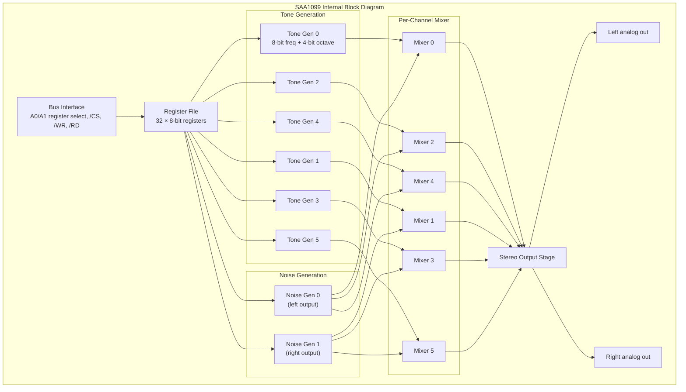
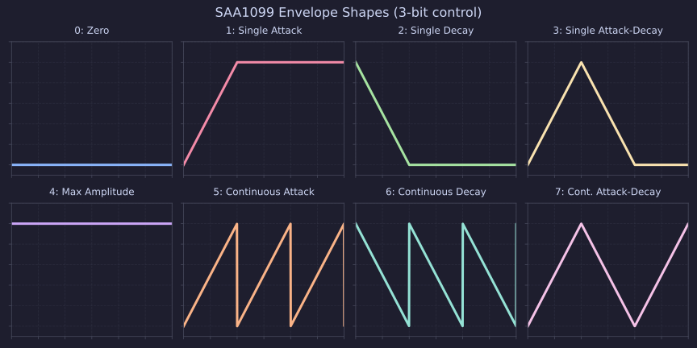

[← Home](../../README.md) · [Sound](../README.md) · [Hardware](README.md)

# SAA1099 — Philips PSG, the Six-Voice Stereo Alternative

> **Applies to**: A small slice of the **Soviet** clone ecosystem (ZXM-SoundCard and similar Nemo-Bus expansions) and **Original-track** cross-platform ports from the SAM Coupé. The SAA1099 was never built into any Sinclair or Amstrad Spectrum. Most of its ZX software library consists of SAM Coupé music ported to ZX clones fitted with the expansion.

---

## Overview

The Philips **SAA1099** is a 6-channel stereo Programmable Sound Generator designed by Philips in the early 1980s and used most prominently as the built-in sound chip of the **SAM Coupé** (1989) — the British machine sometimes described as the "Spectrum's successor." On the ZX Spectrum platform proper, the SAA1099 appears only as an expansion: the Mick Laboratory **ZXM-SoundCard** and a handful of similar Nemo-Bus boards. It was never standard equipment on any Sinclair, Amstrad, Pentagon, or Scorpion.

In capability, the SAA1099 sits between the AY-3-8912 and the Yamaha FM chips. It provides **twice the AY's polyphony** (6 tone channels vs 3), **true per-channel stereo panning** (each channel can be routed left, right, or both), and **two independent noise generators** — one per stereo side. The trade-off: it has no envelope generator as flexible as the AY's, no built-in I/O ports, and (unlike YM2203 or OPL4) no FM synthesis at all. It is a pure square-wave-plus-noise PSG, conceptually close to the AY but with the channel count doubled and stereo baked in.

> [!IMPORTANT]
> **The SAA1099 is not an AY clone or successor.** Despite the similar feature set (square waves, noise, volume registers), the register layout, bus protocol, and frequency encoding are completely different. AY-targeting software cannot drive an SAA1099 without a full rewrite, and vice versa. The two chips are alternatives, not compatible.

This article covers the SAA1099's architecture, the ZXM-SoundCard port decoding, the programming model, and the trade-offs versus the dominant AY/YM family. For the broader sound ecosystem, see [Sound Hardware Ecosystem Overview](sound_overview.md). For the AY chip itself, see [AY-3-8910 / 8912 / 8913 / YM2149F — PSG Silicon](ay_3_8912.md).

### Naming Convention

| Term | Meaning |
|---|---|
| **SAA1099** | The Philips part number for the PSG chip itself |
| **Philips PSG** | Common name for the SAA1099 family, distinct from the General Instrument AY PSG |
| **ZXM-SoundCard** | Mick Laboratory's multi-function sound card that includes a SAA1099 (among other chips) |
| **SAM Coupé** | The 1989 British home computer with built-in SAA1099 — the chip's primary native platform |
| **Tone channel** | One of the SAA1099's 6 square-wave generators |
| **Noise generator** | One of 2 dedicated noise sources, one per stereo side |

---

## Internal Architecture

The SAA1099 is a single-chip PSG containing six independent square-wave tone generators, two noise generators, a mixer, and a stereo output stage. All blocks are driven from a single external clock (typically 8 MHz on ZX expansions, derived from the system clock). The chip has no internal envelope ROM and no sample playback capability — every sound it produces is square-wave tones or noise.



### Tone Generation

Each of the six tone channels is a 12-bit programmable divider driven from the master clock. The frequency encoding splits into an 8-bit fine divider (the `FREQUENCY` register for that channel) and a 4-bit octave selector (the high nibble of the channel's `OCTAVE` register, which packs two channels per byte). The output frequency is:

\[ f_{out} = \frac{f_{clk}}{2 \times (256 \times \text{octave\_offset} + \text{freq})} \]

Where `octave_offset` is the octave register's value (0..7) and `freq` is the 8-bit frequency register (0..255). The octave register shifts the entire 8-bit range up or down by powers of two — same concept as the AY's coarse/fine tone period split, but encoded differently.

Compared to the AY's 12-bit tone period, the SAA1099's 8-bit-fine-plus-4-bit-octave layout provides **wider frequency range** at the cost of **coarser resolution at high frequencies**. The AY's 12-bit period register gives uniform resolution across its range; the SAA1099's octave scheme gives 256 steps per octave but larger absolute steps at high octaves.

### Noise Generation

The SAA1099 has **two independent noise generators** — a significant design choice. The AY has one noise generator shared by all three channels; the SAA1099 dedicates one noise source to the left stereo side and one to the right. Each noise generator has its own clock rate select (one of three preset divisors: `/2`, `/4`, `/16` of the master clock).

Each of the six tone channels can independently select whether to mix in noise generator 0, noise generator 1, or neither. This routing is controlled by bits in the per-channel mixer register. The result is that channels 0, 2, 4 typically pair with the left-side noise source, and channels 1, 3, 5 with the right-side noise source — but the composer can mix this in any combination.

The advantage over the AY is **independent noise textures per stereo side**. A drum kit, for example, can have a snare on the left and a hi-hat on the right with genuinely different noise colors, something impossible on the AY where all three channels share the same noise source.

### Volume, Envelope, and Stereo Routing

Each channel has independent **left** and **right** volume registers (0..15 each, logarithmic — same scale as the AY). This is the SAA1099's killer feature relative to the AY: **true per-channel stereo panning**. The AY has only one volume register per channel; on a stock 128K Spectrum, the channel simply goes to whichever side the hardware mono output is wired to. Stereo AY mods (ABC, ACB — see [Stereo Audio Modifications](stereo_audio.md)) route each AY channel to a fixed side, but the routing is soldered, not software-controlled.

With the SAA1099, software sets each channel's stereo position dynamically:
- Volume left = 15, volume right = 0 → channel plays only on the left.
- Volume left = 0, volume right = 15 → channel plays only on the right.
- Volume left = 15, volume right = 15 → channel plays centered (both sides).
- Any ratio in between → software-controlled stereo balance per channel.

The SAA1099 also has three envelope generators (shared between the six channels — each generator can be assigned to one of two channels). Envelope frequency, shape, and enable bits live in dedicated registers. The envelope system is **simpler than the AY's** — providing 8 deterministic shapes encoded in 3 control bits (compared to the AY's 16 shapes from 4 bits). For most music this is sufficient, but AY-style complex envelope tricks are not directly portable.



### Clock and Electrical Interface

The SAA1099 runs from an external clock input, typically 8 MHz on ZX expansions. This clock is divided internally to produce the tone and noise generator rates. The choice of 8 MHz (versus the AY's typical 1.77 MHz on the 128K Spectrum, or 1.75 MHz on Pentagon clones) means the SAA1099 can reach higher maximum frequencies but also needs a higher input rate to achieve low bass notes with reasonable resolution.

| Parameter | Value | Notes |
|---|---|---|
| **Master clock** | 8 MHz typical (ZX expansions) | SAM Coupé uses 7.09 MHz (derived from its video clock) |
| **Output** | Stereo analog, line-level | Two channels, summed internally from the six voices |
| **Package** | 40-pin DIP | Same pin count as AY-3-8910 / YM2149F, but pinout is different |
| **Power** | +5 V single supply | CMOS technology |
| **Bus interface** | A0/A1 register select, /WR strobe | Two address bits decode register vs data; classic 4-port pattern |

The SAA1099's bus protocol is **similar in spirit to the AY's** (write a register address, then write or read the data) but uses a different signal set. Where the AY uses `BDIR`/`BC1`/`BC2`, the SAA1099 uses `A0`/`A1` to directly select one of four operations (register address write, data write, data read, no-op). The protocol is actually simpler than the AY's, requiring less external decode logic.

---

## Port Decoding and Register Interface

On the ZX Spectrum, the SAA1099 appears only on expansion boards. The most documented implementation is the Mick Laboratory **ZXM-SoundCard** series, which decodes the SAA1099 at the following ports (per the [ZXM-SoundCard documentation](http://micklab.ru/My%20Soundcard/ZXMSoundCard.htm)):

| Port | Decoding | R/W | Purpose |
|---|---|---|---|
| `#FF` | A0=0, A1=0 (write), gated by `DOS/` and `IODOS/` | W | SAA1099 register address select |
| `#1FF` | A0=1, A1=0 (write), gated by `DOS/` and `IODOS/` | W | SAA1099 register data write |
| `#04FF` | (Light / Middle / Extreme revisions only) | W | SAA1099 register address select (alternate decode) |
| `#05FF` | (Light / Middle / Extreme revisions only) | W | SAA1099 register data write (alternate decode) |
| `#FFFD` | AY-compatible port, reused for clock gating | W | SAA1099 master clock enable/disable |

The original revisions (00–03) use `#FF` / `#1FF` for SAA1099 access, gated by the TR-DOS ROM select (`DOS/`) and the disk controller register enable (`IODOS/`) — this prevents collision with other devices that respond to those addresses during disk access. Later revisions (Light, Middle, Extreme) introduce the `#04FF` / `#05FF` ports as a cleaner decode that does not require the `DOS/` / `IODOS/` gating.

### Clock Gating as Soft Reset

The SAA1099 has **no hardware reset pin** — an unusual design choice by Philips. Without a reset signal, the chip's internal registers power up in an undefined state, and there is no clean way to return them to silence. The ZXM-SoundCard works around this by gating the SAA1099's master clock input with a control bit routed through the AY-compatible `#FFFD` port — the same port used to control the TSFM bank-select bits.

| `#FFFD` bit | Function (ZXM-SoundCard) |
|---|---|
| bit 0 (`SEL`) | TSFM chip-select (selects YM2203 chip 0 or chip 1) |
| bit 1 (`STAT`) | TSFM SSG/status register read select |
| bit 2 (`FM`) | TSFM FM generation enable (0 = on, 1 = off) |
| bit 3 (`SAA`) | SAA1099 master clock enable (0 = on, 1 = off) |

To "reset" the SAA1099, software writes `#FE` to `#FFFD`, which disables the master clock. With the clock stopped, the chip's internal counters freeze and the outputs go silent. Re-enabling the clock with `#F6` restarts the chip from a known-quiet state — not a true reset (the register contents are preserved), but functionally equivalent for silencing errant voices.

```z80
; -------------------------------------------------------
; "Reset" the SAA1099 by disabling and re-enabling its clock.
; Destroys: A, BC
; -------------------------------------------------------
SAA_SOFT_RESET:
    LD   BC,#FFFD
    LD   A,#FE           ; bit 3 = 1: SAA clock OFF
    OUT  (C),A
    LD   A,#F6           ; bit 3 = 0: SAA clock ON (other bits = 1, idle)
    OUT  (C),A
    RET
```

After this, software must still explicitly initialize all 32 SAA1099 registers to known values, because the previous register contents survive the clock gate.

### Register Map

The SAA1099 exposes **32 internal registers** (0..31), accessed via the two-port pattern: write the register address to port `#FF` (or `#04FF`), then write or read the data on port `#1FF` (or `#05FF`).

| Register | Function | Bits | Notes |
|---|---|---|---|
| `#00`–`#05` | Frequency (channels 0–5) | 8-bit | 256-step fine divider per channel |
| `#08`–`#0D` | Octave (channels 0–5) | 4-bit (high nibble of byte) | Octave select; two channels packed per register in some docs, but each channel has its own byte on the SAA1099 |
| `#10`–`#15` | Tone enable / noise routing (channels 0–5) | 3-bit | bit 0: tone on, bit 1: noise generator 0 mix, bit 2: noise generator 1 mix |
| `#18`–`#1D` | Left volume (channels 0–5) | 4-bit | 0..15, logarithmic; mute = 0 |
| `#20`–`#25` | Right volume (channels 0–5) | 4-bit | Independent left/right — this is the stereo panning |
| `#28` | Noise generator 0 control | 2-bit | Clock select: 0=/2, 1=/4, 2=/16 of master clock |
| `#29` | Noise generator 1 control | 2-bit | Same encoding, independent of gen 0 |
| `#2C` | Envelope generator 0 control | 8-bit | Shape + reset bits |
| `#2D` | Envelope generator 1 control | 8-bit | Shape + reset bits |
| `#2E` | Envelope generator 2 control | 8-bit | Shape + reset bits |
| `#1C` | Channel 0/1 envelope enable | 2-bit | bit 0: ch0 uses env0, bit 1: ch1 uses env1 |
| `#1D` | Channel 2/3 envelope enable | 2-bit | bit 0: ch2 uses env2, bit 1: ch3 uses env0 |
| `#1E` | Channel 4/5 envelope enable | 2-bit | bit 0: ch4 uses env1, bit 1: ch5 uses env2 |
| `#1F` | Global reset / sync | 8-bit | Write `#00` then `#FF` to reset all counters |
| `#2F` | Master reset | 8-bit | Write-only; clears all internal state |

---

## Programming Model

Writing to the SAA1099 follows the same shape as writing to the AY: pick a register address, then write the data. The difference is that the SAA1099's register set is denser — 32 registers versus the AY's 16 — and the two are written through different ports.

```z80
; -------------------------------------------------------
; Write a value to an SAA1099 register.
; Assumes ZXM-SoundCard revisions 00-03 (ports #FF/#1FF).
; For later revisions, replace #FF with #04FF and #1FF with #05FF.
; Entry: D = register number (#00..#1F)
;        E = value
; Destroys: A, B, C
; -------------------------------------------------------
SAA_WRITE_REG:
    LD   BC,#00FF        ; register address select port
    LD   A,D
    OUT  (C),A           ; select register
    LD   B,#01           ; BC = #01FF (register data port)
    LD   A,E
    OUT  (C),A           ; write data
    RET
```

This is structurally identical to the AY's `#FFFD` / `#BFFD` write pattern, just at different ports. The SAA1099 has no minimum delay between register-select and data writes (unlike the OPL4's 1.6 µs requirement) — the chip latches the address on the first write and the data on the second, with no bus-timing constraint that typical Z80 code violates.

### Triggering a Note (Channel 0, Center-Panned)

A complete note-on for SAA1099 channel 0 touches four registers: frequency, octave, tone enable, and left+right volume. This example plays A4 (440 Hz) on channel 0, centered in the stereo field, with no noise.

```z80
; -------------------------------------------------------
; Trigger SAA1099 channel 0 at A4 (440 Hz), centered.
; Assumes 8 MHz master clock.
; Destroys: A, B, C, D, E
; -------------------------------------------------------
SAA_PLAY_A4:
    ; --- Frequency: 8-bit divider = #38 (octave 3) ---
    LD   D,#00           ; channel 0 frequency register
    LD   E,#38
    CALL SAA_WRITE_REG

    ; --- Octave: 4-bit (high nibble of register #08) ---
    LD   D,#08           ; channel 0 octave register
    LD   E,%00110000     ; bits 4..7 = octave (3 in this case)
    CALL SAA_WRITE_REG

    ; --- Tone enable (no noise) ---
    LD   D,#10           ; channel 0 mixer/enable register
    LD   E,%00000001     ; bit 0: tone on, bits 1..2: noise off
    CALL SAA_WRITE_REG

    ; --- Left volume (15 = max) ---
    LD   D,#18           ; channel 0 left volume
    LD   E,15
    CALL SAA_WRITE_REG

    ; --- Right volume (15 = max, centered) ---
    LD   D,#20           ; channel 0 right volume
    LD   E,15
    CALL SAA_WRITE_REG
    RET
```

The note plays until the volumes are set back to 0 or the tone-enable bit is cleared. Compared to the AY equivalent (set period, set volume), this is more register writes — but each write is simpler (8-bit instead of split high/low), and the payoff is independent stereo panning per channel.

### Per-Frame Update Budget

A 50 Hz frame on a 3.5 MHz Z80 contains **70,000 T-states** (59,733 in contended RAM). Each SAA1099 register write costs ~40 T-states including routine overhead — the same as an AY register write. A typical SAA1099 player routine running at 50 Hz with all 6 channels active costs roughly **1,500 T-states per frame** (about 2% of the frame budget). This leaves ample headroom for game logic, graphics, or running the SAA1099 alongside an AY for combined 9-voice polyphony.

| Operation | T-states per Channel | Notes |
|---|---|---|
| Note-on (frequency + octave + enable + L/R vol) | ~200 | 5 register writes |
| Note-off (mute L + mute R) | ~80 | 2 register writes |
| Per-frame vibrato (frequency mod) | ~40 | 1 register write |
| Per-frame panning sweep (L vol + R vol) | ~80 | 2 register writes |

### Muting All Channels on Exit

Software that exits to BASIC without muting the SAA1099 leaves whatever was playing on the last frame running indefinitely. Always register an exit handler that writes 0 to every channel's left and right volume register.

```z80
; -------------------------------------------------------
; Silence all 6 SAA1099 channels. Call this on exit.
; Production code unrolls the loop because volume
; registers #18..#1D and #20..#25 are not contiguous.
; Destroys: A, B, C, D, E
; -------------------------------------------------------
SAA_SILENCE_ALL:
    LD   D,#18           ; left volume, channel 0
    LD   E,0
    CALL SAA_WRITE_REG
    LD   D,#19           ; left volume, channel 1
    CALL SAA_WRITE_REG
    LD   D,#1A           ; left volume, channel 2
    CALL SAA_WRITE_REG
    LD   D,#1B           ; left volume, channel 3
    CALL SAA_WRITE_REG
    LD   D,#1C           ; left volume, channel 4
    CALL SAA_WRITE_REG
    LD   D,#1D           ; left volume, channel 5
    CALL SAA_WRITE_REG
    LD   D,#20           ; right volume, channel 0
    CALL SAA_WRITE_REG
    LD   D,#21           ; right volume, channel 1
    CALL SAA_WRITE_REG
    LD   D,#22           ; right volume, channel 2
    CALL SAA_WRITE_REG
    LD   D,#23           ; right volume, channel 3
    CALL SAA_WRITE_REG
    LD   D,#24           ; right volume, channel 4
    CALL SAA_WRITE_REG
    LD   D,#25           ; right volume, channel 5
    CALL SAA_WRITE_REG
    RET
```

---

## Detection

Detecting a SAA1099 on a ZX Spectrum is more delicate than detecting an AY or TurboSound because the chip's ports (`#FF` / `#1FF`) collide with several other devices under partial address decoding. Port `#FF` in particular is also the floating bus readback address on 48K/128K machines, and several Soviet clones use `#FF` for unrelated expansion registers.

The standard detection strategy is:

1. **Verify the host machine type first.** If the machine is a stock 48K or 128K without expansions, there is no SAA1099 — skip the probe entirely.
2. **Gate the probe on the TSFM control bits at `#FFFD`.** The ZXM-SoundCard requires writing the correct `SAA` clock-enable bit before the SAA1099 responds. Writing `#F6` to `#FFFD` (clock on) then probing ports `#FF`/`#1FF` reduces false positives.
3. **Write a distinctive pattern to a write-only register and read it back.** The SAA1099's volume registers are write-only on real hardware — a read returns floating bus values. But the chip does have readable registers (the address pointer, on some revisions). Software targeting real hardware usually writes a tone-on pattern and listens for audible output — the only reliable detection.

For software targeting the ZXM-SoundCard specifically, the simplest reliable approach is to assume the chip is present if the host machine is known to be a ZXM-Phoenix or a KAY-256/1024 fitted with the card. Less invasive probing risks colliding with the floating bus and producing false positives.

### Historical Context

The SAA1099 was designed by Philips in the early 1980s for use in their own products and as a general-purpose sound chip for home computers and arcade boards. Its most prominent native platform is the **SAM Coupé** (1989), the British machine designed by Miles Gordon & Company as a successor to the ZX Spectrum 128K. The SAM Coupé shipped with a SAA1099 as its built-in sound chip — every other sound expansion on the ZX Spectrum has to be installed; the SAM Coupé was born with one.

The SAM Coupé community produced a substantial body of SAA1099-targeting music, primarily in the form of modules edited with **E-Tracker** (the SAM Coupé's native SAA1099 tracker). This body of music is the SAA1099's most important software asset — it is the only large music library for the chip, and most ZX-targeting SAA1099 players are ports of E-Tracker modules.

The ZX Spectrum adaptation is much smaller. Mick Laboratory's **ZXM-SoundCard** (the most documented implementation) was designed in the 2000s as a multi-function sound card combining TSFM (two YM2203 OPN chips) and the SAA1099 on one board. The motivation was partly technical (more voices than the AY alone) and partly nostalgic (the designer had a SAA1099 sitting unused for years and wanted to put it to work). Production numbers are small — likely a few hundred boards in total — but the design is fully open: schematics, CPLD firmware, and bills of materials are published for every revision.

The **E-Tunes** series (volumes 1–14+) by Mick Laboratory is the most visible SAA1099-targeting software on the ZX platform. These are music compilation disks that play SAM Coupé E-Tracker modules on ZX clones fitted with the ZXM-SoundCard. They demonstrate the chip's capabilities but also highlight its limited reach — the software is essentially unusable without the specific hardware.

---

## Comparison With Other ZX Sound Hardware

The SAA1099 is an awkward fit in the ZX sound ecosystem. It is more capable than the AY in raw channel count and stereo, but it lacks the AY's sophisticated envelope tricks, the FM chips' synthesis depth, and the sample-playback devices' PCM fidelity. Its niche is narrow: composers who want 6-voice PSG with true stereo panning, and who are willing to target a rare expansion board to get it.

| Hardware | Tone Channels | Noise | Stereo | Envelope | Era | Adoption |
|---|---|---|---|---|---|---|
| [AY-3-8912](ay_3_8912.md) | 3 | 1 (shared) | Mono (or modded ABC/ACB) | Flexible (10-bit period, 8 shapes) | 1985 | Universal |
| [TurboSound](turbosound.md) | 6 (2× AY) | 2 (shared per chip) | Per chip via mods | Per-chip AY envelopes | 1991 | Common on Soviet clones |
| [TurboSound FM](turbosound_fm.md) | 3 + 3 FM (YM2203) | AY + YM2203 SSG | Mono | AY + FM ADSR | 2000s | Rare |
| **SAA1099** | **6** | **2 (independent)** | **Per-channel, software-controlled** | Simpler (3 generators, 8-bit period) | 1980s (chip) / 2000s (ZX) | **Very rare on ZX** |
| [MoonSound](moonsound.md) | 24 wave + 18 FM | None | Per-channel | FM ADSR + sample loops | 1998 | Very rare |

The SAA1099's competitive position is interesting:
- **Versus the AY:** 2× polyphony, true stereo, but loses the envelope flexibility and the huge software library.
- **Versus TurboSound:** Same 6-voice polyphony, but SAA1099 has per-channel stereo panning while TurboSound's stereo requires hardware mod (ABC/ACB) and is fixed at install time. SAA1099 also has 2 independent noise generators vs TurboSound's 2 (one per AY).
- **Versus TurboSound FM:** SAA1099 has no FM, so it loses on timbral variety. But it has simpler programming model and no need for FM patch design.
- **Versus MoonSound:** Not comparable — MoonSound is in a different class entirely.

---

## Pitfalls and Best Practices

The SAA1099's small ZX install base means most pitfalls come from the chip's quirky design rather than from widespread software bugs. The three most common problems are port collisions with the floating bus, the missing hardware reset, and the assumption that SAM Coupé music ports cleanly to ZX clones.

### Pitfall 1: Port `#FF` Collision With Floating Bus

On 48K and 128K Spectrums, port `#FF` (read) returns the floating bus value — whatever the ULA or video memory happens to be doing at that instant. Software that tries to detect the SAA1099 by writing to `#FF` and reading back will always succeed (because the floating bus returns *something*), and that something is not the SAA1099's register contents.

**The Fix:** Never rely on reading back SAA1099 registers for detection on ZX hardware. The chip's registers are write-only in practical use anyway — the read path is unreliable across revisions. Detect the SAA1099 by listening for audible output, or by gating detection on the host machine type (ZXM-Phoenix, KAY with known ZXM-SoundCard fitted).

### Pitfall 2: Forgetting the Clock-Gate Soft Reset

The SAA1099 has no hardware reset pin. If a previous piece of software left voices playing and then exited, those voices continue indefinitely — there is no clean way to silence the chip other than writing 0 to every channel's left and right volume register (12 writes total) or using the ZXM-SoundCard's clock-gating trick (writing `#FE` then `#F6` to `#FFFD`).

**The Fix:** Always run a full initialization sequence at startup. Use the [clock-gating soft reset](#clock-gating-as-soft-reset) (one write to `#FFFD`), then explicitly set all 6 channels' left and right volume registers to 0. This guarantees a known-quiet state regardless of what ran before.

### Pitfall 3: Assuming SAM Coupé Music Plays Without Adaptation

SAM Coupé music written for E-Tracker uses the SAA1099 at the SAM Coupé's clock rate (7.09 MHz) and assumes the SAM Coupé's memory map, video timing, and interrupt source. ZX clones use a different SAA1099 clock (typically 8 MHz on ZXM-SoundCard), a different memory map, and a different interrupt source. Dropping a SAM Coupé module into a ZX player without adaptation produces output at the wrong pitch (clock mismatch) and possibly wrong timing (interrupt source mismatch).

**The Fix:** Port SAM Coupé music through a player that compensates for the clock difference. The Mick Laboratory **E-Tunes** series does exactly this — the player resamples the SAM Coupé frequency data to the ZX-side 8 MHz clock on the fly. Composers writing new music for the ZX-side SAA1099 should use frequency tables calculated for 8 MHz, not the SAM Coupé's 7.09 MHz.

### Best Practices

1. **Always run a full initialization at startup.** Either use the clock-gate trick or write 0 to every left/right volume register. Do not assume the previous software left the chip silent.

2. **Detect via host machine identification, not via port reads.** Port `#FF` returns floating bus values on most ZX hardware; SAA1099 register reads are unreliable. Gate detection on knowing the host is a ZXM-Phoenix or a KAY fitted with ZXM-SoundCard.

3. **Choose the correct port pair for the host revision.** Revisions 00–03 use `#FF` / `#1FF` (gated by `DOS/` and `IODOS/`); revisions Light/Middle/Extreme use `#04FF` / `#05FF`. Software that needs to support both should probe each pair and fall back gracefully.

4. **Use the per-channel stereo panning.** This is the SAA1099's defining advantage over the AY. Software that hard-pans all voices to center wastes the chip's main selling point.

5. **Always mute on exit.** Write 0 to every left and right volume register before returning to BASIC or to another program. The SAA1099 has no auto-mute.

6. **Run the player in the 50 Hz interrupt.** Same convention as every other ZX sound hardware.

### When to Use SAA1099

Choose SAA1099 when:
- You want **6-voice PSG with true per-channel stereo panning** and cannot or will not use TurboSound mods.
- You are porting SAM Coupé music that targets the chip natively.
- Your target audience includes ZXM-Phoenix or KAY-256/1024 owners with ZXM-SoundCard.

Avoid SAA1099 when:
- Your audience uses standard Spectrums without the expansion — reach will be near zero.
- You need envelope tricks beyond the SAA1099's simple 3-generator system (use AY or TurboSound instead).
- You want FM or sample playback (use TurboSound FM or General Sound / Covox instead).

### Cross-Platform Notes

| Platform | SAA1099 Support | Notes |
|---|---|---|
| **SAM Coupé** | Built-in | The chip's native platform. Software library is substantial (E-Tracker modules). |
| **ZX Spectrum (original)** | Not supported | No standard expansion exists. |
| **Pentagon / Scorpion / Kay** | Hardware expansion | ZXM-SoundCard (Mick Laboratory) — small production run, well-documented. |
| **ZXM-Phoenix** | Hardware expansion | Same ZXM-SoundCard, native fit. |
| **ZX Spectrum Next** | Not in default core | Could be implemented in FPGA; no shipping core includes it. |
| **Unreal Speccy** (emulator) | Emulated | Supports ZXM-SoundCard configuration. |
| **zesarux** (emulator) | Emulated | Supports ZXM-SoundCard configuration. |

---

## References and Further Reading

- [AY-3-8910 / 8912 / 8913 / YM2149F — PSG Silicon](ay_3_8912.md) — The dominant PSG on the ZX platform; baseline for comparing SAA1099 capabilities.
- [TurboSound — Dual and Triple AY Configuration](turbosound.md) — The more common alternative for 6-voice PSG on Soviet clones.
- [Stereo Audio Modifications](stereo_audio.md) — ABC/ACB mods for the AY; explains why SAA1099's software-controlled panning is a step up.
- [Sound Hardware Ecosystem Overview](sound_overview.md) — Where the SAA1099 fits in the broader ZX sound landscape.
- [Covox & SounDrive](covox_sounDrive.md) — The TLC7226CN subsection covers the SounDrive part of the ZXM-SoundCard, which often coexists with the SAA1099.
- [Mick Laboratory: ZXM-SoundCard](http://micklab.ru/My%20Soundcard/ZXMSoundCard.htm) *(in Russian)* — The primary source for the ZXM-SoundCard design. Includes full schematics, CPLD firmware source, and bills of materials for every board revision.
- **Philips SAA1099 Datasheet** — The primary source for register semantics and electrical characteristics. Available in scanned form from retro-computing archives.
- **SAM Coupé documentation** (`samcoupe.com`) — The SAM Coupé community maintains reference documentation for the chip's native platform, including E-Tracker module format.
- **World of SAM** (`worldofsam.org`) — Archive of SAM Coupé software, including most known E-Tracker music modules.

