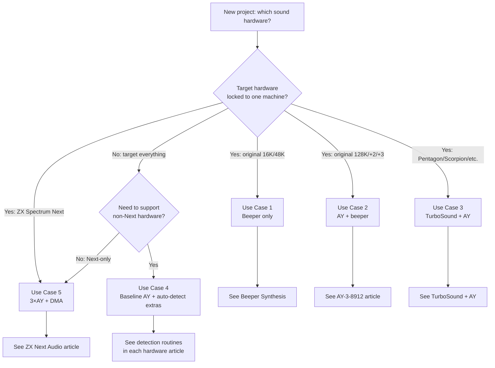

[← Home](../../README.md) · [Sound](../README.md) · [Hardware](README.md)

# Sound Hardware Ecosystem Overview — The Decision Guide

> **Applies to**: All tracks — **Original** (Sinclair/Amstrad 1982–1992), **Soviet** (Pentagon/Scorpion/Kay/ATM Turbo/Profi clones), and **New Gen** (ZX Spectrum Next and FPGA cores). This article is the navigation hub for the entire `06_sound/hardware/` section.

---

## Overview

No other 8-bit computer accumulated as many sound hardware options as the ZX Spectrum. Over 40 years, the platform accumulated a beeper, a PSG, a wavetable chip, an FM synthesizer, a sample-playback coprocessor, three different stereo modifications, and at least four distinct multi-chip configurations. A composer targeting the Spectrum in 2025 faces a real decision: which of these to support, which to ignore, and how to choose.

This article is the **decision guide**. It does not cover any single hardware in depth — that is the job of the dedicated articles linked throughout. Instead it answers four questions:

1. **What exists?** The full taxonomy of ZX sound hardware, with one-paragraph descriptions and links to deep-dives.
2. **When was each option relevant?** A chronology, so composers targeting a specific era can match the era's hardware.
3. **Which option fits which use case?** A decision matrix that maps use cases (game, demo, music disk, modern release) to recommended hardware.
4. **How do the options compare?** The single consolidated comparison table, pulling together data from every dedicated article.

### Naming Convention

| Term | Meaning |
|---|---|
| **Track (Original / Soviet / New Gen)** | The three parallel hardware streams covered by this knowledge base |
| **PSG** | Programmable Sound Generator — any square-wave chip (AY, SAA1099) |
| **FM** | Frequency Modulation synthesis (YM2203 OPN, OPL3/OPL4) |
| **PCM / DAC** | Pulse-Code Modulation — direct sample playback (Covox, SounDrive, GS) |
| **Wavetable** | Sample-based synthesis from ROM/RAM (OPL4's wavetable engine) |
| **Coprocessor** | A second CPU dedicated to audio (General Sound) |

---

## Taxonomy — What Exists

The ZX sound hardware ecosystem breaks into five families. Each family has a defining synthesis method and a typical era of relevance.

### Family 1: Built-In Sound (1982–1987)

These are the sound sources present on the motherboard of every stock Spectrum. They require no expansion and are guaranteed present on every machine.

- **1-Bit Beeper** — Every ZX Spectrum from the 16K to the +3 has a speaker driven by port `#FE` bit 4. The CPU produces audio by bit-banging this line (PWM), typically at the cost of 100% of CPU time. Demoscene composers later evolved this into multi-voice engines (Qchan, FuzzClick, Shiru's engines). See [Beeper Synthesis](../synthesis/beeper_synthesis.md).
- **[AY-3-8912 PSG](ay_3_8912.md)** — Built into every Spectrum from the 128K onward. 3-channel square-wave synthesis with one noise generator and a flexible envelope. The most widely-supported sound chip in the platform's history. The base register map and bus protocol are the foundation that TurboSound, TurboSound FM, and the ZX Spectrum Next's AY block all build on.

### Family 2: AY Expansions (1991–present)

The AY is so foundational that the Soviet clone scene evolved it into multi-chip configurations, doubling and tripling the polyphony.

- **[TurboSound](turbosound.md)** — Two AY/YM chips on the same bus, selected via a `#FF` bank-select port. 6-voice PSG. Standard on many Soviet clones (Pentagon, Scorpion GMX, ATM Turbo, Profi 5.1, Kay 1024).
- **[TurboSound FM](turbosound_fm.md)** — Adds a Yamaha YM2203 OPN FM chip alongside the AY. 3 voices of 4-op FM plus the AY's 3 PSG voices. The YM2203 also includes an SSG block that is itself AY-compatible.
- **[SAA1099](saa1099.md)** — Philips PSG with 6 tone channels, 2 noise generators, and per-channel stereo panning. Not an AY expansion per se but occupies the same niche (more PSG voices). Very rare on ZX — see ZXM-SoundCard.
- **[Stereo Modifications](stereo_audio.md)** — ABC, ACB, BytesDelight. These are hardware rewiring of the AY's three channels to fixed stereo positions. Not additional chips, but a permanent routing change.

### Family 3: Sample Playback (1987–present)

The Covox family moves from synthesized sound to **direct PCM sample playback**. Each voice is a single 8-bit byte written to a port per sample period. This produces any sound that can be recorded — drums, vocals, speech — but at the cost of high CPU load (the CPU is the playback clock).

- **[Covox / SounDrive](covox_sounDrive.md)** — Direct 8-bit DAC wired to a port. Single-channel Covox is one DAC; SounDrive is four DACs summed to stereo, allowing 4-channel MOD-style playback. Original 1995 design used ~40 discrete parts; modern implementations use a single TLC7226CN quad DAC.
- **[General Sound](gs_general_sound.md)** — A self-contained daughterboard with its own Z80 CPU running at 14 MHz, dedicated to sample mixing. The main Spectrum writes high-level commands ("play sample X on channel Y"); the GS does the rest. The only true CPU-offload option in the Soviet clone ecosystem.
- **[NeoGS](gs_general_sound.md#neogs)** — Modern redesign of General Sound (2010s) with improved firmware, larger RAM (128 KB+), faster Z80, and extended command set. Same port mapping (`#B3`/`#BB`) as original GS, with optional `#33` control port for divIDE conflict avoidance.
- **[DMA USC](dma_usc.md)** — DMA Ultra Sound Controller. A DMA-based sound card that offloads sample playback to hardware DMA transfers, reducing CPU load compared to software-driven Covox. Uses ports in the `#x777` range. Less common than GS but notable for its hardware DMA approach.

### Family 4: PC-Grade Synthesis (1998–present)

These are sound chips originally designed for PCs or arcade boards, adapted to the ZX bus by enthusiasts. They bring synthesis quality that the platform was never designed to have.

- **[MoonSound (OPL4)](moonsound.md)** — Yamaha YMF278B. 24 voices of wavetable sample playback (1 MB GM instrument ROM) + 18 voices of OPL3 FM synthesis. Originally designed for MSX, adapted to ZX in the 2000s. Extremely rare as real hardware; on the ZX platform today it is supported primarily by the **ZEsarUX** software emulator (since v6.1, 2017). FPGA MoonSound cores exist for MiSTer/DE10-Lite but target the MSX, not the ZX.
- **ZXM-MoonSound** — Mick Lab's ZX Spectrum implementation of MoonSound using YMF278 on ports `#C4`–`#C7`. Provides the same OPL4 capabilities as MSX MoonSound with ZX-bus-compatible decoding. See [MoonSound](moonsound.md).

### Family 5: Modern Integrated Subsystems (2017–present)

The **New Gen** track consolidates everything above into a single FPGA, often with new features that no original hardware had.

- **[ZX Spectrum Next Audio](zx_next_audio.md)** — Three FPGA-AY cores (TurboSound Next) + a DMA-driven 8-bit DAC (hardware sample playback, no CPU cost) + a legacy 1-bit beeper, all running simultaneously and summed in the FPGA. The canonical final state of Spectrum audio: every historical sound source plus modern hardware sample playback.

### Family 6: Combo Sound Cards (2000s–present)

These expansion cards bundle multiple sound chips on a single board, providing maximum compatibility in one install.

- **ZXM-SoundCard** — Mick Lab's all-in-one sound expansion. Combines **TurboSound FM** (2× YM2203 or compatible), **SAA1099** (6-voice stereo PSG), and **SounDrive** (4-channel DAC) on a single board. Effectively Family 2 + Family 3 + SAA1099 in one expansion. See [TurboSound FM](turbosound_fm.md), [SAA1099](saa1099.md), [Covox/SounDrive](covox_sounDrive.md).
- **ZXM-GeneralSound** — Mick Lab's General Sound implementation with added `#33` control port to avoid divIDE conflicts. See [General Sound](gs_general_sound.md).

---

## Chronology — When Each Was Relevant

| Year | Hardware | Track | Significance |
|---|---|---|---|
| 1982 | 1-bit Beeper | Original | ZX Spectrum 16K/48K launches with beeper only. |
| 1985 | AY-3-8912 PSG | Original | 128K Spectrum launches with built-in AY. Sets the baseline for 40 years of ZX music. |
| 1987 | Covox Speech Thing | Original (PC origin) | IBM PC hack inspires Soviet clone builders. |
| 1989 | SAM Coupé + SAA1099 | Original (non-ZX) | SAM Coupé launches with built-in SAA1099. The chip's primary native platform. |
| 1991 | TurboSound | Soviet | Pentagon / Scorpion scene popularizes 2× AY. |
| 1994 | General Sound | Soviet | X-Trade releases coprocessor card with dedicated Z80. |
| 1995 | SounDrive v1.02 | Soviet | Flash Inc. releases 4-channel hardware-mixed DAC. |
| 1996 | SounDrive v1.05 | Soviet | Revised port mapping (`#FB`/`#4F`/`#0F`/`#5F`) to avoid Kempston conflict. |
| 1998 | MoonSound (MSX) | Original (MSX origin) | Sunrise releases MoonSound for MSX. |
| 1999 | DMA USC | Soviet | DMA Ultra Sound Controller provides hardware DMA sample playback. |
| 2000s | TurboSound FM | Soviet | YM2203 OPN adaptation reaches Soviet clones. |
| 2000s | MoonSound (ZX adaptation) | Soviet / enthusiast | A handful of MoonSound boards adapted to ZX bus. |
| 2005 | ZXM-SoundCard | Soviet | Mick Lab releases TSFM + SAA1099 + SounDrive combo card. |
| 2008 | ZXM-GeneralSound | Soviet | Mick Lab's GS with `#33` control port for divIDE compatibility. |
| 2010 | NeoGS | Soviet | Modern redesign of General Sound with extended firmware. |
| 2012 | ZXM-MoonSound | Soviet | Mick Lab's ZX implementation of MoonSound (YMF278, ports `#C4`–`#C7`). |
| 2017 | ZX Spectrum Next | New Gen | Next ships with 3× FPGA AY + DMA + beeper in a single FPGA. |
| 2017 | ZEsarUX MoonSound | New Gen (emulator) | ZEsarUX 6.1 ships MoonSound-compatible port mapping. |

The chronology tells a story: the platform started with one beeper, gained one PSG, doubled the PSG, added FM, added sample playback, offloaded to a coprocessor, ported PC sound chips, and finally consolidated everything into a single FPGA. Each step added capability without removing what came before — modern ZX Spectrum Next hardware can run software written for any of these expansions.

---

## Port Conflict Matrix — What Cannot Coexist

The ZX Spectrum's I/O address space is only 256 bytes (8-bit port decoding on most peripherals), and many devices were designed independently without coordination. This leads to **port conflicts** — two devices responding to the same I/O address. Software must be aware of these conflicts to avoid data corruption or undefined behavior.

### Major Conflicts

| Port(s) | Device A | Device B | Conflict Description | Resolution |
|---------|----------|----------|----------------------|------------|
| `#FF` | **Beta 128 FDC** system port | **TurboSound** chip select | Both decode `#FF`. Writing TurboSound bank-select corrupts Beta 128 state and vice versa. | TurboSound on Beta 128 machines must gate writes behind a "Beta active" flag. Most software disables TurboSound access during disk operations. |
| `#B3`, `#BB` | **General Sound** | **divIDE** IDE interface | divIDE uses `#A3`–`#BF` for IDE; GS uses `#B3`/`#BB` for command/data. Overlap on `#B3`/`#BB`. | ZXM-GeneralSound adds `#33` control port to disable GS when divIDE is active. Software must toggle `#33` before/after GS access. |
| `#1F` | **Kempston Joystick** | **SounDrive v1.02** channel | SounDrive v1.02 uses `#1F` for one DAC channel; Kempston joystick reads from `#1F`. | SounDrive v1.05 moved to `#FB`/`#4F`/`#0F`/`#5F` to avoid conflict. Use v1.05 port map on systems with Kempston. |
| `#7FFD` | **128K memory paging** | (various) | Not a sound conflict per se, but sound drivers that page memory must preserve `#7FFD` state. | Sound drivers should never page out the memory bank containing their own code or sample data. |
| `#FE` | **ULA (border/beeper)** | (none direct) | Beeper bit-banging via `#FE` bit 4 conflicts with keyboard reads (same port). | Beeper engines must interleave keyboard scans between samples, or disable keyboard during playback. |

### Conflict-Free Combinations

These popular hardware combinations are known to coexist without port conflicts:

| Combination | Notes |
|-------------|-------|
| AY + TurboSound + SounDrive v1.05 | Standard Soviet clone setup. No conflicts if using v1.05 ports. |
| AY + divIDE + ZXM-GeneralSound | Use `#33` control port to disable GS during IDE access. |
| TurboSound FM + SAA1099 | ZXM-SoundCard bundles these; ports are disjoint. |
| MoonSound + AY | MoonSound uses `#C4`–`#C7`; no overlap with AY (`#FFFD`/`#BFFD`). |

### Detection Order Recommendation

When probing for multiple sound devices at startup, use this order to minimize false positives from conflicting ports:

1. **AY/TurboSound** — Always safe; `#FFFD`/`#BFFD` are standard.
2. **TurboSound FM** — Probe YM2203 timer after confirming AY presence.
3. **SAA1099** — `#00FF`/`#01FF` are relatively conflict-free.
4. **MoonSound** — `#C4`–`#C7` are conflict-free.
5. **General Sound** — Probe `#B3` status, but only if divIDE is not active.
6. **SounDrive** — Probe cautiously; port reads are unreliable.

> [!WARNING]
> **Never probe for General Sound (`#B3`/`#BB`) on a system with divIDE without first checking for divIDE presence.** Writing to `#B3` while divIDE is active can corrupt IDE state. The safest approach is to require user configuration rather than auto-detection on systems where both devices might be present.

---

## Decision Matrix — Which Hardware Fits Which Use Case

There is no "best" ZX sound hardware — only "best for this use case." A composer scoring a 48K-era game must target the beeper because that is the only hardware the audience will have. A composer scoring a modern Next-only demo should ignore the beeper entirely and use the DMA + 3×AY. The wrong choice either wastes effort (writing FM music that no one will hear) or wastes capability (writing 1-channel beeper music when the audience has MoonSound).

This section organizes the decision around **five recurring use cases**. Each use case has a clear primary recommendation, a fallback when the primary is unavailable, and a note on what to avoid.

### The Five Use Cases

| # | Use Case | Audience | Primary Constraint |
|---|---|---|---|
| 1 | **Historically accurate game (48K era)** | Emulation purists, original-hardware owners | Only beeper available |
| 2 | **Historically accurate game (128K era)** | Emulation purists, original-hardware owners | Only AY + beeper available |
| 3 | **Soviet clone scene release** | Pentagon / Scorpion / Kay owners | AY + TurboSound (where present) |
| 4 | **Modern cross-platform release (2020s)** | Mixed: emulators, clones, Next, FPGA cores | Maximize compatibility across all of the above |
| 5 | **ZX Spectrum Next exclusive** | Next and FPGA core users only | Full feature set, no need for fallbacks |

The categories are mutually exclusive — pick the one that matches the audience. A modern release can target category 4 by detecting hardware at runtime and falling back gracefully; a historically accurate release commits to one category and accepts its limits.

### Recommendation Table

| Use Case | Primary | Fallback | Avoid | Article |
|---|---|---|---|---|
| **1. 48K-era game** | 1-bit beeper | — | AY (no chip present on 16K/48K) | [Beeper Synthesis](../synthesis/beeper_synthesis.md) |
| **2. 128K-era game** | AY-3-8912 PSG | 1-bit beeper (SFX during AY music) | TurboSound (era-inappropriate; not built into any original Sinclair) | [AY PSG](ay_3_8912.md) |
| **3. Soviet clone release** | TurboSound (2× AY) | AY only (many clones have just one) | Covox-only (excludes stock AY clones without the DAC wired in) | [TurboSound](turbosound.md) |
| **4. Modern cross-platform** | AY + beeper (universal) | TurboSound, TSFM, MoonSound (auto-detect, mix in) | Next DMA-only (breaks all non-Next hardware) | [AY PSG](ay_3_8912.md) + runtime detection |
| **5. ZX Spectrum Next exclusive** | 3× FPGA AY + DMA sample playback | — | Beeper (redundant — DMA supersedes it) | [ZX Spectrum Next Audio](zx_next_audio.md) |

> [!IMPORTANT]
> **For category 4 (modern cross-platform), runtime detection is mandatory.** The composer writes a baseline AY score (universal) and then layers optional extras — TurboSound parts, MoonSound instruments, DMA samples — each gated behind a detection probe. See the detection routines in [MoonSound](moonsound.md#detection) and [SAA1099](saa1099.md#detection) for the probe code.

### Decision Flowchart

The flowchart collapses to a single rule: **if you know the audience, the hardware is decided for you.** The only case requiring real engineering work is Use Case 4 (modern cross-platform), where detection and graceful degradation must be designed in from the start.

---

## Consolidated Comparison Table

This single table pulls together the headline specifications from every dedicated hardware article. Use it for side-by-side comparison; follow the article links for depth. All CPU-load figures assume a 50 Hz frame rate (70,000 T-states per frame).

| Hardware | Voices | Synthesis | Stereo | CPU Load | Detection | Era |
|---|---|---|---|---|---|---|
| **[Beeper](../synthesis/beeper_synthesis.md)** | 1–4 (engine-dependent) | 1-bit PWM | No | **100%** (engine running) | Always present | 1982 |
| **[AY-3-8912](ay_3_8912.md)** | 3 tone + 1 noise + 1 envelope | Square-wave PSG | Mono (or stereo mod) | **<1%** (register writes only) | `#FFFD`/`#BFFD` probe | 1985 |
| **[TurboSound](turbosound.md)** | 6 tone + 2 noise | 2× AY PSG | Yes (chip-routed) | **<2%** | `#FF` bank probe | 1991 |
| **[TurboSound FM](turbosound_fm.md)** | 3 FM + 3 AY (SSG) + 3 AY | FM + PSG | Yes | **<5%** | YM2203 timer probe | 2000s |
| **[SAA1099](saa1099.md)** | 6 tone + 2 noise | Square-wave PSG | Yes (per-channel) | **<2%** | Register readback | 1989 |
| **[Covox / SounDrive](covox_sounDrive.md)** | 1–4 PCM channels | 8-bit DAC | Yes (SounDrive) | **100%** (CPU is clock) | Optional (unreliable) | 1987/1995 |
| **[General Sound](gs_general_sound.md)** | Up to 4 (typical) | Sample mixing on Z80 @ 14 MHz | Yes | **<5%** (offloaded) | Status port `#B3` | 1994 |
| **[NeoGS](gs_general_sound.md#neogs)** | Up to 8+ | Enhanced GS firmware | Yes | **<5%** (offloaded) | Status port `#B3` | 2010 |
| **[DMA USC](dma_usc.md)** | 1–4 PCM channels | Hardware DMA playback | Yes | **<10%** (DMA offload) | Port `#x777` probe | 1999 |
| **[MoonSound (OPL4)](moonsound.md)** | 24 wavetable + 18 FM | Wavetable + FM | Yes | **<10%** (busy-flag polling) | OPL3 timer probe | 1998 |
| **[ZX Spectrum Next](zx_next_audio.md)** | 9 AY + DMA + beeper | All of the above | Yes (TBBlue) | **<5%** (DMA offloads PCM) | TBBlue reg `#2A`/`#2B`/`#2C` | 2017 |

### How to Read This Table

- **CPU Load** is the per-frame cost of a typical music update, **not** including the game's main loop. A 100% figure means the music engine owns the CPU for the entire frame and the game must run between frames (or be paused during music).
- **Detection** is the recommended runtime probe. **"Always present"** means no probe needed. **"Optional"** means the hardware cannot be reliably auto-detected and the user must configure it.
- **Era** is the year the hardware became practically available to ZX composers, not the year the chip itself was designed (e.g., MoonSound is dated to 1998 — its MSX release — not to its 2000s ZX adaptation).
- **Stereo** distinguishes between **mono** (single output channel), **chip-routed** (fixed routing per channel, like TurboSound's two chips), and **per-channel** (software-selectable pan, like SAA1099 and OPL4).

---

## Per-Platform Summary — What Each Machine Has Built-In

The decision matrix above tells you what to target; this section tells you **what each physical machine actually contains**. Use this to predict the audience for a given piece of music: a release targeting "any AY Spectrum" works on every machine below from the 128K onward; a release targeting TurboSound works only on the machines in the Soviet clone section.

### Original Track (Sinclair / Amstrad)

| Machine | Year | Beeper | AY | Notes |
|---|---|---|---|---|
| ZX Spectrum 16K / 48K | 1982 | ✓ | — | Beeper only. The 48K is the canonical demoscene target for beeper music. |
| ZX Spectrum 128 / +2 / +2A / +3 | 1986–1987 | ✓ | ✓ (AY-3-8912) | Built-in AY on `#FFFD`/`#BFFD`. The baseline for all AY-targeting software. |

Because the ZX Spectrum architecture relies on standard Z80 I/O port mapping, **any sound expansion card can technically be integrated with any Spectrum model or clone**. Whether attached via the original Sinclair rear edge connector or plugged into clone-specific expansion slots (such as the ZX-Bus or Nemo-Bus), peripherals like TurboSound, Covox, General Sound, and TSFM are fundamentally universal add-ons. 

They are not strictly tied to specific motherboards; their availability is entirely dependent on what the user has chosen to install. Consequently, software cannot rely on the host machine type to infer sound capabilities. The software's job is simply to probe the relevant I/O ports at runtime to detect their presence.

---

## References and Further Reading

### Internal Cross-References

The dedicated hardware articles (in the recommended reading order for a newcomer to the ecosystem):

1. **[AY-3-8910 / 8912 / 8913 / YM2149F — PSG Silicon](ay_3_8912.md)** — The foundation. Read this first; every other PSG-related article assumes its register map and bus protocol.
2. **[Stereo Modifications](stereo_audio.md)** — The earliest expansion. ABC / ACB / BytesDelight wiring, trade-offs, and detection.
3. **[TurboSound](turbosound.md)** — The Soviet 2× AY bank-switched scheme. The most common multi-chip configuration.
4. **[TurboSound FM](turbosound_fm.md)** — YM2203 OPN FM expansion.
5. **[SAA1099 — Philips PSG](saa1099.md)** — The 6-voice stereo alternative, rare on ZX but historically important.
6. **[Covox / SounDrive](covox_sounDrive.md)** — Direct 8-bit PCM sample playback, including the modern TLC7226CN single-chip implementation and detailed port/channel mapping.
7. **[General Sound / NeoGS](gs_general_sound.md)** — The coprocessor-based sample-mixing daughterboard and its modern NeoGS redesign.
8. **[DMA USC](dma_usc.md)** — DMA Ultra Sound Controller for hardware-offloaded sample playback.
9. **[MoonSound (OPL4)](moonsound.md)** — Yamaha wavetable + FM synthesis, including ZXM-MoonSound implementation.
10. **[ZX Spectrum Next Audio](zx_next_audio.md)** — The FPGA consolidation of all of the above.

Related synthesis articles (not in this `hardware/` subdirectory):

- **[Beeper Synthesis](../synthesis/beeper_synthesis.md)** — Engines for the 1-bit beeper.
- **[AY Synthesis](../synthesis/ay_ym_synthesis.md)** — Composing for the AY register set.
- **[Sample / PCM Synthesis](../synthesis/beeper_synthesis.md)** — Working with Covox, GS, and DMA.

### External Resources

- **[ZX Spectrum on Wikipedia](https://en.wikipedia.org/wiki/ZX_Spectrum)** — Platform history.
- **[AY-3-8910/8912 datasheet ( datasheets.chipdb.org)](https://datasheets.chipdb.org/General-Instrument/ay-3-8910.pdf)** — Original PSG datasheet.
- **[World of Spectrum — Hardware List](https://worldofspectrum.net/faq/hardware.htm)** — Community hardware reference.
- **[Speccy Wiki ( info.sonicretro.com / Speccy wiki)](https://swiki.cfg8.pl/)** — Soviet-clone-centric wiki covering TurboSound, GS, TSFM, Covox variants.
- **[Mick Lab ZXM-SoundCard page](http://micklab.ru/My%20Soundcard/ZXMSoundCard.htm)** — Combined TSFM + SAA1099 + SounDrive card.
- **[MSX Resource Center — MoonSound](https://www.msx.org/wiki/Moonsound)** — MoonSound from its native MSX perspective.
- **[ZX Spectrum Next Registry Reference](https://specnext.dev/~repo/doc/)** — TBBlue register definitions for the Next's sound subsystem.
- **[Shiru's ZX music hardware collection](http://shiru.untergrund.net/software.shtml)** — Reference music engines for every ZX sound chip.

### Closing Note

The ZX Spectrum's sound ecosystem looks chaotic from the outside — eight hardware targets, three platform tracks, and forty years of accretion. From the inside it has a clear structure: **the AY is the universal baseline**, everything else is layered on top, and modern FPGA hardware (ZX Spectrum Next, MISTer) collapses the entire taxonomy into a single machine that can be every Spectrum at once. Composers who internalize the AY register map and the runtime detection pattern can move freely between every other option.