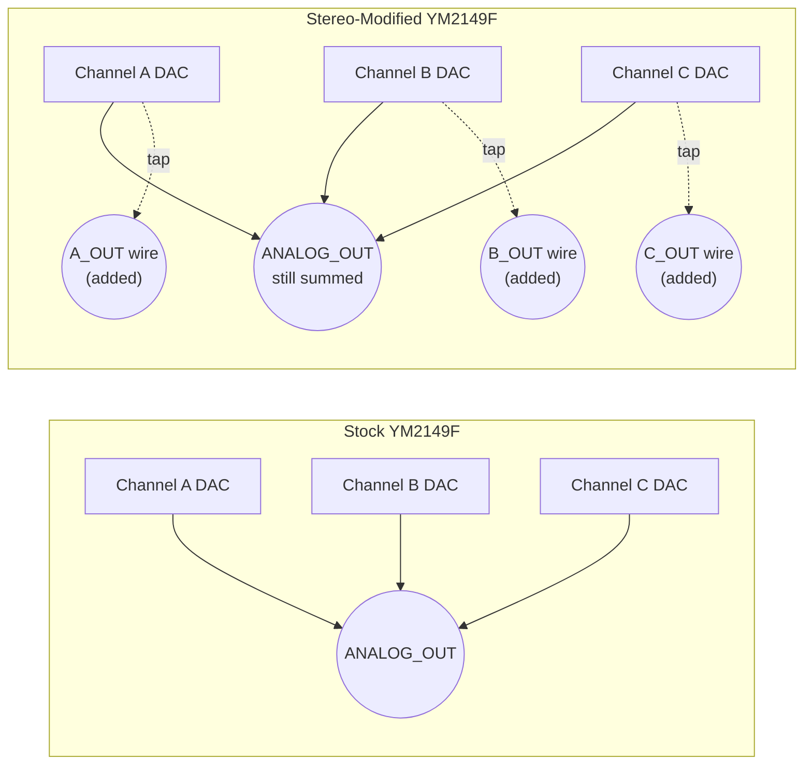
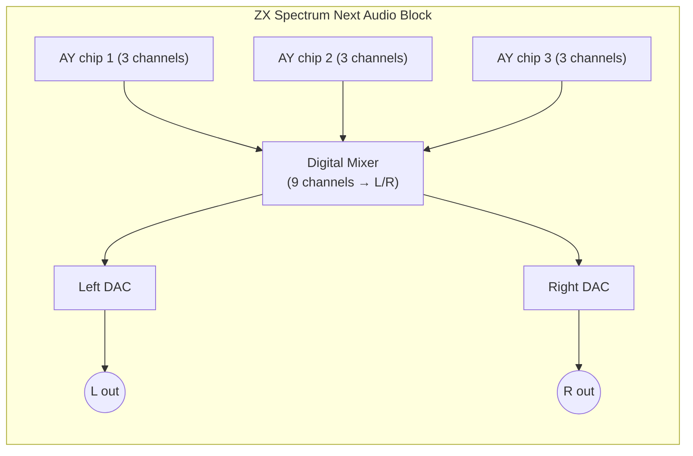

[← Home](../../README.md) · [Sound](../README.md) · [Hardware](README.md)

# Stereo Audio Modifications — ABC, ACB, BytesDelight, and the Holy War That Defined a Scene

> **Applies to**: All tracks with an AY/YM chip — Original (128K/+2/+2A/+3 modified), Soviet (Pentagon, Scorpion, ATM Turbo, Kay with stereo expansion), New Gen (ZX Spectrum Next with built-in stereo). The ZX Spectrum 48K is mono-beeper only and is not covered here.

---

## Overview

The AY-3-8910 has **three independent tone channels** — A, B, and C — but only a **single analog output pin** that sums them passively. Every unmodified ZX Spectrum from 1986 to 1992 produces **mono audio**. This is a frustrating design constraint for a chip that was otherwise well-suited to musical polyphony: three channels, three voices, three instruments — but they all come out of one speaker, indistinguishable from each other in space.

The fix is a **hardware modification**: intercept the three channel signals *before* they sum inside the chip, route them through separate amplifiers, and present them at left and right output jacks. This sounds trivial — and electrically, it is. But the question of **which channel goes where** produced one of the most enduring holy wars in the ZX Spectrum community. Two competing schemes — **ABC** and **ACB** — divide the Russian-language scene to this day, with partisans on each side who insist the other sounds "wrong." Some Western chiptune authors, learning of the dispute for the first time, refuse to believe it exists. It exists.

This article covers the electrical basis for stereo modification, the four canonical routing schemes (ABC, ACB, Mono-Compatibility, and Pentagon-default), the per-clone hardware implementations, the **musical implications** of each choice, the BytesDelight and other advanced modifications, and how the ZX Spectrum Next's built-in stereo resolves (or fails to resolve) the holy war.

> [!NOTE]
> **Why this article exists separately from the chip reference**: The [AY-3-8912 hardware article](ay_3_8912.md) describes what the chip does. This article describes what **the community did to it** — the analog output circuit modifications, the cultural decisions about channel routing, and the software implications. The two articles are complementary; read the chip reference first if you don't yet know what `ANALOG_OUT` and the three channel DACs are.

---

## Electrical Basis — Where to Tap the Signal

The AY-3-8912 is a **monolithic chip** — the three channel DACs and their summing node are physically on the die, inaccessible from outside. The `ANALOG_OUT` pin carries only the **already-summed mono signal**. To get per-channel audio out of the chip, you have to use one of these three techniques:

### Technique 1: The AY-3-8910 (40-Pin) External Resistor Trick

The AY-3-8910 (40-pin) and YM2149F expose a separate pin called **`CHANNEL_B_OUT`** in addition to `ANALOG_OUT`. This pin carries Channel B's signal *before* summing — useful for testing during manufacture, but also the basis of the simplest stereo mod. By tapping `CHANNEL_B_OUT` directly, you get Channel B in isolation, and `ANALOG_OUT − CHANNEL_B_OUT` (via a differential amplifier) gives you Channels A+C summed.

**Limitations**:
- Only works on the 40-pin AY-3-8910 / YM2149F
- The ZX Spectrum 128K uses the 28-pin AY-3-8912 — no `CHANNEL_B_OUT` pin available
- Gives only a 2-channel split (B vs A+C), not full 3-way stereo

### Technique 2: Decapitation and Bond Wire Tapping (Invasive)

For true 3-way stereo on the AY-3-8912, the only hardware-level solution is to **physically cut the bond wires** between the channel DACs and the internal summing node. This requires:

1. Decapping the chip (dissolving the plastic package with sulfuric acid)
2. Identifying the three bond wires from the channel DACs to the summing node
3. Cutting each bond wire with a surgical scalpel under a microscope
4. Re-attaching wires from each bond pad to new output pins (or to a daughterboard)

This is the technique used in the famous **BytesDelight modification** (1991, see [BytesDelight Section](#bytesdelight-modification)). It destroys the chip — if you make a mistake, the chip is dead. Successful BytesDelight-modified chips are rare collectors' items.

### Technique 3: Wire Wrapping the Yamaha YM2149

The YM2149F (40-pin) used in most Soviet clones exposes the three channel outputs on internal bond pads that are accessible without decapping by **carefully drilling through the top of the plastic package** at specific locations. Soviet modders developed this technique in the early 1990s using documentation leaked from Yamaha's Russian distribution partner. The result is a YM2149 with **three additional wires** soldered to the package, each carrying one channel's signal.



This is the basis of the Soviet Pentagon / Scorpion stereo scene. The modification requires significant skill and a steady hand, but became standard practice in the late 1990s.

### Technique 4: Modern FPGA Implementations

The ZX Spectrum Next, MiSTer FPGA core, MiST, ZX-Uno, and other FPGA-based platforms reproduce the AY at the HDL level. There is no "chip to modify" — the FPGA fabric can be configured to expose three separate analog outputs (or even three separate DACs) with no physical modification at all. This is why the ZX Spectrum Next ships with **true hardware stereo** out of the box.

FPGA implementations also resolve the holy war by **making the routing configurable in software** — Next software can choose ABC, ACB, or any other routing at runtime via a register write. See [ZX Spectrum Next Audio](zx_next_audio.md) for details.

---

## The Four Routing Schemes

Once you have three independent channel signals available, the question becomes: **which channel goes to which speaker?** With three channels and two speakers, one channel must be either summed into both (center), or sacrificed (mono-compatibility). The ZX Spectrum community converged on four canonical answers.

### Scheme 1: ABC Routing (The Soviet Standard)

```
┌───────────┐ ┌───────────┐ ┌───────────┐
│ Channel A │ │ Channel B │ │ Channel C │
│     │     │ │     │     │ │     │     │
│     ▼     │ │     ▼     │ │     ▼     │
│   LEFT    │ │  CENTER   │ │   RIGHT   │
│           │ │ (L + R)   │ │           │
└───────────┘ └───────────┘ └───────────┘
```

ABC routing sends Channel A to the left speaker, Channel B to both speakers (center), and Channel C to the right. This produces a **conventional left-center-right panorama** and is the standard for the Soviet / Russian-language scene.

**Why ABC won in Russia**: The Soviet demoscene's earliest organized music competitions (CC '93 in Moscow, the Ernst Muling-founded AY chart) standardized on ABC because it produces the most **musically predictable** panorama — lead melody on the left, rhythm on the right, harmony in the center. Trackers like Sound Tracker (1990) and Pro Tracker 3 (1995–2003) wrote modules assuming ABC routing.

### Scheme 2: ACB Routing (The Alternative)

ACB routing puts Channel A in the **left** speaker, Channel C in the **center** (both speakers), and Channel B in the **right** speaker:

```
┌───────────┐ ┌───────────┐ ┌───────────┐
│ Channel A │ │ Channel B │ │ Channel C │
│     │     │ │     │     │ │     │     │
│     ▼     │ │     │     │ │     ▼     │
│   LEFT    │ │     │     │ │  CENTER   │
│           │ │     │     │ │ (L + R)   │
│           │ │     ▼     │ │           │
│           │ │   RIGHT   │ │           │
└───────────┘ └───────────┘ └───────────┘
```

ACB routing swaps Channels B and C in the panorama. The result sounds subtly different — the rhythm (often in Channel B in module files) moves to the right, while the harmony (often in Channel C) moves to the center. Many listeners find ACB produces a **warmer, more balanced sound** because the center channel (where the ear is most sensitive to phase coherence) carries the harmony rather than the rhythm.

**Why ACB has partisans**: The earliest AY music in the West (particularly on the Atari ST) used ACB because of how the YM2149's `CHANNEL_B_OUT` pin made Channel B the easiest to extract individually. Western AY modules from 1985–1990 were composed assuming ACB. When the Russian scene exploded in the early 1990s and standardized on ABC, music written for ACB sounded "wrong" on Russian hardware — and vice versa. The holy war was born.

### Scheme 3: Mono Compatibility (No Center)

```
┌───────────┐ ┌───────────┐ ┌───────────┐
│ Channel A │ │ Channel B │ │ Channel C │
│     │     │ │     │     │ │     │     │
│     ▼     │ │     ▼     │ │     ▼     │
│   LEFT    │ │   LEFT    │ │   RIGHT   │
│           │ │           │ │           │
│           │ │           │ │           │
└───────────┘ └───────────┘ └───────────┘
```

This scheme puts Channels A and B in the left speaker and Channel C in the right — no center channel. The result is 2:1 stereo separation with no mono-compatible content. Music played on a mono system loses 2/3 of the channels, which is unacceptable for most uses.

**When this is used**: Mostly as a debugging / preview mode in emulators, or as a deliberate "extreme stereo" effect in some modern chiptunes. Not standard on any hardware.

### Scheme 4: Pentagon Default (Full Mono)

```
┌───────────┐ ┌───────────┐ ┌───────────┐
│ Channel A │ │ Channel B │ │ Channel C │
│     │     │ │     │     │ │     │     │
│     └─────┼─┤<─────────┼─┘     │     │
│           │ │     │     │ │           │
│           │ │     ▼     │ │           │
│           │ │   BOTH    │ │           │
│           │ │ SPEAKERS  │ │           │
│           │ │ (mono)    │ │           │
└───────────┘ └───────────┘ └───────────┘
```

The **stock Pentagon** has no stereo mod at all — all three channels go to both speakers (full mono). This is because the Pentagon's design priority was low cost, and the Soviet stereo modding scene was a hobbyist aftermarket. Most Pentagon software from 1990–1995 assumes mono.

---

## Comparison Summary

| Scheme | A in | B in | C in | Mono-compatible? | Region |
|---|---|---|---|---|---|
| **ABC** | Left | Center | Right | Yes (B audible in mono) | Russia / post-Soviet (default) |
| **ACB** | Left | Right | Center | Yes (C audible in mono) | Western Atari ST, modern optional |
| **Mono (L:L R:R)** | Left | Left | Right | No (2/3 lost) | Debug / extreme effect |
| **Pentagon default** | Mono | Mono | Mono | Yes | All unmodified Pentagons |
| **B + (A-C)** | Diff | Solo | Diff | Yes (B audible) | BytesDelight (B in center) |

The musical implications of each scheme are explored in depth in [The AY Sound: Perception, Emotion, and the Hardware Soul](../synthesis/ay_ym_perception.md).

---

## Per-Clone Stereo Implementations

### Pentagon 128 / 512 / 1024

The stock Pentagon is **mono**. The most common aftermarket stereo mod is the so-called **"Pentagon ABC"** kit, which adds a small daughterboard with three op-amps and a 4-pin header for connection to a modified YM2149 (with the three channel taps described in [Technique 3](#technique-3-wire-wrapping-the-yamaha-ym2149)). The daughterboard mounts inside the case near the AY chip and provides a 3.5mm stereo headphone jack on the rear panel.

**Specification**:
- Routing: ABC (default kit) or ACB (alternative jumper setting)
- Output level: ~1V peak-to-peak per channel
- Output impedance: ~100 Ω (suitable for headphones or line-in)
- Power: +5V from the motherboard, ~30 mA current draw
- Cost: ~$5 in 1995 (Russian components)

### Scorpion 256 / GMX

The Scorpion GMX expansion (1995+) includes a **built-in stereo amplifier** on the main board. The GMX uses a dedicated stereo op-amp (typically a Soviet K574UD2 or imported LM358) with three input channels (A, B, C) and two outputs (L, R). The routing is configurable via a 3-pin jumper block:

- Jumper position 1: ABC routing
- Jumper position 2: ACB routing
- Jumper position 3: Mono (all channels both speakers)

This makes the Scorpion GMX the **most stereo-friendly Soviet clone** — every machine shipped from 1995 onward has the capability built in, with no aftermarket modification required.

### ATM Turbo

The ATM Turbo (versions 1, 2, and 3) includes a stereo amplifier similar to the Scorpion GMX, but with a more elaborate feature set. In addition to ABC/ACB switching, the ATM Turbo allows per-channel volume control via an onboard analog multiplexer — useful for chiptune performances where the musician wants to emphasize one channel over the others.

The ATM Turbo 2+ and 3 also support **TurboSound** (dual AY), which gives six channels — three per stereo side. This produces a much richer stereo image than the single-AY stereo mods.

### Kay 1024

The Kay 1024 includes a built-in stereo amplifier with fixed ABC routing — no jumpers, no configuration. The Kay's stereo implementation is notable for using **high-quality NE5532 op-amps** (imported) rather than Soviet-era parts, giving it a cleaner sound than the Pentagon or Scorpion.

### Profi 5.1

The Profi 5.1 (and later models) include a programmable stereo routing chip that allows software to select ABC, ACB, mono, or any custom routing at runtime. This is the only Soviet clone with **software-controlled routing** — predating the ZX Spectrum Next's similar capability by 15 years.

### ZX Spectrum Next (Modern)

The ZX Spectrum Next includes **true hardware stereo** out of the box, with three independent DACs and configurable routing via the `StereoMix` register. Software can select ABC, ACB, mono, or any of 16 possible channel-to-speaker mappings at runtime.



See [ZX Spectrum Next Audio](zx_next_audio.md) for the complete Next audio reference.

---

## <a id="bytesdelight-modification"></a>The BytesDelight Modification

The most famous — and most invasive — stereo modification was developed in the Netherlands in **1991** by **BytesDelight**, a small hardware hacking group associated with the Dutch demo group *ST Software*. The BytesDelight mod took a different approach from the Soviet wire-wrap technique:

### Design Philosophy

Instead of tapping the channel DACs inside the chip, the BytesDelight mod **replaces the entire AY-3-8912** with a small daughterboard containing three custom DACs and an LM386 stereo amplifier. The daughterboard plugs into the AY socket and presents the same bus interface to the host computer — the Z80 sees a stock AY-3-8912 — but the analog output is fully under the daughterboard's control.

### Features

- **Three discrete 8-bit DACs** (one per channel) — replaces the AY's 4-bit logarithmic DACs with linear 8-bit DACs for cleaner sound
- **Software-controlled routing** — a write to a custom register selects ABC, ACB, mono, or any of 6 additional routing combinations
- **Per-channel volume** — independent 8-bit volume control for each channel (the stock AY only has 4-bit volume)
- **Headphone amplifier** — drives modern headphones directly, no external amp needed

### Compatibility

The BytesDelight mod is **100% software-compatible** with stock AY software. The bus protocol is identical, the register map is identical, and the analog output respects the same volume/envelope semantics. Software written for the stock AY runs unmodified and sounds better — wider stereo, cleaner DACs, more headroom.

The only software that *doesn't* work correctly is software that **reads the floating-bus value** during AY access — the BytesDelight daughterboard doesn't reproduce the exact floating-bus behavior of the original chip, breaking a few copy protection schemes that depend on it.

### Why It Didn't Catch On

The BytesDelight daughterboard was expensive (~$80 in 1991, equivalent to ~$180 in 2026 dollars) and required professional installation (desoldering the AY and installing a precision socket). Only a few hundred units were made. Today, BytesDelight-modified Spectrums are rare collectors' items, sought after by chiptune performers who want the cleanest possible AY sound.

The BytesDelight design philosophy — **replace the analog path while preserving the digital interface** — was resurrected in the modern era by FPGA implementations. The ZX Spectrum Next, MiSTer, and other FPGA platforms effectively implement a software-configurable BytesDelight-style mod as their default audio path.

---

## Software Implications

### How Trackers Assume Routing

Most ZX Spectrum trackers do not have an explicit "stereo routing" setting — they assume one based on the regional conventions of the author:

| Tracker | Region | Default Routing |
|---|---|---|
| Sound Tracker (1990) | Russia | ABC |
| Pro Tracker 1.x (1992) | Russia | ABC |
| Pro Tracker 2.x (1993) | Russia | ABC |
| Pro Tracker 3.x (1995–2003) | Russia | ABC (configurable) |
| Vortex Tracker II (2003–present) | Russia | ABC (configurable in Project Settings) |
| Arkos Tracker 1 (2006–2017) | France | ABC (configurable) |
| Arkos Tracker 2/3 (2017–present) | France | Configurable, defaults to mono-compatible ABC |
| SoundTracker NG (modern) | Various | Configurable, defaults to ABC |

A composer writing in Vortex Tracker II with the default settings creates a module that sounds "correct" on ABC hardware. Playing the same module on ACB hardware produces a subtly different — and many would say "wrong" — stereo image. The composer's intent is preserved only when the playback routing matches the composition routing.

### Software Routing Selection (on Supported Hardware)

On the ZX Spectrum Next, software can select the routing at runtime:

```z80
; ----------------------------------------------------------------
; Configure ZX Spectrum Next audio routing (Next register $FF)
; ----------------------------------------------------------------

; --- ABC routing (Channel A=left, B=center, C=right) ---
NEXT_SELECT_STEREO_ABC:
        LD   BC,#243B          ; Next register select port
        LD   A,$FF              ; Stereo configuration register
        OUT  (C),A
        LD   B,#25             ; BC = #253B (Next register data port)
        LD   A,%00000000       ; Bits 0-2: 000 = ABC
        OUT  (C),A
        RET

; --- ACB routing (Channel A=left, C=center, B=right) ---
NEXT_SELECT_STEREO_ACB:
        LD   BC,#243B
        LD   A,$FF
        OUT  (C),A
        LD   B,#25
        LD   A,%00000001       ; Bits 0-2: 001 = ACB
        OUT  (C),A
        RET

; --- Mono (all channels both speakers) ---
NEXT_SELECT_STEREO_MONO:
        LD   BC,#243B
        LD   A,$FF
        OUT  (C),A
        LD   B,#25
        LD   A,%00000111       ; Bits 0-2: 111 = mono
        OUT  (C),A
        RET
```

> [!NOTE]
> The above is illustrative; the exact register address and bit layout should be verified against the [ZX Spectrum Next Peripheral Specification](https://specnext.dev/). See [ZX Spectrum Next Audio](zx_next_audio.md) for the canonical reference.

### What Musicians Actually Do

Most modern chiptune composers work in Vortex Tracker II or Arkos Tracker on a PC, where the emulator's stereo routing is configurable. They compose for the routing they expect their audience to use — usually ABC for Russian-language audiences, ABC or mono for Western audiences (who may not have stereo hardware). Modules released for **both** routings are rare and require careful composition to sound correct in either panorama.

---

## Pitfalls and Common Mistakes

### Pitfall 1: Wrong Routing on Playback

**Symptom**: A module composed for ABC sounds "weird" or "off-balance" when played.

**Cause**: The playback hardware (or emulator) is using ACB routing instead of ABC. The rhythm is on the wrong side.

**Mitigation**: Configure the emulator to match the composer's intent. Most modern emulators (ZEsarUX, Ay_Emul, ZXSP) expose a stereo routing setting in their audio options. For real hardware, the Scorpion GMX and ATM Turbo have jumpers or BIOS settings.

### Pitfall 2: The Decapitated Chip

**Symptom**: Attempting to perform the BytesDelight or wire-wrap stereo modification produces a dead AY chip — no audio at all.

**Cause**: Drilling into the plastic package or decapping with sulfuric acid is delicate work. A slip of the drill bit or scalpel destroys the bond wires, killing the chip permanently.

**Mitigation**: Practice on cheap, replaceable chips first. Source a spare AY/YM from arcade boards or Soviet-era parts sites. If you are not confident in your fine soldering skills, do not attempt this — buy a pre-modded board or use an FPGA platform instead.

### Pitfall 3: The Mono Summing Problem

**Symptom**: Module played on mono hardware loses critical melody or rhythm — the music sounds incomplete.

**Cause**: The composer placed the lead melody in Channel A (left speaker only, in ABC routing). On mono hardware, only the center channel (B in ABC, C in ACB) is fully audible.

**Bad**:
```
Channel A (left):    Lead melody       <- Lost in mono
Channel B (center):  Rhythm/bass       <- Audible in mono
Channel C (right):   Harmony/counter   <- Lost in mono
```

**Good** (for mono compatibility):
```
Channel A (left):    Harmony           <- Lost in mono, OK
Channel B (center):  Lead melody       <- Audible in mono
Channel C (right):   Rhythm/bass       <- Lost in mono, OK
```

For music intended to work on both mono and stereo hardware, place the most important content (lead melody, primary rhythm) in the center channel.

### Pitfall 4: DC Offset on Modified Hardware

**Symptom**: A loud "thump" or "click" when audio starts or stops, especially noticeable on stereo-modified Soviet clones.

**Cause**: Modified hardware often removes or alters the original coupling capacitor that blocks DC offset. When the AY updates its volume registers, the DC level shifts, and the missing capacitor lets this through to the amplifier.

**Mitigation**: Add a 1 µF coupling capacitor in series with each channel output, between the mod board and the amplifier input. This restores the DC blocking without affecting audio quality.

---

## Best Practices

1. **For new music, compose in ABC** — it is the most widely supported routing across Russian and modern audiences.
2. **For mono compatibility, place critical content in the center channel** — that's Channel B in ABC, Channel C in ACB.
3. **Document the intended routing in the module file** — Vortex Tracker II's project notes can store this; it helps future performers.
4. **Test on both ABC and ACB before release** — if the music sounds good on both, you've written something universally playable.
5. **For modern hardware (Next, FPGA), select the routing at runtime based on user preference** — never force a routing on hardware that supports software configuration.
6. **For new hardware designs, default to software-configurable routing** — hard-wired ABC or ACB locks out half your audience.
7. **Always include coupling capacitors in modified hardware** — DC offset thumps damage speakers and offend ears.

---

## When to Use / When NOT to Modify

### When to Modify

- **Chiptune performance** — live performers benefit from the wider stereo image and the audience's expectation of stereo reproduction
- **Archive playback** — recordings of historical chiptunes should preserve the composer's intended routing
- **Modern hardware projects** — new builds (Karabas Pro, Peridot, ZX Spectrum Next) should default to software-configurable stereo

### When NOT to Modify

- **Original 128K / +2 / +3 preservation** — modding a working original machine reduces its collector value
- **48K Spectrums** — the beeper-only 48K has no AY chip to modify
- **Mono-only music** — if you only ever compose mono-compatible music (all channels both speakers), the mod adds complexity for no benefit

---

## Historical Context

### The Holy War's Origins (1985–1995)

The ABC vs ACB debate began in the late 1980s as the Atari ST chiptune scene (using ACB by default) and the ZX Spectrum Russian scene (standardizing on ABC) grew in parallel. Musicians releasing modules for cross-platform play discovered that their music sounded subtly different — "wrong" — on the other platform. Each community blamed the other for the discrepancy.

The dispute reached its peak in the mid-1990s with the rise of the demoscene parties ** Enlight '95** and **CC '95**, where AY musicians from both scenes met in person. Heated debates over stereo routing became a recurring feature of demoscene parties for the next decade.

### Modern Resolution

The holy war has not been *resolved* — Russian and Western chiptune communities still have different default routings. But modern tools (Vortex Tracker II, Arkos Tracker, configurable emulators) make the routing explicit and switchable, removing the original cause of the dispute (platform lock-in). Modern composers simply pick a routing and document it.

The ZX Spectrum Next's software-configurable routing is the ultimate resolution: any module can play in any routing with a single register write. The holy war persists only on legacy hardware.

### Cross-Platform Comparison

| Platform | Default Routing | Configurable? | Notes |
|---|---|---|---|
| **ZX Spectrum 128K (stock)** | Mono | No | No stereo hardware |
| **ZX Spectrum 128K (modified)** | ABC or ACB | Hardware jumper | Aftermarket mod |
| **ZX Spectrum Pentagon (stock)** | Mono | No | Most common Soviet clone |
| **ZX Spectrum Pentagon (modified)** | ABC | Hardware jumper | Aftermarket mod |
| **ZX Spectrum Scorpion GMX** | ABC | Jumper | Built-in stereo |
| **ZX Spectrum ATM Turbo** | ABC | Jumper | Built-in stereo |
| **ZX Spectrum Kay 1024** | ABC | No (fixed) | Built-in stereo, NE5532 op-amps |
| **ZX Spectrum Next** | ABC | **Software (runtime)** | 16 possible routings |
| **Atari ST (stock)** | ACB | No | Default via `CHANNEL_B_OUT` pin |
| **MSX (stock)** | Mono | No | Most MSX machines are mono |
| **MSX (with stereo mod)** | ABC | Hardware | Aftermarket |

### Modern Analogies

| Retro Concept | Modern Equivalent | Notes |
|---|---|---|
| Hard-wired stereo routing | Software-configurable mix bus | Modern DAWs make every routing trivially switchable |
| ABC vs ACB jumpers | Audio interface monitor routing | Modern interfaces let users pick L/R/mono with a click |
| Per-channel summing node | Per-channel mix channel | The AY's three channels are conceptually identical to three mixer channels |
| BytesDelight daughterboard | External audio interface | Replaces built-in audio with something better |

---

## References

### Primary Sources

- **AY-3-8910/8912 Datasheet** — General Instrument, 1979. Describes the `ANALOG_OUT` summing node and the `CHANNEL_B_OUT` pin on the 40-pin variant.
- **YM2149 Datasheet** — Yamaha, 1982. Notes the bond pad locations used by Soviet wire-wrap mods.
- **BytesDelight Modification Documentation** — *ST Software internal*, 1991. Privately circulated; partial copies available on [zx-pk.ru](https://zx-pk.ru/) forums.

### Community Knowledge

- [zx-pk.ru stereo modification threads](https://zx-pk.ru/) — Russian-language forum with extensive documentation of Pentagon, Scorpion, ATM Turbo, and Kay stereo mods
- [Velesoft's AY stereo page](http://velesoft.speccy.cz/) — English-language documentation of AY stereo modifications, with photographs
- [AY/YM FAQ on World of Spectrum](https://worldofspectrum.org/) — covers the ABC vs ACB debate from a Western perspective
- [Arkos Tracker documentation](https://www.julien-nevo.com/arkostracker/) — describes the tracker's stereo routing settings

### Cross-References

- [AY-3-8910 / 8912 / 8913 / YM2149F — PSG Silicon](ay_3_8912.md) — the chip hardware reference
- [AY/YM PSG Hardware Reference: Architecture, Registers, Counter Model](../synthesis/ay_ym_synthesis.md) — programmer's view
- [The AY Sound: Perception, Emotion, and the Hardware Soul](../synthesis/ay_ym_perception.md) — the ABC/ACB holy war explored in depth
- [TurboSound Hardware Reference](turbosound.md) — 6-channel stereo via dual AY
- [ZX Spectrum Next Audio](zx_next_audio.md) — modern hardware stereo with software routing
- [Sound Hardware Ecosystem Overview](sound_overview.md) — all sound hardware on the Spectrum compared

