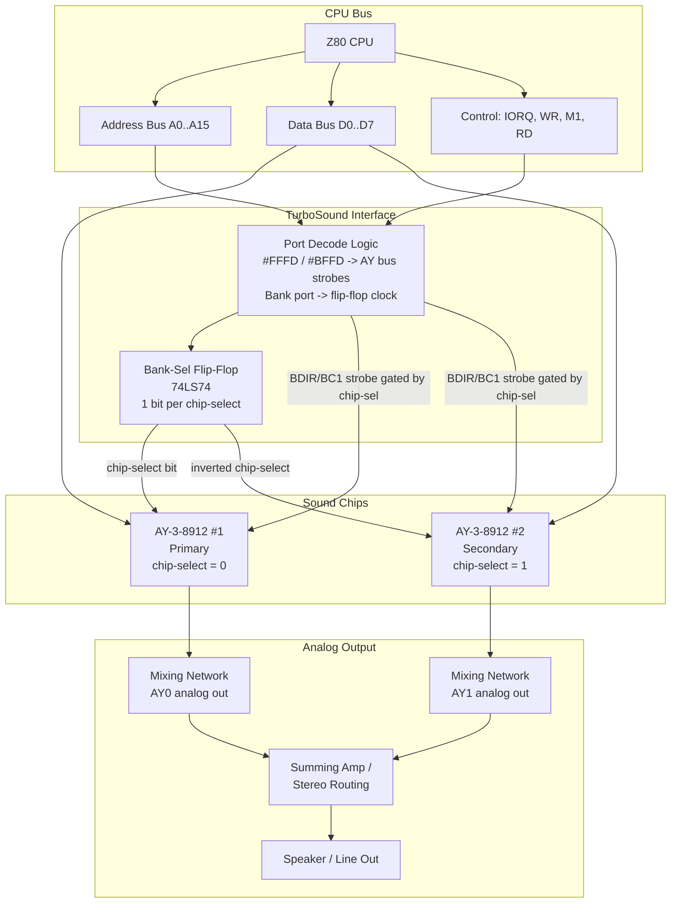
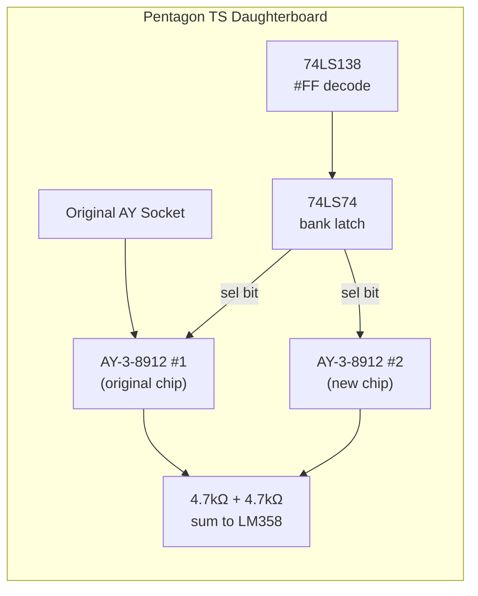
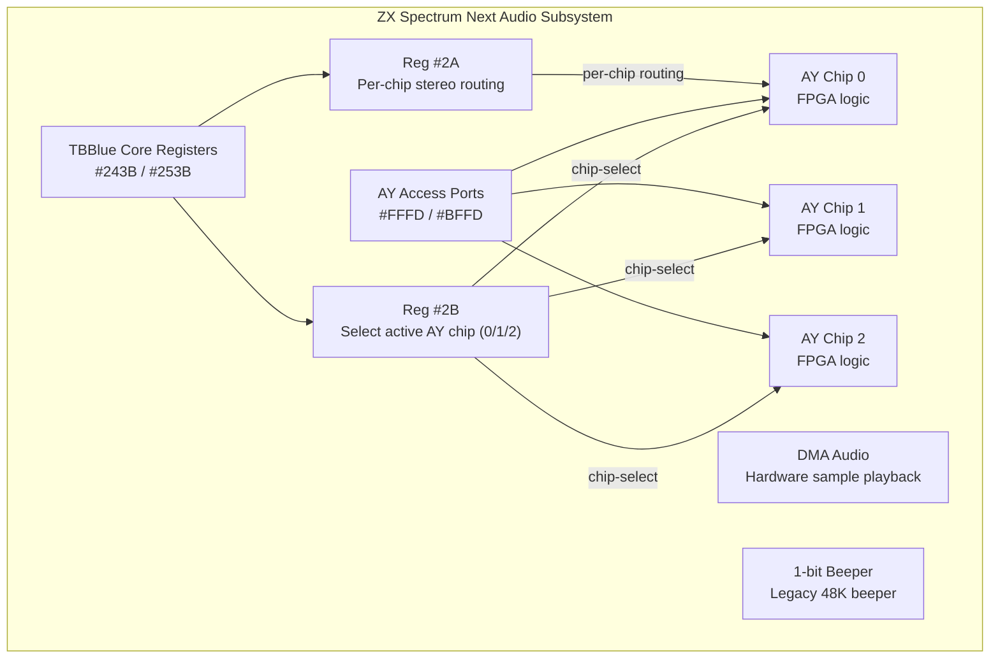

[← Home](../../README.md) · [Sound](../README.md) · [Hardware](README.md)

# TurboSound — Dual and Triple AY Configuration, Bank-Select Hardware, and the Six-Channel Soviet Revolution

> **Applies to**: **Soviet** (Pentagon TurboSound mod, Scorpion GMX, ATM Turbo 2+, Profi, Kay 1024), **New Gen** (ZX Spectrum Next — three AY chips, branded TurboSound Next). The original Sinclair/Amstrad line never shipped with TurboSound — it was an aftermarket Melodik-style add-on at best.

---

## Overview

The AY-3-8912 gives the ZX Spectrum **three tone channels**. For melodic chiptune, that is enough for a lead, a bass, and a rhythm — the canonical trio. But by 1992, Soviet demoscene composers were hitting the wall: a lead, a counter-melody, a bass, a pad, a hi-hat, and a snare simply do not fit in three channels. Western scenes lived with the constraint. The Soviet scene decided to **bolt on another AY chip**.

**TurboSound** is the result — a hardware configuration that places a second AY-3-8912 (or YM2149) on the bus, selected through a small bank-switch register. Two AY chips yield **six tone channels, two independent noise generators, two independent envelope generators**. Composers gained the dynamic range of a small MIDI module inside a $5 chip upgrade. Some machines — most notably the **ZX Spectrum Next** — extended this to three AY chips for **nine channels**, a configuration sometimes called **TurboSound Next**.

> [!IMPORTANT]
> **TurboSound is a hardware configuration, not a single product.** There is no single TurboSound chip. The name covers a family of bank-switching schemes invented independently by several Soviet clone designers around 1992–1994, then standardized in software through trackers like Vortex Tracker II and Pro Tracker 3.7+. The Pentagon version is a homemade daughterboard; the Scorpion GMX version is built into the motherboard; the ZX Spectrum Next version is implemented inside an FPGA.

This article is the **hardware reference** for TurboSound — origin, electrical architecture, port decoding, per-clone variants, and the bank-select programming model. For the **musical techniques** that exploit two or three AY chips (channel allocation, inter-chip sync, envelope polyphony), see [Multi-Track and Multi-Chip Synthesis](../synthesis/multitrack_multichip.md). For the AY chip itself, see [AY-3-8910 / 8912 / 8913 / YM2149F — PSG Silicon](ay_3_8912.md).

### Naming Convention

| Term | Meaning |
|---|---|
| **TurboSound (TS)** | Two AY chips, six channels total. The baseline configuration. |
| **TurboSound Next (TSNext / TS3)** | Three AY chips, nine channels. ZX Spectrum Next and a few FPGA cores. |
| **TurboSound FM (TSFM)** | TurboSound plus a Yamaha YM2203 OPN FM chip — covered in a [separate article](turbosound_fm.md). |
| **TurboSound interface** | A specific clone's hardware implementation of the bank-switch logic (e.g., Pentagon TurboSound, Scorpion TurboSound). |

> [!NOTE]
> **Not the same as "turbo" mode.** Many Soviet clones also had a CPU "turbo" switch (3.5 MHz ↔ 7.0 MHz). That is unrelated to TurboSound. The naming collision is unfortunate but unavoidable at this point.

---

## Origin and Historical Context

### Why TurboSound Existed

The story is economic, not technical. By **1991–1992**, the post-Soviet ZX Spectrum clone scene was exploding. Pentagon kits were cheap ($30–50), disks were cheap, software was free, and the scene had **no access** to the Western upgrade market — no Sound Blaster, no Roland MT-32, no Gravis Ultrasound. What the scene had was the **AY-3-8912** at every radio market, priced at roughly 3 to 5 rubles per chip, and a generation of engineering students with soldering irons.

Western composers accepted three channels as a hard limit. Soviet composers, surrounded by surplus AY silicon, asked the obvious question: **why not two?** The technical problem — selecting between two chips sharing the same I/O ports — was solved with a few logic gates and a single bank-switch register. The musical payoff was immediate: **six channels opened an entirely new compositional vocabulary**.

### When and Where

The exact origin is disputed, as is common for scene innovations. Multiple Soviet designers converged on the bank-switch idea around the same time:

| Year | Event |
|---|---|
| **1992** | First informal TurboSound modifications on Pentagon 128 boards, discussed on FIDO-networked BBSes |
| **1993** | Schematics published in Russian hobbyist magazines (*ZX-Forum*, *Spectrofon*) |
| **1994** | **Scorpion GMX** ships with TurboSound built-in on the motherboard — the first commercial TS machine |
| **1995–1996** | **ATM Turbo 2+** and several Profi variants integrate TS at the design level |
| **1997–1998** | First trackers with native TS support: **Pro Tracker 3.4+**, **Sound Tracker Pro** |
| **2003** | **Vortex Tracker II** released — becomes the de facto PC-based TS composition tool |
| **2017** | **ZX Spectrum Next** Kickstarter ships with **three AY chips** — TurboSound Next (TS3) |

### The Standardization Problem

The first two years of TurboSound were chaos. Every clone designer picked a different bank-select port, a different chip-select polarity, even a different approach to audio mixing. A Pentagon running TS module A might produce silence on a Scorpion GMX running the same module. Software detection was effectively impossible.

The de facto standard that emerged around **1995–1996**, codified by Pro Tracker and later by Vortex Tracker II, used:

- **Primary AY** at the standard 128K ports `#FFFD` / `#BFFD`
- **Bank-select register** accessed via an additional port, with bit 0 selecting chip 0 or chip 1
- **Write-only bank register** — reading it returns garbage or floating bus values

The exact bank-select port address is **not universal** — it varies by clone. Software authors dealt with this by either asking the user, probing at runtime, or shipping separate binaries per clone family. See [Port Decoding](#port-decoding-and-bank-select) below.

### The Cultural Impact

TurboSound was a uniquely post-Soviet phenomenon. Three facts stand out:

1. **Scale.** The Pentagon alone sold an estimated 500,000+ units in the post-Soviet space between 1991 and 2000. A meaningful fraction — perhaps 10–20% — were eventually modified for TurboSound. That is tens of thousands of dual-AY Spectrums in active use during a period when Western Spectrum hardware was a museum piece.

2. **Musical canon.** Russian-language ZX Spectrum music from 1995–2005 is overwhelmingly TurboSound. Composers like **Nik-O**, **Fatal Snipe**, **Dual Crew**, **TBC**, and dozens of others built their entire catalogs around six-channel arrangements. The PT3 format was extended for TS, and the modern TS music archive at [zxtunes.com](https://zxtunes.com) holds thousands of dual-AY modules.

3. **Standard hardware today.** Every modern FPGA ZX Spectrum core — **ZX Spectrum Next**, **TS-Conf**, **Universe** — includes TurboSound by default. The Soviet invention became the canonical "modern ZX Spectrum" sound configuration.

---

## Hardware Architecture

A TurboSound interface sits between the CPU bus and two (or three) AY chips. The design problem is: how do you let one Z80 talk to multiple AY chips that all respond to the same `#FFFD` / `#BFFD` ports?

### The Bank-Switch Principle

The answer is a **single D-flip-flop** (typically a 74LS74) wired to a dedicated write port. Every time the CPU writes to that port, the flip-flop stores one bit of the data — that bit becomes the **chip-select line** for the AY chips. The CPU-side view:

```
  CPU writes to #FFFD/#BFFD as usual
         |
         v
   +-------------+      chip-select bit
   |  Bank-Sel   |---------------------> AY chip 0 (active when sel=0)
   |  Register   |----+----------------> AY chip 1 (active when sel=1)
   +-------------+    |
         ^            +----------------> AY chip 2 (active when sel=1, TS Next only)
         |
   CPU writes to bank-select port
```

Only the currently selected AY chip sees the `BDIR` / `BC1` strobes on its bus interface. The other chip is held inactive — its registers retain their values.



### Bus Connections per AY Chip

Every AY chip in a TurboSound system is wired identically to the CPU bus for data and address lines. They differ only in how their `BDIR`/`BC1` strobes are gated.

| Signal | AY Chip 0 | AY Chip 1 | Notes |
|---|---|---|---|
| `D0..D7` | Connected | Connected | Shared bus — both chips see the data |
| `A8` (register select on ZX) | Connected | Connected | Both chips see the same address |
| `BDIR` | Gated by `chip-select = 0` | Gated by `chip-select = 1` | Only one chip latches the write |
| `BC1` | Gated same way | Gated same way | Same gating |
| `BC2` | Tied high (or gated) | Tied high (or gated) | See [AY bus protocol](ay_3_8912.md) for BC2 |
| `RESET` | Shared | Shared | Both chips reset together |
| `CLOCK` | Shared 1.7734 MHz | Shared 1.7734 MHz | Same clock domain — see below |
| `IOA0..IOA7` | Per-clone usage | Per-clone usage | Often unused on secondary chip |

### Clock Distribution

Both AY chips share the **same clock source** — typically a tap off the 128K's existing 1.7734 MHz AY clock, or a dedicated oscillator on clones with non-standard clocking (Pentagon 1.7500 MHz, ATM Turbo 1.7734 MHz or 1.7500 MHz depending on revision).

> [!IMPORTANT]
> **Shared clock does not mean synchronized internals.** Each AY chip has its own internal divider, its own counter, its own envelope phase. Even though both chips advance at the same rate, their internal counters start from arbitrary values at power-up. See [Inter-Chip Synchronization](../synthesis/multitrack_multichip.md) for techniques to phase-align the two chips when needed (rare — most TS music ignores the issue because the audible effect is small).

### Analog Mixing

The two AY chips' analog outputs can be combined in three ways:

1. **Mono sum** — simplest, both outputs through summing resistors into a single amplifier. Standard on Pentagon TS mods.
2. **Stereo split** — chip 0 to left, chip 1 to right. Common on Scorpion GMX and ATM Turbo with stereo hardware.
3. **Per-channel routing** — ABC or ACB stereo applied independently to each chip. Modern FPGA implementations (ZX Spectrum Next) allow this.

See [Stereo Audio Modifications](stereo_audio.md) for the stereo routing options in detail.

---

## Port Decoding and Bank-Select

The TurboSound bank-select register is the heart of the system. The bad news: there is **no single universal port address** — different clones picked different ports. The good news: by 1997 the scene had converged on a small number of de facto standards, and software probes for the right one at startup.

### The AY Bus Ports (Universal)

All TurboSound systems share the standard AY ports inherited from the 128K:

| Port | Decoding | R/W | Description |
|---|---|---|---|
| `#FFFD` | A1=0, A15=0 | W (addr) / R (data) | AY register select (write), AY register read (read) |
| `#BFFD` | A1=1, A15=0 | W | AY data write |

These ports talk to **whichever AY chip is currently selected** by the bank register. On power-up, the bank register defaults to **chip 0** — meaning software that does not know about TurboSound simply writes to the primary AY and the second chip stays silent.

### The Bank-Select Port (Per Clone)

The bank-select register is a write-only port that latches one or two bits of the data bus into a flip-flop. The selected bits become the chip-select lines:

```z80
; --- Switch to AY chip 1 (the second chip) ---
LD   A,1              ; bit 0 = 1 selects chip 1
OUT  (BANK_PORT),A    ; BANK_PORT varies per clone (see table below)

; --- Now AY writes go to chip 1 ---
LD   BC,#FFFD
LD   A,8              ; register 8 (channel A volume)
OUT  (C),A
LD   B,#BF            ; BC = #BFFD
LD   A,15             ; full volume
OUT  (C),A            ; writes to chip 1's R8

; --- Switch back to chip 0 ---
LD   A,0
OUT  (BANK_PORT),A
```

#### Per-Clone Bank-Select Ports

| Clone | Bank Port | Bit Used | Decoding | Notes |
|---|---|---|---|---|
| **Pentagon (TS mod)** | `#FF` | bit 0 | A0..A7 all 1 (full decode of low byte) | The most common TS variant. Sometimes seen as `#FEFF` or `#FFFF` due to mirrors. |
| **Scorpion GMX** | `#FF` | bit 0 | Same as Pentagon | GMX adopted the Pentagon standard for software compatibility. |
| **ATM Turbo 2+** | `#FF` | bit 0 | Same | The ATM Turbo's built-in TS uses the standard. |
| **Profi 5.1** | `#F4` | bit 0 | Partial decode | Profi's non-standard port requires a special player build. |
| **Kay 1024** | `#FF` | bit 0 | Same as Pentagon | Kay adopted the standard. |
| **ZX Spectrum Next** | n/a (TBBlue reg) | bits 0-1 via reg `#2B` | TBBlue config register | See [Triple AY section](#triple-ay--turbosound-next) below — uses a per-core register-mapped approach instead of a single bank port. |
| **TS-Conf (FPGA)** | `#FF` | bits 0-1 | Same as Pentagon | TS-Conf extends the standard to support 3 chips via 2 bits. |

> [!WARNING]
> **`#FF` partial-decode mirrors**: A port "decoded as A0..A7 all 1" aliases with any 16-bit address whose low byte is `#FF`. So `#00FF`, `#01FF`, `#02FF`, ..., `#FEFF`, `#FFFF` all hit the bank-select register. Some software hardcodes `#00FF`, others use `#FFFF`. All are correct on real hardware. Emulators that decode more precisely may break this — test on real iron or accurate emulators (Unreal Speccy, ZEsarUX).

### Bank-Select Register Layout

The bank-select register uses **as many bits as there are additional AY chips**:

```
Dual AY (standard TurboSound):
  +---+---+---+---+---+---+---+---+
  | x | x | x | x | x | x | x |CS |
  +---+---+---+---+---+---+---+---+
                                ^^^
                                 bit 0: chip-select
                                   0 = chip 0 (primary, default)
                                   1 = chip 1 (secondary)

Triple AY (TS-Conf, TS Next legacy mode):
  +---+---+---+---+---+---+---+---+
  | x | x | x | x | x | x | CS1 | CS0 |
  +---+---+---+---+---+---+---+---+
                              ^^^   ^^^
                              bits 1..0 select chip 0, 1, or 2

  CS1 CS0 | Chip
   0   0  |  0
   0   1  |  1
   1   0  |  2
   1   1  |  (reserved / no chip)
```

### Read Behavior

The bank-select register is **write-only**. Reading from the bank port returns floating bus garbage on real hardware — there is no flip-flop output enable wired back to the data bus. Software cannot read back the currently selected chip.

This matters for interrupt handlers: if the ISR needs to write to AY chip 1 but the main loop has been writing to chip 0, the ISR must **explicitly select chip 1** at entry and **restore to chip 0** (or whatever the main loop expects) at exit. See [Programming Model](#programming-model) for the canonical ISR-safe pattern.

---

## Per-Clone Implementations

Each clone that supports TurboSound has its own implementation story. The differences are real and matter for emulator authors and FPGA core designers.

### Pentagon TurboSound (Aftermarket Mod)

The Pentagon shipped without TurboSound. The mod is a small daughterboard that plugs into the AY chip's socket — the original AY chip moves onto the daughterboard, and a second AY is added alongside a 74LS74 flip-flop and a 74LS138 decoder.

**Components**: 1× 74LS74 (D flip-flop), 1× 74LS138 (3-to-8 decoder) or 74LS00 (NAND gates), 1× AY-3-8912 (or YM2149), 4× 1N4148 diodes for output mixing, 1× LM358 op-amp for line output.

**Bank port**: `#FF` (full low-byte decode). Bit 0 selects the active chip.

**Output**: Mono sum of both chips through 4.7 kΩ resistors into the existing audio path. Some boards added a stereo header — left channel = chip 0, right channel = chip 1.

**Clocking**: Both chips share the Pentagon's standard 1.7500 MHz AY clock.



### Scorpion GMX (Built-In)

The Scorpion GMX (graphics/music expanded) shipped in 1994 with TurboSound built into the motherboard. Unlike the Pentagon mod, the GMX implementation is a clean schematic with proper port decoding and an optional stereo amplifier.

**Bank port**: `#FF` — same as Pentagon, for software compatibility.

**Output**: ABC stereo hardware mixing, with both AY chips routed through a per-channel summing node. Effectively, the GMX gives you 6-channel ABC stereo out of the box.

**Clocking**: Both chips at Scorpion's standard 1.7734 MHz (same as the original 128K — Scorpion follows Sinclair clock spec).

**Additional features**: The GMX also includes a covox/DAC port, an IDE controller, and a ProfCPM-compatible CP/M mode. TurboSound is one of several expansions on the board.

### ATM Turbo 2+ (Built-In)

The ATM Turbo 2+ shipped from ~1996 with TurboSound as part of its base configuration. The ATM Turbo series is one of the most feature-rich Soviet clones — multiple video modes (including text 80×25 and a Sinclair-style multicolor), IDE, real-time clock, and TurboSound.

**Bank port**: `#FF` — standard.

**Output**: ABC stereo hardware routing.

**Clocking**: 1.7734 MHz on most revisions (some 1.7500 MHz). Software targeting ATM Turbo should detect at runtime or assume 1.7734 MHz.

**Note**: The ATM Turbo 2+'s #7FFD paging register behavior differs slightly from the 128K and Pentagon — software doing aggressive memory paging alongside TS playback should verify the model.

### Profi 5.1 (Non-Standard Port)

The Profi 5.1 is the **black sheep** of the TurboSound family. Its bank-select port is `#F4`, not `#FF`. The Profi's designers chose a different decode for unrelated historical reasons.

**Consequence**: TS music written for Pentagon/Scorpion will **not play** on Profi without a player rebuild. Vortex Tracker II ships a Profi-specific export option. Modern emulators detect the model and route bank writes accordingly.

**Bank port**: `#F4` (partial decode).

**Output**: Hardware stereo (typically ABC).

### Kay 1024

The Kay 1024 (and the broader Kay family) adopted the Pentagon `#FF` standard. The Kay's audio path is notable for using NE5532 low-noise op-amps — Kay TurboSound output is generally cleaner than the Pentagon's.

**Bank port**: `#FF`.

**Output**: ABC stereo, NE5532 amplification, dedicated line-out jack.

### TS-Conf (FPGA Configuration Standard)

**TS-Conf** is a hardware specification authored by the Russian FPGA community for modern ZX Spectrum reimplementations. It defines a complete clone — CPU, memory, video, and TurboSound — intended to run on Altera Cyclone-based boards.

**Bank port**: `#FF` — Pentagon compatible.

**Chip count**: TS-Conf supports **three AY chips** via 2 chip-select bits in the bank register. This is one of the few configurations where the triple-AY layout (9 channels) is exposed through the legacy bank-select interface rather than the Next's TBBlue register scheme.

**Clocking**: Software-selectable — typically 1.7734 MHz, but TS-Conf allows the composer to swap clock sources if needed.

### Summary Comparison

| Clone | Bank Port | Default Clock | Audio Path | Chips Supported |
|---|---|---|---|---|
| Pentagon (mod) | `#FF` | 1.7500 MHz | Mono (stereo optional) | 2 |
| Scorpion GMX | `#FF` | 1.7734 MHz | ABC stereo | 2 |
| ATM Turbo 2+ | `#FF` | 1.7734 MHz | ABC stereo | 2 |
| Profi 5.1 | `#F4` | 1.7734 MHz | ABC stereo | 2 |
| Kay 1024 | `#FF` | 1.7734 MHz | ABC stereo (NE5532) | 2 |
| TS-Conf | `#FF` | 1.7734 MHz | Configurable | 3 |
| ZX Spectrum Next | TBBlue reg | 1.7734 MHz | Software routing | 3 |

---

## Programming Model

The TurboSound programming model is the single-AY model with one extra step: **select the target chip first**. The pattern is small enough to memorize, but has subtle correctness requirements in interrupt-driven code.

### Canonical Chip-Select Macro

```z80
; -------------------------------------------------------
; Select the active AY chip on a TurboSound system.
; Entry: A = chip number (0, 1, or 2 on triple-AY hardware)
; Destroys: B, C
; -------------------------------------------------------
TS_SELECT:
    LD   BC,#FEFF        ; bank-select port #00FF, B=#FE is safe
    OUT  (C),A           ; bit 0/1 select the chip
    RET
```

This routine assumes the canonical `#FF` bank port. For Profi 5.1 compatibility, replace `#FEFF` with `#FEF4` (or whatever the Profi decode requires).

> [!NOTE]
> **Why `LD BC,#FEFF` instead of `LD C,#FF; OUT (C),A`?** The `OUT (C),r` instruction takes port `C` plus `B` as the high byte. So `BC = #FEFF` outputs to port `#FEFF`, which mirrors `#00FF` due to partial decode. Either form works on real hardware. The `BC=#FEFF` form is preferred because some assemblers disassemble `OUT (C),A` with `B` shown as the high byte, making the intent explicit.

### Writing to a Specific Chip

This pattern combines selection and a single register write:

```z80
; -------------------------------------------------------
; Write to a register on a specific AY chip.
; Entry: A = chip number (0/1/2)
;        D = register number (0..15)
;        E = value to write
; Destroys: A, B, C, D, E
; -------------------------------------------------------
TS_WRITE_REG:
    ; 1. Select the chip
    PUSH AF              ; save chip number
    CALL TS_SELECT       ; BC = #FEFF, OUT (C),A
    POP  AF              ; restore A (we still need it? No, we just need the write)

    ; 2. Write the register number to #FFFD
    LD   B,#FF           ; BC = #FFFD
    LD   C,#FD
    OUT  (C),D           ; D = register number

    ; 3. Write the value to #BFFD
    LD   B,#BF           ; BC = #BFFD
    OUT  (C),E           ; E = value
    RET
```

For maximum performance in inner loops (e.g., a music player), the chip selection should be hoisted out of the per-register write and done once per chip per frame.

### ISR-Safe Pattern (Critical)

The bank-select register is **global state**. If the main loop writes registers to chip 0 and an interrupt fires that writes to chip 1, the chip selection will leak back into the main loop's next write. The fix is to **save and restore the chip selection** in every interrupt handler.

```z80
; -------------------------------------------------------
; ISR-safe TS player frame update.
; Writes all 14 registers of both AY chips.
; Destroys: AF, BC, DE, HL, IX (or whatever the player uses)
; -------------------------------------------------------
TS_PLAY_FRAME:
    DI                   ; critical section — no nested interrupts

    ; --- Save current bank state (we cannot read it, so we restore to 0) ---
    ; Assume chip 0 is the "default" state at exit.

    ; --- Write chip 0 (primary AY) ---
    LD   A,0
    CALL TS_SELECT
    LD   HL,REGS_CHIP0   ; 14-byte buffer for chip 0 registers 0..13
    CALL AY_WRITE_14     ; writes all 14 regs to selected chip

    ; --- Write chip 1 (secondary AY) ---
    LD   A,1
    CALL TS_SELECT
    LD   HL,REGS_CHIP1
    CALL AY_WRITE_14

    ; --- On triple-AY hardware, write chip 2 ---
    LD   A,2
    CALL TS_SELECT
    LD   HL,REGS_CHIP2
    CALL AY_WRITE_14     ; harmless on dual-AY hardware (writes vanish)

    ; --- Restore chip 0 as the default selection ---
    XOR  A               ; A = 0
    CALL TS_SELECT

    EI
    RET

; -------------------------------------------------------
; AY_WRITE_14: write 14 consecutive registers to selected chip
; Entry: HL = pointer to 14-byte buffer (R0, R1, ..., R13)
; Destroys: AF, BC, HL
; -------------------------------------------------------
AY_WRITE_14:
    LD   B,#FF           ; BC will be #FFFD / #BFFD
    LD   C,#FD           ; #FFFD register-select port
    LD   A,0             ; register 0
AYW_LOOP:
    OUT  (C),A           ; select register
    PUSH AF
    LD   B,#BF           ; BC = #BFFD data port
    LD   A,(HL)          ; value
    OUT  (C),A           ; write value
    INC  HL
    POP  AF
    INC  A               ; next register
    CP   14              ; done?
    JR   NZ,AYW_LOOP
    RET
```

### Per-Frame T-State Budget

The TurboSound bank-select adds modest overhead to a music player. The numbers at 3.5000 MHz (Pentagon):

| Operation | Count | T-states each | Total |
|---|---|---|---|
| Bank selects (3 per frame: chip 0/1/2 + restore) | 4 | ~26 | 104 |
| Register select OUT (#FFFD) per register | 14 × 3 chips = 42 | 21 (contended) | 882 |
| Register data OUT (#BFFD) per register | 42 | 21 (contended) | 882 |
| Loop / index overhead | n/a | n/a | ~200 |
| **Total per frame (TS dual AY)** | | | **~1,500** |
| **Total per frame (triple AY)** | | | **~2,200** |

At 71,680 T-states per frame (Pentagon 50 Hz), even triple-AY playback consumes only **~3%** of the frame budget — well within reason. The real cost of TurboSound is **composition complexity**, not CPU time.

> [!WARNING]
> **Contention.** On real 128K hardware (and clones that emulate contention), every OUT to `#FFFD`/`#BFFD` adds 1–6 T-states of ULA wait. The Pentagon has **no contention** — its numbers are deterministic. Software that runs at the edge of the frame budget on 128K will have more headroom on Pentagon. The TS mods almost always target Pentagon.

---

## Triple AY — TurboSound Next

The **ZX Spectrum Next** ships with three independent AY chips implemented in FPGA logic, branded **TurboSound Next** (TS Next or TS3). Unlike the Soviet clone TS implementations, the Next uses the **TBBlue core register** mechanism rather than a dedicated bank-select port. This is more flexible (per-chip clock selection, per-chip stereo routing) but breaks source-level compatibility with Pentagon-style TS code.

### TBBlue Register Access

The Next's TBBlue configuration registers are accessed through a two-port scheme modeled on the AY's own protocol:

| Port | Decoding | R/W | Description |
|---|---|---|---|
| `#243B` | A15=0, A14=0, A7=0, A1=0, A0=1 (partial decode) | W | TBBlue register index — write the register number (0..255) |
| `#253B` | A15=0, A14=0, A7=0, A1=0, A0=1 (partial decode) | R/W | TBBlue register data — read or write the value |

The audio-related TBBlue registers:

| TBBlue Reg | Name | Purpose |
|---|---|---|
| `#2A` (decimal 42) | `AY_STEREO` | Stereo routing for the active AY chip — 16 possible routings (L/R/mono per channel) |
| `#2B` (decimal 43) | `AY_NEXT_AY_REGISTER` | Selects which AY chip (0, 1, or 2) responds to `#FFFD`/`#BFFD` |
| `#08` (decimal 8)  | `PERIPHERAL_1` | Bit 4 selects AY mono mode (0 = stereo); bit 5 enables turbo mode |

### Selecting the Active AY on the Next

```z80
; -------------------------------------------------------
; Select the active AY chip on the ZX Spectrum Next.
; Entry: A = chip number (0, 1, or 2)
; Destroys: A, B, C
; -------------------------------------------------------
NEXT_TS_SELECT:
    PUSH AF
    LD   BC,#243B        ; TBBlue register index port
    LD   A,#2B           ; register #2B = AY chip select
    OUT  (C),A
    LD   B,#25           ; BC = #253B
    POP  AF              ; restore chip number
    OUT  (C),A           ; write chip number to register #2B
    RET
```

After this call, all `#FFFD` / `#BFFD` access talks to the selected chip.

### Legacy Pentagon Compatibility

For compatibility with the existing Pentagon-style TS music catalog, the Next provides a **legacy TurboSound mode**. When enabled, the Next emulates the standard `#FF` bank-select port — software written for the Pentagon TS mod runs unmodified.

Legacy mode is enabled by setting `PERIPHERALS_4` bit appropriately through TBBlue register `#1B`. Most users enable legacy mode for running PT3 and TS modules from the Soviet catalog.

### Per-Chip Stereo Routing

Each of the three AY chips on the Next can be configured independently for stereo routing via the `AY_STEREO` register (`#2A`). The 16 possible routings are documented in [Stereo Audio Modifications](stereo_audio.md). The register's value selects the routing for the **currently selected** chip (selected via `#2B`).

```z80
; Configure chip 1 (the second AY) for ABC stereo
LD   A,1
CALL NEXT_TS_SELECT   ; select chip 1
LD   BC,#243B
LD   A,#2A            ; AY_STEREO register
OUT  (C),A
LD   B,#25            ; BC = #253B
LD   A,#07            ; #07 = A=L, B=L+R, C=R (ABC)
OUT  (C),A
```



### Triple-AY on TS-Conf FPGA Cores

The other modern triple-AY configuration is **TS-Conf**, the Russian FPGA clone specification. Unlike the Next's TBBlue approach, TS-Conf keeps the legacy `#FF` bank-select port and uses **2 bits** to select between three chips:

```z80
LD   A,2              ; chip 2 (third AY)
OUT  (#FF),A          ; standard #FF bank port
```

This is closer to the original Pentagon TS interface but extends it to three chips. Code written for dual-AY Pentagon TS will work on TS-Conf without modification (chip 2 is just unused). Software that targets triple-AY on TS-Conf must be ported to use the Next's TBBlue registers if moved to Next hardware, and vice versa.

---

## Detection Routines

Software that wants to use TurboSound must first detect whether the hardware is present. Detection is tricky because the bank-select register is **write-only** — you cannot read back the current chip selection. The standard trick is to write a sentinel value to a chip 1 register, switch back to chip 0, and verify that chip 0's register still has its original value (i.e., that there really is a separate chip 1).

### Standard Detection (Pentagon / Scorpion / ATM / Kay)

```z80
; -------------------------------------------------------
; Detect TurboSound hardware.
; Entry: nothing
; Exit:  A = 0 if no TurboSound, A = 1 if TurboSound present
; Destroys: AF, BC, D, E
; Assumes: standard #FF bank-select port
; -------------------------------------------------------
TS_DETECT:
    ; 1. Select chip 0 (the primary AY)
    LD   A,0
    OUT  (#FF),A

    ; 2. Write a sentinel to register 7 (mixer) on chip 0
    LD   BC,#FFFD
    LD   A,7
    OUT  (C),A           ; select register 7 on chip 0
    LD   B,#BF           ; BC = #BFFD
    LD   A,#3F           ; sentinel: all tone+noise disabled
    OUT  (C),A           ; chip 0 R7 = #3F

    ; 3. Switch to chip 1 and write a different sentinel
    LD   A,1
    OUT  (#FF),A
    LD   BC,#FFFD
    LD   A,7
    OUT  (C),A           ; select register 7 on chip 1 (if it exists)
    LD   B,#BF           ; BC = #BFFD
    LD   A,#00           ; sentinel: everything enabled
    OUT  (C),A           ; chip 1 R7 = #00 (or vanishes if no TS)

    ; 4. Switch back to chip 0
    LD   A,0
    OUT  (#FF),A

    ; 5. Read chip 0 R7 — should still be #3F if TS is present
    LD   BC,#FFFD
    LD   A,7
    OUT  (C),A           ; select register 7 on chip 0
    LD   B,#BF           ; BC = #BFFD
    IN   A,(C)           ; read chip 0 R7

    ; 6. Compare
    CP   #3F             ; still the sentinel?
    LD   A,0
    RET  NZ              ; no — writes leaked between banks, no TS
    INC  A               ; A = 1: TS detected
    RET
```

**Why this works**: If TurboSound hardware is present, the writes in step 3 went to chip 1 (a separate physical chip) and chip 0's R7 is undisturbed. If there is no TurboSound, the bank-select port `#FF` either does nothing (writes vanish) or aliases to a different register, and the writes in step 3 overwrite chip 0's R7. Either way, reading back chip 0 R7 reveals whether chip 1 is independent.

> [!WARNING]
> **Detection false positives.** Some 128K/+2A/+3 hardware without TurboSound has odd behavior on `#FF` writes — they may be partially decoded and hit another register. Always verify detection with a second pattern (write `#AA`, then `#55`, then read back) if you need certainty. Production software typically ships multiple binaries (one for TS, one for non-TS) and lets the user choose.

### Detection for ZX Spectrum Next

The Next detection is cleaner because the Next has a model identification register:

```z80
; Detect ZX Spectrum Next (which has triple-AY by definition)
NEXT_DETECT:
    LD   BC,#243B
    LD   A,#00           ; TBBlue register 0 = MACHINE_ID
    OUT  (C),A
    LD   B,#25           ; BC = #253B
    IN   A,(C)           ; read machine ID
    CP   #08             ; >= 8 means Next hardware
    RET  C               ; carry set = not a Next
    ; A >= 8: this is a Next, triple-AY is guaranteed
    SCF                  ; carry set = detected
    RET
```

If the Next is detected, you can use the [TBBlue register approach](#selecting-the-active-ay-on-the-next) directly. Otherwise, fall back to the legacy Pentagon-style detection and assume at most two AY chips.

### Triple-AY Detection

Distinguishing dual-AY from triple-AY hardware (e.g., TS-Conf vs Scorpion GMX) uses the same sentinel pattern as `TS_DETECT` but extends to chip 2:

```z80
; After confirming chip 1 is independent via TS_DETECT:
TS_DETECT_CHIP2:
    ; Verify chip 2 is independent of chip 0 and chip 1
    LD   A,2
    OUT  (#FF),A
    LD   BC,#FFFD
    LD   A,7
    OUT  (C),A
    LD   B,#BF
    LD   A,#AA           ; new sentinel
    OUT  (C),A

    ; Check chip 0 R7 unchanged
    LD   A,0
    OUT  (#FF),A
    LD   BC,#FFFD
    LD   A,7
    OUT  (C),A
    LD   B,#BF
    IN   A,(C)
    CP   #3F             ; chip 0 still has the original sentinel
    LD   A,0
    RET  NZ              ; chip 2 aliases to chip 0 — no triple-AY
    INC  A
    RET
```

---

## Pitfalls and Common Mistakes

### Pitfall 1: The Bank Leak

**Symptom**: Music plays only on chip 0, never on chip 1. Or worse, the music on chip 0 randomly changes timbre every interrupt.

**Bad code** (bank not restored in ISR):

```z80
PLAYER_ISR:
    ; Write chip 1 registers
    LD   A,1
    OUT  (#FF),A
    LD   HL,REGS_CHIP1
    CALL AY_WRITE_14
    ; --- ISR ends here, bank is still chip 1 ---
    EI
    RETI

; Main loop:
MAIN_LOOP:
    LD   A,#10           ; try to write to chip 0 R8 (volume A)
    LD   BC,#FFFD
    OUT  (C),A
    LD   B,#BF
    LD   A,15
    OUT  (C),A           ; BUG! Write goes to chip 1 because ISR never restored
    JP   MAIN_LOOP
```

**Correct** — restore bank at ISR exit:

```z80
PLAYER_ISR:
    DI
    LD   A,1
    OUT  (#FF),A
    LD   HL,REGS_CHIP1
    CALL AY_WRITE_14

    LD   A,0             ; --- always restore bank 0 at exit ---
    OUT  (#FF),A
    EI
    RETI
```

### Pitfall 2: Wrong Bank Port on Profi 5.1

**Symptom**: TS music plays on Pentagon, Scorpion, ATM Turbo, Kay — but produces silence on Profi 5.1.

**Bad code**: hardcoded `#FF` port assumes Pentagon compatibility:

```z80
LD   A,1
OUT  (#FF),A           ; works everywhere except Profi
```

**Correct** — either ship a Profi-specific binary or probe at runtime:

```z80
; Probe for Profi 5.1 first, then patch the bank-port address
; into the player code at runtime.
LD   A,(BANK_PORT_ADDR)
OUT  (C),A              ; BC = bank port (probed at startup)
```

For most software, simply documenting "Pentagon / Scorpion / ATM Turbo / Kay only" is acceptable. Profi users know to run Pentagon-targeted music with a player patch.

### Pitfall 3: Detection False Positive on Breadboard

**Symptom**: TS detection routine reports TurboSound on a stock 128K with no TS hardware.

**Cause**: The 128K's `#FF` port aliases to floating bus behavior. The detection reads back `#3F` by coincidence — the bus happened to be in that state.

**Fix**: Use multiple sentinel patterns. Real TurboSound preserves the sentinel across any number of intervening writes:

```z80
; Robust detection — write two patterns, verify both
    ; ... initial setup ...
    LD   A,#3F
    CALL TEST_R7_SENTINEL   ; returns A=0 or A=1
    OR   A
    JR   Z, NO_TS

    LD   A,#AA
    CALL TEST_R7_SENTINEL
    OR   A
    JR   Z, NO_TS

    ; If both patterns survived chip-1 writes, TS is real
    HAS_TS:
        ...
```

### Pitfall 4: Legacy Mode Lost on the Next

**Symptom**: Pentagon-style TS music plays only on chip 0 on a ZX Spectrum Next, never on chips 1 or 2.

**Cause**: The Next's legacy `#FF` bank port is **disabled by default** in some core revisions. The user (or boot firmware) must enable it via TBBlue register `#1B` bit.

**Fix**: Either document the boot-mode requirement for end users, or detect the Next at startup and switch to the native TBBlue register approach (more reliable).

---

## Best Practices

1. **Always restore the bank selection at ISR exit.** Default to chip 0 — software that does not know about TS will keep working.
2. **Detect once at startup, not every frame.** TS detection disturbs the chip state.
3. **Ship separate binaries for TS and non-TS** if detection is uncertain. The Pentagon scene standard is to ask the user.
4. **Use a per-frame player structure** that holds 14-byte register snapshots for each chip, plus a frame counter for tempo.
5. **Test on real hardware.** Emulators differ in TS bank-port decoding. ZEsarUX and Unreal Speccy are the most accurate for Soviet TS variants.
6. **For new music, target TurboSound Next (TBBlue registers)** if the only audience is Next hardware. Use legacy `#FF` for the broadest reach.
7. **Document the bank port in the README**. Include which clones are supported and which produce silence.

---

## When to Use TurboSound

**Use TurboSound when**:
- The composition needs more than 3 simultaneous voices (e.g., lead + harmony + counter-melody + bass + drums + arpeggio)
- You want two independent envelopes for complex amplitude modulation
- You want per-channel stereo separation in hardware (6 channels routed L/R)
- You are targeting Pentagon / Scorpion / ATM Turbo / Kay / TS-Conf / Next as the primary platform

**Do NOT use TurboSound when**:
- The composition fits in 3 voices (most 1980s-style chip music does)
- You need to run on stock 128K / +2 / +2A / +3 hardware with no expansion
- Maximum audience reach is the priority — many Western users have only the stock 128K
- The CPU budget is already tight — adding ~1,500 T-states per frame for the second chip might break the demo's timing

**Alternatives**:
- **Single AY with sample playback** — use channel A for samples via fast volume updates, channels B/C for PSG melody. See [AY/YM Synthesis Techniques](../synthesis/ay_ym_techniques.md).
- **General Sound** — a dedicated Z80 sound card that mixes 4 channels of samples independently. See [General Sound](gs_general_sound.md).
- **Covox / SounDrive** — a raw 8-bit DAC for sample playback. See [Covox & SounDrive](covox_sounDrive.md).

---

## Cross-Platform Comparison

The ZX Spectrum is far from the only platform with multi-PSG configurations:

| Platform | Multi-PSG Configuration | Channels | Notes |
|---|---|---|---|
| **ZX Spectrum (TS)** | Dual AY-3-8912 via bank select | 6 | The canonical multi-PSG Spectrum config |
| **ZX Spectrum Next** | Triple AY in FPGA | 9 | TS Next, the modern maximum |
| **Atari ST** | (No multi-PSG standard) | 3 | Single YM2149 — ST music stays at 3 channels |
| **Amstrad CPC** | PlayCity expansion (dual AY) | 6 | aftermarket, similar concept to TS |
| **Amstrad CPC+** | Dual AY on some boards | 6 | rare |
| **MSX** | MSX-MUSIC (YM2413) + PSG | 9 + 3 | Mixed FM + PSG, common on MSX2+ |
| **MSX (Moonsound)** | OPL4 + PSG | 24 + 3 | See [MoonSound](moonsound.md) |
| **C64** | SID (single chip, 3 voices) | 3 | No multi-SID standard, but a few dual-SID mods exist |
| **NES** | 2A03 (5 voices) + expansions | 5 + n | Expansion audio chips in cartridges (VRC6, VRC7, N163, FME-7) |

### Modern Analogies

| Retro Concept | Modern Equivalent | Notes |
|---|---|---|
| Bank-select chip select | Channel-select in modern MIDI synths | Same idea: address a specific sound source before writing |
| Two-AY stereo split | Two-track stereo mix bus | The hardware equivalent of two MIDI channels routed L/R |
| Triple-AY on the Next | Three-track multi-timbral synth | Comparable to a Sound Canvas in scope, simpler in engine |
| Pentagon TS daughterboard | External USB audio interface | Adding more sound sources via hardware expansion |
| TBBlue register-mapped AY | Per-channel software configuration | Modern synths configure everything via software registers |

---

## Impact on Emulation and FPGA

TurboSound is well-understood but easy to get wrong. The key correctness points:

1. **Bank-port decoding must be partial.** Emulators that decode `#FF` precisely (e.g., `BC == #00FF`) will break software that uses `#FEFF`, `#FFFF`, or other mirrors. Decode on the low byte only.
2. **Both AY chips must be clocked identically.** Some emulators accidentally use the host's AY clock for chip 0 and a different rate for chip 1.
3. **The bank-select register is write-only.** Reads must return floating-bus values, not the bank state.
4. **Both chips must be initialized to silence** on hard reset. Some early emulators reset only chip 0, leaving chip 1 producing noise after the first TS-aware program.
5. **Triple-AY on the Next must respect the TBBlue register scheme.** Legacy `#FF` access is a compatibility layer, not the primary interface.

FPGA cores that implement TurboSound should follow the TS-Conf specification for port addresses, bank bit layout, and clock distribution.

---

## References

### Primary Sources

- **Pro Tracker 3.x documentation** — S. Bulba, 1997–2003. The PT3 player source includes the canonical TS detection routine and per-clone port table.
- [Vortex Tracker II documentation](http://bulba.unterground.net/) — S. Bulba, 2003. Documents the .PT3 file format extensions for TurboSound and per-clone export options.
- [TS-Conf specification](https://zxevo.ru/) — Russian FPGA community, 2014–present. Defines the modern triple-AY hardware interface.
- **ZX Spectrum Next TBBlue Register Reference** — [zxnext.io](https://zxnext.io), 2017–present. Documents the `#2A` and `#2B` registers and legacy TS mode.

### Community Knowledge

- [zx-pk.ru TurboSound forum](https://zx-pk.ru/) — Russian-language forum with schematics, modification guides, and historical discussion of all TS variants
- [Velesoft's TurboSound page](http://velesoft.speccy.cz/turbosound-cz.htm) — English-language summary of TS hardware, software compatibility, and detection routines
- [zxtunes.com](https://zxtunes.com) — archive of thousands of TS and TS3 modules, downloadable as .PT3 / .TS / .VTX
- [Unreal Speccy emulator documentation](http://demin.ws/unreal/) — accurate TS implementation notes
- [ZEsarUX documentation](https://github.com/chernandezba/zesarux) — cross-platform ZX Spectrum emulator with comprehensive TS support

### Cross-References

- [AY-3-8910 / 8912 / 8913 / YM2149F — PSG Silicon](ay_3_8912.md) — the chip that TurboSound multiplies
- [AY/YM PSG Hardware Reference: Architecture, Registers, Counter Model](../synthesis/ay_ym_synthesis.md) — programmer's view of the single AY
- [Multi-Track and Multi-Chip Synthesis](../synthesis/multitrack_multichip.md) — composition techniques for multi-AY (channel allocation, sync, polyphony)
- [Stereo Audio Modifications](stereo_audio.md) — ABC/ACB routing applied to single and multi-AY systems
- [TurboSound FM](turbosound_fm.md) — YM2203 OPN FM expansion alongside TurboSound
- [ZX Spectrum Next Audio](zx_next_audio.md) — Next-specific audio subsystem including TS Next, DMA, and beeper
- [Sound Hardware Ecosystem Overview](sound_overview.md) — comparison of all sound hardware options on the ZX Spectrum
- [I/O Port Map](../../10_references/io_port_map.md) — full port address table including TurboSound banks

