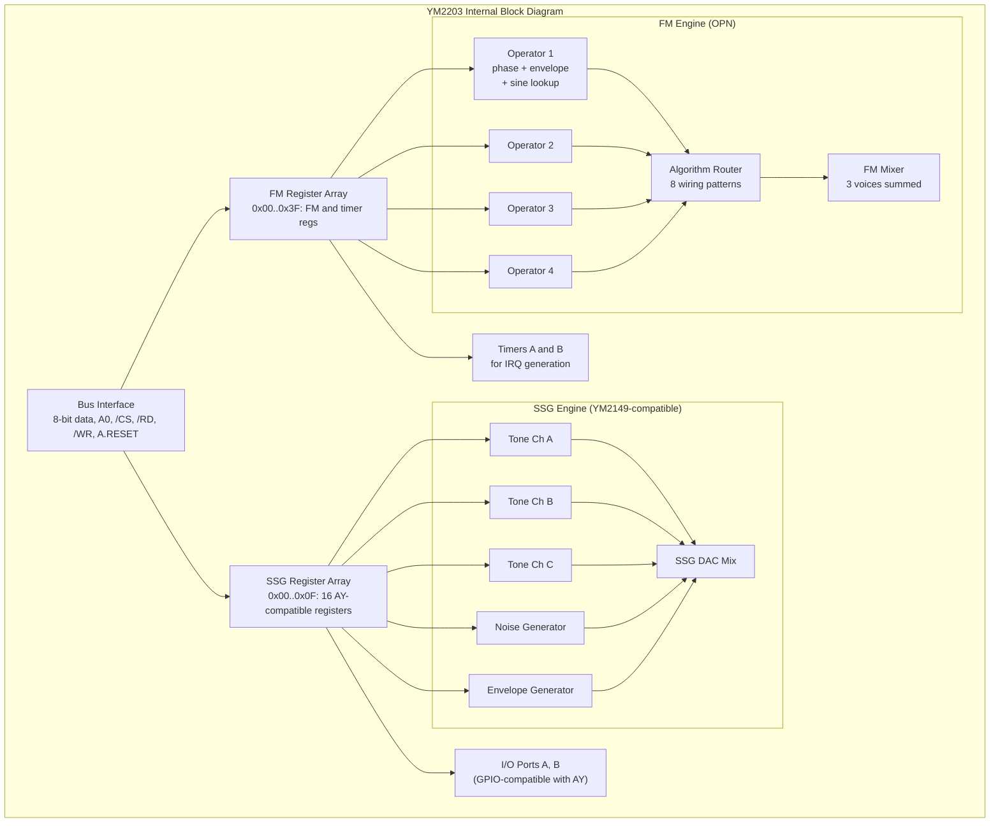
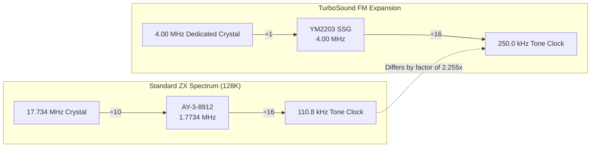
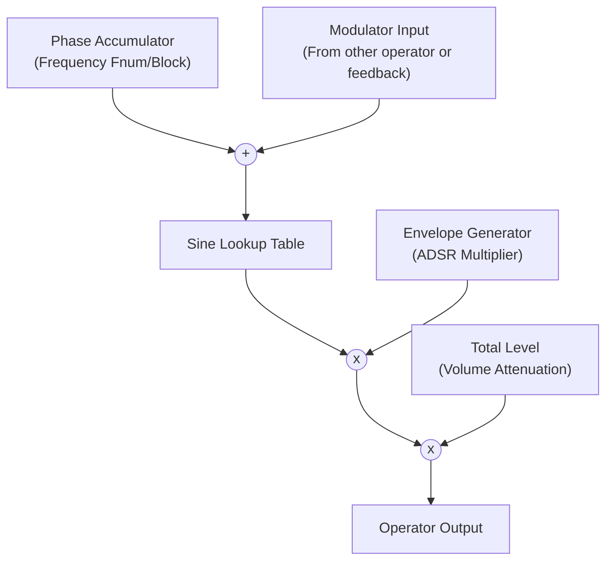
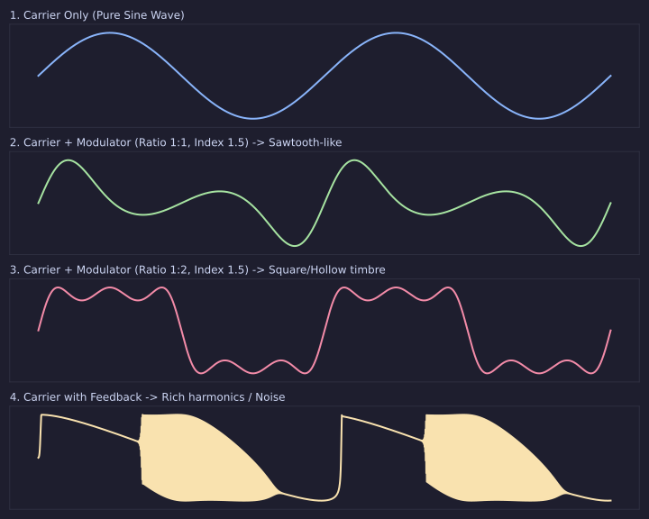
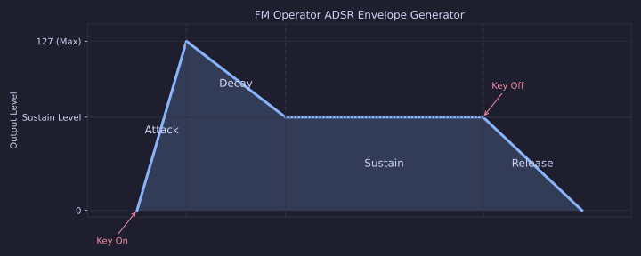

[← Home](../../README.md) · [Sound](../README.md) · [Hardware](README.md)

# TurboSound FM — YM2203 OPN FM Synthesis on the ZX Spectrum Bus

> **Applies to**: A small set of **Soviet** experimental clone builds (Profi TurboSound FM, custom ATM Turbo expansions). **New Gen**: software-emulated FM extensions in modern FPGA cores. The YM2203 was never part of any Sinclair/Amstrad shipping ZX Spectrum model.

---

## Overview

Standard TurboSound gives the ZX Spectrum six channels of PSG audio by bolting on a second AY chip. **TurboSound FM (TSFM)** takes a different path: instead of another AY, it adds a **Yamaha YM2203** — a chip that combines **3 channels of FM synthesis** with **3 channels of AY-compatible SSG**. The result is a palette that mixes the metallic, bell-like, drum-like timbres of FM with the punchy square-wave sound Soviet composers already knew.

The YM2203, also known as **OPN** (Operator type N), was Yamaha's first mass-market single-chip FM synthesizer. It appeared in the IBM PCjr, several PC-88 and PC-98 sound cards, the Sharp X1, and dozens of 1980s arcade boards. On the ZX Spectrum, it is one of the **rarest** sound expansions — fewer than a few thousand units were ever built. But its musical capability is substantial: the FM section brings **9 operators** that can be wired in 8 different algorithms, producing sounds the AY simply cannot make — bells, electric pianos, brass, metallic percussion.

> [!IMPORTANT]
> **The YM2203 is two sound chips in one.** The SSG section is essentially a YM2149 (AY-compatible) — same 3 channels, same square waves, same envelope generator. The FM section is a separate, completely independent sound generator. Software that talks to the SSG ports behaves exactly like standard AY code. Software that talks to the FM ports uses a completely different register model.

This article covers the YM2203's architecture, the TSFM bank-select scheme, the programming model, and the trade-offs versus standard TurboSound. For the broader multi-chip composition techniques, see [Multi-Track and Multi-Chip Synthesis](../synthesis/multitrack_multichip.md). For the AY/SSG side, see [AY-3-8910 / 8912 / 8913 / YM2149F — PSG Silicon](ay_3_8912.md).

### Naming Convention

| Term | Meaning |
|---|---|
| **TSFM** | TurboSound FM — the ZX Spectrum expansion that adds a YM2203. |
| **YM2203** | The Yamaha chip — 3 FM + 3 SSG channels. |
| **OPN** | "Operator type N" — Yamaha's internal name for the YM2203's FM engine. Successors: OPL2 (YM3812, Sound Blaster), OPL3 (YMF262, SB16). |
| **SSG** | "Software-controlled Sound Generator" — Yamaha's name for the AY-compatible section of the YM2203. Functionally identical to the YM2149. |
| **Operator** | An FM "voice element" — a sine-wave oscillator with its own envelope. The YM2203's FM channels each have 4 operators. |
| **Algorithm** | The wiring pattern that combines 4 operators into one FM voice. The YM2203 has 8 algorithms per channel. |

> [!NOTE]
> **TSFM is rare.** Documentation is sparse, much of it in Russian. Schematics from working builds circulate in private collections and on [zx-pk.ru](https://zx-pk.ru/). The author has cross-referenced the YM2203 datasheet (Yamaha 1985) with the Soviet schematic redraws to verify technical details. Where original ZX-specific documentation is missing, this article falls back to the YM2203 datasheet itself.

---

## YM2203 Internal Architecture

The YM2203 is a single 40-pin DIP chip containing **two complete sound engines plus an I/O subsystem**. Yamaha reused the YM2149 design for the SSG section and added an FM synthesis engine alongside it.



### Three Independent Outputs

The YM2203 has **three separate analog output pins**:

| Pin | Name | Description |
|---|---|---|
| 26 | `SSG output` | SSG audio out — equivalent to the YM2149's analog out |
| 27 | `FM output (Ψ)` | FM audio out — 9-bit PWM, externally low-pass filtered |
| (multiple) | `IOA0..IOA7, IOB0..IOB7` | Two 8-bit GPIO ports, AY-compatible |

The SSG and FM sections are mixed externally by the host system. On the ZX Spectrum TSFM boards, the typical circuit routes both outputs through summing resistors into a single op-amp, producing a mono mix. Some boards added a stereo path with SSG on one channel and FM on the other for separation.

### Clock and Timing

The YM2203 expects a **4 MHz clock input** (master clock) on its `MCLK` pin. Internally, the chip divides this down:

| Subsystem | Internal Clock | Notes |
|---|---|---|
| FM engine | MCLK / 144 ≈ 27.78 kHz | The FM operator phase accumulators update at this rate |
| SSG engine | MCLK / 8 / 2 = MCLK / 16 = 250 kHz | Half the AY's typical rate — **important** for SSG compat |
| Timer A | MCLK / 64 = 62.5 kHz | Used for periodic interrupts |
| Timer B | MCLK / 1024 ≈ 3.91 kHz | Slower timer for longer periods |

> [!WARNING]
> **Clock mismatch on ZX builds.** Stock Sinclair/Amstrad machines use different crystal architectures. Original 128K "Toastrack" and grey +2 models use a 17.734475 MHz master crystal, divided by 10 to feed the AY chip at 1.7734 MHz. Later Amstrad +2A/+3 models use a 35.469 MHz crystal divided by 20 for the same AY clock. The YM2203, however, needs **4 MHz** — and there is no 4 MHz tap available on any stock ZX board. Most TSFM builds add a dedicated 4 MHz crystal oscillator. Some Pentagon clones use a 14.0 MHz master crystal and tap a 7 MHz signal divided by 2 to drive the TSFM — but this changes the SSG section's tuning (now 1.75 MHz SSG instead of 1.7734 MHz, matching the Pentagon's standard 1.75 MHz AY clock).

If the YM2203 is clocked at the standard 4 MHz, the SSG section runs at 250 kHz — significantly slower than the AY's typical 1.7734 MHz or 1.7500 MHz. **Software that targets the YM2203's SSG must use different period values than software written for the standard ZX AY.** The frequency formula on the YM2203 SSG section is:

```
F(tone) = MCLK / (16 × period) = 4,000,000 / (16 × period) = 250,000 / period Hz
```

Versus the standard ZX 128K AY:

```
F(tone) = 1,773,400 / (16 × period) = 110,837 / period Hz
```

So the same period value produces a tone **2.255× higher** on the YM2203's SSG than on the ZX AY. Players that want to mix TSFM's SSG with the standard AY must apply a per-chip frequency scaling.



> [!NOTE]
> **Why 17.734 MHz?** When designing the 128K, Sinclair wanted to eliminate video dot-crawl. They synchronized the entire machine to the PAL color subcarrier standard (`4.43361875 MHz`). The master crystal is exactly 4× this value: **`17.734475 MHz`**. The ULA divides this by 5 to get the CPU clock (`3.5469 MHz`), and by 10 to get the AY clock (`1.7734 MHz`). Finally, the AY internally divides its input clock by 16 to derive its base tone generator frequency (`110.8 kHz`).

### Electrical Interface

| Parameter | Value | Notes |
|---|---|---|
| Supply voltage | +5 V single supply | TTL-compatible inputs |
| Operating current | ~70 mA | Hot chip — needs airflow |
| Bus signals | D0..D7, A0, /CS, /RD, /WR, /INT, /IC | TTL compatible |
| Output impedance | SSG: ~1 kΩ, FM: open-collector | Needs external amplifier |
| Package | 40-pin DIP, 0.6\" width | Larger than the AY-3-8912 (28-pin) |

---

## FM Synthesis Fundamentals

This section explains the **FM synthesis model** as implemented in the YM2203. For a complete academic treatment of FM synthesis, consult the Stanford CCRMA archives (John Chowning's 1973 paper) — this article covers what a ZX programmer needs to know.

### Operators: The Building Blocks

An **operator** is a sine-wave oscillator with its own envelope. The YM2203's FM section has **3 voices, each with 4 operators**. Each operator has:

- A **phase accumulator** — 11-bit counter, incremented each FM cycle by an amount determined by the operator's frequency
- A **sine lookup table** — converts phase to amplitude, producing a pure sine wave
- An **envelope generator** — produces a time-varying amplitude multiplier (0..127)
- A **total level** — multiplies the envelope output, controlling peak volume
- A **key-on / key-off state** — controls the envelope trajectory



Operators are classified by role:

| Role | Symbol | Description |
|---|---|---|
| **Carrier** | C | Produces the audible output |
| **Modulator** | M | Modulates the phase of another operator — adds harmonics |

A carrier alone produces a pure sine wave — boring, like a tuning fork. Adding one modulator producing the same frequency yields a richer timbre (more harmonics). Adding multiple modulators, or using higher modulator frequencies, produces bell-like, metallic, or bell-brass timbres.



### Algorithms: Wiring Operators Together

The YM2203 selects how operators are wired together via the **algorithm register** (FM register `#B0`, 3 bits per channel, 8 algorithms).

```mermaid
flowchart TD
    %% Algorithm 0
    subgraph Alg0 [Algorithm 0]
        direction BT
        A0_4[OP4 C] --> O0((Out))
        A0_3[OP3 M] --> A0_4
        A0_2[OP2 M] --> A0_3
        A0_1[OP1 M] --> A0_2
        A0_1 -->|FB| A0_1
    end

    %% Algorithm 1
    subgraph Alg1 [Algorithm 1]
        direction BT
        A1_4[OP4 C] --> O1((Out))
        A1_3[OP3 M] --> A1_4
        A1_2[OP2 M] --> A1_4
        A1_1[OP1 M] --> A1_2 & A1_3
        A1_1 -->|FB| A1_1
    end

    %% Algorithm 2
    subgraph Alg2 [Algorithm 2]
        direction BT
        A2_4[OP4 C] --> O2((Out))
        A2_3[OP3 M] --> A2_4
        A2_2[OP2 M] --> A2_3
        A2_1[OP1 M] --> A2_3
        A2_1 -->|FB| A2_1
    end

    %% Algorithm 3
    subgraph Alg3 [Algorithm 3]
        direction BT
        A3_4[OP4 C] --> O3((Out))
        A3_3[OP3 M] --> A3_4
        A3_2[OP2 M] --> A3_4
        A3_1[OP1 M] --> A3_2
        A3_1 -->|FB| A3_1
    end

    %% Algorithm 4
    subgraph Alg4 [Algorithm 4]
        direction BT
        A4_4[OP4 C] --> O4((Out))
        A4_3[OP3 M] --> A4_4
        A4_2[OP2 C] --> O4
        A4_1[OP1 M] --> A4_2
        A4_1 -->|FB| A4_1
    end

    %% Algorithm 5
    subgraph Alg5 [Algorithm 5]
        direction BT
        A5_4[OP4 C] --> O5((Out))
        A5_3[OP3 C] --> O5
        A5_2[OP2 C] --> O5
        A5_1[OP1 M] --> A5_2 & A5_3 & A5_4
        A5_1 -->|FB| A5_1
    end

    %% Algorithm 6
    subgraph Alg6 [Algorithm 6]
        direction BT
        A6_4[OP4 C] --> O6((Out))
        A6_3[OP3 C] --> O6
        A6_2[OP2 C] --> O6
        A6_1[OP1 M] --> A6_2
        A6_1 -->|FB| A6_1
    end

    %% Algorithm 7
    subgraph Alg7 [Algorithm 7]
        direction BT
        A7_4[OP4 C] --> O7((Out))
        A7_3[OP3 C] --> O7
        A7_2[OP2 C] --> O7
        A7_1[OP1 C] --> O7
        A7_1 -->|FB| A7_1
    end
```



Each algorithm has a distinct character. Algorithm 0 is best for complex evolving timbres (lead synths). Algorithm 7 is best for organs and additive-bell sounds.

> [!NOTE]
> **Algorithm 7 is technically additive, not FM.** When all four operators are carriers, no modulation happens — the output is the sum of four sine waves with independent envelopes. This is the same as additive synthesis on a Hammond organ. Some FM tutorials dismiss algorithm 7 as "not real FM" — Yamaha included it because it is useful for harmonic-rich tones.

### Feedback

Each algorithm has a **feedback path** from operator 1 back to itself. The feedback amount is set via FM register `#B0` bits 3..5. Feedback adds self-modulation to operator 1, producing sawtooth-like or noise-like waveforms:

```
Feedback = 0: pure sine wave
Feedback = 1..3: subtle harmonic enrichment
Feedback = 4..5: rich harmonics, approaching sawtooth
Feedback = 6..7: chaotic, noise-like, can be used for cymbals
```

Feedback is what gives the YM2203 its characteristic "bright" sound. A carrier with no feedback and no modulator is a sine wave — boring. The same carrier with feedback 5 sounds like a string section.

### Envelope Generator

Each operator has its own **envelope generator** with 4 stages — Attack, Decay, Sustain, Release (ADSR):



Each operator stores 4 envelope rates (Attack rate, Decay rate, Sustain rate, Release rate) and a sustain level. The 4 rates range from 0 (very slow) to 31 (very fast). At rate 31, the envelope snaps to its target in a single FM cycle (~36 microseconds).

**Keyframing**: the envelope generator starts its Attack phase when the key-on bit is set for the channel. It transitions to Release when the key-on bit is cleared. This is fundamentally different from the AY's envelope, which loops and has no concept of key-on/key-off.

### Frequency and Key Code

The operator's frequency is set by two values: a **block** (octave, 3 bits) and an **F-number** (frequency within octave, 11 bits):

```
F(out) = Fnum × 2^(Block - 1) × MCLK / (144 × 2^19)
     ≈ Fnum × 2^(Block - 1) × 0.211 Hz  (at 4 MHz MCLK)
```

Setting Block = 4 and Fnum = #1A0 (decimal 416) yields:

```
F = 416 × 2^3 × 0.211 ≈ 701 Hz
```

This is **not** A4 (440 Hz) — the difference is explained by the operator's **frequency multiplier** (`MULT`), which scales Fnum per-operator:

```
F(op) = Fnum × MULT[op] × 2^(Block-1) × MCLK / (144 × 2^19)
```

This lets modulators run at integer multiples of the carrier (2×, 3×, 4×) — the basis for harmonic-rich FM timbres.

---

## Port Decoding and Bank-Select

TSFM systems use a multi-bank selection scheme that extends standard TurboSound. The CPU sees several distinct "sound chips" — the primary AY, optionally a second AY for standard TS, and the YM2203 — all addressed through a unified port interface.

### The YM2203 Bus Interface

The YM2203 uses a different bus protocol than the AY. Instead of `BDIR`/`BC1`, it uses a more conventional address/data strobe scheme:

| Pin | Name | Function |
|---|---|---|
| A0 | Address bit | 0 = register select (write) / status (read); 1 = data (read/write) |
| /CS | Chip select | 0 = chip active |
| /RD | Read strobe | 0 = read cycle |
| /WR | Write strobe | 0 = write cycle |
| /IC | Reset | 0 = reset (active low) |
| /INT | Interrupt output | Pulses low when timer expires |

This is the standard 8-bit peripheral bus protocol used by most Yamaha chips. The A0 bit selects between register index and data, so the YM2203 occupies **two consecutive port addresses**:

| Port | Function |
|---|---|
| Base + 0 | Register index (A0=0) |
| Base + 1 | Register data (A0=1) |

### Standard ZX Spectrum TSFM Port Map

The most common TSFM scheme extends the TurboSound bank-select to support both a second AY and a YM2203. The bank-select register uses **2 bits**:

```
Bank-select register:
  bit 0: AY chip select (0 = primary, 1 = secondary)
  bit 1: TSFM enable (0 = AY family, 1 = YM2203)

  CS1 CS0 | Active chip
   0   0  |  AY chip 0 (primary, standard 128K behavior)
   0   1  |  AY chip 1 (secondary TurboSound)
   1   0  |  YM2203 (FM + SSG)
   1   1  |  (reserved — unused on most boards)
```

```mermaid
flowchart LR
    Z80["Z80 CPU"] -->|OUT (Port #FF)| Latch["Bank-Select Register\n(Bits 0, 1)"]
    Z80 -->|OUT (#FFFD / #BFFD)| Demux{"TSFM Demux\nLogic"}
    Latch -.-> Demux
    
    Demux -->|CS0=0, CS1=0| AY0["AY Chip 0\n(BDIR/BC1)"]
    Demux -->|CS0=1, CS1=0| AY1["AY Chip 1\n(BDIR/BC1)"]
    Demux -->|CS1=1| YM["YM2203\n(/CS, A0)"]
```

The AY ports `#FFFD`/`#BFFD` are routed based on the bank-select:

- **CS0 = 0**: writes to `#FFFD` go to AY chip 0's address latch
- **CS0 = 1**: writes to `#FFFD` go to AY chip 1's address latch
- **CS1 = 1**: writes to `#FFFD` go to the YM2203's A0=0 input (register index), and `#BFFD` goes to A0=1 (data)

This means the same `#FFFD`/`#BFFD` protocol that programs the AY works for the YM2203, **as long as the bank-select is set to the TSFM bank**. The AY protocol (BDIR/BC1 = inactive/address/data) and the YM2203 protocol (A0=0/A0=1 with /WR strobes) are isomorphic enough that they map cleanly onto the same CPU-side access.

### Per-Clone Port Variants

| Board | Bank Port | YM2203 Bank Value | Notes |
|---|---|---|---|
| **Profi TurboSound FM** | `#F4` | `#02` (CS1=1, CS0=0) | Profi used its standard non-`#FF` port, extended for TSFM |
| **ATM Turbo FM expansion** | `#FF` | `#02` | Extension board for ATM Turbo 2+, mostly homebrew |
| **Custom Pentagon TSFM** | `#FF` | `#02` | DIY daughterboard; rare, undocumented variants exist |
| **TS-Conf (FPGA) TSFM mode** | `#FF` | `#02` | Modern FPGA spec includes optional YM2203 emulation |

### Read Behavior and Status

The YM2203 has a **readable status register** at base + 0 (A0=0, /RD strobe). Bits:

```
Status register:
  bit 7: Timer A expired
  bit 6: Timer B expired
  bit 5..0: always 0
```

This is **unlike the AY bank-select register**, which is write-only. Software can detect whether the YM2203 is present by reading the status register after selecting the TSFM bank — a valid YM2203 returns `#00` or `#C0` (timer bits), while the absence of a chip returns floating bus values.

### IRQ Wiring

The YM2203's `/INT` pin can be wired to the Z80's `/INT` line, allowing the timers to drive periodic interrupts independently of the ULA's frame interrupt. Most TSFM boards leave `/INT` unwired — programmers use the ULA frame interrupt at 50 Hz or 60 Hz for the player routine. Boards that wire `/INT` enable higher-precision music timing (useful for FM drum patterns).

---

## Programming Model

Writing to the YM2203 is structurally identical to writing to the AY — pick a register, write the value — but the register set is far larger. The full YM2203 register map spans **64 FM-side registers** (`#00`..`#3F`) plus the 16 SSG-side registers, accessed via two bus protocols routed through the same `#FFFD`/`#BFFD` ports.

### Access Pattern

```z80
; -------------------------------------------------------
; Write a value to a YM2203 FM register.
; Assumes: bank-select is set to TSFM (CS1=1, CS0=0).
; Entry: D = register number (#00..#3F)
;        E = value
; Destroys: A, B, C, D, E
; -------------------------------------------------------
TSFM_WRITE_FM:
    LD   BC,#FFFD        ; register select port (now routed to YM2203 A0=0)
    LD   A,D
    OUT  (C),A           ; select register
    LD   B,#BF           ; BC = #BFFD (now routed to YM2203 A0=1)
    LD   A,E
    OUT  (C),A           ; write data
    RET
```

This is byte-for-byte identical to writing an AY register — the bank-select hardware routes the access to the correct chip. The trick is to **set the bank correctly first**.

### Selecting the TSFM Bank

```z80
; -------------------------------------------------------
; Select the YM2203 chip as the active sound target.
; Destroys: A
; -------------------------------------------------------
TSFM_SELECT:
    LD   A,#02           ; CS1=1, CS0=0 = YM2203 active
    OUT  (#FF),A         ; bank-select register
    RET
```

After this call, all `#FFFD`/`#BFFD` writes go to the YM2203. Reads from `#FFFD` (the address port) return the **YM2203 status register** — timer bits, not AY register values.

### Setting Up an FM Voice (Channel 1, Algorithm 7, All Carriers)

A complete voice setup touches many registers. The example below creates an organ-like voice (algorithm 7, all 4 operators as carriers, moderate feedback) and triggers a note (A4).

```z80
; -------------------------------------------------------
; Set up an organ voice on FM channel 1 and trigger A4.
; Destroys: AF, BC, DE, HL
; -------------------------------------------------------
TSFM_SETUP_VOICE:
    CALL TSFM_SELECT      ; bank = YM2203

    ; --- Channel 1: feedback / algorithm ---
    ; FM reg #B0 (channel 1 ALG/FEEDBACK)
    ;   bits 0..2: algorithm (0..7) - we want 7
    ;   bits 3..5: feedback (0..7) - we want 4 for moderate harmonics
    LD   D,#B0
    LD   E,%01100111      ; FB=4 (bits 3..5 = 100), ALG=7 (bits 0..2 = 111)
    CALL TSFM_WRITE_FM

    ; --- Per-operator total level (TL) ---
    ; Each operator needs a TL value: 0 = loudest, 127 = silent.
    ; Register addresses for channel 1's operators are
    ;   Op1: #30, Op2: #34, Op3: #38, Op4: #3C (YM2203 mapping)
    ; Use TL = 32 (about -12 dB) for each carrier.
    LD   B,4              ; 4 operators
    LD   D,#30            ; first operator TL register
SET_TL_LOOP:
    LD   E,32             ; TL = 32
    CALL TSFM_WRITE_FM
    LD   A,D
    ADD  A,4              ; next operator TL register
    LD   D,A
    DJNZ SET_TL_LOOP

    ; --- Per-operator multiplier (MULT) ---
    ; Set MULT=1 for all operators (fundamental frequency).
    ; Register addresses for channel 1: #20, #24, #28, #2C
    LD   B,4
    LD   D,#20
SET_MULT_LOOP:
    LD   E,1              ; MULT = 1, DT1 = 0
    CALL TSFM_WRITE_FM
    LD   A,D
    ADD  A,4
    LD   D,A
    DJNZ SET_MULT_LOOP

    ; --- Channel 1 frequency: A4 (440 Hz) ---
    ; YM2203 frequency encoding (Block=4, Fnum=616):
    ;   Fnum low byte  =  #68
    ;   Fnum high nibble + block = #46
    LD   D,#A0            ; channel 1 frequency low
    LD   E,#68
    CALL TSFM_WRITE_FM
    LD   D,#A4            ; channel 1 frequency high (block=4)
    LD   E,#46
    CALL TSFM_WRITE_FM

    ; --- Key-on channel 1 ---
    ; FM reg #28: key-on/off for all channels.
    ;   bits 0..2: channel (0=ch1, 1=ch2, 2=ch3)
    ;   bit 4: slot 1 key-on
    ;   bit 5: slot 2 key-on
    ;   bit 6: slot 3 key-on
    ;   bit 7: slot 4 key-on
    ; For algorithm 7 (all carriers), key-on all 4 slots:
    LD   D,#28
    LD   E,%11110000      ; slots 1-4 on, channel 1
    CALL TSFM_WRITE_FM
    RET
```

This is a substantial amount of code to play a single note — far more than the AY's "set period + volume" pattern. The payoff is that the resulting voice can be a Hammond organ, a brass patch, a bell, a flute — timbres the AY cannot approximate at all.

### Reading the Status Register

```z80
; -------------------------------------------------------
; Read the YM2203 status register.
; Exit: A = status byte
;       bit 7 = Timer A expired
;       bit 6 = Timer B expired
; -------------------------------------------------------
TSFM_READ_STATUS:
    CALL TSFM_SELECT      ; ensure YM2203 is active
    LD   BC,#FFFD         ; address port (status when read)
    IN   A,(C)
    RET
```

### Per-Frame Update Cost

YM2203 register writes cost the same as AY writes — ~21 T-states per OUT (subject to contention on 128K-class machines). A typical FM player routine writes:

| Per Frame | Count | Total T-states |
|---|---|---|
| Per-operator TL updates (volume changes) | 12 × 2 OUTs | ~500 |
| Per-channel frequency updates (3 channels) | 3 × 2 OUTs | ~125 |
| Key-on/off changes | ~3 events | ~125 |
| Bank-select writes | ~3 chip switches | ~80 |
| **Total for FM-only player** | | **~830** |
| Combined with AY chip 0 + AY chip 1 (full TSFM) | | **~2,500** |

A complete TSFM player with 3 AY + 3 FM channels consumes about 3-4% of the frame budget on a 50 Hz Pentagon — still well within reason.

---

## Detection and Compatibility

Detecting TSFM hardware is easier than detecting plain TurboSound because the YM2203's status register is **readable**. Unlike the AY bank-select, which is write-only and requires sentinel patterns to probe, the YM2203 reports concrete status bits.

### Detection Routine

```z80
; -------------------------------------------------------
; Detect TSFM hardware (YM2203 present).
; Exit:  A = 0 if no TSFM, A = 1 if YM2203 present
; Destroys: AF, BC
; Assumes: standard #FF bank-select register
; -------------------------------------------------------
TSFM_DETECT:
    ; 1. Save the current bank state (we will restore at exit)
    ;    We cannot read it back, so we assume chip 0 was active.

    ; 2. Select the TSFM bank
    LD   A,#02           ; CS1=1, CS0=0 = YM2203
    OUT  (#FF),A

    ; 3. Read the YM2203 status register
    LD   BC,#FFFD        ; reads from YM2203 A0=0 = status
    IN   A,(C)

    ; 4. Mask the upper 2 bits (timer flags) — they should be
    ;    either #00 or with one timer expired (#40/#80/#C0).
    AND  #C0             ; keep only bits 6..7
    CP   #C0             ; both timers expired?
    JR   Z, tsfm_present
    CP   #80             ; timer A only?
    JR   Z, tsfm_present
    CP   #40             ; timer B only?
    JR   Z, tsfm_present
    CP   #00             ; no timers expired?
    JR   Z, tsfm_present ; still valid — timers may not have fired yet

    ; Anything else is floating bus garbage — no TSFM
    JR   tsfm_absent

tsfm_present:
    ; Reset timers to clear any expired state
    LD   BC,#FFFD
    LD   A,#27           ; FM timer/reset register
    OUT  (C),A
    LD   B,#BF
    LD   A,#30           ; reset both timers, disable IRQ
    OUT  (C),A
    LD   A,1
    JR   tsfm_done

tsfm_absent:
    LD   A,0

tsfm_done:
    ; Restore chip 0 as the active bank
    PUSH AF              ; save detection result
    XOR  A               ; A = 0 = AY chip 0
    OUT  (#FF),A
    POP  AF              ; A = 1 (present) or 0 (absent)
    RET
```

**Why this works**: When the TSFM bank is selected, the `#FFFD` read is routed to the YM2203's status register. A real YM2203 returns bits 6..7 with values in {#00, #40, #80, #C0}. Hardware without a YM2203 returns floating-bus values, which statistically do not match this mask.

For extra robustness, the detection can write a known pattern to a YM2203 register and read it back. This rules out false positives from random bus values.

### Compatibility Concerns

Software that detects TSFM should respect the following compatibility matrix:

| Configuration | Result with TSFM-aware code | Result with non-TSFM code |
|---|---|---|
| **Stock 128K / +2 / +3** | Detection fails → fall back to single AY | Works (no TSFM hardware to detect) |
| **Clone with standard TS** | Detection fails → fall back to standard TS | Works (bank-select writes hit nothing if TS bank = 2 is selected; chip stays silent) |
| **Clone + TSFM peripheral card** | Detection succeeds → enable FM playback | Code that ignores detection may write to invisible YM2203 registers (silent) or, worse, write to AY chip 0 if it forgot to switch bank |
| **ZX Spectrum Next** | Detection fails → fall back to standard TS Next | Next's legacy mode does not include TSFM — no false positives |

### SSG Compatibility Mode

The YM2203's SSG section is **functionally identical** to the YM2149, but its **clock is different** (typically 250 kHz from the YM2203's 4 MHz master clock, versus 1.7734 MHz on the standard ZX AY). Software that wants to play an AY module on the YM2203's SSG channels must apply a frequency scaling factor:

```
Period(YM2203 SSG) = Period(ZX AY) × (1,773,400 / 250,000)
                   = Period(ZX AY) × 7.094
```

This is awkward — period values are integers, and the scaling factor is irrational. In practice, TSFM composers write new music for the SSG section using the YM2203's tuning, rather than reusing AY modules directly.

---

## TSFM vs Standard TurboSound

A common question: should a new TS music project target standard TurboSound (dual AY) or TSFM? The answer depends on the goal.

| Criterion | Standard TurboSound (Dual AY) | TurboSound FM (YM2203) |
|---|---|---|
| **Total channels** | 6 (PSG) | 6 (3 PSG/SSG + 3 FM) |
| **Timbral variety** | Limited to AY techniques: square, noise, PWM, samples | Vast: FM bells, brass, electric pianos, organs, drums |
| **Audience size** | Every Soviet clone and FPGA core | Profi TurboSound FM, ATM Turbo FM, TS-Conf — rare |
| **Tracker support** | Vortex Tracker II, Pro Tracker 3.x, Arkos Tracker | Limited — custom patches for Vortex Tracker II and Arkos; no mainstream toolchain |
| **Player code size** | ~500 bytes for a full TS player | ~2 KB for a full TSFM player (FM voice definitions dominate) |
| **Memory footprint** | Music data ~1 KB/minute | Music data ~4 KB/minute (per-voice instrument definitions) |
| **Detection reliability** | Tricky (sentinel patterns) | Easy (status register) |
| **Learning curve** | Moderate (extends AY knowledge) | Steep (FM synthesis is a separate discipline) |
| **Emulation accuracy** | Mature — most emulators are bit-exact | Variable — FM emulation is approximate on simpler emulators |

### Decision Guide

```mermaid
flowchart TD
    START([New TS music project]) --> Q1{Audience?}
    Q1 -->|All Soviet clones / FPGA cores| AY[Target standard TurboSound]
    Q1 -->|Niche / experimental / arcade ports| Q2
    Q2 {Need bell/brass/FM timbres?}
    Q2 -->|Yes, must have FM| TSFM[Target TSFM]
    Q2 -->|No, AY techniques suffice| AY
    TSFM --> Q3{Have real TSFM hardware or accurate FPGA?}
    Q3 -->|Yes| GO_TSFM[Proceed with TSFM]
    Q3 -->|No| WARN[Warning: most users will hear silence or PSG only]
    WARN --> AY
```

---

## Historical Context and Software Ecosystem

The YM2203 was a commercial success outside the ZX Spectrum — used in the IBM PCjr, Sharp X1, multiple PC-88 sound cards, and many arcade boards (including Sega's System 16 and several Namco boards). It was Yamaha's first low-cost single-chip FM synthesizer, bridging the gap between the expensive YM2151 (used in high-end arcade machines) and the consumer-grade OPL2 (YM3812) used in Sound Blaster cards.

On the ZX Spectrum, TSFM never reached the popularity of standard TurboSound. Reasons:

1. **YM2203 was hard to source in the post-Soviet space** — AY chips were dumped on the market from surplus production; YM2203s had to be imported from Japan via non-Soviet channels.
2. **Programmers knew the AY** — switching to FM required learning an entirely new mental model of sound synthesis.
3. **FM composers were a tiny minority** — the Soviet scene was built around square-wave music. The handful of composers who used TSFM (notably some of the work by **M.M.A** and a few other artists) were pioneers without successors.
4. **TS-Conf changed the equation** — modern FPGA ZX reimplementations can include a YM2203 in software, making TSFM more accessible today than it ever was in the 1990s.

### Software Support

- **Vortex Tracker II**: Includes an FM instrument editor and a TSFM export mode (rarely used).
- **Arkos Tracker 2/3**: Multi-PSG support, with experimental FM voice definitions.
- **MML tools**: Some Japanese-origin MML compilers target YM2203 directly.
- **Custom players**: Most TSFM music uses bespoke player routines written by individual composers.

### Modern Analogies

| Retro Concept | Modern Equivalent | Notes |
|---|---|---|
| FM operators with ADSR envelopes | Software synthesizers (VSTi, DAW plugins) | Modern FM plugins use the same operator + algorithm model |
| YM2203 algorithms (8 patterns) | Operator routing matrix in software synths | Same concept, more flexibility |
| TSFM bank-select | Channel routing in a modern DAW | Modern software makes per-channel chip selection trivial |
| YM2203 SSG section | Sample-based PSG emulation in modern chiptune tools | Software replaces the hardware SSG |
| Per-operator TL scaling | Per-operator volume in Dexed / FM8 | Same parameter, different units |

---

## Pitfalls and Common Mistakes

### Pitfall 1: Wrong Clock on SSG Side

**Symptom**: Notes played on the YM2203's SSG channels sound wildly out of tune compared to the same notes on the ZX AY.

**Cause**: The YM2203's SSG section runs at a different clock than the ZX AY. Software reusing AY period values will be out of tune.

**Bad code**:

```z80
; Reusing ZX AY period values for the YM2203 SSG:
LD   A,PeriodTable-NoteCode  ; period from ZX AY table
OUT  (C),A
```

**Correct**: Apply the clock scaling factor (×7.094 for stock 4 MHz YM2203) or generate a separate period table for the SSG:

```z80
; PeriodTable_SSG is pre-computed for the YM2203 clock
LD   A,(PeriodTable_SSG-NoteCode)
OUT  (C),A
```

### Pitfall 2: Bank Leak Across ISRs

Same as standard TurboSound — if the ISR sets the TSFM bank and the main loop assumes AY chip 0, the next AY write goes to the YM2203. See [TurboSound Pitfall 1](turbosound.md#pitfall-1-the-bank-leak) for the full explanation and fix.

### Pitfall 3: Forgetting Key-Off

**Symptom**: Notes play but never release — the FM voice sustains indefinitely, drowning out subsequent notes.

**Cause**: The YM2203 envelope generator only transitions to Release when the key-on bit is cleared. Software that triggers notes without key-off produces monotonically louder output.

**Bad code**:

```z80
; Trigger notes forever without ever releasing:
PLAY_NOTE_LOOP:
    LD   D,#28
    LD   E,%11110000     ; key-on all 4 slots, channel 1
    CALL TSFM_WRITE_FM
    JR   PLAY_NOTE_LOOP  ; no key-off ever!
```

**Correct**: Track note durations and emit key-off before key-on for the next note:

```z80
; Trigger note, hold for N frames, then release
CALL TSFM_KEY_ON_CH1
LD   B,20               ; hold 20 frames (~400 ms at 50 Hz)
HOLD_LOOP:
    HALT
    DJNZ HOLD_LOOP
CALL TSFM_KEY_OFF_CH1
; ... later, trigger next note ...

TSFM_KEY_OFF_CH1:
    LD   D,#28
    LD   E,%00000000     ; clear all slots for channel 1
    CALL TSFM_WRITE_FM
    RET
```

### Pitfall 4: Operator Total Level Overflow

**Symptom**: FM voice is silent even after key-on, or unexpectedly loud and clipping.

**Cause**: The TL register is 7-bit (values 0..127). Values outside this range wrap or are masked.

**Bad code**:

```z80
LD   E,128             ; TL out of range — wraps to 0!
```

**Correct**: Clamp TL to the valid range (0 = loudest, 127 = silent):

```z80
LD   A,(VoiceLevel)
AND  #7F               ; mask to 7 bits
LD   E,A
```

---

## Best Practices

1. **Detect TSFM once before use, not every frame.** Detection disturbs the YM2203's register state.
2. **Restore chip 0 (AY) as the default bank** at ISR exit. Software that does not know about TSFM should continue to work.
3. **Use a separate period table for the YM2203 SSG section** — never reuse ZX AY period values.
4. **Always pair key-on with key-off.** Track note durations explicitly.
5. **Store FM voice definitions as parameter tables** rather than hardcoded register writes — this lets you reuse voices across channels.
6. **Test on real hardware or accurate emulators.** ZEsarUX and Unreal Speccy have TSFM support; MAME's YM2203 emulation is the gold standard for FM voice correctness.
7. **Document the target clone** (Profi TSFM vs ATM Turbo FM vs TS-Conf) — bank-port addresses differ.

---

## When to Use TurboSound FM

**Use TSFM when**:
- The composition requires FM timbres (bells, brass, electric piano) that the AY cannot produce
- The target audience has TS-Conf or a real TSFM-modded clone
- You are porting arcade music that originally used the YM2203 (or a similar FM chip)
- The composition benefits from the contrast between PSG square waves and FM complex harmonics

**Do NOT use TSFM when**:
- The widest possible audience is the goal — most Soviet clone users have only standard TurboSound
- The composition does not need FM timbres (most chiptune works fine on the AY)
- The CPU budget is tight — FM player routines are larger and slower than AY-only players
- You cannot test on real hardware or accurate emulators (FM voice bugs are hard to diagnose visually)

**Alternatives**:
- **Standard TurboSound** ([turbosound.md](turbosound.md)) — 6 channels of PSG, good old 2xAY configuration, broad audience, no FM synthesis
- **General Sound** ([gs_general_sound.md](gs_general_sound.md)) — sample playback with dedicated Z80, more flexible timbres but no synthesis
- **MoonSound** ([moonsound.md](moonsound.md)) — OPL4 wavetable + FM, far more powerful but extremely rare due to OPL4 chips unavailability on market

---

## Impact on Emulation and FPGA

YM2203 emulation is well-understood — the chip is in MAME, and FPGA implementations exist (notably the **JT2203** core for MiSTer). Concerns for TSFM on the ZX bus:

1. **Bank-select decoding must be partial**, same as standard TurboSound.
2. **SSG and FM output mixing** must be configurable — different boards mix at different ratios.
3. **Timer IRQ behavior** should match the YM2203 datasheet, not the OPL2 simplified model.
4. **Status register reads must be cycle-timed** — some software polls the status register in tight loops, and incorrect timing causes busy-wait hangs.

---

## References

### Primary Sources

- **YM2203 Application Manual** — Yamaha, 1985. The authoritative reference for FM register layout, operator behavior, and electrical specs.
- **Profi TurboSound FM schematic** — Profi community, 1996. Circulates on [zx-pk.ru](https://zx-pk.ru/).
- **TS-Conf specification** — Russian FPGA community, 2017–present. Documents the FPGA-friendly TSFM port decoding.

### Community Knowledge

- [JT2203 FPGA core](https://github.com/jotego/jtbin) — Jotego's accurate YM2203 FPGA implementation for MiSTer
- [MAME YM2203 source](https://github.com/mamedev/mame) — Reference emulator implementation, well-commented
- [Nuked OPN emulation](https://github.com/nukeykt) — Cycle-accurate YM2203 emulation based on die analysis
- [zx-pk.ru TSFM threads](https://zx-pk.ru/) — Russian-language forum with schematics and discussion of the few real TSFM builds
- [Mick Laboratory: ZXM-SoundCard](http://micklab.ru/My%20Soundcard/ZXMSoundCard.htm) *(in Russian)* — Comprehensive hardware specs, schematics, and CPLD firmware for the ZXM-SoundCard series, which provides TSFM, SAA1099, and SounDrive on a single Nemo Bus expansion card.

### Cross-References

- [TurboSound — Dual and Triple AY Configuration](turbosound.md) — prerequisite reading, standard TS interface
- [AY-3-8910 / 8912 / 8913 / YM2149F — PSG Silicon](ay_3_8912.md) — the AY chip hardware reference
- [AY/YM PSG Hardware Reference: Architecture, Registers, Counter Model](../synthesis/ay_ym_synthesis.md) — AY programming fundamentals
- [Multi-Track and Multi-Chip Synthesis](../synthesis/multitrack_multichip.md) — composition techniques for mixed multi-chip systems
- [ZX Spectrum Next Audio](zx_next_audio.md) — modern 3× AY + DMA subsystem
- [General Sound](gs_general_sound.md) — alternative Soviet sound card based on dedicated Z80 sample mixing
- [MoonSound](moonsound.md) — OPL4 wavetable expansion (much more powerful than TSFM)
- [Sound Hardware Ecosystem Overview](sound_overview.md) — full decision guide across all sound hardware options

