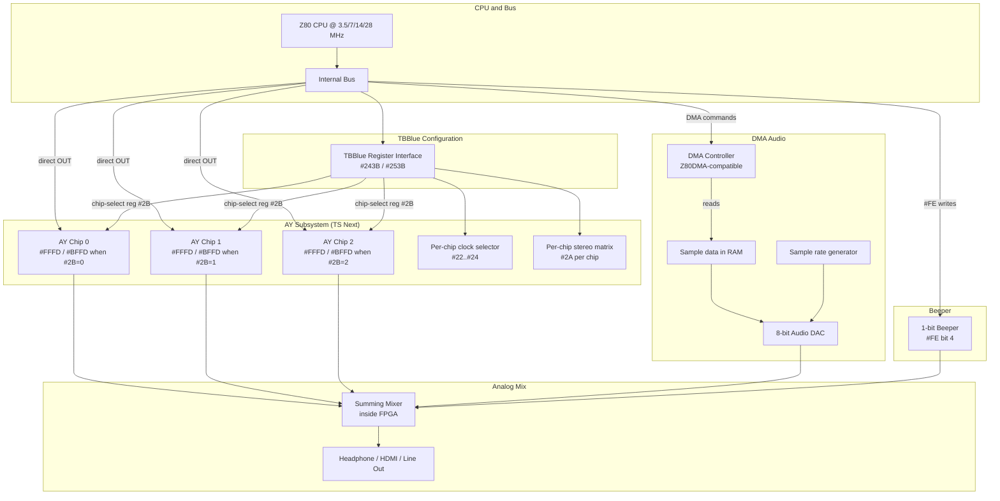
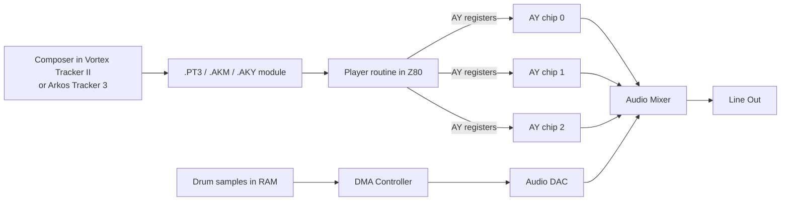

[← Home](../../README.md) · [Sound](../README.md) · [Hardware](README.md)

# ZX Spectrum Next Audio — 3× AY, Hardware DMA, and a Beeper Inside an FPGA

> **Applies to**: **New Gen** — the ZX Spectrum Next only. Other FPGA-based Spectrums (TS-Conf, Sprinter, ZX Evolution) implement parts of this feature set but not the complete Next audio subsystem.

---

## Overview

The ZX Spectrum Next ships with the most powerful audio subsystem ever fitted to a Spectrum-class machine. Inside the FPGA, three independent AY chips, a DMA-driven 8-bit DAC, and a legacy 1-bit beeper run simultaneously — every sound source the platform accumulated over 35 years, plus hardware sample playback that needs no CPU time at all.

This is not just an upgrade. It is the **canonical final state** of the Spectrum audio story. Every musical technique the scene invented — beeper engines, AY chiptune, TurboSound, sample playback — runs natively on the Next, often faster and cleaner than on the original hardware that invented it. Composers can mix three AY-driven melodic lines with a DMA-backed drum loop, all without contending for CPU time, all routed through a 16-routing stereo matrix per chip.

The hardware is impressive but the **programming model is unfamiliar**. The Next does not expose its three AY chips through the Soviet-style `#FF` bank-select port — it uses a modern **TBBlue core register** scheme that allows per-chip clock selection, per-chip stereo routing, and software-selectable sample rate. Software written for Pentagon TurboSound runs in a **legacy compatibility mode**, but new code that targets the Next directly unlocks capabilities Soviet hardware could only dream of.

> [!IMPORTANT]
> **The Next is a layered system, not a single chip.** Software targeting the Next must understand three subsystems: the **3× AY block** (TurboSound Next), the **DMA audio block** (hardware sample playback), and the **beeper block** (48K compatibility). Each has its own register interface and its own analog output path. They are mixed externally by the FPGA's audio router.

This article is the **complete hardware reference** for the Next audio subsystem. For TurboSound-specific architecture (bank-select history, Soviet clone variants), see [TurboSound — Dual and Triple AY Configuration](turbosound.md). For the AY chip itself, see [AY-3-8910 / 8912 / 8913 / YM2149F — PSG Silicon](ay_3_8912.md). For stereo routing options, see [Stereo Audio Modifications](stereo_audio.md).

### Naming Convention

| Term | Meaning |
|---|---|
| **Next** | The ZX Spectrum Next, a 2017 FPGA-based reimplementation of the Spectrum architecture |
| **TBBlue** | The Next's hardware core — handles the configuration registers accessed via `#243B`/`#253B` |
| **TS Next (TS3)** | TurboSound Next — the three-AY configuration on the Next |
| **DMA Audio** | A dedicated DMA channel that streams 8-bit samples from RAM to an audio DAC, fully independent of the CPU |
| **Beeper** | The legacy 1-bit `#FE`-port speaker, preserved for 48K beeper-music compatibility |
| **Core register** | A TBBlue configuration register (256 registers, accessed via the `#243B` index port) |

> [!NOTE]
> **The Next is not a clone.** It is a reimplementation. Where Soviet clones added features by bolting on extra hardware, the Next implements every feature inside an FPGA, with the original Sinclair hardware behavior preserved as one of several selectable layers. This article uses "chip" loosely — none of the Next's sound "chips" are physical silicon.

---

## Architecture Overview

The Next audio subsystem is composed of four parallel signal paths, summed at the FPGA's audio output and sent to the physical headphone jack.



### Output Summing

All four signal sources are summed digitally inside the FPGA before the final DAC. The relative levels are fixed at hardware design time and cannot be changed by software. In approximate terms:

| Source | Relative Level | Notes |
|---|---|---|
| AY chip 0 | 100% | Reference level — same as stock 128K AY |
| AY chip 1 | 100% | Equal to chip 0 |
| AY chip 2 | 100% | Equal to chip 0 |
| DMA audio | 100% | Hardware-level sample playback at full volume |
| Beeper | ~50% | Quieter than the AY channels — matches 48K beeper mixing |

If everything plays at once at full volume, the sum can clip. The DMA audio is typically attenuated in software (lower the 8-bit sample values) to leave headroom for the AY channels.

### The Clock Tree

The Next's master clock is 28 MHz, divided down for various subsystems:

| Subsystem | Clock Source | Default Rate | Notes |
|---|---|---|---|
| Z80 CPU | 28 MHz ÷ N | 3.5/7/14/28 MHz (turbo modes) | Software-selectable |
| AY chip 0 | TBBlue reg `#22` | 1.7734 MHz | ZX 128K standard rate |
| AY chip 1 | TBBlue reg `#23` | 1.7734 MHz | Same |
| AY chip 2 | TBBlue reg `#24` | 1.7734 MHz | Same |
| DMA audio | Software-divided | Up to ~48 kHz | Sample-rate programmable |
| Beeper | Asynchronous | (depends on CPU write rate) | Toggles on `#FE` bit 4 writes |

Per-chip clock selection is the Next's killer feature for AY music — a single piece of music can play on the AY at the original ZX rate, with a second AY running at the Atari ST rate (2.0 MHz) for cross-platform compatibility testing, and a third at the MSX rate.

---

## AY Subsystem (TurboSound Next) in Detail

The Next's three AY chips are accessed through the same `#FFFD` / `#BFFD` ports as the original 128K, but a TBBlue configuration register selects which chip responds. This scheme replaces the bank-select port used by Soviet clones and is the official Next-native interface.

### TBBlue Audio Registers

The complete audio-related TBBlue register map:

| TBBlue Reg | Name | Purpose |
|---|---|---|
| `#08` | `PERIPHERALS_1` | Bit 4: AY mono mode (0=stereo). Other bits: machine config. |
| `#11` | `VIDEO_TIMING_MOD` | (not audio) |
| `#22` | `AY_CHIP_0_CLOCK` | AY chip 0 clock source: 0=1.7734 MHz (ZX), 1=1.5 MHz (MSX), 2=2.0 MHz (Atari ST), 3=2.4576 MHz (modern) |
| `#23` | `AY_CHIP_1_CLOCK` | Same options for AY chip 1 |
| `#24` | `AY_CHIP_2_CLOCK` | Same options for AY chip 2 |
| `#2A` | `AY_STEREO` | Stereo routing for the currently-selected chip (16 routings) |
| `#2B` | `AY_ACTIVE_CHIP` | Selects which AY chip (0, 1, or 2) responds to `#FFFD`/`#BFFD` |
| `#2C` | `TURBOSOUND_NEXT` | Bit 0: enable legacy `#FF` TS bank-select port for compatibility |

### Selecting the Active AY Chip

```z80
; -------------------------------------------------------
; Select the active AY chip on the Next.
; Entry: A = chip number (0, 1, or 2)
; Destroys: A, B, C
; -------------------------------------------------------
NEXT_AY_SELECT:
    LD   E,A             ; save chip number in E
    LD   BC,#243B        ; TBBlue register index port
    LD   A,#2B           ; AY_ACTIVE_CHIP
    OUT  (C),A
    LD   B,#25           ; BC = #253B data port
    LD   A,E
    OUT  (C),A           ; write chip number
    RET
```

After this call, all `#FFFD`/`#BFFD` access goes to the selected AY chip.

### Per-Chip Clock Configuration

Each AY chip on the Next has its own clock source, set via a separate TBBlue register:

```z80
; -------------------------------------------------------
; Configure AY chip 1 to use Atari ST clock (2 MHz).
; -------------------------------------------------------
NEXT_AY1_ST_CLOCK:
    LD   BC,#243B
    LD   A,#23           ; AY_CHIP_1_CLOCK register
    OUT  (C),A
    LD   B,#25
    LD   A,2             ; 2 = 2 MHz (Atari ST)
    OUT  (C),A
    RET
```

Available clock values:

| Value | Clock | Equivalent Platform |
|---|---|---|
| 0 | 1.7734 MHz | ZX Spectrum 128K (default) |
| 1 | 1.5000 MHz | MSX (rare, used for some Japanese AY music) |
| 2 | 2.0000 MHz | Atari ST (YM2149) |
| 3 | 1.7500 MHz | Pentagon (Soviet clone) — *if supported by core revision* |
| 4 | 2.4576 MHz | Modern AY (used by some FPGA cores) |

Software that needs bit-exact reproduction of Pentagon-period music should set the chip clock to value 3 (Pentagon rate) rather than value 0 (ZX rate). This eliminates the ~1.3% tuning difference between the two clocks.

### Per-Chip Stereo Routing

TBBlue register `#2A` configures the stereo routing for the **currently selected** chip (selected via `#2B`). The register's 8 bits encode 16 possible routings for the chip's three channels:

```
AY_STEREO register (#2A):
  bits 0..1: Channel A routing
              00 = left, 01 = right, 10 = mono, 11 = silent
  bits 2..3: Channel B routing
  bits 4..5: Channel C routing
  bits 6..7: reserved (always 00)
```

Common routing values:

| Value | Channel A | Channel B | Channel C | Use case |
|---|---|---|---|---|
| `#00` | left | left | left | All left (mono to left ear) |
| `#15` | right | right | right | All right (mono to right ear) |
| `#2A` | mono | mono | mono | Pure mono (matches stock 128K) |
| `#3F` | silent | silent | silent | Chip muted entirely |
| `#07` | left | mono (L+R) | right | ABC stereo |
| `#1B` | right | mono (L+R) | left | ACB stereo |

For the complete 16-routing table, see [Stereo Audio Modifications](stereo_audio.md).

```z80
; -------------------------------------------------------
; Configure AY chip 2 for ABC stereo.
; -------------------------------------------------------
NEXT_AY2_ABC:
    ; 1. Select chip 2
    LD   A,2
    CALL NEXT_AY_SELECT

    ; 2. Set ABC stereo for the selected chip
    LD   BC,#243B
    LD   A,#2A           ; AY_STEREO
    OUT  (C),A
    LD   B,#25
    LD   A,#07           ; #07 = ABC routing
    OUT  (C),A
    RET
```

### Legacy Compatibility Mode

For software written for the Pentagon/Scorpion/ATM Turbo TurboSound standard, the Next provides a **legacy mode** enabled via TBBlue register `#2C`. When enabled:

- The standard `#FF` bank-select port becomes active
- Bank-select bit 0 switches between AY chips 0 and 1 (matching Pentagon TS)
- AY chip 2 is accessible via the bank-select bit 1 (TS-Conf style)
- The native `#2B` chip-select register is **disabled** — software must choose between legacy and native modes

Legacy mode is the default at boot, ensuring Pentagon TS modules play without modification. New software should explicitly switch to native mode for full per-chip control.

```z80
; Switch from legacy Pentagon TS mode to native Next TS Next mode
DISABLE_LEGACY_TS:
    LD   BC,#243B
    LD   A,#2C           ; TURBOSOUND_NEXT
    OUT  (C),A
    LD   B,#25
    XOR  A               ; A = 0 = disable legacy mode
    OUT  (C),A
    RET
```

---

## DMA Audio Subsystem

The DMA audio block is the Next's most distinctive feature. It streams **8-bit unsigned PCM samples** from main RAM to a dedicated audio DAC, fully independent of the CPU. The CPU sets up the source address, length, and sample rate, then the DMA engine runs in the background — the CPU is free to do anything else (render graphics, run game logic, even mix in AY-driven music) without affecting sample playback.

This is what the Soviet scene's Covox/SounDrive add-ons tried to be — but the Covox needs the CPU to feed it one byte at a time. The Next's DMA audio needs the CPU only for setup. The difference is dramatic: the DMA audio can sustain **48 kHz sample playback** while the CPU does something else entirely.

### DMA Controller Architecture

The Next's DMA controller is a **Z80DMA-compatible** peripheral at port `#6B` (register) and `#EB` (data). The DMA controller can transfer bytes between any two of: memory, I/O ports, and other memory regions. For audio use, the typical transfer is **memory → I/O port** — bytes flow from a sample buffer in RAM to the audio DAC port.

The audio DAC port itself is accessed via TBBlue register `#29` (`AUDIO_DMA_CONTROL`), which configures the DMA audio subsystem:

```
TBBlue reg #29 (AUDIO_DMA_CONTROL):
  bit 7: Enable DMA audio
  bit 6: Loop mode (1 = repeat the buffer, 0 = one-shot)
  bits 5..0: Sample rate divisor

Sample rate = 28 MHz / 2 / (divisor + 1) / 1024
```

| Divisor | Sample Rate | Notes |
|---|---|---|
| `#00` | ~13.67 kHz | Low quality, minimal memory use |
| `#0E` | ~22.05 kHz | Standard tape-quality PCM |
| `#1C` | ~44.1 kHz | CD-quality playback |
| `#1F` | ~48 kHz | Maximum useful rate |

### DMA Audio Setup Procedure

Setting up a DMA audio playback involves:

1. **Load the sample into RAM** — anywhere accessible (main RAM, paged RAM, even DivMMC RAM)
2. **Configure the DMA controller** — set source address, length, transfer mode
3. **Configure the audio DAC rate** — via TBBlue register `#29`
4. **Enable the DMA transfer** — the controller starts streaming

```z80
; -------------------------------------------------------
; Play a sample via DMA audio on the ZX Spectrum Next.
; Entry: HL = sample address in main RAM
;        BC = sample length (bytes)
;        D = sample rate divisor (e.g. #1C for 44 kHz)
; Destroys: AF, BC, DE, HL
; -------------------------------------------------------
NEXT_DMA_PLAY:
    ; 1. Reset DMA controller (write to its reset command)
    LD   A,#C3           ; Z80DMA reset command
    OUT  (#6B),A

    ; 2. Configure DMA: memory -> I/O port #xx, audio DAC
    LD   A,#7D           ; Direction: memory-to-I/O
    OUT  (#6B),A
    LD   A,#14           ; Source: increment after each byte
    OUT  (#6B),A

    ; 3. Set source address (HL)
    LD   A,L
    OUT  (#6B),A
    LD   A,H
    OUT  (#6B),A

    ; 4. Set length (BC)
    LD   A,C
    OUT  (#6B),A
    LD   A,B
    OUT  (#6B),A

    ; 5. Configure the audio DAC rate via TBBlue register #29
    PUSH HL
    PUSH BC
    LD   BC,#243B        ; TBBlue index port
    LD   A,#29           ; AUDIO_DMA_CONTROL
    OUT  (C),A
    LD   B,#25           ; BC = #253B
    LD   A,D             ; rate divisor
    OR   %10000000       ; set bit 7 = enable DMA audio
    OUT  (C),A
    POP  BC
    POP  HL

    ; 6. Enable the DMA transfer
    LD   A,#87           ; DMA enable command
    OUT  (#6B),A
    RET
```

### Loop vs. One-Shot

For background music loops, set TBBlue register `#29` bit 6 (loop mode). The DMA controller will wrap around to the start of the buffer when it reaches the end, producing seamless looping playback. For one-shot samples (drum hits, sound effects), leave loop mode disabled.

### Memory Bandwidth Considerations

DMA transfers steal bus cycles from the CPU. At the maximum 48 kHz sample rate, the DMA engine reads one byte every ~625 CPU cycles. The Z80 continues running at full speed but loses a few T-states per bus arbitration cycle. In practice, this is invisible — DMA consumes less than 1% of the bus time even at the highest sample rate.

The DMA controller shares the bus with the CPU and the video memory fetch logic. None of these conflict with each other on the Next — the FPGA's bus arbitrator interleaves accesses transparently. There is no equivalent of the Soviet Covox situation where sample playback halts the CPU.

### Sample Format

DMA audio expects **unsigned 8-bit PCM samples** (0..255, with `#80` being silence). Samples can be mono or stereo — stereo uses two interleaved bytes per sample, with the DMA writing to two consecutive DAC ports (this requires a custom DMA setup).

For mono playback, the most common format, the DMA controller simply writes each byte in sequence to the DAC port. The DAC output is sent to both left and right channels of the audio mix.

---

## Beeper Subsystem and 48K Compatibility

The Next preserves the original 48K 1-bit beeper for compatibility with the entire 48K beeper-music catalog. This includes hundreds of demos, games, and the celebrated 1-bit music engines by **Tim Follin**, **Shiru**, **utz**, **Mr BEEP**, and dozens of others — see [Beeper Synthesis](../synthesis/beeper_synthesis.md) for the engine catalog.

### Port Interface

The beeper uses the same `#FE` port as the original 48K:

| Port | Decoding | Bit | Function |
|---|---|---|---|
| `#FE` | A0=0 | 4 (write) | Speaker / EAR output — toggling bit 4 produces 1-bit audio |
| `#FE` | A0=0 | 6 (read) | EAR input — used for tape loading and reading |

Writes to `#FE` are routed to the FPGA's beeper logic and the border-color logic simultaneously — exactly as on the original ULA. Beeper music engines that work on a 48K work unmodified on the Next.

### Timing Fidelity

The Next can run the Z80 at the original 3.5 MHz (turbo mode 0), which preserves the exact timing of beeper engines. Running in a higher turbo mode (7/14/28 MHz) **breaks** most beeper engines because they rely on cycle-exact `OUT (#FE),A` patterns to produce specific frequencies. The Next's boot menu defaults to 3.5 MHz for this reason.

```mermaid
graph LR
    subgraph "Beeper Path (legacy)"
        CPU[Z80 @ 3.5 MHz]
        FE["Port #FE
border/beeper/EAR"]
        BORDER[Border Color Latch]
        BEEP[1-bit Beeper Logic]
        MIX[Audio Mixer]
    end
    CPU -->|OUT (#FE),A| FE
    FE -->|bits 0..2| BORDER
    FE -->|bit 4| BEEP
    BEEP --> MIX
```

### Mixing the Beeper with AY and DMA

The beeper output is summed with the AY chip outputs and the DMA audio at the FPGA's audio mixer. The beeper's relative level is **fixed at approximately 50% of an AY channel** — it cannot be adjusted in software. If a beeper engine and an AY engine run at the same time, both are audible, with the AY slightly louder than the beeper.

This is rarely useful — most software chooses one or the other. But it allows a transitional use case: a beeper-only 48K demo can have its title screen accompanied by AY music without muting the in-game beeper sound effects.

### Beeper Compatibility Edge Cases

The Next replicates most 48K timing quirks faithfully, including ULA contention during screen drawing. However, a few edge cases differ:

| Behavior | Original 48K | Next (in 48K mode) | Notes |
|---|---|---|---|
| ULA contention timing | Deterministic (every 8th cycle delayed) | Bit-accurate replica | Cycle-exact beeper engines work correctly |
| Floating bus reads | Real floating bus values | Bit-accurate replica via `#FE` reads | Shiru's engines that poll the bus work |
| Contended I/O timing | Per-cycle delays | Bit-accurate replica | Required for high-frequency PWM beeper techniques |
| High-frequency PWM aliases | Real aliases from ULA clock | Slightly different aliases (FPGA is faster) | Some utz engines produce slightly different timbres |

For most software, the Next's 48K compatibility is indistinguishable from real hardware. The handful of demos that depend on sub-cycle ULA behavior may sound subtly different.

---

## Programming Model — Combining Subsystems

The Next's audio subsystems can run simultaneously. A complete Next music pipeline typically uses **3× AY for melodic content** plus **DMA audio for sample-based drums or vocals**, with the beeper optionally adding a layer of texture for retro effect.

### Typical Music Pipeline



The composer creates the melodic content in a tracker that supports TurboSound (Vortex Tracker II or Arkos Tracker 2+). Drums are loaded separately as raw 8-bit PCM samples in RAM. The player routine runs from the ULA frame interrupt (50 Hz) and writes the AY registers; the DMA controller runs independently at the chosen sample rate.

### Complete Music Initialization

```z80
; -------------------------------------------------------
; Initialize the Next audio subsystem for a complete song:
;  - 3× AY at ZX 128K clock (1.7734 MHz)
;  - Per-chip ABC stereo routing
;  - DMA drum loop at 22 kHz
; -------------------------------------------------------
NEXT_AUDIO_INIT:
    ; 1. Disable legacy TS mode for native control
    CALL DISABLE_LEGACY_TS

    ; 2. Configure each AY chip for ABC stereo at ZX clock
    LD   A,0
    CALL NEXT_AY_SELECT
    CALL SET_ABC_STEREO_FOR_CURRENT
    LD   A,1
    CALL NEXT_AY_SELECT
    CALL SET_ABC_STEREO_FOR_CURRENT
    LD   A,2
    CALL NEXT_AY_SELECT
    CALL SET_ABC_STEREO_FOR_CURRENT

    ; 3. Initialize each AY chip to silence
    LD   A,0
    CALL NEXT_AY_SELECT
    CALL AY_INIT_SILENCE
    LD   A,1
    CALL NEXT_AY_SELECT
    CALL AY_INIT_SILENCE
    LD   A,2
    CALL NEXT_AY_SELECT
    CALL AY_INIT_SILENCE

    ; 4. Set up DMA drum loop (22 kHz, looped)
    LD   HL,DrumLoopSample
    LD   BC,DrumLoopLength
    LD   D,#0E            ; 22 kHz divisor
    CALL NEXT_DMA_PLAY

    ; 5. Initialize the music player
    CALL MUSIC_PLAYER_INIT
    RET

; Helper: set ABC stereo for the currently-selected AY chip
SET_ABC_STEREO_FOR_CURRENT:
    LD   BC,#243B
    LD   A,#2A
    OUT  (C),A
    LD   B,#25
    LD   A,#07           ; ABC routing
    OUT  (C),A
    RET

; Helper: initialize an AY chip to silence (R7 = #3F, all volumes = 0)
AY_INIT_SILENCE:
    LD   BC,#FFFD
    LD   A,7
    OUT  (C),A
    LD   B,#BF
    LD   A,#3F           ; all tone + noise disabled
    OUT  (C),A
    LD   B,#FF           ; BC = #FFFD
    LD   A,8
AY_INIT_LOOP:
    OUT  (C),A           ; select register 8/9/10
    PUSH AF
    LD   B,#BF
    LD   A,0             ; volume = 0
    OUT  (C),A
    LD   B,#FF
    POP  AF
    INC  A
    CP   11              ; registers 8, 9, 10
    JR   NZ,AY_INIT_LOOP
    RET
```

### Frame Budget for Full Audio Pipeline

On the Next running at the default 3.5 MHz with the standard 50 Hz interrupt:

| Component | Per-Frame Cost | Notes |
|---|---|---|
| Music player (3 AY chips, 14 regs each) | ~2,200 T-states | Writes via TBBlue `#2B` chip select |
| DMA drum loop (background) | 0 T-states | Runs independently |
| Effect (e.g., scroll, parallax) | ~30,000 T-states | Whatever the demo requires |
| Game logic / main loop | ~20,000 T-states | Whatever the game requires |
| **Available headroom** | ~21,000 T-states | Plenty of CPU for visual effects |

The DMA audio frees the CPU from sample playback, making the Next a uniquely capable music-and-graphics demo platform.

### Turbo Mode Considerations

When the CPU is switched to 7/14/28 MHz (turbo modes 1/2/3), the AY chips and DMA audio continue running at their original rates — they are clocked from the 28 MHz master, not from the CPU clock. The beeper engine will break (it depends on cycle-exact CPU timing), but AY + DMA music works correctly at any CPU speed.

For maximum headroom on demos, run at 14 or 28 MHz. The AY register writes complete faster, the music player uses a smaller fraction of the frame budget, and the DMA audio is unaffected.

---

## Pitfalls and Common Mistakes

### Pitfall 1: Wrong Chip Selected After ISR

**Symptom**: Music plays on the wrong AY chip — channel allocations are scrambled after a few seconds of playback.

**Cause**: Same as standard TurboSound — the active-chip register (`#2B`) is global state. If the ISR switches to chip 1 for a write and does not restore chip 0, the main loop's next AY write goes to chip 1.

**Fix**: Always end the ISR by selecting chip 0 as the default. See [TurboSound Pitfall 1](turbosound.md#pitfall-1-the-bank-leak) for the canonical pattern.

### Pitfall 2: DMA Loop Hiccup

**Symptom**: A looping DMA sample has an audible click or hiccup at the loop point.

**Cause**: The DMA controller's wrap-around logic requires the sample buffer to start and end on values close to `#80` (silence). A buffer that starts at `#00` and ends at `#FF` produces a click at the wraparound because the DAC jumps between extreme values.

**Bad code**: raw sample data without editing:

```z80
DrumLoopSample:
    DB   #FF, #FE, #FD, ...   ; starts at maximum
    ...
    DB   #00, #00, #00        ; ends at zero
```

**Correct**: edit the sample so it starts and ends at `#80`:

```z80
DrumLoopSample:
    DB   #80, #82, #85, ...   ; fade in from silence
    ...
    DB   #84, #82, #80        ; fade out to silence
```

### Pitfall 3: Per-Chip Clock Mismatch

**Symptom**: Three AY chips play the same note at different pitches.

**Cause**: The composer assumed all three chips share the same clock source, but the per-chip clock registers (`#22`, `#23`, `#24`) are set to different values.

**Fix**: Explicitly set all three chips to the same clock at init, or document the per-chip clock as a feature (e.g., "chip 2 runs at Atari ST rate for cross-platform testing").

### Pitfall 4: Legacy Mode Left Enabled

**Symptom**: Software that targets native TS Next mode produces silent AY chips 1 and 2 — only chip 0 plays.

**Cause**: Legacy mode (`#2C` bit 0 = 1) is enabled by default at boot. Native chip-select register `#2B` is disabled while legacy mode is active.

**Fix**: Always call `DISABLE_LEGACY_TS` at the start of any Next-native audio initialization.

---

## Best Practices

1. **Disable legacy TS mode at startup** if you intend to use native Next TS Next controls. Otherwise, your `#2B` writes will be ignored.
2. **Use per-chip stereo routing** (`#2A`) for granular spatial control — each chip can have its own routing.
3. **Match the per-chip clock to your source material**: ZX music at 1.7734 MHz, Pentagon at 1.75 MHz, Atari ST at 2 MHz. Setting the right clock eliminates 1-3% tuning errors.
4. **Pre-process DMA samples** to start and end near `#80` to avoid click artifacts at loop boundaries.
5. **Test at multiple CPU speeds** (3.5 MHz and 14 MHz) to ensure timing-tolerant code. Beeper engines break at higher speeds; AY and DMA do not.
6. **Restore chip 0 as default** at ISR exit — same as standard TurboSound.
7. **Use the highest sample rate the memory budget allows** for DMA audio. 22 kHz is the practical minimum for music; 44 kHz is indistinguishable from CD for most listeners.

---

## When to Use Each Subsystem

| Use Case | Subsystem | Notes |
|---|---|---|
| 3-channel PSG music (lead/bass/drums) | AY chip 0 only | Matches 128K stock behavior |
| 6-channel PSG music (Soviet TS modules) | AY chips 0 + 1, legacy mode | Maximum compatibility with existing PT3 modules |
| 9-channel PSG music (Next-native modules) | AY chips 0 + 1 + 2, native mode | Use Arkos Tracker 2+ for composition |
| Sample-based drums / vocals / speech | DMA audio | CPU-independent playback up to 48 kHz |
| 1-bit beeper music (Tim Follin, Shiru, utz) | Beeper only | Requires 3.5 MHz CPU mode |
| Hybrid music: melodic PSG + sample percussion | AY + DMA | The Next's signature sound |
| Cross-platform AY testing | All 3 chips at different clocks | One chip per target platform |

### When NOT to Use the Next Audio Subsystem

- **Targeting original 128K / +2 / +3** — none of the Next's audio features are present. Software must work with a single AY at 1.7734 MHz.
- **Targeting Soviet clones without TS** — most Pentagons lack TurboSound; software must work with a single AY.
- **Writing cycle-exact code for stock hardware** — the Next's timing is bit-accurate but subtly different from real ULA silicon; test on real 128K for hardware-accurate demos.

---

## Cross-Platform Comparison

The Next audio subsystem occupies a unique position in retro computing:

| Platform | Total Channels | Sample Playback | Notes |
|---|---|---|---|
| **ZX Spectrum 48K (stock)** | 1 (beeper) | Software-driven, CPU-intensive | The original |
| **ZX Spectrum 128K (stock)** | 3 (AY) + 1 (beeper) | Volume-modulated samples on AY | Soviet scene extended this with TS |
| **ZX Spectrum + TurboSound** | 6 (2× AY) | Same as 128K | Soviet innovation, 1992+ |
| **ZX Spectrum Next** | 9 (3× AY) + DMA + beeper | Hardware DMA up to 48 kHz | The modern maximum |
| **Atari ST** | 3 (YM2149) | Software-driven | Single chip, no DMA audio |
| **Amiga OCS** | 4 (sampled) | Hardware DMA, 4× 8-bit | Different architecture — pure sampling |
| **Commodore 64** | 3 (SID) | Software-driven | Synthesis-only, no DMA |
| **Amstrad CPC** | 3 (AY) | Same as ZX | Single AY, same chip |
| **MSX-MUSIC (YM2413)** | 9 FM + 5 percussion + 1 ADPCM | Built-in ADPCM on some variants | Different synthesis model |

### Modern Analogies

| Retro Concept | Modern Equivalent | Notes |
|---|---|---|
| Per-chip stereo matrix | Per-track pan in modern DAWs | Next gives per-channel pan per chip |
| Hardware DMA sample playback | Modern audio interface playback | CPU-independent streaming |
| Per-chip clock selection | Sample-rate conversion | Next swaps the actual oscillator instead |
| Legacy TS compatibility | Backward compatibility modes in modern OSes | Native mode for new features, legacy for old software |
| TBBlue core registers | Modern sound card configuration registers | Same concept: out-of-band control plane |

---

## Impact on Emulation and FPGA

Emulating the Next audio subsystem is straightforward in software — three independent AY emulations plus a simple DMA-driven DAC. The challenges are subtler:

1. **Per-chip clock must be respected**. Emulators that force a single AY clock will produce wrong tuning for music that targets non-default clocks.
2. **TBBlue register reads must return correct values**. Software probing the machine ID at register `#00` expects specific values for a real Next.
3. **Legacy mode must coexist with native mode**. Software may toggle modes mid-execution.
4. **DMA loop behavior must be exact**. Loop clicks are audible — emulators that wrap imprecisely produce clicks where real hardware does not.
5. **Beeper contention timing must match real ULA**. Beeper engines depend on cycle-exact delays.

FPGA implementations of the Next core (such as the **SpectrumNext** core for MiSTer) reproduce all of these accurately.

---

## References

### Primary Sources

- **ZX Spectrum Next Official Documentation** — [zxnext.io](https://zxnext.io/), 2017–present. Authoritative reference for the TBBlue register map and audio subsystem.
- **TBBlue Register Specification** — Maintained by the Next team. Documents registers `#08`, `#22`–`#24`, `#29`–`#2C` for audio configuration.
- **ZX Spectrum Next Core Source** — open-source Verilog, available on GitHub. The `audio.v` and `psg.v` modules document the FPGA implementation.

### Community Knowledge

- [specnext.dev](https://specnext.dev/) — community-maintained Next documentation
- [ZX Spectrum Next Forums](https://www.specnext.com/) — official community discussion, includes audio Q&A
- [Arkos Tracker 3 documentation](https://www.julien-nevo.com/arkostracker/) — multi-PSG support targeting Next
- [Vortex Tracker II documentation](http://bulba.untergrund.net/) — TS and TS Next export modes

### Cross-References

- [AY-3-8910 / 8912 / 8913 / YM2149F — PSG Silicon](ay_3_8912.md) — the AY chip hardware reference
- [TurboSound — Dual and Triple AY Configuration](turbosound.md) — TS history, bank-select, per-clone variants
- [TurboSound FM — YM2203 OPN FM Synthesis](turbosound_fm.md) — FM expansion alongside TS (not on the Next by default)
- [Stereo Audio Modifications](stereo_audio.md) — ABC/ACB/BytesDelight stereo routing, fully software-configurable on Next
- [Beeper Synthesis](../synthesis/beeper_synthesis.md) — 1-bit beeper music engines, all of which run on Next
- [AY/YM PSG Hardware Reference: Architecture, Registers, Counter Model](../synthesis/ay_ym_synthesis.md) — programmer's view of the AY
- [Multi-Track and Multi-Chip Synthesis](../synthesis/multitrack_multichip.md) — composition techniques for multi-AY
- [General Sound](gs_general_sound.md) — Soviet sample-mixing sound card (alternative to DMA audio)
- [Covox & SounDrive](covox_sounDrive.md) — Soviet CPU-driven sample playback (what DMA audio replaces)
- [Sound Hardware Ecosystem Overview](sound_overview.md) — full decision guide across all sound hardware options

