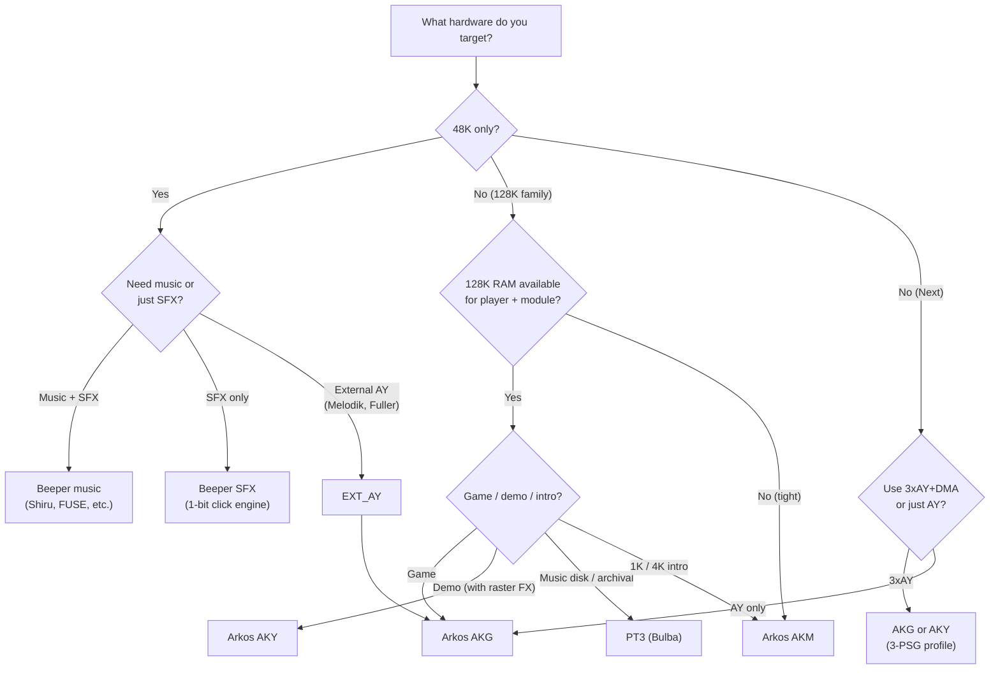

[← Home](../../README.md) · [Sound](../README.md) · [Players](README.md)

# Audio Decision Guide — Which Hardware, Format, and Player

## Overview

Choosing a ZX Spectrum audio stack involves three coupled decisions:

1. **Target hardware** — which machine(s) the program must run on (48K, 128K, +2A/+3, Pentagon, ZX Next, etc.). This determines what sound chips are available.
2. **Sound chip(s)** — beeper (1-bit, all Spectrums), AY-3-8912 / YM2149 (128K family and clones), TurboSound (dual-AY, mainly Pentagon), SAA1099 (SAM Coupé, some clones), MoonSound (Yamaha OPL4, rare), or DMA-driven digital (ZX Next). See [sound_overview.md](../hardware/sound_overview.md).
3. **Music format + player** — the tracker format the composer uses (PT3, Arkos AKG/AKM/AKY, etc.) and the corresponding player routine. See [player_comparison.md](player_comparison.md).

The three decisions form a chain: **hardware → available chips → format → player**. The hardware constrains the chips; the chips constrain the formats (a tracker that targets AY won't produce MoonSound music); the format constrains the player.

This guide walks through the decision tree step by step, with explicit recommendations for the most common scenarios. For the format-level binary specifications, see [pt3_format.md](../trackers_and_formats/pt3_format.md) and [arkos_tracker.md](../trackers_and_formats/arkos_tracker.md); for the player benchmarks, see [player_comparison.md](player_comparison.md); for the hardware catalogue, see [sound_overview.md](../hardware/sound_overview.md).

---

## The Decision Tree

The flowchart below shows the high-level decision. Each branch is explained in detail in the sections that follow.

The rest of this guide elaborates each branch.

---

## Step 1: Identify Your Target Hardware

The first question is always: **what hardware does your program need to run on?** The ZX Spectrum family has very different sound capabilities across models:

| Hardware | Built-in sound | External sound options |
|----------|----------------|-----------------------|
| **16K / 48K / 48K+** | Beeper (1-bit) only | Melodik (AY), Fuller Box (AY), Currah µSpeech (speech synth), various Covox/DAC boards |
| **128K "Toastrack" / +2 grey** | Beeper + AY-3-8912 (clocked at 1.7734 MHz) | All of the above, plus TurboSound (dual-AY) on some clones |
| **+2A / +3 / +2B / +3B** | Beeper + AY-3-8912 (clocked at 1.7734 MHz) | Same as 128K/+2 |
| **Pentagon 128 / 512 / 1024** | Beeper + AY (clocked at 1.75 MHz) | TurboSound (standard on later models); Covox; Soundrive (TLC7226CN) |
| **Scorpion ZS-256 / Turbo+** | Beeper + AY (Sinclair timing) | SMUC ISA bridge (SoundBlaster-compatible); Covox |
| **Kay 1024 / Profi 5103** | Beeper + AY | Covox; Soundrive |
| **ATM Turbo 2 / 3** | Beeper + AY (4 video modes) | Covox; IDE (no sound); TurboSound on some builds |
| **ZX Spectrum Next** | Beeper + 3× AY (FPGA) + 8-channel DMA + ResSound + SpecDrum | All of the above (it's FPGA-configurable); Pi Zero co-processor for software audio |
| **SAM Coupé** (Sinclair-derived) | SAA1099 (Philips) | External AY, Covox |

If you target **only the 48K**, your sound options are very limited: beeper-only by default, or an external AY peripheral (Melodik, Fuller) if you can assume the user has one. If you target the 128K family, AY is always available. If you target the Pentagon or a modern FPGA machine (Next), you have multi-PSG options.

### Multi-target considerations

The most painful decision is when you want to ship a single binary that runs on multiple targets. The classic cases:

- **48K + 128K combined release** — common for games. The standard pattern: ship the 48K version with beeper music (or no music), and the 128K version with AY music. The two are usually loaded from different sides of the same cassette or different files on the same disk.
- **Sinclair 128K + Pentagon** — common for late-Soviet / Russian-scene releases. The same AY music works on both, but plays ~1.3% slower/lower on the Pentagon (1.75 MHz AY vs 1.7734 MHz). This is usually accepted; if not, ship two versions of the music module.
- **Sinclair 128K + ZX Spectrum Next** — common for modern releases. The Next can run any 128K software and add its extra hardware (3×AY, DMA) on top; modern games sometimes ship a 128K-mode music + Next-mode enhanced music in the same binary.

For single-binary multi-target releases, see the "Compatibility Matrix" below.

---

## Step 2: Choose the Sound Chip(s)

Given the hardware from Step 1, decide which sound chip(s) you will actually use. The trade-offs:

| Chip | Channels | Capability | CPU cost | Code complexity | Best for |
|------|----------|------------|----------|-----------------|----------|
| **Beeper (1-bit)** | 1 (or 2-5 with engine tricks) | Square-wave + primitive drums via PWM | High (entire frame for polyphony) | Medium (engine design) | 48K-only games; demoscene 1K/4K intros; speech synthesis |
| **AY-3-8912 / YM2149** | 3 tone + 1 noise + 1 envelope | 3-voice chiptune with hardware envelopes; basic drums | Low (~2–4% of frame for a player) | Low (player is supplied) | Any game/demo with music; the default choice on 128K |
| **TurboSound (2× AY)** | 6 tone + 2 noise + 2 envelope | 6-voice chiptune; richer textures | Medium (~4–8% of frame) | Medium (multi-PSG player) | Pentagon demos; modern 128K demos |
| **SAA1099** | 6 tone + 2 noise | Different sound character (Philips); 8 octave generators | Medium | Medium | SAM Coupé software; rare on ZX clones |
| **MoonSound (OPL4)** | Up to 32 (24 PCM + 8 FM) | Sample playback + FM synthesis | Low (chip does the work) | High (bank-switching setup) | Russian-scene demos on Pentagon/Scorpion with the MoonSound board |
| **DMA digital (Next)** | 1-8 channels | 8-bit PCM playback, hardware mixed | Very low (DMA does the work) | Low | ZX Next games/demos needing real samples |
| **Covox / Soundrive (DAC)** | 1 (mono) or 2 (stereo) | 8-bit PCM playback; software-mixed multi-channel | Very high (CPU must feed samples every ~100 µs) | High (mixer code) | Demoscene digital music (Sound Tracker, Digital Music Maker); modern beeper-style |

### The sensible-default rule

If you are unsure and your target has AY (i.e. anything from the 128K onward), **start with single-AY using PT3 or AKG**. This is what 95% of ZX Spectrum software does, and it's the lowest-friction path to music that sounds good. Add complexity only when you have a specific reason.

### Beeper as a fallback

For 48K-only software, the beeper is your only built-in option. Beeper music is an art form in itself — the engines (Shiru's, FUSE, engine-of-the-month from the demoscene) can produce surprisingly rich sounds using pulse-width modulation and timed toggling of the speaker bit. See [beeper_synthesis.md](../synthesis/beeper_synthesis.md) for the techniques.

If you ship a 48K version with beeper music and a 128K version with AY music, the 128K version is almost always perceived as "the better one" — but the 48K version is essential because there are still more 48K Spectrums in working condition than 128K ones.

---

## Step 3: Choose the Music Format

Given the sound chip from Step 2, choose the music format the composer will work in. The major options:

| Format | Target chip | Tracker | Player family | Notes |
|--------|-------------|---------|---------------|-------|
| **PT3** | AY (single) | Vortex Tracker II (VTII) | PT3 player (Bulba) | The de facto interchange format; largest archive. Soviet lineage. |
| **Arkos AKG source (`.aks`)** | AY (single or multi) | Arkos Tracker 2/3 | AKG player | Modern, balanced profile. Note-based = cross-platform portable. |
| **Arkos AKM profile** | AY (single only) | Arkos Tracker 2/3 | AKM player | Smallest player; for size-limited intros. |
| **Arkos AKY profile** | AY (single or multi) | Arkos Tracker 2/3 | AKY player | Fastest; supports digidrums and pitched samples. Pre-encoded periods. |
| **PSG** | AY (single) | Various (raw register dump) | PSG player | Universal pre-rendered format. Plays any AY music. Largest file size. See [psg_format.md](../trackers_and_formats/psg_format.md). |
| **ASM** | AY (single) | Sound Tracker / E-Tracker (Russian) | ASM player | Soviet 1990s format; rarely used outside the Russian scene. |
| **SAP / CWM** | AY (single) | Ay_Emul (Russian) | SAP/CWM player | Specialised Russian-scene formats; rarely used today. |
| **DSQ** | AY (single) | Digital Sound System SQ (Russian tracker) | DSQ player | Digidrum-heavy; demoscene niche. |
| **YM** | AY (single) | ST-Sound (PC) | YM player | Atari ST-originated; rarely used on ZX. |
| **MOD** | AY + Covox (sample-based) | Digital Music Maker / Pro Tracker (Digital) | Custom | Software-mixed multichannel via DAC; very high CPU. |
| **Beeper formats** (SQT, etc.) | Beeper (1-bit) | 1BitTracker / custom engines | Custom | For 48K beeper music; very specific to the engine. |

### The default-format rule

For AY music, the choice is essentially **PT3 vs Arkos AKG/AKM/AKY**. Use:

- **PT3** if the composer is comfortable in VTII, or if you want compatibility with the world's largest existing module archive.
- **Arkos AKG** if the composer uses Arkos Tracker 2/3 (most modern composers do) and the project is a game.
- **Arkos AKM** if the project is a 1K or 4K intro and code size is the dominant constraint.
- **Arkos AKY** if the project is a demo needing digidrums, multi-PSG, or minimal CPU cost.

For non-AY music (beeper, Covox, MoonSound, etc.), the format is dictated by the chip — see the linked format articles.

### PSG as the universal fallback

If your music exists in any tracker format, you can always render it to a **PSG register dump** (one frame's worth of AY register values, recorded every 20 ms). The PSG format is universal — any PSG player can play any PSG file, regardless of the source tracker. The cost is file size: a 3-minute PT3 module might be 5 KB; the same music as a PSG dump is 3 minutes × 60 seconds × 50 frames × 14 bytes = 126 KB.

PSG is therefore suitable for music disks where file size is irrelevant, but unsuitable for games or demos where it matters.

---

## Step 4: Choose the Player

Given the format from Step 3, the player is largely determined — but there are still choices to make. See [player_comparison.md](player_comparison.md) for the full benchmark; the summary:

| Format | Player | Code size | CPU/frame | When to use |
|--------|--------|-----------|-----------|-------------|
| PT3 | Bulba reference player | ~400–600 bytes | ~3,000–4,000 T-states | Default for PT3; the safest choice |
| PT3 | Custom / stripped player | varies | varies | When code size or CPU must be reduced below Bulba's profile; loses sub-version compatibility |
| AKG | Arkos AKG (RAM or ROM variant) | ~1,000–1,500 bytes | ~1,500–2,500 T-states | Default for Arkos in games |
| AKM | Arkos AKM (ROM-only) | ~400–600 bytes | ~800–1,500 T-states | Size-limited intros |
| AKY | Arkos AKY (RAM or ROM variant) | ~600–900 bytes | ~600–1,200 T-states | Demos; digidrum music |

The choice between RAM and ROM player variants: use RAM unless the production is ROM-based (cartridge, shadow ROM). The CPU difference is 5–10%.

### Multiple players in one program

Some software ships **multiple players** for different purposes:

- A game might use **AKG for the background music** and **Arkos SE for sound effects** (the SE player is a separate, smaller routine for one-shot SFX).
- A demo might use **AKY for the digidrum-heavy intro section** and **AKG for the lighter menu music**.

This is fine — the players share the AY chip, so they must take turns (never call two players in the same frame). The standard pattern: the music player runs from the ISR every frame; the SFX player is called on demand (from the main loop, when a sound effect is triggered) and runs to completion before yielding to the music.

---

## Compatibility Matrix

The matrix below shows which combinations of (target hardware) × (sound chip) × (format) are sensible. "✓" means a standard, well-supported choice; "?" means possible but unusual; "✗" means impossible or absurd.

| Target | Beeper | Single AY | TurboSound (2×AY) | Covox/DAC | MoonSound | Next 3×AY + DMA |
|--------|--------|-----------|--------------------|-----------|-----------|-----------------|
| **48K** | ✓ (built-in) | ? (external Melodik / Fuller) | ✗ | ? (external) | ✗ | ✗ |
| **128K / +2 grey** | ✓ (built-in) | ✓ (built-in) | ? (external) | ? (external) | ✗ | ✗ |
| **+2A / +3 / +2B / +3B** | ✓ (built-in) | ✓ (built-in) | ? (external, rare) | ? (external) | ✗ | ✗ |
| **Pentagon 128 / 512 / 1024** | ✓ (built-in) | ✓ (built-in) | ✓ (common) | ✓ (common) | ? (rare) | ✗ |
| **Scorpion ZS-256 Turbo+** | ✓ (built-in) | ✓ (built-in) | ? (rare) | ✓ (common) | ✗ | ✗ |
| **Kay 1024 / Profi 5103** | ✓ (built-in) | ✓ (built-in) | ? | ✓ (common) | ✗ | ✗ |
| **ATM Turbo 2 / 3** | ✓ (built-in) | ✓ (built-in) | ? | ✓ | ✗ | ✗ |
| **ZX Spectrum Next** | ✓ (built-in) | ✓ (built-in) | ✓ (built-in via 3×AY) | ✓ (built-in via DMA) | ✗ | ✓ (built-in) |
| **SAM Coupé** | ✗ (no beeper) | ? (external) | ✗ | ? (external) | ✗ | ✗ |

### Music-format compatibility

Given a chosen chip, the format compatibility:

| Chip | PT3 | Arkos AKG | Arkos AKM | Arkos AKY | PSG | Beeper formats | Covox formats |
|------|-----|-----------|-----------|-----------|-----|----------------|---------------|
| **Beeper** | ✗ | ✗ | ✗ | ✗ | ✗ | ✓ (SQT, etc.) | ✗ |
| **Single AY** | ✓ | ✓ | ✓ | ✓ | ✓ | ✗ | ✗ |
| **TurboSound** | ? (TS-PT3, rare) | ✓ | ✗ | ✓ | ✓ (2× file size) | ✗ | ✗ |
| **Covox / Soundrive** | ✗ | ✗ | ✗ | ✗ | ✗ | ✗ | ✓ (MOD, DSQ) |
| **MoonSound** | ✗ | ✗ | ✗ | ✗ | ✗ | ✗ | ✗ (uses VGM format) |
| **Next DMA** | ✗ | ✗ | ✗ | ✗ | ✗ | ✗ | ✓ (WAV-style) |

---

## Common Scenarios

The table below gives the **default audio stack recommendation** for the most common project scenarios. Each row is a self-contained answer to "what should I use for X?"

| Scenario | Target | Chip | Format | Player | Notes |
|----------|--------|------|--------|--------|-------|
| **48K game, simple SFX** | 48K | Beeper | Hand-written | Hand-written click engine | 50–100 bytes of code; just toggles the speaker bit |
| **48K game, music + SFX** | 48K | Beeper | Shiru's engine | Shiru's beeper player | ~1 KB of code; up to 5 channels of PWM-synthesised sound |
| **48K game with Melodik AY** | 48K + Melodik | AY (external) | PT3 or AKG | PT3 or AKG | Same as 128K case, but the user must have the Melodik peripheral |
| **128K game, standard release** | 128K family | Single AY | AKG | AKG (RAM variant) | The modern default. ~2 KB total (player + module). |
| **128K game, 48K version too** | 48K + 128K | Beeper + AY | SQT + PT3/AKG | Beeper + PT3/AKG | Ship two binaries; the 48K version uses beeper, the 128K version uses AY |
| **128K game, archival** | 128K family | Single AY | PT3 | Bulba reference | Best for compatibility with the existing PT3 archive |
| **Pentagon demo with TurboSound** | Pentagon | 2× AY | AKG (2-PSG profile) | AKG (multi-PSG) | 6 channels of music; ~4–8% of frame |
| **Pentagon demo with Covox digidrums** | Pentagon | Covox + AY | Custom (mixed) | Custom mixer | Demoscene niche; very high CPU |
| **ZX Spectrum Next game** | Next | 3× AY + DMA | AKG (3-PSG profile) | AKG (Next build) | Next-specific build of the AKG player; uses the Next's 3× AY and optional DMA for samples |
| **ZX Spectrum Next demo** | Next | 3× AY + DMA | AKY (3-PSG profile) | AKY (Next build) | AKY for digidrums + multi-PSG |
| **1K intro (48K or 128K)** | 48K or 128K | Beeper or AY | Custom / AKM | Custom / AKM | AKM is the smallest AY player; beeper for sub-1K work |
| **4K intro** | 128K | Single AY | AKM | AKM | Fits comfortably; ~600 bytes player + module |
| **Music disk / collection** | 128K family | Single AY | PT3 | Bulba reference | Compatibility with archive; CPU irrelevant |
| **Music disk with multi-PSG** | Pentagon or Next | 2–3× AY | PT3 (TS variant) or AKG | TS-PT3 or AKG | For TurboSound music disks (ZXArt has hundreds) |
| **Modern cross-platform release (ZX + CPC + MSX)** | Multiple | AY equivalent on each | AKG (per-platform PSG clock) | AKG | AKG's note-based format is the most portable. Export separately per target PSG clock. |

---

## Tradeoffs

The five trade-off axes when choosing an audio stack:

### 1. Code size vs quality

Smaller players (PT3, AKM) leave more RAM for the rest of the program but may sacrifice sound-quality nuances (AKM's envelope click, for example). For 1K/4K intros this trade-off is forced; for everything else it's usually irrelevant.

### 2. CPU cost vs visual ambition

Faster players (AKY) free up frame budget for visual effects. If your demo needs heavy multicolour or raster effects, AKY is the only sane choice. If your demo is more relaxed (or it's a game), AKG or even PT3 is fine.

### 3. Compatibility vs modernity

PT3 is the universal interchange format — using it means your software can play any module from the world's archive. Arkos AKG is more modern and arguably better-engineered, but a smaller archive of existing music. If preserving archival access matters, choose PT3.

### 4. Ease of composition vs player sophistication

VTII is a 25-year-old Windows-only tool with a quirky UI but rock-solid PT3 output. Arkos Tracker 3 is a modern cross-platform editor with a piano-roll view, VST export, and active development. If your composer is starting fresh, Arkos Tracker 3 is the better experience. If your composer is a veteran of the Soviet-clone era, VTII is what they know.

### 5. Target audience vs hardware ambition

A 48K-only release reaches the largest audience (every Spectrum owner can run it) but offers the worst sound (beeper-only by default). A Next-only release offers the best sound (3× AY + DMA) but reaches only Next owners. Most software picks a middle ground: 128K-targeted, single-AY, AKG or PT3.

---

## Sensible Defaults

If you just want a sensible answer and don't want to read the whole decision tree:

### Default for a modern 128K game

- **Hardware**: 128K / +2 / +2A / +3 (anything with AY)
- **Chip**: Single AY-3-8912
- **Format**: Arkos AKG (composed in Arkos Tracker 3)
- **Player**: Arkos AKG, RAM variant
- **ISR**: IM2 with 257-byte vector table
- **Result**: ~2 KB total (player + module), ~2% of frame for music, modern editor experience

### Default for a 48K game

- **Hardware**: 48K (beeper-only by default)
- **Chip**: Beeper
- **Format**: Shiru's beeper engine format
- **Player**: Shiru's beeper player
- **ISR**: IM1 patched into the ROM ISR
- **Result**: ~1 KB total, ~30–60% of frame for music (beeper is expensive)

### Default for a Pentagon demo

- **Hardware**: Pentagon 128 / 512 / 1024
- **Chip**: TurboSound (2× AY) if available, single AY otherwise
- **Format**: Arkos AKY (multi-PSG profile)
- **Player**: Arkos AKY
- **ISR**: IM2
- **Result**: 6-channel music at ~3% of frame, leaves 90%+ for visual effects

### Default for archival / preservation

- **Format**: PT3 (regardless of original tracker)
- **Player**: Bulba reference PT3 player
- **Reason**: PT3 is what the world's archive uses; anything else requires conversion.

### Default if you have no idea

- **Hardware**: 128K family
- **Chip**: Single AY
- **Format**: PT3
- **Player**: Bulba reference
- **Reason**: This is what 95% of existing ZX Spectrum software with AY music does. You can always switch to Arkos later.

---

## Common Pitfalls

| # | Pitfall | Consequence | Fix |
|---|---------|-------------|-----|
| 1 | **Choosing a sound chip the target hardware doesn't have** | Program crashes or produces no sound | Check the hardware table in Step 1; for 48K-only targets, the beeper is the only built-in option |
| 2 | **Composing in VTII but choosing AKG as the player** | Format mismatch — AKG cannot play PT3 modules | Match the player to the format: PT3 → Bulba player; AKG → AKG player |
| 3 | **Using a single-PSG player for TurboSound music** | Only the first 3 channels play; the other 3 are silent | Use a multi-PSG player (AKG or AKY multi-PSG profile, or TS-PT3) |
| 4 | **Composing at 1.7734 MHz (Sinclair) and shipping for the Pentagon (1.75 MHz)** | Music plays ~1.3% lower and slower on the Pentagon | Accept the difference (most software does) or compose at the Pentagon's clock for a Pentagon release |
| 5 | **Assuming the beeper can do "real" music** | It can, but only with significant CPU cost and engine sophistication; the result will sound like a 1981 PC speaker, not a 1985 NES | For genuine music, use a machine with AY. Beeper music is its own aesthetic. |
| 6 | **Choosing AKY for a size-limited intro** | AKY's larger module format eats the savings from the smaller player | Use AKM for size-limited work |
| 7 | **Forgetting that the 48K has no AY** | 48K version of the game has no music (or worse, crashes trying to write AY registers) | Ship a 48K-specific binary with beeper music, and a 128K-specific binary with AY music |
| 8 | **Assuming the +2A/+3 has the same AY as the 128K** | It does — but the +2A/+3 has different read-port behaviour (`#BFFD` returns the selected register, not the floating bus) | Generally doesn't matter for playback, but matters for any code that reads AY registers (e.g. to detect the AY's presence) |
| 9 | **Forgetting that MoonSound, Covox, and Soundrive are not standard** | Software that requires these peripherals will not run on a stock machine | Detect the peripheral at startup and either fall back to AY or warn the user |
| 10 | **Mixing two AY players (e.g. PT3 for music + a custom SFX player) without coordinating writes** | Players clobber each other's register writes; music and SFX corrupt each other | Use a single player that handles both music and SFX (e.g. Arkos SE for SFX alongside AKG for music), or implement a write-arbitration layer |

---

## Modern Analogies

- **The "hardware → chip → format → player" decision chain** is the same pattern as **"platform → audio API → codec → runtime"** in modern game development: Xbox → XAudio2 → ADPCM → FMOD runtime, in the same way that 128K → AY → PT3 → Bulba player.
- **The compatibility matrix** is analogous to **HTML5 video codec support** across browsers: just as not every browser supports every codec, not every Spectrum model supports every sound chip. You pick a sensible subset and accept that some users on exotic hardware get a degraded experience.
- **The "default if you have no idea" answer** (128K + AY + PT3) is the ZX Spectrum equivalent of **"Linux + PulseAudio + Opus"**: it's what almost everyone does, it works, and you can specialise later.
- **The beeper as a fallback** is the ZX Spectrum equivalent of **PC speaker sound in the 1980s**: the lowest common denominator that everyone has, but no one enjoys.
- **The multi-target release pattern** (48K with beeper + 128K with AY) is exactly the same as modern games shipping on **multiple consoles with different graphical detail levels**: the same game, but scaled to the hardware.

---

## Cross-References

- [Sound Hardware Overview](../hardware/sound_overview.md) — the broader catalogue of ZX Spectrum sound hardware (Step 1 of this guide)
- [AY-3-8912 Hardware](../hardware/ay_3_8912.md) — the chip itself; register map; per-model clock frequencies
- [TurboSound](../hardware/turbosound.md) — the dual-AY extension; considerations for multi-PSG music
- [ZX Next Audio](../hardware/zx_next_audio.md) — the 3× AY + DMA + ResSound + SpecDrum stack on the Next
- [Covox / Soundrive](../hardware/covox_sounDrive.md) — the DAC-based extension for software-mixed digital audio
- [MoonSound](../hardware/moonsound.md) — the Yamaha OPL4 peripheral
- [SAA1099](../hardware/saa1099.md) — the Philips sound chip used in the SAM Coupé
- [Beeper Synthesis](../synthesis/beeper_synthesis.md) — how 1-bit beeper music works (the 48K fallback)
- [PT3 Format](../trackers_and_formats/pt3_format.md) — the de facto interchange format (Step 3)
- [Arkos Tracker](../trackers_and_formats/arkos_tracker.md) — the modern tracker producing AKG/AKM/AKY modules
- [Vortex Tracker II](../trackers_and_formats/vortex_tracker.md) — the modern tracker producing PT3 modules
- [PSG Format](../trackers_and_formats/psg_format.md) — the universal pre-rendered register-dump format
- [AY Music Formats](../trackers_and_formats/ay_music_formats.md) — broader format overview
- [AY Player Routines](ay_player_routines.md) — the architecture shared by all AY players (Step 4 prerequisite)
- [Player Comparison](player_comparison.md) — head-to-head benchmarks of PT3 vs AKG/AKM/AKY (Step 4 detail)

---

## Primary Sources

- **Arkos Tracker 3 — Players Overview** — [julien-nevo.com/arkostracker/index.php/players-overview/](https://www.julien-nevo.com/arkostracker/index.php/players-overview/). Targhan's official "Which player to use?" decision table.
- **Bulba's AY-3-8910/8912 Homepage** — [bulba.untergrund.net](https://bulba.untergrund.net/). The canonical source for the PT3 player, VTII tracker, and the broader AY music ecosystem.
- **ZXArt archive** — [zxart.ee](https://zxart.ee). The world's largest archive of ZX Spectrum music, predominantly in PT3 format. Useful for surveying what real composers actually ship.
- **ZX Spectrum Hardware — Sound Capabilities** — [World of Spectrum FAQ](https://worldofspectrum.org/faq/reference/reference.htm). Per-model sound hardware catalogue.
- **Shiru's AY music tutorials and beeper engine** — [shiru.untergrund.net](http://shiru.untergrund.net/). Practical advice on choosing between AY and beeper for 48K games, plus the standard beeper engine.
- **sizecoding.org: ZX Spectrum** — [sizecoding.org/wiki/ZX_Spectrum](http://sizecoding.org/wiki/ZX_Spectrum). Notes on minimal audio stacks for 1K/4K intros.
- **Pentagon / Scorpion / Kay / Profi documentation** (Russian) — per-clone hardware specifications, including built-in sound chips and common peripherals. See the relevant clone articles in [02_hardware/clones](../../02_hardware/clones).
- **ZX Spectrum Next Register Reference** — the Next's expanded audio registers (3× AY, DMA, ResSound, SpecDrum) are documented in the Next's official programming manual.

---

*Article 3 of 3 in the [Player Routines](README.md) sub-section. This article is the top-level decision guide that pulls together the format-level articles ([pt3_format.md](../trackers_and_formats/pt3_format.md), [arkos_tracker.md](../trackers_and_formats/arkos_tracker.md)), the hardware catalogue ([sound_overview.md](../hardware/sound_overview.md)), and the player benchmarks ([player_comparison.md](player_comparison.md)). For the architecture shared by all AY players, start with [ay_player_routines.md](ay_player_routines.md).*
