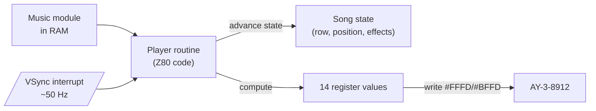
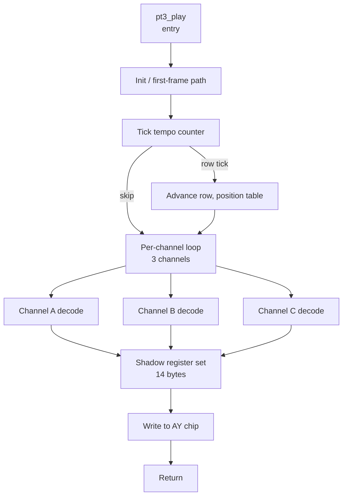

[← Home](../../README.md) · [Sound](../README.md) · [Players](README.md)

# AY Player Routines — Architecture and Timing

## Overview

A **player routine** is the small piece of Z80 code that converts a music module (`.pt3`, `.aks`, etc.) into a stream of register writes for the AY-3-8912 / YM2149 sound chip, called once per video frame. It is the runtime counterpart of the **tracker** that produced the module — the tracker is the editor, the player is the embedded code that plays the result back inside a game, demo, or intro.

The ZX Spectrum's music ecosystem is unusual in that the **player is supplied as source code** (typically SjASMPlus or z88dk assembly) and linked into the host program, rather than being a black-box library call. The composer exports a binary module from the tracker, the programmer includes the matching player routine in their project, and at runtime the player is invoked from an interrupt service routine (ISR) every 20 ms. This pattern — "tracker on the PC, player on the target" — was established by the Sound Tracker / Pro Tracker lineage in the mid-1990s and is now universal across all ZX music formats.

This article covers the architecture shared by all ZX AY players: the AY register-write idiom, ISR integration patterns (IM1 vs IM2), the per-frame work of a player, the timing budget on each Spectrum model, the structure of the canonical PT3 player and the Arkos AKG/AKM/AKY family, RAM-vs-ROM player variants, the contended-vs-uncontended memory placement question, and the integration with game/demo code. For the format-level specification of the data the players consume, see [PT3 Format](../trackers_and_formats/pt3_format.md) and [Arkos Tracker](../trackers_and_formats/arkos_tracker.md); for head-to-head benchmarks across players, see [Player Comparison](player_comparison.md).

---

## What a Player Routine Does

At its heart, every AY player does the same three things once per frame:

1. **Advance the song state** — increment the row counter, advance the position table when a pattern ends, tick the per-channel effect generators (arpeggios, portamentos, vibrato).
2. **Compute the next 14 register values** — the three channel periods (`#0`–`#5`), the noise period (`#6`), the mixer (`#7`), the three volumes (`#8`–`#10`), and the envelope (`#11`–`#13`). I/O ports `#14`/`#15` are not touched during playback.
3. **Write those values to the AY chip** — via the two-port address-latch + data-write idiom described in the next section.



The **music module** never executes — it is pure data. The player is the only active code. The same module can in principle be played by different players (e.g. PT3 modules can be played by Bulba's original player, by the z88dk-bundled PT3 player, by several ROM-game-bundled custom players); the player choice affects CPU cost, sound faithfulness, and feature coverage but not the data format itself.

---

## The AY Register-Write Idiom

The AY-3-8912 on the ZX Spectrum 128K family is wired to two Z80 I/O ports:

| Port | Direction | Function |
|------|-----------|----------|
| `#FFFD` (65533) | Write | **Address latch** — selects which of the 16 AY registers is the target of the next data read or write |
| `#FFFD` (65533) | Read | Returns the value of the currently-selected register |
| `#BFFFD` (49149) | Write | **Data write** — writes a byte to the currently-selected register |
| `#BFFFD` (49149) | Read | On the 128 / +2 grey: returns the floating-bus value. On the +2A/+3/+2B/+3B: returns the value of the currently-selected register (same as `#FFFD`). |

The full 16-bit port decode is `#xxFD` with bit 1 low (the bit pattern is `xxxx xxx0 1111 1101`), so `#FFFD` and `#BFFFD` are the conventional names — but any port with the low byte `#FD` and bit 1 = 0 will hit the AY. Real software always uses `#FFFD`/`#BFFD`.

### The 2-write pattern

To set register `N` to value `V`:

```z80
        LD   BC, #FFFD        ; address-latch port
        LD   A, N             ; register number (0-15)
        OUT  (C), A           ; select register

        LD   BC, #BFFD        ; data-write port
        LD   A, V             ; value
        OUT  (C), A           ; write the value
```

Or, equivalently and slightly faster (the `OUT (n), A` form uses the immediate port address and saves the BC setup, but only works for A):

```z80
        LD   A, N
        OUT  (#FD), A         ; selects register N via port #xxFD (here #FFFD via high byte in B)
        LD   A, V
        OUT  (#FD), A         ; writes value V via port #BFFD (high byte in B changed first)
```

The fastest idiom exploits the fact that the high byte of the port number comes from the B register, not the C register — so the player simply toggles B between `#FF` and `#BF` while keeping C at `#FD`:

```z80
        LD   C, #FD           ; low byte of port, set once
        LD   B, #FF           ; high byte for address-latch port
        LD   A, N
        OUT  (C), A           ; #FFFD - select register N
        LD   B, #BF           ; high byte for data-write port
        LD   A, V
        OUT  (C), A           ; #BFFD - write value V
```

This is **8 T-states per OUT** plus the B-toggling overhead (`LD B,n` is 7 T-states). The full 14-register write sequence — selecting and writing each register — therefore takes roughly `14 × (8 + 8 + 7) ≈ 322 T-states` minimum, in practice closer to 400–500 T-states including loop overhead and the "skip unchanged registers" optimisation most players include.

### The skip-unchanged optimisation

Most players **do not blindly write all 14 registers every frame**. They keep a shadow copy of the last-written values in RAM and only write registers whose values have changed since the previous frame. This can cut the per-frame register-write cost in half for typical music (notes change every row, but the envelope shape register changes rarely, and the noise period even less so).

The trade-off is that the shadow copy itself costs RAM (14 bytes) and CPU time (compare against shadow before each potential write). For the smallest player (Arkos AKM in a 1K intro), the skip-unchanged optimisation is sometimes omitted in favor of unconditional writes.

---

## ISR Integration

The player must be called **once per video frame**, synchronized to the Spectrum's vertical-blank interrupt. The standard 50 Hz PAL frame is:

| Model | Frame T-states | Effective rate | Notes |
|-------|----------------|----------------|-------|
| 16K / 48K | 69,888 | 50.08 Hz | `(64+192+56) × 224` — the canonical 50 Hz reference |
| 128K / +2 grey | 70,086 | 49.99 Hz | Slightly longer VBlank period |
| +2A / +3 / +2B / +3B | 70,086 | 49.99 Hz | Same as 128K |
| Pentagon | 71,680 | 48.83 Hz | Different ULA timing; **music plays ~2.5% slower** |
| Scorpion ZS-256 Turbo+ | 71,680 (Pentagon mode) or 69,888 (Sinclair mode) | varies | Selectable |

For a 3.5469 MHz CPU, 69,888 T-states is exactly 19.66 ms per frame — the "20 ms" figure quoted colloquially. The player gets a fraction of this budget; the rest is the game/demo's main loop.

### IM1 (default ROM mode)

In Interrupt Mode 1, the ROM's `#0038` ISR is invoked every VSync. The ROM ISR reads the keyboard, flashes the border, and tests the EAR input for SAVE/LOAD. A music player can be installed by:

1. **Patching the `#0038` vector** — replace the ROM ISR with a custom one that calls the player first, then either returns or chains into the ROM ISR (typically via `JP #1AD2` for the keyboard-read portion).
2. **Using the `RST #38` mechanism** — simplest but conflicts with the ROM ISR.

The IM1 approach is fine for 48K programs that do not use the ROM during gameplay (and for 128K programs that can disable the ROM ISR). Its main disadvantage is that the player competes with the ROM's keyboard/EAR code for the frame's CPU budget.

### IM2 (vectored interrupts)

The preferred approach for serious music-driven programs. In Interrupt Mode 2, the Z80 reads a 16-bit vector from `I × 256 + (byte from data bus)` and calls the address stored there. On the Spectrum, the data-bus byte during an interrupt acknowledge is `#FF` (because the ULA pulls the data bus high), so the vector table entry used is at address `I × 256 + #FF` — the programmer places a 257-byte table at `I × 256` with `#FF` in every byte, plus the ISR address (little-endian) starting at offset `#FE` so it spans offsets `#FE` and `#FF`. See [interrupt_programming.md](../../05_development/04_interrupts/interrupt_programming.md) for the full IM2 setup pattern.

A typical music ISR:

```z80
        DI
        LD   A, #FE           ; I = high byte of vector table
        LD   I, A
        IM   2
        EI

        ; --- inside the vector table ---
        ; at address #FEFE (if I=#FE):
        ;   DEFW music_isr

music_isr:
        PUSH AF
        PUSH BC
        PUSH DE
        PUSH HL
        PUSH IX
        PUSH IY
        EX   AF, AF'          ; preserve the alternate register set
        EXX
        PUSH AF
        PUSH BC
        PUSH DE
        PUSH HL

        LD   HL, module_addr
        CALL pt3_play        ; the player's per-frame entry point

        POP  HL
        POP  DE
        POP  BC
        POP  AF
        EXX
        EX   AF, AF'
        POP  IY
        POP  IX
        POP  HL
        POP  DE
        POP  BC
        POP  AF
        EI
        RETI
```

The aggressive register preservation (everything including alternates) is required because the player routines are not register-banked — they freely use AF, BC, DE, HL, IX, IY, and on some builds also the alternates. Counting the saves/restores, the IM2 ISR overhead alone is **~150 T-states** before the player runs at all.

### Re-entrancy

Music ISRs must be **non-reentrant**: they must not be interrupted by another call to themselves. On the Spectrum this is normally guaranteed by `DI` during the ISR body (the Z80 disables interrupts after an interrupt acknowledge and re-enables them with `EI; RETI` at exit). The player itself never calls `EI` mid-frame. Where a higher-priority interrupt is used (e.g. a hardware 100 Hz timer on a custom peripheral), the music ISR must be designed with mutual exclusion — most Z80 music players do **not** support this and assume they are the only ISR in the system.

---

## The Per-Frame Work of a Player

Once per frame, the player routine walks through every channel (3 channels for a single AY, 6 for TurboSound, 9 for 3×AY on the ZX Next) and updates the song state for that channel. The work per channel is roughly:

1. **Tick the row counter** — if the row tempo has elapsed (usually 3 frames per row at default tempo), advance to the next row in the current pattern. If the pattern has ended, advance to the next pattern in the position table; if the position table has ended, loop or stop.
2. **Decode the row** — for each channel, read the note (or rest, or effect-only marker), the instrument number, the volume, and any effect (arpeggio, portamento, vibrato, volume slide, etc.).
3. **Update effects** — increment the arpeggio pointer, advance the portamento target toward the current note, tick the vibrato LFO, decay the volume slide.
4. **Compute the channel period** — look up the note in the frequency table, add the arpeggio offset and the vibrato offset, apply the portamento, and produce the 12-bit AY period for this channel.
5. **Compute the channel volume** — apply the volume slide and the envelope-generator volume, clamp to 0–15, and produce the 4-bit AY volume (bit 4 set if envelope-driven).
6. **Update shared registers** — the noise period, the mixer (which channels are tone-on, noise-on), and the envelope registers (period and shape) are channel-shared; one channel "owns" them per frame, typically via convention.

### Effect support

The most complex part of a player is the effect engine. The PT3 format defines a standard effect table (`1xy` = arpeggio, `2xy` = portamento up, `3xy` = portamento down, `4xy` = vibrato, etc.) and every PT3-compatible player implements this set. Arkos uses a different effect set, with more options for sample/digidrum playback (AKY) and more aggressive size optimisation (AKM).

The effect engine is where most of the per-frame CPU cost is spent. For a typical PT3 song with three active channels playing notes with arpeggios and portamentos, the effect decoding consumes 2,000–3,000 T-states per frame, dwarfing the 400–500 T-states spent on the register writes themselves.

---

## Timing Budget

The frame's CPU budget — and how much of it the player consumes — varies dramatically by Spectrum model. The headline numbers:

| Model | Frame T-states | Player budget (typical) | Notes |
|-------|----------------|-------------------------|-------|
| 48K | 69,888 | ~3,000–4,000 (PT3), ~1,500–2,500 (AKG), ~800–1,500 (AKM), ~600–1,200 (AKY) | Player is ~5% of the frame on a 48K with PT3 |
| 128K / +2 / +2A / +3 | 70,086 | same as 48K | Marginally more headroom |
| Pentagon | 71,680 | same | Player runs ~2.5% slower because the ISR fires at 48.83 Hz instead of 50.08 Hz |

These numbers are **player-only**. They do not include:
- The ISR register preservation (~150 T-states)
- The vector-table lookup (~30 T-states in IM2)
- Any application code (game loop, demo effect)

A typical game running on a 48K Spectrum with a PT3 player might see:
- 69,888 total T-states per frame
- −3,500 T-states for the PT3 player (5%)
- −1,000 T-states for the ISR setup/teardown
- −20,000 T-states for the game logic and rendering (29%)
- leaving ~45,000 T-states (64%) of slack — usually eaten by `HALT`-wait and border-effect timing

A demo that does raster effects or 50-Hz multicolour will be tighter: 30,000–40,000 T-states of slack is normal, and a heavily-loaded demo with 4 multicolour bands and a PT3 player can leave only 10,000–15,000 T-states for the main loop. This is why demo coders often prefer AKY (smallest, fastest) over PT3 (largest, slowest).

### Contention interaction

The player's CPU budget is not spent uniformly across the frame. The ULA's memory contention — see [contention_model.md](../../05_development/03_memory_and_io/contention_model.md) — adds **extra T-states** to every memory access during the active display portion of the frame (lines 64–255 of the 48K's frame). Memory reads and writes that would normally take 3 T-states instead take 4, 5, or 6 T-states, depending on the contention pattern.

If the player runs as an ISR that fires at VSync (start of line 256), the first ~14,000 T-states of player execution happen during VBlank (no contention). Beyond that, contention kicks in. A 3,500-T-state PT3 player that fires at VSync on a 48K therefore sees:

- First 14,000 T-states: no contention, full speed
- Last ~3,500 T-states (if any): contention adds ~10–20% to memory access cost

The practical rule: **keep the player's code in uncontended RAM** (the 16K of uncontended memory on the 128K/+2/+2A/+3, bank 0 — banks 1–7 are contended). The music module data can live in contended memory with a smaller penalty, but the player code itself should be in uncontended memory if at all possible. See the "Memory Placement" section below.

---

## PT3 Player Structure

Bulba's canonical PT3 player (the reference implementation hosted at [bulba.untergrund.net](https://bulba.untergrund.net/)) is the standard against which all other PT3 players are measured. Its overall layout:



The PT3 player source is roughly 400–600 bytes of Z80 code (depending on which optional features are included). The standard modules are:

| Module | Function | Approximate size |
|--------|----------|------------------|
| **Init** | Set up pointers to module blocks; reset row/position counters; initialise shadow AY registers to silence | ~30 bytes |
| **Tempo tick** | Decrement the tempo counter; if non-zero, skip the row advance | ~20 bytes |
| **Row advance** | Read next row from current pattern; decode note + instrument + volume + effect; advance position table if pattern ended | ~150 bytes |
| **Per-channel decode** | Look up note in frequency table; apply arpeggio, vibrato, portamento; produce 12-bit period and 4-bit volume | ~200 bytes |
| **AY register write** | Compare computed values to shadow; write changed registers via the 2-port idiom | ~100 bytes |
| **Effect handlers** | Arpeggio, portamento, vibrato, volume slide, etc. | ~100 bytes |

The PT3 player is **unbanked** — it expects the entire module to be visible in a single 16K bank. For 48K programs this is automatic. For 128K programs, the convention is to keep the player and module in the uncontended bank 0 (or in bank-switched memory accessed via the paging register at `#7FFD`).

### PT3 sub-version quirks

The PT3 format evolved through versions 3.0–3.7, with minor changes to the header layout, the frequency table format, and the effect encoding. Bulba's reference player supports all sub-versions, but **community-written players often only support 3.51+** (the canonical VTII output format). A 3.4 or 3.6 module may play incorrectly on a stripped-down player. If you encounter an old module that "sounds wrong", check the version byte at offset 4 of the module against the player's supported range.

---

## Arkos AKG / AKM / AKY Player Structure

The Arkos Tracker family provides three distinct players, each optimized for a different use case. All three share a common module format (the `.aks` source compiled to a binary song blob) but differ in code size, CPU cost, and feature set.

### AKG — "Arkos Tracker Game" (general purpose)

The balanced player, recommended for most game soundtracks. AKG supports the full Arkos effect set, including pitch bends, arpeggios, noise, and basic envelope control. It does **not** support digidrums or SID-style pitched samples — for those, use AKY.

| Property | Typical value |
|----------|---------------|
| Code size | ~1.0–1.5 KB |
| CPU per frame (1 PSG) | ~1,500–2,500 T-states |
| RAM usage | ~50–100 bytes (state + shadow registers) |
| Digidrum support | No |
| Multi-PSG support | Yes (2 or 3 PSGs, scales linearly) |
| RAM vs ROM | Both variants provided (RAM uses self-modifying code, slightly faster) |

### AKM — "Arkos Tracker Minimal" (size-optimized)

The memory-optimized player, intended for size-limited productions (1K, 4K, 8K intros). AKM sacrifices some effect coverage and uses aggressive code reuse to achieve a much smaller footprint.

| Property | Typical value |
|----------|---------------|
| Code size | ~400–600 bytes |
| CPU per frame (1 PSG) | ~800–1,500 T-states |
| RAM usage | ~30–50 bytes |
| Digidrum support | No |
| Multi-PSG support | No (single PSG only) |
| RAM vs ROM | ROM-only (no self-modifying code) |

### AKY — "Arkos Tracker Y" (fast, demo-oriented)

The fast player, designed for demos where CPU budget is critical. AKY uses a **pre-encoded format** in which the tracker exports note periods directly (rather than notes + frequency-table lookup at runtime), trading larger module files for faster playback.

| Property | Typical value |
|----------|---------------|
| Code size | ~600–900 bytes |
| CPU per frame (1 PSG) | ~600–1,200 T-states (the fastest of the three) |
| RAM usage | ~30–60 bytes |
| Digidrum support | **Yes** (the main reason to choose AKY) |
| Multi-PSG support | Yes |
| RAM vs ROM | Both variants provided |

The "12 scanlines on CPC" benchmark quoted by Targhan (the Arkos author) corresponds to roughly **768 CPC T-states** per PSG per frame — a small fraction of the Spectrum's 69,888 T-state budget. AKY on the ZX Spectrum typically delivers 600–800 T-states per PSG, leaving the rest of the frame for demo effects.

### RAM players vs ROM players

The Arkos players come in two variants:

- **RAM players** — use self-modifying code as an optimisation (e.g. storing computed addresses directly in the instruction stream rather than in indirect registers). Faster but cannot run from ROM, because ROM is not writable.
- **ROM players** — use a small writable buffer instead of self-modifying code. Slightly slower (the buffer access adds a few T-states per operation) but works from ROM.

For cartridge-based or shadow-ROM productions, use the ROM player. For everything else (the vast majority of Spectrum software), the RAM player is preferred. The CPU difference is typically 5–10%.

---

## Contended vs Uncontended Memory Placement

On the 128K Spectrum family (128K / +2 / +2A / +3), memory is divided into 8 banks of 16K:

| Bank | Address range | Contended? | Notes |
|------|---------------|------------|-------|
| 0 | `#0000`–`#3FFF` (when paged in via `#7FFD`) | No | Uncontended — preferred for player code |
| 1 | `#4000`–`#7FFF` (default at `#7FFD=0`) | Yes | Contended — same as the 48K's screen RAM |
| 2 | `#8000`–`#BFFF` (default) | Yes | Contended |
| 3 | `#C000`–`#FFFF` (default) | Yes | Contended |
| 4–7 | Switchable via `#7FFD` | Varies | Banks 4, 5, 6 are uncontended; bank 7 is contended (on the 128K/+2; on the +2A/+3 the layout is different) |

The rule for music players:

- **Player code** → bank 0 (or 4, 5, 6), uncontended. The contention penalty is roughly 10–20% of the player's CPU cost — significant for tight demos.
- **Music module data** → also preferably uncontended, but contended placement is acceptable if the alternative is bank-switching (bank-switching mid-ISR is much worse than a small contention penalty).
- **Shadow registers and player state** → uncontended, ideally in the same bank as the player code (faster access).

For 48K programs there is no choice — all RAM is contended (because the screen RAM sits in the middle of it), and the player simply has to live with the contention penalty. This is one reason why 128K music sounds slightly "cleaner" than 48K music on the same hardware: the player runs without contention-induced timing jitter.

See [contention_model.md](../../05_development/03_memory_and_io/contention_model.md) for the per-model contention patterns and [bank_switching_patterns.md](../../05_development/03_memory_and_io/bank_switching_patterns.md) for practical bank-switching idioms.

---

## Combining Music with Game / Demo Code

The music player is one of several consumers of the frame's CPU budget. Integrating it cleanly requires attention to a few common patterns.

### The "music during game" pattern

For a game that runs at 50 Hz (one frame per VSync):

```z80
main_loop:
        HALT                    ; wait for VSync / ISR
        ; (ISR fires here, music player updates AY registers)
        CALL read_keyboard
        CALL update_game_state
        CALL render_sprites
        CALL render_attributes
        JR   main_loop
```

The `HALT` synchronizes the main loop to VSync. The ISR fires during the `HALT` (specifically, the Z80 wakes up from `HALT` in response to the interrupt), so the music player runs first, then the game logic. This is the standard pattern for games with music.

### The "music during demo" pattern

For a demo with raster effects or multicolour, the integration is trickier because the demo effect itself needs to run in lockstep with the raster beam:

```z80
main_loop:
        EI
        HALT                    ; wait for VSync
        ; (music ISR fires here)
        DI                      ; critical timing section
        CALL raster_effect      ; must complete before next scanline
        EI
        JR   main_loop
```

Here the music ISR runs **before** the demo's critical section, so it consumes part of the VBlank period. Demo coders often tune the music player's CPU cost to leave enough VBlank time for the effect setup — which is why demo music often uses AKY rather than PT3.

### The "music only" pattern (a music-collection program)

For a program whose sole purpose is to play music (the modern equivalent of a music disk), the player is essentially the whole program:

```z80
main_loop:
        HALT                    ; music ISR fires here
        CALL update_visualiser  ; optional oscilloscope / pattern display
        CALL check_input        ; next song, pause, etc.
        JR   main_loop
```

Here the player's CPU cost is largely irrelevant — even the largest PT3 player consumes <10% of the frame. Music-collection programs often use PT3 for maximum format compatibility and feature richness, since there is no game/demo to compete with.

### Stopping and starting

Most players provide three entry points:

- **Init** (`pt3_init`) — call once with HL = module address; resets the song to row 0, pattern 0
- **Play** (`pt3_play` or `pt3_tick`) — call once per frame from the ISR
- **Mute** (`pt3_mute`) — call to silence the AY (typically writes 0 to the three volume registers)

The mute call is essential for handling pause, level transitions, and game-over states. It should not just stop calling the player — the player's shadow registers must be cleared, or the next play call will produce a glitch as it tries to update from a stale state. The canonical pattern is:

```z80
pause_music:
        DI
        CALL pt3_mute           ; silence AY + clear shadow registers
        EI
        RET

resume_music:
        DI
        CALL pt3_init           ; re-init from the beginning of the current song
        EI
        RET
```

(Resume typically re-initialises from the song start. More sophisticated players support "freeze" and "thaw" that preserve the exact song position, but this is not standard.)

---

## Common Pitfalls

| # | Pitfall | Consequence | Fix |
|---|---------|-------------|-----|
| 1 | **Forgetting to preserve all registers in the ISR** | The player clobbers registers the main loop was using; random crashes and glitches | Preserve AF, BC, DE, HL, IX, IY (and on some players, the alternates too). The aggressive 22-instruction preserve sequence shown in the ISR example above is the safe default. |
| 2 | **Using IM2 without a 257-byte vector table** | Spurious crashes when the data-bus byte during interrupt acknowledge is not `#FF` (it usually is on the Spectrum, but not always — and never on some clones) | Allocate 257 bytes (not 256) and fill all of them with the same high byte. Place the ISR address little-endian so it spans the last two entries. See [interrupt_programming.md](../../05_development/04_interrupts/interrupt_programming.md). |
| 3 | **Putting the player code in contended RAM (banks 1, 2, 3, or 7)** | 10–20% extra CPU cost due to ULA contention | Place the player in uncontended RAM (bank 0 on the 128K/+2/+2A/+3, banks 4–6 on the 128K/+2 grey). |
| 4 | **Forgetting that the Pentagon fires the ISR at 48.83 Hz, not 50.08 Hz** | Music plays ~2.5% slower and ~2.5% lower in pitch than on a real Sinclair Spectrum | Compose at the target machine's frame rate, or accept the difference. Most Pentagon-targeted music is composed at the Pentagon rate. |
| 5 | **Calling `pt3_init` mid-song** | The song restarts from row 0 of pattern 0 — usually not what was intended | Use a "freeze" mechanism (save the song state) or simply call `pt3_mute` for a pause. |
| 6 | **Leaving interrupts disabled during the main loop** | Music stops after the first frame because the ISR never fires again | Ensure the main loop calls `EI` after any `DI` section, or use `HALT` (which atomically waits and re-enables). |
| 7 | **Re-enabling interrupts inside the ISR (`EI` before `RETI`)** | The ISR can be re-entered before it finishes, corrupting the player's state | Use `RETI` (which atomically returns and enables interrupts). The `EI; RETI` sequence is a 2-instruction substitute that is also safe. |
| 8 | **Mixing players from different tracker families** | A PT3 player will not play an Arkos `.aks` module and vice versa | Match the player to the module's source tracker. See [player_comparison.md](player_comparison.md) for the family tree. |
| 9 | **Bank-switching mid-ISR** | The player suddenly finds its module data gone (or its own code gone) | Either keep everything in one bank, or save/restore the paging register (`#7FFD`) at ISR entry/exit. The latter is risky on the +2A/+3 where `#7FFD` interacts with `#1FFD`. |
| 10 | **Using a player that doesn't support the module's sub-version** | A 3.4 PT3 module on a 3.51+-only player plays with wrong notes/effects | Use Bulba's reference player (supports all PT3 sub-versions), or convert the module to the player's supported version via VTII. |
| 11 | **Forgetting the `EXX` / `EX AF, AF'` pair around the player call** | The alternate register set is corrupted and the main loop's use of it produces wrong values | The preserve sequence must save AF/BC/DE/HL of **both** register sets (regular and alternate) if the player uses both. PT3 and Arkos players do use both. |
| 12 | **Calling the player more than once per frame** | Music plays at 2× tempo (or worse), notes are skipped, and the AY registers are written twice as often as needed | Call the player exactly once per VSync. If you need sub-frame timing (rare), use a frame-counter or subdivide within the player. |
| 13 | **Assuming the AY clock is the same on all Spectrums** | Music written for the 128K (1.7734 MHz AY) plays at the wrong pitch on the Pentagon (1.75 MHz AY, ~1.3% lower) and on the Fuller Box (1.63819 MHz, ~7.6% lower) | Compose at the target machine's AY clock, or use a player that supports runtime frequency-table selection. |
| 14 | **Putting the music module in paged RAM that gets banked out by the main loop** | The player's reads from the module return garbage when the wrong bank is paged in | Either (a) keep the module in the same bank as the player, (b) page the correct bank in at ISR entry, or (c) keep the module in uncontended bank 0. |

---

## When to Use What

| Use case | Recommended player | Notes |
|----------|--------------------|-------|
| **Game soundtrack, 128K Spectrum** | **Arkos AKG** | Best balance of size, speed, and feature coverage. RAM player variant. |
| **Game soundtrack, 48K Spectrum** | **PT3** (if composer uses VTII) or **AKG** (if composer uses Arkos) | 48K has tighter RAM; consider the player's code size carefully. PT3's larger code is often fine on a 48K because the game doesn't compete for the same memory. |
| **Demo with raster effects / multicolour** | **Arkos AKY** | Smallest CPU cost, leaves the most headroom for effects. Pre-encoded format. |
| **1K or 4K intro** | **Arkos AKM** | Smallest code size (~400–600 bytes); supports single-PSG only. |
| **Music-collection program (music disk)** | **PT3** | Maximum format compatibility; the de facto interchange format. CPU cost irrelevant. |
| **Demo with digidrums / pitched samples** | **Arkos AKY** | The only Arkos player with digidrum support. (For PT3, digidrums require a custom player extension.) |
| **Multi-PSG music (TurboSound, 3×AY on Next)** | **Arkos AKG or AKY** | Both support multi-PSG; AKG for games, AKY for demos. PT3 has TurboSound-extended variants but they are rare. |
| **ROM-based production (cartridge, shadow ROM)** | **Arkos ROM player variant** | The RAM player variants use self-modifying code; the ROM variant uses a buffer. |
| **Maximising compatibility with the existing PT3 archive (thousands of modules)** | **PT3 player (Bulba reference)** | The world's largest archive of ZX music is in PT3 format; using PT3 means any archive module works without conversion. |

---

## Modern Analogies

- **The "tracker on the PC, player on the target" pattern** is exactly how modern game audio middleware (Wwise, FMOD) works: composers author in a desktop tool, the engine integrates a small runtime that reads the authored data. The ZX Spectrum was doing this in 1995 with Scream Tracker / Pro Tracker, 10 years before FMOD existed.
- **The skip-unchanged optimisation** in AY players is the same idea as dirty-rectangle rendering in 2D graphics: only the things that changed since last frame are touched. Modern GPUs still do this for shader uniforms.
- **The split between RAM players (self-modifying code) and ROM players (buffer-based)** is the same trade-off as modern JIT-compiled vs interpreted code: self-modification is faster but requires writable memory, interpretation is portable but slower.
- **The 14-register write sequence** is conceptually identical to a modern GPU's "draw call": a small batch of state changes followed by a "go" signal. The AY has no "go" signal (each register write takes effect immediately), but the pattern of "set state, then render" is the same.
- **The Pentagon's 48.83 Hz frame rate** vs the Sinclair 50.08 Hz is the same kind of platform-timing difference that modern game developers handle with `dt` (delta time) in their game loops. ZX developers typically hard-coded the tempo for one platform.

---

## Cross-References

- [PT3 Format](../trackers_and_formats/pt3_format.md) — the binary specification of the modules that PT3 players consume
- [Arkos Tracker](../trackers_and_formats/arkos_tracker.md) — the editor that produces AKG/AKM/AKY modules
- [Vortex Tracker II](../trackers_and_formats/vortex_tracker.md) — the editor that produces PT3 modules (the modern continuation of Pro Tracker 3)
- [Player Comparison](player_comparison.md) — head-to-head benchmarks of PT3 vs AKG/AKM/AKY; includes Targhan's decision table for which player to use
- [Interrupt Programming](../../05_development/04_interrupts/interrupt_programming.md) — IM1 and IM2 setup; ISR design patterns; timing
- [Contention Model](../../05_development/03_memory_and_io/contention_model.md) — per-model memory contention patterns; why player code should live in uncontended RAM
- [Bank Switching Patterns](../../05_development/03_memory_and_io/bank_switching_patterns.md) — `#7FFD` paging; cross-bank access; double buffering
- [AY/YM Synthesis](../synthesis/ay_ym_synthesis.md) — how the AY chip turns register values into sound waves
- [AY-3-8912 Hardware](../hardware/ay_3_8912.md) — the chip itself; register map; clock frequencies on different Spectrum models
- [TurboSound](../hardware/turbosound.md) — the dual-AY extension; considerations for multi-PSG players
- [Sound Hardware Overview](../hardware/sound_overview.md) — the broader sound hardware ecosystem

---

## Primary Sources

- **Bulba's AY-3-8910/8912 Homepage** — [bulba.untergrund.net](https://bulba.untergrund.net/). The canonical source for the PT3 player routine (source and binary), the VTII tracker, and the PT3 format documentation. The "Programmer" section hosts the reference PT3 player in SjASMPlus source form.
- **Arkos Tracker 3 documentation** — [julien-nevo.com/arkostracker](https://www.julien-nevo.com/arkostracker/index.php/players-overview/). Targhan's official documentation of the AKG/AKM/AKY/MOD/SE player family, including the "Which player to use?" decision table that the [player_comparison.md](player_comparison.md) article benchmarks.
- **Arkos Tracker 3 GitHub repository** — [github.com/ArkosTracker/arkestracker](https://github.com/ArkosTracker/arkestracker). Source for the player routines; the `player/` directory contains the AKG, AKM, AKY sources and a `tester/` folder with per-platform buildable examples.
- **ZX Spectrum 48K Technical Reference** — [worldofspectrum.org/faq/reference/48kreference.htm](https://worldofspectrum.org/faq/reference/48kreference.htm). The frame T-state count (69,888), contention timing, and the `OUT (C), reg` instruction timing.
- **Sinclair Wiki: AY-3-8912** — [sinclair.wiki.zxnet.co.uk/wiki/AY-3-8912](https://sinclair.wiki.zxnet.co.uk/wiki/AY-3-8912). The two-port register-access idiom (`#FFFD` address latch, `#BFFD` data write); per-model AY clock frequencies; the +2A/+3 read-port quirk.
- [z88dk forum threads on AY music integration](https://github.com/z88dk/z88dk) — community discussion of IM2 setup, register preservation, and the practicalities of running PT3 and Arkos players in real games. Several working code examples are linked from the forum FAQ.
- **Shiru's AY music tutorials** — [shiru.untergrund.net](http://shiru.untergrund.net/). Shiru's write-ups on AY player architecture and the practical timing budget for NES-style games on the Spectrum.
- **sizecoding.org: ZX Spectrum** — [sizecoding.org/wiki/ZX_Spectrum](http://sizecoding.org/wiki/ZX_Spectrum). Notes on minimal player routines for 1K/4K intros, including the AKM-vs-handcrafted trade-off.

---

*Article 1 of 2 in the [Player Routines](README.md) sub-section. Companion article: [Player Comparison](player_comparison.md) (head-to-head benchmarks of PT3 vs AKG/AKM/AKY, plus Targhan's decision table).*
