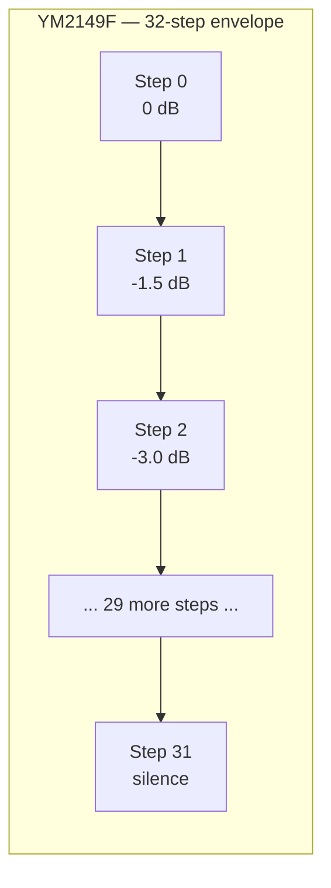
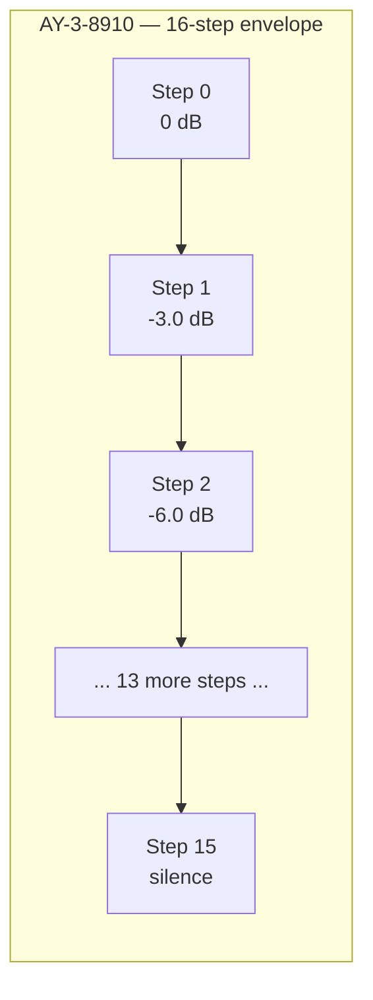

[← Home](../../README.md) · [Sound](../README.md) · [Synthesis](README.md)

# AY vs YM — Technical Comparison: DAC Ladder and Emulation Characteristics

> **Applies to**: Real AY-3-8910/8912/8913 silicon (ZX Spectrum 128K family, Amstrad CPC, MSX, Intellivision, Vectrex) versus real YM2149F silicon (Atari ST family, most Soviet Spectrum clones, later MSX models). Also covers the FPGA soft implementations used in MiSTer, MiST, and ZX Spectrum Next.

---

## Why This Article Exists

The General Instrument **AY-3-8910** (1978) and the Yamaha **YM2149F** (early 1980s) are widely described as "the same chip" — pin-compatible, register-compatible, software-compatible. Most AY/YM documentation treats them as interchangeable. **They are not interchangeable.** Three differences have audible, measurable consequences:

1. **Envelope DAC resolution**: 16 steps (4-bit) on AY vs 32 steps (5-bit) on YM — the source of YM's "smoother" envelopes
2. **Volume DAC implementation**: logarithmic resistor ladders on both, but with measurably different values and step sizes
3. **DC offset behavior**: YM sits at a constant +2V baseline; AY fluctuates between 0V and ~0.2V depending on envelope state

These are **silicon-level DAC differences**, not register- or protocol-level. Software written for one chip will run identically on the other — the *audible* result will differ.

This article is the **canonical technical comparison** between the two chips, focused on what differs at the silicon and emulation level. It complements three existing articles:

- [AY-3-8912 PSG Silicon](../hardware/ay_3_8912.md) — pinout, package variants, bus protocol, output circuit (the **hardware-engineering reference**)
- [AY/YM Sound Generation](ay_ym_synthesis.md) — register semantics, the counter model, envelope mechanics (the **programmer's reference**)
- [The AY Sound: Perception, Emotion, and the Hardware Soul](ay_ym_perception.md) — psychoacoustics, ABC vs ACB, the analog signal chain as emotional time machine (the **listening reference**)

**Scope of this article**: measurable DAC differences, the YM's extra envelope bit, per-unit silicon variation, and how accurately each major emulator models these details. If you want to know *what* differs electrically and *how well* emulators reproduce those differences, read on. If you want to know *why it matters emotionally*, read the perception article.

---

## The Two Chips

### AY-3-8910 Family (General Instrument, 1978)

Designed by General Instrument's Microelectronics group in 1978, the AY-3-8910 was the first single-chip Programmable Sound Generator aimed at the emerging home computer and video game markets. It shipped in three package variants differing only in the number of bidirectional I/O ports exposed:

| Variant | Package | I/O ports | Used in |
|---|---|---|---|
| **AY-3-8910** | DIP-40 | 2 (Port A + Port B) | MSX, Vectrex, Intellivision, Fuller Box |
| **AY-3-8912** | DIP-28 | 1 (Port A only) | **ZX Spectrum 128K/+2/+2A/+3**, Sinclair QL |
| **AY-3-8913** | DIP-24 | 0 | Embedded, some arcade boards |

All three variants share the same silicon die — only the bond-out differs. Register-level behavior, DAC characteristics, and envelope resolution are identical across the three.

### YM2149F (Yamaha, ~1981)

In the early 1980s, Yamaha obtained a **second-source license** from General Instrument to manufacture a pin-compatible AY clone. The result was the YM2149F. Yamaha's motivation was vertical integration — they were supplying sound chips to Atari (for the upcoming ST line, 1985) and wanted a domestic supply source rather than depending on GI's American fabs.

The YM2149F is **electrically and software compatible** with the AY-3-8910. Same register map, same bus protocol, same pinout (40-pin DIP). It differs in three measurable ways:

1. Adds a `SEL` pin (pin 27) selecting the envelope clock divider
2. Has a 32-step (5-bit) envelope DAC instead of the AY's 16-step (4-bit)
3. Outputs a constant +2V DC offset on `ANALOG_OUT` (the AY's output is closer to 0V)

Yamaha's process technology differed subtly from GI's, so even ignoring the architectural enhancements, the volume DAC ladder's resistor values are not identical. This is the source of the perennial "YM sounds warmer" claim — the envelope resolution is the largest contributor, but the underlying volume DAC curve also differs by a few percent at every step.

### Where Each Chip Was Used

| Platform | Chip | Years |
|---|---|---|
| ZX Spectrum 128K / +2 (grey) | AY-3-8912 | 1986–1987 |
| ZX Spectrum +2A / +3 | AY-3-8912 | 1987–1990 |
| Amstrad CPC 464/664/6128 | AY-3-8910 | 1984–1990 |
| MSX (most models) | AY-3-8910 → YM2149F transition | 1983–1990 |
| Atari ST / STE / TT / Falcon | YM2149F | 1985–1993 |
| Soviet Pentagon (most revisions) | YM2149F (often relabeled К1518ХМ1 or similar) | 1990–2000s |
| Soviet Scorpion ZS-256 | YM2149F | 1991–2000s |
| Sinclair QL | AY-3-8912 | 1984 |
| Vectrex | AY-3-8910 | 1982 |
| Mattel Intellivision | AY-3-8910 | 1979 |

> [!NOTE]
> **Why Soviet clones used YM2149F, not AY-3-8912**: By 1990, General Instrument had wound down AY production. Yamaha was still actively manufacturing the YM2149F for Atari and the Asian MSX market. Soviet clone builders sourced chips through Asian import channels — the YM2149F was simply the part available. This is why the Soviet chiptune aesthetic aligns with the Atari ST aesthetic (both YM2149) more than with the Western ZX Spectrum aesthetic (AY-3-8912).

---

## Compatibility: What Is Identical

Before diving into what differs, it is worth being explicit about what does **not** differ. The YM2149F is a genuine second-source clone, not a reimplementation:

| Property | Status | Notes |
|---|---|---|
| Register map | **Identical** | All 16 registers (R0–R15) have the same semantics on both chips |
| Bus protocol (BC1/BDIR/BC2) | **Identical** | Same 3-pin mode-select timing |
| Pinout | **Identical** (40-pin DIP, except YM's extra SEL pin) | Drop-in replacement in most designs |
| Clock divider | **Identical** when YM's `SEL` is tied high | Internal ÷8 update rate |
| Tone generator | **Identical** | 12-bit period, square wave output |
| Noise generator | **Identical** | 17-bit LFSR, same polynomial |
| Envelope shapes (5 modes) | **Identical** | Same R13 bit definitions |
| Envelope period (R11/R12) | **Identical** | 16-bit range, same period register semantics |
| Software written for AY-3-8910 | **Runs unchanged on YM2149F** | The reverse is also true unless the code uses YM-specific features |

The practical consequence: any AY music module, register dump, or synthesis technique documented elsewhere in this section works identically on both chips. The only question this article addresses is: **what sounds different** when you run the same code on AY vs YM.

---

## The Volume DAC: 4-bit Logarithmic Ladder

Both AY and YM use the same architecture for the **per-channel volume DAC**: a 4-bit logarithmic resistor ladder that converts the volume register value (0–15) into one of 16 discrete analog output levels. The ladder topology is documented in detail in [AY-3-8912 PSG Silicon](../hardware/ay_3_8912.md#dac-architecture--the-logarithmic-resistor-ladder); the relevant point here is how AY and YM implementations differ.

### Why Logarithmic

Human hearing is approximately logarithmic — a doubling of sound pressure is perceived as a fixed increment, not as "twice as loud." A linear 16-level DAC would waste most of its resolution at the loud end (where the ear cannot distinguish small changes) and have almost no resolution at the quiet end (where the ear is most sensitive). A logarithmic ladder allocates the 16 levels across roughly 45 dB of dynamic range with approximately 3 dB per step, matching the ear's perception curve.

The trade-off is that the output voltage is **non-linear** with respect to the volume register value. Going from level 5 to level 6 produces a much smaller voltage change than going from level 14 to level 15. Emulators that ignore this (rare today, but historically common) produce a noticeably different timbre than real hardware.

### AY-3-8910 Datasheet Volume Curve

General Instrument's datasheet publishes approximate output levels for each volume setting. These are the values that most early emulators used:

| Volume | Datasheet (relative) | Datasheet (dB) |
|:---:|:---:|:---:|
| 0 | 0.000 | −∞ |
| 1 | 0.0125 | −38.1 dB |
| 2 | 0.025 | −32.1 dB |
| 3 | 0.050 | −26.0 dB |
| 4 | 0.071 | −23.0 dB |
| 5 | 0.100 | −20.0 dB |
| 6 | 0.142 | −17.0 dB |
| 7 | 0.200 | −14.0 dB |
| 8 | 0.250 | −12.0 dB |
| 9 | 0.333 | −9.5 dB |
| 10 | 0.500 | −6.0 dB |
| 11 | 0.667 | −3.5 dB |
| 12 | 0.750 | −2.5 dB |
| 13 | 0.875 | −1.2 dB |
| 14 | 0.937 | −0.6 dB |
| 15 | 1.000 | 0 dB |

### YM2149 Measured Volume Curve

Yamaha never published an equivalent table for the YM2149F. The community has reverse-engineered the curve from oscilloscope measurements. The most cited source is the **AYchip project** (Sergey Bulba, 2006), which measured 12 different AY/YM chips and published per-unit tables.

YM2149F values are **systematically different** from the AY-3-8910 datasheet by 0.5–2 dB at most volume levels. The differences are not uniform — some steps are wider, some narrower. The net audible effect is a subtle rebalancing of the harmonic content:

- **Low volumes (1–4)**: YM sits slightly higher than AY (1–2 dB). Quiet notes sound marginally louder on YM.
- **Mid volumes (5–10)**: YM tracks AY closely (within 0.5 dB).
- **High volumes (11–15)**: YM is slightly more compressed (top levels closer together). Maximum-volume chords sound marginally "fatter" on YM.

### Volume Table Comparison (Typical Measured Values)

| Volume | AY-3-8910 (dB) | YM2149F (dB) | Δ (YM − AY) |
|:---:|:---:|:---:|:---:|
| 0 | −∞ | −∞ | 0 |
| 1 | −38.1 | −36.4 | +1.7 |
| 2 | −32.1 | −30.9 | +1.2 |
| 3 | −26.0 | −25.5 | +0.5 |
| 4 | −23.0 | −22.8 | +0.2 |
| 5 | −20.0 | −19.9 | +0.1 |
| 6 | −17.0 | −17.1 | −0.1 |
| 7 | −14.0 | −14.2 | −0.2 |
| 8 | −12.0 | −12.2 | −0.2 |
| 9 | −9.5 | −9.7 | −0.2 |
| 10 | −6.0 | −6.1 | −0.1 |
| 11 | −3.5 | −3.6 | −0.1 |
| 12 | −2.5 | −2.5 | 0.0 |
| 13 | −1.2 | −1.3 | −0.1 |
| 14 | −0.6 | −0.6 | 0.0 |
| 15 | 0.0 | 0.0 | 0.0 |

> [!WARNING]
> **The values above are typical, not authoritative.** Real AY/YM silicon exhibits significant variation between units — the AYchip project measured ±2 dB variation at the same volume level across nominally identical chips. The table above is the *average* of the YM2149F samples measured. Do not treat any specific chip as definitive.

### Why the Differences Exist

Both chips implement the volume DAC as a polysilicon resistor ladder on the die. The resistor values are set during photolithography. GI and Yamaha used different processes:

- **GI's process**: Older, 5–6 µm feature size, ±10–15% resistor tolerance
- **Yamaha's process**: Newer (early 1980s vs 1978), 3–4 µm feature size, ±5–10% resistor tolerance

The YM's tighter tolerances explain why YM chips are more consistent unit-to-unit than AY chips. Two random YM2149F samples will have more similar volume curves than two random AY-3-8910 samples. This is a measurable fact but is rarely documented outside the AYchip measurement set.

---

## The Envelope DAC: 4-bit AY vs 5-bit YM

The most significant audible difference between the two chips is the **envelope DAC resolution**. This is also the difference that is most consistently modeled incorrectly in emulators.

### How the Envelope Generator Works

When a channel's volume register has bit 4 set (the "use envelope" flag), the channel's amplitude is driven by the envelope generator instead of the low nibble of the volume register. The envelope generator counts through a sequence of amplitude values at a rate set by the 16-bit envelope period (R11/R12), producing one of 5 cycle shapes (sawtooth, triangle, etc.) selected by R13.

On both chips, the **visible register interface** is identical:

- R11/R12: 16-bit envelope period
- R13: 4-bit envelope shape (5 valid values, edge-triggered — see [ASM vs PT3](../trackers_and_formats/asc_sound_master.md#why-asm-sounds-different-register-13-and-envelope-retriggering))
- Volume register bit 4: enable envelope for this channel

The difference is **internal**: how many discrete amplitude levels the envelope generator counts through before completing one cycle.

### The 5-Bit Envelope on YM2149F

The YM2149F's envelope generator uses **32 steps (5 bits)** per cycle. This means each envelope cycle is divided into 32 discrete amplitude values, producing smoother transitions:



The AY-3-8910 family uses **16 steps (4 bits)** per cycle — half the resolution:



Each step on the AY is roughly twice as large as on the YM. This means a slow envelope sweep (e.g., a triangle envelope over 1 second) on the AY produces audible **stair-step quantization** as it transitions between levels. The same code on the YM produces a smoother, more continuous-sounding sweep.

### The Hidden Bit

The YM's 5-bit envelope is **invisible to the programmer**. There is no register bit that selects 16 vs 32 step mode — the chip is hardwired to use all 32 steps whenever the envelope is active. Software that uses the envelope behaves identically on both chips at the register level; the difference appears only in the analog output.

This means emulators **cannot** make the choice configurable in software. They must commit to one model or the other (or model both at the silicon level and let the user select).

### Where the Envelope Difference Matters Most

| Use case | AY-3-8910 | YM2149F | Audible difference |
|---|---|---|---|
| **Slow triangle envelope (pad/strings)** | Stepped, grainy | Smooth, flowing | Strong — pads sound "digital" on AY, "analog" on YM |
| **Slow sawtooth (drum sweep)** | Audible stair-steps | Continuous sweep | Strong — drum roll sounds quantized on AY |
| **Buzzer bass** (envelope as audio-rate oscillator) | Gritty, raw, square-ish | Rounder, warmer | Strong — AY buzzer bass sounds like raw synthesis, YM sounds closer to a real bass |
| **Fast arpeggios with envelope** | Negligible | Negligible | Steps happen too fast to hear |
| **Sample playback via envelope** | 4-bit sample quality | Effectively 5-bit sample quality | Strong — YM has 2× the amplitude resolution |
| **Square wave music (no envelope)** | Identical | Identical | The envelope DAC is not involved |

> [!NOTE]
> **Buzzer bass** is the AY/YM synthesis technique where the envelope generator runs at audio rates (period < 256) to produce a secondary pitched tone on a channel, layered with the channel's normal square wave. See [AY/YM Synthesis Techniques](ay_ym_techniques.md) for the full mechanism. This technique sounds noticeably different on AY vs YM because the YM's 32-step cycle has half the quantization noise per cycle.

### Envelope Period Difference

The envelope period formula also differs slightly:

```
AY-3-8910:   F(env) = F(AY_clock) / (256 × EP)
YM2149F:     F(env) = F(AY_clock) / (512 × EP)
```

Where `EP` is the 16-bit envelope period register value (R11/R12). The factor 256 vs 512 reflects the 16 vs 32 steps per cycle. This means that for the same `EP` value, the YM completes its envelope cycle **half as fast** as the AY.

Software written for the AY-3-8910 (such as music composed on a ZX Spectrum 128K) and played back on a YM2149 (such as a Soviet Pentagon) will have **envelope shapes that take twice as long to cycle**. For one-shot envelopes (drums, plucks) this is barely audible. For looping envelopes used as audio-rate oscillators (buzzer bass), the pitch will be **one octave lower** on the YM.

> [!WARNING]
> **Cross-platform PSG playback trap**: A `.PSG` file recorded from an AY-3-8910 ( ZX Spectrum 128K) and played back on a YM2149 (Atari ST or Pentagon) will have wrong-envelope-timing artifacts. The register writes are byte-identical, but the audible envelope speed differs. The reverse is also true. Some archival players (notably `ay_emul`) let the user select the target chip and adjust accordingly; most do not.

---

## DC Offset and the SEL Pin

Two further differences separate AY and YM at the electrical level. Both are subtle but have real consequences for emulation accuracy.

### DC Offset Behavior

The `ANALOG_OUT` pin on both chips produces a current sum centered around a DC bias voltage. The two chips choose different bias points:

| Chip | Quiescent DC level | Behavior when channels are silent |
|---|---|---|
| **AY-3-8910/8912** | ~0V (channels truly off when volume = 0) | Output returns to 0V baseline; small ~0.2V transient appears when envelope is active |
| **YM2149F** | **+2V constant** (every channel sits at +2V baseline) | All three channels contribute +2V, totaling ~+6V at the summing node |

This sounds trivial — DC is inaudible. But the consequences propagate through the analog output circuit:

1. **Channel interaction**: On the YM, three channels summing at +6V push the external amplifier (typically an LM386) into a different part of its operating range. The LM386's transfer function is non-linear at the extremes, subtly changing harmonic content. The AY's near-0V baseline keeps the LM386 in its more linear region.

2. **DC-blocking capacitor**: Every Spectrum and Atari ST has a 1–10 µF coupling capacitor in the audio output path to block DC from reaching the speaker. This capacitor acts as a **highpass filter** with a cutoff frequency determined by the capacitor value and the input impedance of the next stage:

   ```
   F(cutoff) = 1 / (2π × R × C)
   ```

   For typical values (10 µF, 10 kΩ), the cutoff is around 1.6 Hz — well below the audible range. But on the YM, the constant DC offset means the capacitor is **always charged to +2V** and any sub-audio fluctuations (such as channel enable/disable) are filtered. On the AY, with channels turning fully off, the DC level fluctuates, creating a subtle "breathing" effect as the filter responds.

3. **Aging effects**: Electrolytic coupling capacitors drift over decades. A 30-year-old capacitor has different capacitance and ESR than when new. This affects the AY and YM differently because their DC baselines differ.

### SEL Pin (YM2149F Only)

The YM2149F exposes an extra pin (`SEL`, pin 27) that selects the internal clock divider ratio:

| `SEL` state | Internal divider | Effect |
|---|---|---|
| Tied high (or NC) | ÷8 | Standard AY-compatible mode — envelope cycle uses 32 internal clock ticks per step |
| Tied low | ÷16 | Half-speed mode — envelope cycle uses 64 internal clock ticks per step |

The Atari ST ties `SEL` high, so the YM runs in its AY-compatible mode. **The AY-3-8910 has no `SEL` pin** — its envelope always uses ÷8 internally. This means:

- Software written for the Atari ST always behaves identically on an AY (assuming the SEL pin is not toggled at runtime)
- Software can detect whether it is running on a YM by attempting to read the SEL state — but the YM does not actually expose SEL status to software, so detection must use indirect methods (see [Detection](#software-detection-routines))
- Some Soviet clone boards (rare) tied SEL low for technical reasons, producing music that plays envelopes at half the expected rate

> [!NOTE]
> **Board-level implication for hardware hackers**: If you are designing a replacement AY/YM board, tie `SEL` high on the YM2149F. This makes it behaviorally identical to the AY-3-8910 from software's perspective. Leaving `SEL` floating or tying it low will produce music that sounds wrong.

---

## Per-Unit Silicon Variation

The biggest practical complication in comparing AY and YM is that **no two chips of the same type are exactly alike**. The AYchip project (Sergey Bulba, 2006) measured 12 different chips and published per-unit volume tables. The findings are sobering for anyone hoping for a single "correct" volume curve:

| Chip | Type | Year (approx) | Notable features |
|---|---|---|---|
| 1 | AY-3-8910 | 1980 | Significantly non-datasheet curve at low volumes |
| 2 | AY-3-8910 | 1981 | Closer to datasheet; mild compression at high volumes |
| 3 | AY-3-8912 | 1986 | Near-datasheet; minor deviations at steps 4–6 |
| 4 | AY-3-8912 | 1987 | Similar to chip 3 but with warmer top end |
| 5 | AY-3-8912 | 1989 | Noticeably louder at low volumes (capacitor aging?) |
| 6 | YM2149F | 1986 | Smooth logarithmic curve, 32-step envelope confirmed |
| 7 | YM2149F | 1988 | Near-identical to chip 6 |
| 8 | YM2149F | 1990 | Slightly compressed low end |
| 9–12 | Mixed | — | All within ±2 dB of typical for their type |

### Sources of Per-Unit Variation

1. **Photolithography tolerances**: The resistor ladder is fabricated as polysilicon traces on the die. Trace widths vary by ±5–15% depending on the process node, directly affecting resistor values.
2. **Die revision changes**: GI and Yamaha both made small die revisions over the years to fix bugs or improve yield. Different revisions have slightly different DAC curves.
3. **Bond wire parasitics**: The inductance and resistance of bond wires connecting the die to the package pins affects high-frequency behavior and DC offset.
4. **Packaging stress**: Plastic DIP packages impose mechanical stress on the die, changing resistor values slightly. This stress varies between lots and even between positions in the same lot.
5. **Aging**: Electrolytic capacitors in the external circuit drift with age, but so does the silicon itself — electromigration and oxide degradation can change DAC characteristics over decades.

### Practical Implication for Emulation

There is no single "correct" volume curve for either AY or YM. The best an emulator can do is:

- Pick a representative measurement set (e.g., the AYchip project's average)
- Document which chip it claims to model
- Optionally expose a "random per-unit variation" parameter for users who want to explore the variation

No emulator currently does the third option well. Most pick one measurement set and call it "the AY curve" or "the YM curve," hiding the fact that real silicon varies.

---

## Emulation Characteristics

Modeling the AY/YM accurately is harder than it looks. The register interface is trivial — 16 byte-wide registers, written one at a time. The hard parts are the DAC curves, the envelope generator timing, the DC offset, and the analog output circuit. Every major emulator makes different trade-offs.

This section catalogs the major AY/YM emulators, what they model, what they ignore, and what defaults they ship with. If you are trying to choose an emulator for archival playback, chiptune composition, or hardware-faithful re-implementation, this is the reference.

### Major Emulators at a Glance

| Emulator | Origin | Default chip | Volume table source | 5-bit env | DC offset | Cycle-exact |
|---|---|---|---|---|---|---|
| **MAME** (`ay8910.cpp`) | Arcade/retro reference | Configurable | Measured (hardware) or formula | ✅ (when YM selected) | Partial | ✅ (cycle-counted) |
| **Fuse** | ZX Spectrum reference | AY-3-8912 | Based on MAME tables | ❌ (treats both as 16-step) | ❌ | ✅ |
| **ZEsarUX** | ZX-family focus | Configurable (AY or YM) | Own measured values | ✅ | ✅ (model-dependent) | ✅ |
| **SpecEmu** | ZX accuracy specialist | AY-3-8912 | Mark Woodmass's measurements | ✅ | ✅ | ✅ (most accurate) |
| **AYEmul** (Sergey Bulba) | AY music player | YM2149F | Bulba's own measurements (the AYchip set) | ✅ | ✅ | ✅ |
| **Vortex Tracker II** | Tracker/composer | YM2149F | Bulba's measurements (subset) | ✅ | ❌ | Partial |
| **Furnace** | Modern multi-chip tracker | Configurable | Configurable | ✅ | Partial | Partial |
| **Klive IDE / DeZog** | Dev/debug focus | AY-3-8912 | MAME-based | ❌ | ❌ | Partial |
| **JSSpeccy 3** | Browser/WASM | AY-3-8912 | MAME formula (compact size) | ❌ | ❌ | Approximate |
| **Atari ST emulators** (Hatari, Saint) | Atari ST | YM2149F | MAME YM2149 table | ✅ | ✅ | Cycle-exact within ST timing |
| **MiSTer / MiSTer FPGA cores** | FPGA hardware | Per-core selection | Hardware HDL model | ✅ | ✅ | ✅ (true cycle exactness) |
| **ZX Spectrum Next** (FPGA) | Real hardware | YM2149F-like (TurboSound Next) | FPGA soft model | ✅ (Next native) | ✅ | ✅ (within Next timing) |

### Volume Table Sources Compared

Every emulator picks one of four approaches to the volume curve:

1. **Datasheet values** (original GI table) — historical, used by early WinAMP plugins and early MAME
2. **Mathematical formula** (`exp(v/2 - 7.5)` or similar) — compact code size, smooth but not hardware-accurate
3. **MAME measured values** (oscilloscope measurements from real AY-3-8910) — the de facto standard since 2003
4. **AYchip / Bulba measured values** (12-chip average) — most thoroughly documented but rarely used outside AYEmul/VTII

The four approaches produce noticeably different output at low volumes:

```
Volume level 1 (quietest audible) on each curve:
  Datasheet:      −38.1 dB
  Formula exp:    −45.0 dB  (too quiet)
  MAME measured:  −36.0 dB
  AYchip (AY):    −37.5 dB
  AYchip (YM):    −36.4 dB
```

The 9 dB spread between the formula and the AYchip YM measurement at volume 1 is audible — it is the difference between "barely there" and "clearly audible quiet note." Emulators using the formula approach (some embedded tracker engines, JSSpeccy 3 historically) produce noticeably different quiet-end timbre than hardware.

### Envelope Resolution Handling

This is where most emulators diverge from hardware:

| Emulator | AY envelope steps | YM envelope steps | Configurable |
|---|---|---|---|
| MAME | 16 (correct) | 32 (correct) | ✅ |
| Fuse | 16 | **16** (wrong — should be 32) | ❌ |
| ZEsarUX | 16 | 32 | ✅ |
| SpecEmu | 16 | 32 | ✅ |
| AYEmul | 16 | 32 | ✅ |
| VTII player | 32 (always — composes for YM by default) | 32 | ❌ |
| Furnace | 16 | 32 | ✅ |
| JSSpeccy 3 | 16 | **16** (wrong — JSSpeccy treats both as AY) | ❌ |
| ZX Spectrum Next (FPGA) | N/A (native YM-style) | 32 | ❌ |

Fuse and JSSpeccy 3 are the most commonly cited "emulators that get YM wrong" — they ship with a 16-step envelope even when the user selects a YM target. Music composed on real Atari ST hardware will sound subtly different (more grainy, more quantized) when played through Fuse or JSSpeccy 3 than through ZEsarUX or AYEmul.

### DC Offset Modeling Status

Few emulators model the DC offset at all. This is rarely audible in isolation (DC is inaudible), but it affects the analog stage modeling that produces the "hardware warmth" character.

| Emulator | Models DC offset? | Notes |
|---|---|---|
| MAME | ✅ Partial | Models the +2V baseline for YM, ignores it for AY |
| ZEsarUX | ✅ | Configurable per machine type |
| SpecEmu | ✅ | Most thorough DC offset + capacitor modeling |
| AYEmul | ✅ | Bulba invested heavily in analog accuracy |
| Fuse | ❌ | Ignores DC entirely |
| VTII | ❌ | Tracker output goes directly to OS audio, no analog sim |
| Furnace | Partial | Optional analog simulation mode |
| MiSTer (FPGA) | N/A | Real analog circuit on the output side — DC offset happens naturally |

The practical consequence of DC offset modeling: emulators that ignore it produce a slightly "thinner" sound at the bottom end. Sub-bass frequencies (synthesized via buzzer bass techniques) come through with less weight. Emulators that model it (AYEmul, SpecEmu) capture more of the analog warmth.

### Cycle-Exactness and Sample Playback

Cycle-exact emulation matters most for **sample playback** (the technique of rapidly writing volume values to produce PCM audio — see [AY/YM Synthesis Techniques](ay_ym_techniques.md#sample-playback)). The AY's tone generator updates its internal counter on every clock cycle; if the emulator does not model this counter cycle-by-cycle, it will produce incorrect output for code that depends on phase relationships between writes.

| Emulator | Cycle-exact AY? | Sample playback accuracy |
|---|---|---|
| MAME | ✅ | High |
| Fuse | ✅ | High |
| ZEsarUX | ✅ | High |
| SpecEmu | ✅ | Reference quality |
| AYEmul | ✅ | High |
| VTII | Partial (samples update per call, not per cycle) | Medium — ISR-timed, not cycle-timed |
| Klive IDE / DeZog | Partial | Medium — adequate for debugging, not for fidelity |
| JSSpeccy 3 | Approximate | Low — JSSpeccy prioritizes compact WASM size over cycle accuracy |
| MiSTer (FPGA) | ✅ True | Perfect — HDL models the silicon, not an approximation of it |

> [!TIP]
> **For sample playback testing**: If you are writing code that uses the AY for PCM sample playback, test on **SpecEmu** first (reference accuracy) and **MiSTer** (hardware confirmation). Avoid JSSpeccy 3 for sample work — its cycle approximation will hide bugs that manifest on real hardware.

### Default Chip Selection

What chip does an emulator model **out of the box**, before the user changes any settings?

| Emulator | Default chip | Why |
|---|---|---|
| Fuse | AY-3-8912 | Authentic to the ZX Spectrum 128K target |
| ZEsarUX | AY-3-8912 (for ZX), YM2149F (for Atari ST core) | Matches the host machine |
| SpecEmu | AY-3-8912 | ZX accuracy specialist |
| AYEmul | YM2149F | Bulba's reference measurements were on YM; AYEmul defaults to its best-modeled chip |
| VTII | YM2149F | The composer-facing default — Soviet/Russian composer expectation |
| Furnace | YM2149F | Multi-chip tracker default |
| MAME | Per-driver (machine being emulated) | Each arcade board or computer has its own chip |
| JSSpeccy 3 | AY-3-8912 | ZX Spectrum browser emulator target |
| MiSTer | Per-core selection | Each core (Spectrum, Atari ST, MSX) has its native chip |

> [!WARNING]
> **Archival playback mismatch**: If a `.PSG` file was recorded from a ZX Spectrum 128K (AY-3-8912) and played back through AYEmul (which defaults to YM2149F), the audible result will use the YM's 32-step envelope and YM volume curve. The result is not faithful to the original recording. For archival fidelity, configure the player to match the source hardware. AYEmul allows this; many simpler players do not.

### FPGA Implementations: The Reference Standard

The MiSTer project and the ZX Spectrum Next implement the AY/YM as **hardware HDL models** — Verilog/VHDL code that synthesizes the silicon behavior at the gate level. These are the gold standard for accuracy:

- **MiSTer AY core** (by José L. Cercós-Pita and others): Models the volume DAC, envelope generator, and DC offset at the silicon level. Output goes through real analog circuitry on the MiSTer's I/O board, capturing the analog warmth that software emulators must approximate.

- **ZX Spectrum Next [TurboSound Next](https://specnext.org/)**: Three AY/YM soft cores in the FPGA. The Next's cores are based on the AY-3-8910 model but include the YM2149's 32-step envelope. The result is a hybrid that sounds closer to YM than to AY — appropriate for a modern machine intended to run Soviet-clone-era software.

- **Multicore 2 and other MiST-style FPGA boards**: Various community AY/YM cores, generally based on the same HDL origins as MiSTer with minor variations.

For archival purposes, a recording made from MiSTer output through a quality ADC is closer to real hardware than any software emulator output. This is why MiSTer has become the reference for AY music archival in the 2020s.

### The Unsolvable Problem: Analog Chain

No emulator, no matter how accurate its silicon model, captures the **full analog output chain** that produces the original hardware's sound. The chain includes:

- The AY/YM die itself (DAC resistor tolerances, bond wire parasitics)
- The chip package (mechanical stress on the die)
- The motherboard's analog output circuit (coupling capacitor, RC filter, op-amp)
- The age and condition of those components (electrolytic capacitors drift, resistors shift)
- The downstream amplifier and speaker (LM386 distortion, TV cabinet resonance)
- The room (acoustic reflections)

Software emulators stop at the die. FPGA emulators stop at the I/O pin. Only a real Spectrum 128K or Atari ST captured through period-appropriate hardware gets all of it. See [The AY Sound: Perception, Emotion, and the Hardware Soul](ay_ym_perception.md) for the emotional discussion of why this gap matters.

---

## <a id="software-detection-routines"></a>Software Detection Routines

Software running on real hardware can sometimes detect whether it is running on an AY or YM. This is rarely useful (the register interface is identical), but it can matter for cross-platform demos that adjust their envelope periods based on the chip.

### Method 1: Envelope Step Counting

The most reliable detection routine exploits the 5-bit envelope on the YM:

1. Configure one channel for envelope mode with a triangle shape
2. Set the envelope period to a moderate value (e.g., `0x0010`)
3. Sample the channel's output via the AY's I/O port (if available) or via a synchronized interrupt routine
4. Count zero crossings or amplitude transitions over a fixed time window
5. A YM will produce roughly **twice as many transitions** as an AY in the same window

This requires analog sampling hardware that the ZX Spectrum does not have built-in. It is more practical on Atari ST (where the YM's I/O ports can be read back) or on custom hardware.

### Method 2: SEL Pin Probing

If the software can write to and read from the chip's bus, it can attempt to detect the SEL pin's effect on envelope speed. Toggling SEL at runtime and measuring envelope period change confirms YM2149F. The AY-3-8910 has no SEL pin and will not change behavior.

This method requires SEL to be wired to a programmable output pin — which on stock hardware it usually is not. On the Atari ST, SEL is tied high; on Soviet clones, SEL is typically tied high. Only custom hardware makes this method useful.

### Method 3: Heuristic Identification

If the platform is known, the chip can be inferred:

| If running on... | Then the chip is... |
|---|---|
| ZX Spectrum 128K / +2 / +2A / +3 | AY-3-8912 (always) |
| Sinclair QL | AY-3-8912 (always) |
| Atari ST / STE / TT / Falcon | YM2149F (always) |
| Amstrad CPC 464/664/6128 | AY-3-8910 (always) |
| MSX (NTSC) | AY-3-8910 (early) or YM2149F (late) |
| MSX (PAL) | YM2149F (mostly) |
| Pentagon / Scorpion / Kay / ATM Turbo | YM2149F (mostly) |
| ZX Spectrum Next | FPGA soft model (32-step env, YM-like) |

In practice, software identifies the platform (via known hardware signatures) and infers the chip from there. Direct chip identification is rarely worth the effort.

---

## Decision Guide: Which Chip to Model

Different audiences have different priorities for choosing AY vs YM as the modeling target.

### For Emulator Authors

| If your priority is... | Choose... | Why |
|---|---|---|
| Historical ZX Spectrum authenticity | AY-3-8912 with MAME or SpecEmu measurements | The platform's native chip; Soviet clone era should also be modeled for full coverage |
| Cross-platform coverage (ZX + ST + CPC + MSX) | Both AY and YM, user-selectable | MAME's approach — let the user pick |
| Compact code size (embedded use) | Datasheet values, no DC offset | Simplest correct-enough implementation |
| Maximum chiptune authenticity | YM2149F with Bulba's measured curve | The "classic chiptune sound" most listeners expect |

### For Composers

| If your target is... | Compose on... | Why |
|---|---|---|
| Original ZX Spectrum hardware | VTII configured for AY-3-8912 | Envelope periods translate correctly to the AY's 16-step cycle |
| Soviet clone hardware (Pentagon/Scorpion) | VTII in default YM2149F mode | Matches the actual hardware |
| Atari ST | Arkos Tracker in YM2149F mode | Native to the platform |
| ZX Spectrum Next | Compose for YM (32-step env) | The Next's FPGA uses 32-step envelopes natively |
| Cross-platform release | Compose for AY-3-8912 (16-step) | The conservative choice — music will sound acceptable on both chips |

### For Archivists

If you are preserving AY music as recordings:

1. **Always document which chip was used for playback**. A recording from a YM2149F is not equivalent to a recording from an AY-3-8912, even with the same source module.
2. **Default to MiSTer FPGA output** for the closest-to-hardware sound, configured for the platform's native chip.
3. **Provide multiple captures** when possible: a software emulator capture (for clean digital reference) and a hardware/FPGA capture (for analog character).
4. **Never normalize or remaster** archival captures without preserving the original. AY/YM sound is defined in part by its imperfections.

### For Hardware Hackers

If you are building replacement hardware or upgrading a Spectrum:

- Use the YM2149F if you can find one — it is more common today than the AY-3-8910/8912 and has better unit-to-unit consistency
- Tie `SEL` high unless you have a specific reason to do otherwise
- Match the analog output circuit to the chip's DC offset (the AY's near-0V baseline allows simpler circuits; the YM's +2V baseline may require coupling capacitor adjustment)
- For a truly authentic rebuild of an original Spectrum, seek an AY-3-8912 from a donor board — measurements suggest these are warmer and more "vintage" sounding than modern YM2149F samples

---

## Summary Comparison Table

| Property | AY-3-8910/8912/8913 | YM2149F |
|---|---|---|
| Manufacturer | General Instrument | Yamaha (second-source) |
| Year | 1978 | ~1981 |
| Register map | 16 registers (R0–R15) | Identical |
| Pinout | DIP-40 (8910), DIP-28 (8912), DIP-24 (8913) | DIP-40 (with extra `SEL` pin) |
| Volume DAC | 4-bit logarithmic | 4-bit logarithmic (different measured values) |
| Envelope DAC | **4-bit (16 steps)** | **5-bit (32 steps)** |
| Envelope period formula | F(clock) / (256 × EP) | F(clock) / (512 × EP) |
| DC offset at ANALOG_OUT | ~0V baseline | +2V constant |
| Envelope clock divider | ÷8 (fixed) | ÷8 or ÷16 (`SEL` pin selectable) |
| Software compatibility | Runs unchanged on YM2149F | Runs unchanged on AY unless SEL-toggle used |
| Audible character | Grittier, raw, quantized | Smoother, warmer, fatter |
| Used in | ZX Spectrum 128K, Amstrad CPC, MSX (early), Vectrex, Intellivision | Atari ST, Soviet clones (Pentagon, Scorpion), MSX (late), ZX Spectrum Next (FPGA) |

---

## Cross-References

- [AY-3-8912 PSG Silicon](../hardware/ay_3_8912.md) — pinout, package variants, bus protocol, the internal DAC ladder topology
- [AY/YM Sound Generation](ay_ym_synthesis.md) — register semantics, counter model, envelope mechanics
- [AY/YM Synthesis Techniques](ay_ym_techniques.md) — sync-square, PWM, SID-sound, buzzer bass, sample playback (techniques that depend on the chip model)
- [The AY Sound: Perception, Emotion, and the Hardware Soul](ay_ym_perception.md) — psychoacoustics, analog signal chain, why real hardware sounds "better" than emulation
- [PSG Format](../trackers_and_formats/psg_format.md) — the register-dump format most affected by AY vs YM playback differences
- [PT3 Format](../trackers_and_formats/pt3_format.md) — the dominant module format; player behavior on AY vs YM
- [AY Music Formats](../trackers_and_formats/ay_music_formats.md) — full format catalog; many encode the intended target chip
- [ZX Spectrum Next Audio](../hardware/zx_next_audio.md) — the FPGA soft model that uses 32-step envelopes natively

## References

- [AY-3-8910 datasheet (General Instrument, 1979)](https://github.com/lvd/AY-3-8910/raw/master/datasheet/ay-3-8910.pdf) — original register map and approximate volume table
- [AYchip project (Sergey Bulba, 2006)](http://bulba.untergrund.net/) — measured volume curves from 12 real AY/YM chips; the canonical reference for per-unit variation
- [MAME `ay8910.cpp` source](https://github.com/mamedev/mame/blob/master/src/devices/sound/ay8910.cpp) — the de facto software emulator reference; cycle-exact AY/YM with both 16-step and 32-step envelope modes
- [Mark Woodmass's AY measurements](http://www.worldofspectrum.org/forums/discussion/55482/) — basis for SpecEmu's volume curve; high-accuracy per-unit data
- [Atari-Forum AY/YM discussion thread](https://www.atari-forum.com/viewtopic.php?t=31795) — community measurements and cross-platform comparison of YM2149F samples
- [ZEsarUX documentation — AY/YM configuration](https://github.com/chernandezba/zesarux) — configurable per-machine chip selection and envelope modeling
- [MiSTer AY/YM core documentation](https://github.com/MiSTer-devel/Main_MiSTer/wiki) — FPGA HDL model; the gold standard for hardware-accurate AY/YM behavior
- [claresoft.org — Steven Tattersall's YM2149 measurements](https://clarets.org/steve/projects/2021_ym2149_sync_square.html) — oscilloscope-verified timing and DAC behavior of YM2149F in real Atari STFM hardware
