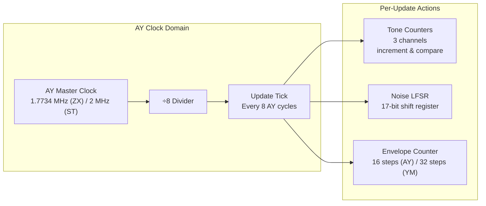
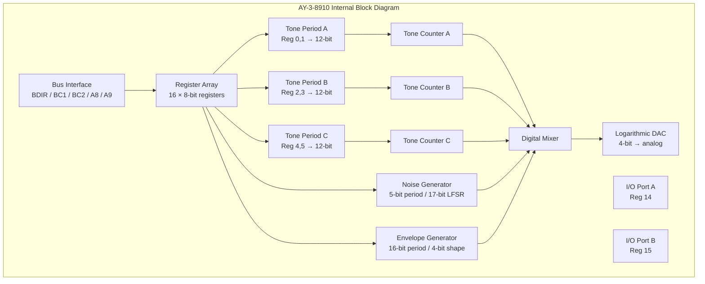
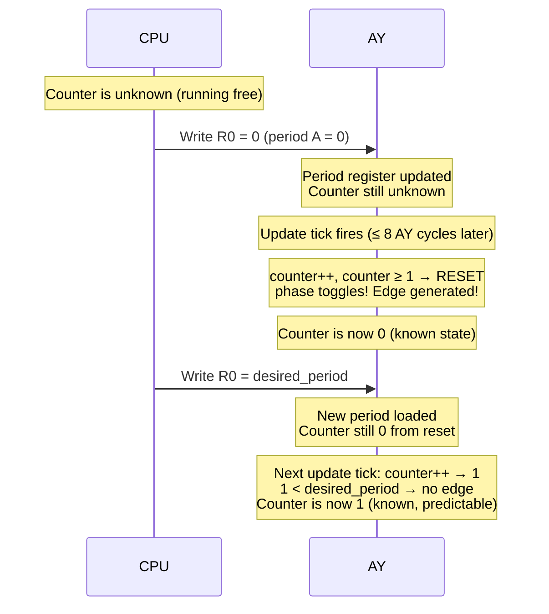

[← Home](../../README.md) · [Sound](../README.md) · [Synthesis](README.md)

# AY/YM PSG Hardware Reference — Architecture, Registers, Counter Model

> **Applies to**: All tracks — Original (128K/+2/+2A/+3), Soviet (Pentagon, Scorpion, Kay, ATM Turbo), New Gen (ZX Spectrum Next). Also relevant to Atari ST (YM2149), Amstrad CPC (AY-3-8910), MSX.

---

## Overview

The AY-3-8910 and its Yamaha clone, the YM2149, are **Programmable Sound Generators (PSG)** — chips designed in 1978–1979 that became the most widely used sound chips of the 8-bit era. They appear in the ZX Spectrum 128K, Sinclair QL, Atari ST, Amstrad CPC, MSX, Vectrex, Intellivision, and dozens of arcade machines. On the ZX Spectrum, the AY-3-8912 (a 28-pin variant with one I/O port instead of two) is built into every model from the 128K onward.

PSG chip looks simple on paper: **three square wave channels, one noise generator, one envelope generator, 16 registers**. But this apparent simplicity is deceptive. Over 40 years, musicians and programmers have discovered that the AY's internal counter model, when manipulated with cycle-exact timing, can produce effects the original designers never imagined — pulse-width modulation, hard-sync oscillator effects, sample playback, even crude FM-like timbres. These techniques form the foundation of the ZX Spectrum's rich chiptune tradition.

This article is the **hardware reference** for the AY/YM — architecture, registers, clock domains, and the internal counter model that underlies all advanced techniques. For the synthesis techniques themselves (sync-square, PWM, SID-sound, buzzer bass, note-colored noise, drum synthesis), see [AY/YM Synthesis Techniques](ay_ym_techniques.md). For a comparison of the AY-3-8910 and YM2149 chip variants, see [AY vs YM Technical Comparison](ay_vs_ym.md).

> [!NOTE]
> **AY-3-8910 vs YM2149**: The YM2149 is a Yamaha-manufactured licensed clone with one key difference — the envelope generator has **32 steps** instead of 16, and the output includes a **2V DC offset**. The ZX Spectrum uses the AY-3-8912. The Atari ST uses the YM2149F. See [AY vs YM](ay_vs_ym.md) for the complete comparison.

---

## Clock Domains and the CPU-to-PSG Ratio

Understanding the AY's internal clock is essential for every advanced technique in this article. The chip does not run at the CPU clock speed — it has its own clock domain derived from the system clock.

### AY Clock by Platform

| Platform | AY Clock | CPU Clock | Ratio | Chip |
|----------|----------|-----------|-------|------|
| ZX Spectrum 128K/+2/+3 | **1.7734 MHz** | 3.54690 MHz | 2:1 | AY-3-8912 |
| Pentagon | **1.7500 MHz** | 3.5000 MHz | 2:1 | AY-3-8912/YM2149 |
| Fuller Box | **1.63819 MHz** | 3.54690 MHz | ~2.165:1 | AY-3-8910 |
| Atari ST (STFM) | **2.0000 MHz** | 8.0000 MHz | 4:1 | YM2149F |
| Atari STE | **~2.003 MHz** | 8.0849 MHz | ~4.005:1 | YM2149F |
| Amstrad CPC | **1.0000 MHz** | 4.0000 MHz | 4:1 | AY-3-8910 |
| MSX (NTSC) | **1.789772 MHz** | 3.579545 MHz | 2:1 | AY-3-8910/YM2149 |

> [!WARNING]
> **Atari STE clock mismatch**: The STE uses two separate crystal oscillators — one for the CPU (32.084988 MHz ÷ 4) and one for the YM (8.010613 MHz ÷ 4). Their ratio is **4.0053:1, not exactly 4:1**. This means 32 CPU cycles ≈ 7.98 YM cycles, not 8. Cycle-timed sync-square techniques that work perfectly on the STFM will **occasionally fail** on the STE due to this drift. The ZX Spectrum does not have this problem — the AY clock is always exactly half the CPU clock.

### The Internal Divider: 8-Cycle Update Window

The AY internally divides its clock by 8. The **tone generators, noise generator, and envelope generator all update once every 8 AY clock cycles**. This is the fundamental timing unit for all advanced techniques:

```
AY clock:    ──┬──┬──┬──┬──┬──┬──┬──┬──┬──┬──┬──┬──┬──┬──┬──┬──
               │  │  │  │  │  │  │  │  │  │  │  │  │  │  │  │
Update:      ──┤  │  │  │  │  │  │  │  ┤  │  │  │  │  │  │  ┤
              ↑                    ↑
           Update 1              Update 2
        (8 AY cycles)         (8 AY cycles)
```

On the ZX Spectrum (1.7734 MHz AY clock), one update window = 8 ÷ 1,773,400 ≈ **4.51 microseconds**. In CPU terms, that's **16 T-states** (8 AY cycles × 2 CPU cycles per AY cycle).

On the Atari ST (2 MHz YM clock), one update window = 8 ÷ 2,000,000 = 4.00 microseconds = **32 68000 cycles** (8 YM cycles × 4 CPU cycles per YM cycle).

This 8-cycle window is why the classic sync-square code on Atari ST leaves "8 NOPs" (32 CPU cycles) between register writes — it ensures the YM has completed at least one full update cycle.



### Register Write Latency

When the CPU writes to an AY register, the new value does not take effect instantly. The AY only reads register values during its **update tick** (once every 8 cycles). If you write a new period value and then immediately write another value before the update tick fires, the AY may never "see" the first write. This is the cause of the most common bugs in cycle-timed AY code.

**Rule**: After writing a register that should cause an immediate effect (like a period change for sync-square), wait at least **one full update window** (8 AY cycles = 16 T-states on ZX, 32 CPU cycles on ST) before writing the next value.

---

## Internal Architecture

### Die-Shot Evidence

The internal architecture described here is confirmed by the [AY-3-8910 die shot](http://velesoft.speccy.cz/), analysis on [Atari-Forum](https://www.atari-forum.com/), and cross-referenced with MAME's `ay8910.cpp` emulator implementation.



### Tone Generator Detail

Each of the three tone generators contains:

1. **A 12-bit period register** (split across two AY registers: 8-bit fine + 4-bit coarse)
2. **An internal counter** (12-bit, counts upward from 0)
3. **A phase flip-flop** (1-bit, determines whether the square wave output is currently high or low)

On each update tick (every 8 AY cycles):

```
counter = counter + 1
if counter >= period:
    counter = 0
    phase = phase XOR 1   ; toggle the square wave
```

The square wave output feeds into the digital mixer. When phase=1, the channel contributes its volume; when phase=0, it's silent. The result is a square wave at frequency:

```
F(tone) = F(AY_clock) / (16 × period)
```

The factor of 16 (not 8) appears because the counter must count up to `period` **twice** to complete one full square wave cycle (once for the rising edge, once for the falling edge).

> [!IMPORTANT]
> **Period = 0 behaves as period = 1**. The counter starts at 0, increments to 1, and 1 ≥ 1 (the effective period) triggers an edge reset. This applies to both tone and noise generators. For the **envelope** generator, period = 0 is **half** of period = 1 — this is a documented YM2203 difference that also applies to the AY envelope.

---

## Complete Register Map

The AY has 16 registers, accessed through a two-port interface. On the ZX Spectrum, these ports are `#FFFD` (address/register select) and `#BFFD` (data write/read).

### Access Protocol

```z80
; --- Select a register ---
LD   BC,#FFFD          ; Register select port
LD   A,reg_number      ; 0-15
OUT  (C),A

; --- Write data to selected register ---
LD   B,#BF             ; BC = #BFFD (data port)
LD   A,value
OUT  (C),A

; --- Read data from selected register ---
LD   BC,#FFFD
LD   A,reg_number
OUT  (C),A
LD   B,#BF             ; BC = #BFFD
IN   A,(C)              ; Read register value
```

> [!WARNING]
> **Requires contended memory timing awareness**: On the 128K/+2, the AY ports `#FFFD` and `#BFFD` are in the contended I/O range. Each `OUT (C),A` takes 21 T-states but may be extended by 1–6 T-states of ULA contention during screen display. For cycle-timed AY code, either execute during the blanking period or account for contention. The Pentagon has **zero contention** — all I/O timing is deterministic.

### Register Summary

| Register | Bits | Purpose | ZX-Spectrum-Specific Notes |
|----------|------|---------|---------------------------|
| **R0** | 8 | Channel A tone period — fine (bits 0–7) | Combined with R1 for 12-bit period |
| **R1** | 4 | Channel A tone period — coarse (bits 8–11) | Upper 4 bits only; bits 4–7 ignored |
| **R2** | 8 | Channel B tone period — fine | |
| **R3** | 4 | Channel B tone period — coarse | |
| **R4** | 8 | Channel C tone period — fine | |
| **R5** | 4 | Channel C tone period — coarse | |
| **R6** | 5 | Noise period (bits 0–4) | Lower 5 bits; bits 5–7 ignored |
| **R7** | 8 | Mixer control | See bitfield below; also controls I/O port direction |
| **R8** | 4 | Channel A volume (bits 0–3) | Bit 4 = envelope control; bits 5–7 ignored |
| **R9** | 4 | Channel B volume | Bit 4 = envelope control |
| **R10** | 4 | Channel C volume | Bit 4 = envelope control |
| **R11** | 8 | Envelope period — fine (bits 0–7) | Combined with R12 for 16-bit period |
| **R12** | 8 | Envelope period — coarse (bits 8–15) | |
| **R13** | 4 | Envelope shape/type (bits 0–3) | **Writing this register ALWAYS restarts the envelope** |
| **R14** | 8 | I/O Port A data | On 128K: serial/aux port, keypad reading |
| **R15** | 8 | I/O Port B data | Not available on AY-3-8912 (28-pin package) |

### Mixer Register (R7) Bitfield

```
R7:  ┌────┬────┬────┬────┬────┬────┬────┬────┐
     │IOB │IOA │Cns │Bns │Ans │Ct  │Bt  │At  │
     └────┴────┴────┴────┴────┴────┴────┴────┘
        7    6    5    4    3    2    1    0

  Bit 0 (At): 0 = Channel A tone ENABLED
  Bit 1 (Bt): 0 = Channel B tone ENABLED
  Bit 2 (Ct): 0 = Channel C tone ENABLED
  Bit 3 (Ans): 0 = Channel A noise ENABLED
  Bit 4 (Bns): 0 = Channel B noise ENABLED
  Bit 5 (Cns): 0 = Channel C noise ENABLED
  Bit 6 (IOA): 1 = Port A INPUT, 0 = Port A OUTPUT
  Bit 7 (IOB): 1 = Port B INPUT, 0 = Port B OUTPUT
```

> [!NOTE]
> **Inverted logic**: A **0** bit means **ENABLED**. This catches many beginners off guard. `#3F` = all tone+noise disabled. `#00` = everything enabled. To play a pure tone on Channel A with no noise: set R7 = `#FE` (bit 0 = 0 for tone on, bits 3–5 = 1 for noise off).

### Volume Register (R8/R9/R10) Bitfield

```
R8/R9/R10:
      ┌────┬────┬────┬────┬────┬────┬────┬────┐
      │ x  │ x  │ x  │ENV │ V3 │ V2 │ V1 │ V0 │
      └────┴────┴────┴────┴────┴────┴────┴────┘
        7    6    5    4    3    2    1    0

  Bits 0–3 (V0–V3): Fixed volume level (0–15)
  Bit 4 (ENV):      1 = Use envelope generator for volume
  Bits 5–7:         Unused
```

### Envelope Shape Register (R13) Bitfield

```
R13:  ┌────┬────┬────┬────┐
      │ x  │CONT|ALT │HOLD|ATK │
      └────┴────┴────┴────┘
        3    2    1    0

  Bit 0 (ATK):  Attack (1=rising, 0=falling)
  Bit 1 (HOLD): Hold final value
  Bit 2 (ALT):  Alternate direction on repeat
  Bit 3 (CONT): Continue (repeat the envelope)
```

Only **8 of 16 combinations** are useful. The standard shapes:

| R13 Value | Shape | Waveform |
|-----------|-------|----------|
| `#00` | Sawtooth (↓) | 15→14→...→0→15→14→... (repeating decay) |
| `#01` | Sawtooth (↑) | 0→1→...→15→0→1→... (repeating attack) |
| `#02` | Triangle (↓↑) | 15→14→...→0→1→...→15→... (repeating) |
| `#03` | Triangle (↑↓) | 0→1→...→15→14→...→0→... (repeating) |
| `#04` | Decay+Hold | 15→14→...→0→0→0→... (single decay, holds at 0) |
| `#05` | Attack+Hold | 0→1→...→15→15→15→... (single attack, holds at 15) |
| `#06` | Decay+Hold(alt) | 15→14→...→0→15→15→... (decay then hold at 15) |
| `#07` | Attack+Hold(alt) | 0→1→...→15→0→0→... (attack then hold at 0) |
| `#08`–`#0F` | Same as `#00`–`#07` | Continue bit set: repeats the pattern |

> [!IMPORTANT]
> **Writing R13 always restarts the envelope generator**. This is the **only guaranteed way** to reset the envelope phase. The envelope counter resets to its starting position, and the shape begins from the beginning. This is critical for all envelope-based synthesis techniques.

---

## Basic Tone Generation

### Frequency Calculation

The output frequency of a tone channel is:

```
F(tone) = F(AY_clock) / (16 × TP)
```

Where `TP` is the 12-bit period value (R0+R1 for Channel A, etc.).

### Note-to-Period Table (ZX Spectrum 128K, AY clock = 1.7734 MHz)

| Note | Octave | Frequency | Period (TP) | Reg R0 (fine) | Reg R1 (coarse) |
|------|--------|-----------|-------------|----------------|------------------|
| C | 3 | 130.81 Hz | 849 | #31 | #3 |
| C# | 3 | 138.59 Hz | 801 | #21 | #3 |
| D | 3 | 146.83 Hz | 756 | #F4 | #2 |
| D# | 3 | 155.56 Hz | 713 | #C9 | #2 |
| E | 3 | 164.81 Hz | 674 | #A2 | #2 |
| F | 3 | 174.61 Hz | 636 | #7C | #2 |
| F# | 3 | 185.00 Hz | 600 | #58 | #2 |
| G | 3 | 196.00 Hz | 566 | #36 | #2 |
| G# | 3 | 207.65 Hz | 534 | #16 | #2 |
| A | 3 | 220.00 Hz | 504 | #F8 | #1 |
| A# | 3 | 233.08 Hz | 475 | #DB | #1 |
| B | 3 | 246.94 Hz | 449 | #C1 | #1 |
| C | 4 | 261.63 Hz | 424 | #A8 | #1 |
| ... | ... | ... | ... | ... | ... |
| C | 5 | 523.25 Hz | 212 | #D4 | #0 |
| A | 4 | 440.00 Hz | 252 | #FC | #0 |

### Frequency Range

| Parameter | Value (ZX Spectrum 128K) |
|-----------|--------------------------|
| Minimum frequency (TP=4095) | **27.1 Hz** |
| Maximum frequency (TP=1) | **110.8 kHz** |
| Practical musical range | **55 Hz (A1) to ~8 kHz** |
| Resolution at 440 Hz | ~0.34 Hz per step |

### Complete Example: Play a 440 Hz Tone on Channel A

```z80
; ============================================
; Play 440 Hz (A4) on Channel A
; AY clock = 1.7734 MHz, TP = 1773400 / (16 * 440) = 252
; ============================================

        LD   BC,#FFFD

        ; R0 = Channel A fine period = 252 = #FC
        LD   A,#00
        OUT  (C),A
        LD   B,#BF
        LD   A,#FC
        OUT  (C),A
        LD   B,#FF              ; BC = #FFFD again

        ; R1 = Channel A coarse period = 0
        LD   A,#01
        OUT  (C),A
        LD   B,#BF
        XOR  A                  ; A = 0
        OUT  (C),A
        LD   B,#FF

        ; R7 = Mixer: enable tone A, disable B/C tone, disable all noise
        LD   A,#07
        OUT  (C),A
        LD   B,#BF
        LD   A,#3E              ; %00111110 — bit 0 = 0 (tone A on), rest off
        OUT  (C),A
        LD   B,#FF

        ; R8 = Channel A volume = 15 (maximum)
        LD   A,#08
        OUT  (C),A
        LD   B,#BF
        LD   A,#0F              ; Volume 15
        OUT  (C),A

        ; Tone is now playing. Loop forever or set a duration.
 LOOP:  JR   LOOP
```

---

## The Internal Counter Model (Critical for Advanced Techniques)

The tone generator pseudocode shown earlier is the **official model** from the datasheet. But for advanced synthesis, we need a more precise understanding of the internal state machine. This model has been verified against hardware measurements on both the ZX Spectrum and Atari ST.

### Precise Update Cycle

On every 8-cycle update tick, for each tone channel independently:

```
1. counter ← counter + 1
2. IF counter ≥ period THEN:
     counter ← 0
     phase ← phase XOR 1     ; toggle the output
```

Key observations:

1. **The counter increments first, then compares.** This means a period of 1 triggers on every tick (counter goes 0→1, 1≥1, reset).
2. **Phase is independent per channel.** Each channel has its own phase bit; they are not synchronized.
3. **Register writes are latched, not immediate.** When you write a new period value, the AY's internal logic loads it into the period register. But the counter continues running against whatever period was loaded at the last update tick.
4. **The counter value is NOT readable.** There is no way to query the current counter position. This is why phase prediction (below) is necessary for reliable sync techniques.

### What Register Writes Actually Do

This is the part most documentation gets wrong or omits:

| Register Written | Effect on Internal State |
|-----------------|--------------------------|
| R0–R5 (tone period) | Updates the **period register** only. Does NOT reset the counter. Does NOT change the phase. The new period takes effect on the next update tick. |
| R6 (noise period) | Updates noise period register. Does NOT reset the noise LFSR or counter. |
| R7 (mixer) | Changes routing immediately on next update tick. |
| R8–R10 (volume) | Updates volume register. Takes effect on next update tick. |
| R11–R12 (envelope period) | Updates envelope period. Does NOT reset envelope counter. |
| R13 (envelope shape) | **RESTARTS the envelope generator**: counter reset to 0, phase set based on attack bit. This is the ONLY register write that provably resets an internal counter. |

### The Phase Prediction Problem

When using advanced techniques like sync-square, you need to know (or control) the current value of the tone counter. Since the counter is not readable, you must either:

1. **Track it in software** — maintain a software model of the counter, incrementing it at the same rate as the hardware
2. **Force a known state** — use the period=0/period=1 trick to force an immediate counter reset
3. **Accept uncertainty** — design your code to work regardless of the counter's current position

### The Period-0 Phase Reset Trick

This is the foundation of sync-square and many other techniques:

```
STEP 1: Write period = 0 (or 1) to a channel
         → On next update tick: counter increments to 1, 1 ≥ 1, counter resets to 0, phase toggles
         → The phase has now CHANGED at a known time

STEP 2: Wait at least one update window (8 AY cycles)
         → This ensures the AY processed the period=0 write

STEP 3: Write the actual desired period
         → The counter starts fresh from 0 against the new period
```

This gives you **controlled phase reset** — the ability to force a square wave edge at a precisely known time. Without this, the AY's tone generators run freely and you cannot predict when edges will occur.



### Why Period=0 and Period=1 Are Identical

The counter increments before comparison:

```
Period = 0:  counter 0→1, 1 ≥ 0 → reset, edge     (every tick)
Period = 1:  counter 0→1, 1 ≥ 1 → reset, edge     (every tick)
```

Both produce an edge on **every single update tick** (8 AY cycles), resulting in the maximum possible frequency the AY can produce. This maximum frequency is:

```
F(max) = F(AY_clock) / 16 = 1,773,400 / 16 ≈ 110.8 kHz (ZX Spectrum)
```

This ultrasonic frequency is the basis for **sample playback via volume modulation** — at period 0/1, the tone output is oscillating too fast to hear, and you can use the volume register to shape an audible envelope over the ultrasonic carrier.

### Partial Register Update Hazard

When setting a 12-bit tone period, you must write two registers (fine + coarse). There is a window where the AY may see only the first write:

```
T-state 0:  Write R0 = #FC (fine = 252)
             → AY period is now {coarse_old, #FC}
T-state 21: Write R1 = #00 (coarse = 0)
             → AY period is now {#00, #FC} = 252 (correct)
```

If an update tick fires between these two writes, the AY briefly sees an intermediate period value. This can cause:
- Spurious edges (if the intermediate period is low)
- Missed edges (if the intermediate period is high)
- Phase desynchronization in cycle-timed code

**Solutions:**
1. Write the **coarse register first** when increasing the period (the intermediate value is lower, less likely to cause issues)
2. Write the **fine register first** when decreasing the period
3. For critical timing, disable interrupts during the two-write sequence and ensure both writes happen within one update window (16 T-states on ZX)
4. For coarse-only changes (keeping fine at 0), only one register write is needed — no hazard

---

## Envelope Generator Internals

The envelope generator is the AY's most complex subsystem — a single shared resource that all three channels can optionally use. Understanding its internal state machine is essential for both envelope-based synthesis and for predicting when the envelope will restart.

> **For synthesis techniques** that use the envelope as an audio-rate oscillator (buzzer bass, squelch effects), see [AY/YM Synthesis Techniques](ay_ym_techniques.md).

### Envelope Internal State Machine

The envelope generator contains:
- A **16-bit counter** (counts upward)
- A **16-bit period register** (R11 fine + R12 coarse)
- A **4-bit output counter** (0–15, this is what controls volume)
- A **shape state machine** controlled by R13

On each update tick:

```
1. env_counter = env_counter + 1
2. IF env_counter >= env_period:
     env_counter = 0
     ; Advance the 4-bit output counter based on shape
     IF attacking:
       IF output_counter < 15: output_counter++
       ELSE: handle shape transition (see below)
     ELSE (decaying):
       IF output_counter > 0: output_counter--
       ELSE: handle shape transition
```

### Envelope Frequency Formula

```
F(env) = F(AY_clock) / (256 × EP)
```

Where EP is the 16-bit envelope period (R11 + R12). The factor of 256 (not 16) appears because the envelope counter must count up to EP **16 times** to complete one full cycle through all 16 volume levels. On the YM2149 with 32-step envelopes, the factor is 512.

| Envelope Period | F(env) on ZX (1.7734 MHz) | F(env) on ST (2.0 MHz) | Musical Note |
|-----------------|---------------------------|------------------------|--------------|
| 433 | ~16 Hz | ~18 Hz | Infrasonic (vibrato rate) |
| 100 | ~69 Hz | ~78 Hz | C2–D2 |
| 50 | ~139 Hz | ~156 Hz | C3–D#3 |
| 25 | ~277 Hz | ~313 Hz | C#4–D#4 |
| 12 | ~579 Hz | ~651 Hz | D5–D#5 |
| 5 | ~1389 Hz | ~1563 Hz | E6–G6 |
| 1 | ~6943 Hz | ~7813 Hz | Ultrasonic (for sample carrier) |

### The Shape State Machine (R13)

Writing R13 (bits 0–3) does TWO things simultaneously:
1. **Sets the shape parameters** (continue, alternate, hold, attack)
2. **Immediately restarts the envelope** — counter reset to 0, output counter set to 15 (if decaying) or 0 (if attacking)

The four control bits create this behavior matrix:

| CONT | ALT | HOLD | ATK | Waveform | Use Case |
|------|-----|------|-----|----------|----------|
| 0 | 0 | x | 0 | Single decay, hold at 0 | Hi-hat, pluck |
| 0 | 0 | x | 1 | Single attack, hold at 15 | Swell, pad entry |
| 0 | 1 | 0 | 0 | Decay→Hold at 15 | Reverse pluck |
| 0 | 1 | 0 | 1 | Attack→Hold at 0 | Fade-in→cut |
| 0 | 1 | 1 | 0 | Decay→Hold at 15 (alt) | Single ramp up |
| 0 | 1 | 1 | 1 | Attack→Hold at 0 (alt) | Single ramp down |
| 1 | 0 | x | 0 | Repeating sawtooth decay | Bass synth, buzzer |
| 1 | 0 | x | 1 | Repeating sawtooth attack | Reverse bass |
| 1 | 1 | 0 | 0 | Repeating triangle (↓↑) | Smooth pad, flute |
| 1 | 1 | 0 | 1 | Repeating triangle (↑↓) | Smooth pad variant |

### Shared Envelope Caveat

All three channels sharing one envelope means:
- If Channels A and B both use envelope mode, they share the **same volume pattern at the same time**
- You cannot have independent envelope shapes per channel
- You can still have different tone frequencies per channel, creating different interference patterns

This is why many AY compositions use the envelope on one channel (usually for bass) and fixed volumes on the other two.

---

## Noise Generator Internals

The noise generator uses a **17-bit Linear Feedback Shift Register (LFSR)** to produce pseudo-random noise:

```
On each update tick:
  noise_counter = noise_counter + 1
  if noise_counter >= noise_period:
    noise_counter = 0
    bit = (lfsr.bit(0) XOR lfsr.bit(3))    ; taps at positions 0 and 3
    lfsr = (bit << 16) | (lfsr >> 1)         ; shift right, inject new bit
    output = lfsr.bit(0)                      ; output is bit 0 of LFSR
```

The noise period (R6, 5 bits: values 0–31) controls how fast the LFSR shifts. A low period = white-noise-like hiss; a high period = lower-pitched rumble. Period = 0 behaves as period = 1 (same as tone generators).

Noise frequency:

```
F(noise) = F(AY_clock) / (16 × NP)
```

Where NP is the 5-bit noise period (R6).

When both tone and noise are enabled for a channel (bits in R7), the output is the logical **AND** of the tone square wave and the noise generator's output.

---

## Hardware-Level Pitfalls

### 1. The Counter Reset Illusion

Writing a period register (R0–R5) does **NOT** reset the internal counter. The counter continues from its current position against the new period value. Only writing R13 resets a counter (the envelope counter). For tone channels, use the period=0 phase reset trick described above.

### 2. The Mixer Inversion Trap

R7 uses **inverted logic**: a **0** bit means **ENABLED**. This catches many beginners off guard.

```z80
; WRONG: This DISABLES everything
        LD   A,#FF              ; All bits set → all tone and noise OFF (silence!)

; CORRECT: R7 = #3E enables tone on Channel A only
        LD   A,#3E              ; %00_111110
                        ; bit 0 = 0 → tone A ON
                        ; bits 1-2 = 1 → tone B/C OFF
                        ; bits 3-5 = 1 → noise A/B/C OFF
```

### 3. The Contended I/O Timing Error

On the 128K/+2, AY port writes during screen display are subject to contention. The `OUT (C),A` instruction takes 21 T-states nominally but may take 22–27 T-states during scanlines 64–255. For cycle-timed AY code, either execute during vertical blanking or use the Pentagon (which has zero contention).

### 4. Partial Register Update Hazard

When setting a 12-bit tone period (two registers: fine + coarse), if an AY update tick fires between the two writes, the chip briefly sees an intermediate period value. This can cause spurious edges or missed edges. Write coarse first when increasing the period, fine first when decreasing.

---

## See Also

- [AY/YM Synthesis Techniques](ay_ym_techniques.md) — sync-square, PWM, SID-sound, buzzer bass, note-colored noise, drum synthesis, sample playback
- [AY vs YM Technical Comparison](ay_vs_ym.md) — envelope resolution, DC offset, SEL pin, volume tables, detection, emulator behavior
- [The AY Sound — Perception and Emotion](ay_ym_perception.md) — psychoacoustics, ABC vs ACB, analog signal chain, nostalgia
- [Multi-Track and Multi-Chip Synthesis](multitrack_multichip.md) — TurboSound, cross-chip effects

---

## References

- [AY-3-8910 Datasheet](https://campus.fri.uniza.sk/sites/default/files/content/ay-3-8910.pdf) — General Instrument, 1979
- [YM2149 / SSG Datasheet](https://www.atari-forum.com/wiki/images/4/47/YM2149.pdf) — Yamaha
- [YM2149 Sync-Square Part 1](https://clarets.org/steve/projects/2021_ym2149_sync_square.html) — Steven Tattersall, 2021
- [MAME AY-3-8910 emulation](https://github.com/mamedev/mame/blob/master/src/devices/sound/ay8910.cpp) — reference implementation
- [AY-3-8910 die shot](http://velesoft.speccy.cz/) — Velesoft's hardware analysis
- [AY-3-8912 Sinclair Wiki](https://sinclair.wiki.zxnet.co.uk/wiki/AY-3-8912) — register map and clock frequencies
- [128K Memory and I/O — AY ports](../../05_development/03_memory_and_io/memory_and_io_128k.md) — port decoding for #FFFD/#BFFD
- [Contention Model](../../05_development/03_memory_and_io/contention_model.md) — contended I/O timing
