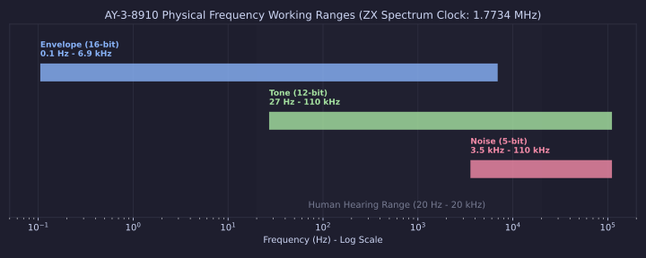
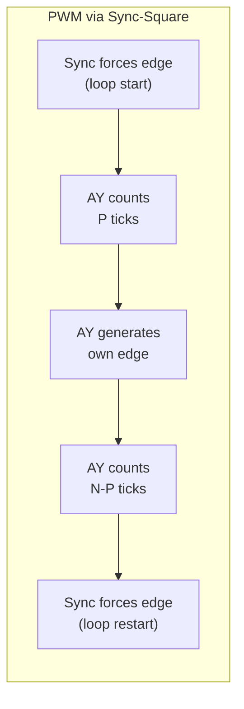
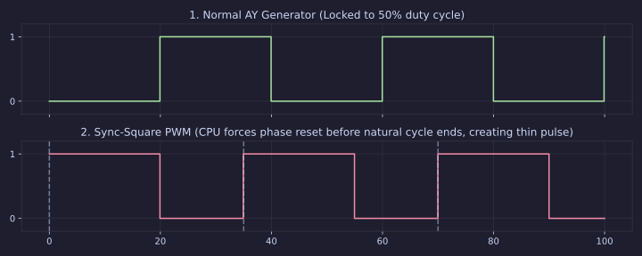
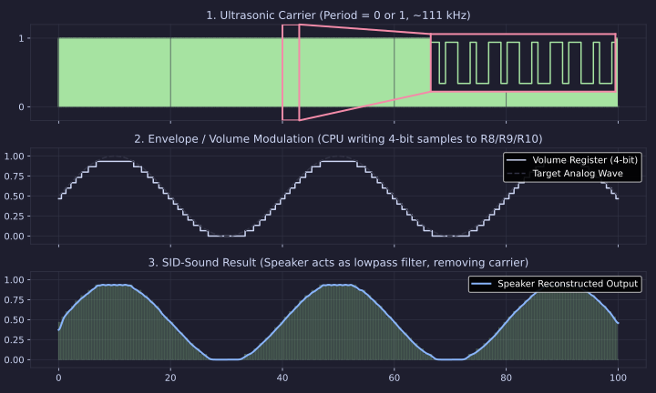
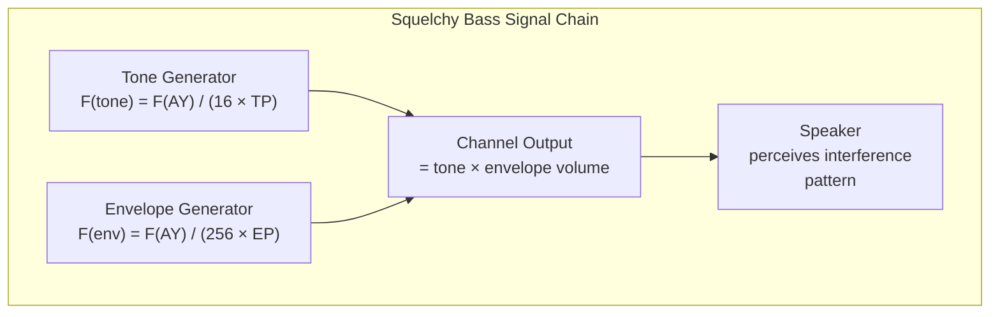
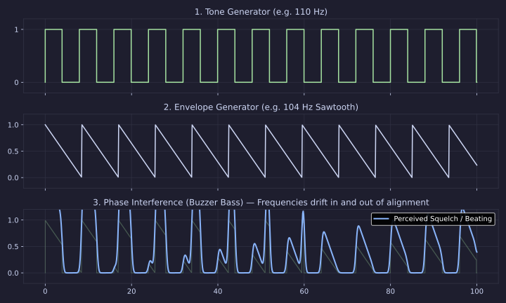

[← Home](../../README.md) · [Sound](../README.md) · [Synthesis](README.md)

# AY/YM Synthesis Techniques — Sync-Square, PWM, SID-Sound, Buzzer Bass, Note-Colored Noise, Drums, Samples

> **Applies to**: AY-3-8910/8912 and YM2149 on all platforms — ZX Spectrum 128K, Pentagon, Atari ST, Amstrad CPC, MSX.

---

## Overview

This article is the **synthesis techniques cookbook** — the practical companion to the [AY/YM Hardware Reference](ay_ym_synthesis.md). The hardware reference covers architecture, registers, and the counter model. Here we take that model and exploit it to produce sounds the chip's designers never intended.

> [!NOTE]
> **Prerequisites**: This article assumes you have read the [Hardware Reference](ay_ym_synthesis.md), specifically the sections on **Clock Domains** and the **Internal Counter Model**. The techniques here depend on understanding the 8-cycle update window, the period-0 phase reset trick, and register write latency.

### Technique Index

| Technique | What It Produces | Key Registers Exploited |
|-----------|-----------------|------------------------|
| [Sync-Square](#sync-square-hard-sync) | Controlled phase reset, PWM | R0–R5 (period), rapid writes |
| [SID-Sound](#sid-sound-volume-modulated-ultrasonic-carrier) | 4-bit sample playback, extra timbres | R8–R10 (volume), R0–R5 (period=0/1) |
| [Buzzer Bass](#buzzer-bass-envelope-as-oscillator) | Rich bass tones, squelch | R11–R13 (envelope), R8–R10 |
| [Note-Colored Noise](#note-colored-noise) | Pitched noise, tuned percussion | R6 (noise period), R7 (mixer) |
| [Drum Synthesis](#digital-percussion) | Percussion instruments | R6, R11–R13, R7, R8–R10 |
| [Phase Interference](#phase-interference-bass) | Harmonic-rich tones | R0–R5 + R11–R13 synchronization |
| [Sample Playback](#advanced-sample-playback) | PCM audio, speech | R8–R10 (volume), optimized loops |

---

## Physical Hardware Constraints (Datasheet Limits)

Before exploring synthesis techniques, you must understand the mathematical limits imposed by the AY-3-8910's internal clock dividers. On the ZX Spectrum, the chip is driven by a **1.7734 MHz** clock. The AY applies hardwired prescalers (÷16 for tone/noise, ÷256 for envelopes) to this master clock.

These prescalers dictate the absolute minimum and maximum frequencies each subsystem can generate:



1. **Tone Generator (12-bit register: 1–4095)**
   - **Max frequency:** `1.7734 MHz / 16 / 1 = 110,837 Hz` (Ultrasonic carrier used for sample playback)
   - **Min frequency:** `1.7734 MHz / 16 / 4095 = 27 Hz` (Deep bass)

2. **Noise Generator (5-bit register: 1–31)**
   - **Max frequency:** `1.7734 MHz / 16 / 1 = 110,837 Hz` (Pure white noise)
   - **Min frequency:** `1.7734 MHz / 16 / 31 = 3,575 Hz` (The chip physically *cannot* produce low-frequency rumble via the noise generator)

3. **Envelope Generator (16-bit register: 1–65535)**
   - **Max frequency:** `1.7734 MHz / 256 / 1 = 6,927 Hz` (High-pitched tone when used as an oscillator)
   - **Min frequency:** `1.7734 MHz / 256 / 65535 = 0.105 Hz` (One full cycle takes ~9.5 seconds)

Every advanced technique is simply exploiting the interactions between these three asynchronous, frequency-limited domains.

---

## Phase Control Foundation

All advanced AY/YM techniques depend on one fundamental capability: **controlling the phase of the tone generators**. The chip does not provide a direct phase-reset register, but the period-0 trick gives us indirect control.

### The Period-0 Phase Reset Trick (Recap)

This is the foundation of every technique in this article. From the [Hardware Reference](ay_ym_synthesis.md):

```
STEP 1: Write period = 0 to a channel
         → On next update tick: counter increments to 1
         → 1 ≥ 0 (period=0 is treated as period=1) → counter resets to 0
         → Phase toggles! Edge generated at a KNOWN time.

STEP 2: Wait at least one update window (8 AY cycles = 16 T-states on ZX)
         → Ensures the AY processed the period=0 write

STEP 3: Write the actual desired period
         → Counter starts fresh from 0 against the new period
```

This gives you **controlled phase reset** — the ability to force a square wave edge at a precisely known time.

### Why Period=0 and Period=1 Are Identical

The counter increments before comparison:

```
Period = 0:  counter 0→1, 1 ≥ 0 → reset, edge     (every tick)
Period = 1:  counter 0→1, 1 ≥ 1 → reset, edge     (every tick)
```

Both produce an edge on **every single update tick** (8 AY cycles). This maximum frequency is `F(AY_clock) / 16` — approximately 110.8 kHz on the ZX Spectrum. This ultrasonic frequency is inaudible and serves as the carrier for sample playback (see [SID-Sound](#sid-sound-volume-modulated-ultrasonic-carrier)).

### Counter Synchronization Strategies

Since the tone counter is not readable, you have three approaches:

| Strategy | How | Reliability | Use Case |
|----------|-----|-------------|----------|
| **Track in software** | Maintain a software model of the counter | High, but complex | Sync-square loops |
| **Force a known state** | Period=0 trick before each note | Highest | One-shot phase control |
| **Accept uncertainty** | Design code to work regardless | Moderate | Music where phase doesn't matter |

---

## Sync-Square (Hard Sync)

### Origin and History

Sync-square was first documented by **gwEm/PHF** in *Alive Magazine* issue 9 (2005). The original Atari ST code sequence:

```asm
; gwEm's original sync-square sequence (68000)
move.l  #$00000000,$ffff8800.w    ; R0 = 0  (period low = 0)
move.l  #$01000000,$ffff8800.w    ; R1 = 0  (period high = 0)
move.l  #$0000xx00,$ffff8800.w    ; R0 = xx (restore desired period)
move.l  #$0100xx00,$ffff8800.w    ; R1 = xx (restore period high)
```

The technique was later refined by **Steven Tattersall** (2021) with hardware-verified timing analysis using oscilloscope measurements from a real STFM. His analysis, published at [clarets.org](https://clarets.org/steve/projects/2021_ym2149_sync_square.html), confirmed the internal counter model and identified the exact failure modes.

### What Sync-Square Achieves

Normally, the AY's tone generators run **freely** — you set a period and the chip oscillates autonomously. You cannot control *when* the square wave edge occurs relative to other events. Sync-square solves this by **forcing** an edge at a CPU-controlled time:

- **Predictable timbre at note onset** — no random phase, so every note starts with the same character
- **Pulse-width modulation** — controllable duty cycle, creating thin/wide pulse textures
- **Phase synchronization with envelope** — the key to stable buzzer bass
- **Harmonic-rich textures** from controlled phase interference

### How It Works — The Tattersall Analysis

Tattersall's hardware measurements confirmed the following model (quoting and expanding on his findings):

1. **The YM/AY runs a square wave "update" every 8 chip cycles.** This is confirmed by the die shot showing a 3-stage clock divider (÷8) feeding the tone generators.

2. **On each update, the internal counter increments by 1.** If counter ≥ period, a square wave edge is generated and the counter resets to 0.

3. **Register writes are latched, not immediate.** The chip reads register values during its update tick. If you write and then overwrite before the tick fires, the first write is lost.

4. **To force an edge, the written period must be ≤ the current counter value.** Setting period=0 (effective period=1) guarantees this because the counter always reaches 1 after one increment.

5. **You must wait 8 chip cycles after a write for the chip to "see" it.** On the ZX Spectrum, this is 16 T-states (2:1 CPU/AY ratio). On the Atari ST, this is 32 CPU cycles (4:1 ratio, "8 NOPs").

> [!IMPORTANT]
> **The 8-NOP rule**: On the Atari ST, `move.l #$xxxxxxxx,$ffff8800.w` takes 7 NOPs (28 cycles). Without an extra NOP, only 7 YM cycles pass — one short of the 8 needed for a reliable update. This is why gwEm's original code sometimes fails. The fix: insert a NOP between register writes. (Discovered by Ben/OVR.)

### ZX Spectrum Implementation

On the ZX Spectrum, the AY clock is exactly half the CPU clock (1.7734 MHz ÷ 3.54690 MHz = 2:1). One update window = 16 T-states. The `OUT (C),A` instruction takes 21 T-states, which already exceeds the update window — so the AY always sees the write. This makes the ZX Spectrum **the most reliable platform for sync-square**.

```z80
; ============================================
; Sync-Square on ZX Spectrum (Z80)
; Produces PWM-style tone on Channel A
; AY clock = 1.7734 MHz, update window = 16 T-states
; ============================================

        DI                      ; Critical: no interrupts during timing

SYNCLP:
        ; STEP 1: Write period = 0 to force immediate edge
        LD   BC,#FFFD
        LD   A,#00              ; Select R0 (Channel A fine period)
        OUT  (C),A              ; 21 T-states — AY has seen this write
        LD   B,#BF
        XOR  A                  ; A = 0 (period = 0)
        OUT  (C),A              ; 21 T-states — period=0 latched

        ; The OUT instruction took 21 T-states > 16 T-states
        ; so the AY update tick has already fired.
        ; The edge has been generated.

        ; STEP 2: Write the actual period
        LD   B,#FF              ; BC = #FFFD
        LD   A,#00              ; Select R0
        OUT  (C),A
        LD   B,#BF
        LD   A,(PERIOD)         ; Load desired period byte
        OUT  (C),A

        ; STEP 3: Wait for the remainder of the cycle
        ; This delay determines the PWM duty cycle
        LD   B,DELAY_COUNT      ; Adjustable delay
DELAY:  DJNZ DELAY              ; 13 T-states per iteration

        JR   SYNCLP             ; Loop and re-sync
```

### PWM via Sync-Square

The most powerful application of sync-square is **pulse-width modulation** — creating variable-duty-cycle square waves that the AY cannot normally produce. The AY's tone generators always produce 50% duty cycle. Sync-square breaks this limitation:

```
Loop takes:       N AY update ticks (the interrupt period)
AY period:        P ticks (P < N)

Result:           The AY generates its own edge at tick P
                  Then the sync-square forces another edge at tick N
                  Duty cycle = P / N

Example:          N = 10 ticks, P = 8 → 80% duty cycle (wide pulse)
                  N = 10 ticks, P = 2 → 20% duty cycle (thin pulse)
```





The closer P is to N, the thinner the pulse and the "thinner" the resulting timbre. This mimics the pulse-width control of the C64 SID chip, which has dedicated hardware for it.

### The Stable PWM Range

Tattersall's measurements showed that on the STFM, PWM is stable when the period is between approximately $80 and $F3 (relative to a loop of ~1939 NOPs). Below $80, the AY generates too many edges and the PWM pattern becomes unstable. Above $F3, no AY-generated edge occurs and you get a pure 50% square wave at the loop frequency.

At the boundary values ($F1, $F2), a fascinating phenomenon occurs: the loop length is **not an exact multiple of the AY update window**, so some loops get one more update tick than others. On Tattersall's test setup, 3 out of every 8 loop iterations had an extra update — a stable but complex pattern of spikes and normal edges that creates a distinctive buzzing texture.

### The STE Clock Drift Problem

On the Atari STFM, the CPU and YM share a single 32 MHz crystal, subdivided to 8 MHz (CPU) and 2 MHz (YM). The 4:1 ratio is exact.

The **Atari STE** has **two separate crystal oscillators**:

| Clock | STFM | STE |
|-------|------|-----|
| CPU (CCLK) | 32.000 MHz (shared) | 32.084988 MHz (dedicated) |
| YM (SCLK/CLK2) | 8.000 MHz (÷4 from shared) | 8.010613 MHz (dedicated) |
| **Ratio** | **4.0000:1** | **4.0053:1** |

This 0.13% drift means that 32 CPU cycles ≈ 7.98 YM cycles — not quite 8. Over time, the clocks drift in and out of phase. Approximately **1 in every 95 YM updates**, the 32 CPU cycles is not enough for the YM to complete its update, and the sync-square edge is **missed**. The result: intermittent clicking and glitching that is impossible to eliminate in software.

> [!WARNING]
> **ZX Spectrum has no clock drift problem.** The AY clock is always exactly half the CPU clock (derived from the same crystal). Sync-square is perfectly reliable on the ZX Spectrum and Pentagon.

### Emulator Compatibility

Sync-square requires the emulator to model the AY's internal update counter with cycle-accurate timing. Key requirements:

| Requirement | Why It Matters |
|-------------|----------------|
| Process register writes only at update-tick boundaries | Not immediately |
| Track per-channel tone counters independently | Phase state must persist |
| Handle rapid back-to-back writes correctly | Don't miss intermediate values |

**Emulator status:**

| Emulator | Sync-Square Support | Notes |
|----------|---------------------|-------|
| **Hatari** | Good (recent versions) | Low-level sound generation is accurate |
| **ZEsarUX** | Good | Models AY update counter |
| **Ay_Emul** (Bulba) | Reference for ZX | Gold standard for AY emulation |
| **Steem** | Partial | Register write timing not fully modeled |
| **Furnace** | Configurable | Supports phase reset timer feature |
| **Older MAME** | No | Processes writes immediately |

---

## SID-Sound (Volume-Modulated Ultrasonic Carrier)

### Origin and Naming

The technique is named after the Commodore 64's SID chip (6581/8580), which has a dedicated volume register and filter section. On the SID, sample playback is straightforward — set the waveform to all-high, modulate the volume register. The AY has no master volume register, but each channel's individual volume register serves the same purpose.

### Principle

```
1. Set a channel's tone period to 0 or 1 (ultrasonic carrier at ~111 kHz)
2. Rapidly change the volume register (R8/R9/R10) to shape an audible waveform
3. The ultrasonic carrier is filtered by the speaker/amp, leaving only the volume envelope
```

The tone generator at period 0/1 oscillates at ~111 kHz — far above human hearing. What you hear is not the carrier but the **volume changes** applied to it. Each volume write effectively outputs a 4-bit sample. The speaker and amplifier act as a lowpass filter, smoothing the ultrasonic carrier into a continuous waveform shaped by the volume curve.



This effectively turns one AY channel into a **4-bit (16-level) DAC** — a sample playback device with logarithmic amplitude quantization.

### Logarithmic Volume Correction

The AY's 16 volume levels are **logarithmic**, not linear. Volume level 8 is approximately -6 dB, not 50% of maximum. When playing PCM samples, you must convert linear sample values to the AY's logarithmic scale:

> **Standard AY volume table** (MAME, verified against hardware):
>
> | Level | 0 |  1  |  2  |  3  |  4  |  5  |  6  |  7  |  8  |  9  |  10  |  11  | 12 | 13 | 14 |  15 |
> |-------|---|-----|-----|-----|-----|-----|-----|-----|-----|-----|------|------|----|----|----|-----|
> | % max | 0 | 0.6 | 0.8 | 1.2 | 1.7 | 2.4 | 3.4 | 4.8 | 6.8 | 9.5 | 13.5 |  19  | 27 | 38 | 54 | 100 |

To play a linear 4-bit sample (0–15 where 0=silence, 15=full), pre-compute a lookup table that maps each linear value to the nearest AY logarithmic level:

```z80
; Linear-to-logarithmic conversion table
; Input: linear level 0-15 → Output: AY register value 0-15
LIN2LOG:
        DB   $00                ; linear  0 → AY  0 (silence)
        DB   $00                ; linear  1 → AY  0 (below threshold)
        DB   $01                ; linear  2 → AY  1
        DB   $02                ; linear  3 → AY  2
        DB   $03                ; linear  4 → AY  3
        DB   $04                ; linear  5 → AY  4
        DB   $04                ; linear  6 → AY  4
        DB   $05                ; linear  7 → AY  5
        DB   $06                ; linear  8 → AY  6
        DB   $07                ; linear  9 → AY  7
        DB   $08                ; linear 10 → AY  8
        DB   $09                ; linear 11 → AY  9
        DB   $0A                ; linear 12 → AY 10
        DB   $0B                ; linear 13 → AY 11
        DB   $0D                ; linear 14 → AY 13
        DB   $0F                ; linear 15 → AY 15 (full volume)
```

### Sample Playback Code

```z80
; ============================================
; SID-Sound sample playback on Channel A
; Plays 4-bit samples by writing to R8 (volume)
; ============================================

        ; Set Channel A to ultrasonic frequency
        LD   BC,#FFFD
        LD   A,#00              ; R0 = fine period
        OUT  (C),A
        LD   B,#BF
        XOR  A                  ; Period = 0
        OUT  (C),A              ; Ultrasonic carrier

        LD   B,#FF
        LD   A,#01              ; R1 = coarse period
        OUT  (C),A
        LD   B,#BF
        XOR  A                  ; Coarse = 0
        OUT  (C),A

        ; Enable tone on Channel A only
        LD   B,#FF
        LD   A,#07
        OUT  (C),A
        LD   B,#BF
        LD   A,#3E              ; tone A on, everything else off
        OUT  (C),A

        ; Sample playback loop
        LD   HL,SAMPLE_DATA     ; Pointer to pre-converted 4-bit samples
        LD   DE,SAMPLE_LENGTH

PLAY:   LD   A,(HL)             ; Get 4-bit sample (already log-converted)
        LD   B,#FF
        LD   C,#FD
        LD   B,#FF
        LD   A,#08              ; Select R8
        OUT  (C),A
        LD   B,#BF
        LD   A,(HL)             ; Get sample value
        OUT  (C),A              ; Write to volume register

        INC  HL
        DEC  DE
        LD   A,D
        OR   E
        JR   NZ,PLAY

        ; Silence when done
        LD   B,#FF
        LD   A,#08
        OUT  (C),A
        LD   B,#BF
        XOR  A                  ; Volume = 0
        OUT  (C),A
```

### Sample Rate Considerations

On the ZX Spectrum at 3.54690 MHz, the achievable sample rates are:

| Loop Style | T-states/sample | Sample Rate | Quality |
|------------|-----------------|-------------|---------|
| Minimal `OUT` loop | ~48 T-states | ~7.4 kHz | Telephone quality |
| Unrolled (4 samples) | ~40 T-states | ~8.9 kHz | AM radio quality |
| Double-buffered (2 channels) | ~70 T-states | ~5.1 kHz | Lower quality, but stereo |
| Interrupt-driven (50 Hz frame) | varies | ~6-8 kHz | Standard for games |

> [!NOTE]
> The 4-bit resolution (16 levels) is the limiting factor for quality, not the sample rate. Even at 15 kHz, the 16-level quantization produces audible staircasing. For speech, this is acceptable. For music, the quantization noise is part of the aesthetic.

### Multi-Channel Sample Mixing

The AY has three volume registers (R8, R9, R10). By running multiple channels at period 0/1, you can play **three independent samples simultaneously** — at the cost of CPU time and the loss of all melodic channels.

A more sophisticated approach is **software mixing**: sum multiple 4-bit samples in software (with clipping at 15), then output the mixed value to a single channel. This requires more CPU but allows flexible mixing.

### Delta-Modulation Variant

An alternative to absolute 4-bit samples is **delta modulation**: store only the *change* in volume from the previous sample (±1, 0). This gives smoother transitions at the cost of needing more samples per unit time. The advantage is that 2-bit delta values can be packed 4 per byte, reducing memory usage by 50%.

---

## Buzzer Bass (Envelope as Oscillator)

The AY has one envelope generator shared by all three channels. Normally, the envelope is used at sub-audio rates for volume fades, tremolo, and percussion decay. But when set to audio frequencies, it becomes a **fourth oscillator** — the most important technique for bass synthesis on the AY.

### Envelope Frequency Formula

```
F(env) = F(AY_clock) / (256 × EP)
```

Where EP is the 16-bit envelope period (R11 + R12). The factor 256 = 16 (steps per cycle) × 16 (update ticks per step). On the YM2149 with 32-step envelopes, the factor is 512.

### Note-to-Envelope-Period Table

| Note | Frequency | EP on ZX (1.7734 MHz) | EP on ST (2.0 MHz) |
|------|-----------|----------------------|---------------------|
| C1 | 32.7 Hz | 213 | 240 |
| C2 | 65.4 Hz | 106 | 120 |
| A2 | 110.0 Hz | 63 | 71 |
| C3 | 130.8 Hz | 53 | 60 |
| A3 | 220.0 Hz | 32 | 36 |
| C4 | 261.6 Hz | 27 | 30 |
| A4 | 440.0 Hz | 16 | 18 |
| C5 | 523.3 Hz | 13 | 15 |

### Phase Interference Bass

The signature "squelchy bass" sound of AY/YM chiptunes is created by **running the envelope generator and the tone generator at similar frequencies on the same channel**. The two oscillators interfere, creating a rich harmonic spectrum.



When F(tone) ≈ F(env), the phase relationship between the two oscillators slowly drifts. Sometimes they align (maximum volume), sometimes they oppose (minimum volume). This creates a constantly evolving timbre — the bass note "breathes" and "squelches."



The key insight from Tattersall's analysis: **you cannot control the envelope's phase** (writing R11/R12 does not reset the envelope counter). Only writing R13 resets it. This is why sync-square is needed — to synchronize the *tone* phase to a known point relative to the *envelope* phase.

### Envelope-Driven Bass Oscillation

This is the specific technique described by Tattersall, where the envelope generator alone drives the bass tone without requiring a separate tone oscillator:

1. Set the envelope period to the desired bass frequency (e.g., EP=63 for ~110 Hz on ZX)
2. Set the envelope shape to repeating sawtooth decay (R13 = #00)
3. Route a channel through the envelope (R8 = #10, bit 4 set)
4. Set the channel's tone period to 0 or 1 (ultrasonic carrier)

The result: the channel's volume sweeps from 15→0 at the envelope frequency, modulating the ultrasonic carrier. What you hear is a **sawtooth wave at the envelope frequency** — a buzzy, aggressive bass tone.

### Practical Buzzer Bass Code

```z80
; ============================================
; Buzzer Bass — Envelope as 4th oscillator
; Channel A gets envelope-controlled volume at audio rate
; Produces ~110 Hz bass (A2) with sawtooth character
; ============================================

        ; Set envelope period for ~110 Hz bass (A2)
        ; F(env) = 1773400 / (256 * EP) = 110 → EP = 63
        LD   BC,#FFFD
        LD   A,#11              ; R11 = envelope fine period
        OUT  (C),A
        LD   B,#BF
        LD   A,63               ; 63 = #3F
        OUT  (C),A

        LD   B,#FF
        LD   A,#12              ; R12 = envelope coarse period
        OUT  (C),A
        LD   B,#BF
        XOR  A                  ; Coarse = 0
        OUT  (C),A

        ; Set envelope shape = repeating sawtooth decay
        LD   B,#FF
        LD   A,#13              ; R13 = envelope shape
        OUT  (C),A
        LD   B,#BF
        LD   A,#00              ; Sawtooth decay (CONT=0,ALT=0,HOLD=0,ATK=0)
        OUT  (C),A              ; Writing R13 RESTARTS the envelope

        ; Channel A: route through envelope
        LD   B,#FF
        LD   A,#08              ; R8 = Channel A volume
        OUT  (C),A
        LD   B,#BF
        LD   A,#10              ; Bit 4 set = envelope mode
        OUT  (C),A

        ; Set Channel A tone to the same frequency for phase interference
        ; TP = 1773400 / (16 * 110) = 1008
        LD   B,#FF
        LD   A,#00              ; R0 fine
        OUT  (C),A
        LD   B,#BF
        LD   A,#F0              ; 1008 & 255 = 240 = #F0
        OUT  (C),A
        LD   B,#FF
        LD   A,#01              ; R1 coarse
        OUT  (C),A
        LD   B,#BF
        LD   A,#03              ; 1008 >> 8 = 3
        OUT  (C),A
```

### Shared Envelope Strategies

Since all three channels share one envelope generator, you must decide how to allocate it:

| Strategy | Envelope Channel | Other Channels | Result |
|----------|-----------------|----------------|--------|
| **Classic** | A (bass) | B (lead, fixed vol), C (rhythm, fixed vol) | Standard 3-channel arrangement |
| **Bass + drum** | A (bass), C reuses for drums | B (lead) |Envelope must be restarted for drum hits |
| **Lead envelope** | A (lead, for expression) | B (bass, fixed), C (rhythm) | Bass loses dynamic shaping |
| **No envelope** | None | A, B, C (all fixed volume) | Most CPU available for samples/effects |

> [!TIP]
> **The classic AY arrangement**: Channel A = bass with envelope, Channel B = lead melody with fixed volume + occasional volume changes for expression, Channel C = rhythm/arpeggios with fixed volume + noise for percussion. This is the most common layout in ZX Spectrum and Atari ST chiptunes.

### Envelope Shape Selection for Bass

| Shape (R13) | Character | Best For |
|-------------|-----------|----------|
| `#00` Sawtooth decay | Buzzy, aggressive | Acid bass, arpeggios |
| `#02` Triangle ↓↑ | Smooth, round | Pad bass, melodic bass |
| `#04` Decay + hold | Plucky, percussive | Bass guitar emulation |
| `#0A` Triangle ↑↓ | Soft attack | Legato bass lines |
| `#0C` Decay-repeat | Fast buzz | Acid techno bass |

---

## Note-Colored Noise

The AY's noise generator is a **17-bit Linear Feedback Shift Register (LFSR)** that produces pseudo-random pulses. On its own, it sounds like white noise — the hiss of an untuned radio. But when mixed with a tone generator on the same channel, the AND combination produces **pitched noise**: noise that carries a discernible fundamental frequency. This is the foundation of all AY percussion synthesis, from simple snare clicks to expressive tom and cymbal sounds.

### The Noise Generator Recap

From the [Hardware Reference](ay_ym_synthesis.md):

- **Register R6** sets the noise period (5-bit: values 1–31, with 0 treated as 1)
- **Noise frequency**: `F(noise) = F(AY_clock) / (16 × NP)` — ranging from ~3,575 Hz (NP=31) to ~110,837 Hz (NP=1) on the ZX Spectrum
- **The LFSR** has taps at bit positions 0 and 3, shifting right with XOR feedback
- **Mixer register R7** independently enables or disables tone and noise for each channel

> [!IMPORTANT]
> The noise generator's minimum frequency (~3,575 Hz on the ZX) means the AY **cannot produce low-frequency rumble** via noise alone. Deep bass drums must use the envelope or tone generators, not noise.

### The AND-Combination Effect

When both tone and noise are enabled for a channel (via R7), the chip outputs the **logical AND** of the tone square wave and the noise bit. This is not additive mixing — it is bitwise multiplication:

```
Channel output = tone_output AND noise_output

  tone  ___|‾‾‾‾‾|_______|‾‾‾‾‾|___    (square wave at pitch)
  noise _|‾_|_|‾‾‾|_|_|‾|‾‾|_|‾|_     (random pulses)
  AND   ___|_|___|_______|_|___|___    (gated noise — only when BOTH are high)
```

The tone square wave acts as a **gate** on the noise. When the tone is in its high phase, the noise passes through; when low, the channel is silent. This produces a distinctive sound: a burst of noise that pulses at the tone frequency. The perceived pitch comes from the regular on/off pattern, while the noise provides the harmonic richness.

### Noise Period and Timbre

The R6 noise period dramatically changes the character of percussion instruments:

| R6 Value | Noise Freq (ZX) | Character | Instrument Application |
|----------|-----------------|-----------|----------------------|
| 1–3 | 37–111 kHz | Ultra-fine hiss | Cymbals, open hi-hat |
| 4–8 | 14–28 kHz | Bright sizzle | Closed hi-hat, ride |
| 9–16 | 7–12 kHz | Mid-range grit | Snare drum, hand clap |
| 17–24 | 4.6–6.5 kHz | Buzzy, coarse | Tom, wood block |
| 25–31 | 3.6–4.4 kHz | Dark, rumbly | Kick shell, bass drum attack |

### Pitched Noise (Toms, Bongos)

By setting a specific tone period on the noise channel and enabling both tone and noise in the mixer, you create **pitched percussion**. The tone period determines the fundamental pitch (like tuning a drum head), while the noise provides the body:

```z80
; ============================================
; Pitched Tom Drum — noise colored by tone pitch
; Uses Channel C with both tone + noise enabled
; ============================================

TOM_HIT:
        ; Set Channel C tone period to drum pitch (e.g., ~150 Hz)
        ; F = 1773400 / (16 * TP) = 150 → TP = 739
        LD   BC,#FFFD
        LD   A,#04              ; R4 = Channel C fine period
        OUT  (C),A
        LD   B,#BF
        LD   A,#E3              ; 739 & 255 = 227 = #E3
        OUT  (C),A
        LD   B,#FF
        LD   A,#05              ; R5 = Channel C coarse period
        OUT  (C),A
        LD   B,#BF
        LD   A,#02              ; 739 >> 8 = 2
        OUT  (C),A

        ; Set noise period for buzzy body
        LD   B,#FF
        LD   A,#06              ; R6 = noise period
        OUT  (C),A
        LD   B,#BF
        LD   A,#18              ; NP=24 → ~4.6 kHz coarse noise
        OUT  (C),A

        ; Mixer: enable tone + noise on Channel C only
        LD   B,#FF
        LD   A,#07
        OUT  (C),A
        LD   B,#BF
        LD   A,#3B              ; %00111011 = tone C off→on, noise C on, rest off
        OUT  (C),A              ; (tone C bit=0=ON, noise C bit=0=ON)

        ; Route Channel C through envelope for decay
        LD   B,#FF
        LD   A,#10              ; R10 = Channel C volume
        OUT  (C),A
        LD   B,#BF
        LD   A,#10              ; Bit 4 set = envelope mode
        OUT  (C),A

        ; Trigger fast decay envelope (snappy drum hit)
        ; Set envelope period for ~30 Hz decay
        LD   B,#FF
        LD   A,#11              ; R11 = envelope fine
        OUT  (C),A
        LD   B,#BF
        LD   A,#E8              ; EP = 232 → ~30 Hz
        OUT  (C),A
        LD   B,#FF
        LD   A,#12              ; R12 = envelope coarse
        OUT  (C),A
        LD   B,#BF
        XOR  A
        OUT  (C),A

        ; Restart envelope — decay shape
        LD   B,#FF
        LD   A,#13
        OUT  (C),A
        LD   B,#BF
        LD   A,#0C              ; Decay-repeat: CONT=1,ALT=0,HOLD=0,ATK=0
        OUT  (C),A              ; Writing R13 restarts envelope
        RET
```

### Noise-Only Percussion (Snare, Hi-Hat)

For unpitched percussion, disable the tone on the noise channel and rely solely on the noise generator with an envelope-controlled volume decay:

```z80
; ============================================
; Snare Drum — pure noise with fast decay
; Channel C: noise only, envelope-driven volume
; ============================================

SNARE_HIT:
        ; Noise period for mid-range grit
        LD   BC,#FFFD
        LD   A,#06              ; R6 = noise period
        OUT  (C),A
        LD   B,#BF
        LD   A,#0C              ; NP=12 → ~9.3 kHz bright snare
        OUT  (C),A

        ; Mixer: noise C only (tone C disabled)
        LD   B,#FF
        LD   A,#07
        OUT  (C),A
        LD   B,#BF
        LD   A,#3F              ; %00111111 = all tone off, noise C on, noise A/B off
        OUT  (C),A              ; Wait: bit 2=noise C (0=ON), bits 0-1=noise A/B
        ; Actually #37 = %00110111 = noise C on (bit2=0), tone C off (bit5=1)

        ; Volume via envelope
        LD   B,#FF
        LD   A,#10              ; R10 = Channel C volume
        OUT  (C),A
        LD   B,#BF
        LD   A,#10              ; Envelope mode
        OUT  (C),A

        ; Fast decay (short, punchy)
        LD   B,#FF
        LD   A,#11
        OUT  (C),A
        LD   B,#BF
        LD   A,#B0              ; EP=176 → ~39 Hz (fast)
        OUT  (C),A
        LD   B,#FF
        LD   A,#12
        OUT  (C),A
        LD   B,#BF
        XOR  A
        OUT  (C),A

        ; Single-shot decay
        LD   B,#FF
        LD   A,#13
        OUT  (C),A
        LD   B,#BF
        LD   A,#09              ; Attack + decay + hold (single shot)
        OUT  (C),A
        RET
```

### Noise Sweep (Cymbal Crash, Wind)

Rapidly changing the noise period register R6 creates a **sweep** effect. For a cymbal crash, start with a high noise frequency (R6=1) and sweep up to R6=20+ over several frames, paired with a long envelope decay:

```z80
; ============================================
; Cymbal Crash — noise frequency sweep + long decay
; Channel C: noise only, envelope-driven
; ============================================

CYMBAL:
        LD   BC,#FFFD
        LD   A,#06
        OUT  (C),A
        LD   B,#BF
        LD   A,#01              ; Start: bright noise
        OUT  (C),A

        ; Long envelope decay (~2 Hz for sustained crash)
        LD   B,#FF
        LD   A,#11
        OUT  (C),A
        LD   B,#BF
        LD   A,#E8              ; EP = 3500 → ~2 Hz
        OUT  (C),A
        LD   B,#FF
        LD   A,#12
        OUT  (C),A
        LD   B,#BF
        LD   A,#0D              ; High byte
        OUT  (C),A

        LD   B,#FF
        LD   A,#13
        OUT  (C),A
        LD   B,#BF
        LD   A,#0C              ; Repeating decay
        OUT  (C),A

        ; Sweep noise period over several frames
        ; (Called each frame from the ISR)
        LD   HL,NOISE_SWEEP_PTR
        LD   A,(HL)
        INC  (HL)
        LD   HL,NOISE_SWEEP_TABLE
        LD   C,A
        LD   B,0
        ADD  HL,BC
        LD   A,(HL)
        CP   #FF               ; End of table?
        RET  Z

        ; Write new noise period
        LD   BC,#FFFD
        LD   (#BFFD),A          ; Latch address
        LD   B,#BF
        OUT  (C),A
        RET

NOISE_SWEEP_TABLE:
        DB   1,1,2,3,4,6,8,10,13,16,20,24,28,#FF
```

### Noise Modulation Across Channels

A more advanced technique uses noise on one channel to **amplitude-modulate** a tone on another channel. Since the AY's three analog outputs are summed, a noise channel at full volume adds a noise floor that modulates the audible tone:

```
Channel A: clean melody (tone, fixed volume)
Channel C: noise burst (noise, short envelope decay)

→ When Channel C fires, the summed output = melody + noise burst
→ Creates a realistic "drum + bass + melody" texture
```

This is the standard arrangement in AY chiptunes: one channel for melody, one for bass, and one (usually C) alternating between noise percussion and arpeggio fills.

### Noise Period as Rhythmic Texture

In fast arpeggio-driven music (common in ZX Spectrum chiptunes), the noise period can be changed **per frame** to create evolving rhythmic textures. A pattern like R6 = [8, 4, 12, 6, 8, 4, 16, 8] played at 50 Hz creates a shuffle-like hi-hat pattern where each "hit" has a different timbre.

---

## Digital Percussion

The AY chip has no dedicated percussion synthesizer. Everything — kick drums, snares, hi-hats, toms, cymbals — must be built from the three tone generators, the noise generator, and the envelope. The result is a percussive vocabulary that is entirely defined by which resources you sacrifice for each hit.

### The Drum Resource Budget

Every drum hit consumes one or more AY resources for its duration. With only three channels and one shared envelope, percussion is a zero-sum game:

| Drum Type | Resources Used | What You Lose | Duration |
|-----------|---------------|---------------|----------|
| **Kick (envelope)** | Ch A + envelope | Bass voice during kick | 1–3 frames |
| **Kick (tone only)** | Ch A tone | One melodic channel | 1–2 frames |
| **Snare (noise)** | Ch C + noise gen | Rhythm/arpeggio channel | 1–2 frames |
| **Hi-hat (noise)** | Ch C + noise gen, very short | Brief rhythm interruption | <1 frame |
| **Tom (pitched noise)** | Ch C + noise gen | Rhythm channel | 2–4 frames |
| **Cymbal (noise sweep)** | Ch C + noise gen + envelope | Rhythm + envelope | 4–8 frames |

### Envelope-Based Kick Drum

The most powerful kick drum on the AY uses the envelope generator at a low audio frequency, routed to a channel with an ultrasonic carrier. This produces a rapidly descending pitch sweep — the classic "booom" of a synthesized kick:

```z80
; ============================================
; Kick Drum — envelope-driven pitch sweep
; Channel A: ultrasonic carrier + envelope
; The envelope starts at high freq, sweeps down
; ============================================

KICK:
        ; Set envelope period HIGH (fast) for initial attack
        ; then let it sweep down via shape register
        LD   BC,#FFFD
        LD   A,#11              ; R11 = envelope fine
        OUT  (C),A
        LD   B,#BF
        LD   A,#30              ; Start ~230 Hz
        OUT  (C),A
        LD   B,#FF
        LD   A,#12              ; R12 = envelope coarse
        OUT  (C),A
        LD   B,#BF
        XOR  A
        OUT  (C),A

        ; Channel A: envelope mode
        LD   B,#FF
        LD   A,#08
        OUT  (C),A
        LD   B,#BF
        LD   A,#10              ; Envelope mode
        OUT  (C),A

        ; Single-shot decay (attack + decay + hold)
        LD   B,#FF
        LD   A,#13
        OUT  (C),A
        LD   B,#BF
        LD   A,#09              ; Attack+decay+hold, single shot
        OUT  (C),A              ; RESTARTS envelope
        RET
```

The envelope shape `#09` (CONT=0, ALT=0, HOLD=1, ATK=1) produces a single attack-decay cycle: volume ramps up then falls to zero and stays there. The rapid envelope frequency modulating the ultrasonic carrier creates a descending pitch sweep that sounds like a kick drum body.

### Percussion Pattern Table

The standard approach to AY percussion is a **frame-based pattern table**. Each entry in the table specifies what happens on that video frame (1/50th of a second on PAL):

```z80
; 16-step drum pattern (one bar at 50Hz = 0.32s)
; Each byte: bit 7 = kick, bit 6 = snare, bit 5 = hat
DRUM_PATTERN:
        DB   %10000000          ; Step  0: Kick
        DB   %00100000          ; Step  1: Hat
        DB   %00000000          ; Step  2: ---
        DB   %00100000          ; Step  3: Hat
        DB   %01000000          ; Step  4: Snare
        DB   %00100000          ; Step  5: Hat
        DB   %00000000          ; Step  6: ---
        DB   %00100000          ; Step  7: Hat
        DB   %10000000          ; Step  8: Kick
        DB   %00100000          ; Step  9: Hat
        DB   %00000000          ; Step 10: ---
        DB   %00100000          ; Step 11: Hat
        DB   %01000000          ; Step 12: Snare
        DB   %00100000          ; Step 13: Hat
        DB   %00000000          ; Step 14: ---
        DB   %00100000          ; Step 15: Hat
```

The ISR reads one byte per frame, triggers the appropriate drum routine, and advances the pointer. This creates a classic four-on-the-floor drum pattern with hi-hat subdivisions.

---

## Advanced Sample Playback

The [SID-Sound](#sid-sound-volume-modulated-ultrasonic-carrier) section covered the basics of 4-bit sample playback via volume register modulation. Here we push further: multi-channel mixing, higher bit depth, and synchronized speech.

### Two-Channel Sample Mixing

The AY has three volume registers (R8, R9, R10). By running two channels at ultrasonic carrier frequencies, you can output **two independent 4-bit samples per frame**. The mixing happens in the analog domain — the three channel outputs are summed by the output op-amp:

```z80
; ============================================
; Dual-channel sample playback
; Ch A + Ch B both at period 0 (ultrasonic)
; R8 = Ch A volume (sample 1)
; R9 = Ch B volume (sample 2)
; Ch C remains free for melody
; ============================================

DUAL_PLAY:
        LD   HL,SAMPLE_A       ; Channel A sample pointer
        LD   DE,SAMPLE_B       ; Channel B sample pointer
        LD   BC,LENGTH

DUAL_LP:
        ; Output sample A to R8
        LD   A,(HL)
        LD   (#BFFD),A          ; Direct write to data port
        ; (Requires pre-selecting R8 via #FFFD first)

        ; Output sample B to R9
        INC  HL
        LD   A,(DE)
        LD   (#BFFD),A          ; (Requires pre-selecting R9)
        INC  DE

        DEC  BC
        LD   A,B
        OR   C
        JR   NZ,DUAL_LP
        RET
```

In practice, the register selection overhead means the inner loop is ~50-60 T-states per sample pair, giving a combined sample rate of ~6 kHz. The Channel C remains available for a melodic line or noise percussion.

### 6-Bit Sample Playback Trick

A lesser-known technique achieves **6-bit (64-level) sample resolution** by using two channels for a single sample. Channel A outputs the high 3 bits of the sample (shifted to logarithmic volume), and Channel B outputs the low 3 bits at a reduced volume. The analog sum produces 64 distinct levels instead of 16. This costs two channels for one sample, but the quality improvement is dramatic for speech playback.

### Speech Synthesis

Sampled speech was a showpiece feature on the ZX Spectrum. Games like *Ghosthack* and *Star Wars* used short pre-recorded phrases played through the AY. The typical approach:

| Parameter | Value | Notes |
|-----------|-------|-------|
| Sample rate | 6–8 kHz | Telephone quality |
| Bit depth | 4-bit (logarithmic) | 16 AY volume levels |
| Duration | 1–3 seconds | "Game over", "Player one ready" |
| Memory cost | 6–8 KB/second | After log conversion |
| Compression | Delta modulation | 2 bits/sample → 50% smaller |

For longer phrases, **delta modulation** is essential. Instead of storing the absolute volume for each sample, store only the *change* from the previous sample (±1, 0). This gives 4 samples per byte instead of 2, halving memory usage. The tradeoff is higher CPU cost per sample (the decoder must maintain a running accumulator) and susceptibility to drift errors.

---

## References

### Internal cross-references

- [ay_ym_synthesis.md](ay_ym_synthesis.md) — the hardware-reference companion to this article. Covers the AY-3-8910/YM2149 register file, the counter model, and the clock domains that the techniques above exploit.
- [ay_3_8912.md](../hardware/ay_3_8912.md) — the ZX Spectrum 128K's on-board AY-3-8912 hardware article (port map, contention, contention-aware access patterns).
- [turbosound.md](../hardware/turbosound.md) — dual-AY configuration; doubles the polyphony available to the techniques above.
- [ay_player_routines.md](../players/ay_player_routines.md) — the runtime side: how a tracker module becomes the register writes this article manipulates.

### External references

- **AY-3-8910/8912 Programmers Guide** (Microchip Technology, formerly General Instrument) — the canonical datasheet; defines the register file, the envelope generator, and the I/O ports. The original 1980s data book is the authoritative source for behavior under all edge cases.
- **YM2149 Data Sheet** (Yamaha) — the Yamaha-rebranded AY variant with the envelope-divide-by-2 select pin (BC1); documents the clock-domain differences exploited by Sync-Square and Phase Interference.
- **Chris Cowley — Phaezo tutorial series** — the foundational community reference for AY/YM synthesis techniques on the Spectrum, originally distributed as a series of disk-magazine articles in the 1990s.
- **Standard Spectrum tracker formats (Sound Tracker, Pro Tracker, VTII, ASC Sound Master)** — community-maintained documentation for each module format; shows how each effect column maps to the register-write patterns this article describes.
- [ZXArt](https://zxart.ee) — the canonical archive of AY-tracked Spectrum music; the technique index above maps directly to the effects used in archived modules.
- [Atari ST, Amstrad CPC, MSX AY demo scene](https://demozoo.org/) — the same YM2149 chip was used on multiple platforms; cross-platform demoscene research (Pouet, Demozoo) reveals techniques that the Russian Spectrum scene later adopted and extended.

### License

This article is licensed under [CC BY-SA 4.0](../../README.md). Cross-referenced articles retain their own licenses as stated in each file.
