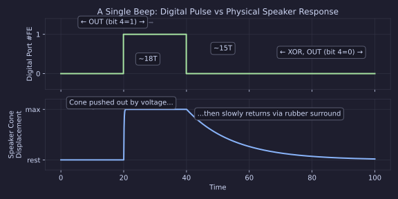
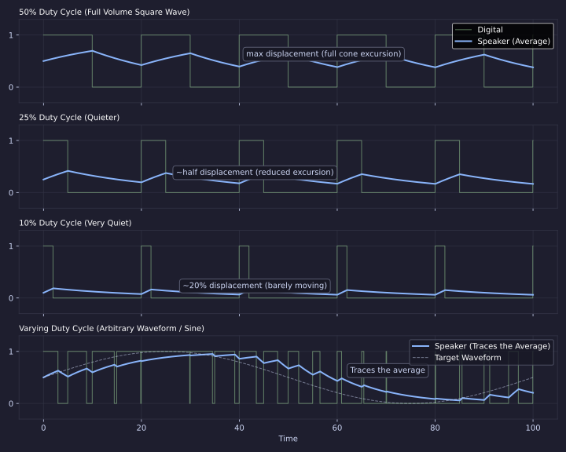
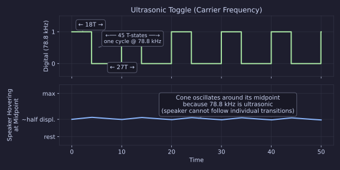
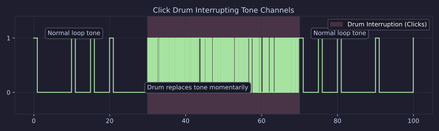
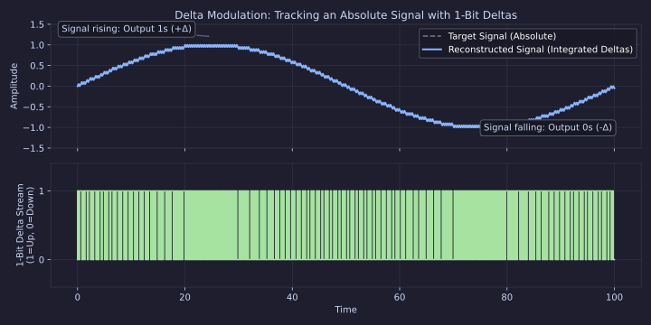
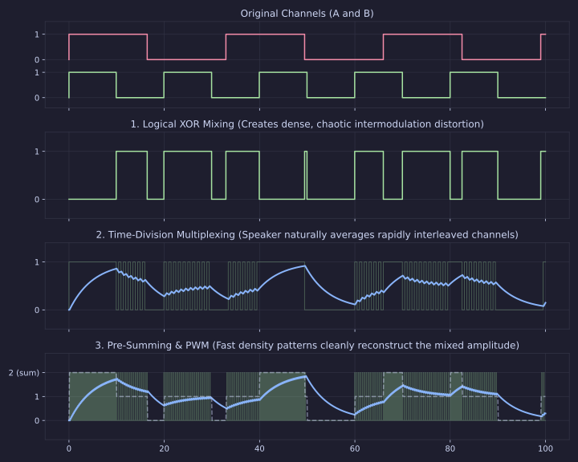
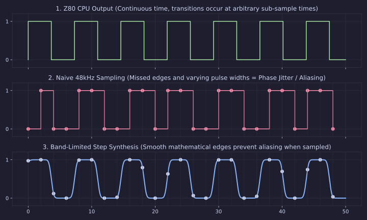

[← Home](../../README.md) · [Sound](../README.md) · [Synthesis](README.md)

# 1-Bit Beeper Synthesis — From ROM Beep to Multi-Channel Polyphony on a Single Output Pin

> **Applies to**: ZX Spectrum 16K/48K (all issues), ZX81 (similar 1-bit principle), and all clones without an AY chip. The techniques described here influenced PC speaker music, Atari 2600 sound, and the entire 1-bit music demoscene.

---

## Why This Article Exists

When Sinclair Research launched the ZX Spectrum in April 1982, it was designed to one overriding constraint: **cost**. The machine had to retail for **£125** (16K) or **£175** (48K) — roughly half the price of the competing BBC Micro Model B (£399) and significantly cheaper than the Commodore 64 (£299). Every component decision was a compromise. There was no hardware sprite engine, no smooth-scroll hardware, a single video color attribute per 8×8 pixel block (color clash), and — critically — **no dedicated sound chip**.

The Commodore 64 had the SID (6581) with three programmable voices, a resonant filter, and envelope generators. The MSX standard mandated the AY-3-8910 with three square-wave channels. Even the Atari 2600 (1977) had the TIA with two oscillators. The ZX Spectrum? A single bit on the ULA's output port, wired to a 22mm speaker through a one-transistor amplifier. The AY-3-8912 PSG would not arrive until the **128K model in 1986** — four years later.

The cost saving was significant. The AY-3-8910/8912 cost approximately **£10–15 per unit** in 1982 quantities — nearly 10% of the Spectrum's retail price. Sinclair's bet was that beeper sound would be "good enough" for a budget home computer, the same philosophy that accepted color clash and no hardware sprites. The target market was families and hobbyists upgrading from the ZX81, not the BBC Micro's educational buyers.

| Platform | Sound Chip | Channels | Launch Price | Launch Year |
|----------|-----------|----------|-------------|-------------|
| ZX Spectrum 48K | **None (1-bit beeper)** | 1 (software) | £125–175 | 1982 |
| Commodore 64 | SID 6581 | 3 + filters | £299 | 1982 |
| BBC Micro Model B | SN76489 | 3 tone + 1 noise | £399 | 1981 |
| MSX | AY-3-8910 | 3 tone + noise | ~£300 | 1983 |
| Atari 800 | POKEY | 4 voices | ~£500 | 1979 |

By any rational assessment, this hardware should produce nothing but crude beeps. And for the first year, that is exactly what it did. Then, between **1983 and 1986**, a handful of programmers discovered that the 1-bit constraint was not a wall but a puzzle. By exploiting the Z80's cycle-exact timing, the physical inertia of the speaker cone, and the mathematical properties of pulse-width modulation, they coaxed **multi-channel music, polyphonic synthesis, sampled drums, and even speech** from a single wire.

This article documents the hardware, the techniques, the engines, and the art of 1-bit sound on the ZX Spectrum — from Matthew Smith's two-channel impulse trains in *Manic Miner* (1983) through Tim Follin's five-channel polyphony in *Agent X* (1986) to the modern beeper demoscene that is still active today.

---

## The Hardware: One Pin, One Speaker

### ULA Port #FE — The Beeper

The ZX Spectrum's beeper is controlled by bit 4 of the ULA port `#FE`. Writing a `1` to this bit drives the speaker; writing a `0` releases it. The signal path:

```
Z80 → ULA (port #FE, bit 4) → 1-transistor amplifier → 22mm speaker (40Ω)
                                  ↓
                              EAR/MIC socket → external tape recorder / amplifier
```

```z80
; Turn beeper ON
LD   A,#10              ; Bit 4 set
OUT  (#FE),A

; Turn beeper OFF
XOR  A                  ; All bits clear
OUT  (#FE),A
```

**What this produces** — a single pulse and the speaker's physical response:



A single pulse produces a **click** — the cone jumps forward and snaps back. This is the atomic unit of all beeper sound. Everything from *Manic Miner* to *Ear Shaver* is built from sequences of these clicks at varying densities.

> [!WARNING]
> **Other bits of port #FE matter**: Bit 3 controls the MIC output (tape recorder), bits 0–2 set the border color. If you only want sound without changing the border, use `OR`/`AND` to preserve bits 0–2: `LD A,(BORDER_COLOR) ; OR #10 ; OUT (#FE),A`.

### Electromechanical Low-Pass Filtering

The key to 1-bit synthesis is that the resulting sound is not purely the raw digital square wave, but rather the result of an **electromechanical low-pass filter** chain. This filtering occurs in two main stages:

1. **Electrical Inductance & RC Filters:** Before the signal even reaches the speaker cone, it passes through the real-world PCB traces, coupling capacitors, and internal cabling. Crucially, the speaker's voice coil has high electrical inductance, which actively opposes rapid changes in alternating current, electrically low-pass filtering the harsh high-frequency square edges.
2. **Physical Speaker Inertia:** The speaker itself is a physical object—a paper cone with mass, suspended by a rubber surround. It cannot move instantaneously. When the filtered voltage finally drives the coil, the cone takes a finite time to reach maximum displacement, and time to return to rest.

Together, this electrical inductance and physical inertia mean the hardware **averages** the rapid on/off transitions. If you toggle the bit rapidly between 1 and 0 at a 50% duty cycle, the cone hovers at approximately half its maximum displacement. If you toggle it at a 25% duty cycle (on for 1 tick, off for 3), the cone moves to about a quarter of its range.

This is **pulse-width modulation (PWM)** — the foundation of all 1-bit synthesis. By varying the duty cycle over time, you can make the speaker trace any waveform:



A sine wave, a complex polyphonic mix, even sampled speech — all can be represented as a sequence of 1-bit pulses with varying widths.

### The Timing Constraint

Every operation that toggles the beeper costs **T-states** (Z80 clock cycles). The Z80 in the ZX Spectrum runs at 3.54690 MHz. The most basic beeper toggle looks like this:

```z80
; Minimum toggle loop — 16 T-states per cycle
LOOP: LD   A,#10         ; 7 T-states
      OUT  (#FE),A       ; 11 T-states
      XOR  A             ; 4 T-states
      OUT  (#FE),A       ; 11 T-states
      JR   LOOP          ; 12 T-states
      ; Total: 45 T-states → ~78.8 kHz toggle frequency
```

**What this produces** — a square wave at the maximum possible frequency:



At **78.8 kHz** the speaker cone cannot follow individual transitions — it hovers at approximately half displacement, producing no audible tone (ultrasonic). This is why a raw toggle loop is silent to human ears. But this ultrasonic carrier is the basis for PWM sample playback (see [Drum Synthesis](#drum-synthesis-on-the-beeper) and [Sample Playback](#sample-playback-on-the-beeper)).

To produce a *musical* note, you need to hold the bit in each state for longer, which means the loop must be longer. The longer the loop, the lower the note:

```
T-states per full cycle (on + off) → frequency

45   → 78,820 Hz (ultrasonic carrier)
100  → 35,469 Hz (ultrasonic)
200  → 17,735 Hz (highest audible)
400  → 8,867 Hz  (A5)
800  → 4,434 Hz  (A4, concert pitch)
1600 → 2,217 Hz  (A3)
3200 → 1,108 Hz  (C#5
6400 → 554 Hz   (C#5)
```

### Contended Memory Timing

On the 48K Spectrum, port `#FE` writes during screen display are subject to **ULA contention** — the ULA steals CPU cycles to read video memory, adding 1–6 T-states to each memory access. This makes timing unpredictable during scanlines 64–255 (the visible screen area).

For cycle-exact beeper music, code must either:
1. **Run during the border/vblank period** (scanlines 0–63 and 256–311) — ~57% of frame time
2. **Account for contention** in timing calculations (adds complexity)
3. **Accept timing imprecision** (some engines do this, with audible distortion artifacts)

> [!IMPORTANT]
> **The Pentagon has no ULA contention.** Soviet clones with clean timing are preferred by some beeper musicians for this reason. However, most classic beeper music was written for the original 48K with contention, and engines designed to work with contention can sound wrong on contention-free hardware.

---

## The ROM BEEP Command — The Starting Point

The ZX Spectrum ROM provides a `BEEP` command in BASIC that produces single-channel tones. Internally, it uses a carefully timed loop to toggle port `#FE` bit 4:

```
BEEP duration, pitch
```

Where `pitch` is in semitones from middle C (0 = middle C ≈ 261.6 Hz). The ROM driver is entirely CPU-bound — while `BEEP` is executing, the processor cannot do anything else. The timing is managed through a pair of counters: one for pitch (determines on/off period), one for duration (determines how long the note plays).

The ROM driver produces a **pure square wave** — always 50% duty cycle, no volume control, no timbral variation. It is the simplest possible sound the hardware can produce. And yet, even within this limitation, early game musicians found creative approaches.

### Implied Polyphony — The First Trick

Before multi-channel engines existed, composers created the **illusion** of multiple voices through rapid alternation. The technique is as old as music itself — a pianist's left hand plays bass while the right hand plays melody, and the listener perceives two independent lines.

On the beeper, this meant alternating between a bass note and a melody note so rapidly that the ear could not separate them:

```
Note: BASS MELODY BASS MELODY BASS MELODY
Freq: 110Hz 440Hz 110Hz 440Hz 110Hz 440Hz
       └─── one fast toggle cycle ────┘
```

**Key examples:**

| Game | Year | Composer | Technique |
|------|------|----------|-----------|
| *Invaders* (Artic) | 1982 | W. Wray | Impulse train synthesis — near-continuous in-game sound |
| *Manic Miner* | 1983 | Matthew Smith | Two near-coincident impulse trains creating pseudo-harmonic series |
| *Jet Set Willy* | 1984 | Matthew Smith | Broken-octave arpeggiation suggesting bass + melody |
| *Fahrenheit 3000* | 1984 | Peter Jones | Bach's Toccata with implied pedal point |
| *Krakout* | 1987 | Ben Daglish | Rapid alternation of bass, chords, and melody |

> [!NOTE]
> **Ben Daglish on implied polyphony**: *"Half the point of writing some of the music that I did, writing it on a computer, was that it meant that I could use notes that were never actually meant to be played by human beings. I could do really fast runs, scales and arpeggios."*

### Matthew Smith's Impulse Train Innovation

*Manic Miner* (1983) represents a breakthrough. Matthew Smith did not simply toggle the beeper between two square waves. Instead, he used **impulse trains** — sequences of single 1-bit pulses separated by calculated gaps.

An impulse (single 1 followed by zeros) contains **all frequencies at equal magnitude** — its Fourier transform is flat. By spacing impulses at regular intervals, you create a pitched tone whose harmonic spectrum is uniform. Smith encoded each beat as three data bytes: a duration and two pitch values. The two pitches are counter values used in divide-down synthesis, producing two near-coincident impulse trains.

The result: a spectral plot showing a **pseudo-harmonic series**. The two trains are close enough in frequency that the ear fuses them into a single rich tone, but with enough complexity to suggest two-voice polyphony. This was the first documented use of micro-level polyphonic synthesis on the Spectrum beeper.

---

## Pulse-Width Modulation — The Core Technique

### How PWM Creates Sound from One Bit

All advanced beeper synthesis ultimately relies on PWM. The principle:

1. **At each time step** (determined by the Z80 instruction cycle), decide whether the output is 0 or 1
2. **The sequence of 0s and 1s** forms a pulse train
3. **The duty cycle** (ratio of on-time to off-time within each period) determines the average voltage the speaker sees
4. **By varying the duty cycle over time**, you trace an arbitrary waveform

*(See the "Varying duty cycle" illustration above for a visual representation of how PWM pulse widths relate to the target sine wave.)*

### Two Families of PWM Techniques

There are two fundamentally different approaches to implementing PWM on the beeper, and they define the two families of beeper engines:

| Technique | Principle | Channels | Sound Character | Examples |
|-----------|-----------|----------|-----------------|----------|
| **Pulse Interleaving** | Interleave fixed-width pulses from multiple channels at different rates | 2–5 | Clean tones, harsh harmonics | Follin, QChan, Phaser |
| **Pin Pulse / PFM** | Use single-bit pulses at variable density to approximate waveforms | 4–9+ | Smoother, more "analog" | Octode, Squat, Squeeker |

**Pulse Interleaving** assigns each channel a fixed on-duration within the loop. The channels' periods determine when each gets its turn. This produces narrow pulse waves — harmonically rich, buzzy, but with a clear sense of multiple voices.

**Pin Pulse / Pulse Frequency Modulation (PFM)** generates extremely narrow pulses (single T-state) at varying repetition rates. Because each pulse is an impulse containing all frequencies, the technique produces a smoother, fuller tone — closer to what a real DAC would produce, but with characteristic distortion artifacts.

### The Channel vs. Fidelity Tradeoff

More channels means less CPU time per channel, which means:

- **Lower maximum frequency** per channel (longer loops needed for the same note)
- **More aliasing/distortion** (coarser pulse timing)
- **Lower effective sample rate** for the overall mix

Tim Follin pushed this to 5 channels in *Agent X* (1986), which he acknowledged sounded very lo-fi: *"It's hard to actually hear [the music in Agent X], I think I'd pushed the processor too far actually!"*

The modern demoscene has reached 8+ channels (Octode, Eightsine) through extreme optimization, but at the cost of significant distortion. The sweet spot for listenable beeper music is typically 2–4 channels.

---

## The Follin Revolution — Multi-Channel Pulse Interleaving (1985–1987)

### Tim Follin's Engine Architecture

Tim Follin is the towering figure of ZX Spectrum beeper music. His soundtracks for *Subterranean Stryker*, *Star Firebirds*, *Vectron* (all 1985), and especially *Agent X* / *Agent X II* (1986–1987) demonstrated multi-channel polyphony that seemed physically impossible from a single output pin.

Follin's engine uses **prioritized register counting**. Five Z80 registers are loaded with predetermined countdown values. On each loop iteration, each register decrements. When a register hits zero, it generates a pulse on the beeper output and reloads. The width of each pulse (determined by how many T-states the register "owns") determines the speaker's average displacement for that channel.

```
Loop iteration:
  ┌─ decrement Ch1 counter → if zero: pulse + reload
  ├─ decrement Ch2 counter → if zero: pulse + reload
  ├─ decrement Ch3 counter → if zero: pulse + reload
  ├─ decrement Ch4 counter → if zero: pulse + reload
  └─ decrement Ch5 counter → if zero: pulse + reload
```

The constantly shifting pulse widths affect both perceived level and timbre, creating the characteristic "fuzzy" sound of Follin's engine. The tradeoff is that as channels are added, each gets less CPU time per loop, degrading fidelity.

### Follin's Published Routine

In 1987, Follin published his 3-channel beeper routine as a hexadecimal type-in listing in *Your Sinclair* magazine, making it freely available for non-commercial use. The entire routine including note data weighed in at just over **1K**. The article noted he was working on a 6-channel version with chorus, bass, echo, portamento, and full ADSR envelope shaping — features that appeared in his later commercial work.

### Notable Follin Soundtracks

| Game | Year | Channels | Notable Feature |
|------|------|----------|----------------|
| *Subterranean Stryker* | 1985 | 3 | First 3-channel beeper music |
| *Star Firebirds* | 1985 | 3 | Melodic lead + bass + rhythm |
| *Vectron* | 1985 | 3 | Atmospheric, evolving textures |
| *Agent X* | 1986 | 5 | Pushed beeper to the limit; very lo-fi |
| *Agent X II* | 1987 | 5 | Refined 5-channel engine, clearer sound |
| *Chronos* | 1987 | 3-5 | Dark, moody atmosphere |
| *Black Lamp* | 1988 | 3 | Later work with cleaner technique |

### The "Special FX" / SFX Engine

The SFX engine (also known as the **Follin-like** engine) became a template for subsequent beeper musicians. Modern implementations (such as the one in Furnace Tracker) provide 6 channels of narrow pulse wave with click drums. The key characteristics:

- **Narrow pulse waves** (1–3 T-states on, rest off) — creates buzzy, harmonically rich tone
- **Channel prioritization** — channels are serviced sequentially; higher-numbered channels get less accurate timing
- **Click drums** — percussion created by rapidly toggling the output at random intervals

### QChan — The Follin-Inspired Engine by Shiru

Shiru's **QChan** engine is a modern recreation of the Follin technique. As described by DF Design (who used QChan extensively in the *Raw Spectronica* album): *"the QCHAN beeper engine by Shiru which is similar to the engine used by Tim Follin in the 1980s but is also quite thin so the volume and BASS should be turned up for these."*

QChan features:
- **5 channels** of pulse-interleaved tone
- **Volume control** via variable pulse width per channel
- **Built-in drum effects** via click synthesis
- Compact code size (~300 bytes)

### Phaser Engines (Shiru)

The **Phaser** family (Phaser 1, Phaser 3) by Shiru extends the pulse-interleaving concept:

- **Phaser 1**: 3-channel engine with per-channel volume and frequency control
- **Phaser 3**: Enhanced version with better volume resolution and click drum support

Both Phaser engines were used by DF Design in *Raw Spectronica* (2023), demonstrating that the Follin tradition continues to inspire modern beeper musicians.

---

## The Huby Engine

**Huby** is one of the most widely used beeper engines, known for its simplicity and clean sound. It uses **pulse interleaving** with 2 channels of tone plus optional click drums.

| Feature | Huby |
|---------|------|
| Channels | 2 tone + drums |
| Technique | Pulse interleaving |
| Sound character | Clean, distinct two-voice polyphony |
| Code size | Very small (~200 bytes) |
| Tracker support | Beepola, 1tracker |

Huby's simplicity made it the engine of choice for beginners entering the beeper music scene. Its clean, predictable sound also makes it a good reference for understanding pulse interleaving without the complexity of higher-channel engines.

### Huby-Style Loop Architecture

```z80
; Simplified Huby-style 2-channel beeper loop
; Each channel has a counter that determines pulse spacing
;
; Channel A: counter_a → determines pulse frequency
; Channel B: counter_b → determines pulse frequency
; Drums:     counter_d → triggers click drum events

HUBY_LOOP:
        ; --- Service Channel A ---
        DEC  C                 ; Decrement channel A counter
        JR   NZ,skip_a         ; Not zero yet? Skip pulse
        LD   C,(HL)            ; Reload counter from note data
        LD   A,#10             ; Beeper ON bit
        OUT  (#FE),A           ; Pulse!
        ; (The pulse width is determined by the delay until beeper OFF)
SKIP_A:
        ; --- Service Channel B ---
        DEC  B                 ; Decrement channel B counter
        JR   NZ,skip_b
        LD   B,(DE)            ; Reload counter from note data
        LD   A,#10
        OUT  (#FE),A           ; Pulse!
SKIP_B:
        ; --- Turn beeper OFF ---
        XOR  A
        OUT  (#FE),A

        ; --- Check for drum click ---
        ; ... drum logic ...

        JR   HUBY_LOOP
```

---

## The Modern Beeper Renaissance — Shiru, utz, and the 1-Bit Demoscene (2007–Present)

After the commercial era ended (1992), beeper music entered a new phase. The constraint that commercial developers had fought against became an **aesthetic choice** for a new generation of demoscene musicians. The challenge was no longer "how do I make this acceptable" but "how far can I push this?"

Two figures dominate this era: **Shiru** (the prolific Russian programmer and musician behind dozens of engines and tools) and **utz** (alias of the irrlicht project, a German developer who pushed 1-bit synthesis to new technical extremes).

### Shiru's Beeper Engine Family

Shiru (also known as Shiru8bit) created an extraordinary body of work documenting, preserving, and extending ZX Spectrum beeper music. His website [shiru.untergrund.net/1bit/](https://shiru.untergrund.net/1bit/) serves as the central hub for the 1-bit music community.

#### Tritone (Shiru, 2008)

**Tritone** is one of the most popular beeper engines ever created. It provides:

- **3 channels** of tone using pulse interleaving
- **Click drums** (interrupting drum patterns)
- **Compact format** — music data is very small
- **High speed** — runs faster than most earlier engines, enabling complex arrangements

Tritone's clean, punchy sound made it a favorite for the emerging beeper music competition scene. Many composers pushed Tritone to extremely high speed levels to achieve advanced sound effects — a practice that utz criticized as leading to "an awfully muddy sound."

#### Tritone FX (utz, 2015)

utz's **Tritone FX** is an enhanced clone that adds built-in sound effects capabilities:

> *"In recent years, there has been a tendency to use Tritone at very high speed levels in order to pull off advanced sound effects. Frankly I was never a very big fan of this, as I think it leads to an awfully muddy sound. So I've drawn up a concept that should render the need for this high speed trickery obsolete."* — utz, irrlicht project

Tritone FX adds dedicated FX channels and parameters, so composers don't need to abuse tempo to achieve effects.

#### Octode (utz, 2009–2011)

**Octode** is utz's flagship engine — a technical marvel that achieves **up to 8 channels** on the beeper:

| Feature | Octode |
|---------|--------|
| Channels | Up to 8 (4 tone + 4 percussion/sample) |
| Technique | Pin pulse / PFM with software mixing |
| Sound character | Dense, distorted, but remarkably full |
| CPU usage | ~99% — the Z80 does almost nothing else |
| Speed | Very fast update rate for smooth mixing |

Octode works by generating extremely narrow single-T-state pulses at a density that approximates the mixed output of all 8 channels. The mixing is done in software — each channel contributes a delta value that adjusts the pulse density. The result is a remarkably full sound for a 1-bit output, though with significant distortion artifacts at the high end.

#### Earshaver (Shiru, 2023)

**Earshaver** is Shiru's masterwork — a full-length beeper music album released in April 2023 and available on [Bandcamp](https://shiru8bit.bandcamp.com/album/ear-shaver). It showcases the full expressive range of the beeper:

- Multiple engine types used across tracks
- Complex multi-channel arrangements
- Clean production values despite 1-bit constraint
- Entered in the **DiHalt 2023** ZX Spectrum beeper music competition

Earshaver demonstrates how far the beeper has come from the ROM `BEEP` command. The album features rich polyphonic textures, percussion, and melodic complexity that rival what AY-chip music achieved — all from a single output pin.

> [!TIP]
> **Listening recommendation**: Earshaver is available as a [YouTube playlist](https://www.youtube.com/watch?v=9iLnvwek3CI) with the full album. It is the best single demonstration of what the ZX Spectrum beeper can achieve.

#### Other Shiru Engines

| Engine | Channels | Technique | Notes |
|--------|----------|-----------|-------|
| **Squat** | 3-4 | PFM | Designed for aggressive, distorted sound |
| **Squeeker** | 3-4 | PFM variant | Higher fidelity than Squat |
| **Sensible Beep** | 2-3 | Pulse interleaving | Clean, simple, beginner-friendly |
| **BeepFX** | N/A | Sound effects | Dedicated SFX engine, not music |
| **1tracker** | — | Meta-tool | Cross-engine tracker supporting 50+ beeper engines |

**1tracker** is particularly significant — it is an **universal cross-tracker** that supports 50+ different beeper music engines, giving composers a unified interface to the entire ecosystem. This tool dramatically lowered the barrier to entry for new beeper musicians.

### utz / Irrlicht Project — Technical Innovation

utz (the irrlicht project) has been the primary driver of technical innovation in beeper synthesis since 2009. Key contributions:

#### Fluidcore (2016)

**Fluidcore** represents a different approach entirely — **PCM wavetable synthesis** on the beeper:

> *"Fluidcore mixes 4 channels with a total of 17 volume levels, mixed at an incredible 23 KHz. The engine can also handle overdrive."* — utz

Instead of generating tones from pulse patterns, Fluidcore stores short looped wavetable samples and mixes them in software, outputting the mixed result as PWM. This achieves 4 channels of sampled instruments at 23 kHz — an astonishing feat for a 1-bit output.

| Feature | Fluidcore |
|---------|-----------|
| Channels | 4 |
| Volume levels | 17 (mixed) |
| Sample rate | ~23 kHz |
| Technique | PCM wavetable via PWM |
| Distortion | Low (best-in-class for beeper) |

#### Eightsine

**Eightsine** pushes the channel count to 8 using advanced PFM techniques. The name refers to its 8 sine-wave channels — each channel approximates a sine wave through pulse-density modulation. This produces a smoother, more "musical" sound than the buzzy pulse-interleaving engines.

#### wtfx and qaop

- **wtfx**: A precursor to Fluidcore, exploring PCM wavetable concepts
- **qaop**: A player focused on sample playback with overdrive/distortion effects

#### Recent Engines (2022–2024)

utz's most recent work includes:

| Engine | Year | Description |
|--------|------|-------------|
| **nanobeep3** | 2022 | Smallest beeper engine (beat own record after 7 years) |
| **Pindsvin** | 2022 | Squeeker + PFM hybrid |
| **Pulsatilla** | 2022 | Squeeker + pulse interleaving hybrid |
| **tftone** | 2022 | Tritone port with no row transition noise, 4× speed |
| **Fluidcore v2** | 2023 | Fixed row transition bugs, added compression |
| **QuadTone hw** | 2024 | Hardware player for Furnace Tracker's QuadTone engine |

### The Competition Scene

Beeper music competitions are held at major demoscene parties:

| Event | Category | Notable Winners |
|-------|----------|-----------------|
| **DiHalt** (Russia) | ZX Spectrum Beeper | Shiru "Noise In My Head" (2023, 3rd), utz "Squat shredding" (2023, 1st) |
| **Revision** (Germany) | Oldskool Music | h0ffman "1-Bit High and Rising" (2023, 1st) |
| **Chaos Constructions** (Russia) | ZX Music | utz (multiple entries) |
| **ZXart.ee** | Online voting | Annual beeper music rankings |

The active competition scene ensures that new engines and techniques continue to emerge. As utz noted: *"I published four new beeper engines, and discarded another half a dozen designs in the process."*

### Furnace Tracker Support

[Furnace Tracker](https://tildearrow.org/furnace/) — the modern open-source chiptune tracker — supports two beeper engines:

1. **Follin/SFX-like**: 6 channels of narrow pulse wave + click drums
2. **QuadTone**: 4 channels of PWM-driven pulse wave with freely variable duty cycles + 1-bit PCM drums

Furnace's effect commands for beeper:
- `12xx`: Set pulse width (xx = width value)
- `17xx`: Trigger overlay drum (xx = sample number)
- Overlay drums are 1-bit, always play at 55930 Hz (NTSC) or 55420 Hz (PAL)
- Maximum drum sample length: 2048

---

## Drum Synthesis on the Beeper

Percussion is one of the hardest problems in 1-bit synthesis. A drum hit is a transient — a burst of broadband noise with a sharp attack and fast decay. Generating this from a single bit requires ingenuity.

### Click Drums (Interrupting Technique)

The simplest and most common beeper drum technique is the **click drum**. Instead of generating noise during the music loop, the engine **interrupts** the tone channels for a brief moment to produce a click:



The click itself is a sequence of rapid on/off toggles at pseudo-random intervals. The duration and density of the click determine the drum type:

| Drum Type | Click Duration | Toggle Pattern | Character |
|-----------|---------------|----------------|-----------|
| Bass drum | Long (20–40 toggles) | Slow decay in toggle rate | Thud |
| Snare drum | Medium (15–25 toggles) | Fast pseudo-random | Snap/crackle |
| Hi-hat | Short (5–10 toggles) | Very fast, sparse | Tss |
| Crash | Very long (40+ toggles) | Dense, sustained | Wash |

The downside of click drums is that they **interrupt the tone channels**. While the drum plays, no melodic sound is produced. This creates a characteristic "gating" effect — the music momentarily cuts out during each drum hit. Many engines minimize this by making the clicks very short (a few T-states), trading fidelity for continuity.

### Overlay Drums (Non-Interrupting)

More advanced engines use **overlay drums** — percussion that plays simultaneously with the tone channels. Furnace Tracker's beeper implementation supports this:

- Overlay drums are **1-bit PCM samples**
- They play at a fixed high rate: 55930 Hz (NTSC) or 55420 Hz (PAL)
- Maximum length: 2048 samples (~37 ms at PAL rate)
- They overlay onto the PWM output without interrupting tone channels

Overlay drums require the engine to interleave drum sample bits with the tone channel updates within the same loop iteration. This increases loop complexity and reduces available time per tone channel.

### Pseudo-Random Noise Generation

For noise-based drums, the engine needs a source of pseudo-randomness. The most common method is a **Linear Feedback Shift Register (LFSR)**, similar to the AY chip's noise generator but implemented in software:

```z80
; 8-bit LFSR for pseudo-random beeper noise
; Taps at bits 3 and 7 (maximal-length polynomial)
LFSR_NOISE:
        LD   A,(SEED)           ; Get current LFSR value
        SRL  A                  ; Shift right
        JR   NC,no_xor          ; If shifted-out bit was 0, skip
        XOR  #88                ; XOR with tap polynomial
NO_XOR: LD   (SEED),A           ; Store new LFSR value
        AND  #10                ; Mask to beeper bit
        OUT  (#FE),A            ; Output noise sample
        RET
```

The LFSR generates a pseudo-random sequence of 0s and 1s that, when output rapidly, creates white noise. By varying the speed of the LFSR updates, the engine can shift between white-noise hiss and lower-pitched rumble.

---

## Sample Playback on the Beeper

### 1-Bit PCM Playback

The beeper can play digitized samples using the same PWM principle that underlies all synthesis. A digitized audio sample is a sequence of amplitude values; to play it on the beeper, each sample value is converted to a pulse-width pattern:

```
Sample value 15 (max):   ████████████  (wide pulse)
Sample value 8 (mid):    ██████──────  (medium pulse)
Sample value 1 (min):    █───────────  (narrow pulse)
Sample value 0 (silence): ────────────  (no pulse)
```

The faster the sample rate, the better the quality — but the Z80's instruction cycle time limits how fast samples can be output. A tight sample playback loop on the ZX Spectrum achieves approximately **6–10 kHz**.

### Speech Synthesis

Several commercial Spectrum games featured speech using 1-bit sample playback:

| Game | Year | Technique | Quality |
|------|------|-----------|---------|
| *Fantasy World Dizzy* | 1987 | 4-bit PWM samples | Remarkably clear |
| *Ghostbusters* | 1984 | Very low rate samples | Barely intelligible |
| *Alchemist* | 1983 | Formant synthesis | Robotic but recognizable |

The *Dizzy* series is particularly notable — its speech playback was clear enough to be memorable, and many players recall it sounding better on real hardware than on emulators (due to the speaker's natural filtering of high-frequency artifacts).

### The Delta-Modulation Approach

An alternative to absolute sample values is **delta modulation** — storing only the *direction of change* (up or down) from the previous sample. This reduces data size at the cost of needing continuous updates:



Delta modulation can be encoded as a stream of bits: 1 = "output a pulse" (level up), 0 = "no pulse" (level down through inertia). This is extremely compact — one bit per sample — but requires careful tuning of the pulse rate to match the expected waveform dynamics.

---

## Polyphony and 1-Bit Mixing

A single square wave is easy to generate, but complex, multi-instrument music presents a massive mathematical challenge: how do you mix three or four independent waveforms when you only have a single binary output pin (0 or 1)? If Channel A wants to output a `1` and Channel B wants to output a `0`, what is the actual output?

Over the decades, engine developers have solved this problem in three primary ways, each with distinct sonic characteristics and distortion profiles:



### 1. Logical Mixing (AND, OR, XOR)
The earliest and most CPU-efficient method is to apply bitwise logic to the current state of the independent channels.
- **OR Mixing:** If either channel is high, output `1`. This causes severe phase cancellation; if one channel is playing a wide pulse, it literally "drowns out" the other channels by pinning the speaker high.
- **XOR Mixing:** Output `1` only if the channels are different. This was famously used by legends like Tim Follin. Mathematically, XORing two square waves acts as a **1-bit Ring Modulator**. It preserves both frequencies but introduces intense, metallic **Intermodulation Distortion (IMD)**, generating sum and difference frequencies that make the music sound incredibly gritty and aggressive.

```z80
; Simplified 2-Channel XOR Mixing Engine
mixer_loop:
        ; --- Channel 1 ---
        DEC HL             ; Decrement Ch1 frequency counter
        LD A, H
        OR L
        JR NZ, update_ch2  ; If not zero, skip to Ch2
        
        LD HL, (pitch1)    ; Reset Ch1 counter
        LD A, (bit_state)  
        XOR #10            ; Toggle bit 4 (XOR logic)
        LD (bit_state), A  ; Save mixed state

update_ch2:
        ; --- Channel 2 ---
        DEC DE             ; Decrement Ch2 frequency counter
        LD A, D
        OR E
        JR NZ, output      ; If not zero, skip to output
        
        LD DE, (pitch2)    ; Reset Ch2 counter
        LD A, (bit_state)
        XOR #10            ; Toggle bit 4 again (XOR logic)
        LD (bit_state), A  ; Save mixed state

output:
        LD A, (bit_state)
        OUT (#FE), A       ; Output the logically XOR-mixed bit
        JR mixer_loop
```

### 2. Time-Division Multiplexing (Interleaving)
Instead of mixing the bits mathematically, the engine simply switches focus so fast that the human ear (and speaker inertia) cannot tell.
- **The Technique:** The engine rapidly loops: `Output Ch A -> Wait -> Output Ch B -> Wait -> Output Ch C`. 
- **The Result:** The physical mass of the speaker cone cannot snap back and forth between the distinct channel outputs fast enough, so it naturally **averages** their positions in physical space.
- **Pros/Cons:** This drastically reduces the nasty digital distortion of XOR mixing, producing much cleaner, distinct notes. However, because each channel only gets a fraction of the speaker's time, the overall volume of the music drops as more channels are added.

```z80
; Interleaved Mixing Loop (2 Channels)
; Focus switches rapidly between channels, relying on 
; physical speaker inertia to average the sound.
interleave_loop:
        ; --- Service Channel 1 ---
        LD A, (ch1_state)
        OUT (#FE), A       ; Drive speaker for Ch1
        CALL update_ch1    ; Dec counter, toggle state if zero

        ; --- Service Channel 2 ---
        LD A, (ch2_state)
        OUT (#FE), A       ; Drive speaker for Ch2
        CALL update_ch2    ; Dec counter, toggle state if zero
        
        JR interleave_loop
```

### 3. Pre-Summing and PWM (Software DAC)
The most modern, advanced engines (like *Octode* or *Squeeker*) achieve incredibly clean, distortion-free mixing by turning the 1-bit pin into a virtual DAC (Digital-to-Analog Converter).
- **The Technique:** The engine calculates the waveforms in memory as multi-bit values. For example, if 4 channels are all outputting a peak, the internal sum is `4`. If two are peaking, the sum is `2`. The engine then reads this mixed amplitude value (0–4) and immediately translates it into an ultrasonic **Pulse-Width Modulation (PWM)** or **Pulse-Density Modulation (PDM)** stream:
  - Amplitude 0 = `0000` (Silence)
  - Amplitude 1 = `1000` (25% Duty)
  - Amplitude 2 = `1010` (50% Duty)
  - Amplitude 4 = `1111` (100% Duty)
- **The Result:** By firing these density patterns at ultrasonic speeds (~80 kHz), the speaker cone hovers at exact intermediate physical positions (0%, 25%, 50%, 100%).
- **Why it matters:** This eliminates digital clipping and logical distortion entirely. The result sounds almost identical to music played through an AY chip or an Amiga DAC. The catch? It requires the Z80 CPU to run the mixing loop at absolute maximum speed, utilizing 100% of the processor and leaving zero cycles for rendering graphics or game logic.

```z80
; Pre-Summing PWM DAC Loop
; The engine calculates the number of active channels (0-4)
; and uses it to index a PWM bit-pattern array.
pwm_loop:
        ; Assume accumulator (A) holds the summed amplitude (0-4)
        ; resulting from checking all four channel counters.
        
        LD HL, PWM_TABLE
        ADD A, L
        LD L, A            ; HL points to the PWM density pattern
        
        LD A, (HL)         ; Fetch PWM pattern (e.g. %10101010)
        OUT (#FE), A       ; Fire density sequence to ULA
        
        ; ... update oscillators and sum again ...
        JR pwm_loop

PWM_TABLE:
        DB %00000000       ; Amplitude 0 (0% duty, silence)
        DB %10001000       ; Amplitude 1 (25% duty, soft)
        DB %10101010       ; Amplitude 2 (50% duty, medium)
        DB %11101110       ; Amplitude 3 (75% duty, loud)
        DB %11111111       ; Amplitude 4 (100% duty, peak)
```

---

## The Physics and DSP of Emulating 1-Bit Sound

While generating 1-bit sound on native hardware is purely a matter of CPU cycle counting, **emulating** that sound on a modern PC is notoriously difficult from a Digital Signal Processing (DSP) perspective. 

### The Nyquist Mismatch and Aliasing
The Z80 CPU in a ZX Spectrum runs at 3.5 MHz. This means the `#FE` port can theoretically change state millions of times per second, and ultrasonic carrier frequencies often operate at ~80 kHz. However, modern PC audio buffers typically run at 44.1 kHz or 48 kHz.

According to the **Nyquist-Shannon sampling theorem**, a 48 kHz audio buffer can only represent frequencies up to 24 kHz. If an emulator naively samples the state of the `#FE` port 48,000 times a second (nearest-neighbor downsampling), any frequency generated by the Spectrum that is *higher* than 24 kHz will "fold back" (alias) into the audible spectrum.
- **The Result:** Instead of hearing a pure tone or silent ultrasonic carrier, the listener hears harsh, metallic, inharmonic ringing. These are **parasitic harmonics**.
- **Phase Jitter:** Because the 3.5 MHz CPU transitions do not align neatly with the 48 kHz sample grid, the edges of the square waves jitter back and forth between audio samples, introducing severe phase distortion and high-frequency noise.

### Band-Limited Synthesis (BLEP)
To solve aliasing, emulators cannot output perfect, instantaneous digital square waves. A mathematically perfect square wave contains infinite odd harmonics.

Instead, modern emulators use **Band-Limited Step (BLEP)** techniques (most famously, `Blip_Buffer` by Shay Green). When the CPU toggles the beeper port, the emulator calculates the exact sub-sample time of the transition. It then injects a pre-calculated, band-limited impulse (a sinc function) into the audio buffer. This reconstructs the square wave but mathematically rolls off all harmonics above 24 kHz *before* they can alias, resulting in a clean, accurate tone.



### Speaker Inertia and Non-Linearities
Even with perfect anti-aliasing, a raw 1-bit signal sent to a modern studio monitor sounds piercingly sharp and grating. This is because we are missing the physical properties of the original hardware:
1. **Mechanical Low-Pass Filtering:** As visualized in the SVG diagrams above, the physical mass of the 48K's internal speaker cone acts as an aggressive RC low-pass filter. It smooths off the harsh edges of the square waves.
2. **Resonance:** The cheap plastic casing of the Sinclair machine adds its own resonant frequencies, boosting certain mids.
3. **Asymmetric Excursion:** The speaker does not push and pull symmetrically; voltage pushes the cone out aggressively, but the rubber surround pulls it back more passively.

To sound "authentic," emulators must pass the anti-aliased square waves through an Infinite Impulse Response (IIR) low-pass filter to simulate the physical speaker inertia, rolling off the harsh high-end and restoring the warm, muffled tone players remember.

---

## Z80 Physical Constraints and the Turbo Era

### The Real-Time Synthesis Imperative (Why Not Pre-Render?)
A common, logical assumption is that 1-bit polyphonic music is simply a pre-rendered audio stream that the Z80 decompresses and outputs to the port. If this were true, the number of musical channels wouldn't affect the playback loop speed.

However, a pre-rendered 1-bit stream at a modest 17.7 kHz requires ~2.2 Kilobytes of RAM per second. A standard 3-minute song would require nearly **400 Kilobytes** of memory. Even with aggressive delta-packing or Lempel-Ziv compression, streaming audio is entirely impossible within the ZX Spectrum's 48K RAM limit.

Therefore, the Z80 cannot just play an audio file; it must act as a **real-time algorithmic synthesizer**. 
During playback, the Z80 simulates physical oscillators using its 16-bit registers:
1. Decrement Channel 1's frequency counter (`DEC HL`).
2. If it hits zero, flip Channel 1's bit state and reset the counter.
3. Decrement Channel 2's frequency counter (`DEC DE`).
4. If it hits zero, flip Channel 2's bit state.
5. Mix the active channel states (via XOR, OR, or mathematical addition).
6. Output the final mixed bit to the ULA port `#FE`.
7. Loop back to step 1.

This is exactly why **the channel count dictates the maximum sample rate**. Every single channel added to the polyphony requires injecting more `DEC`, `JR NZ`, and mixing instructions into that critical inner loop. 

### The 3.5 MHz Hard Limit
While the Z80 CPU in a standard 48K Spectrum runs at 3.54690 MHz, a software synthesis routine doing actual work (calculating LFSR noise, summing 4 channels, updating pointers, and manually flipping the single bit on the ULA) requires dozens or hundreds of T-states per loop. 

Because of this, advanced multi-channel engines rarely achieve the theoretical ~78 kHz maximum carrier frequency. A complex 4-channel PWM engine might only manage a loop of 200 T-states, resulting in an effective sample rate of just **17.7 kHz**. This causes two physical problems:
1. **Carrier Whine:** The PWM carrier frequency drops from ultrasonic into the audible human hearing range, creating a continuous high-pitched whine behind the music.
2. **Frequency Resolution:** Lower sample rates mean fewer discrete frequencies can be accurately hit, causing tuning issues on higher notes.

### The Value of Turbo Machines (7, 14, 28 MHz and ZX Next)
Modern FPGA machines (like the ZX Spectrum Next) and Russian clones (Pentagon 1024SL, ATM Turbo) offer hardware "Turbo Modes" running at 7 MHz, 14 MHz, or 28 MHz. 

Does this benefit 1-bit sound? Yes, but with a massive caveat:
- **The Value (Higher Sample Rates):** If a modern engine is specifically compiled to target 28 MHz, that 17.7 kHz carrier frequency jumps to **141.6 kHz**. This entirely eliminates audible carrier whine, allows for crystal-clear 8-channel PWM mixing without distortion, and provides perfect pitch tuning resolution. The ZX Next community has seen releases of "Next-only" beeper engines that leverage 28 MHz to produce Amiga-quality sample playback through the 1-bit port.
- **The Danger (Cycle-Exact Breakage):** Classic 1-bit engines are purely software-timed. They use fixed loops (like `DJNZ` or arrays of `NOP`s) tuned exactly to 3.54690 MHz. If you run a classic Tim Follin 48K engine on a 28 MHz machine, the music will simply play **8 times faster** and the pitch will be pitched up by 3 octaves. 

Therefore, turbo modes are incredibly valuable for pushing the theoretical limits of 1-bit audio quality, but they absolutely require **turbo-aware engines** written or compiled specifically for those faster clock speeds.

---

## The Aesthetic of Constraint

### Why Beeper Music Matters

> *"It is electronic music in its most fundamental state; it is about simple ideas expressed well."* — Kenneth McAlpine, *The Sound of 1-bit* (2017)

Beeper music occupies a unique position in the chiptune world. Unlike AY/YM music, which has a dedicated sound chip providing three channels and an envelope generator, beeper music is **pure software synthesis**. Every sound — every note, every drum, every texture — is the result of Z80 instructions carefully timed to produce the right sequence of 1s and 0s.

This means beeper music is not just constrained by hardware; it is **defined by software**. The same hardware can produce radically different sounds depending on the engine. A Tritone tune, a QChan tune, and a Fluidcore tune all run on the same 48K Spectrum with the same single-pin output, yet they sound completely different because the synthesis algorithms are different.

This is what makes the beeper a living, evolving platform. Unlike the AY chip, which has a fixed architecture that was fully explored by the mid-1990s, the beeper's potential is limited only by the creativity of Z80 programmers. New engines continue to appear, each finding new ways to extract sound from silence.

---

## Modern Composition Tools and Frameworks

> [!IMPORTANT]
> **Shiru's 1-Bit Software Hub**
> The modern beeper scene is largely driven by tools created by one legendary scener: **Shiru** (`shiru.untergrund.net`). If you are looking to get started, you must visit his software page. It is the definitive archive of 1-bit development tools, including:
> - **[1tracker](https://shiru.untergrund.net/software.shtml):** A modular, cross-platform tracker supporting 30+ 1-bit engines and offering a scripting interface to develop your own custom Z80 synthesis algorithms.
> - **[Beepola](https://shiru.untergrund.net/software.shtml):** The definitive, easy-to-use Windows tracker that bundles classic engines like Phaser and Tritone.
> - **[BeepFX](https://shiru.untergrund.net/software.shtml):** A specialized sound effect generator that compiles purely algorithmic Z80 routines for 1-bit explosions and lasers without needing RAM-heavy samples.
> - **[The 1-Bit Music Portal](https://shiru.untergrund.net/1bit/):** Shiru's massive central hub archiving 1-bit tools, engines, source code, and scene releases.

Because 1-bit music is defined entirely by Z80 assembly algorithms (engines), you cannot simply drop an MP3 or a standard MIDI file onto a ZX Spectrum and expect it to play. Standard audio (like WAV) requires too much memory and CPU to bit-bang directly as PWM. 

Instead, musicians use specialized **trackers** that understand the mathematical constraints of specific beeper engines. These tools compile the musical note data alongside the Z80 assembly engine into a native executable (`.tap` or `.tzx`) that runs on the real hardware.

### 1. [Beepola](http://beepola.inuk.com/)
- **Best for:** Beginners and quick composition.
- **Overview:** A classic, highly accessible Windows-based tracker designed exclusively for ZX Spectrum beeper music. 
- **Workflow:** It comes bundled with several legendary beeper engines (like Phaser, Tritone, Savage, and ROM beep). You compose using a standard tracker interface (patterns and channels), and Beepola handles the complex interleaving required to force those notes through the selected engine. It exports directly to playable Spectrum emulator files or raw Z80 assembly blocks for game developers.

### 2. [1tracker](https://shiru.untergrund.net/software.shtml)
- **Best for:** Advanced composers and experimental engine developers.
- **Overview:** Created by Shiru (a legendary figure in the 1-bit scene), *1tracker* is an experimental, cross-platform tracker.
- **Workflow:** While it has a steeper learning curve than Beepola, it supports a massive library of over 30 different 1-bit engines (for both ZX Spectrum and PC Speaker). Crucially, 1tracker uses a scripting interface that allows advanced users to write and integrate entirely custom Z80 audio engines, mapping their specific parameter requirements to tracker columns.

### 3. [Furnace Tracker](https://tildearrow.org/furnace/)
- **Best for:** Modern workflow, multi-chip compositions.
- **Overview:** Furnace is a massive, modern, open-source chiptune tracker that supports over 50 classic sound chips. 
- **Workflow:** Furnace includes native support for the ZX Spectrum beeper and several of its most popular engines. It features a highly polished modern UI, making it the most comfortable environment for musicians used to tools like DefleMask or FamiTracker. 

### 4. [BeepFX](https://shiru.untergrund.net/software.shtml)
- **Best for:** Game developers needing sound effects.
- **Overview:** Also by Shiru, *BeepFX* is not for music, but rather for generating 1-bit sound effects (explosions, lasers, jumps).
- **Workflow:** It provides a synthesizer-like interface to manipulate frequency sweeps, noise, and duty cycles, then exports the optimized Z80 assembly routine so indie game developers can easily embed high-quality sound effects into their homebrew Spectrum games.

> [!TIP]
> **Can I convert WAV to 1-Bit?** 
> While you technically *can* convert a WAV file to a 1-bit stream using Delta-Sigma modulation or 1-bit dithering (e.g., using SoX), playing back raw 1-bit audio at high frequencies requires the Z80 CPU to do nothing but read memory and toggle the port. Because this eats 100% of the CPU and drains the 48K's limited RAM in seconds, it is almost never used for actual music or games. Trackers remain the standard because they synthesize the audio algorithmically, saving vast amounts of memory.

---

## Cross-References

- [AY/YM PSG Hardware Reference](ay_ym_synthesis.md) — the dedicated sound chip alternative (128K+ models)
- [48K Memory and I/O](../../05_development/03_memory_and_io/memory_and_io_48k.md) — beeper port #FE details
- [Contention Model](../../05_development/03_memory_and_io/contention_model.md) — contended timing on the 48K
- [1-Bit Music Scene](../../07_demoscene/1bit_music_scene.md) — the beeper music community and competitions

---

## Recommended Reading and Open Source References

To drill down further into the algorithms, history, and source code of 1-bit synthesis, the following resources are essential:

### Books and Academia
- **[The Sound of 1-bit: Technical Constraint and Musical Creativity](http://www.gamejournal.it/the-sound-of-1-bit/)** (Kenneth B. McAlpine, 2017) — A foundational ludomusicology paper analyzing how the extreme limitations of the ZX Spectrum forced the creation of granular synthesis and PWM techniques.
- **Bits and Pieces: A History of Chiptunes** (Kenneth B. McAlpine, 2019) — An expanded book-length history covering the mathematical algorithms behind vintage sound synthesis.

### Open Source DSP Libraries (Anti-Aliasing)
- **[Game_Music_Emu (libgme)](https://github.com/libgme/game-music-emu)** — The definitive open-source repository containing Shay Green's legendary `Blip_Buffer.cpp`. Review this C++ code to understand how band-limited impulses (BLEP) are calculated and injected to mathematically prevent Nyquist aliasing.
- **[nesbox/blip-buf](https://github.com/nesbox/blip-buf)** — A streamlined, C-only port of Shay Green's `Blip_Buffer`, highly recommended if you want to integrate band-limited step synthesis into a custom emulator without dragging in massive C++ dependencies.

### Open Source Emulator Implementations
- **[FUSE (Free Unix Spectrum Emulator)](https://sourceforge.net/p/fuse-emulator/fuse/)** — FUSE is widely considered the reference standard for ZX Spectrum emulation. Look inside `sound.c` and `beeper.c` in their source tree to see exactly how port `#FE` state changes are buffered and downsampled into 48kHz audio streams.

---

## References

- [Shiru's 1-bit Music Page](https://shiru.untergrund.net/1bit/) — central hub for beeper engines and tools
- [utz's ZX Spectrum 1-Bit Routines](https://github.com/utz82/ZX-Spectrum-1-Bit-Routines) — engine source code collection
- [Irrlicht Project](https://www.irrlichtproject.de/) — utz's blog and engine releases
- [The Sound of 1-bit](https://www.gamejournal.it/the-sound-of-1-bit-technical-constraint-as-a-driver-for-musical-creativity-on-the-48k-sinclair-zx-spectrum/) — Kenneth McAlpine, 2017 (academic paper on beeper music history)
- [The 1-Bit Instrument](https://online.ucpress.edu/jsmg/article/1/1/44/2337/) — Troise, 2020 (comprehensive 1-bit synthesis theory)
- [How to Write a 1-Bit Music Routine](http://www.vz200.org/bushy/manuals/book%20-%20other%20-%20How%20to%20write%20a%201bit-synth.pdf) — tutorial by utz/irrlicht
- [Furnace Tracker Documentation](https://tildearrow.org/furnace/doc/latest/manual.pdf) — beeper engine support
- [ZX-Art Beeper Top 100](https://zxart.ee/eng/music/top-100/beeper/) — community-voted best beeper music
- [Ear Shaver on Bandcamp](https://shiru8bit.bandcamp.com/album/ear-shaver) — Shiru's beeper album (2023)
- [Raw Spectronica](https://df-design.itch.io/raw-spectronica) — DF Design's beeper album (2023)
- [Pulse Width Modulation and 1-bit Music](http://www.robeesworld.com/blog/58/pulse-width-modulation-how-1-bit-music-works) — accessible introduction to PWM audio
