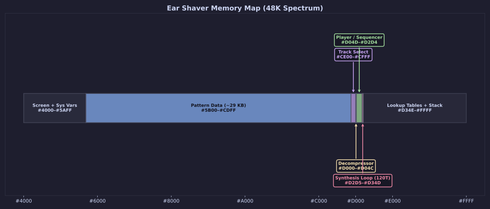
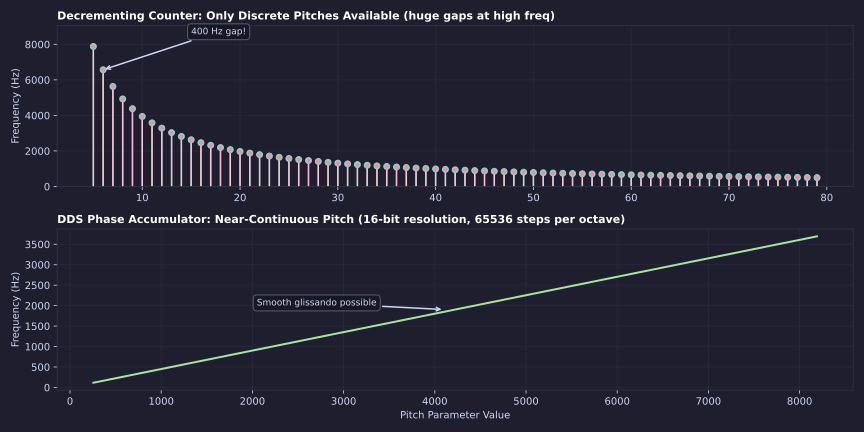
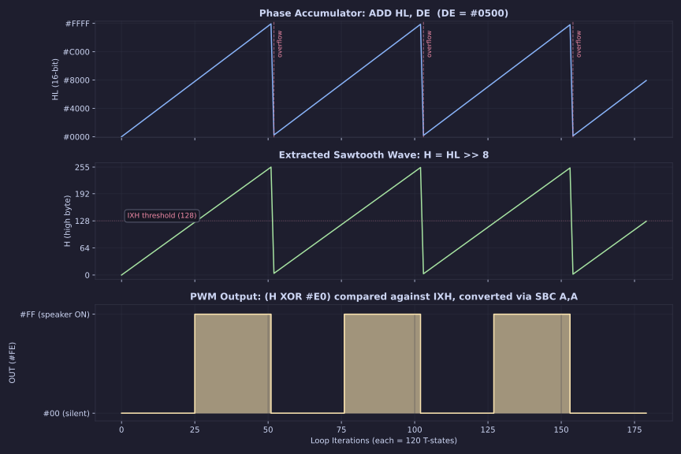
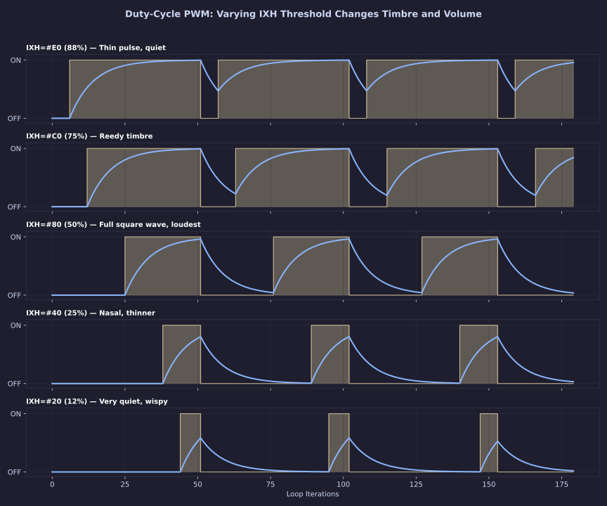
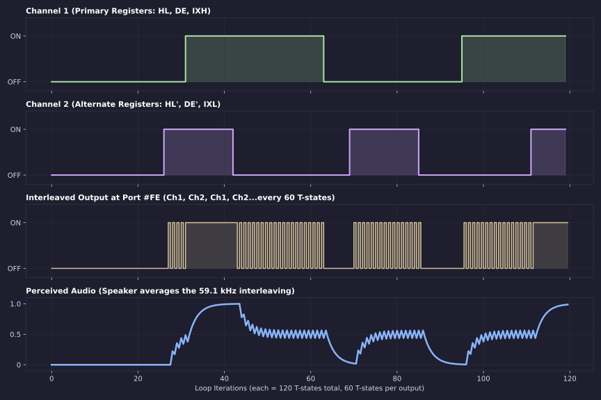
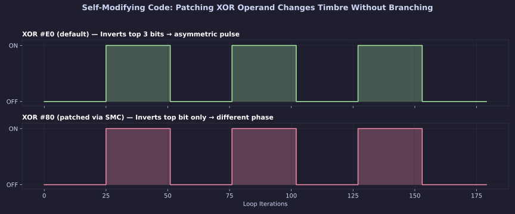

[← Home](../../README.md) · [Synthesis](README.md)

# Case Study: Shiru's *Ear Shaver* Engine

---

## 1. Introduction

In 2023, Shiru released *Ear Shaver* — an album of multi-channel polyphonic compositions running on a stock 48K ZX Spectrum with no hardware modifications. No AY chip. No Covox. Just the single-bit speaker connected to bit 4 of ULA Port `#FE`.

The album sounds like it should not exist. Multiple voices with independent pitch, duty-cycle envelopes producing distinct timbres, smooth pitch slides, and remarkably clean output. All of it synthesized in real-time by the Z80 at 3.5 MHz, toggling a single digital pin.

This document is a forensic teardown of the engine behind *Ear Shaver*. The analysis was performed by connecting to a live, paused emulation session via the Unreal-NG Automation WebAPI, dumping the Z80 registers, disassembling the code directly from memory, and extracting the pattern data. Every code listing, memory dump, and waveform diagram in this article was captured or generated from that snapshot.

> [!IMPORTANT]
> **Shiru (Shiru8bit)** is one of the most prolific composers and toolsmiths in the 1-bit music scene. He authored [1tracker](http://shiru.untergrund.net/software.shtml), the cross-platform tracker for custom Z80 sound engines, as well as Beepola and BeepFX. His discography spans dozens of releases across Spectrum, NES, and Game Boy platforms.
> 
> - **Bandcamp:** [shiru8bit.bandcamp.com](https://shiru8bit.bandcamp.com)
> - **Website:** [shiru.untergrund.net](http://shiru.untergrund.net)
> - **SoundCloud:** [soundcloud.com/shiru8bit](https://soundcloud.com/shiru8bit)
> - **ZX-Art:** [zxart.ee/eng/authors/s/shiru/](https://zxart.ee/eng/authors/s/shiru/)
> - **1-Bit Portal:** [shiru.untergrund.net/1bit/](https://shiru.untergrund.net/1bit/)

---

## 2. Memory Layout of the Snapshot

The *Ear Shaver* snapshot packs the entire album — engine, sequencer, and all composition data — into 48K of contiguous RAM. The following memory map was reconstructed from the RAM dump:



| Address Range | Size | Contents |
|---|---|---|
| `#4000` – `#5AFF` | 6.75 KB | Screen memory (title screen) + ZX Spectrum system variables |
| `#5B00` – `#CDFF` | ~29 KB | **Pattern data** — note sequences, duty-cycle envelopes, and instrument definitions for all tracks in the album |
| `#CE00` – `#CFFF` | 512 B | **Track selector** — keyboard polling (`IN A,(C)`) and jump dispatch to individual compositions |
| `#D000` – `#D04C` | 77 B | **Stream decompressor** — unpacks the compressed pattern data at runtime |
| `#D04D` – `#D2D4` | 648 B | **Player / sequencer** — parses note data, configures registers, selects synthesis mode |
| `#D2D5` – `#D300` | 44 B | **Synthesis Loop Mode 7** — the 120-T-state dual-channel PWM kernel (the subject of this analysis) |
| `#D302` – `#D310` | 15 B | **Exit and cleanup** |
| `#D311` – `#D34D` | 61 B | **Instrument pointer table** — 16-bit addresses into the pattern data, indexed by instrument number |

The pattern data at `#5B00` occupies the vast majority of RAM — nearly 29 KB. This is the cost of storing an entire album. The engine itself (decompressor + player + all synthesis modes + tables) fits in roughly 850 bytes. This ratio — 97% music, 3% code — is characteristic of Shiru's extremely compact engine design.

---

## 3. The Engine Architecture: Seven Synthesis Modes

The most important finding from the disassembly is that the *Ear Shaver* engine does **not** contain a single synthesis loop. It contains **seven distinct synthesis kernels**, each implementing a different mixing algorithm. The sequencer selects the appropriate kernel for each note based on an instrument byte embedded in the pattern data.

The full list, reconstructed from the disassembly:

| Mode | Entry Point | T-states/loop | Channels | Algorithm |
|---|---|---|---|---|
| 0 | `#D190` | ~94 | 2 | Phase overflow toggle (carry-based) |
| 1 | `#D1C0` | ~96 | 2 | DDS + threshold compare (`CP #F0`) + AND mask |
| 2 | `#D1E5` | ~92 | 2 | Same as Mode 1, reversed output order |
| 3 | `#D20C` | ~100 | 2 | RLC rotation + AND mask (harmonic distortion) |
| 4 | `#D232` | ~100 | 2 | Same as Mode 3, reversed channel roles |
| 5 | `#D256` | ~86 | 1 | `EX AF,AF'` toggle with XOR flip (1-bit noise/effect) |
| 6 | `#D285` | ~108 | 2 | Pre-summing mixer with `SBC`/`ADD` arithmetic |
| **7** | **`#D2D5`** | **120** | **2** | **Full DDS + PWM via IX half-registers** (highest quality) |

Mode 7 is the flagship kernel — the highest-quality synthesis path, used for the primary melodic voices. It is the only mode that uses the `IX` half-registers for duty-cycle control, and the only one with precisely balanced 120-T-state timing. The other modes sacrifice features for speed, allowing faster tempos or different timbral effects.

### How the Sequencer Selects a Mode

The player routine at `#D0C0` reads a byte from the pattern stream. This byte encodes both the instrument/mode selection and the note pitch:

```z80
#D0BE: LD A,(HL)       ; Read next byte from pattern stream
#D0BF: INC HL
#D0C0: OR A            ; Test for zero (= silence)
#D0C1: JR Z,#5D        ; Zero → skip to silence handler
#D0C3: DEC A
#D0C4: JP NZ,#D0E0     ; Non-zero → jump to note setup
; ...
#D0C7: LD (#D1C3),A    ; Patch Mode 1 threshold → 0 (silence)
#D0CA: LD (#D1E8),A    ; Patch Mode 2 threshold → 0
#D0CD: LD (#D235),A    ; Patch Mode 4 threshold → 0
#D0D0: LD (#D288),A    ; Patch Mode 6 AND mask → 0
#D0D3: LD (#D2DB),A    ; ★ Patch Mode 7 SBC operand → 0
#D0D6: LD (#D2D8),A    ; ★ Patch Mode 7 XOR operand → 0
```

When a silence command is received (`A=0` after `DEC A`), the sequencer does not simply stop the loop — it **patches all seven synthesis kernels simultaneously** by writing zero into their critical operand bytes. This is Self-Modifying Code (SMC), and it is the most aggressive optimization technique available on the Z80.

---

## 4. Mode 7: The Flagship Synthesis Kernel

Mode 7 is the heart of *Ear Shaver*. It produces two independent audio channels with full DDS pitch control and PWM duty-cycle envelopes. Here is the complete disassembly, captured directly from the snapshot:

```z80
; ──────────────────────────────────────────────────────────────
; Mode 7: Dual-Channel DDS + PWM Synthesis
; Entry: #D2D1 (pre-loop setup)
; Loop:  #D2D5 – #D2EC (120 T-states)
; ──────────────────────────────────────────────────────────────

; --- Pre-loop: save duration counter ---
#D2D1: LD A,C          ;  4 T : Save low byte of duration
#D2D2: DEC BC          ;  6 T : Decrement 16-bit duration counter
#D2D3: INC B           ;  4 T : Compensate high byte (BC was not zero)
#D2D4: LD C,A          ;  4 T : Restore C for inner loop count

; === INNER LOOP START ===
#D2D5: ADD HL,DE       ; 11 T : Phase Accumulator 1 += Frequency Delta 1
#D2D6: LD A,H          ;  4 T : Extract sawtooth wave (high byte of phase)
#D2D7: XOR #E0         ;  7 T : Phase inversion (SMC target!)
#D2D9: CP HX           ;  8 T : Compare against PWM threshold (IXH)
#D2DB: SBC A,A         ;  4 T : Carry → bitmask: #FF if A < IXH, else #00
#D2DC: EXX             ;  4 T : Swap to alternate register set. A preserved!
#D2DD: ADD HL,DE       ; 11 T : Phase Accumulator 2 += Frequency Delta 2
#D2DE: OUT (#FE),A     ; 11 T : ★ OUTPUT Channel 1 to speaker
#D2E0: LD A,H          ;  4 T : Extract sawtooth wave (Ch 2)
#D2E1: XOR #F0         ;  7 T : Phase inversion (SMC target!)
#D2E3: CP LX           ;  8 T : Compare against PWM threshold (IXL)
#D2E5: SBC A,A         ;  4 T : Carry → bitmask: #FF if A < IXL, else #00
#D2E6: OUT (#FE),A     ; 11 T : ★ OUTPUT Channel 2 to speaker
#D2E8: EXX             ;  4 T : Swap back to primary registers
#D2E9: NOP             ;  4 T : Timing pad
#D2EA: NOP             ;  4 T : Timing pad
#D2EB: DEC C           ;  4 T : Decrement inner loop counter
#D2EC: JP NZ,#D2D5     ; 10 T : Loop back (total: 120 T-states)
; === INNER LOOP END ===

; --- Post-loop: envelope step ---
#D2EF: INC HX          ;  8 T : Advance Ch 1 duty-cycle envelope
#D2F1: INC LX          ;  8 T : Advance Ch 2 duty-cycle envelope
#D2F3: DEC B           ;  4 T : Decrement outer loop counter
#D2F4: JP NZ,#D2D5     ; 10 T : Re-enter synthesis loop

; --- Duration expired: poll keyboard and fetch next note ---
#D2F7: IN A,(#FE)
#D2F9: CPL
#D2FA: AND #1F
#D2FC: JP Z,#D073      ; No key pressed → fetch next note from stream
#D2FF: JP #D305        ; Key pressed → exit to track selector
```

### Register Allocation

Every register in the Z80 is utilized. There is zero waste:

| Register | Role |
|---|---|
| `HL` | Phase Accumulator, Channel 1 |
| `DE` | Frequency Delta (pitch), Channel 1 |
| `HL'` | Phase Accumulator, Channel 2 |
| `DE'` | Frequency Delta (pitch), Channel 2 |
| `IXH` | PWM duty-cycle threshold, Channel 1 |
| `IXL` | PWM duty-cycle threshold, Channel 2 |
| `A` | Working register (sawtooth → PWM → output) |
| `C` | Inner loop counter (sample duration) |
| `B` | Outer loop counter (envelope duration) |
| `BC` | Combined 16-bit note duration |

---

## 5. Technique Deep Dive: Direct Digital Synthesis (DDS)

### Why Decrementing Counters Fail

The simplest way to generate a tone on the ZX Spectrum is the decrementing counter. The Sinclair ROM BEEP routine at `#03B5` does exactly this: load a pitch value into `DE`, count it down, toggle the speaker, repeat. The frequency is determined by the counter value.

The problem is **integer quantization**. At high pitches, the available counter values are so few that the gaps between adjacent frequencies become enormous:



With a typical 45-T-state loop, a counter of 10 yields ~3941 Hz. A counter of 11 yields ~3583 Hz. That is a 358 Hz gap — more than a semitone. Playing a melody in the upper octaves sounds appallingly out of tune, and smooth pitch slides are physically impossible.

### The Phase Accumulator Solution

DDS replaces the decrementing counter with an **accumulating counter** that wraps around. Instead of counting down to a toggle, we count up through the full 360° phase of a waveform:

- **`HL`** = Phase Accumulator (16-bit). Current position in the waveform cycle.
- **`DE`** = Frequency Delta (16-bit). How far we advance through the cycle on each sample.

Every iteration: `ADD HL, DE`. The accumulator wraps naturally at `#FFFF` → `#0000`.

The critical insight is that the **high byte** (`H`) of the 16-bit accumulator represents the current amplitude of a sawtooth wave, cycling from 0 to 255 and snapping back. The **low byte** (`L`) is the fractional part — invisible to the output, but providing 256× finer pitch resolution than an 8-bit counter.



### Pitch Resolution: 65,536 Steps Per Octave

With a 16-bit delta, the engine has 65,536 possible pitch values per octave. Compare this to the ~200 usable values in a decrementing counter scheme. The frequency produced by a given delta value `DE` is:

```
f = (Clock / LoopLength) × (DE / 65536)
  = (3,546,900 / 120) × (DE / 65536)
  = 29,557.5 × (DE / 65536)
```

For example:
- `DE = #0200` → 29,557.5 × (512/65536) = **231.0 Hz** (approximately B♭3)
- `DE = #0201` → 29,557.5 × (513/65536) = **231.5 Hz** (0.5 Hz higher — inaudible difference)

This means the engine can perform perfectly smooth, Amiga-tracker-style portamento (pitch slides) by incrementing `DE` by 1 on each note tick. No stepping, no warbling, no quantization artifacts.

---

## 6. Technique Deep Dive: Branchless PWM via IX Half-Registers

### The 1-Bit Volume Problem

A sawtooth wave with 256 amplitude levels is useless on the ZX Spectrum. The ULA accepts exactly one bit: speaker on (`#FF`) or speaker off (`#00`). To simulate volume and timbre from this binary output, the engine must vary the **duty cycle** — the proportion of each waveform period spent in the ON state.

A 50% duty cycle (equal ON/OFF time) produces maximum perceived volume. As the duty cycle shrinks toward 0%, the speaker spends less time displaced, and the perceived volume drops. Different duty cycles also produce radically different timbres — this is the same principle behind the Commodore 64 SID chip's famous pulse-width modulation.

### The CP + SBC Trick

The conventional approach requires conditional branching: compare the sawtooth against a threshold, jump to one path if above, another if below. On the Z80, a conditional jump costs 12 T-states when taken and 7 when not — this timing asymmetry would create jitter that destroys the audio signal.

Shiru eliminates branching entirely with a two-instruction constant-time sequence:

```z80
CP HX           ;  8 T : Compare A against threshold (IXH)
SBC A, A        ;  4 T : Convert carry flag to full bitmask
```

**How it works:**

1. `CP HX` performs `A - IXH` and sets the Carry Flag if `A < IXH` (borrow occurred).
2. `SBC A, A` computes `A - A - CF`.
   - If CF=0 (no borrow, `A >= IXH`): result = `A - A - 0` = `#00`
   - If CF=1 (borrow, `A < IXH`): result = `A - A - 1` = `#FF` (-1 in two's complement)

In 12 T-states, with **zero branching and zero timing variation**, the Z80 converts a continuously rising sawtooth into a variable-width pulse wave. The duty cycle is controlled entirely by the value in `IXH`:



### Why IX Half-Registers?

The Z80's `IX` register is a 16-bit index register that can be split into `IXH` (high byte) and `IXL` (low byte) using undocumented opcodes. This is critical because:

1. **Two independent thresholds** in a single register: `IXH` controls Channel 1's duty cycle, `IXL` controls Channel 2's. No memory access needed.
2. **The `CP HX` instruction takes only 8 T-states**, compared to `CP (IX+d)` which takes 19 T-states (the documented form). That saves 11 T-states per channel per loop — 22 T-states total — which would otherwise reduce the sample rate by 18%.
3. **The outer loop advances the envelope** with `INC HX` / `INC LX` (8 T-states each), creating an automatic duty-cycle sweep that produces the characteristic "fading" attack/decay on each note.

### The Envelope Mechanism

After the inner loop (`C` iterations) completes, the code at `#D2EF` executes:

```z80
#D2EF: INC HX          ;  8 T : Ch 1 threshold += 1
#D2F1: INC LX          ;  8 T : Ch 2 threshold += 1
#D2F3: DEC B           ;  4 T : Decrement outer counter
#D2F4: JP NZ,#D2D5     ; 10 T : Re-enter loop
```

Each time the inner loop completes a frame, `IXH` and `IXL` are incremented by 1. This means the duty cycle steadily increases from whatever starting value was set by the sequencer (e.g., `#80` for 50%) up toward `#FF` (99.6%) and eventually wraps to `#00` (0%). This produces a characteristic **sawtooth volume envelope** — the note attacks at a specific timbre, then the pulse width sweeps upward, thinning the sound until it fades away. The rate of this sweep is controlled by the inner loop count `C`: shorter inner loops mean faster envelope sweeps and more dynamic timbral movement.

---

## 7. Technique Deep Dive: Time-Division Multiplexing

### The Single-Pin Polyphony Problem

With only one speaker pin, how do you play two notes simultaneously? The naive approach is to arithmetically sum the two channels — but summing requires additional CPU cycles for the math, and the result is a multi-bit value that cannot be directly output to a 1-bit port without yet another PWM loop. This cascading complexity drastically reduces the carrier frequency and increases audible noise.

### Interleaved Output via EXX

Shiru's solution is **Time-Division Multiplexing (TDM)**. The engine does not mix the channels. Instead, it fires Channel 1 to the speaker, then 60 T-states later fires Channel 2. The speaker cone and the human auditory system perform the mixing naturally by averaging the rapid alternation.

The key enabler is the Z80's `EXX` instruction, which atomically swaps the primary register bank (`BC, DE, HL`) with the alternate bank (`BC', DE', HL'`) in just 4 T-states. Crucially, `EXX` does **not** swap the Accumulator (`A`).

This allows a brilliant scheduling trick:

1. Calculate Channel 1's output bit. Leave the result in `A`.
2. `EXX` — swap to Channel 2's registers. `A` still holds Channel 1's output.
3. Begin calculating Channel 2's phase (`ADD HL, DE`).
4. **While the CPU is doing Channel 2 math**, output `A` (Channel 1's value) to the port.
5. Finish Channel 2's calculation. Output its result.
6. `EXX` — swap back.

The `ADD HL, DE` at step 3 takes 11 T-states, which serves as a perfectly timed delay between "calculate" and "output" for Channel 1. No time is wasted.



### Sample Rate Calculation

The inner loop executes in exactly 120 T-states. It contains two `OUT (#FE), A` instructions, meaning the speaker is updated twice per loop:

| Parameter | Value |
|---|---|
| CPU Clock | 3,546,900 Hz |
| Loop length | 120 T-states |
| Outputs per loop | 2 |
| **Effective output interval** | **60 T-states** |
| **Sample rate** | **3,546,900 / 60 = 59,115 Hz** |

A 59.1 kHz output rate means the carrier frequency (the fundamental repetition rate of the interleaving pattern) is nearly three times higher than the upper limit of human hearing (20 kHz). This pushes quantization noise and intermodulation products into the ultrasonic range, where they are inaudible. The result is remarkably clean audio for a 1-bit system.

---

## 8. Self-Modifying Code: Runtime Kernel Patching

### The XOR Operand as a Timbral Control

In the synthesis loop, both channels perform a `XOR` on the sawtooth value before the `CP` comparison:

```z80
#D2D7: XOR #E0         ; Channel 1: inverts bits 7, 6, 5
#D2E1: XOR #F0         ; Channel 2: inverts bits 7, 6, 5, 4
```

The `XOR` operation flips specific bits of the sawtooth wave before it is compared against the PWM threshold. This effectively **shifts the phase** of the waveform, changing where in the sawtooth cycle the duty-cycle transition occurs. Different `XOR` masks produce different harmonic spectra — i.e., different timbres — from the same fundamental frequency.

### SMC: The Sequencer Rewrites the Loop

The bytes `#E0` and `#F0` in those `XOR` instructions are not constants — they are **runtime-patchable targets**. The sequencer at `#D0D6` and `#D100` writes directly into the synthesis loop's machine code:

```z80
; From the note setup routine:
#D0D6: LD (#D2D8),A    ; Overwrite the #E0 byte in XOR #E0
#D100: LD (#D2D8),A    ; (Same target, different entry path)
#D105: LD (#D2DB),A    ; Overwrite the operand in SBC A,A context
```

Address `#D2D8` is the second byte of the `XOR #E0` instruction at `#D2D7`. By writing a different value there, the sequencer changes the XOR mask without any conditional logic inside the loop. The loop continues to execute in exactly 120 T-states regardless of what timbre is selected.



This technique is used extensively across all seven synthesis modes. The addresses being patched (`#D1C3`, `#D1E8`, `#D235`, `#D288`, `#D2D8`, `#D2DB`, `#D2E2`, `#D2E5`) correspond to operand bytes in each kernel. The sequencer has a unified "silence" path that writes zero to all of them simultaneously (see the listing at `#D0C7`–`#D0D6`), and individual note-on paths that write specific values for each mode.

---

## 9. The Decompressor: Fitting an Album into 29 KB

The pattern data at `#5B00`–`#CDFF` is not stored as raw note bytes. It passes through a stream decompressor at `#D000`–`#D04C` before reaching the sequencer.

```z80
; Stream decompressor entry
#D000: SCF             ; Set carry flag
#D001: RET NC          ; Return if not called with carry (guard)

; Bit-reading subroutine
#D047: ADD A,A         ; Shift next bit out of accumulator
#D048: RET NZ          ; If bits remain, return with bit in carry
#D049: LD A,(HL)       ; Refill: load next byte from stream
#D04A: INC HL          ; Advance stream pointer
#D04B: RLA             ; Rotate through carry (preserves the new bit)
#D04C: RET             ; Return with bit in carry flag

; Multi-bit value reader (Elias gamma coding)
#D037: LD BC,#0001     ; Initialize BC = 1
#D03A: CALL #D047      ; Read one bit
#D03D: RL C            ; Shift bit into BC
#D03F: RL B
#D041: CALL #D047      ; Read next control bit
#D044: RET NC          ; If 0, value is complete
#D045: JR #F3          ; If 1, continue reading
```

This is a **variable-length code** decoder, consistent with Elias gamma or similar entropy coding. Short, common values (like "repeat previous note" or "rest") encode in just 2–3 bits, while rare values (like instrument changes or large pitch jumps) use more bits. This compression allows the entire album to fit in the 29 KB pattern data region.

---

## 10. The Other Six Synthesis Modes

While Mode 7 is the highest-quality path, the other modes serve specific musical purposes:

### Mode 0 (`#D190`): Carry-Toggle

```z80
#D190: ADD HL,DE       ; 11 T : Advance phase
#D191: JR NC,#06       ; 7/12 T : If no overflow, skip output
#D193: XOR A           ;  4 T : A = 0
#D194: OUT (#FE),A     ; 11 T : Output silence
#D196: JP #D19F        ; 10 T : Continue
```

This is the simplest mode. It does not use PWM at all — it simply toggles the speaker whenever the phase accumulator overflows (carries). The output is a raw square wave with fixed 50% duty cycle. The frequency is determined entirely by `DE`. Used for bass notes where timbral complexity is unnecessary.

### Mode 1 (`#D1C0`): Threshold Compare with AND Mask

```z80
#D1C0: ADD HL,DE       ; 11 T
#D1C1: LD A,H          ;  4 T
#D1C2: CP #F0          ;  7 T : Compare against fixed threshold (SMC target!)
#D1C4: SBC A,A         ;  4 T
#D1C5: AND #1A         ;  7 T : Mask to specific port bits
#D1C7: EXX             ;  4 T
#D1C8: ADD HL,DE       ; 11 T
#D1C9: OUT (#FE),A     ; 11 T
```

Similar to Mode 7, but uses a **fixed threshold** (patched via SMC at `#D1C3`) instead of `IXH`. This is faster (no `DD`-prefixed opcode penalty) but less flexible — the duty cycle can only change between notes, not within a note. The `AND #1A` masks the output to specific bits of Port `#FE`, which controls the border color simultaneously with the speaker, creating the characteristic flashing-border visual effect during playback.

### Mode 5 (`#D256`): Toggle Synthesis

```z80
#D256: EX AF,AF'       ;  4 T : Swap to alternate accumulator
#D257: ADD HL,DE       ; 11 T : Advance phase
#D258: JR C,#02        ; 7/12 T : On overflow...
#D25A: JR #02          ; 12 T : ...or not (timing balance)
#D25C: XOR #1B         ;  7 T : Flip speaker + border bits
#D25E: EXX             ;  4 T
```

This mode uses `EX AF,AF'` (which swaps the accumulator and flags) to maintain a persistent toggle state across iterations. When the phase overflows, `XOR #1B` flips the speaker bit. The `JR C` / `JR` pair is a timing trick: both paths take exactly 12 T-states, maintaining constant loop timing regardless of whether an overflow occurred. This mode is used for metallic, harsh timbres and noise effects.

### Mode 6 (`#D285`): Arithmetic Pre-Summing Mixer

```z80
#D285: ADD HL,DE       ; 11 T : Ch 1 phase
#D286: SBC A,A         ;  4 T : Ch 1 overflow → #FF or #00
#D287: AND #1D         ;  7 T : Mask (SMC target at #D288)
#D289: EXX             ;  4 T
#D28A: ADD A,B         ;  4 T : ★ Add Ch 2's previous state
#D28B: LD B,A          ;  4 T : Store combined value
#D28C: ADD HL,DE       ; 11 T : Ch 2 phase
#D28D: SBC A,A         ;  4 T
#D28E: AND #1D         ;  7 T : Mask (SMC target at #D28F)
#D290: ADD A,B         ;  4 T : ★ Sum both channels
#D291: LD B,#FF        ;  7 T : Threshold for clipping
#D293: ADD A,B         ;  4 T : Shift into range
#D294: SBC A,B         ;  4 T : Saturate
#D295: LD B,A          ;  4 T : Store for next iteration
#D296: SBC A,A         ;  4 T : Convert to 1-bit
#D297: AND C           ;  4 T : Apply port mask
#D298: OUT (#FE),A     ; 11 T
```

This is the most computationally expensive mode. Instead of interleaving the channels, it **arithmetically sums** them using `ADD A,B` and then converts the multi-level sum back to 1-bit using a saturation/threshold circuit built from `SBC`/`ADD` pairs. This produces a cleaner mix at the cost of a lower effective sample rate (only one `OUT` per loop). It's used sparingly for specific passages where the interleaving artifacts of Mode 7 would be audible.

---

## 11. Cross-Platform Portability

A fundamental consequence of pure software synthesis is **hardware independence**. Because the engine does not rely on any sound chip, it is portable to any Z80-based machine that has a digital pin connected to a speaker.

The open-source repository [`bushy555/microbee_1-bit_music`](https://github.com/bushy555/microbee_1-bit_music) demonstrates this by porting Shiru's and Utz's engines to the Microbee and VZ200/300 computers:

| Platform | Speaker I/O | Modification Required |
|---|---|---|
| ZX Spectrum | Bit 4, Port `#FE` | None (native) |
| Microbee | Bit 6, Port `#02` | Change `OUT (#FE),A` → `OUT (#02),A`, adjust bit mask |
| VZ200/300 | Bits 0+5, address `#6800` | Replace `OUT` with `LD (#6800),A`, adjust bit mask |

The only constraint is clock speed. The ZX Spectrum's Z80 runs at 3.5469 MHz. A machine with a different clock will produce different absolute pitches (all notes shift proportionally) and a different carrier frequency. On slower machines, the carrier may drop into the audible range, producing a high-pitched whine underneath the music.

---

## 12. Conclusion

The *Ear Shaver* engine is not a single clever trick — it is a complete, multi-mode synthesis system packed into ~850 bytes of Z80 machine code. Its key innovations:

1. **Direct Digital Synthesis** via 16-bit phase accumulators, providing 65,536 pitch steps per octave and enabling perfectly smooth glissandos.

2. **Branchless PWM conversion** using the `CP HX` / `SBC A,A` idiom, which converts a rolling sawtooth into a variable-width pulse wave in constant time with zero timing jitter.

3. **Time-Division Multiplexing** via `EXX` register shadowing, achieving a 59.1 kHz effective sample rate that pushes quantization noise into the ultrasonic range.

4. **Self-Modifying Code** for timbral control, where the sequencer physically rewrites the `XOR` operands inside the synthesis loop to change harmonic content without adding any conditional logic to the critical path.

5. **Seven specialized synthesis modes**, each trading features for speed or vice versa, allowing the sequencer to select the optimal kernel for each musical passage.

6. **Stream compression** using variable-length coding, fitting an entire album into 29 KB of pattern data.

The result is an engine that extracts polyphonic, multi-timbral, dynamically enveloped audio from a digital pin that was never designed for music — and does so with such efficiency that 97% of the available RAM is dedicated to music data rather than code.

---

## References

- **Shiru's Software Hub:** [shiru.untergrund.net/software.shtml](https://shiru.untergrund.net/software.shtml)
- **1-Bit Music Portal:** [shiru.untergrund.net/1bit/](https://shiru.untergrund.net/1bit/)
- **Microbee 1-Bit Ports:** [github.com/bushy555/microbee_1-bit_music](https://github.com/bushy555/microbee_1-bit_music)
- **Bandcamp:** [shiru8bit.bandcamp.com](https://shiru8bit.bandcamp.com)
- **ZX-Art Profile:** [zxart.ee/eng/authors/s/shiru/](https://zxart.ee/eng/authors/s/shiru/)
