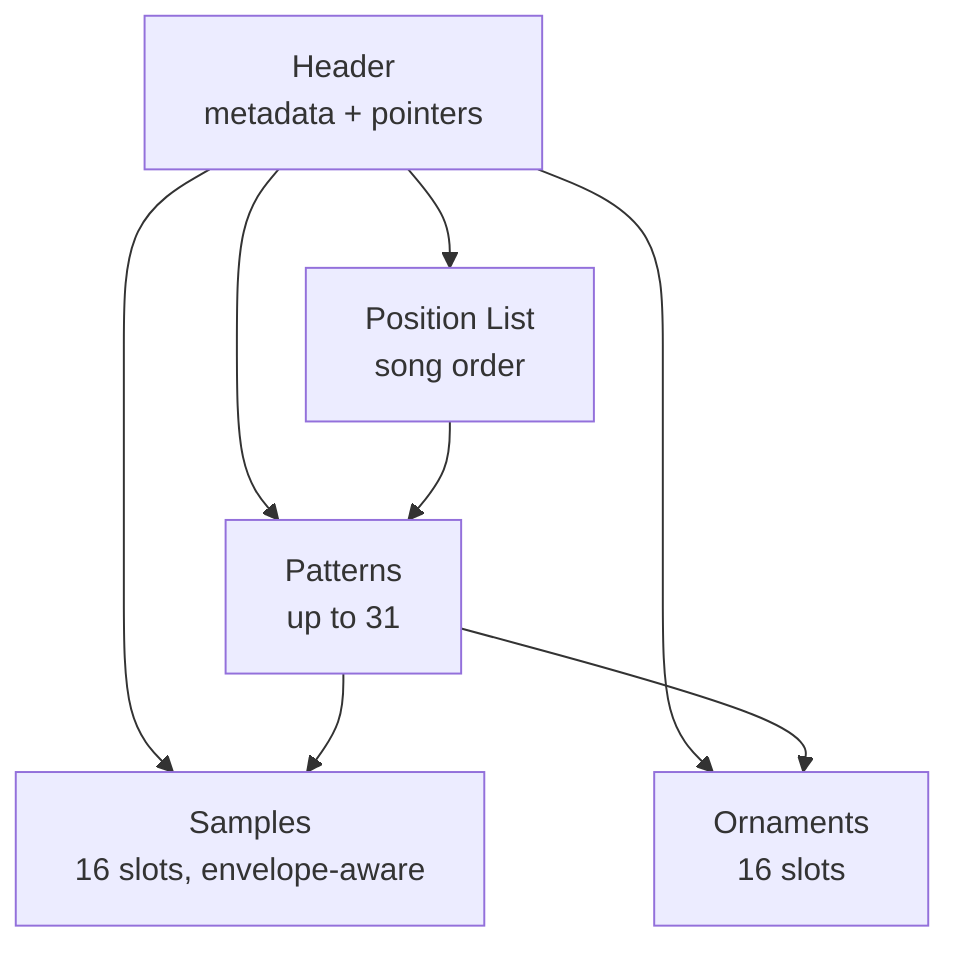

[← Home](../../README.md) · [Sound](../README.md) · [Trackers & Formats](README.md)

# Asc Sound Master — The Soviet Alternative (1992)

> **Applies to**: All tracks. Asc Sound Master (ASM) by Andrew Sendetskiy (handle: ASC), released 1992, is the **second major AY tracker** in the ZX Spectrum ecosystem and the most significant alternative to the Sound Tracker / Pro Tracker / Vortex Tracker II lineage. It produced the `.ASC` and `.AS0` module formats, which Vortex Tracker II still imports 30+ years later.

---

## Overview

Where [Sound Tracker 1.1](sound_tracker.md) (Bzyk, 1990) defined the **Polish** entry into AY music editors, Asc Sound Master defined the **Soviet / Russian** entry. Written by **Andrew Sendetskiy** (scene handle: **ASC**) and released in 1992, ASM was the dominant AY tracker in the Soviet clone scene between 1992 and 1995, when [Pro Tracker](protracker.md) began to displace it.

ASM took the same fundamental pattern-grid paradigm as ST 1.1 but made different design choices in module format, instrument structure, and editing model. These differences gave ASM a distinct sound aesthetic — Soviet-clone AY music composed in 1992–1995 has a recognizably different character from Polish ST 1.1 music of the same era, and the difference traces back to ASM's instrument model.

### Why ASM Matters

- **The Soviet clone scene's first major AY tracker** — ST 1.1 reached the USSR, but ASM was the first tracker designed *for* the Soviet clone ecosystem (Pentagon, Scorpion, Kay, ATM Turbo)
- **The `.ASC` / `.AS0` module formats** — over a thousand modules were composed in ASM through the 1990s; the format is still readable by VTII today
- **A different instrument model** — ASM's instruments encoded different parameters than ST 1.1's, producing a distinctive sound character
- **The cultural split** — Soviet AY music between 1992 and 1995 divided between the STC/STP lineage (Polish-influenced) and the ASC lineage (Russian-native). Both lineages converged into PT3 after 1996.

### Naming Convention

| Term | Meaning |
|---|---|
| **ASM** | Asc Sound Master — the canonical abbreviation |
| **ASC** | Andrew Sendetskiy's scene handle — the tracker and the format are both named after it |
| **`.ASC`** | Asc Sound Master's module format (the dominant sub-version) |
| **`.AS0`** | Early ASM sub-version's format — slightly different header layout |
| **Sample** | In ASM parlance, an instrument definition (same usage as ST 1.1 and PT3) |
| **Position list** | ASM's term for the song-order list (PT3 calls this the "position table") |

---

## History and Authorship

### The Soviet Clone Context

By 1992 the Soviet ZX Spectrum clone scene was a major cultural phenomenon in the former USSR. The **Pentagon** (a Soviet 128K-compatible, manufactured informally since 1990) had become the de facto standard, with the **Scorpion** (1991) and **Kay** (1992) providing more sophisticated alternatives. These machines used the same AY-3-8912 (or its YM2149F equivalent) as the original Sinclair 128K but were built and sold through informal channels at a fraction of the price.

The Soviet clone scene needed native software, including native music tools. While ST 1.1 was available and used, its Polish origin, English-language interface, and design choices tuned for the Sinclair 128K made it less than ideal for the Soviet context.

### Sendetskiy's Approach

**Andrew Sendetskiy** (ASC) released Asc Sound Master in 1992. The design reflects a parallel discovery of the tracker paradigm — ASC was aware of ST 1.1 but developed his own approach to several key questions:

| Question | ST 1.1 (Bzyk) | ASM (Sendetskiy) |
|---|---|---|
| How to encode an instrument? | Volume + tone flags per tick | Volume + tone + envelope mode per tick |
| How many samples? | 15 | 16 (slightly more) |
| How to pack patterns? | Fixed-size records | Fixed-size records |
| How to encode ornaments? | Signed-byte arpeggios | Signed-byte arpeggios (same approach) |
| What to call the format? | `.STC` (Sound Tracker Compiled) | `.ASC` (after the author's handle) |
| Russian-language UI? | No | **Yes** — UI labels in Cyrillic |

The Russian-language UI was a meaningful practical choice in 1992 — most Soviet clone users were more comfortable with Cyrillic than English. This lowered the barrier to entry for Soviet composers and contributed to ASM's local dominance.

### Timeline

| Year | Event |
|---|---|
| 1990 | ST 1.1 reaches the USSR via demoscene channels |
| 1991 | Pentagon and Scorpion clones become widely available |
| **1992** | ASC releases Asc Sound Master 0.12 (`.AS0` format) |
| **1992–1993** | ASM 1.x releases refine the format (`.ASC` becomes the standard extension) |
| 1993–1995 | ASM is the dominant AY tracker in the Soviet clone scene |
| 1995 | Golden Disk Corp. releases Pro Tracker 1.x — begins to displace ASM |
| 1996–1997 | Pro Tracker 3.x and `.PT3` become dominant; ASM enters decline |
| 2000+ | Vortex Tracker II imports `.ASC` / `.AS0` — preserves ASM's library |
| 2025 | ASM modules still circulate in AY music archives |

### Why ASM Lost to Pro Tracker

ASM was the Soviet clone scene's favorite tracker from 1992 to 1995, but by 1997 Pro Tracker 3 had decisively displaced it. The reasons:

1. **PT3 packed patterns more efficiently** — ASM's fixed-size records wasted space on empty rows; PT3's variable-length encoding halved file sizes
2. **PT3 supported more samples** (32 vs ASM's 16) and more patterns (256 vs ASM's limit)
3. **PT3's frequency table** was per-module, enabling cross-platform AY music (Atari ST, MSX); ASM's was hardcoded
4. **Golden Disk Corp. had broader distribution** — Pro Tracker shipped with several Soviet clone distributions and received continuous updates through 1995–1997

By 1997, the practical Soviet composer had moved to PT3. ASM remained in use only for composers maintaining existing `.ASC` libraries — exactly the role VTII's importer serves today.

---

## Editing Model

ASM ran entirely on the Spectrum (or Soviet clone) and used the same general editing flow as ST 1.1: boot the tracker, edit notes in a pattern grid, define samples and ornaments in dedicated editors, save as `.ASC`.

### The Pattern Grid

ASM's main view was a pattern grid — 64 rows × 3 channels, with each cell containing a note entry. The grid layout was recognizably the same as ST 1.1's:

```
       Channel A    Channel B    Channel C
Row 00  C-4 I01 ..   --- .. ..   --- .. ..
Row 01  --- .. ..    --- .. ..   --- .. ..
Row 02  E-4 I02 ..   --- .. ..   --- .. ..
...
Row 3F  === .. ..    === .. ..   === .. ..
```

The note naming convention was identical to ST 1.1 (letter + octave, sharps as `#`), making it easy for composers familiar with one tracker to switch to the other.

### The Sample Editor

ASM's sample editor was the most distinctive feature. Where ST 1.1's samples encoded volume + tone flags, ASM's samples encoded:

- Volume (4 bits, 0–15)
- **Envelope mode** (one of the AY chip's 5 hardware envelope shapes)
- Tone behavior
- **Optional frequency shift per tick** (enabling per-tick pitch slides)

The envelope-mode field is the key difference. The AY chip has a hardware envelope generator that can produce sawtooth, triangle, and other shapes natively. ST 1.1 used this generator implicitly via the volume field; ASM exposed it as an explicit per-tick parameter, giving the composer direct control over envelope shape changes mid-note.

This produced ASM's distinctive sound: more complex envelope motion within sustained notes, with explicit shape changes that ST 1.1 could not express. Soviet-clone AY music from 1992–1995 often features arpeggios with shifting envelope shapes — a hallmark of ASM modules.

> [!NOTE]
> The byte-level layout of an ASM sample frame — including the exact bit assignments for envelope-mode, tone behavior, and the edge-triggered envelope shape value — is documented in [ASM Sample Frame: Byte-Level Layout](#asm-sample-frame-byte-level-layout) below. The sonic consequences of writing to AY register 13 every tick are documented in [Why ASM Sounds Different](#why-asm-sounds-different-register-13-and-envelope-retriggering).

### The Ornament Editor

ASM's ornament editor was similar to ST 1.1's: a list of signed semitone offsets applied to a note over successive rows. Up to 16 ornaments could be defined per module.

### Russian-Language UI

ASM's UI labels were in **Cyrillic** (or bilingual Russian/English in some sub-versions). This was unusual for tracker software at the time — ST 1.1 used English labels even when used in the Soviet Union. The Russian UI made ASM accessible to composers without English fluency and was a meaningful contributor to its dominance in the Soviet clone scene.

> [!NOTE]
> The Cyrillic UI also meant ASM did not export well to Western markets. ST 1.1's English labels made it usable across Europe; ASM was effectively Soviet-only. This asymmetry shaped the cultural split: ST 1.1 influenced Western Europe, while ASM dominated the post-Soviet space.

---

## The `.ASC` and `.AS0` Module Formats

ASM produced two related module formats over its development history:

| Format | Origin | Notes |
|---|---|---|
| **`.AS0`** | ASM 0.12 (1992, the first public release) | Early sub-version — slightly different header layout |
| **`.ASC`** | ASM 1.x (1992–1993, the dominant releases) | The standard ASM format; what most `.ASC` files use |

Both formats share the same conceptual layout but differ in some header field offsets. VTII's importer handles both, distinguishing them by structural heuristics.

### Block Layout

Like ST 1.1 and PT3, an `.ASC` file is a sequence of blocks referenced by header pointers:



The structure is similar to `.STC`, with two notable differences:

1. **Sample definitions are larger** — each sample frame stores volume + envelope-mode + tone-behavior (3 fields instead of STC's 2)
2. **No frequency table block** — the table is hardcoded in the ASM player routine, same as STC

### ASM Sample Frame: Byte-Level Layout

An ASM sample is a list of frames preceded by a 2-byte header (loop offset, length). Each frame is **2 bytes** — half the size of a PT3.4+ frame but more expressive than STC's 1-byte frame in one specific dimension: per-tick envelope-shape control.

#### Frame byte 0 — Envelope, mixer, volume

| Bit | When set |
|---|---|
| 7 | **Hardware envelope enabled** — AY register 13 controls amplitude (the volume field is ignored) |
| 6 | Tone generator **off** for this tick (mute pitch, leave noise/envelope audible) |
| 5 | Noise generator on |
| 4 | (sub-version specific; usually mixer bit) |
| 3–0 | **Amplitude** (volume 0–15). Ignored when bit 7 is set |

#### Frame byte 1 — Envelope shape

| Bit | When set |
|---|---|
| 7 | Envelope shape bit 3 (one of the AY's 5 valid shape encodings) |
| 6 | Envelope shape bit 2 |
| 5 | Envelope shape bit 1 |
| 4 | Envelope shape bit 0 |
| 3–0 | Envelope **period slide** delta for this tick (signed) |

The crucial detail: when bit 7 of frame byte 0 is set, the player **writes the envelope-shape value to AY register 13 every tick**. Because AY register 13 is **edge-triggered** (any write resets the envelope's internal cycle), per-tick writes cause the envelope generator to restart on every frame. This is what gives ASM its characteristic "wobble" — sustained notes contain micro-retriggers that PT3-based instruments do not.

> [!NOTE]
> The exact bit assignments in `.ASC` frames vary slightly between sub-versions (0.12 vs 1.x) and between references. The two invariants that all sources agree on are: (a) the hardware-envelope enable flag lives in the high bits of byte 0, and (b) the envelope shape value lives in byte 1. The deater.net PT3 documentation (`register_13.txt`) and the VTII importer source are the canonical references.

#### Example: A 16-frame sustained lead with envelope wobble

```
Length:     16 frames
Loop point: 0 (loops back to frame 0 for sustain)

Frame 00:  8F 0F    ; envelope on, vol=F, shape=0x0F (sawtooth)
Frame 01:  8F 0A    ; envelope on, vol=F, shape=0x0A (triangle)
Frame 02:  8F 0E    ; envelope on, vol=F, shape=0x0E (sawtooth, hold)
Frame 03:  8F 0A    ; shape back to triangle — envelope retriggers
Frame 04:  8F 0F    ; shape back to sawtooth — envelope retriggers again
... (continues with alternating shapes)

Total: 2 header bytes + 32 frame bytes = 34 bytes
```

Each shape change rewrites AY register 13, which restarts the envelope cycle. Played at 50 Hz, this produces a perceptible "buzzing" or "wobbling" character that is the audible signature of ASM-composed music.

#### Comparison with PT3's 4-byte frame

| Field | ASM (2 bytes) | PT3.4+ (4 bytes) |
|---|---|---|
| Amplitude (volume) | ✅ (4 bits) | ✅ (4 bits, low nibble of byte 1) |
| Tone on/off | ✅ (bit 6 of byte 0) | ✅ (mixer bits in byte 1) |
| Noise on/off | ✅ (bit 5 of byte 0) | ✅ (mixer bits in byte 1) |
| Hardware envelope enable | ✅ (bit 7 of byte 0) | ✅ (bit 0 of byte 0) |
| Envelope shape per tick | ✅ (byte 1, full shape value) | ❌ (shape stored in pattern bytes, not in sample frame) |
| Envelope-period slide | ✅ (low nibble of byte 1) | ✅ (byte 0 bits 1–5) |
| Per-tick amplitude slide | ❌ | ✅ (byte 0 bits 6–7) |
| Per-tick frequency offset | ❌ | ✅ (bytes 2–3, 16-bit signed) |

The inverse asymmetry is what defines the audible difference between the two formats:

- **ASM has more granular envelope-shape control** — every tick can choose from 5 different shapes, producing micro-retriggers
- **PT3 has more granular pitch and amplitude control** — every tick can slide pitch by up to ±32K Hz and amplitude by an arbitrary delta

### Differences from `.STC` and `.PT3`

| Aspect | `.STC` (ST 1.1) | `.ASC` (ASM) | `.PT3` (Pro Tracker 3.4+) |
|---|---|---|---|
| **Sample frame size** | 1 byte | 2 bytes | 4 bytes |
| **Per-tick pitch offset** | ❌ | ❌ | ✅ (16-bit, bytes 2–3) |
| **Per-tick envelope shape** | ❌ | ✅ | ✅ (frame byte 0 bit 0) |
| **Per-tick amp slide** | ❌ | ❌ | ✅ (frame byte 0 bit 7) |
| **Sample slots** | 15 | 16 | 32 |
| **Ornament slots** | 16 | 16 | 16 |
| **Pattern count** | 31 | 31 | 256 |
| **Frequency table** | Hardcoded | Hardcoded (ASM table) | Per-module, 4 options including the ASM table |
| **Magic bytes** | None | None | `"PT3\r"` |
| **Packed patterns** | No | No | Yes |
| **File size** (typical) | 4–8 KB | 5–10 KB | 2–20 KB |

> [!NOTE]
> PT3.4+'s 4-byte sample frame is a **strict superset** of ASM's 2-byte frame: ASM's envelope-mode and tone-behavior map onto PT3's frame byte 0 and byte 1 bits, and PT3 adds a per-tick frequency offset (bytes 2–3) that ASM lacks. This is why VTII can losslessly import `.ASC` files into PT3 modules. The reverse is not always possible — a PT3 module using the frequency-offset field cannot be cleanly exported back to `.ASC`.

### File Identification

| Property | Value |
|---|---|
| **Extension** | `.ASC` or `.AS0` |
| **Magic bytes** | None — `.ASC` files have no magic header |
| **File size** | 2–10 KB typically |
| **Decoding** | Requires ASM-specific player or VTII's importer |

The lack of magic bytes means modern software identifies `.ASC` files by extension or structural parsing — the same situation as `.STC`. VTII's importer auto-detects the ASM sub-version (`.AS0` vs `.ASC`) from header field offsets.

> [!WARNING]
> The `.ASC` extension is also used by **Atari ST** sample files (raw PCM). When encountering a `.ASC` file, check the file size and structure — an AY module is typically 2–10 KB of binary; an Atari ST sample is typically much larger. VTII rejects Atari ST `.ASC` files at load time.

---

## The ASM Frequency Table

ASM modules do not embed a frequency table. The table is hardcoded in the player routine, with one specific tuning that Sendetskiy chose in 1992 and never changed. This single table is shared by every `.ASC` and `.AS0` module in existence.

### Why the Table Matters

The AY chip's tone generators are driven by 12-bit period values, not by note names. The frequency table maps a logical note index (0–95, covering 8 octaves) to the 12-bit period value the chip needs to produce that pitch. Two trackers that disagree on the table will tune the same note differently — sometimes by audibly different amounts.

Sendetskiy's table became a de facto Russian-clone standard for several years. The four major pre-PT3 Soviet clone trackers (ASM, ST 1.1 in Russian ports, E-Tracker, and a few smaller ones) all converged on closely related tables.

### How PT3 Preserves the ASM Table

When Golden Disk Corp. designed PT3, they faced a problem: how to make `.ASC` music play in tune after import. Their solution was to make PT3's frequency table **per-module**, with four pre-baked options selectable via a 2-bit field in the header:

| Table ID | Name | Tuning origin |
|---|---|---|
| `PT3NoteTable_ProTracker_3.3_to_3.5` | Table #0 | The PT3 native table, slightly retuned from STC |
| `PT3NoteTable_ASM_34_35` | **Table #1 — the ASM table** | Sendetskiy's hardcoded tuning |
| `PT3NoteTable_ST_3.6_to_3.7` | Table #2 | Alternative PT3 tuning, post-1997 |
| `PT3NoteTable_real_Convert_0.0` | Table #3 | The "real frequency" table, mathematically exact, used by some Western converters |

VTII's `.ASC` importer writes table ID #1 into the resulting PT3 file. The same module imported into PT3 sounds **exactly like the original `.ASC` playback**, because the underlying period values are byte-identical.

### Why the Table Cannot Fully Emulate

Even with the correct table selected, `.ASC` modules rendered via a PT3 player do not sound identical to `.ASC` modules rendered via an ASM player. The remaining differences come from:

1. **Sample-frame semantics** — PT3's 4-byte frame lacks the per-tick envelope-shape value, so ASM's micro-retriggers are converted into per-tick amplitude slides (close, but audibly different — see [Why ASM Sounds Different](#why-asm-sounds-different-register-13-and-envelope-retriggering))
2. **Player routine timing** — the original ASM player routine made specific choices about register write order; PT3's routine makes slightly different choices
3. **AY chip variant differences** — the original Soviet clones used the YM2149F; many emulators default to the AY-3-8912, which has a slightly different noise-period behavior

For archival purposes, the cleanest path is to play `.ASC` files in their original form using an ASM-aware player (`ay_emul`, `ZXTune`). The PT3 conversion path exists for compatibility with the larger PT3 ecosystem, not for byte-exact reproduction.

---

## Why ASM Sounds Different: Register 13 and Envelope Retriggering

ASM modules have a recognizable sonic character — Soviet-clone AY music from 1992–1995 is audibly distinct from PT3-based music of the same era, and the difference is not just nostalgia. It is a direct consequence of how the AY chip's envelope generator works and how the two formats choose to drive it.

### The AY Envelope Generator

The AY-3-8912 has a hardware envelope generator that drives the amplitude of any channel routed through it. The generator is controlled by two registers:

| Register | Function |
|---|---|
| **R12/R13** | 16-bit envelope **period** — how fast the envelope cycles |
| **R13** | Envelope **shape** — 4-bit value selecting one of 5 valid shapes (sawtooth, triangle, etc.) |

The crucial detail: **R13 is edge-triggered**. Every write to R13 — even a write of the same value — restarts the envelope's internal cycle from the beginning. This is documented in the AY-3-8912 datasheet and verified in cycle-accurate emulators.

### How ASM Exploits Edge-Triggering

ASM's sample frame stores an envelope-shape byte. When the hardware-envelope bit (frame byte 0 bit 7) is set, the player **writes the shape value to R13 every tick**. Even if the shape value does not change from one tick to the next, the write itself causes the envelope generator to restart.

At 50 Hz, this means a sustained ASM note gets its envelope restarted 50 times per second. The restart produces a brief transient — a "pop" or "buzz" at the start of each cycle — that builds into the characteristic ASM "wobble".

The effect is most audible on:

- **Sustained bass lines** — the wobble is clearly perceptible and is a hallmark of ASM bass patches
- **Lead instruments using the triangle envelope shape** — the per-tick retriggers turn a smooth triangle into a stepped "digital" sound
- **Long notes with hardware-envelope-only amplitude** — there is no volume change to mask the retriggers

### How PT3 Avoids the Wobble

PT3's sample frame stores an envelope-shape **enable** bit (frame byte 0 bit 0) but not the shape value itself. The shape value lives in the pattern bytes — specifically in the effects column (effects `$0D0`–`$0D7` set envelope shape) and is only written to R13 when a note begins or when a pattern effect explicitly changes the shape.

The result: during a sustained note, R13 is **not rewritten every tick**. The envelope generator runs to completion without interruption, producing a smooth decay or sustain. This is why PT3 music has a noticeably "cleaner" or "more produced" character compared to ASM music of the same era.

### The Sonic Tradeoff

| Format | Envelope behavior | Audible result |
|---|---|---|
| **STC / ST 1.1** | Volume-only; hardware envelope used rarely | "Pure" sinusoidal-ish tones |
| **ASM** | Hardware envelope, per-tick shape writes | "Raw", buzzing, sequencer-like; expressive but unpolished |
| **PT3.4+** | Hardware envelope, shape written only on note boundary | "Produced", smooth, polished; closer to Amiga-MOD aesthetic |

Neither approach is strictly better. ASM's wobble was valued in the Soviet clone scene as a marker of authenticity — Soviet composers who learned on STC and ASM often found PT3 "too clean" and deliberately continued working in ASM long after PT3 was technically superior. The audible difference is the most accessible way to identify a 1992–1995 Soviet-clone module within a few seconds of playback.

### Can PT3 Emulate ASM's Sound?

Partially. A PT3 module can mimic ASM's wobble by abusing the per-tick envelope-enable flag: toggle it on and off across frames to force R13 writes. This produces a similar effect, but it consumes the envelope-enable bit for the wobble, leaving no headroom for actual envelope-shape changes. The result is a rough approximation, not a faithful reproduction.

For exact reproduction of an ASM module's sound, the original `.ASC` file must be played through an ASM-aware player. The PT3 conversion path is a compatibility layer, not a transparent migration.

---

## Legacy and Influence

ASM's legacy is narrower than ST 1.1's — it did not become the foundation of a multi-decade format lineage the way STC did. But within the Soviet clone scene of 1992–1995, ASM was **the** dominant AY tracker, and its library of modules is a significant part of the historical AY music record.

### The ASM Library

Hundreds of `.ASC` / `.AS0` modules survive in archives:

- **[zxart.ee](https://zxart.ee/)** — searchable archive; filter by format to see the ASM library
- **[zxtunes.com](https://zxtunes.com/)** — Russian-language archive with extensive Soviet-clone content
- **[modland.com](https://modland.com/)** — universal demoscene module archive

The ASM library is heavily weighted toward Soviet-clone composers from 1992–1995. Many of these modules represent the **first generation of Russian-native Spectrum music composition** — distinct from the earlier Soviet-clone music that was composed in ST 1.1.

### ASM's Sound Aesthetic

ASM's envelope-mode-per-tick instrument model produced a distinctive sound that is recognizable to experienced AY listeners. The hallmark characteristics:

- **Richer envelope motion** within sustained notes — shape changes mid-note that STC-based music could not express
- **More complex arpeggio patterns** — ASM's envelope control made arpeggios sound more "alive" than STC's volume-only approach
- **Distinctive "wobble" on bass lines** — Soviet ASM bass lines often have a characteristic envelope-driven motion

These traits make ASM-composed music stand out in AY archives. A trained ear can frequently identify an ASM module within the first few seconds of playback.

### Conversion to PT3

When a composer needed to migrate an ASM module to PT3 (e.g., for use in a game using the PT3 player routine), most character transferred cleanly — but with one structural loss. PT3's 4-byte sample frame can represent ASM's per-tick envelope-enable and per-tick mixer settings, but it cannot represent ASM's per-tick **envelope-shape** value (PT3 stores the shape in pattern bytes, not in the sample frame). The conversion must therefore approximate per-tick shape changes by toggling the envelope-enable bit per tick — producing per-tick R13 writes that mimic ASM's micro-retriggers.

The approximation is close but not exact: ASM's deliberate shape changes (sawtooth ↔ triangle) are converted into uniform toggling, which produces a similar buzzing character but loses the subtle variations Sendetskiy's format was designed to express.

VTII's `.ASC` importer performs this approximation automatically and selects frequency table #1 (`PT3NoteTable_ASM_34_35`) so the pitch tuning is byte-identical. The result is usually good enough for archival, but AY-music purists prefer to play `.ASC` files in their original form using an ASM-aware player (`ay_emul`, `ZXTune`) for maximum fidelity. See [Why ASM Sounds Different](#why-asm-sounds-different-register-13-and-envelope-retriggering) for the technical details of what is lost.

### Why ASM Did Not Spawn a Format Lineage

ST 1.1's STC format evolved into PT1 → PT2 → PT3 — a four-generation lineage. ASM's ASC format had no such descendants. The reasons:

1. **ASM was a single author's project** — Sendetskiy did not build a development team or transfer ownership. When he moved on, ASM stopped evolving.
2. **Golden Disk Corp. consolidated the scene around PT3** — their development pace and distribution network outpaced any single-author effort.
3. **PT3's design incorporated most of ASM's good ideas** — per-module frequency tables, packed patterns, larger sample counts. PT3 was a strict superset of ASM's capabilities.

The result is that ASM became a **dead-end branch** in the tracker family tree — important, well-used, but not a continuing lineage. VTII's importer is the only modern software that understands ASM, and it exists primarily to **funnel ASM modules into the PT3 ecosystem**.

---

## Cross-References

- [Tracker History](tracker_history.md) — the 30-year lineage of ZX music trackers (ASM occupies 1992–1995)
- [Sound Tracker 1.1](sound_tracker.md) — the contemporary Polish alternative (1990)
- [Pro Tracker](protracker.md) — the tracker that displaced ASM (1995–1997)
- [Vortex Tracker II](vortex_tracker.md) — modern PC-based editor that imports `.ASC`
- [PT3 Format](pt3_format.md) — the format that superseded `.ASC`
- [AY Music Formats](ay_music_formats.md) — full format catalogue including `.ASC`
- [AY-3-8912 PSG Silicon](../hardware/ay_3_8912.md) — the chip whose envelope generator ASM uniquely exposed

## References

- [zxtunes.com software list](https://zxtunes.com/software_list.php) — catalogue entry for Asc Sound Master
- [zxart.ee ASC archive](https://zxart.ee/) — searchable archive of `.ASC` / `.AS0` modules
- [Bulba's Vortex Project](https://bulba.untergrund.net/) — VTII's ASC importer preserves the format
- [zx-pk.ru](https://zx-pk.ru/) — Soviet clone scene forum; extensive historical ASM discussion in Russian
- [SpeccyWiki — Asc Sound Master](https://speccywiki.ru/) — Russian-language encyclopedia entry
- [deater.net PT3 documentation](https://deater.net/weave/vmwprod/pt3/) — canonical source for the 4-byte PT3 sample frame layout and the `PT3NoteTable_ASM_34_35` frequency-table mapping
- [AY-3-8912 datasheet](https://github.com/lvd/AY-3-8910/raw/master/datasheet/ay-3-8910.pdf) — confirms R13 (envelope shape) is edge-triggered (§"Envelope Generator")
- [VTII source code](https://github.com/ivanpirogov/VTII) — `VTII.asm` contains the canonical `.ASC` importer and player routine
