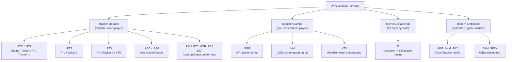

[← Home](../../README.md) · [Sound](../README.md) · [Trackers & Formats](README.md)

# AY Music Formats — The Complete Catalogue

> **Applies to**: All tracks. This article is the master reference for every AY/YM music file format in the ZX Spectrum ecosystem: tracker modules, register dumps, memory snapshots, and modern embedded formats. It is the capstone of the [Trackers & Formats](README.md) section — every other article in this folder deep-dives into one format; this article shows how they all relate.

---

## Overview

The ZX Spectrum AY music scene has produced **at least 20 distinct file formats** between 1985 and 2025. They fall into four broad categories:

Each category has a distinct purpose:

| Category | Editable? | Player needed? | Size for 3-min song | Typical use |
|---|---|---|---|---|
| **Tracker modules** | Yes — in their source tracker | Yes — format-specific | 2–20 KB | Composition, source-of-truth |
| **Register dumps** | No | No — generic ~20-byte player | 5–60 KB | Archival, cross-platform playback |
| **Memory snapshots** | No | The snapshot includes a player | 30–100 KB | Emulator-native playback |
| **Modern embedded** | Source `.aks` is editable; the player formats are not | Yes — but format is player-coupled | 2–8 KB | Game / demo integration |

The rest of this article catalogs every significant format in each category.

---

## Tracker Module Formats

Tracker modules are the **source-of-truth** format: they store musical intent (notes, instruments, patterns, song structure) and require a tracker-specific player routine to convert to AY register writes at runtime. Each on-Spectrum tracker defined its own module format; the fragmentation of the 1990s produced the long tail of formats cataloged here.

### The Pro Tracker / Vortex Lineage

The dominant module-format family. All four formats are produced by the Golden Disk Corp. / Bulba lineage documented in [Tracker History](tracker_history.md).

| Format | Tracker | Year | Magic / Extension | Notes |
|---|---|---|---|---|
| **`.STC`** | Sound Tracker 1.x | 1990 | `.STC` | The original AY module format. Read-only today — VTII imports |
| **`.ST1` / `.STP`** | Sound Tracker Pro, Pro Tracker 1.x | 1995–1996 | `.STP` | Pro Tracker 1's format. VTII imports |
| **`.PT2`** | Pro Tracker 2.x | 1995 | `.PT2` | Pro Tracker 2's format. VTII imports |
| **`.PT3`** | Pro Tracker 3.x, Vortex Tracker II | 1996–present | `.PT3`; magic `"PT3\r"` | **The de facto interchange format.** See [PT3 Format](pt3_format.md) for the full specification |

`.PT3` is the only one of these still actively produced. The others survive in archived modules and as import sources for VTII.

### The Asc Sound Master Family

| Format | Tracker | Year | Notes |
|---|---|---|---|
| **`.ASC`** | Asc Sound Master | 1992 | Andrew Sendetskiy's format. Common in mid-1990s Soviet clone scene |
| **`.AS0`** | Asc Sound Master 0.x | 1992 | Early sub-version variant. VTII distinguishes the two at import |

### Late On-Spectrum Formats (1995–1999)

These formats each have their own small libraries of modules — typically dozens to a few hundred each. None displaced PT3.

| Format | Tracker | Year | Author |
|---|---|---|---|
| **`.PSM`** | Pro Sound Maker | 1995 | Team V |
| **`.FTC`** | Fast Tracker | 1997 | Digital Reality |
| **`.GTR`** | Global Tracker | 1998 | Global Corp. |
| **`.PSC`** | Pro Sound Creator | 1999 | E-mage Group |
| **`.SQT`** | SQ-Tracker | 1993 | George K. |
| **`.FLS`** | Flash Tracker | 1996 | (Soviet clone scene) |
| **`.FXM`** | (FXM tracker) | 1998 | (Soviet clone scene) |

VTII imports all of these. None has a modern editor.

### Digital (Covox / General Sound) Formats

A separate family of module formats targets digital hardware rather than the AY. These store PCM samples and hardware-mixed playback instructions, not AY register sequences.

| Format | Tracker | Year | Target |
|---|---|---|---|
| **`.DMO`** | Digital Music Maker | 1995 | Covox / SounDrive |
| **`.DST`** | Digital Studio | 1995 | Covox / SounDrive |
| **`.GDM`** | Global Digital Music Editor | 1996 | General Sound coprocessor |
| **`.RFT`** | Riff Tracker | 1997 | Covox / SounDrive |
| **`.CHP`** | ZX Chip | 2004 | Covox / SounDrive |

These formats are read-only today. The [Sound Hardware Ecosystem Overview](../hardware/sound_overview.md) covers the hardware they target.

### Tracker Module Format Summary

| Property | All tracker modules |
|---|---|
| **Editable** | Yes — in the source tracker (or VTII for `.PT3`) |
| **Player** | Required — format-specific, ~300–700 bytes |
| **File size** | 2–20 KB for a typical 3-minute song |
| **Clock assumption** | Encoded in the module (PT3) or implicit (other formats) |

---

## Register Dump Formats

Register dumps are pre-rendered: the composer's module is "played through" once and the resulting stream of AY register writes is captured byte-by-byte. The resulting file needs no format-specific player — a generic ~20-byte loop writes the bytes to the chip. The trade-off is file size and the loss of editability.

### `.PSG` — The Base Format

| Property | Value |
|---|---|
| **Origin** | Atari ST demoscene, ~1989; adopted by ZX scene in early 1990s |
| **Magic** | `"PSG\x1A"` (`50 53 47 1A`) |
| **Frame size** | 14 bytes (one per AY register) |
| **Compression** | Single skip opcode (`0xFE N` repeats previous frame N+1 times) |
| **Frame rate** | Implicit — PAL 50 Hz by convention |
| **File size** | 30–60 KB for a 3-minute song |

Full specification: [PSG Format](psg_format.md).

### `.YM` — LZSS-Compressed PSG

| Property | Value |
|---|---|
| **Origin** | Atari ST demoscene, early 1990s |
| **Magic** | `"YM2!"`, `"YM3!"`, `"YM4!"`, `"YM5!"`, `"YM6!"` (sub-version markers) |
| **Frame size** | 14 bytes (same as PSG) |
| **Compression** | LZSS on the frame stream — typically 5× smaller than PSG |
| **Frame rate** | Explicit (header field) — typically 50 Hz (Atari ST) or 60 Hz (some MSX dumps) |
| **Clock** | Explicit — usually 2 MHz (YM2149 Atari ST) or 1.7734 MHz (ZX AY-3-8912) |
| **File size** | 5–15 KB for a 3-minute song |

The `.ym` format adds an LZSS decompressor (~200 bytes) on the player side, but in exchange gets explicit clock metadata and significantly smaller files. Modern archival favours `.ym` over `.psg` for these reasons. Five sub-versions exist (YM2 through YM6); YM5 is the most common in modern archives, adding richer metadata blocks (title, author, comment, loop point, chip type).

### `.VTX` — Variable-Length Compressed Dumps

| Property | Value |
|---|---|
| **Origin** | Sergey Bulba, ~2005 (VTII's secondary export format) |
| **Magic** | `"-VTX1-"` or `"-VTX2-"` |
| **Frame size** | 14 bytes (AY) or 28 bytes (TurboSound 2× AY) |
| **Compression** | Variable-length LZ-style, often outperforms YM's LZSS |
| **Frame rate** | Explicit |
| **File size** | 3–10 KB for a 3-minute song (smallest of the dump formats) |

VTX is a VTII-specific export, primarily used for TurboSound (6-channel) dumps. It is less widely supported than YM outside Bulba's own tools.

### Register Dump Format Summary

| Format | Compression | Clock stored? | Size for 3-min song | Player size |
|---|---|---|---|---|
| `.PSG` | Skip opcode only | Implicit (PAL) | 30–60 KB | ~20 bytes |
| `.YM` | LZSS (~5×) | Explicit | 5–15 KB | ~200 bytes |
| `.VTX` | LZ-variable | Explicit | 3–10 KB | ~300 bytes (TurboSound-aware) |

All three are **non-editable** — they capture a final register-write stream. To modify a dump, convert it back to a module format (or just re-render after editing the source module).

---

## The `.AY` Container Format

The `.ay` format is the most unusual entry in the catalog. It is **not** a register dump and **not** a pure module — it is a hybrid: a ZX Spectrum memory snapshot containing the original module plus its player routine, packaged with metadata so an AY-aware player can locate and execute them.

### Concept

An `.ay` file represents a snapshot of a Spectrum memory state at the moment the song starts playing. To play the song, the AY player software:

1. Loads the snapshot into a **minimal Z80 emulator** (the player does not emulate video, keyboard, or other hardware — just enough Z80 to run the player routine).
2. Hooks the emulated Z80's interrupt vector to call the player routine at the Spectrum's standard 50 Hz frame rate.
3. Captures the AY register writes the emulated routine produces.
4. Forwards those writes to the host's actual sound hardware (real AY chip, software synthesizer, or another emulator).

The advantage: **the original module plays exactly as it would on a real Spectrum**, including quirks of the source tracker's player routine. The format is universally usable for any AY music that was originally played via a Z80 routine — which is virtually all of it.

The disadvantage: playing an `.ay` file requires a Z80 emulator, making it unsuitable for embedded use (you would not put an `.ay` file inside a game — you would embed the original module directly).

### `.AY` File Layout

| Field | Size | Contents |
|---|---|---|
| Magic | 4 | `"ZXAYEMUL"` |
| File type | 1 | 0x10–0x16 (snapshot type marker: 16K, 48K, 128K, etc.) |
| Pointer to author | 2 | Offset of author string in file |
| Pointer to misc text | 2 | Offset of additional metadata string |
| Song count | 1 | Usually 1; can be more for multi-song modules |
| Pointer to song structure | 2 | Per-song metadata (name, location of player, init address, etc.) |
| Snapshot data | variable | The Spectrum memory contents (16K / 48K / 128K depending on file type) |
| Strings | variable | Null-terminated title, author, comment strings |

The song structure inside the file points to:

- **Player init address** — the Z80 routine entry point to call once with the song parameters
- **Player interrupt address** — the Z80 routine entry point to call every frame (50 Hz)
- **Stack pointer** — initial Z80 stack address for the player routine
- **Song data address** — where the module is located in the snapshot

### Player Software

The canonical `.ay` player is **`ay_emul`** by Sergey Bulba, available for Windows. Other significant players:

- **ZXTune** (cross-platform, supports `.ay` and many other formats)
- **aylet** (Unix, simple SDL-based)
- **Speccy.org online player** (browser-based)
- Most modern ZX emulators (ZEsarUX, fuse, Unreal) can also play `.ay` files directly

### `.AY` vs Other Formats

| Aspect | `.AY` | `.PSG` / `.YM` | `.PT3` |
|---|---|---|---|
| Player needed | Z80 emulator (~few KB) | ~20–200 byte loop | ~300–700 byte routine |
| Editable | No | No | Yes |
| Fidelity | Exact (runs the original player) | Exact (captured from a playthrough) | Depends on player used |
| Per-song metadata | Rich (title, author, comment) | Limited | Limited (title, author) |

`.ay` is the dominant format in modern AY music archives (`zxart.ee`, `zxtunes.com`, `modland.com`). It is the recommended format for archival because it preserves the original player routine alongside the module, ensuring exact playback indefinitely.

### `.SNDH` — The Atari ST Sibling

Worth mentioning alongside `.AY` is `.SNDH`, the Atari ST analog: a self-executing 68000 binary containing the player routine and module data. SNDH files run natively on Atari ST (or its emulators). The relationship of `.SNDH` to Atari ST music is the same as `.AY` to ZX Spectrum music — both are "self-contained playback snapshots" rather than pure modules or pure dumps.

---

## Modern Embedded Formats (2003–present)

The post-2003 generation of AY music software introduced a new category: **formats designed from the ground up for embedded use in games and demos**. Where `.PT3` is a 1990s format that happens to have a small player, these formats were designed around the constraints of the player first.

### The Arkos Tracker Format Family

Arkos Tracker (Julien Nevo / Targhan, 2003–present) is the dominant modern family. See [Arkos Tracker](arkos_tracker.md) for full details.

| Format | Use case | Size |
|---|---|---|
| **`.aks`** | Source format (XML-like) | Editor-only |
| **`.akg`** | General-purpose player — game soundtracks | ~600–900 bytes (player) + module |
| **`.akm`** | Minimal player — size-limited demos | ~400 bytes (player) + module |
| **`.aky`** | Fast player — demos, supports digidrums | Larger player + module |
| **`.akw`** | Skm-based export for WYSIWYG-style flow | Rare |
| **`.skm` / `.skzx`** | SKS-derived export for the SK Microsystems toolchain | Rare on ZX |

The Arkos family is **format-coupled with the player** — you cannot play a `.akg` file with a generic loop; you need the matching `.akg` player routine. The payoff is player efficiency: smaller code, faster execution, native multi-PSG support.

### WMS (Wanton Music Specification)

A less common modern format, used by some Western Spectrum homebrew. WMS modules are typically smaller than `.akg` but support fewer features.

### Modern Embedded Format Summary

| Property | All modern embedded formats |
|---|---|
| **Source format** | `.aks` (XML-like, fully editable in Arkos Tracker 2/3) |
| **Player formats** | Format-specific (`.akg`, `.akm`, `.aky`) — each ships with a specific player routine |
| **File size** | 2–8 KB for a 3-minute song (similar to PT3) |
| **Multi-PSG support** | Native in AT3's AKY and AKG (since ~2020) |
| **Editability** | Source `.aks` is editable; player exports are not |
| **Clock assumption** | Configurable at export (ZX 1.7734 MHz, Atari ST 2 MHz, MSX 1.789 MHz, etc.) |

---

## Master Comparison Table

Every format discussed above, side-by-side:

| Format | Category | Year | Editable | Size (3 min) | Still produced? |
|---|---|---|---|---|---|
| `.STC` | Module | 1990 | ✅ in original tracker only | 2–10 KB | ❌ Historical |
| `.STP` / `.PT1` | Module | 1995 | ✅ in PT1 only | 2–10 KB | ❌ Historical |
| `.PT2` | Module | 1995 | ✅ in PT2 only | 2–10 KB | ❌ Historical |
| `.PT3` | Module | 1996 | ✅ in VTII/VT3 | 2–20 KB | ✅ Active |
| `.ASC` / `.AS0` | Module | 1992 | ✅ in ASM only | 2–10 KB | ❌ Historical |
| `.PSM` `.FTC` `.GTR` `.PSC` `.SQT` `.FLS` `.FXM` | Module | 1993–1999 | Tracker-specific | 2–10 KB | ❌ Historical |
| `.PSG` | Dump | ~1989 | ❌ | 30–60 KB | ✅ Export target |
| `.YM` | Dump | early 1990s | ❌ | 5–15 KB | ✅ Export target |
| `.VTX` | Dump | ~2005 | ❌ | 3–10 KB | ✅ VTII export |
| `.AY` | Container | ~2000 | ❌ | 30–100 KB | ✅ Archival standard |
| `.SNDH` | Container | 1990s | ❌ | Variable | ✅ Atari ST only |
| `.AKG` `.AKM` `.AKY` | Embedded | 2003+ | ✅ source `.aks` | 2–8 KB | ✅ Active |

> [!TIP]
> For new work in 2025: use `.PT3` if you want maximum ecosystem compatibility (every AY player ever made can play it); use `.AKG` if you want the smallest player and tightest game integration. For archival of finished music, use `.AY`.

---

## Format Identification Guide

To identify an unknown AY music file, check the first few bytes:

| Magic bytes (first 4) | Format |
|---|---|
| `50 53 47 1A` ("PSG\x1A") | `.PSG` register dump |
| `59 4D 32 21` ("YM2!") | `.YM` version 2 |
| `59 4D 33 21` ("YM3!") | `.YM` version 3 |
| `59 4D 35 21` ("YM5!") | `.YM` version 5 (most common YM sub-version) |
| `59 4D 36 21` ("YM6!") | `.YM` version 6 |
| `2D 56 54 58` ("-VTX") | `.VTX` compressed dump |
| `5A 58 41 59` ("ZXAY") | `.AY` container (full magic: "ZXAYEMUL") |
| `50 54 33 0D` ("PT3\r") | `.PT3` module |

If the file starts with a HOBETA or TR-DOS header (17-byte or larger container), strip the wrapper and re-check. If the magic still doesn't match, the file is likely a `.PT2` (no magic — uses internal layout heuristics), `.ASC`, or another on-Spectrum format — VTII's auto-detect loader will identify it.

### Identifying by Extension

The extension alone is a reliable hint for most files, with two caveats:

- `.AY` files sometimes have `.emul` extension (older naming)
- `.PT3` files are sometimes stored as `.PT` (ambiguous — could be PT1 or PT2)

---

## Software Support Matrix

Which tools can read/write each format:

| Format | VTII | AT3 | `ay_emul` | ZXTune | ZX emulators |
|---|---|---|---|---|---|
| `.PT3` | ✅ RW | ❌ | ✅ R | ✅ R | ✅ (via embedded player) |
| `.PT2` `.PT1` `.STC` | ✅ R | ❌ | ✅ R | ✅ R | varies |
| `.ASC` `.AS0` `.PSM` `.FTC` `.GTR` `.PSC` `.SQT` | ✅ R | ❌ | varies | varies | varies |
| `.AKG` `.AKM` `.AKY` | ❌ | ✅ RW | ✅ R | varies | ✅ (via embedded player) |
| `.PSG` | ✅ W | ✅ W | ✅ R | ✅ R | varies |
| `.YM` | ❌ | ❌ | ✅ R | ✅ R | varies |
| `.VTX` | ✅ RW | ❌ | ✅ R | ✅ R | varies |
| `.AY` | ❌ | ❌ | ✅ RW | ✅ RW | ✅ RW |

Legend: R = read, W = write, RW = both, varies = depends on the specific sub-version.

VTII is the universal **reader** of legacy module formats. AT3 is the universal **writer** of modern embedded formats. `.AY` is the universal archival container.

---

## Cross-References

- [Tracker History](tracker_history.md) — the 30-year lineage of ZX music trackers
- [Vortex Tracker II](vortex_tracker.md) — the dominant PC-based PT3 editor
- [Arkos Tracker](arkos_tracker.md) — modern cross-platform AY tracker
- [PT3 Format](pt3_format.md) — the dominant module format deep dive
- [PSG Format](psg_format.md) — the dominant dump format deep dive
- [AY-3-8912 PSG Silicon](../hardware/ay_3_8912.md) — the chip whose register map underlies all formats
- [Player Routines](../players/README.md) — how modules are converted to register writes
- [Sound Hardware Ecosystem Overview](../hardware/sound_overview.md) — the hardware these formats target

## References

- [zxtunes.com software list](https://zxtunes.com/software_list.php) — authoritative catalog of on-Spectrum trackers
- [zxart.ee](https://zxart.ee/) — largest archive of AY music, indexed by format
- [Bulba's Vortex Project](https://bulba.untergrund.net/) — home of VTII and `ay_emul`
- [Arkos Tracker 3 on GitHub](https://github.com/ArkosTracker/arkestracker) — modern embedded format source
- [justsolve.archiveteam.org AY entry](https://justsolve.archiveteam.org/wiki/AY) — format identification for `.AY`
- [justsolve.archiveteam.org PSG entry](https://justsolve.archiveteam.org/wiki/PSG) — format identification for `.PSG`
- [Atari ST YM format reference](https://leonerd.net/ymformat/) — YM2/YM3/YM5 byte-exact documentation
- [Speccy.org AY format](http://www.speccy.org/ay-emul/) — Antonio Villena's original `.AY` format specification
