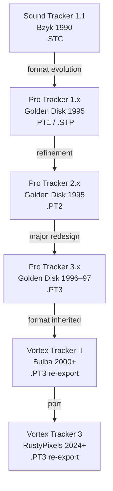

[← Home](../../README.md) · [Sound](../README.md) · [Trackers & Formats](README.md)

# Pro Tracker 1/2/3 — The Format-Defining Lineage (1995–1997)

> **Applies to**: All tracks. Pro Tracker (PT) by **Golden Disk Corp.** (St. Petersburg), released across versions 1.x (1995), 2.x (1995), and 3.x (1996–1997), is the **format-defining lineage** of ZX Spectrum AY music. The `.PT3` module format that PT 3.x established is the de facto interchange format for AY music 30 years later. Every later editor — Vortex Tracker II, Arkos Tracker (for PT3 import), VT3 — exists in relationship to PT3's design choices.

---

## Overview

Pro Tracker was the most consequential series of AY music trackers in the platform's history. Across four major versions released between 1995 and 1997, Golden Disk Corp. consolidated the fragmented 1990s AY tracker ecosystem onto a single format family. The final form — **PT 3.31 (1997)** — defined `.PT3`, the module format that [Vortex Tracker II](vortex_tracker.md) would later inherit, extend, and propagate to the present day.

The PT lineage is the **direct descendant** of [Sound Tracker 1.1](sound_tracker.md) (Bzyk, 1990). Golden Disk Corp. evolved PT1 from STC rather than designing from scratch — the basic block structure (header + position table + ornaments + samples + patterns) is ST 1.1's, refined and extended. Each PT version added capabilities and tightened the format until PT3 became the canonical form.

### Why Pro Tracker Matters

PT's influence on the ZX Spectrum AY ecosystem is structural — it defined the format that the rest of the ecosystem organized around:

- **The PT3 module format** — the de facto interchange format for AY music since 1996. See [PT3 Format](pt3_format.md) for the binary specification
- **The standard player routine** — PT3's ~300–700 byte Z80 player is embedded in virtually every game/demo that plays AY modules on real hardware. Bulba's VTII-era player is a direct evolution of Golden Disk Corp.'s PT3 player
- **The 32-sample / 16-ornament / 256-pattern / 64-row conventions** — the standard module capacity limits that every later format either inherited or explicitly exceeded
- **The per-module frequency table** — PT3's innovation that enabled cross-platform AY music (ZX vs Atari ST vs MSX vs custom)
- **The packed pattern encoding** — PT3's variable-length record format halved module file sizes versus STC/ASC's fixed-size records

### Naming Convention

| Term | Meaning |
|---|---|
| **PT / PT1 / PT2 / PT3** | Pro Tracker version 1 / 2 / 3 |
| **Golden Disk Corp.** | St. Petersburg software house — author of all four PT versions. Sometimes spelled "Golden Disc" |
| **`.PT1` / `.STP`** | PT 1.x module formats |
| **`.PT2`** | PT 2.x module format |
| **`.PT3`** | PT 3.x module format — the surviving standard |
| **Sample** | An instrument definition (volume + tone flags + envelope mode + pitch shift in PT3.4+) |
| **Ornament** | An arpeggio pattern (16 slots) |
| **Position table** | The list of pattern numbers defining song order |
| **PT3.51** | The sub-version VTII writes — the canonical modern PT3 layout |
| **Sub-version** | PT3's minor version (3.0, 3.3, 3.4, 3.5, 3.51) — affects header layout and pattern decoding |

---

## Golden Disk Corp.

Golden Disk Corp. (sometimes spelled **Golden Disc** in early English-language coverage; Russian: **Голден Диск**) was a St. Petersburg-based software house active in the mid-1990s Soviet clone scene. They are one of the most consequential development studios in the ZX Spectrum ecosystem despite their brief public visibility — their work defined the format infrastructure that the entire AY music scene now depends on.

### What Is Known

Golden Disk Corp. was a **collective or development studio** rather than a single individual. Unlike Bzyk (one author, identifiable) or Bulba (one author, identifiable), Golden Disk Corp. published under a corporate name and did not individualize credit. This is consistent with Soviet / Russian software development practice of the early 1990s, where work was often collective.

The studio's known outputs:

- **Pro Tracker 1.x** (1995) — `.PT1` / `.STP` module formats
- **Pro Tracker 2.x** (1995) — `.PT2` module format
- **Pro Tracker 3.0–3.31** (1996–1997) — `.PT3` module format
- **The PT3 player routine** — the reference Z80 player embedded in games/demos

After 1997, no further Golden Disk Corp. releases are recorded. The studio appears to have dissolved or moved on to other platforms as the Soviet clone scene contracted. PT development was effectively frozen at version 3.31 until Bulba released VTII in 2000 and began re-exporting PT3 from a PC-based editor.

> [!IMPORTANT]
> **Common authorship error**: Western sources (including Wikipedia until corrected) frequently credit **Sergey Bulba** as the author of Pro Tracker or the PT3 format. This is incorrect. **Golden Disk Corp.** authored all four PT versions and the PT3 format itself. Bulba's role began in 2000 with **Vortex Tracker II**, a separate PC-based editor that re-exports PT3 modules. See [Vortex Tracker II](vortex_tracker.md) for Bulba's actual contribution.

### Development Context

The mid-1990s Soviet clone scene was the peak of ZX Spectrum activity in the former USSR. The Pentagon and Scorpion clones had become cheap and widely available; an informal software-distribution network (BBS systems, swap meets, magazine cover disks) was active; and there was a meaningful market for serious software including games, demos, and tools.

St. Petersburg was one of the two main centers of Soviet clone activity (the other being Moscow). St. Petersburg developers had a distinctive aesthetic — more polished UI, more ambitious feature sets — that distinguished their work from Moscow-scene software. Pro Tracker exemplifies this: its UI was sophisticated for the time, and its feature roadmap across 1.x → 2.x → 3.x shows deliberate long-term planning rather than ad-hoc evolution.

### Distribution

PT shipped with several major Soviet clone distributions:

- **TR-DOS disk magazines** — the primary distribution channel for Soviet clone software in the mid-1990s
- **Companion disks with clone hardware** — Scorpion and ATM Turbo distributions bundled PT as the default music tool
- **Demo scene diskmags** — Spectrofon, Adventurer, and other diskmags reviewed and distributed PT

This broad distribution is part of why PT displaced [Asc Sound Master](asc_sound_master.md) (which had narrower distribution) within two years of PT3's release.

---

## Version History

Pro Tracker went through four major versions in three years. Each version refined the editing model and tightened the module format. The progression shows a clear design arc — Golden Disk Corp. had a roadmap.

| Version | Year | Module Format | Key Innovations |
|---|---|---|---|
| **PT 1.1** | 1995 | `.PT1` / `.STP` | First major iteration after ST 1.1. Reorganized header, added more sample slots |
| **PT 2.1** | 1995 | `.PT2` | Refined pattern packing, added more effects, larger pattern count |
| **PT 3.0–3.3** | 1996 | `.PT3` (early) | **Per-module frequency table** — enables cross-platform AY music. First PT3 release |
| **PT 3.4–3.5** | 1996–1997 | `.PT3` | Richer sample flags (pitch slides, per-frame frequency offsets). Header refinements |
| **PT 3.31** | 1997 | `.PT3` | Final Golden Disk Corp. release. The canonical on-Spectrum PT3 layout |
| **PT 3.51 (VTII)** | 2000+ | `.PT3` | VTII re-export layout — what almost all modern PT3 files use |

### The PT1 → PT2 → PT3 Design Arc

Each PT version had a clear purpose:

- **PT1 (1995)** was the **proof of concept** — could Golden Disk Corp. ship a better tracker than ST 1.1 / ASM? The answer was yes, but only incrementally. PT1's format (`.PT1` / `.STP`) is recognizably STC-derived
- **PT2 (1995)** was the **feature catch-up** — added the effects column, expanded sample/pattern counts, refined the editing UI
- **PT3 (1996–1997)** was the **platform-defining release** — introduced the per-module frequency table (enabling true cross-platform AY music), packed patterns for compact files, and the modern 32-sample / 256-pattern / 16-ornament layout

PT3's innovations were not just feature additions — they were **architectural changes**. The per-module frequency table in particular transformed AY modules from ZX-specific files into cross-platform music data.

### Why PT3 Was the Last On-Spectrum PT

PT 3.31 (1997) was Golden Disk Corp.'s final release. PT development stopped there, and three years later Bulba released Vortex Tracker II as a PC-based successor. The reasons PT3 was the last on-Spectrum version:

1. **The Soviet clone scene was contracting** — by 1997, cheap PCs were displacing Spectrum clones as the home computing platform of choice
2. **Editing on a real Spectrum had become limiting** — slow input, limited memory, no undo history. Composers were ready for PC-based tools
3. **PT3 was "good enough"** — the format had reached a stable plateau. Further on-Spectrum work would have added complexity without proportional benefit

The PT3 format survived its editor's end-of-life because it had become the **community standard**. When Bulba started VTII in 2000, re-exporting PT3 (rather than defining a new format) was the obvious choice — every existing AY module, every existing player routine, every existing tutorial already targeted PT3.

---

## Editing Model

PT ran entirely on the Spectrum (typically a Soviet clone with 128K or more RAM). The composer booted the tracker from TR-DOS disk, edited notes in the pattern grid, defined samples and ornaments, and saved to `.PT1`, `.PT2`, or `.PT3` depending on the PT version.

### The Pattern Grid

PT's main view followed the ST 1.1 / ASM convention — a 64-row × 3-channel grid of note entries:

```
       Channel A    Channel B    Channel C
Row 00  C-4 I01 V6   --- .. ..   --- .. ..
Row 01  --- .. ..    --- .. ..   --- .. ..
Row 02  E-4 I01 ..   --- .. ..   --- .. ..
Row 03  G-4 I01 ..   C-4 I02 V8  --- .. ..
...
Row 3F  === .. ..    === .. ..   === .. ..
```

PT's grid was recognizably the same as ST 1.1's, with one notable addition: an **effects column** (originally introduced in PT2). The effects column could carry volume slides, portamentos, vibrato, sample offsets, position jumps, and tempo changes — borrowed from the Amiga `.MOD` effect matrix. This made PT3 modules substantially more expressive than STC or ASC modules.

### Sample Editor

PT's sample editor was an evolution of ST 1.1's. Each sample frame encoded:

- Volume (4 bits, 0–15)
- Tone behavior flags
- In PT3.4+: **per-frame pitch shift** (the key PT3.4 innovation — enabled per-tick pitch slides within instruments)

PT3 supported **32 samples** (up from ST 1.1's 15 and ASM's 16), with samples stored as packed variable-length records rather than fixed-size records. This packing was a significant file-size optimization.

### Pattern Packing

PT3's most consequential format innovation was **packed pattern encoding**. ST 1.1 and ASM stored patterns as fixed-size records — one record per row per channel, with every field always present. PT3 introduced a **flags byte** at the start of each row:

- If the flags byte was `$00`, the row was empty (hold previous state) — single-byte encoding
- Otherwise, the flags byte specified which fields (note, sample, ornament, volume, effect) followed

This packed encoding **halved typical module file sizes**. Empty rows consumed 1 byte instead of 5; partially-empty rows consumed 2–3 bytes instead of 5. For typical AY music with many rests and held notes, the savings were substantial.

### Position Table and Loop

PT3's position table was an extension of ST 1.1's: a list of pattern numbers defining song order, terminated by a `$FF` sentinel, with a loop byte immediately after. This convention persists in modern VTII-written PT3 files.

See [PT3 Format — Position Table](pt3_format.md#position-table) for the byte-level specification.

---

## PT3's Key Innovations

PT3 introduced several innovations that distinguished it from ST 1.1 and ASM and made it the canonical AY module format.

### 1. Per-Module Frequency Table

The single most important PT3 innovation. Previous trackers hardcoded the frequency table (note-to-period lookup) in the player routine, assuming a single PSG clock. PT3 **stored the frequency table inside each module**, allowing each song to ship with the correct tuning for its target hardware.

| Target hardware | PSG clock | Frequency table |
|---|---|---|
| ZX Spectrum 128K / Soviet clones | 1.7734 MHz | Standard |
| ZX alternative (some Soviet clone variants) | 1.75 MHz | Alt-ZX |
| Atari ST | 2.0 MHz | Atari ST |
| Custom hardware | User-defined | Custom |

This enabled AY modules composed on one platform to be played on another — a flexibility that previous formats lacked. A PT3 module composed on a ZX Spectrum could be played on Atari ST with the correct pitch, provided the player used the module's frequency table rather than its own hardcoded one.

### 2. Packed Pattern Encoding

PT3's variable-length pattern records (see [Editing Model](#pattern-packing) above) reduced module file sizes by roughly 50% versus STC/ASC's fixed-size records. For a typical 3-minute song, this meant 3–5 KB instead of 6–10 KB — a meaningful savings on TR-DOS disks (800 KB capacity) and tape (where smaller = faster load).

### 3. Expanded Module Capacity

PT3 expanded the standard module limits:

| Resource | ST 1.1 / ASM | PT3 |
|---|---|---|
| Samples | 15–16 | **32** |
| Ornaments | 16 | 16 (unchanged) |
| Patterns | 31 | **256** |
| Pattern rows | 64 | 64 (unchanged) |
| Effects | 3–5 | **16** (full Amiga-MOD-derived set) |

These expansions enabled longer, more complex compositions. A PT3 symphonic piece could use 32 distinct instruments and 256 distinct patterns — well beyond what ST 1.1 could express.

### 4. The Standard Player Routine

Golden Disk Corp.'s PT3 player routine was the **reference implementation** embedded in virtually every Soviet-clone game/demo that played PT3 modules. The routine was small (~300–700 bytes), fast (~3000–5000 T-states per frame on Z80), and shipped with PT3 as source code. Bulba's later VTII-era player is a direct evolution of this routine.

The player's API was simple and consistent: `call init` once with HL pointing to the module, then `call play` once per frame. This made it trivial to embed in any program. See [PT3 Format — Player Routine Operation](pt3_format.md#player-routine-operation) for details.

### 5. Sub-Version Stability

PT3's format evolved through sub-versions 3.0 → 3.3 → 3.4 → 3.5 → 3.31 (Golden Disk Corp.) → 3.51 (VTII). Critically, **later sub-versions could read earlier ones** — a PT3.5 player could play PT3.0 modules with minor compatibility adjustments. This forward-compatibility is part of why the format survived: old modules kept working as the player evolved.

---

## Legacy and Successors

PT3's legacy is unique in the ZX Spectrum ecosystem: it is the only on-Spectrum format that became a **multi-decade community standard** that outlived its original editor.

### The Succession: VTII

When Sergey Bulba released Vortex Tracker II in 2000, he faced a strategic choice: define a new module format, or re-export PT3. He chose PT3 because:

1. **PT3 already had the largest module library** — thousands of compositions from 1996–2000
2. **PT3 already had the standard player routine** — embedded in countless games/demos
3. **Composers already knew PT3** — retraining them on a new format would have fragmented the scene

VTII's contribution was therefore not a new format but a **new editor** for the existing format. Bulba's VTII made PT3 composition accessible to PC-based composers, ensuring PT3's survival into the post-Spectrum era. See [Vortex Tracker II](vortex_tracker.md) for details.

### Modern PT3 Software

Today, PT3 modules can be:

- **Composed** in Vortex Tracker II (Windows), VT3 (cross-platform C# port), or converted from Arkos Tracker (via PT3 export filters)
- **Played** by any AY-aware player (ay_emul, ZXTune, AY Speccy, browser-based players)
- **Embedded** in new Spectrum software using Bulba's PT3 player routine (~600 bytes)
- **Archived** in `.AY` containers alongside their original player routines

The PT3 ecosystem in 2025 is healthier than it was in 1997 — more composers, more modules, more players, more cross-platform support. This is a direct consequence of Golden Disk Corp.'s design choices in 1996–1997 and Bulba's decision to extend rather than replace the format in 2000.

### The PT Format Family Tree



Each arrow represents a direct format or code lineage — VTII's PT3 output is recognizably descended from PT 3.31's PT3 output, which is descended from PT 2.x's `.PT2`, which is descended from ST 1.1's `.STC`. No competing format displaced this lineage.

### PT1 and PT2 Today

While `.PT3` is the surviving format, `.PT1` and `.PT2` modules survive in archives:

- **[zxart.ee](https://zxart.ee/)** — has a `.PT1` / `.PT2` / `.STP` filter for the archive
- **[zxtunes.com](https://zxtunes.com/)** — Soviet clone-era archive with extensive `.PT1` content
- **VTII** — imports `.PT1`, `.PT2`, and `.STP` and re-saves as `.PT3`

These early-PT modules (1995–early 1996) represent the **transition period** between the ST 1.1 / ASM era and the PT3 era. They show the design arc in progress — features that PT3 would refine are visible in nascent form in PT1, and PT2 shows intermediate steps.

### What PT Did Not Influence

For completeness, note what PT did **not** define:

- **Digital (Covox / General Sound) music** — these had their own tracker lineage (Digital Music Maker, Global Digital Music Editor, etc.); PT was AY-only
- **Beeper music** — the beeper had its own synthesis-focused tool ecosystem (Wham!, Music Synth 48K, later 1-bit engines)
- **Modern Arkos Tracker formats** — Julien Nevo's `.AKG` / `.AKM` / `.AKY` are a separate format family, designed from scratch for game embedding rather than as PT descendants

PT's scope was specifically the **AY/YM module ecosystem**, and within that scope its dominance is total.

---

## Cross-References

- [Tracker History](tracker_history.md) — the 30-year lineage of ZX music trackers (PT is the dominant on-Spectrum branch)
- [Sound Tracker 1.1](sound_tracker.md) — the predecessor whose format PT evolved
- [Asc Sound Master](asc_sound_master.md) — the contemporary alternative that PT displaced (1995–1997)
- [Vortex Tracker II](vortex_tracker.md) — the PC-based successor that inherited PT3 (2000+)
- [Arkos Tracker](arkos_tracker.md) — the modern alternative format family (`.AKG`, not PT-derived)
- [PT3 Format](pt3_format.md) — the byte-level specification of PT3 (the format PT3.x established)
- [AY Music Formats](ay_music_formats.md) — full format catalogue including `.PT1` / `.PT2` / `.PT3`
- [AY-3-8912 PSG Silicon](../hardware/ay_3_8912.md) — the chip whose register map PT3 drives

## References

- [zxtunes.com software list](https://zxtunes.com/software_list.php) — catalogue entries for Pro Tracker 1.x, 2.x, 3.x
- [zxart.ee PT archive](https://zxart.ee/) — searchable archive of `.PT1` / `.PT2` / `.PT3` modules
- [Bulba's Vortex Project](https://bulba.untergrund.net/) — home of VTII; documents PT3 lineage
- [Grimware PT3 source documentation](https://www.grimware.org/doku.php/sources/pt3) — byte-exact PT3 reference including sub-version differences
- [zx-pk.ru](https://zx-pk.ru/) — Soviet clone forum; extensive historical PT discussion in Russian
- [justsolve.archiveteam.org PT3 entry](https://justsolve.archiveteam.org/wiki/PT3) — format identification reference
- [SpeccyWiki — Pro Tracker](https://speccywiki.ru/) — Russian-language encyclopedia entry
