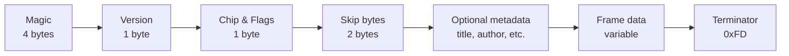

[← Home](../../README.md) · [Sound](../README.md) · [Trackers & Formats](README.md)

# PSG Format — The AY/YM Register Dump Specification

> **Applies to**: All tracks. The `.psg` format is a **register dump** — a stream of bytes captured from a hardware AY/YM chip's 14 registers, frame by frame. Unlike a module format (`.pt3`, `.akg`) which stores musical intent and requires a player routine to decode, a PSG file stores the **final register-write sequence** itself. Playback is trivial: write the bytes to the chip.

---

## Overview

The PSG format originated on the Atari ST demoscene in the late 1980s as a way to capture and replay YM2149 music without the overhead of a tracker module. The same format was adopted by the ZX Spectrum community in the 1990s as an **archival and interchange** format: any AY/YM music — regardless of which tracker produced it — could be "played through" once and the resulting register writes captured to a `.psg` file. The resulting file is player-independent: any software that can write to the AY registers can play a PSG file.

The trade-off versus a module format is fundamental:

| Property | Module format (`.pt3`, `.akg`) | Register dump (`.psg`) |
|---|---|---|
| **Contains** | Notes, instruments, patterns | Final register-write sequence |
| **Player needed** | Yes — format-specific, ~300–700 bytes | No — generic, ~20 bytes |
| **File size** | 2–20 KB for a 3-minute song | 30–60 KB for a 3-minute song |
| **Editable** | Yes — reopen in tracker | No — a flat byte stream |
| **Format-specific?** | Yes — each tracker has its own | No — universal |

PSG's niche is **archival and cross-software playback**. A composer working in Vortex Tracker II or Arkos Tracker can export to PSG knowing that the file will play identically in every emulator, every hardware clone, and every music archive player — without that player needing to understand the source format.

### File Identification

| Property | Value |
|---|---|
| **Extension** | `.psg` |
| **Magic bytes** | `PSG\x1A` — ASCII "PSG" followed by EOF byte (`50 53 47 1A`) |
| **File size** | ~10 KB/minute of music — a 3-minute song is typically 30–40 KB |
| **Byte order** | N/A — registers are single bytes |
| **Versions** | The format is versionless; the magic byte is followed by a version byte (`0`) in all known files |

---

## File Layout

A PSG file is a sequence of three regions: a fixed header, an optional metadata block, and the frame data stream.



### Fixed Header (8 bytes)

| Offset | Size | Field | Value |
|---|---|---|---|
| `#00` | 4 | **Magic** | `"PSG\x1A"` — `50 53 47 1A` |
| `#04` | 1 | **Version** | `0x00` (no other versions exist) |
| `#05` | 1 | **Chip / Flags** | `0x00` = AY-3-8910 (default). High bits encode optional chip variants in extended variants; most files use `0x00` |
| `#06` | 2 | **Skip bytes** | High byte: number of bytes to skip at end of each frame for high-resolution dumps. Usually `0x00 0x00`. Used by some Atari ST tools for additional YM data beyond register 13 |

After the fixed header, the file may contain **optional metadata** blocks. Each metadata block starts with a tag byte:

### Optional Metadata Tags

| Tag | Meaning |
|---|---|
| `0xFB` | **Title** — null-terminated ASCII string follows |
| `0xFA` | **Author** — null-terminated ASCII string follows |
| `0xF9` | **Comment** — null-terminated ASCII string follows |
| `0xF8` | **Loop position** — 2-byte little-endian frame index where playback should loop back to |

These tags appear after the fixed header and before the frame data. Files produced by older tools (pre-1995) typically have none — the metadata is empty.

### Frame Data Stream

After metadata (or directly after the header if no metadata), the frame data begins. Each frame is **14 bytes** representing the values of the 14 AY/YM registers at one playback tick (1/50 s on PAL, 1/60 s on NTSC). Frames are stored back-to-back with no separator.

The stream is terminated by the byte `0xFD`.

---

## Frame Structure

Each frame is **14 bytes**, one per AY/YM register, in register-number order `#0`–`#13`. The registers map exactly to the standard AY-3-8910 / YM2149 register file:

| Byte offset | Register | Function |
|---|---|---|
| `0` | `#0` | Channel A tone period — fine pitch (low 8 bits) |
| `1` | `#1` | Channel A tone period — coarse pitch (high 4 bits) |
| `2` | `#2` | Channel B tone period — fine pitch |
| `3` | `#3` | Channel B tone period — coarse pitch |
| `4` | `#4` | Channel C tone period — fine pitch |
| `5` | `#5` | Channel C tone period — coarse pitch |
| `6` | `#6` | Noise period (5 bits) |
| `7` | `#7` | **Mixer** — enables/disables tone and noise per channel (1 bit each, 6 active bits) |
| `8` | `#8` | Channel A volume (4 bits) + envelope-enable bit |
| `9` | `#9` | Channel B volume + envelope-enable bit |
| `10` | `#10` | Channel C volume + envelope-enable bit |
| `11` | `#11` | Envelope period — fine (low 8 bits) |
| `12` | `#12` | Envelope period — coarse (high 8 bits) |
| `13` | `#13` | Envelope shape (4 bits) — only written when changed |

See [AY-3-8912 PSG Silicon](../hardware/ay_3_8912.md) for the chip's register semantics. A PSG file is essentially a captured stream of state writes to this register file.

### Register 13 Quirk

AY register `#13` (envelope shape) has a special property: **writing to it resets the envelope generator**. The standard practice in PSG dumps is to write `0xFF` to register 13 in any frame where the envelope shape should *not* change — players detect `0xFF` as a "no write" sentinel and skip the register write. This preserves correct envelope-continue behavior.

A PSG player that does not implement this sentinel will audibly glitch envelope shapes on every frame.

### Frame Rate

PSG files do not store the frame rate. By convention, files produced for ZX Spectrum target **50 Hz** (PAL interrupt rate); files produced for Atari ST also target **50 Hz** (Atari ST's vertical blank). NTSC-targeted dumps at 60 Hz exist but are rare and conventionally tagged in the filename or comment metadata.

A player that plays a 50 Hz dump at 60 Hz will run the song 20% faster and a semitone sharp. The frame rate is implicit, not encoded.

---

## Frame Compression

A 3-minute song at 50 Hz is 9 000 frames × 14 bytes = 126 KB uncompressed — large for an 8-bit file format. PSG addresses this with a single **skip-frame opcode** that exploits the fact that many frames in chiptune music are identical to the previous frame (sustained notes, rests, slow envelopes).

### The `0xFE` Skip Opcode

If a frame's first byte is `0xFE`, the next byte is a **repeat count N**, and the player repeats the previous frame's register values **N+1 times** (i.e. writes the previous frame's 14 bytes N+1 times to the chip).

```
Frame 1:  [14 bytes]                  ← normal frame
Frame 2:  [14 bytes]                  ← normal frame (changed)
Frame 3:  [0xFE, 0x04]                ← repeat previous frame 5 times (N+1 = 4+1)
Frame 4:  [14 bytes]                  ← normal frame (changed)
Frame 5:  [0xFE, 0x00]                ← repeat previous frame 1 time (single dup)
```

The maximum skip is `0xFE 0xFF` = repeat 256 times. Beyond that, two skip opcodes in sequence are used.

### Other Special Bytes

| Byte | Meaning |
|---|---|
| `0xFD` | **End of song** — stop playback. If a loop position was set via metadata tag `0xF8`, the player jumps there instead of stopping |
| `0xFE` | **Skip opcode** — next byte gives repeat count (see above) |
| `0xFF` | **Sentinel** — not a valid first-byte of a frame in modern files. Used as the register-13 "no write" marker within a frame |

A first byte of `0x00`–`0xFC` is the start of a normal 14-byte frame.

### Compression Effectiveness

The skip opcode typically compresses PSG files to **40–60% of their raw size**. Songs with sustained notes compress better; songs with rapid arpeggios or continuous envelope modulation compress worse. The format is asymmetric: encoding is more complex than decoding (the encoder must detect frame-to-frame repetition), but decoding is just "if first byte is 0xFE, repeat previous; otherwise read 13 more bytes".

---

## Playback Routine

A PSG player is the simplest possible AY music player — typically **20–40 bytes of Z80 code**. The entire job is: read 14 bytes from the file, write them to AY registers `#0`–`#13`, then advance the file pointer.

### Pseudocode

```
init:
    hl = file_pointer  ; pointer to first frame data
    b  = 14            ; register counter
    c  = AY_data_port  ; e.g. 0xFF on Spectrum 128K

play_frame:
    ld   a, (hl)       ; read next byte
    cp   0xFD          ; end-of-song?
    jr   z, song_end
    cp   0xFE          ; skip opcode?
    jr   z, skip_frame
    ; -- normal frame: write 14 bytes to AY
    ld   e, 0          ; register index
write_loop:
    out  (c), a        ; select register
    inc  hl
    ld   a, (hl)       ; read value
    inc  c             ; point to data port
    out  (c), a        ; write value
    dec  c             ; back to register select
    inc  e
    ld   a, e
    cp  14             ; done?
    jr   nz, write_loop
    ret

skip_frame:
    inc  hl
    ld   a, (hl)       ; repeat count
    inc  hl
    ; ... (write previous frame N+1 times)
    ret

song_end:
    ; check for loop metadata, restart if present, else halt
```

A full implementation is roughly 40–60 bytes including the loop-position handling. This is **10× smaller than a typical module player** (300–700 bytes) and is the same for any PSG file regardless of the source tracker.

### Integration with Hardware

On a real ZX Spectrum 128K, the AY registers are written through the `#FFFD` / `#BFFD` port pair (register select + data write). On Atari ST, the YM2149 is memory-mapped at `0xFFFF8800.w` / `0xFFFF8802.w`. On modern FPGA cores (MiSTer, MiST), the AY ports are exposed at their original addresses. The PSG player code is identical across all these platforms except for the I/O instruction — making PSG dumps the most portable AY music format.

---

## Variants and Related Formats

PSG is one of several AY/YM register-dump formats that emerged in the late 1980s and 1990s. They differ in container details and compression but share the same fundamental approach.

| Format | Origin | Differences from PSG |
|---|---|---|
| **`.psg`** | Atari ST demoscene, ~1989 | The base format. No compression beyond `0xFE` skip |
| **`.ym`** (YM 2-5) | Atari ST demoscene | LZSS-compressed PSG. ~5× smaller. Adds explicit clock-rate metadata. Used extensively for Atari ST music archives |
| **`.sfm`** | ZX Spectrum demoscene | Variant storing additional non-AY chip state (e.g. TurboSound 2× AY, General Sound digital) |
| **`.as0` / `.asc` dump** | ZX Spectrum | Raw 14-byte frames, no header — used in early Asc Sound Master exports |
| **`.sndh`** | Atari ST | Hybrid format: 68000 code + data, self-executing on Atari ST. Not strictly a dump but plays the same role on Atari |

### `.YM` vs `.PSG`

The `.ym` format (specifically YM2 through YM5 sub-versions) is the most significant sibling. It adds LZSS compression, allowing typical songs to fit in **5–10 KB** rather than PSG's 30–60 KB. YM also stores the chip clock and frame rate explicitly, avoiding PSG's implicit-PAL assumption.

The trade-off: `.ym` requires an LZSS decompressor (~200 bytes) on the player side, breaking PSG's "20-byte player" simplicity. In practice, modern archival favours `.ym` for storage size; real-hardware playback favours `.psg` for player simplicity.

### The `.AY` Container

The `.ay` format (defined by Antonio Villena and the Speccy.org team, ~2000) is **not** a register dump — it is a container that wraps a module (typically PT3) plus a small Z80 player routine. The player runs on an emulated Z80 inside the AY player software, producing register writes on-the-fly. This is the format used by the canonical `ay_emul` player and the basis of most modern AY music archives.

See [AY Music Formats](ay_music_formats.md) for the full family tree including `.AY`, `.YM`, `.SNDH`, and the various tracker module formats.

---

## When to Use PSG

PSG is the right choice in a narrow but important set of scenarios:

| Use case | Recommendation |
|---|---|
| **Archiving finished music** for cross-platform playback | ✅ PSG — universal, no player routine needed |
| **Distributing in a ZX Spectrum game/demo** | ❌ Use `.pt3` + embedded player — 10× smaller |
| **Sharing work-in-progress with another composer** | ❌ Use the source tracker format (`.pt3`, `.aks`) — editable |
| **Converting from one tracker to another** | ✅ PSG as an intermediate — both can export/import |
| **Adding music to a non-ZX project** (Atari ST, MSX, FPGA) | ✅ PSG is the universal AY dump |
| **Capturing exact playback of an obscure format** no modern player supports | ✅ PSG is the universal "playthrough" target |

### Producing PSG Files

Both major PC-based trackers export PSG directly:

- **Vortex Tracker II**: `File → Export → PSG` — exports the current module as a register dump
- **Arkos Tracker 2/3**: `File → Export → PSG` — same
- **AY emulators** (`ay_emul`, `ZXTune`, `aylet`): can capture any input format to PSG via "record output" feature

VTII's PSG export is the canonical way to convert an existing `.pt3` library to a player-independent archive.

---

## Cross-References

- [PT3 Format](pt3_format.md) — the dominant module format that produces most PSG dumps
- [Vortex Tracker II](vortex_tracker.md) — primary tool for PT3 → PSG export
- [Arkos Tracker](arkos_tracker.md) — alternative tracker that also exports PSG
- [AY Music Formats](ay_music_formats.md) — full format family (`.AY`, `.YM`, `.SNDH`, modules, dumps)
- [AY-3-8912 PSG Silicon](../hardware/ay_3_8912.md) — the chip whose register map defines each frame
- [Player Routines](../players/README.md) — how PSG compares to other player formats in embedded use

## References

- [PSG format specification](https://www.smspower.org/Music/PSGFormat) — community-maintained reference at SMS Power
- [ay_emul documentation](https://bulba.untergrund.net/) — Bulba's AY emulator, the canonical PSG/AY player
- [Atari ST SNDH archive](https://sndh.atari.org/) — extensive archive of SNDH (PSG sibling) files for the Atari ST scene
- [Atari ST YM format reference](https://leonerd.net/ymformat/) — byte-exact YM2/YM3/YM5 documentation, including LZSS compression
- [justsolve.archiveteam.org PSG entry](https://justsolve.archiveteam.org/wiki/PSG) — format identification reference
