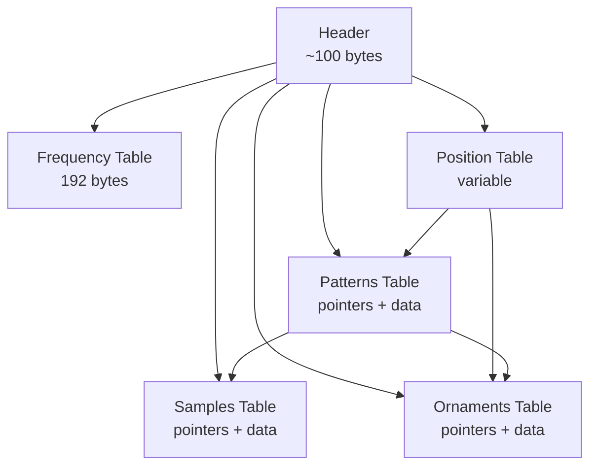
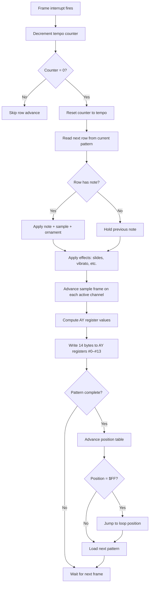

[← Home](../../README.md) · [Sound](../README.md) · [Trackers & Formats](README.md)

# PT3 Module Format — Pro Tracker 3 Binary Specification

> **Applies to**: All tracks. PT3 is the **de facto interchange format** for ZX Spectrum AY/YM music. Produced by Pro Tracker 3.x (Golden Disk Corp., 1996–1997) and Vortex Tracker II (Bulba, 2000–present). The format is open, has multiple independent player implementations, and is documented here as the canonical reference for ZX music archival.

---

## Overview

A `.pt3` file is a binary module containing everything needed to play one AY/YM song: the note patterns, the instrument definitions (called "samples" in PT3 parlance), the arpeggio patterns (called "ornaments"), the song sequence (the "position table"), and the frequency table that converts note names to AY periods. A typical PT3 player routine reads this file and writes 14 bytes to AY registers `#0`–`#13` each frame.

The format was designed for compactness and fast decoding on a 3.5 MHz Z80. It is **not** self-describing — the player routine contains hardcoded knowledge of the layout. A modern parser wanting to read PT3 generically must reproduce the exact indexing scheme used by the original player.

### File Identification

| Property | Value |
|---|---|
| **Extension** | `.pt3` |
| **Magic bytes** | `PT3` followed by carriage return + null (`"PT3\r\0"`) at offset 0 of the module (not always at file offset 0 — HOBETA wrappers add a header) |
| **File size** | Typically 2 KB – 20 KB; can exceed 30 KB for long multi-pattern songs |
| **Byte order** | Little-endian (Z80 native) |
| **Versions** | Sub-versions 3.0 through 3.7, identifiable by a version byte in the header. VTII always writes 3.51+ format. |

---

## Top-Level File Layout

A PT3 file is a sequence of blocks. The header contains pointers (16-bit little-endian addresses) to each block; the player follows these pointers at runtime. The blocks can appear in any order, but VTII always writes them in a canonical order.



### Block Summary

| Block | Purpose | Typical Size |
|---|---|---|
| **Header** | Module metadata + block pointers + initial register values | ~100 bytes |
| **Frequency Table** | Note-to-period lookup (96 notes × 2 bytes = 192 bytes) | 192 bytes |
| **Position Table** | List of pattern numbers defining song order | Variable (1–256 entries) |
| **Ornaments** | 16 ornament slots, each a list of pitch offsets | Variable |
| **Samples** | 32 sample slots, each an instrument definition | Variable |
| **Patterns** | Up to 256 patterns, each containing notes for 3 channels | Variable |

The total file size depends mainly on the number of patterns and the length of the samples. A simple 1-minute chiptune might be 3–5 KB; a long multi-movement piece can exceed 20 KB.

---

## Header Layout

The header is the first ~100 bytes of the module. Its layout has evolved slightly across PT3 sub-versions; the table below documents the **PT3.51+ layout** that VTII produces.

| Offset | Size | Field | Notes |
|---|---|---|---|
| `#00` | 4 | **Magic** | `"PT3\r"` — `50 54 33 0D` in hex |
| `#04` | 1 | **Version** | Sub-version byte (e.g. `51` = 3.51). Determines header layout details |
| `#05` | 32 | **Title** | Zero-padded ASCII title of the song |
| `#25` | 32 | **Author** | Zero-padded ASCII author/composer name |
| `#45` | 2 | **Pointer: Position Table** | Address (relative to module start) of the position table |
| `#47` | 2 | **Pointer: Ornaments Table** | Address of the ornaments table |
| `#49` | 2 | **Pointer: Samples Table** | Address of the samples table |
| `#4B` | 2 | **Pointer: Patterns Table** | Address of the patterns table |
| `#4D` | 2 | **Pointer: Frequency Table** | Address of the 192-byte note-to-period table |
| `#4F` | 1 | **Initial Tempo** | Default ticks-per-row (typical: `03`) |
| `#50` | 1 | **Initial Delay** | Counter for tempo (typical: `03`) |
| `#51` | 32 | **Initial Register Values** | Initial values for the 14 AY registers (`#0`–`#13`) |
| `#71` | ... | **Block data begins** | Position table, ornaments, samples, patterns follow in pointer-defined order |

> [!NOTE]
> The exact byte offsets above are simplified for clarity. The real PT3 header packs several fields more tightly and uses sub-version-specific layouts. For a byte-exact reference, see the **PT3 Player Source** (Bulba's release, available at [bulba.untergrund.net](https://bulba.untergrund.net/)) or the [Grimware PT3 source documentation](https://www.grimware.org/doku.php/sources/pt3).

### Frequency Table (192 bytes)

The frequency table is a 96-entry, 16-bit-value lookup mapping note indices (0–95, covering 8 octaves) to AY tone-period values. The PT3 format stores this table inside the module file itself, allowing each song to ship with the correct tuning for its target hardware.

VTII selects one of several built-in frequency tables when saving, based on the composer's chosen target:

| Table Name | PSG Clock | Used For |
|---|---|---|
| **ZX (standard)** | 1.7734 MHz | Original 128K/+2/+2A/+3, most Soviet clones |
| **ZX (alternative)** | 1.75 MHz | Some Soviet clone configurations |
| **Atari ST** | 2.0 MHz | Cross-platform Atari ST YM2149 music |
| **Custom** | User-defined | Exotic hardware, custom tuning |

When playing a PT3 module on different hardware, the frequency table determines the absolute pitch. A module composed for ZX 1.7734 MHz will play sharp on Atari ST 2 MHz unless the player re-derives the periods.

---

## Position Table

The **position table** is the song's sequence — an ordered list of pattern numbers telling the player which pattern to play at each step. It is the equivalent of the order list in a MOD file or the playlist in a DAW. The header's `Pointer: Position Table` field (offset `#45`) gives its location inside the module.

### Structure

Each entry in the position table is one byte, encoding a **pattern number** (0–255). The list is terminated by a sentinel byte `$FF` (255). A typical layout:

```
[pos 0] pattern #$00
[pos 1] pattern #$01
[pos 2] pattern #$01   ← pattern can repeat
[pos 3] pattern #$02
[pos 4] pattern #$01
[pos 5] #$FF           ← end-of-list sentinel
```

The first byte after the sentinel marks the **loop position** — the pattern number the player jumps to when it reaches the end of the song. A song that should loop back to the beginning has the loop position pointing at `pos 0`'s pattern; a song with a separate intro-then-loop structure has it pointing further into the list.

| Field | Encoding | Purpose |
|---|---|---|
| Pattern entries | 1 byte each, value 0–254 | Index into the patterns table |
| End-of-list sentinel | `$FF` (255) | Marks the last position |
| Loop position | 1 byte, follows the sentinel | Pattern number to loop back to |

### Pattern Length

Every pattern in PT3 has **64 rows** by default (named `00`–`3F` in the editor). This is hardcoded into the player; the position table does not store per-position lengths. VTII supports a per-song tempo that scales the row duration, but the row count itself is fixed. Composers who need shorter patterns simply leave the trailing rows empty (note-off at the desired row, silence afterwards).

### Example: A Simple Verse–Chorus–Verse Song

```
Position table: [00, 01, 02, 01, $FF], loop=00
Pattern 00: intro (8 rows of notes, 56 rows of silence)
Pattern 01: verse
Pattern 02: chorus
```

The player walks the list left-to-right: intro → verse → chorus → verse, hits `$FF`, reads loop byte `00`, and jumps back to pattern 00 (the intro) — giving an intro-then-loop-verse-chorus-verse structure.

> [!NOTE]
> Some PT3 sub-versions store the loop position differently (as a separate header field rather than after the sentinel). VTII-written 3.51+ modules use the sentinel-followed-by-loop-byte convention shown above.

---

## Ornaments

An **ornament** in PT3 is an arpeggio pattern — a list of signed pitch offsets (in semitones) applied to a note over successive rows. Ornaments are what produce the rapid chord-arpeggios and pitch-sweep effects characteristic of AY chiptune music. The name comes from Pro Tracker 3's UI; in other trackers the same concept is called an "arpeggio" or "pitch table".

The module has **16 ornament slots** numbered 0–15 (0 is conventionally the "no ornament" / straight-note slot). Each pattern row can select which ornament is active on each of the three channels.

### Ornament Encoding

Each ornament is stored as a list of signed bytes, one byte per row, terminated by a loop marker:

| Byte value | Meaning |
|---|---|
| `$00`–`$7F` (0–127) | Positive pitch offset in semitones (upward arpeggio) |
| `$80`–`$FE` (−128 to −2) | Negative pitch offset in semitones (downward arpeggio), in two's complement |
| `$FF` (255) | End-of-ornament marker — loop back to row 0 |

The most common ornament shapes:

- **Major chord arpeggio** — `[0, +4, +7, $FF]` (root, major third, fifth)
- **Minor chord arpeggio** — `[0, +3, +7, $FF]`
- **Octave-up arpeggio** — `[0, +12, $FF]`
- **Pitch slide up** — `[0, +1, +2, +3, +4, +5, +6, +7, $FF]` (one-semitone walk per row)

> [!IMPORTANT]
> The ornament value is an **index into the frequency table**, not a raw period. The player adds the ornament offset to the note index, then looks up the combined index in the 192-byte frequency table to get the AY period.

### Ornaments Table Layout

The ornaments table starts at the address in header offset `#47`. It is a list of 16 entries, each 2 bytes:

```
Ornament 0:  [addr_high, addr_low]   ← pointer to ornament 0's data
Ornament 1:  [addr_high, addr_low]   ← pointer to ornament 1's data
...
Ornament 15: [addr_high, addr_low]
```

Each pointer references the first byte of the ornament's data, which is then walked byte-by-byte until `$FF` is encountered. The data blocks themselves can be packed anywhere in the file; VTII typically writes them contiguously after the position table.

Ornament 0 is conventionally a single-byte `[0, $FF]` — "no arpeggio, play the note as written".

---

## Samples

A **sample** in PT3 is an **instrument definition** — *not* a PCM sample. The name is a historical artifact from Pro Tracker 1.x where the term was used loosely. A PT3 sample encodes two things:

1. A **volume envelope** — how loud the note is at each tick (attack, decay, sustain, release shape).
2. A **tone behavior** — whether the AY tone generator is on, off, or modulated in some way per tick.

The module has **32 sample slots** numbered 1–31 (slot 0 is conventionally unused or treated as "no instrument"). Each pattern row selects which sample is active on each channel.

### Sample Structure

A sample is a list of **frames**, where each frame represents one tick of playback (typically 1/50 s on PAL). The sample runs through its frames in sequence, optionally looping. Each frame encodes:

| Element | Bits | Meaning |
|---|---|---|
| **Volume** | 4 bits (0–15) | AY envelope amplitude for this tick. `$00` = silence, `$0F` = maximum |
| **Flags** | 4 bits | Bit field controlling tone generator, envelope generator, noise generator |

The flag bits control how the AY chip's three signal generators (tone, noise, envelope) interact for this frame:

| Bit | When set | When clear |
|---|---|---|
| Tone enable | Tone generator **off** for this frame (mute the pitch, leaving only noise/envelope) | Tone generator on (normal pitched note) |
| Noise enable | Noise generator on | Noise off |
| Envelope mode | Use AY hardware envelope generator (5 modes) | Use the volume field directly |
| (reserved) | — | — |

> [!NOTE]
> The exact bit assignment varies across PT3 sub-versions. PT3.4+ introduced a richer flag set enabling pitch-slides and per-frame frequency offsets. Bulba's reference PT3 Player Source documents the bit layout for each sub-version.

### Sample Looping

A sample can loop, allowing sustained notes (e.g. a continuous violin-like tone) without storing an unbounded number of frames. The loop is specified by two fields at the start of the sample data:

| Field | Size | Purpose |
|---|---|---|
| **Loop point** | 1 byte | Frame index to jump back to when reaching the end |
| **Length** | 1 byte | Total frame count before looping |

A plucked instrument (guitar, piano) typically has a short attack/decay and no loop, releasing into silence. A sustained instrument (organ, string pad) loops a small steady-state section indefinitely.

### Samples Table Layout

The samples table starts at the address in header offset `#49`. It is a list of 31 entries, each 2 bytes:

```
Sample 1:  [addr_high, addr_low]   ← pointer to sample 1's data
Sample 2:  [addr_high, addr_low]
...
Sample 31: [addr_high, addr_low]
```

Each pointer references the first byte of the sample's data (the loop-point/length header followed by the frame bytes). Sample 0 is conventionally a null pointer — "no instrument".

### Sample Example: A Simple Plucked Lead

```
Length:     16 frames
Loop point: 0 (won't be reached — no loop)
Frames:     $F0 $E0 $D0 $C0 $B0 $A0 $90 $80
            $70 $60 $50 $40 $30 $20 $10 $00
            [Tone on, no envelope, no noise — just decaying volume]
```

This produces a linear-decaying plucked tone — attack at full volume, linear fade to silence over 16 ticks. It is the most common shape for a melody instrument in AY chiptune music.

---

## Patterns

A **pattern** is a 64-row grid of notes, one row per playback tick-group (typically 1/50 s on PAL). Each row holds three channels of data — one per AY voice. The position table picks which pattern is active at each song position; the pattern itself defines what notes play within that position.

PT3 uses a **packed pattern encoding** to save space. A naive encoding (one fixed-size record per row per channel) would consume 64 rows × 3 channels × ~5 bytes = ~1 KB per pattern. PT3's packing typically gets this down to 100–300 bytes per pattern by exploiting two facts:

1. Most rows repeat the previous note/instrument (a held note).
2. Many rows are completely empty (rests).

### Channel Row Encoding

Each channel's row is encoded as a variable-length record. The first byte is a **flags byte** that tells the player which fields follow:

| Bit(s) | When set | Following bytes |
|---|---|---|
| Bit 7 | Note present | 1–2 bytes: note index |
| Bit 6 | Sample (instrument) change | 1 byte: sample number 1–31 |
| Bit 5 | Ornament change | 1 byte: ornament number 0–15 |
| Bit 4 | Volume change | 1 byte: volume 0–15 |
| Bit 3–0 | Effect command + data | 0–2 bytes: effect-specific |

A flags byte of `$00` means "empty row" — hold the previous note, sample, ornament, volume, no effect. This is the most common row type in real music.

### Note Encoding

Notes are stored as **semitone indices** into the frequency table (the 192-byte table at header offset `#4D`). The 96-entry table covers 8 octaves, indexed 0–95:

```
Note  0 = C-0 (lowest)
Note 12 = C-1
Note 24 = C-2
Note 36 = C-3 (middle C region)
...
Note 95 = B-7 (highest)
```

Special note values:

| Value | Meaning |
|---|---|
| `$00` (with bit 7 set in flags) | Rest / note-off — silence this channel from this row onward |
| `$01`–`$60` (1–96) | Valid note index (1-based in some sub-versions, 0-based in others) |
| `$D0`–`$EF` | "Tone slide to" — pitch-slide to a target note over N rows |

> [!NOTE]
> The note indexing convention (0-based vs 1-based) is one of the differences between PT3 sub-versions. The 1.7734 MHz frequency table is always 96 entries of 2 bytes each = 192 bytes total, but the player must use the correct base offset.

### Effects Column

The lower nibble of the flags byte encodes an **effect command**. The most common:

| Code | Effect |
|---|---|
| `$0` | No effect |
| `$1` | Portamento up (pitch slide upward) |
| `$2` | Portamento down |
| `$3` | Tone portamento (slide to target note) |
| `$4` | Vibrato (oscillate pitch) |
| `$5` | Tone portamento + volume slide |
| `$6` | Vibrato + volume slide |
| `$9` | Sample offset (jump to a specific frame in the instrument) |
| `$B` | Position jump (skip to a different position-table entry) |
| `$C` | Set volume |
| `$D` | Pattern break (jump to a specific row in the next pattern) |
| `$E` | Extended effects (sub-command in the data byte) |
| `$F` | Set tempo (change ticks-per-row) |

This is essentially the same effect matrix as the original Pro Tracker, which in turn derived it from the Amiga `.MOD` format convention. Composers familiar with Amiga trackers will recognize the effect set immediately.

### Patterns Table Layout

The patterns table starts at the address in header offset `#4B`. It is a list of pointers, one per pattern (variable count — the position table determines how many are reachable):

```
Pattern 0:  [addr_high, addr_low]   ← pointer to pattern 0's data
Pattern 1:  [addr_high, addr_low]
Pattern 2:  [addr_high, addr_low]
...
```

Each pattern's data is a sequence of 64 rows × 3 channels of packed records, terminated by the player's row counter (the player simply reads exactly 64 rows and stops). Channels are interleaved per row: row 0 channel A, row 0 channel B, row 0 channel C, row 1 channel A, etc.

### Decoding Example

A simple 4-row pattern (rest of the 60 rows would be empty):

```
Row 0, Ch A: [$C0, $24, $01]   ← Note C-3, sample 1
Row 0, Ch B: [$00]             ← empty (rest)
Row 0, Ch C: [$00]             ← empty (rest)
Row 1, Ch A: [$00]             ← hold previous note
Row 1, Ch B: [$C0, $24, $02]   ← Note C-3, sample 2
Row 1, Ch C: [$00]
...
```

The first byte of each record tells the player how many more bytes to read. Empty rows consume a single byte; full note-on rows consume 3–4 bytes. This packing is what makes PT3 files compact.

---

## Player Routine Operation

A PT3 player is a small Z80 routine (~300–700 bytes for the standard VTII player, smaller for stripped-down variants) that converts a `.pt3` module into a stream of register writes to the AY chip. It is called once per frame — typically hooked into the Spectranet interrupt, the RST $38 vector, or a game's vertical-blank handler.

### The Playback Loop

Each call to the player performs these steps:



### Per-Channel Processing

For each of the three AY channels (A, B, C), the player maintains a small per-channel state block:

| State | Purpose |
|---|---|
| Current note | The base pitch (semitone index, 0–95) |
| Current sample | The active sample (instrument) number |
| Current sample frame | Which frame of the sample's envelope is being played |
| Current ornament | The active ornament number |
| Current ornament frame | Which row of the ornament is being applied |
| Current volume | The amplitude to write to the AY volume register |
| Effect state | Scratch space for vibrato depth, slide target, etc. |

The final AY period written for a channel is:

```
period = frequency_table[note + ornament_offset]
```

The volume written is the sample frame's volume field, possibly modified by effects (volume slides, tremolo).

### Tempo and Tick Counting

PT3's tempo is expressed as **ticks per row** — the number of frame interrupts that must elapse before the player advances to the next row in the pattern. The header's "Initial Tempo" byte (offset `#4F`) sets this at startup; the `$F` effect can change it mid-song.

A tempo of `03` (typical) means: three frames pass before each row advances. At PAL's 50 Hz frame rate, this gives ~16.7 rows per second, or roughly 4 beats per second at 4 rows per beat — a typical chiptune tempo of ~240 BPM.

### The Standard Player Routine

The de facto embedded player is **Bulba's PT3 Player**, shipped with VTII and used in virtually every Spectrum game/demo that plays PT3 modules on real hardware. Its characteristics:

- **Size**: ~600 bytes (full version with all effects) down to ~300 bytes (stripped minimal version)
- **Speed**: ~3000–5000 T-states per frame on Z80 — under 1% of CPU time at 3.5 MHz
- **RAM**: ~50 bytes of zero-page state for the per-channel blocks
- **API**: typically `call init` once with HL → module address, then `call play` once per frame

Several alternative players exist (e.g. the ZX Spectrum 48K-specific AY player used in some demos), but Bulba's is the canonical reference.

---

## Sub-Version Differences

PT3 went through several sub-versions during Pro Tracker 3's 1996–1997 development, and VTII later refined the layout further. A robust parser must check the header version byte (offset `#04`) before interpreting the rest of the file.

| Version | Year | Producer | Key Changes |
|---|---|---|---|
| **3.0–3.3** | 1996 | Golden Disk Corp. | Original release family. Sample flags were simpler; no per-frame pitch offset |
| **3.4** | 1996 | Golden Disk Corp. | Added richer sample flags (pitch slides, frequency offsets per frame) |
| **3.5** | 1997 | Golden Disk Corp. | Final Golden Disk release. Refined header layout; added new effects |
| **3.51** | 2000+ | VTII (Bulba) | The **canonical modern layout**. VTII writes this version. Almost all new PT3 modules since 2005 are 3.51 |
| **3.6 / 3.7** | — | (experimental) | Rare experimental sub-versions, mostly abandoned. Encountered only in 1997–1998 demos |

The most important practical distinction is **pre-3.5 vs 3.5+**. Pre-3.5 modules (rare today) use a slightly different sample flag layout and may store some header fields at different offsets. Anything written by VTII is 3.51 and uses the layout documented in this article.

VTII's **universal import** is what makes the sub-version question mostly moot in practice: any pre-3.5 module loaded into VTII is silently re-saved as 3.51 on next save. The historical sub-versions survive only in archived 1996–1997 modules.

---

## Parsing Notes

A modern parser wanting to read PT3 files generically (for archival, conversion, or visualization) must reproduce the original player's decoding logic. The following pitfalls are the most common:

### 1. Check the Magic Bytes First

Some PT3 files are wrapped in HOBETA or SCL container formats. The 4-byte `PT3\r` magic may not appear at file offset 0. A robust parser should:

1. Read the first 4 bytes.
2. If they match `50 54 33 0D` ("PT3\r"), parse directly.
3. Otherwise, scan for the magic within the first ~16 bytes (HOBETA header is 17 bytes; the module starts after).
4. If still not found, reject as not-a-PT3.

### 2. Validate the Version Byte

The version byte at offset `#04` must be in the range `$30`–`$37` (ASCII '0'–'7', representing PT3.0–PT3.7) or `$51` (the constant VTII uses for 3.51). Any other value indicates a corrupt or non-standard file.

### 3. Don't Trust the Header Pointers Blindly

The five block pointers (position, ornaments, samples, patterns, frequency) point to addresses **relative to the module start**, not to file offsets. If the module is wrapped in a HOBETA header, the parser must subtract the wrapper size. Most published PT3 files are stored "raw" (no wrapper), but archived SCL/TRD images often include wrappers.

### 4. Pattern Decoding Requires Sub-Version Awareness

The packed pattern record format (the flags byte and its trailing fields) changed slightly between sub-versions. A 3.4+ parser will misread 3.3 patterns. The safest approach is to read the version byte and dispatch to a sub-version-specific decoder.

### 5. Frequency Tables Are Not Always 1.7734 MHz

A module's frequency table tells you its intended playback clock. A parser converting PT3 to MIDI or to a different PSG clock must read the actual table values rather than assume a fixed period-to-note mapping. Many Soviet-clone modules were composed for 1.75 MHz hardware; Atari ST YM2149 modules use 2 MHz.

### 6. Loop Position vs Loop Pattern

VTII-written 3.51 modules place the loop position byte immediately after the `$FF` sentinel (see [Position Table](#position-table)). Earlier sub-versions may use a separate header field. Some pre-3.5 modules even use a different sentinel value. Validate the loop position is a valid pattern index; if not, fall back to looping to position 0.

### 7. TurboSound Modules Are Two PT3 Files

A `.ts` TurboSound module is simply two PT3 modules concatenated with a small wrapper. Each sub-module is independently parseable as a PT3 file. The two share a single position table in the canonical TS format, but the wrapper variant matters.

---

## Cross-References

- [Tracker History](tracker_history.md) — the 30-year lineage of ZX music trackers
- [Vortex Tracker II](vortex_tracker.md) — the PC editor that produces most modern PT3 files
- [Arkos Tracker](arkos_tracker.md) — alternative format family (`.akg`, `.aky`) for game developers
- [PSG Format](psg_format.md) — alternative "register dump" format (no player routine needed)
- [AY Music Formats](ay_music_formats.md) — comprehensive catalogue including `.AY`, `.EMUL`, `.SNDH`
- [AY-3-8912 PSG Silicon](../hardware/ay_3_8912.md) — the chip whose register map PT3 drives
- [Player Routines](../players/README.md) — embedded player architecture in depth

## References

- [Bulba's Vortex Project](https://bulba.untergrund.net/) — canonical VTII distribution, includes the standard PT3 player source
- [Grimware PT3 source documentation](https://www.grimware.org/doku.php/sources/pt3) — byte-exact PT3 reference, including sub-version differences
- [zxtunes.com](https://zxtunes.com/) — large archive of PT3 modules for analysis
- [zxart.ee](https://zxart.ee/) — searchable archive of AY music, indexed by format and tracker
- [justsolve.archiveteam.org PT3 entry](https://justsolve.archiveteam.org/wiki/PT3) — format family overview and identification
