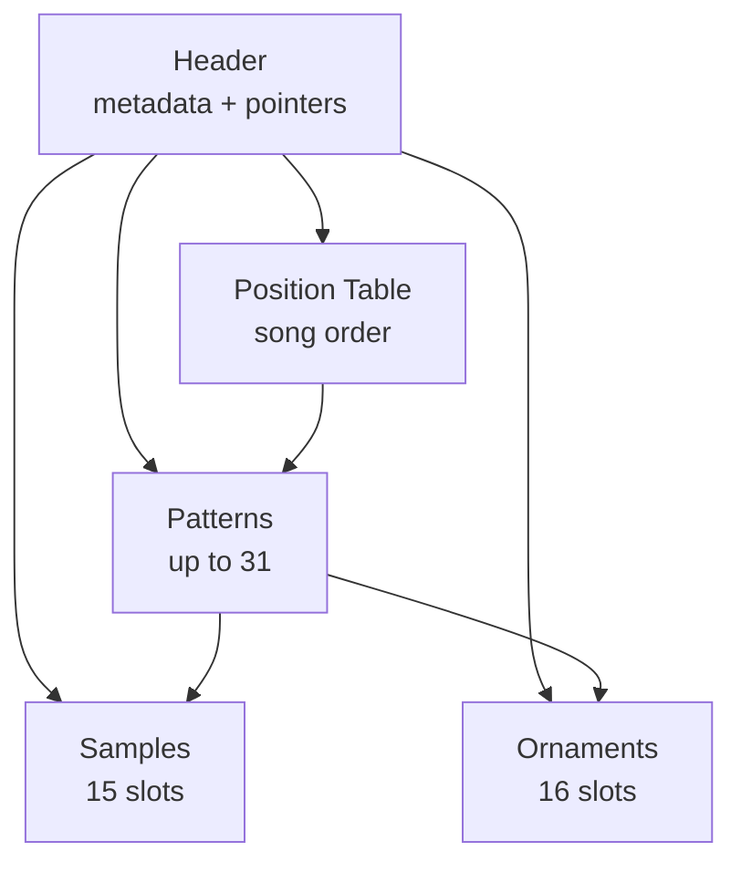

[← Home](../../README.md) · [Sound](../README.md) · [Trackers & Formats](README.md)

# Sound Tracker 1.1 — The First AY Grid Editor (1990)

> **Applies to**: All tracks. Sound Tracker 1.1 (ST 1.1) by Jarek Burczynski (handle: Bzyk), released 1990 in Poland, is the **earliest AY-3-8912 music editor** to use the pattern-grid paradigm that every later ZX Spectrum AY tracker would inherit. It produced the `.STC` module format — the direct ancestor of `.PT1`, `.PT2`, and ultimately `.PT3`.

---

## Overview

Before 1990, ZX Spectrum music software targeted the 48K beeper (Wham! The Music Box, Music Synth 48K) or treated the AY chip as a sound-effects peripheral of game engines. **Sound Tracker 1.1** was the first program to apply the **Amiga MOD paradigm** — patterns, channels, notes-as-numbers, instrument definitions, a position table for song structure — to the Spectrum's AY-3-8912 chip.

ST 1.1 was written by **Jarek Burczynski** under the handle **Bzyk**, a Polish developer. Poland had an unusually early and active Spectrum demoscene, and ST 1.1 reflects the demoscene's exposure to Amiga trackers (Ultimate Soundtracker, 1987; NoiseTracker, 1989) via the parallel Atari/Amiga scenes active in late-1980s Central Europe.

The program ran on the **ZX Spectrum 128K** family (128K, +2, +2A, +3) and the Soviet clones that followed (Pentagon, Scorpion, Kay). It supported three channels of AY music — one per PSG tone channel — with up to 15 simultaneous "samples" (instrument definitions) and 16 "ornaments" (arpeggio patterns). The editing model it established in 1990 is recognizably the same model VTII uses today in 2025.

### Why It Matters

ST 1.1's contributions to the ZX Spectrum ecosystem are foundational:

- **The pattern-grid editing paradigm** for AY music — every later AY tracker (Pro Tracker, SQ Tracker, Asc Sound Master, Vortex Tracker II, Arkos Tracker) uses it.
- **The `.STC` module format** — the first self-contained AY music file format. Vortex Tracker II still imports `.STC` files 35 years later.
- **The terminology** — "sample" for instrument, "ornament" for arpeggio, "position table" for song order — became PT3 vocabulary and persists in the modern AY ecosystem.
- **The composer workflow** — edit on the host machine, save to a module file, embed a small player routine in any program. Every later AY tracker follows this workflow.

### Naming Convention

| Term | Meaning |
|---|---|
| **ST 1.1** | Sound Tracker version 1.1 — the canonical abbreviation |
| **Bzyk** | Jarek Burczynski's scene handle (Polish for "bumblebee") |
| **`.STC`** | Sound Tracker Compiled — ST 1.1's module format |
| **Sample** | An instrument definition (envelope + volume shape), *not* a PCM sample. ST 1.1 introduced this terminology to the AY world |
| **Ornament** | An arpeggio pattern — a list of pitch offsets applied to a note. ST 1.1's term, inherited by PT3 |
| **Position table** | The list of pattern numbers defining song order. ST 1.1's term, inherited by PT3 |

---

## History and Authorship

### The Polish Spectrum Scene

The Polish ZX Spectrum demoscene of the late 1980s was, alongside the Soviet scene, one of the two most active in the Eastern Bloc. Where the Soviet scene converged on the Pentagon clone after 1991, Poland used both genuine Sinclair hardware (imported through Polish diaspora channels) and Eastern-made clones like the Elwro (a Polish 48K-compatible). Combined with easy cross-border access to West German and Scandinavian computer culture, Polish Spectrum developers had early exposure to the Amiga demoscene.

The Amiga's **Ultimate Soundtracker** (Karsten Obarski, 1987) and its successor **NoiseTracker** (1989) defined what "tracker software" meant: a grid-based editor where the composer enters notes as letters and numbers (C-4, D#4, etc.), instruments are referenced by number, and the song is a sequence of patterns. This was a radical departure from earlier music software that used piano-roll or step-sequencer interfaces.

### Bzyk's Contribution

**Jarek Burczynski** (handle: **Bzyk**) released Sound Tracker 1.0 in early 1990 and the widely-distributed 1.1 update later that year. ST 1.1 was the version that escaped Poland and reached the wider European Spectrum community, including the Soviet Union where it would have its largest influence. ST 1.1's design choices reflect a careful translation of Amiga tracker concepts to the very different AY-3-8912 hardware:

| Amiga MOD concept | ST 1.1 adaptation |
|---|---|
| 4 channels of sampled audio | **3 channels** (AY's three tone generators) |
| Sampled instruments (`.SAM`/`.INST` files) | **Synthesized instruments** (volume envelope + tone controls) — AY had no sample playback |
| Per-note volume column | **Per-note instrument selector** (volume is part of the instrument) |
| 64-row patterns | **64-row patterns** (same convention) |
| Song sequence as pattern list | **Position table** (same concept, ST 1.1's name) |

The crucial adaptation was the **synthesized instrument**. Amiga instruments were PCM samples; the AY chip cannot play PCM samples (it generates square waves via frequency dividers). Bzyk's solution — encode instruments as a list of per-tick volume + tone-behavior values — became the **PT3 "sample"** definition and persists unchanged in modern VTII.

### Timeline

| Year | Event |
|---|---|
| 1987 | Ultimate Soundtracker released on Amiga — establishes the tracker paradigm |
| 1989 | NoiseTracker released on Amiga — refined tracker UI spreads in demoscene |
| **Early 1990** | Bzyk releases Sound Tracker 1.0 in Poland |
| **Late 1990** | Sound Tracker 1.1 released — the canonical version that spreads across Europe |
| 1991–1992 | ST 1.1 reaches the Soviet Union; Pentagon clones become the dominant Soviet-clone platform |
| 1992 | Asc Sound Master (ASC) released in Soviet scene — alternative AY tracker, contemporary of ST 1.1 |
| 1995 | Golden Disk Corp. releases Pro Tracker 1.x — direct successor to ST 1.1 |
| 1996 | Pro Tracker 3.x releases, `.PT3` format supersedes `.STC` |
| 2000+ | Vortex Tracker II imports `.STC` — 30+ years after ST 1.1's release |

### What ST 1.1 Replaced

Before ST 1.1, Spectrum AY music was composed primarily in one of three ways:

1. **BASIC PLAY statements** — slow, limited, used in early commercial games
2. **Hand-coded Z80 routines** — a programmer wrote specific note sequences as `LD A, freq / OUT (reg), A` instructions. No composition tool, just direct code
3. **Game-engine-specific editors** — some games shipped with their own internal music editors, but the output only worked with that game's player

ST 1.1 made AY music composition accessible to **musicians**, not just programmers, and produced modules that could be played by **any** program that embedded the player routine. This decoupling of editor from player is ST 1.1's most lasting architectural contribution.

---

## Editing Model

ST 1.1 ran entirely on the Spectrum — there was no PC counterpart. The composer booted the tracker from tape or disk, edited notes directly using the Spectrum keyboard, previewed through the machine's own AY chip, and saved the result as an `.STC` module.

### The Pattern Grid

The main editing view was a **pattern grid** — a tabular display of 64 rows × 3 channels, with each cell containing a note entry:

```
       Channel A    Channel B    Channel C
Row 00  C-4 I01 ..   --- .. ..   --- .. ..
Row 01  --- .. ..    --- .. ..   --- .. ..
Row 02  E-4 I01 ..   --- .. ..   --- .. ..
Row 03  --- .. ..    --- .. ..   --- .. ..
Row 04  G-4 I01 ..   C-4 I02 ..  --- .. ..
...
Row 3F  === .. ..    === .. ..   === .. ..
```

Each cell has three columns:

| Column | Format | Meaning |
|---|---|---|
| **Note** | `C-4`, `D#4`, `---` (rest), `===` (note-off) | The pitch in tracker notation (letter, optional sharp, octave) |
| **Instrument** | `I01`–`I0F` or `..` (hold previous) | The sample (instrument) number to switch to |
| **Effect** | `..` or effect-specific | Optional effect code (volume slide, arpeggio, etc.) — ST 1.1's effect set was minimal compared to PT3 |

Notes were entered by keyboard — pressing `C` in the note column produced `C-4`, `C` again produced `C-5`, etc. The composer navigated the grid with the cursor keys (or their Spectrum equivalents: Caps Shift + 5/6/7/8).

### Patterns and the Position Table

A **pattern** was a complete 64-row grid for all three channels. ST 1.1 supported up to 31 patterns (numbered 0–30). The composer built a complete song by arranging patterns into a **position table** — a list specifying which pattern plays in which order:

```
Position 0: play pattern #00 (intro)
Position 1: play pattern #01 (verse 1)
Position 2: play pattern #02 (chorus)
Position 3: play pattern #01 (verse 2)
Position 4: play pattern #02 (chorus)
Position 5: play pattern #03 (outro)
```

A pattern could appear multiple times in the position table — the same verse pattern could play twice with different lyrics or visuals in the surrounding game/demo. This pattern-reuse convention was inherited directly from Amiga MOD and is the same in PT3 and VTII today.

### Samples (Instruments)

The **sample editor** was a separate screen where the composer defined instrument shapes. A sample in ST 1.1 was a list of per-tick entries, each specifying:

- A volume (0–15)
- A tone-behavior flag (tone on, tone off, envelope on, etc.)
- An optional pitch offset

A typical plucked instrument had a high initial volume decaying to zero over ~16 ticks. A sustained instrument (organ, pad) looped a small steady-state section indefinitely. ST 1.1 supported up to 15 samples per module.

### Ornaments (Arpeggios)

The **ornament editor** was another screen where arpeggio patterns were defined. An ornament was a list of semitone offsets applied to a note over successive rows:

```
Ornament #1: [0, +4, +7, $FF]   ← major chord arpeggio (root, third, fifth, loop)
Ornament #2: [0, +12, $FF]      ← octave arpeggio
```

Up to 16 ornaments could be defined. Each pattern row could select which ornament was active on each channel — the same paradigm as PT3 today.

### Tempo and Playback

ST 1.1 used a fixed **ticks-per-row** tempo model (the same model PT3 uses). The composer specified how many frame interrupts elapsed before the pattern advanced to the next row. At PAL's 50 Hz frame rate, a tempo of 3 (= 3 frames per row) gave roughly 240 BPM in 4/4 time — a typical chiptune tempo.

Previewing music was instant: the composer pressed play, and the AY chip played the current pattern or the full song in real time. There was no offline rendering — what the composer heard was exactly what would play in the final game or demo.

---

## The `.STC` Module Format

The `.STC` file format was ST 1.1's native module format. It is the direct ancestor of Pro Tracker's `.PT1`/`.PT2`/`.PT3` formats — Golden Disk Corp. evolved PT3 from STC rather than designing from scratch. Understanding `.STC` helps explain several otherwise-arbitrary PT3 design choices.

### Block Layout

Like PT3, an `.STC` file is a sequence of blocks referenced by pointers in a header:



The block structure is recognizably the same as PT3 — header, position table, ornaments, samples, patterns. PT3 added a frequency table block and reorganized some header fields, but the bones are ST 1.1's.

### Differences from PT3

| Aspect | `.STC` (ST 1.1, 1990) | `.PT3` (Pro Tracker 3 / VTII) |
|---|---|---|
| **Header size** | Smaller — no frequency table pointer, no author field | Larger — includes title, author, all five block pointers |
| **Frequency table** | Hardcoded in the player routine (ZX 1.7734 MHz assumption) | **Stored in the module** — supports ZX, Atari ST, custom clocks |
| **Sample slots** | 15 | 32 |
| **Ornament slots** | 16 | 16 (unchanged) |
| **Pattern count** | Up to 31 | Up to 256 |
| **Effects** | Minimal (volume, arpeggio, basic portamento) | Full set (`$0`–`$F`, derived from Amiga MOD) |
| **Packed patterns** | No — fixed-size records | Yes — variable-length encoding |
| **File size** (typical) | 4–8 KB for a 3-minute song | 2–20 KB for a 3-minute song |

### Why STC Had No Frequency Table

ST 1.1 was developed in 1990 when the only relevant target hardware was the ZX Spectrum 128K family at **1.7734 MHz** AY clock (and soon the Soviet clones, also 1.7734 MHz). There was no need to support multiple PSG clocks. The frequency table was therefore compiled into the player routine — not stored per-module.

PT3 (1996) introduced the per-module frequency table to support the growing diversity of AY-equipped platforms: Atari ST (2 MHz YM2149), MSX (1.789 MHz), and the Pentagon's slight clock drift. This is why PT3's frequency table is part of the module — a flexibility STC did not need.

### File Identification

| Property | Value |
|---|---|
| **Extension** | `.STC` |
| **Magic bytes** | None — STC files have no magic header. Identification requires structural parsing |
| **File size** | 2–10 KB typically |
| **Decoding** | Requires ST 1.1-specific player or VTII's importer |

Because there is no magic byte, modern software identifies STC files by **extension or by structural heuristics** (header field values in plausible ranges, pointers within file bounds). VTII's auto-detect uses this approach.

---

## Legacy and Influence

ST 1.1's influence on the ZX Spectrum AY ecosystem is hard to overstate. Every subsequent on-Spectrum AY tracker — and every PC-based editor that targets the same format family — owes its core design to Bzyk's 1990 translation of Amiga tracker concepts to the AY chip.

### Direct Descendants

| Year | Tracker | Relationship to ST 1.1 |
|---|---|---|
| 1992 | Asc Sound Master | Contemporary alternative — same paradigm, different format (`.ASC`) |
| 1995 | Pro Tracker 1.x (Golden Disk Corp.) | **Direct successor** — STC format evolved into `.PT1`/`.STP` |
| 1995 | Pro Tracker 2.x | Further refinement of the STC lineage |
| 1996 | Pro Tracker 3.x | Final form — STC's conceptual grandson via `.PT3` |
| 2000 | Vortex Tracker II | PC-based continuation; imports `.STC` directly |

### Surviving Concepts

These ST 1.1 design choices are still present in 2025's AY ecosystem:

- **3-channel pattern grid** — every AY tracker uses this layout (one channel per PSG tone generator)
- **"Sample" = instrument** — the term persists in PT3/VTII even though it conflicts with modern "sample" (PCM recording)
- **"Ornament" = arpeggio** — same term, same semantics
- **"Position table" = song order list** — same term, same concept
- **64-row patterns** — the canonical pattern length (PT3, VTII, Arkos Tracker all default to this)
- **Ticks-per-row tempo** — the same tempo model PT3 uses
- **Decoupled editor and player** — compose in tracker A, play with player B; this is why `.PT3` works as an interchange format today

### The STC Library

Hundreds of `.STC` modules survive in archives like [zxart.ee](https://zxart.ee/) and [zxtunes.com](https://zxtunes.com/), primarily composed between 1990 and 1995 in Poland, Czechoslovakia, and the early Soviet clone scene. They represent the **first generation** of AY music composed with a tracker tool rather than hand-coded.

Playing an `.STC` module today requires either:

1. **VTII's importer** — load the `.STC`, save as `.PT3` (loses some original character but enables playback anywhere)
2. **An ST 1.1-specific player** — some demoscene tools preserve the original STC player routine for archival accuracy
3. **ay_emul / ZXTune** — modern AY player software with native STC support

### ST 1.1 vs Modern Trackers

For context, here is how ST 1.1's capabilities compare to a modern AY tracker (Arkos Tracker 3, 2020+):

| Capability | ST 1.1 (1990) | Arkos Tracker 3 (2020+) |
|---|---|---|
| Channels (single PSG) | 3 | 3 (same — AY limit) |
| Multi-PSG editing | ❌ | ✅ TurboSound (6-ch) and beyond |
| Sample slots | 15 | Unlimited |
| Pattern count | 31 | Unlimited |
| Effects | ~5 | ~20+ (full set) |
| Real-time effects editing | Limited | Full undo/redo, visual feedback |
| Hardware sample playback | ❌ | ✅ Digidrum support |
| Cross-platform | ❌ (Spectrum only) | ✅ Windows / macOS / Linux |

The 35-year gap is enormous in features, but the **fundamental editing paradigm** — pattern grid, samples, ornaments, position table — is identical. Bzyk got the model right in 1990, and the ecosystem never needed to replace it.

---

## Cross-References

- [Tracker History](tracker_history.md) — the 30-year lineage of ZX music trackers (ST 1.1 is the starting point)
- [Pro Tracker](protracker.md) — Golden Disk Corp.'s direct successor (1995–1997)
- [Asc Sound Master](asc_sound_master.md) — contemporary alternative (1992)
- [Vortex Tracker II](vortex_tracker.md) — modern PC-based editor that imports `.STC`
- [PT3 Format](pt3_format.md) — ST 1.1's module-format grandson
- [AY Music Formats](ay_music_formats.md) — full format catalogue including `.STC`
- [AY-3-8912 PSG Silicon](../hardware/ay_3_8912.md) — the chip ST 1.1 was the first to address tracker-style

## References

- [zxtunes.com software list](https://zxtunes.com/software_list.php) — catalogue entry for Sound Tracker 1.1
- [zxart.ee STC archive](https://zxart.ee/) — searchable archive of surviving `.STC` modules
- [Bulba's Vortex Project](https://bulba.untergrund.net/) — VTII's STC importer preserves the format
- [Wikipedia: Tracker music](https://en.wikipedia.org/wiki/Tracker_music) — broader context on the tracker paradigm Ultimate Soundtracker established
- [Lemon64 — Ultimate Soundtracker history](https://www.lemon64.com/forum/) — Amiga demoscene context that influenced Bzyk
- [Polish Spectrum scene archives](https://atariarea.krap.pl/) — historical Polish Spectrum community
