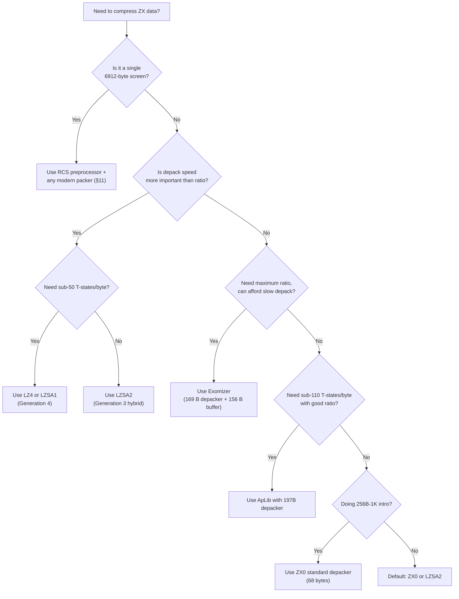

[← Home](../README.md) · [Demoscene](README.md)

# Compression and Packing — The ZX Spectrum Packer Ecosystem

> **Scope**: This article is the canonical reference for data compression on the ZX Spectrum. It covers ~25 packers from 1991 to the present, organized into four generations, with the Introspec 2017 corpus benchmarks, depacker size/speed comparisons, format internals for the most-used packers, and practical integration guidance for both demos and games.
>
> **Companion article**: [09_toolchain/asset_tools.md](../09_toolchain/asset_tools.md) § Asset Compression covers compression as one stage of the broader asset pipeline (build-time invocation, Makefile integration, asset manifest format). The present article is the deep dive on the algorithms, formats, and depackers themselves.

---

## 1. Why Compression Defines the Platform

The ZX Spectrum has either 16 KB, 48 KB, or 128 KB of RAM. A single full-screen image (`6912` bytes) is 14 % of a 48 K machine's address space. A typical demo part needs code, music, multiple screens, sprite data and scratch buffers — easily 30–40 KB before any visual effects begin. Compression is not an optimization; it is a structural requirement.

The platform's constraints make compression both more necessary and more difficult than on contemporaries:

- **No hardware multiply or divide** — any decompression work that requires arithmetic is expensive in T-states.
- **Contended memory** — the upper 16 KB of RAM is shared with the ULA, slowing CPU reads during the visible frame.
- **No native mass storage** — tape loading at 1500 bit/s makes every byte cost ~6 ms of load time; TR-DOS diskettes hold 640 KB but only with strict format constraints.
- **Tight per-frame budget** — 6976 T-states per scanline × 312 scanlines × 50 Hz ≈ 7 MHz effective, of which ~50 % is lost to contention during the visible display. Anything that decompresses during the frame must do so in cycle-counted code.

These constraints produced a unique ecosystem of packers, with multiple parallel lineages: Soviet screen-optimized formats (1991–), Western general-purpose LZSS (late 1990s–), the modern optimal-parser wave (2013–), and byte-aligned speed-optimized formats (2018–). Each generation has working production packers in active use today.

### Article Roadmap

- §2 The asymmetry constraint — *why every ZX packer looks the way it does*.
- §3 The four generations of ZX packers (overview).
- §4 Generation 1 — Soviet screen packers (`ASCLZPAK`, `MSP1.6`, `Lazy Pack`, `ASC Screen Crusher`, `Laser Compact`).
- §5 Generation 2 — General LZSS packers (`MegaLZ`, `HRUM`, `HRUST 1`, `HRUST 2`, `Pucrunch`, `ApLib`, `Exomizer`).
- §6 Generation 3 — Modern optimal LZSS (`ZX7`, `Pletter 0.5`, `ZX0`, `ZX1`, `ZX2`).
- §7 Generation 4 — Byte-aligned speed packers (`LZ4`, `LZSA1`, `LZSA2`).
- §8 The Introspec 2017 benchmark — head-to-head results on a 1.23 MB ZX corpus.
- §9 Depacker size and speed comparison — the master table.
- §10 Format internals — `ZX0`, `ZX7`, `MegaLZ`, `LZSA2`, `HRUM` byte-level format reference.
- §11 The RCS preprocessor — turning the nonlinear screen into linear order so any packer wins.
- §12 Streaming depack — decompressing during loading and during effects.
- §13 In-place and backward depack — overlapping source and destination safely.
- §14 When NOT to compress.
- §15 Decision tree — picking the right packer.
- §16 Worked example — compressing a screen with `RCS` + `ZX0` and integrating the depacker.
- §17 Cross-references.

---

## 2. The Asymmetry Constraint — Compress on PC, Depack on Z80

Before examining the generations, it is essential to understand *why every ZX packer looks the way it does*. The ZX compression ecosystem is fundamentally different from mainstream PC/server compression (DEFLATE, LZ4, zstd, brotli) for one reason: **the packer and the depacker run on completely different machines with completely different budgets.**

The packer runs on a multi-GHz PC with gigabytes of RAM. It can afford any algorithmic technique invented in the last fifty years — arithmetic coding, PPM, BWT, ANS, neural-network predictors, multi-gigabyte dictionaries, optimal-parsing dynamic programming. The depacker, by contrast, runs on a 3.5 MHz Z80 with 16–128 KB of RAM, no hardware multiply, no caches, and a 50 Hz frame deadline. **Every algorithmic choice in the format is dictated by what the depacker can do, not what the packer can do.**

This is the opposite of symmetric PC algorithms like DEFLATE or LZ4-on-x86, where the encoder and decoder share a similar computational envelope. It is also why a naive question like "why don't ZX packers just use zlib?" has no simple answer: zlib's depacker alone is 30 KB of code and requires 32 KB of working memory — twice the size of an entire ZX program.

### 2.1 The fundamental asymmetry

All ZX packers split the workload unequally between two machines:

| Stage | Where it runs | Constraints |
|---|---|---|
| **Packing** (compress) | Modern PC, GB of RAM, GHz CPU | None — can use any algorithm, run for minutes, search exhaustively |
| **Depacking** (decompress) | Z80, 16–128 KB RAM, 3.5 MHz | Three simultaneous hard limits (§2.4) |

This asymmetry has a counterintuitive consequence: **the format is more constrained than the algorithm**. Modern general-purpose compression libraries (zstd, brotli, LZMA) achieve their best ratio by using sophisticated modeling that requires megabytes of decoder-side state. None of that state is affordable on Z80. So ZX formats are designed *first* as Z80 programs — tight inner loops with state in 3 register pairs — and *only then* as compression algorithms. The compression strategy is whatever the format allows.

This is why an apparently primitive format like `ZX0` (Elias-gamma-coded LZ77 with a 68-byte depacker) is, in practice, within 1–2 percentage points of `Exomizer` (the best-in-class LZ77 format for Z80) and only ~10 percentage points behind zstd level 19. The gap is not algorithmic; it is the price of running on Z80.

### 2.2 What "big-machine" algorithms do — and why Z80 cannot

The table below catalogs the major families of lossless compression and why each is unusable as a *ZX depacker*. Note that many of these techniques can still be used during the *packing* phase on PC (e.g. optimal-parsing search); what fails is the depacker side.

| Family | Example | PC implementation | Why the depacker fails on Z80 |
|---|---|---|---|
| **DEFLATE** | `gzip`, `zlib` | LZ77 sliding window + dynamic Huffman tree per block | The dynamic Huffman tree description alone is 100–600 bytes per block; tree-walking requires 1–8 bit operations per output symbol. Even *fixed* Huffman DEFLATE needs 288 bytes of code-length table in RAM. |
| **LZW / LZ78** | `compress`, GIF | Growing dictionary; decoder reconstructs dictionary on the fly | The dictionary grows to 4–64 KB during depack. On Z80, this is the *entire address space*; there is no room for both dictionary and decompressed data. |
| **Arithmetic coding** | `bzip2` (with binary MQ), JPEG2000 | Multi-precision multiply/divide on a fractional range after each symbol | Z80 has no `MUL` or `DIV`. A single 16-bit × 16-bit multiply is ~200 T-states (a 32-iteration shift-and-add loop). Per-symbol arithmetic cost exceeds depack-time budget by 5–10×. |
| **PPM** (Prediction by Partial Matching) | `PPMd`, `7-Zip` | Context tables, statistical model per context, arithmetic-coded symbols | Context tables are 64 KB–1 MB; model state must persist across symbols. The Z80 depacker cannot store the model, never mind compute it. |
| **BWT** (Burrows-Wheeler) | `bzip2` | Suffix-array sort + MTF + Huffman | Decoder requires the inverse-BWT table (size = block size) and multiple passes over it. For a 48 KB block, that is the entire ZX RAM again. |
| **ANS / rANS / tANS** | `zstd` (FSE), `brotli`, `lzfse` | State-machine entropy coder; needs a 256-entry decode table | Smaller than Huffman trees but still 256–512 bytes of static table for a byte alphabet. No ZX depacker uses ANS natively; the closest approach is `Pletter 0.5`'s 7-variant selection (§2.5). |
| **zstd / LZMA / brotli** | modern web stack | Multi-MB dictionary + ANS + context modeling | Dictionary alone is 8–192 MB. The depacker is 50–500 KB of compiled code with megabyte working set. Impossible to port. |
| **LZ77 with optimal parsing + bit-stream entropy** | `Pucrunch`, `MegaLZ` | Optimal parser on PC; Elias-gamma-coded bitstream on Z80 | **This is what ZX packers actually use.** It is the highest-ratio technique whose depacker fits in ~100 bytes. |
| **LZ77 byte-aligned, no entropy** | `LZ4`, `LZSA1` | Simple greedy or optimal parser on PC; byte-aligned token format | **The fastest ZX depackers.** Format is so simple that the depacker hot path is 4 instructions per byte. |

Two consequences fall out of this table:

1. **There is no entropy back-end in any ZX format.** No Huffman tree, no arithmetic coder, no ANS. The "entropy coding" stage of ZX compression is at most an Elias-gamma prefix code — a stateless, tableless variable-length integer encoding that the depacker reads bit by bit.
2. **There is no context modeling.** No PPM, no BWT, no per-symbol probability adaptation. Every byte is encoded in the same way regardless of what came before, modulo the LZ77 match-length and offset history (which `ApLib`, `LZSA2`, and `Exomizer` exploit minimally via "rep-match" codes).

This is not a limitation of the algorithm designers; it is the *defining characteristic* of the ZX compression ecosystem. As Pasi Ojala wrote in the `pucrunch` documentation: *"A system with a 1-MHz 3-register 8-bit processor and 64 kilobytes of memory certainly imposes a great challenge, and thus also a great sense of achievement for good results."* The same constraints apply to ZX Spectrum with twice the clock and three register pairs.

### 2.3 What Z80 is actually good at (and what it is not)

To understand the format choices in §§4–7, it helps to see the exact instruction budget a Z80 depacker works with. The timings below are T-states on a 48K ZX Spectrum (the 128K versions and the Pentagon run at slightly different effective rates due to contention).

**Cheap instructions (use freely):**

| Instruction | T-states | Bytes | Role in depackers |
|---|---|---|---|
| `LD A,(HL)` / `LD (HL),A` | 7 | 1 | Read/write a byte |
| `LD r,n` | 7 | 2 | Load immediate (constant) |
| `LD r,r'` | 4 | 1 | Move between registers |
| `INC HL` / `DEC HL` | 6 | 1 | Advance source or destination pointer |
| `INC DE` / `DEC DE` | 6 | 1 | Advance the other pointer |
| `INC B` / `DEC B` | 4 | 1 | Loop counter |
| `EXX` | 4 | 1 | Swap BC/DE/HL ↔ BC'/DE'/HL' — instant second register bank |
| `EX DE,HL` | 4 | 1 | Swap the two main pointers |
| `PUSH rr` / `POP rr` | 11 | 1 | Use the stack as a register extension |
| `JP (HL)` / `JR n` | 4–12 | 1–2 | Branch |
| `LDI` | 16 | 2 | `(HL)→(DE); HL++; DE++; BC--` — one byte of an unrolled `LDIR` |
| `LDIR` (per byte) | 21 | 2 | Block copy at ~2/3 the speed of unrolled `LDI` |

**Expensive instructions (avoid in hot loops):**

| Instruction | T-states | Why it hurts |
|---|---|---|
| `RL L` / `RR L` | 8 | Per-bit cost of a bit-stream depacker (e.g. `ZX0`, `ZX7`, `MegaLZ`) — 8 T-states per bit of an Elias-gamma code |
| `BIT n,(HL)` | 12 | Single-bit test on memory |
| `SRL A` / `SLA A` | 8 | 8-bit shift |
| `ADD HL,rr` | 11 | 16-bit pointer arithmetic — necessary but each use is one byte of pointer state |
| `LD (nn),HL` / `LD HL,(nn)` | 16 | Save/restore pointer to memory |
| `LD A,(IX+d)` / `LD (IX+d),A` | 19 | Indexed addressing — 3× the cost of `(HL)` |
| `RST 10h` etc. | 11 | Calls (and any function call discipline) |
| Software `MUL DE,B` | ~200 | Implemented as 8-iteration shift-and-add (or 16 iterations for full 16-bit); used **never** in depackers |

**What this means for depacker design.** A `ZX0`-style bit-stream depacker pays ~8 T-states per bit of Elias-gamma code (one `RL L` or `RRCA` per bit) plus ~14 T-states per literal/match byte (one `LD A,(HL)` + one `LD (DE),A` + two pointer increments). This sets a floor of ~80–200 T-states per output byte for any bit-stream format. A byte-aligned format like `LZ4` or `LZSA1` skips the bit shuffling entirely and pays only the per-byte copy cost, achieving ~33 T-states per byte — within 1.5× of `LDIR`.

The Z80's three register pairs (HL, DE, BC) plus the alternate set (`EXX`) are exactly enough to hold a depacker's entire state: source pointer (HL), destination pointer (DE), length counter (BC), and — via the alternate set — the LZ77 last-offset register and Elias-gamma bit accumulator. Every working depacker fits in this envelope. There is no room to spare.

### 2.4 The three hard constraints

ZX depackers must satisfy all three of the following simultaneously. **Any technique that violates one of them is disqualified**, regardless of how good its ratio is.

| # | Constraint | Hard limit | Consequence |
|---|---|---|---|
| **1** | **Depacker code size** | On a 256-byte intro, a 75-byte depacker is 29 % of the budget. On a 1K intro, a 75-byte depacker is 7 %. On a 48K demo, the depacker is negligible but every copy of it (one per packed block) still costs. | ZX depackers are routinely size-optimized to the last byte. `ZX0` has a 68-byte "turbo" variant and a 49-byte "mega" variant that uses self-modifying code and undocumented instructions. |
| **2** | **Depacker RAM usage** | On a 48K Spectrum, total RAM is 48 KB minus 16 KB ROM minus 7 KB screen = ~25 KB usable. Of that, ~7 KB is in uncontended memory (fast); ~16 KB is contended (slow). Depacker state competes with the running program for this RAM. | Modern ZX depackers use **0 bytes** of additional RAM beyond the source and destination buffers. All state fits in 3 register pairs + the alternate set. This is why no ZX format uses a 256-entry Huffman table or a multi-KB ANS table. |
| **3** | **Depacker speed** | 69888 T-states per frame at 50 Hz. Of these, ~30000 are lost to ULA memory contention during the visible display, leaving ~40000 usable. At 200 T/byte, that is 200 bytes per frame. At 30 T/byte, it is 1300 bytes per frame. | A streaming depacker (§12) that needs to feed an effect every frame at 50 Hz must hit its per-byte target. Bit-stream formats cap out around 100 bytes/frame; byte-aligned formats can sustain 1000+ bytes/frame. |

A practical illustration. The classic 1K intro budget breakdown:

```
1024 bytes total
- 49  bytes  ZX0 mega depacker (with SMC and undocumented opcodes)
- 16  bytes  reset/exit stub
- 6   bytes  entry trampoline
-----
953 bytes left for the actual packed payload
```

Of those 953 bytes, the packed payload may expand to ~3–5 KB on depack. The depacker must run without touching that 3–5 KB until it writes to it; the source pointer and destination pointer advance without overlap (or with controlled overlap, see §13).

### 2.5 How each generation adapted to the constraints

The four generations cataloged in §3 are four *different* answers to the same three constraints. Each generation traded a different thing:

| Generation | What it traded away | What it gained | Depacker cost |
|---|---|---|---|
| **1. Soviet screen packers** | Generality (format is screen-specific) | Smallest screen output for the time | Depacker IS the screen layout state machine; 30–80 bytes; uses both register banks |
| **2. General LZSS** | Generality of parser (suboptimal parse OK) | Best ratio for arbitrary data | 60–200 bytes bit-stream depacker; ~100–200 T/byte |
| **3. Modern optimal LZSS** | Simplicity of compressor (Dijkstra-based optimal parsing takes minutes on PC) | Best ratio + small depacker | 49–119 bytes; Elias-gamma bit-stream; ~100–150 T/byte |
| **4. Byte-aligned speed** | ~5–10 ratio points (vs Generation 3) | 3–5× faster depack | 67–251 bytes; no bit operations; ~33–50 T/byte |

Notice that **Generation 3 still uses Elias gamma coding**, a universal prefix code from 1975. There is no entropy back-end — no Huffman, no arithmetic, no ANS. The format is simply LZ77 with Elias-gamma-coded lengths and offsets, and an optimal parser running on PC picks the matches. This is the closest a ZX format can get to a general-purpose compression algorithm while staying within the depacker budget.

`Pletter 0.5` is an interesting hybrid: it pre-generates seven different Elias-gamma variants, runs the optimal parser against each, and embeds a 3-bit selector at the start of the stream so the depacker knows which variant to use. This is the closest any ZX packer comes to "context modeling" — but even here the modeling is done at *packing* time, not at depack time. The depacker just executes the selected variant.

`LZSA2` is the other interesting hybrid: it is technically a Generation 4 packer (byte-aligned, no entropy), but it uses nibble-encoded offsets and short-form matches that approximate the density of an Elias-gamma bitstream without paying the per-bit cost. It is the format that most explicitly embodies the asymmetry: optimal parser on PC, byte-aligned state machine on Z80.

### 2.6 The Pareto proof: why 8-bit LZ77 is at the theoretical limit

Introspec's 2017 and 2021 benchmarks (§8) show a Pareto frontier that has not been broken in 25 years of packer development. Reading the table:

- **Best possible at ~150 T/byte:** `ApLib` at 49 % ratio. `Exomizer` achieves 48 % at ~3× slower.
- **Best possible at ~50 T/byte:** `LZSA2` (speed-optimized depacker) at ~51 % ratio.
- **Best possible at ~33 T/byte:** `LZ4` / `LZSA1` at ~58 % ratio.

The gap between the fastest and slowest is *9 ratio points for a 5× speed difference*. No packer in any generation has ever broken this curve. The reason is structural: every ZX packer is fundamentally LZSS plus a universal prefix code. There is no entropy coding back-end (no Huffman, no arithmetic, no ANS), and there is no context modeling (no PPM, no BWT). These omissions are *forced* by the depacker constraints in §2.4 — and they cap achievable ratio at the LZSS+universal-code ceiling.

A useful comparison. On the same Introspec corpus, zstd level 19 achieves ~32 % ratio. The best ZX packer (`Exomizer`) achieves 48 %. The 16-point gap is exactly the cost of "no entropy coding, no context modeling, no large dictionary". That gap cannot close without a Z80 successor (the Z80N in the Spectrum Next does not help; it adds `MUL D,E` and `SWAPNIB` but no caches, no parallel issue, and the same memory bottleneck).

### 2.7 Modern cross-pollination: what mainstream compression borrowed from 8-bit

The ZX packer ecosystem has had a measurable, if rarely acknowledged, influence on mainstream compression. The through-line is **byte-aligned formats with no entropy back-end** — exactly the design forced by the Z80 constraints, generalized to multi-GHz CPUs:

- **`LZ4`** (Yann Collet, 2011). The official format specification states: *"LZ4 is an LZ77-type compressor with a fixed byte-oriented encoding format. There is no entropy encoder back-end nor framing layer. This design is assumed to favor simplicity and speed."* This is precisely the 8-bit design constraint generalized. `LZ4`'s depacker runs at multi-GB/s on x86, but its format was deliberately shaped to *be simple* — which is also what makes it useful on Z80.
- **`LZSA`** (Emmanuel Marty, 2019). Explicitly developed for retro platforms. The `LZSA1`/`LZSA2` formats were tuned against Introspec's 8-bit benchmarks, and the format was generalized upward to non-8-bit use cases (compression in modern embedded systems, retro-game asset pipelines). Marty has acknowledged in forum posts that the ZX Spectrum community was the primary testbed.
- **Finite State Entropy (FSE)** (Yann Collet, 2015). FSE is a tANS implementation used in `zstd`. Its selling point is *"Huffman speed at arithmetic coding ratios"* — exactly the trade-off 8-bit packers had to make 30 years earlier. FSE's state-machine decoder is conceptually similar to `Pletter 0.5`'s variant-table approach: a small finite state per symbol, no tree walk.
- **`zstd` "--ultra" modes** (Facebook, 2018+). The highest-ratio modes of zstd use a context model that *would* be useful on ZX if it fit — but its minimum working set is 8 MB. The ZX community has explicitly noted this and ignored it.
- **Asymmetric Numeral Systems** (Jarek Duda, 2013–2014). ANS as a theoretical framework unifies Huffman and arithmetic coding. While no ZX packer uses ANS natively, the ANS framework clarifies *why* Elias gamma coding is so effective on Z80: it is the simplest possible ANS coder with a uniform symbol distribution, requiring no probability table.

The reverse influence is weak. Mainstream tools (`gzip`, `bzip2`, `xz`, `7z`, `zstd`, `brotli`) cannot run on Z80 — not because their *compressors* are too heavy (we run compressors on PC anyway), but because their *depackers* are 10–500 KB of code with working sets measured in megabytes. The ZX ecosystem has retained its own parallel toolkit precisely because the mainstream world has moved further away from Z80's constraints, not closer.

### 2.8 References for §2

The asymmetry-principle analysis above is grounded in the following primary sources:

- [Yann Collet, LZ4 Block Format Description](https://github.com/lz4/lz4). Explicit format rationale: *"design is assumed to favor simplicity and speed."* Read alongside the LZ4 implementation notes on large-length handling and 16-bit register overflow, which directly mirror the Z80 depacker's length-counter concerns.
- [Pasi Ojala, pucrunch — An Optimizing Hybrid LZ77 RLE Data Compression Program](https://github.com/mhaben/pucrunch). The original C64-targeted analysis of the asymmetric design: *"A system with a 1-MHz 3-register 8-bit processor and 64 kilobytes of memory certainly imposes a great challenge, and thus also a great sense of achievement for good results."* Same constraints apply to ZX.
- [Jarek Duda, Asymmetric numeral systems: entropy coding combining speed of Huffman with accuracy of arithmetic coding](https://arxiv.org/abs/1311.2540), arXiv:1311.2540 (2013). Theoretical foundation for understanding why Elias gamma coding is the right choice for 8-bit depackers — it is the simplest ANS coder with uniform distribution.
- [Paul G. Howard and Jeffrey S. Vitter, Practical Implementations of Arithmetic Coding](https://www.cs.brown.edu/cgc/stc/ddms/). Documents the per-symbol cost of arithmetic coding on conventional CPUs; on Z80 the cost is ~5–10× higher.
- [Charles Bloom, On LZ Optimal Parsing](http://cbloomrants.blogspot.com/) and ***Advanced Parsing Strategies*** (fastcompression blog, 2011). Source of the optimal-parsing and lazy-matching techniques used by all Generation 3 ZX packers.
- [Introspec, State of the art byte compression (for 8-bit computers)](https://encode.su/threads/1893-State-of-the-art-byte-compression-for-8-bit-computers). Direct discussion between the ZX packer community (Introspec, Einar Saukas, Emmanuel Marty) and mainstream data-compression experts. The Pareto-frontier analysis in §2.6 is grounded in the data published in this thread and the linked 2017/2021 benchmark articles.
- [Phil Katz, DEFLATE Compressed Data Format Specification](https://datatracker.ietf.org/doc/html/rfc1951). The reference for what a "big-machine" depacker looks like, and how it differs structurally from any ZX format.

---

## 3. The Four Generations of ZX Packers

Compression on the ZX Spectrum did not evolve along a single line. Four parallel traditions emerged, each solving a different priority:

| Generation | Period | Packagers | Priority | Example packers |
|---|---|---|---|---|
| **1. Soviet screen packers** | 1991–1998 | Maxim K., Marslord, Maxsoft, LC | Smallest screen, format-specific | `ASCLZPAK`, `MSP1.6`, `Lazy Pack`, `Laser Compact 4.0/5.2`, `ASC Screen Crusher` |
| **2. General LZSS** | 1998–2012 | fyrex, Pyankov, Lind, Ibsen | Best ratio, depacker on demand | `MegaLZ`, `HRUM`, `HRUST 1`, `HRUST 2`, `ApLib`, `Exomizer`, `Pucrunch` |
| **3. Modern optimal LZSS** | 2013–present | Saukas, XL2S, Marty | Optimal parse, tiny depacker | `ZX7`, `Pletter 0.5`, `ZX0`/`ZX1`/`ZX2`, `LZSA2` (hybrid 3+4) |
| **4. Byte-aligned speed** | 2018–present | Collet, Marty, Drapich | Maximum depack speed | `LZ4`, `LZSA1` |

### Why four generations coexist

Modern Z80 development still uses packers from every generation, because each generation trades different things:

- A **Generation 1 packer** may still beat a modern optimal packer on a single `6912`-byte screen because it knows the nonlinear screen layout and can do "broken-column" traversal — packers from later generations cannot (without a preprocessor, see §11).
- A **Generation 2 packer** like `Exomizer` still produces the best ratio on arbitrary data and is the standard for cramming demos into `48 K`.
- A **Generation 3 packer** like `ZX0` is the modern default: optimal parse, 68-byte depacker, works everywhere.
- A **Generation 4 packer** like `LZSA1` is used for streaming — decompressing data faster than `LDIR` can copy it, so that compression becomes a *speed* optimization rather than a size optimization.

### The Pareto frontier

Introspec introduced the useful concept of a **Pareto frontier** for ZX packers: for any target decompression speed, there is a maximum achievable compression ratio. Packers close to the frontier are efficient; packers far below it (such as `ZX7`, `MegaLZ`, `HRUM` after 2017) are technically obsolete but remain popular because their depackers are battle-tested and familiar.

The 2017 benchmark (§8) showed `Exomizer`, `ApLib`, and `Pletter 0.5` as the most efficient packers in their respective speed tiers. The 2021 update showed `LZSA2` joining that group, and the introduction of `ZX0` in 2021 finally displaced `ZX7` as the go-to minimal-depacker choice.

---

## 4. Generation 1 — Soviet Screen Packers (1991–1998)

> **Primary source**: "Sofтинка — обзор экранных упаковщиков для ZX Spectrum", Info-Guide #5 (April 2004), preserved at [zxpress.ru](https://zxpress.ru/ru/ezines/info-guide/05/obzor-ekrannyh-upakovshikov-dlya-zx-spectrum-asclzpak-msp1-6-lazy-pack-i-asc-screen-crusher-tehniki).

The Soviet demo and game scene standardized on diskette distribution via TR-DOS, where each screen typically loaded as a separate file. The 6912-byte `.scr` format is unusually compressible — adjacent bytes in linear memory are *not* spatially adjacent on the display, so a naive LZ packer misses obvious redundancy. The Soviet packers all addressed this with some variant of **broken-column traversal**: instead of treating the screen as a flat 6912-byte array, they treat it as three 2048-byte thirds plus a 768-byte attribute area, and traverse each third column-by-column within the byte that makes up a character cell.

This traversal order means a long run of identical bytes (e.g., a horizontal stripe of one color) becomes a contiguous run in the *virtual* address space, even though it is scattered across the *real* screen address space. The packer then runs LZSS over the virtual stream, and the depacker reconstructs the real address via a per-byte calculation.

### 4.1 `ASCLZPAK` (1991) — the progenitor

The first major screen packer, released by Maxim K. / ASC in 1991, established the model: a relocatable depacker followed by packed data, with three register counters tracking position in the broken-column traversal:

```z80
; Register allocation during depack:
;   A' = 8 * (column index) + (3 - third index)
;   B' = row within character cell (0..7)
;   C' = character row within third (0..7)
```

The packed format is bit-packed, with three block types:

```
%0bbbbHHHH LLLLLLLL     back-reference, displacement = HHHLLLLLLLL, length = bbbb + 3
%10000000                end-of-file marker
%10bbbbbb <bytes>        copy bbbbbb literal bytes from stream
%11bbbbbb <byte>         repeat the next byte bbbbbb+3 times (up to 66)
```

**Length-encoding trade-off**: `ASCLZPAK` allocates 6 bits to encode literal runs (max 63) and 4 bits to encode back-reference length (max 15). The bit-allocation is biased toward literals — typical screens have many short literal runs between back-references. This pattern persisted in later packers.

**Limitations**: no reusing of last-match offset, fixed-length offset encoding (10 bits), no optimal parser. The depacker is also non-trivial to relocatable-ise since it self-modifies three address-pairs to its own current address.

### 4.2 `Maxsoft Screen Packer 1.6` (MSP 1.6)

MSP 1.6 ships three depacker variants in one compressor, selectable per file:

1. **Direct-to-screen** (RTD — *RealTime Depack*): broken-column depack straight into `#4000`. Default; best ratio.
2. **Via buffer**: depack into a scratch buffer in broken-column order, then `LDIR` to screen. Identical ratio to (1).
3. **Direct-to-screen in screen order**: skip the broken-column logic entirely. Smaller depacker code, but the compressor can no longer rely on the column locality, so ratio is worse.

The RTD depacker (mode 1) is widely considered the most convoluted screen depacker ever written, because it interleaves two streams — a bitstream (control) and a bytestream (literals and offset LSBs) — and reads the bitstream two bytes at a time via `ADD HL,HL : DJNZ : POP HL : LD B,C`. The two streams begin at offset 0 (bitstream) and offset 2 (bytestream) of the packed data, and are interleaved in a structure-dependent pattern that the compressor computes.

Length encoding uses variable-length codes that look like an early precursor of Elias gamma, with shorter codes for the most common lengths:

```
%0                 literal byte
%100               length=3 (most common back-reference length)
%1010              length=2 (note: longer code, since these occur less often)
%1011 <byte>       length = byte+10  (10..263)
%1100              length=4
%1101              length=5
%11100..%11111     length=6..9
```

Offset encoding is also variable-length, separately for the high and low bytes, with codes 1–7 bits for the high byte (window of 32 cells) and a raw 8-bit low byte.

**Quirks**: the depacker uses the SP register as a data pointer into the bytestream (via `DEC SP : POP AF`), so the system stack pointer must be saved in IY before depack and restored afterward. Interrupts must be disabled.

### 4.3 `Lazy Pack 2.0`

A late entry (1997/1998), built on ideas from `LC 5.2` (Laser Compact). The format is bitstream-based with separate bit and byte streams, and uses a Huffman-like 0…23 code tree (`get` routine) for both length and offset high byte. The depacker is *not* tied to the screen address — it takes the source in `HL` and depacks to `#4000`, with the destination easily patched to any multiple of `#2000` (or, with small code changes, any multiple of `#800`).

**Achieves mobility via JP tables**: instead of self-modifying code, the depacker writes three `JP` instructions into the BASIC `MEMBOT` system variable area (`#5C00`-range) during startup. Those JPs dispatch to three internal routines (`get`, `down`, `bit`). The depacker finds its own load address via `DEC SP : POP AF` (interrupts must be off).

**Historical note**: the packer had a notorious bug — saving a packed file via most TR-DOS versions would corrupt the disk catalog. Lazy Pack 2.0 is therefore rare in commercial releases despite its technical merits.

### 4.4 `Laser Compact` (LC 4.0 / LC 5.2)

Authored by **Marslord**, `Laser Compact` is widely regarded as the Soviet screen packer that produced the smallest `.scr` files for many years. The 4.0 version shipped first; 5.2 was the final and best-tuned release. Both versions are tightly optimized for the broken-column screen traversal, with byte-aligned codes in the hot path (rare for Soviet packers, which usually preferred bit-packing).

The depacker is short enough to fit comfortably under 200 bytes and is non-relocatable by default but easy to relocatable-ise. The format is documented in the late-1990s disk magazine **Spectrofon** and is the format most Soviet demo frameworks shipped as their default screen packer. Many later packers (Lazy Pack 2.0 included) credit `LC 5.2` as their reference.

The `Laser Compact` line ended with version 5.2; the project was never ported to PC, so to pack a screen today you need either a real Spectrum or an emulator running the original native tool.

### 4.5 `ASC Screen Crusher`

A simpler sibling of `ASCLZPAK` from the same scene. Drops some of the more exotic features (e.g., the `A'`/`B'`/`C'` triple counter) and uses a more conventional `HL`/`DE` source/destination pair with explicit address recompute. Smaller depacker, slightly worse ratio. Common in early-1990s Soviet game releases.

### 4.6 Trade-offs specific to Generation 1

All five Generation-1 packers share two unusual properties:

1. **Format-specific**: they only compress screens. They exploit the 6912-byte layout in ways that do not generalize to code or sprite data.
2. **Native development**: the packer itself runs on the Spectrum, often from a TR-DOS disk menu. There is typically no PC port. This is awkward for modern cross-development (§14).

The **broken-column traversal** idea survives today, but in a different form: Einar Saukas's **RCS** preprocessor (see §11) reorders screen bytes into linear order on the PC, then any modern packer (`ZX0`, `LZSA2`, etc.) achieves the same ratio benefit. RCS made Generation 1 packers obsolete in principle, but they remain historically important and several Soviet-era demos still ship data in `LC 5.2` or `MSP 1.6` format.

---

## 5. Generation 2 — General LZSS Packers (1998–2012)

> **Primary source**: Introspec, "Сжатие данных для современного кодинга под Z80", HYPE (September 2017), [hype.retroscene.org/blog/dev/740.html](https://hype.retroscene.org/blog/dev/740.html).

Generation 2 covers a diverse group of packers that emerged as demo coders on both sides of the former Iron Curtain started running their packers on PC and treating compression as a general-purpose data transformation rather than a screen-specific trick. All packers in this generation are LZSS-family with various additions: dynamic code tables (`HRUST 1`), reused offsets (`ApLib`), or longer-context modeling (`Exomizer`).

### 5.1 `MegaLZ` (fyrex, optimal parser by lvd, 2005)

`MegaLZ` started as a native Spectrum packer in the mid-1990s, written by **fyrex** of Megafire Software. Multiple groups maintained the format through the late 1990s (Programmers Group, Bitmunchers, Omega Hackers Group), and the final native version came from **Mayhem**. In 2005, **lvd** wrote the first optimal parser for the format — making `MegaLZ` arguably the first ZX packer with a truly optimal compressor, predating Einar Saukas's claims for `ZX7` by 8 years.

The format is **mixed bit-byte LZSS** (a.k.a. LZB-style):

- 1 bit to distinguish literal from back-reference (LZSS innovation)
- Length encoded as **Elias gamma code**
- Offset is either 9 bits (short, within window) or 13 bits (long)
- Window size: 4.5 KB

Compared to `HRUM` (similar codes, but Rice-coded lengths and a 500-byte shorter window), `MegaLZ` compresses about 0.6 % better on the Introspec 2017 corpus. The classic depacker by fyrex (`DEC40.asm`) is 110 bytes of relocatable code at ~131 T-states per depacked byte. **Introspec rewrote both depackers in 2020–2021**:

| Depacker | Size | Speed (T-states/byte) |
|---|---|---|
| `unmegalz_small.asm` (v3, 2021) | **88 bytes** | ~98 |
| `unmegalz_fast.asm` (v3, 2021) | **229 bytes** | ~63 |

The fast version approaches `3 × LDIR` speed and made `MegaLZ` competitive again after a period of obsolescence.

**Modern status**: still the default in many Soviet-derived demo frameworks. For new projects, `LZSA2` wins on speed (30 % faster) but loses ~2 % on ratio for small files.

### 5.2 `HRUM` (Dmitry Pyankov)

The first of three Pyankov packers in this generation. **Mixed bit-byte LZSS**, designed for good ratio with fast depack. Window of 4 KB. Length codes are a variation of **Rice coding** (a special case of Golomb coding) — slightly faster to decode than Elias gamma, at a small ratio cost.

The standard `mhmt -hrm` packer (by lvd) implements an optimal parser for the HRUM format. The standard depacker (`unhrum_std.asm`, disassembled and cleaned up by Introspec) is 104 bytes and runs at 97 T-states/byte, using `AF`, `BC`, `DE`, `HL`, `BC'`, `DE'`, and `HL'`. The relocatable variant is 105 bytes and additionally uses `IX`.

**Typical use**: Soviet demos needing a relocatable depacker for code blocks. Largely displaced by `MegaLZ` for new work.

### 5.3 `HRUST 1` (Dmitry Pyankov)

Pyankov's most effective format. A sophisticated LZSS variant with several advanced features:

- **Dynamic length codes** that change based on recent history (similar to LZB)
- **Block copies with holes** — copy a pattern of N bytes spaced M bytes apart, useful for interleaved data
- Window of 4 KB

Originally shipped as a complete system (packer + depacker + relocation logic for one-shot depack after tape/disk load). **lvd** stripped the format to its raw data representation inside `mhmt`, and **Evgeny Larchenko** wrote `oh1c`, an optimal parser for the format (2016+). With `oh1c`, `HRUST 1` is among the strongest Generation 2 packers.

Two standard depackers:

| Depacker | Size | Speed | Notes |
|---|---|---|---|
| `dehrust_ix.asm` | 234 bytes | ~132 T/byte | Uses IX; slower |
| `dehrust_stk.asm` | 209 bytes | ~120 T/byte | Relocatable; reads data via stack (`POP`) |

**Caveat**: the stack-based depacker interferes with normal stack usage. Disable interrupts and ensure no other stack activity during depack.

### 5.4 `HRUST 2` (Dmitry Pyankov)

Originally positioned as a text-oriented variant of `HRUST 1`. With optimal parsers available for both formats (Larchenko's `oh2c` for `HRUST 2`), the picture changed: `HRUST 2` is ~0.6 % worse than `HRUST 1` on mixed data and only marginally better on pure text. It has no significant advantage over `HRUST 1` and is rarely used in new work.

Standard depacker: `DEHRUST_2x.asm` — 212 bytes, ~127 T-states/byte.

### 5.5 `ApLib` (Jørgen Ibsen, late 1990s)

A general-purpose compression library originally written for weak machines. Algorithmically a sophisticated LZSS with **reused-offset codes** (similar to LZX), where recent match offsets are remembered and can be referenced more cheaply than re-encoding the offset. This context-dependence makes optimal parsing significantly harder.

The standard packer (`appack.exe`) is non-optimal but quite good. **r57shell** wrote a more aggressive (still non-optimal) packer that beats `HRUST 1` by ~0.5 % on average.

Four Z80 depackers are widely used, all written by the Spanish SMS/Spectrum scene (Metalbrain, Utopian, Antonio Villena):

| Depacker | Size | Speed | Registers used |
|---|---|---|---|
| `aplib156b.asm` | 156 bytes | ~165 T/byte | AF BC DE HL IX **IY** |
| `aplib197b.asm` | 197+2 bytes | ~106 T/byte | adds `AF'` |
| `aplib227b.asm` | 227+2 bytes | ~102 T/byte | same |
| `aplib247b.asm` | 247+2 bytes | ~100 T/byte | same |

**Bug warning**: the `AF'`-using depackers have a known issue with one `SBC HL,BC` instruction assuming `C` is clear. Caller must execute `OR A : EX AF,AF'` before the call.

**Modern status**: `ApLib` is the strongest "complex LZ" packer in terms of Pareto efficiency. The 197-byte depacker is the sweet spot for new work needing sub-110 T-states/byte depack with strong ratio.

### 5.6 `Exomizer` (Magnus Lind)

The undisputed ratio champion for ZX data. The format is undocumented (only the C source is published), but is known to be a sophisticated LZSS variant with longer-context modeling. The packer may or may not be optimal (Introspec has been unable to confirm).

Standard usage packs raw data without the built-in wrapper:

```bash
exomizer raw inputfile -o output.exo
```

For a smaller depacker, the "simple" format sacrifices ~0.2 % ratio for 15 fewer bytes:

```bash
exomizer raw -c inputfile -o output.exo_simple
```

Two Z80 depackers (same authors as `ApLib` Z80 depackers):

| Depacker | Size | Buffer | Speed |
|---|---|---|---|
| `deexo.asm` (standard) | 169 bytes | 156 bytes | ~287 T/byte |
| `deexo_plus.asm` (optimized) | 174 bytes | 156 bytes | ~248 T/byte |

**Critical limitation**: Exomizer requires a **156-byte static buffer** for working state. This makes it the only major packer that cannot run without extra memory allocation. The buffer is small but must be allocated somewhere stable.

**Backwards depack**: Exomizer's official distribution includes `deexo_b.asm` and `deexo_simple_b.asm` for backward depack — useful when depacking large data into the top of memory where in-place overlap would otherwise be impossible.

**Modern status**: still the ratio champion. Use when you need maximum compression and can afford slow depack.

### 5.7 `Pucrunch` (Andreas Franzén, C64 origin)

An old, sophisticated packer originally written for the Commodore 64. Uses **lazy matching** during compression, which makes the packer an *optimizing* (but not necessarily *optimal*) parser. The Z80 port is maintained by Aprisobal (author of `sjasmplus`).

Standard usage strips the C64 wrapper:

```bash
apri_pucrunch -d -c0 inputfile output.pu_apri
```

One Z80 depacker: `apri-uncrunch-z80fast.asm` — 255 bytes, ~301 T-states/byte. Slow.

**Modern status**: obsolete. `Exomizer` strictly dominates on ratio, and `ApLib` dominates on both ratio and speed.

### 5.8 `BitBuster` (Team Bomba, ~2005)

A simple bit-packed LZSS that served as the design template for `ZX7`. Originally shipped on CP/M and MSX. Used Elias gamma codes for length, stored offset after length, and inverted the gamma bit values for no measurable benefit. The packer was non-optimal, but the depacker was tiny (~80 bytes).

**Modern status**: completely displaced by `ZX7`, which is essentially `BitBuster` with an optimal parser, smaller header, and length-before-offset ordering.

---

## 6. Generation 3 — Modern Optimal LZSS (2013–present)

> **Primary sources**: [Einar Saukas's ZX0 repository](https://github.com/einar-saukas/ZX0) (format and depackers); [Introspec's 2021 MegaLZ update](https://hype.retroscene.org/blog/933.html) (modern corpus and recommendations).

Generation 3 is defined by two converging trends: (a) PC-side optimal parsing became universal, and (b) depackers were aggressively size-optimized. The result is a family of packers that dominate the Pareto frontier across most use cases.

### 6.1 `ZX7` (Einar Saukas, 2013)

The packer that for years was the default recommendation for new ZX projects. Designed as a minimal improvement on `BitBuster`:

- Drops the 2-byte uncompressed-length header (`BitBuster` had it).
- Stores length *before* offset (`BitBuster` stored it after), saving 1 bit per back-reference.
- Uses standard (non-inverted) Elias gamma codes for length.
- Two offset lengths: short (1-byte) and long (2-byte).
- **Optimal parser** that Einar claims runs in O(n) — though classic Dijkstra-style optimal LZSS parsing runs in O(n log n) at best.

The "classic" depacker is the smallest of any major packer:

| Depacker | Size | Speed |
|---|---|---|
| `dzx7_standard.asm` | **69 bytes** | ~107 T-states/byte |
| `dzx7_turbo.asm` | 88 bytes | ~81 T/byte |
| `dzx7_mega.asm` | 244 bytes | ~73 T/byte |
| `dzx7_lom_v1.asm` (Introspec) | 214 bytes | ~69 T/byte |

**Why it dominated**: the 69-byte standard depacker fit comfortably in 256-byte and 1K intros while still offering respectable compression. The 5 % ratio gap to `Exomizer` translates to ~50 bytes on a 1K intro — less than the depacker size difference.

**Modern status**: largely displaced by `ZX0` (2021) which has the same depacker size with better ratio. Still used in countless existing productions and is the format most old tutorials reference.

### 6.2 `ZX0` (Einar Saukas, 2021) — the modern default

`ZX0` is Einar Saukas's definitive optimal LZSS packer, incorporating lessons from `ZX7`, suggestions from Introspec and uniabis, and ideas from various derivatives. It is the recommended packer for new ZX projects unless you have specific speed or ratio requirements that point elsewhere.

**Format** (v2, current):

The format has only three block types and exploits the fact that two consecutive literals are impossible (literal can only follow a back-reference):

```
Literal:    0  Elias(length)  byte[1]  byte[2]  ...  byte[N]
Repeat last offset:
            0  Elias(length)
New offset: 1  Elias(MSB(offset)+1)  LSB(offset)  Elias(length-1)
```

The first block is always a literal, so its indicator bit is omitted. Offset MSB = 256 means EOF. The LSB is stored as 7 bits (not 8) because Einar measured this as slightly better on real-world data.

All lengths and the offset MSB use **interlaced Elias gamma coding** — a variant where bits of the unary prefix and the binary suffix are interleaved, allowing single-pass decoding without first counting the prefix length.

**Depackers**:

| Depacker | Size | Speed (relative to standard) |
|---|---|---|
| Standard | **68 bytes** | baseline |
| Turbo | 126 bytes | ~21 % faster |
| Fast | 187 bytes | ~25 % faster |
| Mega | 673 bytes | ~28 % faster |

Only main registers (`AF`, `BC`, `DE`, `HL`) are used; no `IX`/`IY`/shadow registers. Minimal stack usage. No extra buffer required.

**Advanced features**:

- **Backwards depack** (`zx0 -b`): compress and depack starting from the *end* of the data, useful when depacking large data into the top of memory.
- **Prefix/suffix**: skip N bytes of the input file during compression, but allow them to be referenced. Useful for compressing level data that shares sprites with other levels.
- **Quick mode** (`zx0 -q`): non-optimal but near-instant compression for development iterations.
- **Classic format** (`zx0 -c`): emits the v1 format for compatibility with old depackers.

**Pareto position**: at 68 bytes, the standard depacker is the same size as `ZX7`'s 69-byte standard, but `ZX0` compresses noticeably better.

### 6.3 `ZX1` (Einar Saukas)

A simpler-but-faster derivative of `ZX0`. Sacrifices about 1.5 % compression ratio to run about 15 % faster. Useful for streaming depack where you need `ZX0`-family format but want better throughput.

### 6.4 `ZX2` (Einar Saukas)

A minimalist version of `ZX1`, intended for very small files (sub-256-byte intros, icons). Trades further ratio for depacker simplicity.

### 6.5 `ZX5` (Einar Saukas)

An experimental, more complex compressor based on `ZX0`. Not recommended for production use; published primarily as research.

### 6.6 `Pletter 0.5` (XL2S Entertainment, 2007–2008)

A clever variation on the `BitBuster`/`ZX7` theme. While `BitBuster` had one fixed format and `ZX7` has one optimal-but-fixed format, `Pletter 0.5` tries **7 different format variants** during compression and emits the best one for each input file. The first 3 bits of the packed data identify which variant was used, so the depacker can adapt.

The 7 variants explore trade-offs in:
- Offset bit width (1 or 2 bytes)
- Length code allocation (how many lengths get short codes)
- Special cases (single-byte repeated runs)

The standard depacker (`unpletter5.asm`) is 170 bytes non-relocatable and uses *all* Z80 registers (AF, BC, DE, HL, IX, IY, shadow AF/BC/DE/HL). Decompression speed: ~75 T-states/byte.

**Pareto position**: at the time of the Introspec 2017 review, `Pletter 0.5` was the strongest packer in the sub-80-T-states/byte tier. Introspec explicitly switched to it from `ZX7` for his own productions.

**Modern status**: largely displaced by `ZX0` and `LZSA2` for new work, but still a solid choice.

### 6.7 `LZSA2` (Emmanuel Marty) — the speed/ratio crossover

`LZSA2` is technically a hybrid of Generations 3 and 4: optimal parser (Generation 3) but byte-aligned hot path with nibble-based offsets (Generation 4). It belongs in this section because it was designed as a `ZX7` replacement and competes head-on with `ZX0`.

Key features:

- **5-bit, 9-bit, 13-bit, and 16-bit match offsets** (chosen per-match by the optimiser)
- **Rep-matches** (reuse last offset, like `ApLib`)
- **Nibble-encoded lengths** for compact representation without bit-packing
- **Minimum match size: 2 bytes** (smaller than `LZ4`'s 4)
- No slow bit-packing in the hot path

Z80 depackers (Introspec + uniabis):

- Size-optimized: 67+ bytes
- Speed-optimized: ~50 T-states/byte

**Pareto position**: `LZSA2` is to the speed-optimized depacker world what `ZX0` is to the size-optimized world. Both are near the frontier. `LZSA2` decompresses about 30 % faster than `MegaLZ`'s fast depacker but loses ~2 % ratio on small files.

**Notable users**: "The Hollow" (Darklite & Offense, Solskogen 2019 wild winner), "Gabba" (Stardust, CAFe 2019 #2), "Marsmare: Alienation" (Yandex Retro Games Battle 2020 winner).

---

## 7. Generation 4 — Byte-Aligned Speed Packers (2018–present)

Generation 4 turns compression on its head. On modern PC hardware, the gap between CPU speed and memory bandwidth is so large that decompressing data is *faster* than reading it uncompressed. The same trick works on the ZX Spectrum, with caveats: the Z80's lack of hardware multiply means the byte-alignment tricks used by `LZ4` and `LZSA1` only win if the per-byte depack cost is below ~`2 × LDIR` (~36 T-states/byte).

### 7.1 `LZ4` (Yann Collet)

The new-wave compression library that triggered Generation 4. Originally designed for modern PCs (where it is one of the fastest general-purpose compressors available), it happens to translate well to the Z80.

The format is byte-aligned LZSS:

- Token byte: high nibble = literal length (0–15), low nibble = match length (0–15)
- If either nibble is 15, additional length bytes follow until a byte < 255 is encountered
- 2-byte match offset (little-endian)
- Minimum match length: 4 bytes

Three Z80 depackers:

| Depacker | Size | Speed | Notes |
|---|---|---|---|
| `unlz4_drapich.asm` (Drapich) | 251 bytes | ~33.8 T/byte | Strict header validation |
| `unlz4_stephenw32768.asm` | 72 bytes | ~34.4 T/byte | Raw data only (header stripped) |
| `unlz4_spke.asm` (Introspec) | 104 bytes | ~33 T/byte | Compromise |

At ~34 T-states/byte, `LZ4` decompresses **faster than `1.5 × LDIR`** — meaning it is faster to load compressed data and depack than to `LDIR` the equivalent uncompressed data into place. This is the key Generation 4 insight.

**Packing**: use the `smallz4 -9` optimal compressor, then strip the LZ4 frame header with `lz4-extract` if you intend to use the small raw-only depacker.

### 7.2 `LZSA1` (Emmanuel Marty)

`LZSA1` is Emmanuel Marty's design for a byte-aligned packer that improves on `LZ4` on 8-bit systems. The main differences from `LZ4`:

- **Short (8-bit) match offsets** when possible — the match finder and optimiser cooperate to use the smallest offset that reaches the source.
- **Shorter length encoding**, exploiting the 64 KB block size.
- **Minimum match size: 3 bytes** (vs `LZ4`'s 4), driven by the optimiser.

Z80 size-optimized depacker: **67 bytes**, decompression at ~90 % the speed of `LZ4` (i.e. roughly 10 % slower) but with significantly better ratio.

**Position on the Pareto frontier**: `LZSA1` strictly dominates `LZ4` for ZX use. The 2019 Introspec/Marty benchmark shows:

| Format | Compressed size | Ratio | Decompression speed (vs `LZ4`) |
|---|---|---|---|
| `LZ4_HC -19` | 781 049 B | 60.59 % | 100 % |
| `LZSA1` | 735 785 B | 57.08 % | ~90 % |
| `LZSA2` | 676 681 B | 52.49 % | ~75 % |
| `MegaLZ 4.89` | 679 041 B | 52.68 % | not measured |
| `ZX7` | 687 133 B | 53.30 % | ~48 % |

For most ZX use cases, `LZSA1` is the right choice when you need streaming depack faster than `LDIR`. For maximum ratio, drop to `LZSA2`.

---

## 8. The Introspec 2017 Benchmark — Head-to-Head Results

> **Source**: Introspec, ["Сжатие данных для современного кодинга под Z80"](https://hype.retroscene.org/blog/dev/740.html), September 2017. The corpus (1.23 MB) is split across five categories: `calgary` (8 files < 64K from the standard Calgary corpus), `canterbury` (5 files < 64K from Canterbury), `graphics` (30 ZX screens), `music` (24 ZX music files), and `misc` (10 mixed files — mostly uncompressed games and demos).

### 8.1 Total compressed size by packer (bytes)

```
Unpacked   ApLib    Exomizer  Hrum     Hrust1   Hrust2   LZ4      MegaLZ   Pletter5  Pucrunch  ZX7
Calgary    273 526   98 192    96 248   111 380  103 148  102 742  120 843  109 519   106 650   99 041    117 658
Canterbury  81 941   26 609    26 968    31 767   28 441   28 791    34 976   31 338    30 247    27 792    32 268
Graphics   289 927  169 879   164 868   173 026  169 221  171 249  195 544  172 089   171 807   169 767   172 140
Music      151 657   59 819    59 857    62 977   60 902   62 678    77 617   62 568    63 661    63 977    66 692
Misc       436 944  252 334   248 220   262 508  251 890  255 363  293 542  261 396   263 432   256 278   265 121

TOTAL:   1 233 995 606 833    596 161   641 658  613 602  620 823  722 522  636 910   635 797   616 855   653 879
```

### 8.2 Compression ratio (% of original)

```
              ApLib   Exomizer  Hrum    Hrust1  Hrust2  LZ4     MegaLZ  Pletter5 Pucrunch ZX7
Calgary       35.90   35.19     40.72   37.71   37.56   44.18   40.04   38.99    36.21    43.02
Canterbury    32.47   32.91     38.77   34.71   35.14   42.68   38.24   36.91    33.92    39.38
Graphics      58.59   56.87     59.68   58.37   59.07   67.45   59.36   59.26    58.56    59.37
Music         39.44   39.47     41.53   40.16   41.33   51.18   41.26   41.98    42.19    43.98
Misc          57.75   56.81     60.08   57.65   58.44   67.18   59.82   60.29    58.65    60.68

TOTAL:        49.18   48.31     52.00   49.72   50.31   58.55   51.61   51.52    49.99    52.99
```

For reference: the same corpus compressed with PC archivers gives **Rar 4 = 559 575 B (45.34 %)** and **7-zip = 550 330 B (44.59 %)**. The best ZX packer (`Exomizer`) achieves 596 161 B — within 8 % of 7-zip on the same data.

### 8.3 The 2021 update

In 2021, Introspec published an [updated MegaLZ-specific comparison](https://hype.retroscene.org/blog/933.html) with a larger corpus (1.40 MB) that also includes `LZSA2` and `epcompress`:

```
Corpus       demos    games    gfx      music    texts     total

exomizer3    35 662  223 514  343 299  464 843  130 916  206 026   1 404 260
aplib(apc12) 35 430  228 228  344 631  477 264  129 344  208 601   1 423 498
hrust13(oh1c) 37 069 222 955  345 123  481 785  133 856  215 126   1 435 914
epcompress   36 928  227 112  346 628  487 596  136 733  214 172   1 449 169
hrust21(oh2c) 37 005 226 013  349 276  487 812  137 582  214 274   1 451 962

MEGALZ       38 045  235 582  358 090  488 909  137 393  217 601   1 475 620
lzsa(-f2)    38 022  229 148  351 632  497 298  137 949  225 356   1 479 405
pletter5d    37 743  237 918  359 857  489 015  139 437  217 903   1 481 873
hrum(mhmt)   38 615  235 900  359 626  491 572  138 390  220 267   1 484 370
zx7          39 484  238 903  362 443  489 624  143 457  226 092   1 500 003
```

The ordering is largely unchanged. `Exomizer`, `ApLib`, `Hrust 1` (with optimal parser) remain the top three for maximum compression. `MegaLZ` and `LZSA2` are mid-pack, with `ZX7` still at the bottom of the optimal-parser group. `LZ4` is even further down (worse ratio) but offers the speed advantage not visible in this table.

### 8.4 Key observations from the benchmarks

1. **`Exomizer` is the undisputed ratio champion.** It compresses the 2017 corpus by 51.69 % (i.e. to 48.31 % of original) — the only packer below the 600 KB mark.
2. **`ApLib` is the most efficient mid-speed packer.** At ~100 T-states/byte with the 247-byte depacker, it beats `Hrust 1` on both ratio and speed.
3. **`Hrust 2` has no niche.** It is dominated by `Hrust 1` on every category. Use `Hrust 1` if you need this format family.
4. **`Pucrunch` is obsolete.** It is dominated by `Hrust 1` and `ApLib`.
5. **`LZ4` sacrifices ~10 % ratio for ~3× speed.** It is the right choice only when speed is paramount.
6. **`ZX7` is on the Pareto-suboptimal side.** Introspec's verdict in 2017 was that `Pletter 0.5` strictly dominates it; by 2021, both `ZX0` and `LZSA2` joined that group.
7. **Screens are the hardest data to compress.** All packers lose ~10–15 % ratio on the `graphics` category compared to `music` or `calgary`. This is what justifies the RCS preprocessor (§11).

---

## 9. Depacker Size and Speed — The Master Table

This table aggregates every Z80 depacker mentioned in the article, sorted by speed (fastest first). "Speed" is the average T-states per depacked byte on the Introspec 2017 corpus (graphics + music). "Size" is the assembled depacker size in bytes. "Buffer" is the additional working RAM required.

| Packer | Depacker variant | Size | Buffer | Speed (T/byte) | Relocatable | Notes |
|---|---|---|---|---|---|---|
| `LZ4` | `unlz4_spke.asm` (Introspec) | 104 | 0 | ~33 | no | Optional `IX` use for speed |
| `LZ4` | `unlz4_drapich.asm` | 251 | 0 | ~33.8 | no | Strict header validation |
| `LZ4` | `unlz4_stephenw32768.asm` | 72 | 0 | ~34.4 | no | Raw data only (no header) |
| `LZSA2` | speed-optimized (Introspec/uniabis) | ~150 | 0 | ~50 | no | Byte-aligned, nibble-encoded |
| `MegaLZ` | `unmegalz_fast.asm` v3 (Introspec) | 229 | 0 | ~63 | no | Mixed bit-byte |
| `Pletter 0.5` | `unpletter5.asm` | 170 | 0 | ~75 | no | Uses all registers |
| `LZSA1` | size-optimized (Introspec/uniabis) | 67 | 0 | ~80 | no | Byte-aligned |
| `ZX7` | `dzx7_mega.asm` | 244 | 0 | ~73 | no | Optimal-parser format |
| `ZX7` | `dzx7_lom_v1.asm` (Introspec) | 214 | 0 | ~69 | no | Hot-path optimized |
| `MegaLZ` | `unmegalz_small.asm` v3 (Introspec) | 88 | 0 | ~98 | yes | Compact variant |
| `HRUM` | `unhrum_std.asm` | 104 | 0 | ~97 | yes (+1 byte) | Uses `HL'` |
| `ApLib` | `aplib247b.asm` | 247+2 | 0 | ~100 | no | Uses `AF'`, `IY` |
| `ApLib` | `aplib227b.asm` | 227+2 | 0 | ~102 | no | Uses `AF'`, `IY` |
| `ApLib` | `aplib197b.asm` | 197+2 | 0 | ~106 | no | Uses `AF'`, `IY` |
| `ZX7` | `dzx7_turbo.asm` | 88 | 0 | ~81 | no | Mid-size variant |
| `ZX0` | Mega | 673 | 0 | baseline × 0.72 | no | Fastest `ZX0` |
| `ZX0` | Fast | 187 | 0 | baseline × 0.75 | no | — |
| `ZX0` | Turbo | 126 | 0 | baseline × 0.79 | no | — |
| `ZX0` | Standard | 68 | 0 | baseline | no | Modern default |
| `HRUST 1` | `dehrust_stk.asm` | 209 | 0 | ~120 | **yes** | Stack-reads data |
| `HRUST 2` | `DEHRUST_2x.asm` | 212 | 0 | ~127 | no | Uses `HL'` |
| `MegaLZ` | `DEC40.asm` (fyrex, original) | 110 | 0 | ~131 | yes | Pre-Introspec |
| `HRUST 1` | `dehrust_ix.asm` | 234 | 0 | ~132 | no | Uses `IX` |
| `ApLib` | `aplib156b.asm` | 156 | 0 | ~165 | no | Compact, uses `IY` |
| `Exomizer` | `deexo_plus.asm` | 174 | **156** | ~248 | no | Best Exomizer speed |
| `Exomizer` | `deexo.asm` (standard) | 169 | **156** | ~287 | no | Default Exomizer |
| `Pucrunch` | `apri-uncrunch-z80fast.asm` | 255 | 0 | ~301 | no | Slowest major packer |

### 9.1 Reading the table

The table makes the four-generation structure visible:

- **Generation 4** (`LZ4`, `LZSA1`) owns the top of the speed column, at the cost of 5–10 % ratio.
- **Generation 3** (`ZX0`, `ZX7`, `LZSA2`, `Pletter 0.5`) clusters in the 50–80 T/byte range with depacker sizes from 67–244 bytes.
- **Generation 2** (`MegaLZ`, `HRUM`, `HRUST 1/2`, `ApLib`) covers the 80–170 T/byte mid-range. `ApLib` is the standout — its 247-byte depacker at ~100 T/byte makes it the strongest all-rounder.
- **`Exomizer` and `Pucrunch`** sit at the bottom of the speed column but offer the best ratios.

### 9.2 Relocatable depackers

A **relocatable** depacker can be placed anywhere in memory without modification. This matters for one-shot depack scenarios where the depacker is loaded alongside the data and may not end up at a fixed address. Relocatable depackers in the table:

- `HRUM` (105 bytes, +1 byte over non-relocatable)
- `HRUST 1` stack variant (209 bytes)
- `MegaLZ` original and small variant (88–110 bytes)

Most other depackers can be made relocatable with small patches (replacing absolute addresses with self-computed ones), but this is not their default configuration.

---

## 10. Format Internals — Byte-Level Reference

This section documents the on-disk format of the five packers you are most likely to encounter in modern code: `ZX0`, `ZX7`, `MegaLZ`, `LZSA2`, and `HRUM`. For the others, the canonical reference is the source code of the depacker.

### 10.1 `ZX0` (v2) — the canonical modern format

Three block types, identified by a single indicator bit. Consecutive literals are impossible (a literal must be followed by a back-reference), so the format alternates indicator meaning:

```
# First block is always a literal; its indicator bit is omitted.

Literal:
  0  Elias(length)        ; length 1..
  byte[1] byte[2] ... byte[length]

Copy from last offset:
  0  Elias(length)

Copy from new offset:
  1  Elias(MSB(offset) + 1)
     LSB[7 bits]            ; 7 bits, not 8
     Elias(length - 1)

EOF marker:
  When the offset MSB (after +1) reaches 256, the stream ends.
```

The Elias gamma coding used is **interlaced**: instead of writing `0001xxxx` (3 zero bits, then a sentinel 1, then 3 data bits), the bits are interleaved as `0x0x0x1`. The depacker reads one bit, decides whether to continue the unary prefix or transition to the binary suffix, and proceeds. This avoids a separate pass to count the prefix length.

### 10.2 `ZX7` — the predecessor

Simpler than `ZX0`. Two block types:

```
Literal:
  0  Elias(length)        ; gamma-coded length
  byte[1] byte[2] ... byte[length]

Back-reference:
  1  Elias(length)
     flag_bit
       if flag=0: offset is 1 byte (short, 0..255)
       if flag=1: offset is 2 bytes (long, 0..65535)

EOF: detected when the depacker has produced the expected number of bytes.
      (The depacker must be told the uncompressed length.)
```

Note that `ZX7`'s depacker must be told the destination length externally; `ZX0` detects EOF from the stream itself. This is why `ZX0`'s standard depacker is one byte *smaller* despite supporting more features.

### 10.3 `MegaLZ` — the Soviet default

A mixed bit-byte LZSS format with Elias gamma lengths:

```
Literal:
  0
  byte

Back-reference:
  1
  Elias(length)
  flag_bit
    if flag=0: short offset, 1 byte (0..255, i.e. within current 256-byte page)
    if flag=1: long offset, 2 bytes (0..8191, i.e. within 4.5 KB window)
```

There is no in-stream EOF marker; the depacker must be told the destination length externally. The 4.5 KB window is the format's main ratio limitation.

### 10.4 `LZSA2` — the speed/ratio hybrid

Byte-aligned with nibble-encoded offsets:

```
Stream starts with 2 raw bytes giving the uncompressed size (little-endian).

Each block starts with a token byte:
  OOffset OLiterals OLength[1:0] LLiterals LLength[3:0]

where:
  OOffset = match offset size (0=short 8-bit, 1=long 16-bit)
  OLiterals = literal length high nibble (0..15; 15 means extend)
  OLength[1:0] = match length code (high bits)
  LLiterals = literal length low nibble (0..15; combined with high = 0..255, extended if both nibbles are 15)
  LLength[3:0] = match length code (low bits)

After the token byte:
  - 0, 1, or 2 literal length extension bytes (if either nibble is 15)
  - The literal bytes themselves
  - The match offset bytes (1 or 2, depending on OOffset)
  - Optional rep-match handling (if matched by the optimiser)

Match length = code + 2 (minimum match is 2 bytes).
```

The variable-length offset encoding (5-bit, 9-bit, 13-bit, 16-bit variants exist) is the key innovation: most matches in real ZX data fit in 8 bits, so `LZSA2` typically saves a byte per match compared to formats with fixed 16-bit offsets.

### 10.5 `HRUM` — the Soviet classic

Mixed bit-byte with Rice-coded lengths (a special case of Golomb coding). Window of 4 KB.

```
Literal:
  0
  byte

Back-reference:
  1
  Rice-coded length
  2-byte offset (little-endian)
```

The Rice codes used in `HRUM` allocate the shortest codes to length 3 (the most common back-reference length in real data). This is slightly more efficient than Elias gamma for skewed distributions but worse for uniform ones.

---

## 11. The RCS Preprocessor — Linearising the Screen

> **Project page**: Einar Saukas, [RCS — Reorder Code System](https://github.com/einar-saukas/rcs) (2021).

The ZX Spectrum's screen memory has a famously non-linear layout. A pixel address is computed from `(Y, X)` as:

```
addr = 0x4000
      | ((Y & 0xC0) << 5)     ; third (0/1/2)
      | ((Y & 0x38) << 2)     ; character row within third
      |  (Y & 0x07)           ; pixel row within character cell
      | ((X & 0xF8) >> 3)     ; column
```

This layout means that two bytes adjacent in linear memory (`0x4000` and `0x4001`) are 64 pixels apart vertically on screen. Conversely, 8 bytes that are *visually* adjacent in a vertical stripe are 256 bytes apart in memory. LZ packers exploit *spatial* locality, so this mismatch costs 5–15 % ratio on screen data.

### 11.1 What RCS does

**RCS** (*Reorder Code System* — Einar Saukas's tribute to the original 1990s name) is a preprocessor that reorders the 6912 screen bytes so that visually-adjacent bytes become linearly-adjacent. The reordering is a pure byte permutation:

```
rcs(screen)[i] = screen[permute(i)]   ; for i in 0..6911
```

After RCS, a horizontal run of one color that was scattered across the screen becomes a contiguous byte run in the RCS'd buffer. Any LZ packer then achieves dramatically better ratio on the result.

### 11.2 The inverse — un-RCS

After depack, the bytes must be un-RCS'd back into the original screen layout. This is done by a small routine called `unrcs.asm` (~30 bytes), which either runs immediately after the depacker or — for time-critical cases — runs as part of a multicolor effect that reads the RCS'd buffer in the original order.

### 11.3 Combined workflow

```bash
# PC side: pack a screen with RCS + ZX0
rcs < screen.scr > screen.rcs
zx0 screen.rcs
# Result: screen.rcs.zx0
```

```z80
; Spectrum side: depack and un-RCS into the screen
        LD      HL, screen_packed    ; address of packed data
        LD      DE, screen_buffer    ; temporary buffer in uncontended RAM
        CALL    dzx0_standard        ; depack into linear (RCS) order
        LD      HL, screen_buffer
        LD      DE, 0x4000           ; screen memory
        CALL    unrcs                ; un-RCS into the screen
```

### 11.4 Why not just use a Generation 1 packer?

Generation 1 packers (`LC 5.2`, `MSP 1.6`, etc.) bake the screen-specific traversal into the depacker. RCS + any modern packer achieves the same result with two advantages:

1. **Packer choice**: you can use `ZX0`, `LZSA2`, `Exomizer`, or any future packer without modifying the screen-specific logic.
2. **PC-side compression**: Generation 1 packers run on the Spectrum; RCS + modern packers run on PC, where optimal parsing is fast.

Einar's measurements show `RCS + ZX0` matching or beating `LC 5.2` on essentially every screen in the standard corpus.

---

## 12. Streaming Depack — Decompressing During Loading and Effects

Two scenarios force decompression to happen at unusual times:

1. **During tape load**: you want the user to see something interesting while the next part loads. Decompress the previous part's screen during the next part's load, overlapping CPU and I/O.
2. **During an effect**: a demo effect needs fresh data each frame, but you cannot afford a full depack in one frame. Depack incrementally, a few bytes per frame, while the effect continues.

### 12.1 Streaming during tape load

The classic Soviet approach (used in many late-1990s demos) overlaps `LD- BORDER-loading loops with depack work. The ROM's tape-loading routine at `#0556` is a tight loop that polls the EAR bit; between iterations, there is enough CPU time to depack a few bytes. The depacker must be **interruptable**: it saves its state on exit and resumes from the same state on the next call.

All major packers have interruptable depacker variants. The standard pattern is:

```z80
; Pseudocode for streaming depack during tape load
loop:   CALL    tape_loader_iteration    ; reads ~256 bytes from tape
        CALL    depack_step             ; depacks as many bytes as it can in this slice
        JR      loop                    ; until tape_done OR depack_done
```

Generation 4 packers (`LZ4`, `LZSA1/2`) are particularly good for streaming because their byte-aligned format allows clean byte-boundary state saves. Bit-packed formats (`ZX0`, `MegaLZ`, `HRUM`) can also be made interruptable but require saving the current bit-accumulator state.

### 12.2 Streaming during an effect

A more aggressive technique: depack data *while the user is watching an effect*. The effect itself runs from already-depacked data, while a background process slowly prepares the *next* effect.

Memory layout:

```
+--------------------+ 0x8000 (top of code area)
| framework + music  |
+--------------------+
| current effect     |
+--------------------+
| free time per frame|
+--------------------+ 0xC000
| next effect buffer |
+--------------------+ 0xE000
| packed data source |
+--------------------+ 0xFFFF
```

Per-frame budget (48K machine): 69888 T-states total, ~30000 lost to ULA contention during the visible display, leaving ~40000 for everything (effect + music + streaming depack). If you can spend 5000 T-states/frame on depack, you can depack ~150 bytes per frame with `LZ4` (33 T/byte) — enough to fill a screen in 46 frames (~1 second).

### 12.3 When streaming depack is inappropriate

- **Timing-critical code**: the effect's inner loop has zero slack. Adding depack work breaks the timing.
- **Multicolor effects**: the entire frame is spent on race-the-beam OUT writes. There is no time for anything else.
- **Sample playback**: 4-bit or PWM audio consumes 100 % of the CPU. Nothing else can run.

---

## 13. In-Place and Backwards Depack

### 13.1 The in-place problem

If you have a 16 KB packed file that expands to 32 KB, and your total RAM is 48 KB, the obvious approach is to load the packed file at the top of memory and depack downward. But what if your packed file is 30 KB and expands to 32 KB? Then the packed file and the expanded data overlap.

For LZ packers, this is usually **safe in one direction**: as long as the depacker reads from higher addresses than it writes, the not-yet-read bytes of packed data are preserved. The depacker's source pointer is always ahead of its destination pointer.

The danger case is the opposite: if the depacker writes to higher addresses than it reads, it can overwrite packed data that has not yet been processed.

### 13.2 Backwards depack

The clean solution for "depack into the top of memory" is to depack **backward**. Pack the file backward on the PC, then depack from the last byte to the first, with source and destination pointers both decrementing. The depacker reads from addresses below its write pointer — safe.

`ZX0` provides backward depackers (`dzx0b_standard.asm`, etc.). `Exomizer` ships `deexo_b.asm`. Other packers may or may not have backward variants; for those that do not, the workaround is to compress with a large enough leading "delta" (margin) that source and destination never collide.

### 13.3 The delta margin

For in-place depack with overlapping source and destination, you must leave a margin of `delta` bytes between the end of the packed data and the end of the destination:

```
Low memory                                                 High memory
              |------------------|  packed data
                   |---------------------------------|       destination
              start >>                            <---------->
                                                  delta
```

`ZX0` reports the required delta value at compression time. For other packers, you can either measure empirically or use a conservative margin (typically 100–200 bytes for screens, more for highly compressible data).

---

## 14. When NOT to Compress

Compression is usually the right choice on the ZX Spectrum, but there are clear exceptions:

### 14.1 Timing-critical inner loops

If the depacker runs during a frame-critical section (e.g., a multicolor effect's inner loop), the depack latency cannot be tolerated. Decompress the data once at part-load time and run from the expanded form.

### 14.2 Self-modifying code

Compressed code must be decompressed to a writable area. If the code self-modifies during execution (e.g., a `LD (label), A` pattern), the decompressed copy must be in RAM, not ROM. This is rarely a problem on the Spectrum (everything is RAM above `0x4000`), but matters if you target a cartridge format.

### 14.3 Code that must execute immediately

Boot sectors, tape loaders, and cartridge headers must execute the instant they load. There is no time for a depack step. Either ship these uncompressed or use a self-extracting format where the first instruction is the depacker entry point.

### 14.4 Data smaller than ~50 bytes

For very small blocks, the overhead of the depacker outweighs the savings. A 32-byte sprite that compresses to 20 bytes saves 12 bytes — but the 68-byte `ZX0` depacker costs more than the saving. Either bundle many small blocks into one compressed unit, or ship them raw.

### 14.5 Already-compressed data

`PT3` modules, `.ay` files, JPEG-style image formats, and most audio data are already compressed. Running an LZ packer over them typically expands the size by 1–2 %. Skip compression on these.

---

## 15. Decision Tree — Picking the Right Packer

The decision tree below distills the modern guidance from Introspec's 2017 review and 2021 update.



### 15.1 Quick reference by use case

| Use case | Recommended packer | Why |
|---|---|---|
| 256 B intro | `ZX0` standard (68 B depacker) | Smallest depacker that still compresses well |
| 1K intro | `ZX0` standard or `ZX7` turbo | Trade depacker size for ratio |
| 4K intro | `ZX0` Turbo or `Pletter 0.5` | Better ratio with affordable depacker size |
| 16K-64K demo, all data compressed once | `Exomizer` | Maximum ratio; depack time irrelevant |
| 16K-64K demo, streaming depack during effect | `LZSA2` or `ApLib` | Sub-100 T/byte depack with good ratio |
| Game with on-the-fly level loading | `LZSA1` or `LZ4` | Streaming depack faster than `LDIR` |
| Soviet-style demo framework | `MegaLZ` | Compatibility with existing framework conventions |
| Compressing screens specifically | `RCS + ZX0` | Beats Generation 1 packers with modern tooling |
| Compressing PT3 music modules | (skip) | Already compressed; LZ packers expand them |
| Relocatable depacker required | `HRUM` or `HRUST 1` stack variant | Designed for one-shot relocatable depack |

### 15.2 A Note on Personal Preference

Many demoscene coders stick with one packer for years out of familiarity. The Russian scene still uses `MegaLZ` heavily, despite `ZX0`/`LZSA2` outperforming it on paper. The Western scene transitioned from `ZX7` to `ZX0` more quickly after Einar Saukas's release. There is nothing wrong with using a familiar packer if you understand its trade-offs; the decision tree above identifies the *optimal* choice, but the cost of suboptimality is usually 1–3 % ratio.

---

## 16. Worked Example — Compressing a Screen with RCS + ZX0

This example shows the complete pipeline from raw `.scr` file to integrated depacker. The setup assumes the [SjASMPlus](../09_toolchain/sjasmplus.md) cross-assembler and the [z88dk](../09_toolchain/z88dk.md) toolchain (which provides `zx0` and `rcs` binaries).

### 16.1 The screen

Suppose we have `logo.scr`, a standard 6912-byte screen file containing a title logo. We want it compressed and integrated into a demo.

### 16.2 PC-side build

```bash
# Step 1: linearise the screen with RCS
rcs < logo.scr > logo.rcs

# Step 2: compress the RCS'd screen with ZX0
zx0 logo.rcs
# Output: logo.rcs.zx0

# Step 3: convert to an includable .asm file
xxd -i logo.rcs.zx0 > logo_packed.asm
```

Alternatively, use SjASMPlus's `INCBIN` directive to include the binary directly:

```z80
; In your main source file
logo_packed:
        INCBIN  "logo.rcs.zx0"
logo_packed_end:
```

### 16.3 Spectrum-side depacker

Include the standard `ZX0` depacker and an `unrcs` routine in your source:

```z80
        INCLUDE "dzx0_standard.asm"   ; Einar Saukas's 68-byte depacker
        INCLUDE "unrcs.asm"            ; ~30-byte RCS inverse

; Entry: HL = source (packed data), DE = destination
        LD      HL, logo_packed
        LD      DE, screen_buffer       ; scratch buffer (uncontended RAM)
        CALL    dzx0_standard           ; depack RCS'd bytes into buffer

        LD      HL, screen_buffer
        LD      DE, 0x4000              ; screen memory
        CALL    unrcs                   ; scatter into the screen
```

The `screen_buffer` must be 6912 bytes of writable RAM. On a 48K machine, place it just below your code (e.g. `0x8000`), with the framework code above it.

### 16.4 Makefile integration

```makefile
LOGO_SRC := assets/logo.scr
LOGO_RCSED := build/logo.rcs
LOGO_PACKED := build/logo.rcs.zx0

$(LOGO_RCSED): $(LOGO_SRC) | build
	rcs < $< > $@

$(LOGO_PACKED): $(LOGO_RCSED)
	zx0 $<

demo.sna: main.asm $(LOGO_PACKED)
	sjasmplus --sld --fullpath --outprefix=build/ $<

build:
	mkdir -p build
```

For more on the broader asset pipeline (sprites, fonts, music), see [asset_tools.md](../09_toolchain/asset_tools.md).

### 16.5 Expected results

On a typical 6912-byte screen with a logo and some text, the pipeline produces roughly:

| Stage | Size (typical) |
|---|---|
| `logo.scr` (raw) | 6912 B |
| `logo.rcs` (RCS'd) | 6912 B (same size, just reordered) |
| `logo.rcs.zx0` (compressed) | ~1500–2500 B (depending on visual complexity) |

Without RCS, `logo.scr.zx0` would typically be ~1800–3000 B — RCS saves 15–25 % on screen data.

---

## 17. Cross-References

### Within the demoscene section

- [Size Coding](size_coding.md) — extreme compression for 1K and 256-byte intros; uses `ZX0`/`ZX7` as both depacker and compressor
- [Demo Frameworks](demo_frameworks.md) — how demos manage packed resources, including the streaming depack patterns of §12
- [Multicolor Techniques](multicolor_techniques.md) — why streaming depack during multicolor effects is impossible (§12.3)
- [Effects Catalog](effects_catalog.md) — effects that benefit from compressed data tables

### Related toolchain articles

- [asset_tools.md](../09_toolchain/asset_tools.md) — the broader asset pipeline, of which compression is one stage
- [sjasmplus.md](../09_toolchain/sjasmplus.md) — the cross-assembler; its `INCBIN` directive is the standard way to include packed data
- [z88dk.md](../09_toolchain/z88dk.md) — provides `zx0`, `zx7`, `rcs`, and `lz4` tools as part of the standard distribution
- [debugging.md](../09_toolchain/debugging.md) — debugging depackers requires careful single-stepping; the [debugging article](../09_toolchain/debugging.md) covers relevant techniques

### Background on ZX data formats

- [Screen Layout](../05_development/03_memory_and_io/screen_layout.md) — the nonlinear screen layout that RCS undoes
- [Memory and I/O (48K)](../05_development/03_memory_and_io/memory_and_io_48k.md) — the address space constraints that make compression essential
- [Contention Model](../05_development/03_memory_and_io/contention_model.md) — why contended memory matters for depacker speed measurements
- [Video Frame (48K)](../05_development/05_display_and_timing/video_frame_48k.md) — the per-frame T-state budget relevant to §12

### External resources

- **Introspec's 2017 review**: ["Сжатие данных для современного кодинга под Z80"](https://hype.retroscene.org/blog/dev/740.html) — the foundational modern survey
- **Introspec's 2021 MegaLZ update**: [hype.retroscene.org/blog/933.html](https://hype.retroscene.org/blog/933.html)
- **ZX0 repository**: [github.com/einar-saukas/ZX0](https://github.com/einar-saukas/ZX0)
- **LZSA repository**: [github.com/emmanuel-marty/lzsa](https://github.com/emmanuel-marty/lzsa)
- **RCS repository**: [github.com/einar-saukas/rcs](https://github.com/einar-saukas/rcs)
- **Soviet screen packer review (Info-Guide #5, 2004)**: [zxpress.ru](https://zxpress.ru/ru/ezines/info-guide/05/obzor-ekrannyh-upakovshikov-dlya-zx-spectrum-asclzpak-msp1-6-lazy-pack-i-asc-screen-crusher-tehniki) (Russian)
- **`mhmt` (Pyankov packer collection)**: [github.com/lvd2/mhmt](https://github.com/lvd2/mhmt) — optimal packers for HRUM, HRUST 1, MegaLZ
- **`oh1c` / `oh2c` (Larchenko optimal parsers)**: documented in the [zx-pk.ru thread](http://zx-pk.ru/threads/23111-szhatie-i-upakovka-hrum3-5-hrust1-hrust2-laser-compact-x-x.html)

### Background on compression theory

- **LZ77/LZSS**: Ziv-Lempel 1977; Storer-Szymanski 1982. The fundamental family underlying every packer in this article.
- **Elias gamma coding**: Peter Elias, 1975. Used by `ZX0`, `ZX7`, `[MegaLZ](https://github.com/ladislav-zezula/MegaLZ)`.
- **Rice coding**: Robert Rice, 1979. Used by `[HRUM](https://github.com/lvd2/mhmt)`.
- **Optimal parsing via Dijkstra**: classical graph-theoretic approach. Einar Saukas's `ZX0`/`[ZX7](https://github.com/AntoniVillena/zx7)` parser is claimed to be O(n); the classic algorithm is O(n log n).
- **Byte-aligned formats**: pioneered for 8-bit by `[LZ4](https://github.com/lz4/lz4)` and `LZSA`.

### Tools not covered in depth

- **`BZ2` / Byte Killer 2**: a newer packer from the Russian scene, not yet widely benchmarked.
- **`Powerful Code Decreaser` (PCD)**: a Soviet RGB-image-specific packer for multicolor images.
- **`Real Information Packer` (RIP)**: a high-ratio Soviet packer with a successor `mRIP`; rarely used in modern work.
- **`MS Pack 01.96`**: Soviet text-specialized packer.
- **`DAN` / `DAN3`**: experimental packers discussed on AtariAge but not in mainstream ZX use.
- **`epcompress`**: appears in Introspec's 2021 benchmark with strong results; format details not yet documented.

These are listed for completeness; for current projects, the packers documented in §§4–7 cover the practical landscape.

---

## License

This article is licensed under [CC BY-SA 4.0](../LICENSE), consistent with the rest of the knowledge base. The benchmark data in §8 is reproduced from Introspec's published reviews under the spirit of community attribution; the original articles (linked above) remain the canonical sources.
