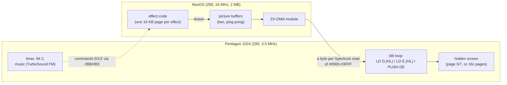
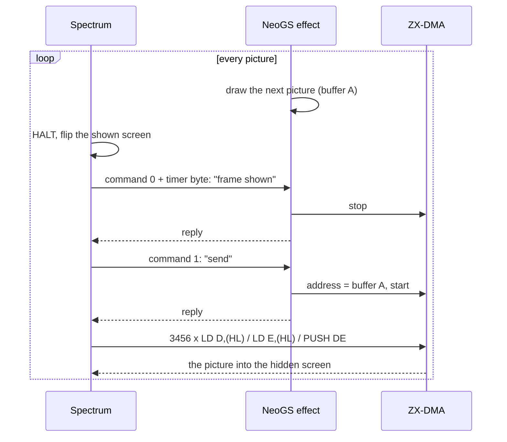
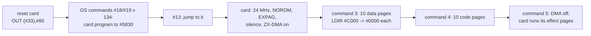

[← Home](../README.md) · [Demoscene](README.md)

# Case Study: "The Link" — A Sound Card Used as a Graphics Coprocessor (Pentagon 1024 + NeoGS)

> **Type**: case_study
>
> **Applies to**: **Soviet** track — Pentagon 1024 (1024K paging, `#EFF7`, 16-color mode) with a **NeoGS** card on the ZX-bus. Nothing else runs it: a 512K Pentagon lacks the memory, a classic General Sound lacks ZX-DMA.
>
> **Scope**: **"The Link"** (invdemo, 2009): code and music by Alone Coder, graphics by Alone Coder, Oimidrol and Shiru. Source, annotated sjasmplus port, byte-exact build and an eleven-chapter tutorial: [github.com/alfishe/TheLink-Pentagon1024-NeoGS](https://github.com/alfishe/TheLink-Pentagon1024-NeoGS). Every number below comes from that source and its build, which reproduces the author's binaries byte for byte.

---

## Overview

The NeoGS is a sound card: a Z80 of its own, megabytes of RAM, eight DAC channels. **"The Link" plays no sound on it at all.** The music runs on the Spectrum's TurboSound FM; the card's DAC volumes are zeroed by the first instructions of the demo's card program. What the demo wants from the card is its **24 MHz Z80 and its 2 MB of RAM** — roughly seven times the Spectrum's CPU, with room for sixteen pre-rotated copies of a 32 KB texture.

The card computes every picture: tunnel lookups, rotations, a lit textured 3D object, a texture-mapped face. The Spectrum's job shrinks to timing, music and one instruction triple run 3,456 times a frame — `LD D,(HL) : LD E,(HL) : PUSH DE` — that pulls the finished picture **out of the card's RAM through the Spectrum's own ROM window**. That last trick, **ZX-DMA**, is what no other known production uses this way: the card answers every read of `#0000`–`#3FFF` with the next byte of the picture it has drawn.

The demo was never released as a disk. What survived is the author's working disk: ALASM, every source, every binary, and a launcher that assembles the whole demo at each start. The repository above turns it into an ordinary cross-assembled project and a release disk with a loader, a machine check and a progress bar.

---

## 1. What You See

| Part | Frames (50 Hz `timer`) | Spectrum screen | What the card computes |
|---|---|---|---|
| intro picture + FM music | 0–895 | static picture | precalculation of the first effects |
| tunnel | 896–1778 | attributes only, 32×96 cells of two colors | texture lookup per screen byte, by generated code |
| rotator | 1792–2674 | standard bitmap | a rotating, scrolling logo from 16 pre-rotated copies |
| rotating bars | 2688–3248 | 16-color | bars swinging about their corners, rasterized into change lists |
| multi-bars | 3476–3556 | screen switches mid-frame | a T-state-timed command program for the Spectrum |
| hedgehog | 3584–4466 | 16-color | a lit, textured spiky 3D object (60 triangles) |
| girl and mill | 4480–4914 | 16-color | two masked layers scrolling at different speeds |
| textured face | 4928–5824 | 16-color | a texture-mapped head over a textured ball |
| credits | after | static | — |

The 16-color mode is the Pentagon 1024's `#EFF7` bit 0 mode ([pentagon_1024.md](../02_hardware/clones/pentagon_1024.md#the-16-colour-video-mode-16c--every-pixel-its-own-color)): two pixels per byte across four 8 KB planes in two RAM pages, no attribute clash.

---

## 2. Architecture — Who Does What



| | Spectrum | NeoGS |
|---|---|---|
| CPU | Z80, 3.5 MHz | Z80, 24 MHz (`GSCFG0` clock bits = `00`) |
| Memory used | 1024 KB, 16 KB pages at `#C000` | 2 MB, 16 KB pages in four windows |
| Job | upload card code and data at start; each frame fetch the finished picture, flip screens, play music | rotate, project, sort, texture, convert to the Spectrum's pixel format |

The **split is economic**: one 6,912-byte picture costs the Spectrum `3456 × (7 + 7 + 11) = 86,400` T-states to fetch — about **1.2 Pentagon frames** (71,680 T-states). Computing the same picture on the Spectrum would take many frames. The card computes the next picture while the Spectrum copies the previous one.

---

## 3. ZX-DMA — Reading the Card Like ROM

The card selects its ZX DMA module and points it at a 21-bit card address; from then on the card, not the ROM, answers the Spectrum's bus in the `#0000`–`#3FFF` window.

### Ports

Spectrum side (the GS mailbox, see [gs_general_sound.md](../06_sound/hardware/gs_general_sound.md#port-map)):

| Port | Decoding | R/W | Description |
|---|---|---|---|
| `#BB` | A7–A0 = `#BB` | W | command latch; sets the command bit |
| `#BB` | A7–A0 = `#BB` | R | status: bit 7 data bit, bit 0 command bit |
| `#B3` | A7–A0 = `#B3` | W | data latch; sets the data bit |
| `#B3` | A7–A0 = `#B3` | R | the card's reply byte |
| `#33` | A7–A0 = `#33` (NeoGS) | W | `#80` = reset the card |

Card side (NeoGS FPGA registers, card I/O space; A5–A0 decoded, mirrored every 256 addresses):

| Port | Decoding | R/W | Description |
|---|---|---|---|
| `#0F` | A5–A0 = `#0F` | R/W | `GSCFG0`: bit 0 NOROM (RAM in all windows), bit 3 EXPAG, bits 5–4 clock (`00` = 24 MHz). The Link writes `#09` |
| `#00` / `#10` | A5–A0 | W | `MPAG` / `MPAGEX`: pages at `#8000` / `#C000`; a byte `v` selects 16 KB page `{v6..v0, v7}` (rotate left), so "next page" is `RLCA : INC A : RRCA` |
| `#1B` | A5–A0 = `#1B` | R/W | `DMA_MOD`: 1 selects the ZX module for `#1C`–`#1F` |
| `#1C`–`#1E` | A5–A0 | R/W | `HAD`, `MAD`, `LAD`: the 21-bit card address |
| `#1F` | A5–A0 = `#1F` | R/W | `CST`: bit 7 = run |

### What the bus does while `CST` bit 7 = 1

| Spectrum access | Result |
|---|---|
| read `#0000`–`#3FFF` with ROM paged | the card returns **the byte fetched by the previous read**, fetches the next one, address + 1 |
| write `#0000`–`#3FFF` | the byte goes into card RAM (with ROM paged the ROM is untouched), address + 1 |
| card not ready | the Spectrum is held with `/WAIT` |

Two consequences shape every effect. The **first read after a start returns a stale latch** — every effect throws it away (`LD A,(HL) ; 1ST BYTE DISCARDED`, "первый байт неверен" — "the first byte is wrong"). And the **address in `HL` does not matter**, only that it lies in the ROM window, so the blit loops use `H` and `L` as page numbers at the same time.

### The fetch, as the demo writes it

```z80
; Fetch a 6912-byte picture from the NeoGS into the hidden screen.
; Precondition: the card has started its ZX-DMA module at the picture
; (command 1 answered); interrupts are disabled or survivable (section 5).
        DEVICE ZXSPECTRUM128
        ORG #8000
fetch:
        LD (savesp+1),SP
        LD SP,#C000+#1B00       ; hidden screen in page 7 at #C000: fill downwards
        LD HL,#0000             ; any address in the ROM window will do
        LD A,(HL)               ; the first byte is stale: discard        7 T
        LD B,216                ; 216 x 16 = 3456 triples
.loop:
        DUP 16
        LD D,(HL)               ; card byte                              7 T
        LD E,(HL)               ; card byte                              7 T
        PUSH DE                 ; two bytes into the screen             11 T
        EDUP
        DJNZ .loop
savesp: LD SP,0                 ; (the demo unrolls fully: 3456 triples)
        RET
```

The card stores each picture **byte-reversed**, because `PUSH` writes from the top of the screen down. The demo unrolls the triple completely; the `DUP` loop above is the same idea in a shape that fits a page.

---

## 4. The Frame Handshake

Every effect repeats one protocol: the card draws into one of two buffers, the Spectrum fetches the other.



- **Command 2** quits an effect (SPACE on the Spectrum).
- The card's wait for command 1 has a timeout of 65,536 polls; on timeout it jumps to `GSRESET`, which reboots the card. The Spectrum's waits never time out — which is exactly how the demo hangs on a classic General Sound (section 7).
- Effects that do not fetch a whole picture vary this: the tunnel fetches attributes only; the rotating bars read **change lists** (byte + screen address records); multi-bars receives a **program** — command bytes that are the high bytes of page-aligned handlers on the Spectrum, dispatched with `LD H,(HL) : JP (HL)`, timed to the T-state so that `OUT (#7FFD)` switches the shown screen in the middle of a character row.

---

## 5. Interrupts While SP Is a Write Pointer

`PUSH` is the fastest store on a Z80 (11 T-states for two bytes), but an interrupt pushes its return address wherever `SP` points — into the picture. The demo uses three answers, one per family of effects:

| Strategy | Used by | How |
|---|---|---|
| `DI` around the copy | rotator, tunnel | simple; the copy is longer than a frame, so one interrupt may be lost at 3.5 MHz |
| a handler that repairs | hedgehog, girl and mill, face | the IM 2 handler uses only the two bytes the CPU pushed, writes `DE` back over them (the pixel the interrupt destroyed), and runs on its own stack at `#5F00`; where a segment starts on a 256-byte boundary the blit generator replaces the last `PUSH` with `LD (nn),DE` |
| redirect the vector | multi-bars, rotating bars | the vector points to a `RET` (multi-bars calls music and timer directly once a frame), or the interrupt itself ends the last list (rotating bars) |

---

## 6. Startup — 20 Pages into the Card by `LDIR`

The main block `GO` (`#7800`) installs the card's program and uploads its code and data:



The upload direction is the same trick in reverse: `LDIR` from a Spectrum page at `#C000` to `#0000` writes into the ROM window, which changes nothing on the Spectrum, and ZX-DMA takes every byte into card RAM. **20 pages × 16 KB = 320 KB** cross this way before the intro picture appears. The card then loops over its code pages (`OUT (MPAGEX)`, `CALL #C000`, next page), in step with the Spectrum's resident loop over its effect pages, both driven by the frame table `zxtimings`.

---

## 7. The Author's Start, and the Release

On the author's disk `RUN "THELINK"` loads **ALASM** (its 1024K build) and the STS debugger, assembles `THELINK` — which `INCBIN`s every prebuilt effect into its RAM page with `ORG #C000,page` — and jumps to `GO`. The demo is assembled at every start. Nothing checks the machine:

| Machine | Author's disk |
|---|---|
| Pentagon 1024 + NeoGS | runs to the credits |
| Pentagon 1024 + classic General Sound | intro, then a hang at the first effect: no ZX-DMA, no `EXPAG`, the Spectrum waits for a picture forever |
| Pentagon 512 | stops during the assembly: the page plan needs 1024K |

The release disk built by the repository (the "Non-Director's Cut") replaces the assembler with a loader: it checks for 1024K paging (markers in pages 0, 8, 16, 24, 32) and for a NeoGS (GS command `#F3`, wait, then `#11` reads card register `GSCFG0`; a classic GS answers `#FF`), shows what is missing instead of hanging, and loads the 28 page files under the title picture with a progress bar.

---

## 8. Pitfalls Found on the Way

### 8.1 "The Stale Latch"

```z80
; Wrong: the first DMA read returns the previous fetch
        LD HL,0
        LD D,(HL)               ; garbage
        LD E,(HL)
        PUSH DE
; Right: read once and throw it away
        LD A,(HL)
        LD D,(HL)
        LD E,(HL)
        PUSH DE
```

### 8.2 "The Missing OUT"

`GO` loads `A` with `#17` to clear screen 1's attributes at `#D800` — and never writes it to `#7FFD`. The clear hits whatever page is at `#C000`. After the ALASM start that page is unused; after a loader that loads the music last, **733 bytes of the player** are zeroed while every frame of the picture stays correct. A screen comparison cannot catch it; a comparison of the page with its file does. The release loader selects page 7 itself before `JP GO`.

### 8.3 "The JNZ Trap" (porting from ALASM)

ALASM's `JNZ x` / `JC x` are **relative** jumps (`JR NZ` / `JR C`). A port that reads them as `JP` assembles without a warning and is one byte longer at every site — the first hand port of the main block came out 6 bytes longer. Only a byte comparison against the original binary finds it.

### 8.4 "The Classic Card"

Software that needs ZX-DMA must not assume the GS mailbox means a NeoGS. Probe it: a classic GS treats `#F3` as a reboot through its POST (0.3–1.1 s), so wait long enough before concluding there is no card; then `#11` returns `GSCFG0`, `#FF` on a non-NeoGS.

---

## 9. Impact on FPGA / Emulation

| Requirement | Why |
|---|---|
| Pentagon 1024 paging: `#7FFD` bits 5–7 as page bits when `#EFF7` bit 2 = 0 | the page plan uses pages above 512K |
| `#EFF7` bit 0 16-color mode | four of the effects |
| the NeoGS firmware's `#18`/`#19`/`#13` | installing the card program |
| `GSCFG0` 24 MHz, NOROM, EXPAG; `MPAGEX` | the card program |
| ZX-DMA **writes** with ROM paged (ROM untouched, card takes the byte) | the 320 KB upload |
| ZX-DMA **reads** with the one-read latency and `/WAIT` | every picture |
| per-access synchronization of the card with the Spectrum | the card must be exactly where the Spectrum's read finds it; a card that runs a frame ahead or behind delivers the wrong bytes |

An emulator that runs the card in whole-frame slices and catches up only at mailbox accesses shows the intro and then garbage: ZX-DMA requires the card to be brought up to date at every Spectrum access to `#0000`–`#3FFF` while the module runs.

---

## 10. Cross-References

- [gs_general_sound.md](../06_sound/hardware/gs_general_sound.md) — the GS / NeoGS card, its mailbox and command set
- [pentagon_1024.md](../02_hardware/clones/pentagon_1024.md) — 1024K paging, `#EFF7`, the 16-color mode
- [multicolor_techniques.md](multicolor_techniques.md) — mid-frame screen switching, which multi-bars drives from a card-written program
- [effects_catalog.md](effects_catalog.md) — tunnels, rotators, 3D objects, as normally done on the Spectrum alone
- [precalc_trigonometry.md](precalc_trigonometry.md) — sine and tangent tables; The Link's four tables were computed in Sinclair BASIC
- [compression_packing.md](compression_packing.md) — Hrust, which packs the tunnel's lookup tables
- [demo_frameworks.md](demo_frameworks.md) — part sequencing, which here is split across two CPUs
- [README.md](README.md) — section index

## References

- Source, byte-exact build, release disk and tutorial: [github.com/alfishe/TheLink-Pentagon1024-NeoGS](https://github.com/alfishe/TheLink-Pentagon1024-NeoGS) — `docs/tutorial/` (eleven chapters), `docs/analysis.md`, `docs/loader.md`
- NeoGS hardware, FPGA and firmware sources: [github.com/alfishe/neogs](https://github.com/alfishe/neogs) — the ZX DMA module is `fpga/current/dma/dma_zx.v`

---

## License

This article is released under **Creative Commons Attribution-ShareAlike 4.0 International (CC BY-SA 4.0)**. You are free to share and adapt the material, provided you credit the original source and license derivative works under the same terms.

The analysis draws on the source code of "The Link" by Alone Coder, Oimidrol and Shiru (2009), kept in the repository above; the explanation and cross-references are original to this knowledge base.
