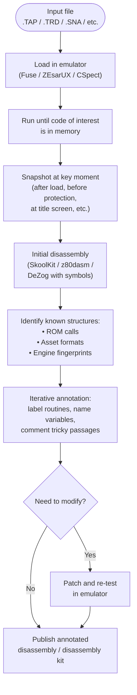

[← Home](../README.md) · [Reverse Engineering](README.md)

# ZX Spectrum Reverse Engineering Methodology — From Snapshot to Source

ZX Spectrum reverse engineering (RE) is the practice of taking a commercial program — usually a tape image (`.TAP`/`.TZX`), disk image (`.TRD`/`.DSK`), or snapshot (`.SNA`/`.Z80`) — and reconstructing from it the source code, asset formats, game logic, or protection scheme that the original developer wrote. The Spectrum is an unusually good RE target for three reasons: the platform is simple enough that one person can hold the entire hardware model in their head; the tools (emulator debuggers, Z80 disassemblers, snapshot manipulators) are mature and free; and the historical software library is large, well-preserved, and culturally important — every major title has been disassembled, documented, or rebuilt by the community at least once.

This article is the **methodology hub** for ZX Spectrum RE work. It covers the workflow — how to take an opaque binary blob and turn it into readable, annotated, modifiable code — and the specific tools and techniques that work for this platform. It is the **practical companion** to [protection_techniques.md](protection_techniques.md) (which catalogues what protections exist) and to the toolchain articles (which catalogue the assemblers, monitors, and disassemblers themselves).

> [!NOTE]
> This article focuses on **how to do RE on the Spectrum**: the workflow, the heuristics, the pitfalls. For **what** the protections are, see [protection_techniques.md](protection_techniques.md). For the **tools themselves** (sjasmplus, DeZog, ZEsarUX, etc.), see [cross_platform_toolchain.md](../09_toolchain/cross_platform_toolchain.md) and [debugging.md](../09_toolchain/debugging.md).

---

## Contents

1. [Starting Points — What Kind of File Are You RE-ing?](#1-starting-points--what-kind-of-file-are-you-re-ing)
2. [The Standard Workflow — Snapshot → Annotated Disassembly → Source](#2-the-standard-workflow--snapshot--annotated-disassembly--source)
3. [Static Analysis — Reading the Code Without Running It](#3-static-analysis--reading-the-code-without-running-it)
4. [Dynamic Analysis — Running the Code Under a Debugger](#4-dynamic-analysis--running-the-code-under-a-debugger)
5. [Heuristics — Identifying Routines, Asset Formats, and Game Engines](#5-heuristics--identifying-routines-asset-formats-and-game-engines)
6. [Patching and Modification](#6-patching-and-modification)
7. [Tools for ZX Spectrum RE](#7-tools-for-zx-spectrum-re)
8. [Pitfalls and Platform-Specific Gotchas](#8-pitfalls-and-platform-specific-gotchas)
9. [Ethics and the Spectrum RE Tradition](#9-ethics-and-the-spectrum-re-tradition)

---

## 1. Starting Points — What Kind of File Are You RE-ing?

ZX Spectrum software reaches a modern reverse engineer in one of five formats, each with its own starting workflow:

| Format | Extension | What's inside | First step |
|---|---|---|---|
| **Tape image** | `.TAP` | Pulse-level representation of standard ROM blocks (header + data) | Load in emulator; if it runs, snapshot at interesting moment |
| **Tape image (preservation)** | `.TZX` | Pulse-level, with custom loaders / non-standard timings preserved | Same — but expect encrypted/compressed/packed payload |
| **Disk image (TR-DOS)** | `.TRD` | Pentagon/Russian-clone disk image; files inside are typically `.B`, `.C`, `.S` or plain code files | Open in emulator; inspect files; load one into memory |
| **Disk image (+3 DOS / CP/M)** | `.DSK` | Amstrad +3 / Spectrum +3 disk image | Same — but use +3 DOS file structure |
| **Snapshot** | `.SNA` / `.Z80` | A frozen Spectrum state: CPU registers + RAM (+ some ROM state on 128K) | Load directly in emulator/debugger — code is already in memory |
| **Standalone binary** | `.SCR` (screen), `.SP` (sprite), `.MUS` (music), `.BIN` (raw code) | A file with a known or guessed internal format | Identify format, parse structure, extract/convert |

The crucial first decision: **is the target software already running, or do you have to get it running first?** For a `.SNA` snapshot the answer is yes — the code is in memory, the PC is set, you can start debugging immediately. For a `.TAP` of a copy-protected tape, you may have to deal with the loader first — see [§8 Pitfalls](#8-pitfalls-and-platform-specific-gotchas) and [protection_techniques.md](protection_techniques.md).

### The Snapshot Approach

The single most powerful technique in ZX Spectrum RE is **snapshotting at the right moment**. The Spectrum's state is fully captured by ~64 KB of memory plus a handful of CPU registers — small enough that an emulator can save and restore it instantly. This means you can:

- Snapshot *before* a protection check, then step over the check to see what it does
- Snapshot *after* the loader has unpacked/decrypted the code but *before* execution — this captures the unprotected code in memory
- Snapshot at a game's start screen, then immediately disassemble from the CPU's PC
- Keep multiple snapshots at different points and diff their memory to find what changed

The `.SNA` format is 49,179 bytes for 48K (header + 48 KB RAM) or 131,083 bytes for 128K. The `.Z80` format is more flexible (supports paging, different models) but slightly more complex to parse. Both are loadable by every major emulator.

---

## 2. The Standard Workflow — Snapshot → Annotated Disassembly → Source

Most ZX Spectrum RE projects follow the same general workflow:



The key insight is that this is **iterative**. You don't disassemble once and be done; you disassemble, recognise a routine, name it, recognise another, name it, and slowly the listing turns from a wall of opcodes into a readable program. The first pass is typically 80% unknown; by the fifth pass, you should have most routines named and the overall flow clear.

### Tool Choices for Each Stage

| Stage | Recommended tool | Alternative |
|---|---|---|
| Loading & snapshotting | ZEsarUX (best debugger), Fuse (simple), CSpect (Next-focused) | UnrealNG, spectaculator |
| Initial disassembly | SkoolKit (best for whole-program annotation), z80dasm (quick CLI dump) | DeZog with disassembly view, IDA Pro with z80 plugin |
| Iterative annotation | SkoolKit (.skool format → HTML/ASM output) | Direct listing in DeZog with .map symbols |
| Patching & re-test | DeZog (VS Code), ZEsarUX monitor | Hand-edited hex in any binary editor |
| Publishing | SkoolKit (generates browsable HTML), GitHub (raw .skool file) | Plain .asm file with comments |

For tool setup details, see [debugging.md](../09_toolchain/debugging.md).


---

## 3. Static Analysis — Reading the Code Without Running It

Static analysis is what you do before (or instead of) running the code under a debugger. The goal is to extract as much information as possible by reading the bytes — without executing them. This is the primary technique when:

- The code is encrypted/packed and you cannot yet run it
- You want to understand a routine's logic without trigger conditions
- You are looking for asset formats, magic numbers, or string tables
- You need to find specific patterns (e.g., where the game writes to `#4000`)

### 3.1 The Initial Disassembly Pass

Start by dumping a raw disassembly of the entire code region. The two tools:

**z80dasm** (command-line, fast):
```bash
z80dasm --origin=24576 --sym=labels.sym game.bin > game.asm
```

**SkoolKit's sna2skool** (produces annotated .skool file):
```bash
sna2skool game.sna > game.skool
```

Both produce a Z80 assembly listing, but the SkoolKit output is **designed to be edited and re-rendered** — you annotate the .skool file with comments, labels, and data type hints, then render it to HTML or back to assembly. This is the gold standard for Spectrum RE publishing.

### 3.2 Identifying Code vs Data

A Z80 disassembler cannot tell code from data — it will happily disassemble a sprite table as garbage opcodes. The classic Spectrum RE problem is "untangling" code and data. Heuristics:

1. **Trace from known entry points.** The CPU's PC after a snapshot is a code address. ROM routines (e.g., `#0E9B` CLALL, `#03B5` BEEPER) are code. Any address in a jump table is likely code.

2. **Look for the classic Z80 function prologue:**
   ```z80
   push af
   push bc
   push de
   push hl
   ```
   This pattern (or its subset) marks the start of a subroutine that saves its caller's state.

3. **Look for `RET`, `JP`, `JR` as end-of-function markers.** A `RET` (`#C9`) typically ends a function; the next byte is either the start of a new function or padding/alignment.

4. **Data regions usually have characteristic shapes:**
   - `0x00`-filled: zero-padded RAM (uninitialised)
   - `0xFF`-filled: ROM's unused space
   - Repeating `0x55 0xAA`: bitmap data (alternating bits)
   - Long runs of `0x00`: blank screen areas (e.g., the lower 6 KB of a screen RAM that hasn't been written yet)

5. **Use SkoolKit's `b` (byte block), `w` (word block), `t` (text), `s` (subroutine) directives** to mark data regions explicitly. Once marked, SkoolKit will not try to disassemble them.

### 3.3 ROM Call Recognition

The Spectrum's 48K ROM has well-known entry points (see [rom_48k.md](../04_operating_systems/rom_48k.md) for the complete map). When the disassembly shows `CALL #0E9B` or `RST #10`, you can immediately label it:

```z80
L01A3:  CALL #0E9B           ; CL-ALL — close all streams
        LD   A,(#5C3C)       ; TVDATA flag
        ...
        RST  #10             ; PRINT-A — print character
```

This single technique — recognising and labelling ROM calls — can cut the apparent complexity of a disassembly by 50% on the first pass, because commercial Spectrum code uses ROM routines heavily for I/O, printing, tape, and floating-point math.

### 3.4 String and Asset Detection

ZX Spectrum software typically stores strings and assets in identifiable ways:

- **Plain ASCII strings**: bytes `0x20`–`0x7F` in long runs. The disassembler shows these as garbage mnemonics (`AND B`, `INC H`, etc.) — switch to hex view to read them.
- **Tokenised BASIC strings**: in BASIC programs, tokens like `PRINT` are stored as single bytes (`#A5`–`#xFF`), not as text. See [character_set.md](../10_references/character_set.md) for the token table.
- **Sprite data**: 8-byte aligned blocks where each byte represents one row of 8 pixels. A sprite table is typically `n × 8` bytes with no padding.
- **Screen bytes**: if you see the 6,144-byte block of `#4000`–`#57FF` in a snapshot, it is the pixel display.
- **Attribute blocks**: 768-byte tables at offsets aligned to `#5800`-style boundaries; each byte's `0xF8` mask gives PAPER, `0x07` mask gives INK.
- **Music data**: PT3 modules start with the magic bytes `PT3` followed by a header. AY register dumps (`.PSG`) start with the magic `PSG\u001A`.

### 3.5 Cross-Reference Analysis

Once you have a disassembly, you can identify which routines call which. The classic heuristic:

- A `CALL nn` or `JP nn` target that appears **many times across the program** is a utility routine (print, draw, sprite blit, music play)
- A target called **only once** is often a state-transition or initialisation routine
- A target **never called** by any other routine is either data mistaken for code, or a routine entered via indirect jump (`JP (HL)`)

SkoolKit generates a cross-reference listing automatically; z80dasm emits symbol tables that can be grepped.


---

## 4. Dynamic Analysis — Running the Code Under a Debugger

Dynamic analysis is what you do once the code is runnable. The goal is to observe the program's behaviour at the instruction level: where the PC goes, what memory it touches, what the registers contain at key moments. For ZX Spectrum RE, this is done with an emulator's **machine-code monitor** or with a modern **IDE-integrated debugger** like DeZog.

### 4.1 The Emulator Monitor

ZEsarUX has the most complete Spectrum debugger of any emulator. Its monitor features:

- **Disassembly view** with current PC, SP, registers, and flags
- **Breakpoints** at any address (memory access or PC hit)
- **Watchpoints** on memory ranges (read/write/access)
- **Single-step, step-over, step-out** for tracing through code
- **Trace log** — records every executed instruction (tens of millions per second of game time)
- **Memory editor** with hex/character/decimal views
- **Register editor** — change any register on the fly
- **I/O port trace** — log every `IN`/`OUT` to identify port usage
- **Floating bus / contention visualisation** — show ULA state cycle by cycle

For most RE work, the workflow is:

1. Load the program; run until the interesting moment; snapshot.
2. Set a breakpoint at the address you want to investigate (e.g., the start of a routine).
3. Resume execution; trigger the breakpoint by interacting with the program.
4. Step through the routine, watching registers and memory.
5. Modify registers/memory to test hypotheses (e.g., force a protection check to pass).

### 4.2 DeZog — The Modern Approach

**DeZog** is a VS Code extension that connects VS Code's debugging UI to a Spectrum emulator (ZEsarUX, CSpect, MAME, or others via a debug protocol). It provides:

- **Source-level debugging** if you have a .lst/.sym file from sjasmplus
- **Disassembly view** with inline annotations
- **Watch expressions** (e.g., `HL`, `(HL)`, `(#5C3C)`)
- **Conditional breakpoints** (e.g., break at `L01A3` only when `A == 0x42`)
- **Memory view** with hex/ASCII, watchpoints
- **Reverse debugging** (with ZEsarUX) — step *backwards* through execution
- **Label auto-import** from sjasmplus `.sym` files

DeZog's killer feature is the **sjasmplus integration**. If you have the original source (or a re-assembly from a SkoolKit output), DeZog shows your source code with the current PC highlighted — a normal IDE-style debugging experience. See [debugging.md](../09_toolchain/debugging.md) for setup.

### 4.3 Trace Logging

For tricky problems — non-deterministic bugs, hardware-dependent timing issues, protection schemes that react to debugger presence — **trace logging** is the technique of last resort. ZEsarUX can log every executed instruction, in order, with full register state. The resulting trace file is enormous (gigabytes per minute of game time) but contains complete information.

Typical trace-log analysis:

```bash
# Find every write to port #FE (border/beeper) in the trace
grep -E 'OUT \(#FE\)' trace.log

# Find every call to ROM routine #03B5 (BEEPER)
grep -E 'CALL #03B5' trace.log

# Find every memory write to #5C00..#5CB5 (system variables)
awk '/^WRITE [0-9A-F]+ #5C[0-9A-F]+$/' trace.log
```

This is brute-force but effective. It works even on self-modifying code, encrypted code (after decryption), and code that defeats the disassembler.

### 4.4 Reverse Debugging

ZEsarUX supports **reverse execution** — the ability to step backwards through previously-executed code. Combined with DeZog, this means you can:

- Hit a breakpoint at a crash
- Step *backwards* to find the routine that loaded the bad value
- Set a breakpoint at that routine's start, run forward, and watch the bug develop

This is invaluable for sporadic, hard-to-reproduce bugs. The cost is RAM (the entire execution history is kept in memory) and speed (reverse-stepping is slow), but for hard problems there is no substitute.


---

## 5. Heuristics — Identifying Routines, Asset Formats, and Game Engines

After a few dozen ZX Spectrum RE projects, certain patterns repeat. Recognising them dramatically accelerates the analysis.

### 5.1 ROM Call Patterns

The 48K ROM exports a small but well-defined set of useful routines. Once you know them, the call sites identify themselves:

| Routine | Address | What it does | Typical caller pattern |
|---|---|---|---|
| `BEEPER` | `#03B5` | Play a tone (pitch + duration in HL/DE) | Sound effect routines; usually called inside a `DI/EI` pair |
| `CLS` | `#0DAF` | Clear screen using current attribute | Game initialisation |
| `CL-ALL` | `#0E9B` | Close all streams | Tape error recovery, program init |
| `PRINT-A` (via `RST #10`) | `#0010` | Print character in A | Score display, status messages |
| `KEY-SCAN` | `#028E` | Scan keyboard into KSTATE | Game input loops |
| `LD-BYTES` | `#0556` | Tape load a block | Custom loaders branch from here |
| `SA-BYTES` | `#04C2` | Tape save a block | Save-game routines |
| `POPT-A`/`PUSH-NO` (via `RST #28`) | `#0028` | Floating-point calculator | BASIC programs, score math |
| `HL-FIND` | `#1B17` | Find a character class | Tokeniser |

A detailed map is in [rom_48k.md](../04_operating_systems/rom_48k.md).

### 5.2 Compiler Fingerprints

ZX Spectrum software was compiled from high-level languages (C, Pascal, BCPL) on rare occasions, but most games and applications are pure Z80 assembly. When a compiler was used, it leaves fingerprints:

- **HiSoft C**: routine prologue is `PUSH IX / LD IX,nn / ADD IX,SP` — stack frame setup. Compiled code makes heavy use of the index registers.
- **Pascal MT+**: distinct integer division code using `LD A,#FF / RRA / LD A,#FF / RRA` and table-driven addressing.
- **Hisoft BASIC Compiler**: produces very compact code that resembles hand-written Z80 but with characteristic stack manipulation.
- **z88dk's z80asm** (modern): produces standard Z80 but with distinctive `__z88dk_*` runtime library calls (when not stripped).

Modern cross-assembled code (sjasmplus, Pasmo) is essentially indistinguishable from hand-written Z80 unless the developer left `.LIST`/`.NOLIST` directives or used specific macro patterns.

### 5.3 Game Engine Fingerprints

Certain game engines are recognisable from a few opcodes:

- **Ultimate Play the Game engine** (Knight Lore, Alien 8, etc.): uses the **filmstrip attribute system** and a characteristic 32-bit fixed-point sprite blit; routine at predictable offsets.
- **Graftgold engine** (Flying Shark, Uridium, Cyclone): uses the **flip screen** technique with pre-shifted sprite tables at `#XX00` boundaries.
- **Software Projects / Bug-Byte engine** (Manic Miner, Jet Set Willy): single-screen platformer with a per-screen data block; sprite data at fixed offsets.
- **Ocean engine** (multiple): uses a generic **memory-bank-switching ISR** for music while the game runs in main memory.

Identifying the engine can save days of analysis, because published disassemblies (e.g., John Elliott's *Manic Miner* disassembly, the SkoolKit disassemblies) provide a reference.

### 5.4 Music Player Fingerprints

AY music players have distinctive ISR entry patterns:

| Player | Magic | Detection |
|---|---|---|
| **PT3 player** (Vortex) | Routine starts with `EXX / EX (SP),HL / EXX` and writes 14 bytes to ports `#FFFD`/`#BFFD` per call | Look for `LD BC,#FFFD` / `OUT (C),A` pattern |
| **AKG/AKM (Arkos)** | Uses a self-modifying data pointer in IX/IY | Look for `LD BC,#FFFD` followed by 13 register writes |
| **ASM (Asc Sound Master)** | Uses an envelope-mode-per-tick model | Look for port-write pattern with extra writes for envelope period |
| **1-bit beeper engines** | Toggles bit 4 of `#FE` in tight loops with frame sync via INT | Look for `LD A,(border) / XOR 0x10 / OUT (#FE),A` |

The `.PT3` file format starts with the literal `PT3` (3 bytes); `.AY` dumps start with `ZXAYEMUL`; `.PSG` files start with `PSG\u001A`. See [ay_music_formats.md](../06_sound/trackers_and_formats/ay_music_formats.md).

### 5.5 Asset Format Detection

Game assets on the Spectrum are usually stored in one of a few standard formats. Magic-number and structural cues:

| Asset | Magic / structure | Notes |
|---|---|---|
| **`.SCR` (screen)** | 6,912 bytes exactly (`#4000`–`#5AFF` pixels+attrs, sometimes just 6,144 pixels) | Universally loadable; some `.SCR` files add a 768-byte palette header for 128K |
| **`.SP` (sprite)** | Variable; usually 8-byte aligned, no header | Format varies wildly — manual inspection needed |
| **`.MUS` / `.PT2` / `.PT3`** | PT3: `PT3` magic at offset 0; PT2: no magic, header is a binary structure | See [pt3_format.md](../06_sound/trackers_and_formats/pt3_format.md) |
| **`.TAP`** | Each block: 2 bytes length + flag byte + payload + checksum byte | Standard Sinclair block format |
| **`.Z80` snapshot** | First byte is the Z80 CPU register A, version byte at offset 30 distinguishes 48K vs 128K versions | Two versions of the format exist |
| **`.SNA` snapshot** | First byte is CPU I register, snapshot is fixed-length per machine type | Simpler than `.Z80` |


---

## 6. Patching and Modification

After analysis, you may want to modify the program. Common motivations:

- **Bypass a protection check** that has failed or that you want to skip
- **Fix a bug** that crashes on modern hardware/emulators but didn't on original hardware
- **Translate** game text from one language to another
- **Port** the code to a new model (e.g., 48K to 128K, or to add AY music)
- **Add a cheat** (infinite lives, level skip, etc.)

### 6.1 Patch Techniques

| Technique | How | When to use |
|---|---|---|
| **NOP patch** | Replace a check with `NOP`s (`#00`) so it always succeeds | Simplest patch; removes a single `RET Z` or similar |
| **Forced branch** | Replace a `JR Z,nn` with `JR nn` (always taken) or `JR NZ,nn` with `NOP`+`JR nn` | To bypass a conditional check |
| **Return-early patch** | Insert a `RET` at the start of a routine you want to disable | Cleanest way to neutralise a function |
| **Trampoline patch** | Replace several instructions with a `JP` to free space; put the replacement code + original instructions in the free space | When the patch needs more bytes than the original allows |
| **Hardware-detection patch** | Replace the model detection routine with a fixed result | When the code mis-detects an emulator as incompatible hardware |

Free space for trampolines is often available at the end of any 16K bank (padding to a 16K boundary), in unused screen-attribute areas (`#5B00`–`#7FFF` for non-screen use), or in pages of paged ROM/RAM (128K).

### 6.2 Reassembly

For substantial modifications, the cleanest workflow is:

1. Convert the binary to a SkoolKit `.skool` file with `sna2skool`
2. Annotate the .skool file with comments and labels
3. Modify the .skool file with your patches
4. Re-assemble with `skool2asm` or `skool2bin`
5. Test the resulting `.bin` / `.sna` in the emulator

This produces a reproducible patch — the .skool file is text, so it can be version-controlled, diffed, and shared.

### 6.3 Binary Diff Patches

For distributing a small patch to a large file (e.g., a one-byte fix to a 48K snapshot), use a **binary diff patch** rather than redistributing the entire file. The **xdelta** and **bsdiff** formats are common; the **IPS** format is older but widely supported by Spectrum tools. The principle:

```bash
xdelta3 -e -s original.sna patched.sna patch.xdelta
# Distribute patch.xdelta; recipient applies:
xdelta3 -d -s original.sna patch.xdelta patched.sna
```

This is the standard way Spectrum "trainers" and translation patches are distributed.

---

## 7. Tools for ZX Spectrum RE

The standard modern toolkit:

### 7.1 Emulators with Debugging

| Emulator | Platforms | Debugger quality | Notes |
|---|---|---|---|
| **ZEsarUX** | Win/Mac/Linux/RPi/Android | Excellent — most complete Spectrum debugger | The de-facto standard for RE work |
| **Fuse** | Win/Mac/Linux | Good — basic monitor, hex editor | Simple, fast, widely used |
| **CSpect** | Win/Linux | Good — strong on ZX Spectrum Next | Best for Next-specific RE |
| **UnrealNG / Unreal Speccy** | Win | Good — traditional Russian Spectrum debugger | Popular for Pentagon-targeted work |
| **Spectaculator** | Win | Decent — paid, polished | Commercial, popular with retro-game reviewers |

### 7.2 Disassemblers

| Tool | Type | Notes |
|---|---|---|
| **SkoolKit** | Annotated disassembler + HTML renderer | Gold standard for Spectrum RE publishing; .skool file format |
| **z80dasm** | CLI disassembler | Quick hex dump to .asm; useful for first-pass |
| **DeZog** | VS Code extension | Source-level debugging if .sym available; integrates with ZEsarUX |
| **IDA Pro + z80 plugin** | Commercial RE IDE | Overkill for Spectrum but familiar to professional REs |
| **Ghidra + z80 processor module** | Free RE IDE | Modern alternative to IDA; supports decompilation (experimental) |

### 7.3 Snapshot and Tape Manipulators

| Tool | Function |
|---|---|
| **z80dump** | Inspect `.Z80` snapshot headers |
| **snapconv** (part of Fuse utils) | Convert between `.SNA`, `.Z80`, `.SP`, `.RAW` |
| **tzx** tools (`tzxlist`, `tzxproc`) | Inspect and modify `.TZX` tape images |
| **tape2wav** | Convert `.TAP`/`.TZX` to actual `.WAV` audio |
| **Bin2Tap** / **Tap2Bin** | Convert between raw binary and `.TAP` |
| **TRDTool** | Manipulate `.TRD` disk images |

### 7.4 Modern Development Environments

| Tool | Function |
|---|---|
| **sjasmplus** | Primary recommended cross-assembler; see [sjasmplus.md](../09_toolchain/sjasmplus.md) |
| **DeZog** | VS Code debugger; see above |
| **Klive IDE** | Standalone cross-platform IDE with Z80 support |
| **VS Code + Z80 Macro-Assembler extension** | Lightweight editor with syntax highlighting |
| **ZX Spectrum Assembly Meter extension** | Inline T-state counting for timing-critical code |

For tool setup details, see [debugging.md](../09_toolchain/debugging.md) and [cross_platform_toolchain.md](../09_toolchain/cross_platform_toolchain.md).


---

## 8. Pitfalls and Platform-Specific Gotchas

### 8.1 Self-Modifying Code

ZX Spectrum software frequently uses **self-modifying code** (SMC) — instructions that rewrite their own bytes during execution. A static disassembler shows one version of the code; the actual execution may use another. Examples:

- A `LD A,nn` instruction whose `nn` byte is overwritten before each use (table-driven dispatch)
- A `JP nn` whose target is computed and written before the jump
- Decryption stubs that overwrite their own decryption code with the decrypted payload

**Mitigation:** always confirm the static disassembly against dynamic execution. Snapshot at the moment of interest and disassemble the actual bytes in RAM at that point.

### 8.2 Encrypted/Packed Code

Many commercial games are packed (compressed) or encrypted in their distribution form. The unpacking happens at load time, in tight self-decrypting loops. Static analysis of the packed form is useless — you must either:

1. **Let the loader run** in the emulator, then snapshot at the post-unpack moment
2. **Manually unpack** with knowledge of the packer's algorithm (see [compression_packing.md](../07_demoscene/compression_packing.md) for the packer landscape)

Common packers: **HRUM**, **MegaLZ**, **ZX0/ZX1/ZX2**, **Pletter**, **LZ4** (modern). Each has a characteristic depacker routine at the start of the packed code.

### 8.3 Multi-Model Code

ZX Spectrum software written for one model (e.g., 48K) frequently breaks on another (e.g., Pentagon). Common pitfalls:

- **Contended I/O timing** — code that races the beam using contended `IN`/`OUT` cycles runs at the wrong speed on the Pentagon (no contention) or on the +2A/+3 (different contention)
- **INT timing** — code that assumes INT at T=0 with a specific scanline count runs at the wrong rate on the 128K, +2A, Pentagon, or Next
- **Floating bus** — code that reads `#FF` for raster sync returns garbage on +2A/+3 and the Pentagon
- **Banking differences** — code that writes `#7FFD` bits assuming 128K paging produces wrong results on +2A/+3 (which adds `#1FFD` banking)
- **Pentagon-specific extensions** — code that uses `#EFF7` extended paging is Pentagon-only

**Mitigation:** test on multiple emulators configured for different models. Detect the model at runtime and switch timing tables (see [clone_timing.md](../02_hardware/clones/clone_timing.md) for detection techniques).

### 8.4 Anti-Debugging Tricks

Some software actively resists debugging. Techniques include:

- **Memory integrity checks** — compute checksums over the code region; if a breakpoint (`#DD` for `RST #38`) has been inserted, the checksum fails
- **Stack-based canaries** — push known values on the stack; if a debugger has been pushing return addresses, the canary fails
- **`RST #38` trap** — fill all unused memory with `#FF` (RST #38 / `RST 7`) so any unintended jump lands in a known handler
- **Self-modifying loops** that detect single-step timing (each step takes microseconds; a debugger adds milliseconds)

For a complete catalogue of anti-debugging tricks and counter-techniques, see [protection_techniques.md §3 and §6](protection_techniques.md).

### 8.5 ROM Version Differences

The 48K ROM is essentially fixed (one version, ever), but the 128K / +2 / +2A / +3 ROMs vary. Code that calls specific ROM routines by address may break on a different ROM version. The Pentagon's Russian-localised ROM is especially divergent. **Mitigation:** avoid depending on ROM routines beyond the well-known stable entry points (see [rom_48k.md](../04_operating_systems/rom_48k.md)).

### 8.6 Snapshot Capture Timing

A snapshot taken at the wrong moment captures a half-modified state. Examples:

- Snapshot during a stack operation — SP and the stack contents may be inconsistent
- Snapshot during an interrupt — the I register may be in an unusual state
- Snapshot mid-DMA — the FDC may have partially written a sector to RAM

**Mitigation:** take multiple snapshots at slightly different moments; compare them; use the one that shows the expected consistency (e.g., PC pointing to a known instruction, SP pointing inside the expected stack range).

---

## 9. Ethics and the Spectrum RE Tradition

ZX Spectrum reverse engineering has a **mature, well-established ethical tradition** that long predates the modern "abandonware" debate. The principles:

1. **Commercial Spectrum software is, with very few exceptions, abandoned.** No publisher has sold Spectrum games commercially since the mid-1990s; copyright holders have either dissolved or transferred rights. Disassembly and re-publication for preservation purposes is universally accepted in the community.

2. **Authors are credited and consulted where possible.** When a SkoolKit disassembly is published, the original author is credited on the title page. Many disassembly projects were undertaken with the original author's blessing or active participation.

3. **Disassemblies are published as educational resources, not for redistribution.** The annotated .skool file is a teaching tool — readers learn from the analysis, but the resulting code is not "the game" and cannot be played without the original assets.

4. **The community enforces attribution.** Plagiarism (publishing someone else's disassembly without credit) is rare and swiftly addressed when discovered.

5. **Tooling is open.** SkoolKit, z80dasm, sjasmplus, ZEsarUX, DeZog, and the major emulators are all open-source. There is no proprietary lock-in on Spectrum RE work.

### 9.1 Recommended Practices

- **Publish your .skool file** to GitHub with an open-source licence (CC-BY-SA is common)
- **Credit the original developers** prominently in your disassembly's title page
- **Cross-link to existing disassemblies** of related software (e.g., if you do Jet Set Willy, link to the Manic Miner disassembly for engine comparison)
- **Document your methodology** — what tools you used, what heuristics worked, what surprised you
- **Respect author requests** — if a rights-holder asks you to take down a disassembly, the community standard is to comply and replace with a link to a different preservation source

---

## 10. References

- [SkoolKit](https://skoolkit.ca/) — annotated disassembly toolkit and home of the canonical Spectrum game disassemblies
- [ZEsarUX](https://github.com/chernandezba/zesarux) — emulator with the most complete Spectrum debugger
- [DeZog](https://github.com/maziac/DeZog) — VS Code debugging extension
- [z80dasm](https://www.tablix.org/~avian/blog/articles/2008-07-19-1.html) — CLI disassembler
- [sjasmplus](https://github.com/z00m128/sjasmplus) — modern cross-assembler
- [The Tipshop](https://www.the-tipshop.co.uk/) — central index of Spectrum tips, pokes, and disassemblies
- [ZX Spectrum archives — World of Spectrum](https://worldofspectrum.org/) — software preservation archive

### Cross-References

- [Protection Techniques](protection_techniques.md) — the catalogue of what protections exist
- [ROM 48K](../04_operating_systems/rom_48k.md) — ROM entry points to recognise in disassembly
- [Character Set](../10_references/character_set.md) — token table for identifying BASIC strings
- [System Variables](../04_operating_systems/system_variables.md) — `#5C00`–`#5CB5` (frequently read/written)
- [Contention Model](../05_development/03_memory_and_io/contention_model.md) — timing-sensitive code pitfalls
- [Clone Timing](../02_hardware/clones/clone_timing.md) — multi-model code pitfalls
- [Compression & Packing](../07_demoscene/compression_packing.md) — packer identification and unpacking
- [AY Music Formats](../06_sound/trackers_and_formats/ay_music_formats.md) — music asset detection
- [PT3 Format](../06_sound/trackers_and_formats/pt3_format.md) — Russian AY music format
- [Cross-Platform Toolchain](../09_toolchain/cross_platform_toolchain.md) — modern assembler/debugger setup
- [Debugging](../09_toolchain/debugging.md) — DeZog, ZEsarUX setup, debug workflow
- [sjasmplus](../09_toolchain/sjasmplus.md) — primary recommended assembler
