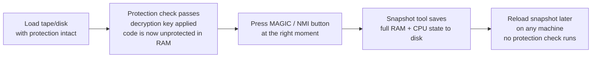

[← Home](../README.md) · [Reverse Engineering](README.md)

# ZX Spectrum Software Protection — Tape Loaders, Disk Schemes, NMI/Snapshot Defenses, and Bypass Techniques

Commercial ZX Spectrum software was pirated on an industrial scale. From the earliest tape releases in 1982, publishers fought back with increasingly sophisticated protection schemes — custom loaders that exploited hardware quirks, disk formats that defeated standard copiers, and anti-debugging tricks that detected or resisted snapshot devices and NMI-based debuggers. The Soviet clone ecosystem amplified both sides: cheap hardware made piracy trivial, but the Scorpion's Shadow Service Monitor and the NMI+STS combination gave reverse engineers professional-grade tools.

This article is the **central reference** for ZX Spectrum software protection. It covers tape-based protection (turbo loaders, Speedlock, Alkatraz), disk-based protection (weak bits, non-standard sectors, custom formats), the **NMI / snapshot defense section** (how copy-protected software resisted hardware debuggers, and how devices like the Multiface and Scorpion Shadow Monitor overcame those defenses), memory integrity checks, code obfuscation, and practical bypass techniques.

> [!NOTE]
> This article consolidates protection-related content that also appears in domain-specific articles. For the hardware-level details of each subsystem, follow the cross-references:
> - Tape loaders: [tape_interface.md](../03_io/storage/tape_interface.md) · [tzx_format.md](../03_io/storage/tzx_format.md)
> - Disk protection: [beta_disk_interface.md §11](../03_io/storage/beta_disk_interface.md)
> - NMI mechanics: [z80_interrupts.md → NMI](../01_cpu/z80_interrupts.md#non-maskable-interrupt-nmi)
> - Scorpion Shadow Monitor countermeasures: [scorpion.md → NMI Protection Countermeasures](../02_hardware/clones/scorpion.md#nmi-protection-countermeasures--how-the-shadow-monitor-defeats-anti-debugging)
> - STS debugger: [native_toolchain.md → The STS Tradition](../09_toolchain/native_toolchain.md#the-sts-tradition)

---

## Contents

1. [Tape-Based Protection](#1-tape-based-protection)
2. [Disk-Based Protection](#2-disk-based-protection)
3. [NMI / Snapshot Protection — Defenses Against Hardware Debuggers](#3-nmi--snapshot-protection--defenses-against-hardware-debuggers)
4. [Snapshot Devices — Comparison](#4-snapshot-devices--comparison)
5. [Memory Integrity Checks](#5-memory-integrity-checks)
6. [Code Obfuscation and Self-Modifying Code](#6-code-obfuscation-and-self-modifying-code)
7. [Bypass Techniques](#7-bypass-techniques)
8. [References & Cross-References](#8-references--cross-references)

---

## 1. Tape-Based Protection

The Sinclair ROM loader (`LD-BYTES` at `#0556`) uses a simple pulse-length encoding: a pilot tone of ~8063 (header) or ~3223 (data) pulses at 2168 T-states, two sync pulses (667 and 735 T-states), then data bits encoded as zero = 855 T-states and one = 1710 T-states. This takes about 3–4 minutes to load a 48K game — and it is completely unencrypted, with well-known timing parameters.

### 1.1 Turbo Loaders

Commercial publishers replaced the ROM loader with **turbo loaders** — custom load routines that used shorter pilots, faster baud rates, and tighter timing. For the full hardware-level explanation of tape encoding and pulse timings, see [tape_interface.md §6](../03_io/storage/tape_interface.md). The .TZX format preserves these custom timings precisely — see [tzx_format.md §4.3](../03_io/storage/tzx_format.md).

| Loader | Pilot (T-states) | Bit 0 | Bit 1 | Pilot Count | Load Time (48K) |
|--------|-------------------|-------|-------|-------------|-----------------|
| **ROM standard** | 2168 | 855 | 1710 | 3223 (data) | ~3:30 |
| **Speedlock v1** | 2168 | 600 | 1200 | 10000+ | ~1:30 |
| **Alkatraz** | 2168 | 400 | 800 | 5000+ | ~0:45 |
| **Bleepload** | varies | varies | varies | varies | ~1:00 |
| **Custom Russian** | 2000 | 500 | 1000 | 8000 | ~1:00 |

The protection angle: turbo loaders use **non-standard timings** that a standard ROM `LOAD`"" cannot read. A user with two tape decks cannot copy the tape using the ROM's `SAVE`/`LOAD` — they would need to sample the analog signal and reproduce it, which is difficult with consumer tape hardware. The .TZX format was created specifically to preserve these custom timings — see [tzx_format.md](../03_io/storage/tzx_format.md).

### 1.2 Speedlock

**Speedlock** (also Speed-LOCK) was the most widely used commercial tape protection system on the ZX Spectrum, appearing in hundreds of titles from 1985–1990. It used a multi-stage loading sequence:

1. A short **ROM-standard header block** (so the standard loading screen appears)
2. A **decryption key block** loaded at custom speed
3. The **main code block** loaded at custom speed, XOR-encrypted with the key
4. A **timing-critical verification loop** that checked the loader's own execution speed against a known reference — if the loader was running from a different tape (where motor speed varies), the timing check failed and the game refused to start

Speedlock's weakness: the decryption key and encrypted code were in RAM after loading. A snapshot taken at the right moment (after decryption, before execution) captured the unprotected code. This is exactly what the MAGIC button + Best Shot / Magic Copy snapshot copiers were designed for (see [§4](#4-snapshot-devices--comparison)).

### 1.3 Alkatraz

**Alkatraz** (named after the famous prison) was a later, more aggressive turbo loader that combined several protection techniques:

- **Variable timing per block** — each data block used slightly different pulse lengths, making the .TZX representation complex and analog copying nearly impossible
- **Self-decrypting code** — the loaded code contained a decryption stub that ran on load completion, overwriting itself with the final code
- **Stack-based integrity check** — the loader placed canary values on the stack; if a debugger or snapshot tool had pushed extra data, the canary check failed

Alkatraz was used primarily by Hewson Consultants and later by other publishers. See [tzx_format.md §5.1](../03_io/storage/tzx_format.md) for the exact timing parameters as stored in .TZX block 0x11.

### 1.4 Headerless / Custom-Format Tapes

Some publishers abandoned the standard block format entirely:

- **Headerless loading** — no pilot tone, no sync pulses, no standard header. The loader is a raw binary that has to be hand-tuned to the tape's exact motor speed.
- **Non-standard bit encoding** — instead of pulse-length encoding (zero = short, one = long), some loaders used phase encoding, Manchester encoding, or frequency-shift keying. The ROM loader cannot read these at all.
- **Analog protections** — tapes with deliberately degraded signal levels, or special pilot frequencies that consumer tape decks cannot reproduce cleanly. The .PZX format ([pzx_format.md](../03_io/storage/pzx_format.md)) preserves these at the pulse level.

For the full catalog of Soviet-era custom loaders (LD0, LOADERS BY LAS, SHR, boot-trap loaders), see [beta_disk_interface.md §11.5](../03_io/storage/beta_disk_interface.md).

---

## 2. Disk-Based Protection

In the Soviet space, floppy disks were the dominant distribution medium from the early 1990s onward, via the Beta 128 disk interface and TR-DOS. Disk protection schemes exploit the WD1793 FDC's low-level behavior in ways that standard `*COPY` cannot reproduce. For the full hardware-level details, see [beta_disk_interface.md §11.4](../03_io/storage/beta_disk_interface.md); the summary table:

| Scheme | How It Works | How to Bypass |
|--------|-------------|---------------|
| **Weak-bit protection** | Track written at marginal flux level; each read produces different bits. Loader reads twice and compares — copies produce deterministic bits, so they match | READ TRACK + accept non-deterministic data; or patch the comparison check |
| **Non-standard sector IDs** | Sectors numbered `0x01, 0x02, 0x80, 0x81` instead of `1, 2, 3` | Custom READ SECTOR with correct IDs; or patch the loader to use standard IDs |
| **Extra-long tracks** | 11–12 sectors/track instead of standard 10 | Custom WRITE TRACK that writes extra sectors; or patch the sector count check |
| **Cross-track sectors** | A "sector" spans the gap between two physical tracks | READ TRACK on both tracks, stitch data in software |
| **Spurious CRC errors** | Disk written with intentional CRC errors in specific sectors | READ TRACK, accept bad-CRC data (FDC normally rejects these) |
| **Spin-up timing checks** | Measure time between index pulses; non-standard RPM fails the check | Run on a drive with matching RPM; or patch the timing check |
| **Drive-select tricks** | Select empty drives C or D; use FDC timeout as entropy source | Patch the drive-select code |

### 2.1 The .TRD vs .SCL Copy Problem

The standard TR-DOS disk image format (.TRD) and the simpler file-list format (.SCL) both operate at the logical level — they store sector data but not raw track layout. A copy-protected disk copied to .TRD will generally not boot, because the protection relies on physical disk characteristics that .TRD does not capture.

For preservation of copy-protected disks, use flux-level formats like .SCP ([scp_format.md](../03_io/storage/scp_format.md)) or .UDI ([udi_format.md](../03_io/storage/udi_format.md)). These capture every magnetic transition, preserving weak bits, non-standard sector layouts, and timing-based protections.

### 2.2 Mr Gluk Reset Service

The **Mr Gluk Reset Service** is a ROM overlay that hooks the MAGIC button (NMI) to provide a boot menu instead of the standard TR-DOS snapshot handler. This allows booting multiple DOS variants (TR-DOS, CP/M, iS-DOS) from a single disk. While not a protection scheme itself, it is relevant because it changes the NMI vector behavior — software that expects the standard TR-DOS NMI handler will encounter Mr Gluk's handler instead. See [beta_disk_interface.md §10.6](../03_io/storage/beta_disk_interface.md).

---

## 3. NMI / Snapshot Protection — Defenses Against Hardware Debuggers

This is the **central section** of the article — the intersection of hardware debugging, copy protection, and the Z80's NMI architecture. The content here spans multiple articles; this section serves as the consolidated reference.

### 3.1 The NMI Attack Surface

The Z80's NMI (non-maskable interrupt) **cannot be disabled by software**. When the NMI pin sees a falling edge, the CPU unconditionally completes the current instruction, pushes the return address (2 bytes) to the current stack, and jumps to `#0066`. This makes NMI the ultimate entry point for hardware-based debugging and snapshot tools. For the full Z80 NMI mechanics, see [z80_interrupts.md → NMI](../01_cpu/z80_interrupts.md#non-maskable-interrupt-nmi).

Every hardware debugging and snapshot device in the ZX Spectrum ecosystem exploits NMI:

| Device/Feature | How It Uses NMI | Platform |
|----------------|----------------|----------|
| **Multiface One/128/3** | Button press → NMI → pages in Multiface ROM at `#0066` | Original hardware |
| **Beta 128 MAGIC button** | Button press → NMI → pages in TR-DOS ROM with snapshot handler | Original + all clones |
| **Scorpion Shadow Service Monitor** | NEW-MAGIC button → NMI → pages in Shadow ROM, saves full CPU state | Scorpion ZS-256 |
| **STS NMI handler** | NMI button → `#0066` → STS resident captures registers | Pentagon, Profi, clones |
| **DivIDE/DivMMC NMI** | NMI button → pages in DivIDE ROM with ESXDOS menu | Original + clones |
| **Emulator hotkeys** | F12 / Scroll Lock → virtual NMI | All emulators |

For the cross-model NMI button availability table, see [native_toolchain.md → The NMI Button](../09_toolchain/native_toolchain.md#the-nmi-button).

### 3.2 Anti-Debugging Techniques

Copy-protected software developed countermeasures to detect, resist, or mislead NMI-based debugging. The general techniques are documented in [z80_interrupts.md → NMI as an Attack Vector](../01_cpu/z80_interrupts.md#nmi-as-an-attack-vector-and-anti-debugging-countermeasures); the full comparison table:

| Technique | How It Works | What Defeats It |
|-----------|-------------|-----------------|
| **Stack canary** | Known value at SP; NMI overwrites it (2-byte push) | Nothing — the 2 bytes are permanently lost. But hardware monitors save SP before any further stack use, so the damage is isolated to those 2 bytes |
| **Stack relocation** | SP → ROM, I/O port space, or video RAM; NMI push corrupts visible display or causes bus conflict | Scorpion Shadow Monitor uses its own internal shadow stack on entry, never touching the user's SP. Software-only tools are defeated |
| **`#0066` vector hijacking** | In RAM mode, overwrite `#0066` with reset/crash/decoy routine | Hardware-debugger ROMs (Scorpion, Multiface) bank in their own ROM at `#0000` before the CPU reads `#0066` — user code is overridden at the hardware level |
| **R register checking** | Read R at two points in a timing loop; if R advanced beyond expected, a debugger is single-stepping | Scorpion Shadow Monitor preserves R exactly on entry and exit. STS and MONS corrupt R — defeated by this check |
| **IFF1/IFF2/IM corruption check** | After debugger returns, check interrupt state; software debuggers corrupt these | Scorpion Shadow Monitor saves and restores IFF1, IFF2, and IM via `RETN`. All software-only debuggers are defeated |
| **Timing-window check** | Tight raster loop calibrated to frame timing; NMI injects 11+ T-states, causing a missed window | **Nothing defeats this** — the Z80 NMI always costs at minimum 11 T-states (the interrupt acknowledge cycle). This is a fundamental hardware limitation |

> [!WARNING]
> The Z80 NMI pushes the return address (2 bytes) onto the **current stack** before jumping to `#0066`. These 2 bytes are **permanently overwritten** — no NMI handler can recover them. If the protected program stored critical data at that stack location, correct resumption after NMI is impossible. This is a hardware limitation, not a software bug.

### 3.3 The Scorpion Shadow Monitor's Countermeasures

The Scorpion Shadow Service Monitor was designed specifically to overcome the anti-debugging techniques listed above. For the full Scorpion-specific analysis, see [scorpion.md → NMI Protection Countermeasures](../02_hardware/clones/scorpion.md#nmi-protection-countermeasures--how-the-shadow-monitor-defeats-anti-debugging). Summary:

| Defense | How Shadow Monitor Does It |
|---------|---------------------------|
| Hardware ROM banking | Banks Shadow ROM at `#0000`–`#3FFF` *before* the CPU reads `#0066` — user code at the vector is never executed |
| Exact R preservation | Saves R on entry, restores on exit — debugging leaves no R trace |
| Internal shadow stack | Switches to its own shadow RAM workspace immediately — never relies on the user's stack |
| Full interrupt state save | IFF1, IFF2, and IM saved and restored via `RETN` — the only Spectrum debugger that preserves all three |
| Minimal NMI latency | Handler is in fast ROM (no contention); `RETN` restores exact pre-NMI timing |

The one technique no NMI-based debugger can defeat: the **timing-window check**. The Z80 NMI always costs at minimum 11 T-states, plus whatever the handler takes. The Shadow Monitor minimizes this but cannot eliminate it.

### 3.4 Software-Only Debuggers vs. Hardware Debuggers

| Capability | STS / MONS (software) | Shadow Monitor (hardware ROM) |
|------------|----------------------|-------------------------------|
| Entry mechanism | NMI → RAM-resident `#0066` handler | NMI → hardware-banked ROM at `#0000` |
| Memory footprint | 19 bytes (STS) to 512B+ in user RAM | **Zero** — operates from own ROM + shadow RAM |
| R register | Corrupted — detected by R-checking protection | Preserved exactly — passes R-checking protection |
| Interrupt state (IFF1/IFF2/IM) | Corrupted — detected by interrupt-state checks | Preserved and displayed — passes interrupt checks |
| `#0066` vector | User code can overwrite it to block STS | Hardware banks ROM in regardless — cannot be blocked |
| Stack reliance | Uses user's stack — vulnerable to stack relocation tricks | Uses own shadow stack — immune to stack relocation |
| Timing-window detection | **Defeated** — injects significant extra cycles | **Minimized** — fast ROM handler, but 11T minimum remains |

For the full STS reference, see [debugging.md → Hardware-assisted debugging](../09_toolchain/debugging.md#hardware-assisted-debugging-the-nmi-button) and [native_toolchain.md → The STS Tradition](../09_toolchain/native_toolchain.md#the-sts-tradition).

### 3.5 Practical Anti-NMI Code Example

```z80
; --- Anti-NMI Stack Canary Check ---
; Place a known value on the stack before protected code.
; If NMI fires, the Z80 pushes 2 bytes (return address), overwriting
; the canary. Check afterward to detect debugging.

    DI                      ; No maskable interrupts during check
    LD   HL,#0000           ; Canary value
    PUSH HL                 ; Place canary on stack
    ; ... protected code here ...
    POP  DE                 ; Retrieve canary
    LD   HL,#0000
    AND  A                  ; Clear carry
    SBC  HL,DE              ; Compare: if HL != DE, NMI fired
    JR   NZ,nmi_detected    ; Canary corrupted → take countermeasure
    ; ... continue normally ...
```

```z80
; --- Anti-NMI R Register Check ---
; Measure R advancement between two points. If a debugger single-stepped
; between them, R will have advanced more than expected.

    LD   A,R                ; Read R at point A
    LD   B,A                ; Save in B
    ; ... tight timing-critical loop (fixed T-state count) ...
    LD   A,R                ; Read R at point B
    SUB  B                  ; Difference should be predictable
    CP   expected_delta     ; If larger, a debugger injected cycles
    JR   NC,debug_detected
```

> [!NOTE]
> Both techniques above are **detect only** — they cannot prevent NMI, only detect that it occurred. Once detected, the program can take countermeasures: crash, display a warning, corrupt the save data, or branch to a decoy code path. But the 2 bytes overwritten on the stack by the NMI push are **permanently lost** — there is no way to recover them.

---

## 4. Snapshot Devices — Comparison

Snapshot devices capture the complete state of the Spectrum's memory and CPU registers at a chosen moment, typically to save a running program to disk. They are the primary tool for defeating tape and disk protection — by taking the snapshot *after* the protection check has passed and *before* the game starts, the cracker obtains an unprotected, instantly-loadable copy.

### 4.1 Hardware Snapshot Devices

| Device | Era | Platform | Entry | Saves CPU State? | Saves Full RAM? | Saves to Disk? |
|--------|-----|----------|-------|-------------------|-----------------|----------------|
| **Multiface One** | 1985 | 48K | NMI button | Partial (AF, BC, DE, HL, SP, PC) | Yes (48K) | Yes (via tape or disk) |
| **Multiface 128** | 1986 | 128K/+2 | NMI button | Partial | Yes (128K) | Yes |
| **Multiface 3** | 1987 | +2A/+3 | NMI button | Partial | Yes (incl. +3 paging) | Yes |
| **Beta 128 MAGIC button** | 1980s | All (with Beta 128) | NMI button | Minimal (PC only) | Yes (via TR-DOS ROM handler) | Yes (`.SNA` format) |
| **Scorpion Shadow Monitor** | 1993 | Scorpion ZS-256 | NEW-MAGIC button | **Complete** (all regs + I + R + IFF1/IFF2 + IM) | Yes (from shadow RAM) | Yes (via RST 8 disk I/O) |
| **STS NMI handler** | 1992 | Pentagon, Profi, clones | NMI button | Full (but R and IFF may be corrupted) | Yes | Yes (via TR-DOS @-function) |

For Multiface port details, see [io_port_map.md → Multiface Ports](../10_references/io_port_map.md#multiface-ports).

### 4.2 Software Snapshot Tools

| Tool | Era | Platform | Mechanism |
|------|------|----------|-----------|
| **Best Shot** | 1990s | TR-DOS clones | Uses MAGIC button NMI; saves RAM to `.SNA` via TR-DOS |
| **Magic Copy** | 1990s | TR-DOS clones | Similar to Best Shot; adds disk-copy features |
| **Unreal Speccy** | 2000s | Emulator | Hotkey → virtual NMI → save `.SNA` / `.SZX` / `.Z80` snapshot |
| **ZEsarUX** | 2010s | Emulator | Same; plus full rewind/frame-step for precise snapshot timing |

### 4.3 The Snapshot Attack Model

The snapshot attack works because protection checks (tape timing, disk geometry, decryption) run at load time and leave the unprotected code in RAM. The attack sequence:



The **critical window** is between protection check completion and game start. The snapshot must be taken during this window. On tape loaders like Speedlock, this window can be as short as a few hundred milliseconds — the user has to press the button at exactly the right moment.

### 4.4 Defenses Against Snapshot Tools

| Defense | How It Works | Which Tools It Defeats |
|---------|-------------|----------------------|
| **Self-modifying code after load** | The decryption stub overwrites itself with the game code — if a snapshot is taken too early, the code is incomplete | Best Shot, Magic Copy (timing-dependent) |
| **Stack-based detection** | Place canary on stack; snapshot push corrupts it | Simple snapshot tools that use the user's stack |
| **RAM checksum after load** | Compute checksum of critical code region; check periodically — if snapshot tool modified RAM (e.g., installed hooks), checksum fails | Most software-based snapshot tools |
| **Multiple load stages** | Load code in stages, each stage verifies the previous — a snapshot taken mid-sequence is incomplete | Best Shot, Magic Copy |
| **Timing-dependent decryption** | Use the frame interrupt to progressively decrypt code — a snapshot freezes one frame's state, missing later decryption | All snapshot tools (unless the game is fully decrypted before the first frame renders) |

---

## 5. Memory Integrity Checks

Beyond NMI-specific defenses, copy-protected software also used general memory integrity checks to detect tampering, debugger hooks, and snapshot modifications.

### 5.1 Checksums

The simplest integrity check: compute a checksum (usually a simple 8-bit or 16-bit additive sum) over a code region at load time, store it, then re-check periodically.

```z80
; --- Simple 8-bit Checksum Check ---
; Compute checksum over code at #8000-#9FFF (8 KB)
    LD   HL,#8000
    LD   BC,#2000
    LD   A,#00
chk_loop:
    ADD  A,(HL)          ; Accumulate
    INC  HL
    DEC  BC
    LD   A,B
    OR   C
    JR   NZ,chk_loop
    ; A now holds the checksum
    CP   expected_sum
    JR   NZ,tamper_detected
```

**Weakness**: The checksum algorithm is trivially patchable. A cracker locates the `CP expected_sum` instruction (usually via a byte-search or disassembly) and replaces the conditional jump with `NOP`s or forces the comparison to succeed.

### 5.2 ROM Version Detection

Some games check the ROM version byte at `#5CB2` (48K) or the ROM identification area to ensure they are running on the correct hardware variant. This prevents the game from running on emulators with inaccurate ROM emulation or on clones with modified ROMs.

For the ROM version reference, see [rom_versions.md](../04_operating_systems/rom_versions.md).

### 5.3 Hardware Register Checks

Protection code reads hardware-specific registers and ports to verify the machine:

| Check | What It Detects |
|-------|----------------|
| Read port `#FF` at specific raster position | Emulators with inaccurate floating bus; Pentagon (different `#FF` behavior) |
| Read contention pattern (timing of contended memory access) | Non-contention clones (Pentagon); emulators without contention emulation |
| Check `#7FFD` write-only behavior (read returns `#FF`) | Machines where `#7FFD` is readable (ATM Turbo 2+) |
| Measure frame timing (T-states per frame) | Pentagon (71,680 vs 69,888); emulators with wrong frame timing |
| Read keyboard port for phantom keys | Some debuggers leave keyboard row data on the bus |

For contention patterns and timing checks, see [contention_model.md](../05_development/03_memory_and_io/contention_model.md) and [clone_timing.md](../02_hardware/clones/clone_timing.md).

### 5.4 Decoy Bytes and Honey Traps

A more subtle technique: scatter "bait" bytes throughout the code that look like important constants (encryption keys, addresses) but are never actually used. A cracker scanning for key-like values will waste time on the decoys. Some games even branch to crash routines if the decoy bytes are modified — the cracker patches what they think is the protection check, only to trigger the real countermeasure.

---

## 6. Code Obfuscation and Self-Modifying Code

Obfuscation techniques make the code harder to disassemble and patch, slowing down the reverse engineer even if the protection has already been bypassed.

### 6.1 XOR Self-Decryption

The code is stored XOR-encrypted in memory. A small decryption stub runs at load time, decrypts the code in place, then overwrites itself with the final game code. A snapshot taken after decryption captures the unprotected code, but a disassembly of the loaded binary before decryption shows only the encrypted blob + the stub.

```z80
; --- XOR Self-Decryption Stub ---
; Code at #8000 is XOR-encrypted with a key byte
    LD   HL,#8000          ; Start of encrypted code
    LD   BC,#2000          ; Length (8 KB)
    LD   E,decrypt_key     ; XOR key byte
decrypt:
    LD   A,(HL)            ; Read encrypted byte
    XOR  E                 ; Decrypt
    LD   (HL),A            ; Write back
    INC  HL
    DEC  BC
    LD   A,B
    OR   C
    JR   NZ,decrypt
    ; Code is now decrypted; jump to entry point
    JP   #8000
```

### 6.2 Relocation and Anti-Disassembly

Some loaders relocate code at runtime, so the code that executes is not at the address where it was loaded. This defeats static disassembly — the reverse engineer must trace the relocation logic to find where the actual code ends up.

Related tricks:

- **Opcode interleaving** — data bytes interspersed between code instructions at addresses that look like valid code when disassembled sequentially, but are never actually executed (jumps skip over them)
- **RST vector abuse** — using `RST #08`, `RST #10`, `RST #20` etc. as 1-byte `CALL` equivalents to custom handlers, making the call graph harder to reconstruct in a disassembler
- **Stack-based dispatch** — push a return address, manipulate SP, then `RET` to jump to an indirect location — the disassembler cannot follow the flow statically

### 6.3 Compression as Protection

Many commercial games used compression (crunchers) not just for size reduction but as a form of protection. The compressed data is meaningless without the decompression code, and the decompression code itself is often the first thing the cracker must understand. For the full decompression techniques, see [code_crunching.md](code_crunching.md).

Common ZX Spectrum crunchers used as de facto protection:

| Cruncher | Type | Typical Compression Ratio |
|----------|------|--------------------------|
| **Rage Bitbusters** | Byte-aligned LZ | ~45–55% |
| **MegaLZ** | LZ + arithmetic | ~40–50% |
| **zx7** | Optimal LZSS | ~40–50% |
| **HRUM** | LZSS variant | ~45–55% |
| **LZ4** (modern) | LZ, fast | ~50–60% |

For modern compression tools and their use in the demoscene, see [compression_packing.md](../07_demoscene/compression_packing.md).

---

## 7. Bypass Techniques

The defensive counterpart: how crackers, preservationists, and demoscene programmers defeated the protection schemes above.

### 7.1 Snapshot Timing (The MAGIC Button Trick)

The simplest and most universal bypass: load the protected software, wait for the protection check to pass, press the NMI button, save the snapshot. The resulting `.SNA` file contains the unprotected code in RAM.

**Tools**: Best Shot, Magic Copy, Multiface, Scorpion Shadow Monitor, emulator hotkeys. See [§4](#4-snapshot-devices--comparison).

**Limitation**: Timing-critical decryption (progressive per-frame decryption) may leave the code only partially decrypted. Multiple snapshots at different times may be needed.

### 7.2 Patching (NOPing the Check)

The classic bypass: locate the conditional jump that performs the protection check, and replace it with `NOP`s or an unconditional jump that skips the check.

```z80
; --- Before (protection check) ---
    LD   A,(#5C3A)         ; Some hardware register
    CP   #xx               ; Expected value
    JR   NZ,protection_fail ; If mismatch, fail
    ; ... game continues ...

; --- After (patched: NOP out the conditional jump) ---
    LD   A,(#5C3A)
    CP   #xx
    NOP                    ; Was: JR NZ,protection_fail
    NOP
    NOP                    ; 3-byte JR replaced with 3 NOPs
    ; ... game continues regardless of check result ...
```

Or more efficiently, force the comparison to always succeed:

```z80
    XOR  A               ; A = 0 (forces Z flag)
    ; Original CP #xx / JR NZ replaced with this single-byte patch
    ; The subsequent JR NZ will never branch, because Z is set
```

An alternative: patch the 2-byte `JR NZ, addr` opcode (`20 dd`) to `JR addr` (`18 dd`) — same jump, but unconditional, skipping only 1 byte of the original.

**How to find the check**: Use a debugger (STS, Shadow Monitor, emulator debugger) to trace execution until the protection check is reached. The check typically involves a comparison followed by a conditional jump. See [debugging.md](../09_toolchain/debugging.md) for the debugger toolchain.

For the full patching methodology including unified patch tables, see [analysis_techniques.md](analysis_techniques.md) and [protection_cracking.md](protection_cracking.md).

### 7.3 Custom Loader Replacement

Instead of cracking the protection check, replace the entire loader. The cracker writes a new loader that loads the game code from disk without any protection, then jumps to the game's entry point.

This is how most Soviet-era "cracked" games were distributed: the original loader (with its turbo loader, encryption, timing checks) was replaced with a simple TR-DOS file loader. The game code in RAM was captured via snapshot, saved as a standard TR-DOS file, and a new boot sector was written.

### 7.4 ROM-Level Emulation Bypass

On emulators, the simplest bypass is to configure the emulator to match the exact hardware the protection expects — correct timing, correct contention model, correct `#FF` floating bus behavior. If the protection check passes on the emulator, no patching is needed.

| Protection Check | Emulator Setting |
|-----------------|-----------------|
| Frame timing (T-states/frame) | Select 48K or 128K mode with correct timing |
| `#FF` floating bus | Enable floating bus emulation |
| Memory contention | Enable contention model |
| Disk protection | Load from original `.TRD` (not `.SCL`) or use flux-level `.SCP` |

### 7.5 Hardware Bypass (Scorpion Shadow Monitor)

The Scorpion Shadow Service Monitor bypasses most software-based protection checks by design:

1. The **MAGIC button** triggers hardware that banks in the Shadow ROM — no user code at `#0066` can prevent this
2. The monitor **preserves R, IFF1/IFF2, and IM** — R-checking and interrupt-state protections pass
3. The monitor uses its **own shadow stack** — stack relocation tricks don't affect it
4. The monitor leaves **zero memory footprint** — no RAM is modified, no hooks installed

For the full analysis, see [scorpion.md → NMI Protection Countermeasures](../02_hardware/clones/scorpion.md#nmi-protection-countermeasures--how-the-shadow-monitor-defeats-anti-debugging).

### 7.6 The Modern Approach: Static Analysis + Patching

Modern reverse engineering of ZX Spectrum software typically follows this workflow:

1. **Load the tape/disk image** (.TZX, .TRD, .SCL) in an emulator with debugger (UnrealSpeccy, ZEsarUX)
2. **Trace the loader** — set breakpoints on ROM routines (`LD-BYTES`, TR-DOS entry points)
3. **Identify the protection check** — look for comparisons against hardware registers, timing loops, or checksum calculations
4. **Take a snapshot** after the protection check passes
5. **Disassemble** the snapshot to understand the game's structure — see [disassemblers.md](../09_toolchain/disassemblers.md)
6. **Patch** the loader or the protection check to create a clean, unprotected copy

---

## 8. References & Cross-References

### Within this repository

| Topic | Article | Relevance |
|-------|---------|-----------|
| Z80 NMI mechanics, timing, RETN | [z80_interrupts.md](../01_cpu/z80_interrupts.md) | NMI architecture, anti-debugging countermeasures table |
| Scorpion Shadow Monitor countermeasures | [scorpion.md](../02_hardware/clones/scorpion.md) | How Shadow Monitor defeats each anti-debugging technique |
| Beta 128 MAGIC button, disk protection | [beta_disk_interface.md §11](../03_io/storage/beta_disk_interface.md) | Disk protection schemes, snapshot copier hardware basis |
| Tape encoding, turbo loaders | [tape_interface.md](../03_io/storage/tape_interface.md) | Pulse timings, ROM loader vs custom loaders |
| .TZX format, turbo loader block types | [tzx_format.md](../03_io/storage/tzx_format.md) | How custom loader timings are preserved |
| .PZX analog pulse format | [pzx_format.md](../03_io/storage/pzx_format.md) | Analog protection preservation |
| .SCP flux-level format | [scp_format.md](../03_io/storage/scp_format.md) | Gold-standard disk preservation for copy-protected media |
| .UDI disk image format | [udi_format.md](../03_io/storage/udi_format.md) | Soviet-community disk format for non-standard layouts |
| Multiface port map | [io_port_map.md](../10_references/io_port_map.md) | Multiface I/O port addresses |
| Clone timing differences | [clone_timing.md](../02_hardware/clones/clone_timing.md) | Frame timing as protection check (Pentagon vs Sinclair) |
| Memory contention model | [contention_model.md](../05_development/03_memory_and_io/contention_model.md) | Contention-based protection checks |
| STS debugger, NMI button tradition | [native_toolchain.md](../09_toolchain/native_toolchain.md) | STS NMI handler, clone NMI button availability |
| Debugger toolchain | [debugging.md](../09_toolchain/debugging.md) | Hardware-assisted debugging overview |
| Disassemblers | [disassemblers.md](../09_toolchain/disassemblers.md) | Static analysis tools |
| Compression and packing | [compression_packing.md](../07_demoscene/compression_packing.md) | Crunchers used as de facto protection |
| ROM versions | [rom_versions.md](../04_operating_systems/rom_versions.md) | ROM version detection as protection check |

### External sources

| Source | Coverage |
|--------|----------|
| **zxpress.ru** — disk-magazine archive | Primary-source articles on Speedlock, Alkatraz, custom loaders (ZX-Review, Spectrophoby) |
| **zx-pk.ru** — Soviet clone forum | NMI button modifications, STS documentation, snapshot tool discussions |
| **problemkaputt.de** — Sinclair ZX Specifications | NMI timing, `#0066` vector behavior, port maps |
| **chibiakumas.com** — translated articles | English translations of Russian hardware/protection articles |
| **World of Spectrum (spectrumcomputing.co.uk)** | Software archive, Multiface documentation |
