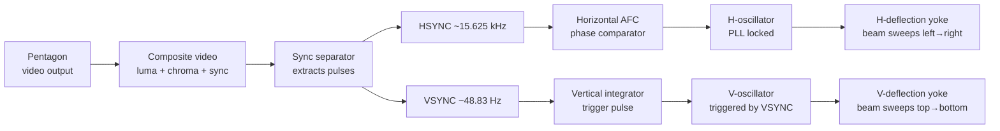
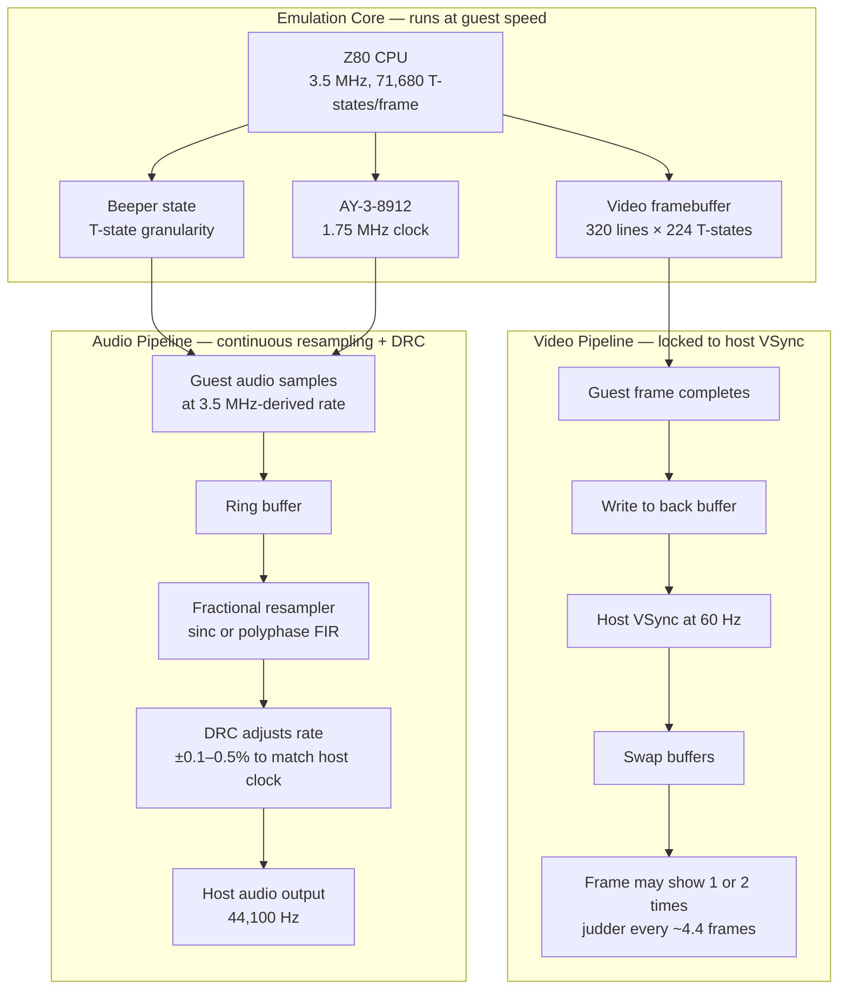

[← Emulation](../README.md) · [Software Emulators](README.md)

# Cycle-Exact Emulation Accuracy

> **Scope**: This article covers what "cycle-exact" means for ZX Spectrum emulation, the specific hardware behaviors that must be reproduced, and the practical impact when they are not. It is written for emulator authors and developers of timing-sensitive software.

---

## Frame Timing Divergence Across Models

The most fundamental timing parameter in any ZX Spectrum emulator is the **video frame**: how many T-states elapse between successive interrupts. Getting this wrong affects everything — interrupt-driven music, raster-synced visual effects, game frame pacing, and tape loading timing.

The ZX Spectrum family does **not** have a single frame timing. Different models produce radically different frame lengths:

| Model | T-states/frame | T-states/line | Lines | Frame duration | Frame rate |
|-------|---------------|---------------|-------|---------------|-----------|
| 48K | 69,888 | 224 | 312 | 19.97 ms | 50.08 Hz |
| 128K / +2 | 70,908 | 228 | 311 | 19.98 ms | 50.01 Hz |
| +2A / +3 | 70,908 | 228 | 311 | 19.98 ms | 50.01 Hz |
| NTSC 48K | 69,816 | 224 | ~311 | 19.95 ms | 50.13 Hz |
| **Pentagon 128K** | **71,680** | **224** | **320** | **20.48 ms** | **48.83 Hz** |
| Scorpion ZS-256 | 69,888 | 224 | 312 | 19.97 ms | 50.08 Hz |

The differences are not minor rounding errors. The **Pentagon** has a frame that is **2.56% longer** than the 48K — 1,792 extra T-states per frame. Over one second that accumulates to roughly 50,000 T-states of drift. Code that hard-codes a 69,888 T-state frame budget will run at the wrong speed on the Pentagon.

### Why the Divergence Exists

All Sinclair/Amstrad models use custom gate arrays (Ferranti ULA or Amstrad gate array) designed to produce exact PAL-standard 50 Hz timing. The Soviet Pentagon uses **off-the-shelf binary counters** (КР1533ИЕ7/КР1533ИЕ10 = 74LS193/74LS161) which naturally divide in powers of 2, producing 320 lines instead of the ULA's carefully designed 312 lines. The result is a ~48.83 Hz frame — close enough for most CRT monitors to sync, but technically non-standard.

The CPU clock is the **same 3.5 MHz** on both 48K and Pentagon (14 MHz crystal ÷ 4). The extra T-states come purely from the longer vertical counter period.

### Impact on Emulation

An emulator must use the **correct frame timing for the selected model**. The consequences of getting it wrong:

- **Music tempo**: Interrupt-driven music players count frames. A 50 Hz player on 48K timing will run ~2.5% too fast if the emulator uses Pentagon timing, or ~2.5% too slow in the reverse case
- **Raster effects**: Multicolor effects that are timed to specific scanlines will shift vertically if the frame length is wrong
- **Tape loading**: Some turbo loaders use frame-synchronized timing loops; wrong frame timing can cause loading failures
- **Game pacing**: Games that use `HALT` to wait for INT will run at the wrong speed if INT comes at the wrong interval

The Unreal Speccy emulator stores this as per-model presets in `unreal.ini`:

```
PRESET.PENTAGON=71680,17989,224,50,32
PRESET.PENTAGON1024=71680,17989,224,50,32
PRESET.SCORPION=69888,14344,224,50,48
PRESET.48K=69888,14335,224,50,48
```

Each preset defines: total T-states, paper offset T-state, T-states per line, nominal frequency, and horizontal timing offset.

## How CRT Displays Handle Non-Standard Frame Rates

The frame timing table above shows the Pentagon running at 48.83 Hz — not the PAL-standard 50 Hz. Yet a real Pentagon connected to a real Soviet CRT television displays a perfectly stable image with no visible artifacts. **How?**

The answer: **CRT televisions do not have a fixed refresh rate.** The electron beam's vertical position is not driven by a crystal-controlled oscillator. It is driven by the incoming video signal's sync pulses. The CRT tracks whatever timing the source provides, within its sync capture range.

An important detail: the Pentagon's **horizontal** sync rate is exactly PAL-standard. Each scanline is 224 T-states × (1/3.5 MHz) = 64 µs, giving 15.625 kHz — identical to any PAL source. Only the **vertical** timing is non-standard: 320 lines instead of 312–313, producing 48.83 Hz instead of ~50 Hz.

### CRT Sync Signal Path



The critical components:

1. **Sync separator** — extracts timing pulses from the composite video signal. Sync information is encoded as negative-going pulses below the blanking level (0–0.3V in PAL). The separator clips at the blanking level and outputs clean HSYNC and VSYNC pulse trains.

2. **Horizontal AFC (Automatic Frequency Control)** — a phase comparator that continuously measures the phase difference between the incoming HSYNC and the horizontal oscillator's output. The error voltage adjusts the oscillator frequency to maintain lock. This is a true phase-locked loop (PLL) and tracks the source precisely.

3. **Vertical oscillator** — in most CRT TVs, this is an **RC relaxation oscillator** whose free-running period is set slightly longer than the expected frame period (~45 Hz free-run for a 50 Hz TV). The VSYNC pulse triggers (resets) the oscillator each frame. If VSYNC arrives slightly late — as with the Pentagon's 48.83 Hz — the oscillator simply has not yet reached the end of its free-running cycle, so it waits. The trigger arrives and starts the next vertical sweep.

### Why 48.83 Hz Works on a CRT

A PAL CRT television's vertical sync capture range is typically **±10% around 50 Hz**, meaning approximately **45–55 Hz**. The Pentagon's 48.83 Hz is only **2.34% below** the nominal 50 Hz — well within the capture range.

```
Standard PAL:    50.00 Hz → 20.000 ms per frame
48K Spectrum:    50.08 Hz → 19.968 ms per frame  (0.16% above standard — imperceptible)
Pentagon:        48.83 Hz → 20.481 ms per frame  (2.34% below standard — CRT handles easily)

Typical CRT vertical sync capture range:
  Free-run frequency: ~42–45 Hz  (oscillator period ~22–24 ms)
  Capture range:       ~45–55 Hz  (comfortably covers all ZX Spectrum models)
```

When the Pentagon's VSYNC arrives 0.481 ms later than a standard 50 Hz signal would, the vertical deflection circuit simply stretches the frame by that amount. The electron beam traces a few extra scanlines in the vertical blanking interval before the next frame begins. This is invisible — the vertical blanking interval is not displayed on screen.

The only visible side effect is a **very slight change in image height**. CRT vertical deflection is current-driven; if the sweep period changes slightly, the image may be ~1–2% taller or shorter. On most TVs this is imperceptible, and the vertical size control can compensate.

### Frame Timing Comparison: CRT vs LCD

```mermaid
graph TB
    subgraph CRT["CRT — analog tracking"]
        C1["Video signal with sync"] --> C2["Sync separator"]
        C2 --> C3["PLL oscillator<br>locks to source"]
        C3 --> C4["Electron beam sweeps<br>at source rate"]
        C4 --> C5["Display rate = source rate<br>48.83 Hz in → 48.83 Hz drawn"]
    end
    subgraph LCD["LCD / OLED — fixed scan"]
        L1["Video signal with sync"] --> L2["Scaler chip + frame buffer"]
        L2 --> L3["Fixed pixel clock<br>60 Hz / 120 Hz / 144 Hz"]
        L3 --> L4["Panel scans at fixed rate<br>regardless of input"]
        L4 --> L5["Display rate ≠ source rate<br>→ frames dropped or duplicated"]
    end
```



| Property | CRT | LCD / OLED |
|----------|-----|------------|
| Scan timing | Driven by input sync signal | Driven by internal pixel clock |
| Refresh rate | Matches source within tolerance | Fixed (60 / 120 / 144 Hz) |
| Non-standard input | Native display, no conversion | Requires frame buffer + rate conversion |
| 48.83 Hz input | Stable image, no artifacts | Frame dropping or duplication |
| Frame tearing | Not applicable (no buffer) | Possible if buffer underruns |
| Judder | None (1:1 frame mapping) | Periodic stutter from uneven cadence |

### What Happens on a Modern LCD

When a 48.83 Hz signal is fed to a 60 Hz LCD display, the display **cannot change its scan rate**. Instead:

1. **Frame buffering**: The display's scaler chip receives frames at 48.83 Hz and writes them into a buffer. The panel reads from this buffer at 60 Hz.

2. **Uneven frame cadence**: Since 60 ÷ 48.83 ≈ 1.229, the display shows most frames for 1 host frame and some for 2 host frames. On average, one frame in every ~4.4 is displayed for an extra host frame, creating visible judder.

```
Pentagon frames (48.83 Hz):  F1       F2       F3       F4       F5       F6       F7       F8
                              |        |        |        |        |        |        |        |
                              +20.5ms  +20.5ms  +20.5ms  +20.5ms  +20.5ms  +20.5ms  +20.5ms  +20.5ms

LCD frames (60 Hz):        |   |   |   |   |   |   |   |   |   |   |   |   |   |   |   |
                            +16.7ms each

Frames displayed:           F1  F1  F2  F2  F3  F3  F4  F4  F5  F5  F6  F6  F7  F7  F8
                                      ↑                      ↑                      ↑
                              some frames shown for 2 LCD periods → visible judder

Over 1 second: 48.83 Pentagon frames → 60 LCD frames
  → ~11.2 frames duplicated → judder every ~4.4 frames
```

3. **With VRR (Variable Refresh Rate)**: G-Sync / FreeSync displays can dynamically adjust their refresh rate to match the source. If the display supports a 48–144 Hz VRR range, it will scan at 48.83 Hz and eliminate judder entirely — effectively behaving like a CRT with a wider range.

### Why the Pentagon's Designers Got Away With It

In the early-1990s post-Soviet context where the Pentagon was designed, **everyone used CRT televisions**. The designers knew that:

- PAL CRT TVs track the source sync frequency within a wide tolerance
- The binary counter modulus naturally producing 320 lines was close enough to work on every TV they tested
- No software relied on sub-frame timing precision beyond the scanline level
- The 2.56% timing difference was completely invisible to users — games and demos ran at imperceptibly different speeds

The Pentagon was a **practical design**, not a precision instrument. Using off-the-shelf КР1533ИЕ7/КР1533ИЕ10 (74LS193/74LS161) counters that happened to wrap at 320 lines saved design complexity and cost, and the result worked perfectly with the available display technology of the era.

## Non-Standard Frame Rates on Modern Host Systems

The Pentagon's ~48.83 Hz frame rate presents a fundamental challenge: modern host systems run at **60 Hz** (or sometimes 50/100/120/144 Hz), and the host audio subsystem runs at a fixed sample rate (typically 44,100 or 48,000 Hz). Neither aligns with the emulated machine's timing.

### The Core Problem

An emulator must simultaneously:
1. Run the emulated CPU at the correct speed (3.5 MHz = 3,500,000 T-states/second)
2. Generate video frames at the correct rate (50.08 Hz for 48K, 48.83 Hz for Pentagon)
3. Generate audio samples at the correct pitch (beeper/AY clocked by the emulated system clock)
4. Deliver both to the host OS at the host's refresh rate and audio sample rate

These four requirements are in conflict when the emulated and host clocks don't divide evenly.

### Strategy 1: Free-Run (No Host VSync)

The simplest approach: run the emulation at the **guest machine's real speed** and ignore the host's vertical sync entirely.

- Emulate exactly 71,680 T-states per frame for the Pentagon (or 69,888 for 48K)
- Present video frames to the host whenever they're ready — they may tear on screen
- Generate audio samples at the exact guest rate and push them into the host audio buffer

**Audio handling**: The guest audio sample rate is derived from the guest clock. For the Pentagon beeper, state transitions happen at the emulated 3.5 MHz rate. The emulator generates samples at whatever rate the guest produces them, then resamples to the host rate (e.g., 44,100 Hz). Since the guest produces samples at a rate that doesn't divide evenly into the host rate, the resampler must handle a non-integer ratio continuously.

**Drawback**: Video tearing on the host display. Works well with VRR (Variable Refresh Rate) displays (G-Sync / FreeSync), which can adapt to any frame rate in their range.

### Strategy 2: Dynamic Rate Control (RetroArch Approach)

RetroArch's Dynamic Rate Control (DRC) is the most sophisticated solution in widespread use. The core idea:

1. **Measure both clocks**: Continuously estimate the true guest frame rate and the true host display refresh rate (not the nominal values — the actual measured intervals)
2. **Adjust audio playback rate**: Slightly speed up or slow down the audio to match the host display. The adjustment is tiny (typically <1%) and imperceptible to the ear, but it eliminates the cumulative drift between audio and video
3. **Single synchronization point**: Both audio and video are locked to the host's VSync. The guest emulation speed is slightly adjusted to match

```
Host display: 60.00 Hz
Pentagon emulation: 48.83 Hz → ~1.227 host frames per Pentagon frame

DRC adjusts audio playback rate by ~0.1–0.5% to eliminate drift
between the accumulated guest frames and the host's real clock
```

This works because the human ear is far more sensitive to **pitch discontinuities** (crackling, popping) than to a <1% pitch shift, and far more sensitive to **audio-video desync** than to a tiny speed change.

### Strategy 3: Resample Audio Per-Frame

For each emulated frame, the sound core generates `N` samples at the guest rate. The host audio buffer needs `M` samples at the host rate. The ratio `M/N` is non-integer and varies per model:

```
48K at 44,100 Hz host:
  69,888 T-states / 3,500,000 = 19.968 ms per frame
  19.968 ms × 44,100 = 880.8 samples per frame
  → Must resample ~881 guest samples to exactly fill the buffer

Pentagon at 44,100 Hz host:
  71,680 T-states / 3,500,000 = 20.481 ms per frame
  20.481 ms × 44,100 = 903.2 samples per frame
  → Must resample ~903 guest samples to exactly fill the buffer
```

The resampling is done with a **polyphase filter** or **linear interpolation** — not sample duplication or dropping, which causes audible artifacts. A high-quality resampler (e.g., sinc interpolation) is needed for beeper audio which contains significant high-frequency content from the square wave edges.

The key technique: **continuous fractional resampling**. Maintain a fractional sample position accumulator that tracks where in the guest sample stream the host is currently reading. Each host sample is interpolated from the two nearest guest samples:

```
guest_pos += host_rate / guest_rate   // fractional increment
output[i] = lerp(guest[floor(guest_pos)], guest[floor(guest_pos)+1], frac(guest_pos))
```

This produces smooth, artifact-free audio regardless of the guest/host rate ratio.

### Strategy 4: Clock-Speed Adjustment (Speed Hacks)

Some emulators simply adjust the emulated CPU clock to produce a frame rate that aligns with the host:

- Pentagon: instead of exactly 3.500000 MHz, run at ~3.500000 × (50.08/48.83) = ~3.589 MHz — making the Pentagon frame rate appear as 50.08 Hz on the host
- Or adjust to produce exactly 60 Hz output

**This is not cycle-exact**. It changes the emulated machine's behavior: music pitch shifts, timing-sensitive code breaks differently than on real hardware. Acceptable for casual gaming, unacceptable for demoscene productions or software development.

### What Real Emulators Do

| Emulator | Video sync | Audio sync | Model support | Accuracy notes |
|----------|-----------|-----------|---------------|----------------|
| **Fuse** | Free-run or VSync with frame skip | Continuous resampling | 48K, 128K, +2A/+3, Pentagon, Scorpion, Timex | Reference open-source emulator, early/late timing toggle, contention model per-model |
| **ZEsarUX** | Free-run or adaptive | Per-frame resampling with buffering | 48K–+3, Pentagon, Scorpion, Next, many clones | Most configurable emulator, reverse debugging, per-model contention tables, Next support |
| **SpecEmu** | Free-run (Windows) | DirectSound resampling | 48K, 128K, +2A/+3, Pentagon, +3 floppy | Extremely high accuracy: cycle-accurate display, early/late timings, `intdiff` offset for fine-tuning INT period, MEMPTR emulation |
| **Spectaculator** | VSync (Windows, commercial) | DirectSound with resampling | 48K–+3, Pentagon, Timex | Commercial, early/late timing toggle, cycle-accurate contention, AY envelope fixes, RZX recording |
| **Unreal Speccy** | Free-run | DirectSound with per-model presets | 48K–+3, Pentagon, Scorpion, Profi, ATM, Kay, PentEvo | `unreal.ini` preset system defines exact frame timing per model, dominant in Russian scene |
| **Unreal Speccy Portable (USP)** | Free-run | SDL audio resampling | Same as Unreal Speccy + mobile optimizations | Portable fork: Android/iOS/maemo, same timing engine as desktop Unreal Speccy |
| **ZXMAK2** | Free-run | WaveOut with resampling | 48K–+3, Pentagon, Scorpion, ATM 4.50/7.10, PentEvo, Profi, Sprinter, Quorum, Leningrad, Byte, LEC | .NET-based, 16+ clone models with separate timing/contention profiles, plugin architecture |
| **RetroArch cores** (Fuse/ZEsarUX) | VSync + Dynamic Rate Control | DRC adjusts audio rate | Inherits from core | DRC eliminates audio-video drift; uses Fuse or ZEsarUX core timing |
| **CSpect** | Free-run, optimized for Next | Resampling | Next only | Development-focused, configurable Next timing, HDMI output simulation |
| **EightyOne** | Free-run | Simple resampling | 48K, 128K, ACE, ZX81, Timex | Multi-machine (ZX80/ZX81/Spectrum), lower accuracy focus, good for ZX81 development |

### The Hard Case: AY-3-8912 Audio

The AY sound chip adds another layer. It runs from the same clock as the CPU (or a divided version). On the 128K, the AY is clocked at ~1.773 MHz (half the 3.5469 MHz CPU clock). On the Pentagon, it's clocked at ~1.75 MHz (half of 3.5 MHz). The tone frequencies are:

```
AY tone frequency = AY_clock / (16 × period_register)
```

A 440 Hz note on the 128K:
```
AY period register (R0/R1 for Channel A) = AY_clock / (16 × target_freq) = 1,773,450 / (16 × 440) = 252
→ R0 (fine) = 252, R1 (coarse) = 0
```

The same register value (252) on the Pentagon:
```
frequency = AY_clock / (16 × period_register) = 1,750,000 / (16 × 252) = 434.5 Hz  (5.5 Hz flat!)
```

This ~1.3% pitch difference between 128K and Pentagon AY output is **real** — it exists on actual hardware. A cycle-exact emulator must reproduce it, not "correct" it to match a reference pitch.

## Conclusion: The Worst Case — Pentagon on 60 Hz Fixed-Rate Display

A concrete scenario that exercises every problem described in this article: **emulating a Pentagon 128K (48.83 Hz, 71,680 T-states/frame) on a host with a 60 Hz fixed-refresh LCD, no VRR, with pitch-perfect beeper and AY-3-8912 audio.**

This is the worst case because every clock is in conflict:

```
Guest:   3.5 MHz CPU, 1.75 MHz AY, 48.83 Hz video (71,680 T-states/frame)
Host:    60.00 Hz display, 44,100 Hz audio

60.00 / 48.83 = 1.229  → video frames don't align
44,100 × (20.481 / 16.667) = 54,073  → guest produces ~54K samples per host-frame-second
                                 but host expects exactly 44,100 per second
```

No single technique solves both video and audio. The solution is a **layered pipeline** that handles each concern independently:

### The Complete Pipeline



### Video: Tear-Free but With Judder

**Lock to host VSync.** Every 16.667 ms the host swaps buffers. The guest produces a new frame every 20.481 ms. The ratio 60 ÷ 48.83 ≈ 1.229 means the guest cannot fill every host frame:

```
Time →     0    16.7   33.3   50.0   66.7   83.3  100.0  116.7  133.3  150.0

Host VSync: ↓      ↓      ↓      ↓      ↓      ↓      ↓      ↓      ↓      ↓
Guest frame: ├────────── F1 ──────────┤├────────── F2 ──────────┤├──────────

Displayed:   F0     F1     F1     F1     F2     F2     F2     F3     F3     F3
                              ↑                     ↑                     ↑
                        F1 held 2 extra VSyncs   F2 held 2 extra     pattern repeats
```

**Cadence**: the guest frame changes every ~20.5 ms, and the host displays it every ~16.7 ms. Over 1 second, the guest produces 48.83 frames and the host displays 60 VSync intervals. The result: 48.83 unique frames shown across 60 display opportunities — most guest frames are displayed for 1 VSync period, but approximately every 4.4th frame persists for an extra VSync, creating a subtle stutter.

**Is this acceptable?** In the 1990s–2000s, emulator authors accepted judder as unavoidable — host CPUs barely had enough power for the emulation itself. Today, a mid-range CPU is **10,000–100,000×** faster than a 3.5 MHz Z80. That spare compute budget can be spent on video processing to eliminate or mask judder on fixed-refresh displays.

### Advanced Judder Mitigation Techniques

The following techniques are ordered from cheapest to most expensive. All preserve cycle-exact guest timing — they operate on the **output** of the emulation core, not on the guest clock.

#### Technique 1: Temporal Frame Blending

**Cost**: Near-zero — ~0.5 MB/s memory bandwidth on a 320×240 framebuffer.

**Method**: Instead of displaying a single guest frame at each host VSync, blend the current and previous guest frames with weights determined by the temporal position between them:

```
Guest frame N completes at T = 20.481 ms
Guest frame N+1 completes at T = 40.962 ms
Host VSync at T = 33.333 ms

Temporal position: α = (33.333 - 20.481) / (40.962 - 20.481) = 0.627

output_pixel = (1 - α) × frame_N[x,y] + α × frame_N+1[x,y]
```

This produces a smooth crossfade between guest frames. Motion blur is introduced proportional to object speed — which is actually **more authentic** than showing a single frozen frame, because real CRT phosphors decay gradually and the human eye performs temporal integration.

**Computation**: 320 × 240 pixels × 3 channels × 2 reads + 1 write = ~460K operations per host frame. At 60 Hz: ~28M operations/second. A single CPU core can do this in ~0.03 ms. GPU shader: essentially free.

**Best for**: Scrolling games, loading screens, any content with constant motion. Masks judder very effectively.

#### Technique 2: CRT Phosphor Persistence Simulation

**Cost**: Low — requires a persistent framebuffer that accumulates decayed previous frames.

**Method**: Simulate the phosphor decay of a real CRT. Each pixel's brightness decays exponentially between frames, and the new frame is composited on top:

```
pixel[x,y] = guest_frame[x,y] + (1 - decay_rate) × prev_pixel[x,y]

Where decay_rate depends on:
  - Time since last write to this pixel position
  - Simulated phosphor type (P22 has ~1–5 ms persistence)
  - The guest's actual frame timing (20.481 ms for Pentagon)
```

This naturally smooths judder because pixels that haven't changed between guest frames appear to persist and decay gradually, just like on a real CRT. RetroArch's CRT shaders (crt-royale, koko-aio) implement variants of this.

**Computation**: 320 × 240 × 3 × (1 multiply + 1 add) per host frame = ~230K FLOPs. Trivial on any GPU. On CPU: ~0.015 ms per frame.

**Best for**: All content — this is the most authentically accurate approach because it reproduces the actual visual behavior of the display the software was designed for.

#### Technique 3: Sub-Frame Beam Position Rendering

**Cost**: Moderate — requires rendering the framebuffer progressively rather than all-at-once.

**Method**: At each host VSync, calculate the exact beam position within the current guest frame based on the T-state counter, and render the framebuffer up to that position:

```
Guest frame: 320 lines × 224 T-states = 71,680 T-states total
Beam speed:  224 T-states per line, one line at a time

At host VSync T = 33.333 ms:
  Guest T-states elapsed = 33.333 ms × 3,500,000 = 116,665 T-states
  T-states into current frame = 116,665 mod 71,680 = 44,985
  Beam line = 44,985 / 224 = 200 (line 200 of 320)
  Beam T-state in line = 44,985 mod 224 = 185

Render framebuffer: lines 0–199 complete, line 200 partial (185/224)
Lines 201–319: show previous frame's decayed phosphor content
```

This reproduces exactly what a CRT would show at that instant — the beam has drawn 200 complete lines and is partway through line 201. The rest of the screen shows the previous frame's content, still decaying.

**Computation**: Requires per-scanline rendering rather than full-frame blit. The emulator already knows the pixel state at every T-state (it's generating them in order), so this is a matter of storing a scanline-indexed framebuffer and compositing at VSync time. Cost: ~320 line lookups × 256 pixels × blend = ~80K operations. Negligible.

**Best for**: Demoscene productions with multicolor effects — raster bars, chunky scrolling, BIFROST* animations. These effects were designed around CRT beam racing and look wrong without it.

**Why this matters**: On a real CRT, the electron beam draws the screen progressively. Multicolor effects that change attributes mid-frame rely on this — the top and bottom of the screen show different data at different moments. Showing a single frozen frame at each VSync discards this temporal information.

#### Technique 4: Motion-Compensated Frame Interpolation

**Cost**: Moderate to high — requires per-pixel motion estimation between consecutive guest frames.

**Method**: Detect moving regions between two guest frames, compute motion vectors, and generate a synthetic intermediate frame that shows objects at their correct spatial position for the host's exact display time:

```
Frame N:   sprite at position (100, 50)
Frame N+1: sprite at position (108, 50)  (moved 8 pixels right)

At host VSync, temporal position α = 0.627 between frames:
Interpolated: sprite at position (100 + 0.627 × 8, 50) = (105, 50)
```

This is the same technique used in modern TV "soap opera effect" and DLSS Frame Generation. For ZX Spectrum's 256×192 resolution, the motion search space is tiny.

**Computation**: For 256×192 pixels with 4×4 blocks and ±16 pixel search range:
- Block matching: (256/4) × (192/4) = 3,072 blocks × 32×32 comparisons = ~3.1M operations
- Vector field smoothing: ~100K operations
- Interpolation render: ~200K operations
- **Total**: ~3.4M operations per interpolated frame at 60 Hz = ~204M ops/sec
- Modern CPU single core: ~10 GHz effective → ~2% of one core
- GPU compute shader: negligible

**Best for**: Fast arcade action (Manic Miner, Jet Set Willy, Chase HQ). Objects move predictably between frames.

**Caveats**: Can produce artifacts for sudden scene changes, flashing effects (common in ZX Spectrum games — attributes used as "flash"), and multicolor raster effects that change mid-frame. Should be combined with a scene-change detector that falls back to simple blending.

#### Technique 5: Neural Frame Interpolation

**Cost**: High — requires GPU inference. Feasible on any modern GPU (integrated or discrete).

**Method**: Use a small convolutional neural network trained on retro game content to generate intermediate frames. Similar to DLSS Frame Generation or AMD FSR 3, but targeting 256×192 input.

```
Input:  Frame N (256×192×3) + Frame N+1 (256×192×3) = ~295K pixels
Network: 4–8 convolution layers, ~50K parameters
Output: Interpolated frame at temporal position α

Inference time on integrated GPU (Intel UHD 770): ~0.1–0.3 ms
Inference time on discrete GPU (RTX 3060): ~0.02–0.05 ms
```

The network is tiny by modern standards — ZX Spectrum frames are 256×192, so even a basic U-Net or RAFT-style architecture processes them in microseconds on a GPU.

**Best for**: Future emulator frontends. Currently no ZX Spectrum emulator implements this, but the technique is proven in the video processing domain (RIFE, FILM, Frame interpolation transformers) and could be adapted.

**Why it's overkill for ZX Spectrum**: The Spectrum's limited color palette (8 colors, 2 brightness levels) and attribute-clash artifacts mean that motion estimation is trivial — simple block matching (Technique 4) achieves nearly the same visual result at 1/100th the cost.

### Technique Comparison

| Technique | Compute cost | Latency added | Visual quality | Authenticity | Implementation complexity |
|-----------|-------------|---------------|----------------|-------------|------------------------|
| No mitigation (status quo) | Zero | None | Judder every ~4.4 frames | Low (LCD behavior) | Trivial |
| Temporal blending | ~0.03 ms/frame | 0 | Good — motion blur masks judder | Medium — mimics CRT phosphor decay | Simple (20 lines of code) |
| CRT phosphor simulation | ~0.015 ms/frame | 0 | Very good — most authentic | High — reproduces real CRT behavior | Moderate (needs persistent buffer) |
| Sub-frame beam rendering | ~0.05 ms/frame | 0 | Excellent for multicolor | Very high — beam-accurate | Moderate (scanline-indexed buffer) |
| Motion-compensated interpolation | ~0.5 ms/frame | 1 guest frame | Very good — smooth motion | Low — synthetic intermediate frames | Complex (motion estimation pipeline) |
| Neural frame interpolation | ~0.3 ms/frame (GPU) | 1 guest frame | Excellent — near-perfect | Low — AI-generated content | Very complex (training + inference) |

### Recommended Approach for Emulator Authors

**Tier 1 — Minimal (any hardware)**: Temporal blending. Ten lines of shader code, eliminates the perception of judder for most content. Zero latency cost. Every emulator should implement this as a baseline.

**Tier 2 — Authentic (any GPU)**: CRT phosphor simulation + temporal blending. This reproduces what the software was actually designed to look like on a CRT. Already available in RetroArch's shader library (crt-royale-kurozumi, koko-aio). Copy the approach, don't reinvent it.

**Tier 3 — Maximum accuracy (for demoscene)**: Add sub-frame beam position rendering. This is the gold standard for multicolor content — it shows exactly what the CRT would show at each host VSync instant. The emulator already has per-T-state pixel state; it just needs to output it at sub-frame granularity.

**Tier 4 — Overkill (future work)**: Motion-compensated or neural interpolation. Mathematically interesting but solving a problem that techniques 1–3 have already adequately addressed for ZX Spectrum's low resolution and limited color depth. The 0.1 ms GPU time would be better spent on better CRT phosphor modeling.

### Audio: Pitch-Perfect on Both Beeper and AY

Audio does not depend on the video frame rate at all. The pipeline:

**Step 1 — Generate at the guest clock rate.** The Z80 runs at exactly 3.5 MHz. The beeper state (BORDER port `#FE` bit 4) toggles at T-state granularity. The AY chip (`#FFFD`/`#BFFD`) is clocked at 1.75 MHz. Both produce audio events at rates derived from the 3.5 MHz clock, independent of the video frame boundary.

**Step 2 — Accumulate into a ring buffer.** Each audio event (beeper edge, AY output change) is recorded at the T-state counter value at which it occurred. The ring buffer stores these as a continuous stream of audio samples at the guest-native rate.

**Step 3 — Resample continuously to host rate.** The host audio callback asks for `N` samples at 44,100 Hz. The resampler reads from the ring buffer using a fractional position accumulator:

```
// Per host audio callback:
guest_samples_per_host_sample = guest_audio_rate / 44100.0

for (int i = 0; i < N; i++) {
    guest_pos += guest_samples_per_host_sample;
    output[i] = sinc_interpolate(ring_buffer, guest_pos);
}
```

The `guest_audio_rate` is not a fixed constant — it is **continuously adjusted** by the DRC loop:

**Step 4 — Dynamic Rate Control.** The DRC measures how far the ring buffer's read position has drifted relative to the host's real-time clock. If the guest is running slightly faster than real-time, the buffer fills up → DRC slightly increases the resampling ratio (guest audio plays ~0.2% faster, emptying the buffer). If the guest is slow, the buffer empties → DRC slightly decreases the ratio. The adjustment stays within ±0.5% — below the threshold of pitch perception.

```
Ideal guest audio rate:  3,500,000 / 71,680 × 903.2 ≈ 44,127 Hz equivalent
Actual host rate:         44,100 Hz
DRC correction:           +0.06% — completely inaudible

AY-3-8912 pitch accuracy: 1,750,000 Hz clock preserved exactly
  → A note (R0=252, R1=0): 434.5 Hz on Pentagon hardware
  → Emulator output: 434.5 Hz (±DRC correction of <0.1 Hz)
```

### Summary: What You Get and What You Don't

| Property | Result | Notes |
|----------|--------|-------|
| **Beeper pitch** | Exact | 3.5 MHz-derived, DRC adjustment <0.5% |
| **AY-3-8912 pitch** | Exact | 1.75 MHz clock preserved, Pentagon's 434.5 Hz A note reproduced |
| **Music tempo** | Exact | Interrupt-driven music runs at 48.83 Hz as on real hardware |
| **Video tearing** | None | Locked to host VSync |
| **Video judder** | Maskable with temporal blending / CRT phosphor sim | Eliminated with VRR; masked on fixed-refresh with Tier 1–3 techniques |
| **Audio-video sync drift** | None | DRC continuously corrects |
| **CPU timing accuracy** | Cycle-exact | 3.5 MHz, 71,680 T-states/frame, contention-free (Pentagon) |
| **Raster effects** | Correct timing, slight judder | INT fires at correct T-state; display cadence may stutter |

### The Three Rules for Emulator Authors

1. **Never adjust the guest clock.** The CPU runs at 3.5 MHz. The frame is 71,680 T-states. The AY is clocked at 1.75 MHz. These are non-negotiable. Speed hacks that alter these values produce the wrong pitch, the wrong tempo, and the wrong behavior for timing-sensitive code.

2. **Decouple video from audio.** Video syncs to the host's VSync. Audio syncs to the guest's T-state clock via continuous resampling. These are two independent pipelines that share only the emulation core's T-state counter. The DRC loop is the bridge — it uses the measured host clock to keep the audio pipeline from drifting relative to the video pipeline.

3. **Accept imperfect video before imperfect audio.** A torn or stuttering frame is a momentary visual artifact. A pitch error or desync is immediately and continuously noticeable. Every successful emulator that handles non-standard frame rates (Fuse, ZEsarUX, RetroArch) follows this priority: audio correctness first, video smoothness second.

---

## References

### Frame Timing

- **Chris Smith, "The ZX Spectrum ULA: How to design a microcomputer"** (ZX Design and Media, 2010) — Hardware-level explanation of ULA frame timing, contention, and how the Ferranti ULA produces exactly 312 lines × 224 T-states
- **Sinclair Wiki, "Contended Memory"** ([sinclair.wiki.zxnet.co.uk](https://sinclair.wiki.zxnet.co.uk/wiki/Contended_memory)) — Per-model contention tables and T-state timing references
- **World of Spectrum, "48K Technical Reference"** ([worldofspectrum.org](https://worldofspectrum.org/faq/reference/48kreference.htm)) — Official frame timing: 69,888 T-states, 312 lines, 50.08 Hz
- **World of Spectrum, "128K Technical Reference"** ([worldofspectrum.org](https://worldofspectrum.org/faq/reference/128kreference.htm)) — 128K/+2 frame timing: 70,908 T-states, 311 lines, 228 T-states/line
- **Spectrumpedia (Alessandro Grussu, UniversItalia 2012)** ([PDF Vol.1](https://www.alessandrogrussu.it/zx/Spectrumpedia(English)-Volume1.pdf), [Vol.2 on Scribd](https://www.scribd.com/document/851337082/Spectrumpedia-English-Volume2)) — Comprehensive historical and technical coverage of all ZX Spectrum models and clones
- **Pentagon documentation** ([pentagon.txt](https://zxspectrum.hal.varese.it/static/documenti/pentagon.txt)) — Original Pentagon specification: 320 lines × 224 T-states = 71,680 T-states per frame
- **antirez/ZOT** ([github.com/antirez/ZOT](https://github.com/antirez/ZOT)) — Well-documented ZX Spectrum 48K emulator with annotated frame timing: 312 × 224 = 69,888 T-states at 50.08 Hz

### CRT Display and Sync

- **Retroleum, "PAL TV timing and voltages"** ([PDF](https://georgiana.com.cy/wp-content/uploads/product_addons_uploads/c9f0f895fb98ab9159f51fd0297e236d/PAL-TV-timing-and-voltages-Retroleum-merged.pdf)) — PAL signal specification with sync pulse timing, derived from Chris Smith's ULA book and Superfo clone schematics
- **Wikipedia, "PAL"** ([en.wikipedia.org](https://en.wikipedia.org/wiki/PAL)) — PAL standard: 625 lines, 25 frames/s, 15.625 kHz line rate, 64 µs line period
- **Keith Jack, "Video Demystified"** (Newnes, 5th ed.) — Definitive reference on analog video sync separation, horizontal AFC, and vertical oscillator circuits

### Audio Sync and Resampling

- **Libretro, "Dynamic Rate Control for Emulators"** ([docs.libretro.com](https://docs.libretro.com/development/cores/dynamic-rate-control/)) — Official RetroArch DRC documentation: synchronizing audio and video when guest/host clocks differ
- **Libretro, "Dynamic Rate Control" (PDF)** ([docs.libretro.com](https://docs.libretro.com/guides/ratecontrol.pdf)) — Formal paper describing the DRC algorithm with mathematical derivation
- **Julius O. Smith III, "Digital Audio Resampling"** ([ccrma.stanford.edu](https://ccrma.stanford.edu/~jos/resample/resample.pdf)) — Stanford reference on polyphase FIR resampling and fractional sample rate conversion
- **Jatin Chowdhury, "Faster Non-Integer Sample Rate Conversion"** ([medium.com](https://jatinchowdhury18.medium.com/faster-non-integer-sample-rate-conversion-8034c87d7fa4)) — Practical guide to real-time fractional resampling with implementation details

### AY-3-8912 Sound Chip

- **General Instrument, "AY-3-8910/8912 Programmable Sound Generator Data Manual"** ([Archive.org PDF](https://archive.org/download/AY-3-8910-8912_Feb-1979/AY-3-8910-8912-Feb-1979.pdf)) — Official datasheet with tone period formula: `TP = f_clock / (16 × period_register)`
- **World of Spectrum, "128K Sound Chip Reference"** ([worldofspectrum.org](https://worldofspectrum.org/faq/reference/128kreference.htm)) — 128K AY clocked at 1.773450 MHz (half of 3.5469 MHz CPU clock)

### Emulator Source Code

- **Fuse — Free Unix Spectrum Emulator** ([sourceforge.net](https://sourceforge.net/p/fuse-emulator/)) — Reference open-source emulator, per-model contention tables and early/late timing
- **ZEsarUX** ([github.com/chernandezba/zesarux](https://github.com/chernandezba/zesarux)) — Most configurable emulator, per-model timing configuration, ZX Spectrum Next support
- **Unreal Speccy** — Dominant Russian-scene emulator; frame timing presets in `unreal.ini` define T-states, paper offset, and line timing per model
- **ZXMAK2** ([github.com/zxmak/zxmak2](https://github.com/zxmak/zxmak2)) — .NET-based emulator with 16+ clone models, each with separate timing/contention profiles

### Cross-References

- [clone_timing.md](../../02_hardware/clones/clone_timing.md) — Clone video timing: Pentagon, Scorpion, Kay, ATM Turbo, detection techniques, memory expansion
- [ula_timing.md](../../02_hardware/original/ula_timing.md) — ULA frame timing per model, memory contention, multicolor effects, early/late timing
- [z80_timing.md](../../01_cpu/z80_timing.md) — Z80-intrinsic timing: T-states, M-cycles, bus timing, per-instruction costs
- [z80_interrupts.md](../../01_cpu/z80_interrupts.md) — Interrupt timing: IM0/IM1/IM2, INT pulse duration, per-model differences
