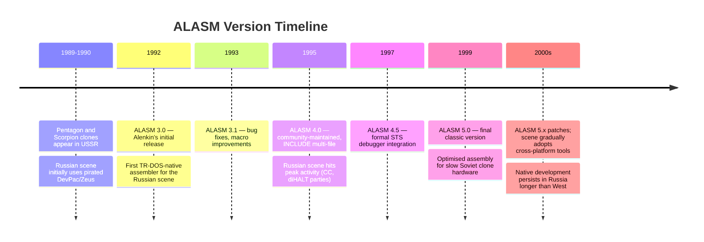
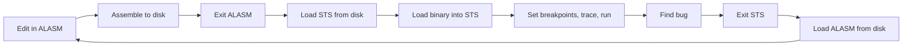

[← Home](../README.md) · [Toolchain](README.md)

# ALASM + STS — The Dominant Native Assembler of the Soviet and Post-Soviet Spectrum Scene

**ALASM** (АЛАСМ, sometimes "A.L.A.S.M." — *ALenkin Assembler*, named for its origin author) is the most widely used native Z80 assembler in the Soviet and post-Soviet ZX Spectrum clone ecosystem. Developed across the 1990s in versions 3.0 through 5.x by several Russian authors, ALASM was the standard tool at every major Russian demoscene party — **CC** (Championship of Russia), **diHALT**, **CAFe**, **FUNtop** — and at the game studios producing software for the TR-DOS disk ecosystem centered on the [Pentagon](../02_hardware/clones/pentagon.md) and Scorpion clones.

ALASM's reign was roughly **1992–2005** — from the consolidation of the Russian clone scene through the final years of native Spectrum development in the former Soviet Union. In the West, the equivalent period (1983–1990) was dominated by [Zeus](zeus_assembler.md) and [DevPac](devpac_gens_mons.md); in Russia, ALASM (and to a lesser extent [XAS](xas_assembler.md)) filled the same role. ALASM was designed from the start for TR-DOS disk storage, fast assembly on slow clone hardware, and tight integration with the **STS** (*S*tep *T*race *S*ystem) debugger — a pairing as natural to Russian developers as GENS+MONS was to UK studios.

This article is the **deep-dive reference** for ALASM as a tool: its history, design choices, source language, the STS debugger integration, the ALASM+STS workflow, and ALASM's place in the Russian Spectrum scene. For the broader native-toolchain survey, see [native_toolchain.md](native_toolchain.md). For ALASM's Russian-scene alternative, see [xas_assembler.md](xas_assembler.md).

---

## History

### The Post-Soviet Spectrum Scene (1989–1992)

The Russian Spectrum clone scene emerged in 1989–1990 with the first Pentagon and Scorpion clones, built from Soviet-manufactured TTL logic and Z80-compatible CPUs (КР1858ВМ1). For the first two years, Russian developers used whatever Western tools they could obtain — typically pirated copies of DevPac or older Zeus — running on the clone hardware. These tools were ill-suited to the Russian workflow: they were tape-oriented, English-language, and unaware of TR-DOS disk or the clone-specific I/O ports.

By 1992, the Russian scene was large enough to support native tools. Several Russian programmers began writing assemblers specifically for the TR-DOS / Pentagon ecosystem, optimizing for:

- **TR-DOS disk I/O** for source and binary (not tape)
- **Cyrillic comment support** (Russian-language comments in source files)
- **Pentagon / Scorpion hardware awareness** (memory banks, I/O ports, video timing)
- **Fast assembly** on clone hardware (which was often slower than original Sinclair hardware due to slower Soviet DRAM)

ALASM emerged as the most successful of these efforts, along with XAS as its primary competitor.

### ALASM Versions and Authors

ALASM was developed across multiple versions by different Russian authors. The version history is less cleanly attributed than Zeus's (where Simon Brattel is the single through-line); ALASM was a community project with several lead developers.

| Version | Year | Author(s) | Highlights |
|---|---|---|---|
| **ALASM 3.0** | 1992 | Alenkin (origin author) | Initial release; TR-DOS native, fast two-pass assembly, basic monitor |
| **ALASM 3.1** | 1993 | Alenkin + contributors | Bug fixes, expanded macro support |
| **ALASM 4.0** | 1995 | Community (post-Alenkin) | Improved editor, multi-file projects via `INCLUDE` |
| **ALASM 4.5** | 1997 | Community | STS debugger integration formalized |
| **ALASM 5.0** | 1999 | Community | Final classic version; expanded macro language, optimized assembly |
| **ALASM 5.x** | 2000s | Various maintainers | Minor patches; scene adoption declining as cross-platform tools spread |

The "Alenkin" attribution is the origin of the name (ALenkin ASseMbler); later versions were community-maintained, and the original author's involvement ended around version 4. By version 5, ALASM was a collective product of the Russian Spectrum scene.



---

## Design Philosophy — TR-DOS Native, Fast, Cyrillic

ALASM's design choices were shaped by the Russian scene's specific constraints:

### TR-DOS Native From Day One

Western assemblers (Zeus, DevPac) were designed for tape first and disk second. ALASM was designed for **TR-DOS disk from the start**. Source files, binary output, and included files all lived on TR-DOS disks; there was never a tape-based ALASM workflow. This was possible because the Russian clone scene was post-tape from the beginning — Pentagon and Scorpion clones shipped with Beta 128 FDC controllers and TR-DOS ROM as standard equipment.

The practical consequence: ALASM's edit-assemble-test cycle was seconds-long from the start. No tape-load delay. Source files of 16–32 KB loaded from TR-DOS disk in 1–2 seconds. The assembled binary was written back to disk in another second. The full edit-assemble-test cycle was 5–10 seconds — competitive with Zeus's integrated cycle on Western hardware.

### Fast Assembly on Slow Hardware

Soviet clone hardware was often slower than original Sinclair hardware, due to slower Soviet DRAM and the simpler memory controller logic of clones like the Pentagon (which lacked the Sinclair ULA's contended-memory timing — see [contention_timing.md](../05_development/05_display_and_timing/contention_timing.md)). ALASM was specifically **optimized for fast assembly on this hardware**:

- Tight Z80 code in the assembler's inner loop
- Minimised disk I/O during assembly (single-pass where possible)
- Aggressive symbol-table management for fast label resolution

ALASM could assemble a 32 KB source in seconds where older tools took minutes. This mattered for Russian demoscene developers iterating on 32 KB intros with tight deadlines before a party.

### Cyrillic Comment Support

Russian developers routinely wrote comments in Cyrillic, using the Russian-language character ROM variants common on clone hardware. ALASM accepted Cyrillic text in comments without complaint; Western tools (Zeus, DevPac) often scrambled Cyrillic bytes or rejected them.

This sounds minor but was significant. Russian-language comments in source files were essential for collaborative work in Russian studios and demo crews. A tool that couldn't handle Cyrillic was unusable in the Russian scene.

---

## ALASM Source Language

ALASM's source language is standard Z80 assembly with Russian-scene conventions. The syntax is largely compatible with DevPac and Zeus, with minor cosmetic differences.

### Basic Syntax

```z80
; Odnochastotnyy vyvod simvola na ekran
; (Single-frequency character output to screen)
        ORG  #8000
PRINT_CHAR:
        LD   A, (HL)
        RST  #10
        INC  HL
        DEC  B
        JR   NZ, PRINT_CHAR
        RET
```

ALASM accepts both `;` (Western convention) for line comments. Block comments are supported in later versions.

### Labels

ALASM labels are alphanumeric identifiers, typically followed by `:` at the start of a line:

```z80
loop:
        HALT
        JR   loop

        ; Local labels (ALASM 4+) use a leading dot
.sub_loop
        DJNZ .sub_loop
```

Local labels (prefixed with `.`) are scoped to the most recent global label — useful for avoiding label pollution in large sources. This feature was uncommon in Western assemblers of the era.

### Numeric Notation

ALASM accepts decimal by default; hex with `#` prefix or `h` suffix or `$` prefix; binary with `%` prefix or `b` suffix:

```z80
        LD   A, 255           ; decimal
        LD   A, #FF           ; hex (Western convention)
        LD   A, $FF           ; hex (sjasmplus convention)
        LD   A, 0FFh          ; hex (CP/M convention)
        LD   A, %11111111     ; binary
```

ALASM's flexibility on hex notation reflects its need to import source from multiple traditions — DevPac sources use `#`, sjasmplus sources use `$`, old Zeus sources use `h`. ALASM accepts all of them.

### Directives

The key ALASM directives:

| Directive | Function |
|---|---|
| `ORG nn` | Set the assembly origin |
| `EQU` | Assign a constant value to a label |
| `DB` / `DEFB` / `BYTE` | Define byte(s) of data |
| `DW` / `DEFW` / `WORD` | Define word(s) of data (2-byte, little-endian) |
| `DM` / `DEFM` / `TEXT` | Define message (text string) |
| `DS` / `DEFS` / `BLOCK` | Define storage (reserve n bytes) |
| `INCLUDE "file"` | Include another source file |
| `INCBIN "file"` | Include a raw binary file |
| `IF expr` ... `ELSE` ... `ENDIF` | Conditional assembly |
| `MACRO name params` ... `ENDM` | Macro definition |
| `PHASE nn` / `DEPHASE` | Assemble as if at a different address |
| `ENT` | Entry point (where execution starts) |
| `OUTPUT "file"` | Set the output file |
| `MODULE name` | Begin a named module (ALASM 4+) |
| `ENDMOD` | End module |

The `MODULE` / `ENDMOD` directives (ALASM 4+) provided basic namespace support — labels within a module were prefixed with the module name, preventing collisions between separately-developed library modules. This was an advanced feature for the era.

### Macros

ALASM's macro system is one of its strongest features. Macros can take parameters, declare local labels, and be nested:

```z80
        MACRO FILL_MEM addr, value, count
        LD   HL, addr
        LD   (HL), value
        LD   DE, addr + 1
        LD   BC, count - 1
        LDIR
        ENDM

        ; Usage:
        FILL_MEM #4000, 0, 6144         ; clear pixel RAM
        FILL_MEM #5800, %00000111, 768  ; clear attr RAM to white-on-black
```

ALASM 5 added more elaborate macro features, including:
- **Local labels inside macros** (prefixed `@@`) — each macro expansion gets fresh label instances
- **Repeat blocks** (`REPT n` ... `ENDR`) for unrolling loops at assembly time
- **String manipulation** in macros — useful for generating lookup tables

The macro system was less elaborate than XAS's, but adequate for most demoscene and game-development needs. Where XAS specialized in code-generation macros, ALASM prioritized reliable everyday macros.

### Multi-File Projects

ALASM 4+ supported `INCLUDE` directives for splitting large projects across multiple TR-DOS files. A typical large project structure:

```
MAIN.A    - main game loop and entry point
ENGINE.A  - sprite engine, screen management
AUDIO.A   - AY-3-8910 music player, sound effects
LEVELS.A  - level data and parsers
GFX.A     - graphic assets (sprites, fonts, screens)
```

The `MAIN.A` file would `INCLUDE` the others:

```z80
; MAIN.A
        ORG  #8000
        INCLUDE "ENGINE.A"
        INCLUDE "AUDIO.A"
        INCLUDE "LEVELS.A"
        INCBIN  "GFX.DAT"        ; pre-assembled graphic data

Main_Entry:
        CALL Engine_Init
        CALL Audio_Init
        ; ... main game loop ...
```

This allowed large demoscene productions (64 KB+ intros, 128K demos with multiple parts) to be developed modularly — essential for collaborative work in demo crews. The Western Zeus and DevPac tools had more limited multi-file support; ALASM's was purpose-built for the large TR-DOS-stored projects common in the Russian scene.

---

## STS — Step Trace System Debugger

**STS** (*S*tep *T*race *S*ystem) is ALASM's companion debugger. Like DevPac's MONS, STS is a separate program loaded when the developer needs to debug assembled code. STS provides breakpoints, single-step execution, register inspection, memory display, and disassembly.

### STS Hardware-Assisted Debugging

STS's distinctive feature — and the reason for its "Step Trace System" name — was its use of **hardware-assisted single-step** on compatible clone hardware. Standard Z80 single-step uses the `RST #38` replacement technique (same as DevPac's MONS and Zeus's monitor), but this only works for breakpoints — it cannot trace every instruction without massive overhead.

STS, on Pentagon and Scorpion hardware with the appropriate debug hardware (a small add-on board or specific clone revisions), could trace every executed instruction by hooking the Z80's `M1` signal. This gave STS capabilities beyond what Western monitors offered:

- **Full execution trace** — log every instruction executed, with register state at each step
- **Reverse debugging** — step backward through execution to find where a bug was introduced
- **Conditional tracing** — trace only when a specific register has a specific value

These capabilities anticipated features that would become common in modern emulators (ZEsarUX's reverse debugging) by a decade or more. They were unique to STS in the 1990s.

### STS Commands

STS presents a single-key command prompt similar to MONS:

| Key | Command | Function |
|---|---|---|
| `G` | Go | Run from current PC |
| `S` | Step | Execute one instruction |
| `N` | Next | Step over a `CALL` |
| `T` | Trace | Execute multiple instructions, logging each |
| `B` | Breakpoint | Set/clear a breakpoint |
| `D` | Disassemble | Show code as Z80 mnemonics |
| `M` | Memory | Hex-dump a memory region |
| `R` | Registers | Display and edit CPU registers |
| `F` | Fill | Fill memory with a byte |
| `C` | Copy | Block memory copy |
| `L` | Load | Load binary or snapshot |
| `W` | Write | Save binary or snapshot |
| `H` | History | Show execution trace history |
| `<` | Step Back | Reverse one instruction (hardware-assisted) |
| `Q` | Quit | Exit STS |

The `T` (Trace), `H` (History), and `<` (Step Back) commands are STS-specific and rely on its hardware-assisted debugging.

### STS Limitations

STS's hardware-assisted features required specific clone hardware. On standard Pentagon or Scorpion without the debug add-on, STS fell back to software-only `RST #38` breakpoints — the same technique used by Western monitors. The reverse-debugging and full-trace features were unavailable in this mode.

Additionally, STS's execution trace was memory-intensive. Logging every instruction for more than a few thousand cycles quickly filled available RAM. Russian developers used tracing judiciously — short bursts around suspected bugs, not full-program traces.

---

## The ALASM + STS Workflow

The typical Russian-scene development workflow with ALASM and STS:



The disk-based workflow was fast by 1990s standards — the full cycle took 10–15 seconds on TR-DOS hardware, comparable to Zeus's integrated cycle. The two-program split was a familiar pattern (Russian developers knew the DevPac GENS+MONS model from earlier pirated tools) and was not seen as a disadvantage.

### ALASM-STS Integration (Version 4.5+)

ALASM 4.5 (1997) formalized the integration between ALASM and STS. Rather than two fully separate programs, ALASM 4.5+ could **invoke STS directly** from the editor — pressing a key in ALASM dropped into STS with the assembled binary loaded, much like Zeus's integrated monitor. STS remained a separate program in memory, but the developer no longer had to manually load STS, locate the binary, and so on.

This brought the ALASM+STS cycle down to seconds — competitive with Zeus — while preserving the separate-program architecture for stability. By the late 1990s, this was the standard Russian-scene workflow.

---

## ALASM vs XAS — The Russian Scene Choice

ALASM was not the only Russian-native assembler. **XAS** (see [xas_assembler.md](xas_assembler.md)) was its primary competitor, with overlapping but distinct design choices:

| Aspect | ALASM | XAS |
|---|---|---|
| **Origin** | Alenkin (1992) | Russian community (early 1990s) |
| **Editor** | Full-screen, traditional | Full-screen, IDE-like, multi-window |
| **Macro system** | Solid, parameterised | **Elaborate** — specialized for code generation |
| **Multi-file projects** | `INCLUDE` (ALASM 4+) | `INCLUDE` (XAS 7+) |
| **STS integration** | Formal (ALASM 4.5+) | Loose — typically used external STS |
| **Scene adoption** | **Dominant** — most Russian demo crews | Popular at Elite Group, Progress, some demoscene crews |
| **Stability** | Conservative, well-tested | More experimental features |
| **Versions** | 3.0 → 5.x (1992–2000s) | 7.x → 9.x (1990s–2000s) |
| **Typical user** | Russian studios, mainstream demo crews | Demoscene crews focused on code generation |

The choice between ALASM and XAS was largely a matter of crew/scene tradition. Both produced compatible TR-DOS binaries; both could read each other's source files with minor edits. The Russian scene's diversity of tools reflected the size of the scene — by the mid-1990s, the Russian Spectrum community was larger than the Western one, and could support multiple competing tools.

---

## ALASM in the Russian Spectrum Scene

ALASM's role in the Russian Spectrum scene went beyond being just a tool. It was a **cultural artefact** — a Russian-developed product that enabled Russian-language development of Russian-targeted software, at a time when the Western Spectrum scene was in terminal decline.

### The Demoscene Party Circuit

ALASM was the standard assembler at every major Russian demoscene party:

- **CC** (*C*hampionship of *C*omputers, Moscow) — the most prestigious Russian Spectrum party, running annually through the late 1990s and 2000s
- **diHALT** (Nizhny Novgorod) — multi-platform party with a strong Spectrum component
- **CAFe** (Kaliningrad) — demoscene party with significant Spectrum track
- **FUNtop** — early Russian Spectrum party

Productions at these parties were overwhelmingly developed in ALASM. The winning demos, 4K/64K intros, and graphics compo entries all bore ALASM's fingerprints — recovered from `.sna` snapshots by examining the assembler's symbol table footprint in memory.

### Russian Game Studios

Commercial Russian game studios producing TR-DOS software for the clone market used ALASM. Studios like **Step Creative Group**, **Delta Labs**, **Extasy**, and **Brainwave** developed their games in ALASM — Russian-language RPGs, arcade games, and adventures that never saw Western release but had substantial Russian audiences.

These studios typically paired ALASM with **ZXAssessor** (asset editor) and **STS** (debugger), forming a complete TR-DOS native toolchain that had no Western equivalent.

### Legacy

ALASM development effectively ceased in the mid-2000s as the Russian scene gradually adopted cross-platform tools (sjasmplus running on PC). But ALASM's source files, archived from 1990s Russian productions, remain readable by sjasmplus today with minor edits. The Russian Spectrum scene's tradition of releasing source code with their productions — much more common than in the West — means a substantial body of ALASM-format source is publicly available for study.

---

## Frequently Asked Questions

### Is ALASM still available?

ALASM 5.x (the final version) is freely available from Russian Spectrum archives (Proton's site, Spectrum-Forum.ru, trd.speccy.com). It runs on any Spectrum-compatible emulator that supports TR-DOS files. Real-hardware usage on Pentagon or Scorpion clones is still possible but rare in the 2020s.

### Can I use ALASM source files with sjasmplus?

Mostly yes, with minor edits. ALASM's flexible hex notation (`#`, `$`, `h`) matches sjasmplus. The `MODULE`/`ENDMOD` directives need to be removed or replaced with sjasmplus's `STRUCT` or `MODULE` (different semantics). ALASM's `@@` local labels in macros become sjasmplus's `@` locals. Cyrillic comments work in sjasmplus if the source file is saved as UTF-8 with appropriate assembler configuration.

### Did ALASM support the ZX Spectrum Next?

No. ALASM development ceased before the Next's release. Modern Russian-scene developers targeting the Next use **sjasmplus** (which supports Z80N, `.nex` output, and runs on the developer's PC) rather than a native Next assembler. ALASM's lineage ended with classic clone hardware.

### Why did the Russian scene use ALASM rather than DevPac or Zeus?

Three reasons: (1) DevPac and Zeus were tape-oriented and English-language; ALASM was TR-DOS-native and Cyrillic-friendly. (2) DevPac and Zeus were not distributed in the USSR/Russia in the early 1990s; ALASM was freely available within the scene. (3) ALASM was specifically optimized for Pentagon/Scorpion clone hardware and the TR-DOS workflow, which Western tools did not understand.

### What's the difference between STS 5.0 and earlier STS versions?

STS 5.0 (late 1990s) was the final major version, with the most refined hardware-assisted tracing capabilities and the tightest integration with ALASM 5.x. Earlier STS versions (3.x, 4.x) had fewer features and less stable tracing. For modern use (in an emulator), STS 5.0 is the version to seek out.

### Can STS trace on emulator without real hardware?

Modern emulators (ZEsarUX, UnrealSpeccy, ZXMAK2) provide their own trace and reverse-debugging capabilities that exceed STS's hardware-assisted features. Running STS in an emulator is mostly of historical interest; modern developers use the emulator's built-in debugger (see [debugging.md](debugging.md)).

---

## Summary

ALASM — paired with the STS debugger — was the **dominant native assembler of the Soviet and post-Soviet Spectrum scene**. From its 1992 release through the mid-2000s, ALASM was the standard tool at every major Russian demoscene party and at the studios producing TR-DOS software for the Pentagon/Scorpion clone ecosystem. Its design choices — TR-DOS native from the start, fast assembly on slow Soviet hardware, Cyrillic comment support, tight STS integration — were precisely matched to the Russian scene's needs.

ALASM's reign ended when the Russian scene adopted cross-platform tools (sjasmplus on PC). But the substantial body of source code released by Russian demo crews and studios — much of it in ALASM format — remains a unique cultural record of the most active Spectrum development community of the 1990s and 2000s.

For modern Spectrum development, use **sjasmplus + VS Code + DeZog + ZEsarUX/CSpect**. ALASM is for running in a TR-DOS-capable emulator when you want to study the Russian scene's historical workflow, or when restoring 1990s Russian productions from their original source.

---

## References

### Primary Sources

- **ALASM 5.x documentation** (Russian) — the canonical reference for ALASM commands, directives, and operating procedures. Original author documentation, archived at Russian Spectrum sites.
- **STS 5.0 documentation** (Russian) — the canonical reference for STS debugging commands and hardware-assisted features.
- **Russian demoscene party proceedings** — CC, diHALT, CAFe, FUNtop results and released source code, archived at zx-art.ru and Proton's site.

### Modern Sources

- **Proton's Spectrum site** (Russian) — primary modern archive for ALASM, STS, and other Russian-scene tools
- **trd.speccy.com** — TR-DOS software archive, including ALASM-format source files released by Russian demo crews
- **zx-art.ru** — Russian demoscene archive with downloadable productions, many including source
- **Spectrum-Forum.ru** — active Russian-language forum where ALASM-era developers discuss 1990s scene history

### Related Articles in This Knowledge Base

- [Native Toolchain](native_toolchain.md) — survey of all four major native assemblers (Zeus, DevPac, ALASM, XAS)
- [Zeus Assembler](zeus_assembler.md) — the Western innovator's-choice alternative
- [HiSoft DevPac / GENS-MONS](devpac_gens_mons.md) — the Western commercial-studio alternative
- [XAS Assembler](xas_assembler.md) — ALASM's Russian-scene competitor
- [Cross-Platform Toolchain](cross_platform_toolchain.md) — modern replacements that ended the ALASM era
- [Debugging](debugging.md) — modern source-level debugging with [DeZog](https://github.com/maziac/DeZog), ZEsarUX, CSpect
- [[sjasmplus](https://github.com/z00m128/sjasmplus)](sjasmplus.md) — the de facto modern cross-assembler that replaced ALASM for new development
- [[Pentagon clone](../02_hardware/clones/pentagon.md) — the dominant Soviet clone hardware](https://zx-pk.ru/) ALASM targeted
