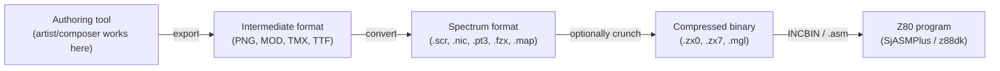

[← Toolchain](README.md) · [← Cross-Platform Toolchain](cross_platform_toolchain.md)

# Asset Tools — Graphics, Sprites, Fonts, Music, and Compression

Every non-trivial ZX Spectrum program loads data that was not written by hand: a title screen, font glyphs, sprite patterns, a music module, a level map. On a real Spectrum these assets live in memory as raw bytes in formats dictated by the hardware (the `.scr` display file at `0x4000`, the attribute file at `0x5800`, the system font at `0x3D00`, sprite patterns wherever the programmer chooses). The **asset pipeline** is the work that turns a PNG drawn in Aseprite, a tune composed in Vortex Tracker II, or a font designed in FZX Editor into those bytes.

This article is the canonical reference for that pipeline. It covers the modern (cross-platform, PC-based) tools — the native 1980s sprite editors and font editors are documented in [native_toolchain.md](native_toolchain.md). Music trackers are surveyed here for the runtime-format side of the pipeline; the full tracker reference is in [06_sound/trackers_and_formats/](../06_sound/trackers_and_formats/README.md).

> [!TIP]
> **This article is the deep dive.** The brief survey in [cross_platform_toolchain.md § Asset Tools](cross_platform_toolchain.md#asset-tools) is a quick index; everything here is the canonical reference for picking the right tool, configuring it, and integrating its output into a SjASMPlus or z88dk build.

---

## The Asset Pipeline Model

A modern Spectrum asset pipeline has three stages. The same three stages apply to every asset type (image, font, music, level data); only the tools at each stage differ.



### Stage 1 — Authoring

The artist or composer works in a familiar PC tool: **Aseprite** or **Pro Motion NG** for pixel art, **GIMP** or **Krita** for full-screen images, **Vortex Tracker II** or **Arkos Tracker** for AY music, **Beepola** or **BeepFX** for 1-bit beeper SFX, **Tiled** for tile maps, **Fony** or **FZX Editor** for fonts. The constraint at this stage is the Spectrum's hardware palette (8 colors × 2 brightness levels, with the famous **attribute clash** limitation: each 8×8 pixel cell can only contain two ink colors), so artists must design within those limits or use dithering / attribute-aware editors.

### Stage 2 — Conversion

A converter tool reads the intermediate format and produces Spectrum-native bytes. There are two families:

- **GUI converters** (ZX Paintbrush, SevenUp) — the artist works inside the converter, drawing directly in Spectrum format. No separate "authoring → conversion" step; the editor *is* the converter.
- **CLI converters** (`png2scr`, `png2sam`, `txt2bas`, custom scripts) — the artist works in any pixel editor, then a build step converts the exported PNG (or other intermediate) to Spectrum bytes. This integrates cleanly with `Makefile` / `tasks.json` / CI pipelines.

### Stage 3 — Integration

The Spectrum-format bytes enter the Z80 program either as a binary blob (`INCBIN "title.scr"` in SjASMPlus, or `#pragma data` in z88dk) or as assembly-source data tables (`.db` / `BYTE` / `DEFB` blocks generated by a tool). Optionally, the bytes pass through a **cruncher** (ZX0, ZX7, MegaLZ) before being included — the program then depacks them at runtime into video RAM or work RAM.

The integration point is where the asset pipeline meets the [sjasmplus.md](sjasmplus.md) and [z88dk.md](z88dk.md) toolchains. Both assemblers provide direct mechanisms for it; this article documents the asset-side of the bridge.

---

## Screen Graphics — the `.scr` Format and Converters

The single most common asset in any Spectrum project is a **full-screen image** in the `.scr` ("screen") format. The 48K Spectrum's display file is exactly **6912 bytes**: 6144 bytes of pixel bitmap (256×192 pixels, 1 bit per pixel, stored in the notorious non-linear layout) plus 768 bytes of attributes (32×24 grid of 8×8 cells, each byte encoding `FLASH BRIGHT PAPER[2:0] INK[2:0]`). A `.scr` file is those 6912 bytes verbatim — loading one at address `0x4000` instantly displays the image.

### Memory layout of a `.scr`

```
Address   Content
0x4000    +--------------------+
          |  Pixel bitmap      |  6144 bytes
          |  256×192 pixels    |  (non-linear: each byte = 8 vertical pixels)
          |  1 bit per pixel   |
0x5800    +--------------------+
          |  Attributes        |  768 bytes
          |  32×24 grid        |  (FLASH/BRIGHT/PAPER/INK per 8×8 cell)
0x5B00    +--------------------+
```

The non-linear bitmap layout is the source of endless headaches for tool authors: pixel (x, y) lives at byte address `0x4000 + (y & 0xC0) << 5 + (y & 0x07) << 8 + (y & 0x38) << 2 + (x >> 3)`, bit `(x & 7)`. Every converter must implement this transform; getting it wrong produces a sheared or diagonal image.

### Authoring tools for full-screen images

| Tool | Type | Platforms | Strengths |
|---|---|---|---|
| **ZX Paintbrush** | GUI editor (direct) | Win / Linux / macOS (Qt) | The standard modern editor. Draws directly in Spectrum format with attribute-aware tools, supports 8×8 and attribute brushes, exports `.scr`, `.bmp`, `.png`. Has integrated font and sprite editing. |
| **SevenUp** (SevenUp Plus) | GUI editor (direct) | Win | Sprite-focused but also does full screens. Attribute-aware. Long-standing community tool. |
| **ZX Paint** (a.k.a. "Speccy Paint") | GUI editor (direct) | Win | Older, simpler full-screen painter. |
| **GIMP + Spectrum export plugin** | GUI editor (indirect) | Cross-platform | Familiar GIMP workflow, export to `.scr` via a community plugin (e.g. `gimp-plugin-scr`). |
| **Aseprite + custom export script** | GUI editor (indirect) | Cross-platform | Modern pixel-art editor; export PNG with 8-color indexed palette, convert with `png2scr`. |
| **Krita / Photoshop + PNG export** | GUI editor (indirect) | Cross-platform | High-end image editors; export PNG, then `png2scr`. |
| **ZX Spectrumizer** (Anton Romanov) | Web tool | Browser | Paste an image, get a dithered Spectrum version. Quick for mockups; not for production assets. |

### CLI converters

For build-pipeline integration, CLI converters are preferred because they can be invoked from `Make` or `tasks.json`:

| Tool | Input | Output | Notes |
|---|---|---|---|
| **`png2scr`** (reidrac / Jamie Blenkinsop) | 24/32-bit PNG (256×192) | `.scr` | Python script, cross-platform. The most commonly used CLI converter. |
| **`scr2png`** | `.scr` | PNG | Reverse direction — useful for screenshots and asset review. |
| **`png2sam`** | PNG | `.scr` + `.sam` attribute map | Variant that separates bitmap and attributes for layered rendering. |
| **`zx-tools`** (Anton Romanov) | Various | Various | A suite of CLI converters covering `.scr`, `.nic`, `.ttf` fonts, and more. |
| **`zxscreenshot`** | PNG | `.scr` with Floyd-Steinberg dithering | Adds attribute-aware dithering, useful for photographic source images. |

Typical CLI conversion in a Makefile:

```make
assets/title.scr: src/title.png
	python3 png2scr.py $< $@

build/game.sna: code/main.asm assets/title.scr
	sjasmplus --sld --fullpath code/main.asm --outprefix=build/
```

### Loading and displaying a `.scr` at runtime

Once you have `title.scr`, integration is trivial — load the bytes at `0x4000`:

```z80
; SjASMPlus: include the screen directly in the binary
title_screen:
    INCBIN "assets/title.scr"        ; 6912 bytes inline

; Or load it to the screen at startup:
        ld hl, title_screen
        ld de, 0x4000
        ld bc, 6912
        ldir                            ; copy to video RAM
```

In z88dk, the same thing via `#pragma`:

```c
#pragma data<section="rodata_zx"> title_screen
extern unsigned char title_screen[6912];
asm(
    "._title_screen\n"
    "   BINARY \"assets/title.scr\"\n"
);
```

### Beyond `.scr` — extended Spectrum formats

The 48K `.scr` is only the beginning. Modern targets add more bits per pixel:

| Format | Target | Size | Notes |
|---|---|---|---|
| `.scr` | 48K / 128K / Pentagon | 6912 B | Standard 2-color-per-8×8-cell display. |
| `.sch` | 48K + hi-color hacks | 12288 B | Hi-color: two attributes per 8×1 pixel row (a.k.a. "RAINBOW" format). |
| `.slr` | 48K + hi-res hacks | variable | Hi-res: 64 attributes per row, 4×1 pixel cells. |
| `.nic` | ZX Spectrum Next (layer 2) | 49152 B | 256×192 × 256 colors, one byte per pixel. |
| `.nxt` | ZX Spectrum Next (tilemap) | variable | 80×64 tilemap with 8×8 pixel tiles, 4-bpp or 8-bpp. |
| `.chk` / `.csh` | Pentagon + TS-Config | 49152 B | 16-color chunky modes used by Russian demoscene. |
| `.mg1` / `.mg2` / `.mg4` | Pentagon + GS / MK98 | varies | Multicolor graphics modes. |

For these extended formats, use **zx-modules** (Windows, by Simon Owen) or the platform-specific tools documented in each machine's reference. The `.nic` (layer-2) format for the ZX Spectrum Next is natively supported by **ZX Paintbrush** and by SjASMPlus's `SAVENEX` directive.

---

## Sprites

Sprites are the second most common graphic asset. Unlike the C64 or NES, the standard 48K Spectrum **has no hardware sprites** — every moving graphic must be drawn in software by XOR-ing or masking pixel patterns into the display file. This shapes the entire sprite pipeline: there is no fixed hardware sprite format, so every game engine invents its own. The ZX Spectrum Next changes this with a real hardware sprite engine.

### Software sprites (48K / 128K / Pentagon)

A "software sprite" is just a sequence of pixel patterns, plus optional mask data. The format depends on the rendering engine:

| Format | Layout | Use case |
|---|---|---|
| **Unmasked linear** | N rows × ceil(width/8) bytes per row, left-to-right, top-to-bottom | Simplest. XOR-rendered; transparent where the pattern is 0. |
| **Pre-shifted** | 8 copies of the sprite, each shifted 0–7 pixels right | Fastest rendering (no shift at runtime). Costs 8× the memory. Standard for action games. |
| **Masked** | N rows × (mask bytes + pattern bytes) per row | The mask is AND-ed to clear the destination, then the pattern is OR-ed. Allows non-rectangular outlines (e.g. a circle). |
| **Aligned 8×8 blocks** | Sprites constrained to multiples of 8 pixels wide, no horizontal shifting needed | Used by character-based engines (e.g. AGD, MPAG). Sprite lives on 8-pixel column boundaries. |
| **Attribute-aware** | Pixel pattern + per-cell attribute bytes | Each 8×8 cell of the sprite carries its own INK/PAPER. Required when the sprite's colors differ from the background. |

#### Authoring tools for software sprites

| Tool | Type | Platforms | Notes |
|---|---|---|---|
| **SevenUp** / **SevenUp Plus** | GUI sprite editor | Win | The canonical sprite editor. Exports raw bytes, pre-shifted data, masked sprites, and AGD-compatible formats. |
| **ZX Paintbrush** | GUI (integrated) | Win / Linux / macOS | Full-screen editor with sprite cutouts. |
| **ZX PearPixel** (modern) | GUI sprite editor | Cross-platform (browser-based) | Modern alternative with animation timeline; exports assembly `DEFB` blocks. |
| **olbrichattila/zx-spectrum-sprite-editor** | Web tool | Browser | Generates `.defb` statements directly from the editor. |
| **Remy Sharp's sprite editor** | Web tool | Browser | Targets ZX Spectrum Next sprites but also exports classic formats. |
| **Aseprite + export script** | Indirect | Cross-platform | Export PNG, then a Python script converts to any of the above formats. |

#### Including sprites in code

Most sprite editors emit either a binary blob or Z80 assembly source:

```z80
; SevenUp-style output: pre-shifted masked sprite, 16x16 pixels, 8 shifts
player_sprite_shifted:
    ; shift 0 (no horizontal offset)
    DEFB 0xFF, 0x00, 0xFF, 0x00   ; mask row 0
    DEFB 0x00, 0x3C, 0x00, 0x3C   ; pattern row 0
    ; ... 16 rows total ...
    ; shift 1 (1 pixel right)
    DEFB 0xFE, 0x01, 0xFE, 0x01
    DEFB 0x00, 0x1E, 0x80, 0x1E
    ; ... and so on for shifts 2-7
```

In SjASMPlus, you can also include the sprite as a binary via `INCBIN` and reference its address:

```z80
player_sprite:
    INCBIN "assets/player.spr"   ; raw binary from sprite editor
```

### Hardware sprites — ZX Spectrum Next

The ZX Spectrum Next has a **real hardware sprite engine** with 64 independent sprites. Each sprite can be:

- 16×16, 32×32, 64×64, 128×80 pixels
- 4-bpp (16 colors from a 256-color palette) or 8-bpp (256 colors)
- Rotated, mirrored, scaled (1× – 4×)
- Type 0 (regular), Type 1 (with pattern rotations), Type 2 (anchor + relative sub-sprites for compositing)

Sprites live in a separate **sprite pattern memory** (a dedicated 16 KB block in the Next's memory map), not in the main display file. This decouples sprite data from screen RAM entirely.

#### Sprite pattern memory layout

Each sprite pattern is a 256-byte block (for 16×16 4-bpp) or 1024 bytes (for 32×32 4-bpp). The Next reserves 16 KB for sprite patterns, giving 64 patterns of 16×16 4-bpp, or 16 patterns of 32×32 4-bpp, or 4 patterns of 64×64 4-bpp.

#### Authoring tools for Next sprites

| Tool | Type | Notes |
|---|---|---|
| **ZX Paintbrush** | GUI | Native support for `.nxs` (Next sprite) files. |
| **Remy Sharp's sprite editor** | Web (browser) | Exports `.nxs` and PNG. Designed specifically for Next. |
| **ZX PearPixel** | GUI | Modern editor; supports all four sprite sizes and 4/8-bpp. |
| **SevenUp** | GUI | Older; export requires conversion to Next pattern layout. |
| **DeZog sprite viewer** | Debugger view | View all 64 sprites at runtime; not an authoring tool but essential for debugging sprite rendering. |

#### Loading sprites at runtime (Next)

The Next exposes sprite pattern memory at `0x4000–0x7FFF` when layer 2 is paged in, or via the sprite-specific MMU banks. SjASMPlus's `SAVENEX` directive and the Next's `SPRITEMIRROR` mechanism handle this automatically for `.nex` programs. In assembly, the standard idiom is:

```z80
; Copy sprite pattern data into sprite pattern memory
        nextreg 0x4C, 0           ; select sprite pattern bank 0
        ld hl, sprite_data         ; source: asset in main RAM
        ld de, 0x4000              ; destination: paged sprite pattern slot
        ld bc, 256 * 4             ; four 16x16 4-bpp patterns
        ldir

---

## Fonts

Almost every Spectrum program displays text, which means it needs a **font**: a binary blob mapping character codes to pixel patterns. The standard Spectrum ROM font lives at `0x3D00` and is 768 bytes (96 characters × 8 bytes, ASCII 32 " " through 127). Most games and applications replace this with a custom font.

There are two dominant font formats in the modern community: the simple **8×8 fixed-width format** (compatible with the ROM font layout) and the more powerful **FZX proportional format**.

### The 8×8 fixed-width font format

The simplest and most common format: 96 (or 128, or 256) characters × 8 bytes per character. Each byte is one row of 8 pixels, MSB first. The standard Spectrum ROM font is in this format.

```
Character 'A' (ASCII 65) in standard Spectrum ROM font (8 bytes):
#00   ........
#38   ..###...
#7C   .#####..
#C6   ##...##.
#C6   ##...##.
#FE   #######.
#C6   ##...##.
#00   ........
```

To point the ROM's `RST 0x10` (print char) routine at a custom font, you write the address into the `CHARS` system variable at `0x5C36`. To use the font with z88dk's `<stdio.h>` functions, set `typedef struct _font` — see the z88dk docs.

### The FZX format

**FZX** is a royalty-free compact bitmap font file format designed by Andrew Owen, originally for the Spectrum. It supports:

- **Proportional spacing** — each character can have its own width (1–16 pixels)
- **Variable character height** — characters can be up to 192 pixels deep
- **Up to 244 characters per font** (ASCII 32 through 255)
- **Tracking** (horizontal gap between characters) and **kerning** (per-character left shift)
- **Leading** (per-character top padding)
- **Relocatable** — offsets are relative, not absolute

FZX is the modern standard for Spectrum fonts. z88dk ships with FZX support and dozens of pre-made fonts; SjASMPlus has no built-in FZX support but loading and rendering FZX fonts is straightforward (the reference implementation fits in ~200 bytes of Z80).

#### FZX file structure

An FZX file is a 3-byte header followed by a per-character table followed by the character pixel data:

```
Offset  Size  Field       Description
0       1     height      Vertical gap between baselines in pixels (after CR)
1       1     tracking    Horizontal gap between characters (usually positive)
2       1     lastchar    ASCII code of the last defined character

3       2*lastchar-61  table   Per-character entries (ASCII 32..lastchar)
                              Each entry is 3 bytes:
                                - offset word + kern bits (high 2 bits)
                                - shift nibble (high 4 bits) + width nibble (low 4 bits)

...     variable  definitions  Character pixel data, byte or pair per row
-3      2         length       Total file length
```

The full spec is on the [Sinclair Wiki FZX format page](https://sinclair.wiki.zxnet.co.uk/wiki/FZX_format).

### Font authoring tools

| Tool | Type | Formats | Platforms | Notes |
|---|---|---|---|---|
| **FZX Editor** (ZX-Modules / Simon Owen) | GUI editor | FZX, CHR | Win | The canonical FZX editor. Also edits 8×8 CHR fonts. Has line/ellipse/rectangle tools, flipping, shifting. |
| **ZX Paintbrush** | GUI editor | 8×8, FZX | Win / Linux / macOS | Integrated font editing. |
| **Fony** | GUI editor | 8×8 (and others) | Win | Old-school Windows font editor. Exports raw font binaries. |
| **ZX-ALFA** | Native (Spectrum) | 8×8 | ZX Spectrum | 1989 Brazilian font editor with 100+ character sets. |
| **ttf2fzx** | CLI converter | TTF → FZX | Cross-platform (Python) | Converts TrueType outlines to FZX format with dithering. |
| **BMP2FONT** | CLI converter | BMP → 8×8 | Win | Older tool for converting BMP images to font binaries. |
| **z88dk font library** | Library | 8×8, FZX | z88dk | Pre-packaged: `#include <arch/zx/font_fzx.h>` pulls in dozens of fonts. |

### Including fonts at runtime

For a simple 8×8 font replacement:

```z80
custom_font:
    INCBIN "assets/myfont.fnt"     ; 768 bytes (96 chars * 8 bytes)

        ; install the font for ROM RST #10 printing:
        ld hl, custom_font
        ld (#5C36), hl              ; CHARS system variable
```

For FZX in z88dk:

```c
#include <arch/zx/font_fzx.h>

#pragma output font_fzx = _font_myfont    // pick a font from z88dk's library

void main(void) {
    fzx_set_font(_font_myfont);
    fzx_puts(0, 0, "Hello, FZX!");
}
```

---

## Music and Sound Effects

The Spectrum has two distinct audio paths, and each has its own tooling:

- **The 1-bit beeper** (48K / 128K) — driven by toggling the speaker bit at port `0xFE`. Polyphonic music is possible but CPU-intensive.
- **The AY-3-8910 / YM2149F PSG** (128K / +2 / +3 / Pentagon / Next) — a 3-channel programmable sound generator with envelope, noise, and per-channel frequency/volume control.

Music trackers produce **module files** (small data blobs describing notes and effects) plus a **player routine** (Z80 code that reads the module and writes to the sound chip every frame). The module + player combination is the standard Spectrum music asset pipeline.

### AY-3-8910 trackers

| Tracker | Module format | Platform support | Notes |
|---|---|---|---|
| **Vortex Tracker II** | `.pt3` (Vortex Tracker II v1.0 PT3) | Win | The most popular modern AY tracker. Outputs the canonical `.pt3` format used across the community. Covered in [vortex_tracker.md](../06_sound/trackers_and_formats/vortex_tracker.md). |
| **Arkos Tracker 2** | `.akg` / `.akm` / `.aks` | Win / Linux | Modern, full-featured. Player sizes: AKM (minimal) ~600 B, AKG (standard) ~700 B. Covered in [arkos_tracker.md](../06_sound/trackers_and_formats/arkos_tracker.md). |
| **Arkos Tracker 1** | `.aks` (legacy) | Win | Older format, still seen in Russian demoscene. |
| **Sound Tracker** / **Pro Tracker** | `.stc` / `.st1` / `.pt2` / `.pt1` | (legacy) | Historical formats from the late Soviet/Russian demoscene. |
| **E-Tracker** | `.etr` | Win | Modern tracker used in some Russian productions. |
| **WTP** / `MWP` (Max Iwamoto) | `.wtp` | Win | Advanced features for TurboSound (dual-AY). |

### Beeper (1-bit) trackers

| Tracker / Engine | Use case | Notes |
|---|---|---|
| **Beepola** | Windows GUI tracker | Wraps several 1-bit engines: Phoenix, Music Synth 48K, Tritone (Shiru), Huby, ZX-10, Square. The standard for 48K-only music. |
| **BeepFX** | Windows GUI SFX designer | Companion to Beepola; produces short sound effects rather than music. |
| **1BitTracker** | Cross-platform | Tracker for various beeper engines. |
| **btDX** / **QChan** | Native (Spectrum) | On-machine 1-bit trackers; included for historical context. |

### Integrating music at runtime

A `.pt3` module from Vortex Tracker II is typically 3–10 KB. The player is ~700 bytes. The integration pattern:

1. Include the module binary with `INCBIN "music.pt3"`.
2. Include the player routine (a `.asm` file distributed with VTII).
3. Call the player's `INIT` once at startup, then call `PLAY` once per frame from the vertical-blank interrupt.

```z80
        ; initialization
        ld hl, music_module
        xor a                        ; song #0
        call PT3_INIT                ; VTII initialization routine

        ; once per frame (e.g. in the IM2 ISR):
        call PT3_PLAY                ; advances playback by one frame
```

For z88dk, the same routine can be called from C via `extern`:

```c
extern void PT3_INIT(unsigned char *module, unsigned char song) __z88dk_fastcall;
extern void PT3_PLAY(void);

void vblank_isr(void) {
    PT3_PLAY();
}
```

### Wavetable synthesis (modern)

The ZX Spectrum Next's hardware TurboSound and DMA audio enable sample playback. Tools like **Nextively** and **Waveform Composer** target these. The **NXPWM** engine plays `.mod` modules on the Next. These are specialized Next-only tools; see the [Next programming docs](https://specnext.dev/) for details.

### Sound effect (SFX) generators

For simple sound effects (zaps, explosions, clicks), two tools dominate:

| Tool | Output | Notes |
|---|---|---|
| **BeepFX** (shiru / Chris Cowley) | Z80 source code | Generates inline Z80 routines for short effects. No runtime module — the code *is* the effect. |
| **ayFX Editor** | `.afx` binary + Z80 player | AY-3-8910 sound effects with small player (~80 bytes). |
| **sfxengine** (Modern, by em00k) | Binary + player | Modern AY SFX engine. |

The BeepFX output pattern is distinctive — instead of a data blob + player, the tool emits self-contained Z80 subroutines per effect. This trades memory for speed (no interpreter overhead) and makes each effect independent.

> [!TIP]
> **Music tracker documentation** lives in [06_sound/trackers_and_formats/](../06_sound/trackers_and_formats/README.md). This article documents the *asset pipeline* — authoring, module format, runtime integration — while the tracker deep dives cover composing, instrument design, and player internals.

---

## Compression and Crunchers

The Spectrum has between 40 KB and 600 KB of usable RAM (depending on model), and tape / disk loaders are slow. Almost every real-world project compresses its assets: title screens, level data, music modules, even the executable code itself. Compression is also mandatory for size-limited formats (1K, 4K, 16K demos; 48K compo entries).

Spectrum compression tools split into two roles: the **compressor** (runs on PC at build time) and the **decompressor** / **depacker** (runs on Z80 at runtime). The depacker is what you integrate into your program.

### The ZX0 / ZX1 / ZX2 / ZX7 family

Einar Saukas's compression tools are the de facto standard. They form a small family with different tradeoffs:

| Tool | Author | Strategy | Typical ratio | Depacker size | Notes |
|---|---|---|---|---|---|
| **ZX0** | Einar Saukas | Optimal LZ77/LZSS | **35–50%** | 68–673 B | The current standard. Four depacker variants (Standard, Turbo, Fast, Mega) trade size for speed. Optimal compression takes seconds; `-q` quick mode is near-instant and produces only slightly larger output. |
| **ZX1** | Einar Saukas | Simpler variant of ZX0 | 35–50% (≈1.5% worse than ZX0) | ~60 B | 15% faster depack than ZX0; simpler format. Use when ZX0's optimisation time is too slow. |
| **ZX2** | Einar Saukas | Newer experimental variant | similar to ZX1 | small | Not yet widely adopted; experimentation ongoing. |
| **ZX7** | Einar Saukas + Antonio Villena | Older LZ77 | 40–55% (worse than ZX0) | ~250 B | The pre-ZX0 standard. Fast compressor, fast depacker, still seen in many existing codebases. |

The ZX0 v2 file format is slightly smaller and faster than v1; use `-c` on the compressor to produce v1-compatible output for legacy depackers.

### MegaLZ

| Tool | Author | Strategy | Typical ratio | Depacker size | Notes |
|---|---|---|---|---|---|
| **MegaLZ** | introspec / spke | LZ-style, tuned for Z80 | 40–55% | ~200 B | Competitive with ZX0 in ratio, **faster depacker** than ZX0 standard. The encode.su benchmarks show MegaLZ as the speed/ratio leader for Z80 in many cases. |

### Other packers

| Tool | Author | Strategy | Use case |
|---|---|---|---|
| **LZ4** | Yann Collet (z80 port by lainz) | Standard LZ4 | When interoperability with non-Spectrum tools matters. Worse ratio than ZX0/MegaLZ for Spectrum data. |
| **LZSA** | Emmanuel Marty | LZ-style, optimised for 8-bit | Modern alternative to LZ4. Three compression levels (1, 2, 3). |
| **RCS** (Resource Compression System) | Einar Saukas | Reorder bytes by column | Used in combination with another packer on screen-format data (`.scr` files compress better after RCS). |
| **APLIB** (ApLib) | Jørgen Ibsen (z80 port) | LZ + arithmetic coding | Best ratio of any pure-packers, but slow depacker (and patents historically clouded its use; now public domain). |
| **HRUM** / **HR** | Romanenko family | Old Soviet cruncher | Legacy Russian scene. |
| **LZ77 z80 by Antonio Villena** | Antonio Villena | Custom LZ77 | Compact depacker; popular in size-critical demos. |
| **Pletter** | Team Bomba | LZ77 | Older but still used in some classic scenes. |

### Cruncher integration in code

The typical pattern is to compress the asset at build time and depack at runtime:

```bash
# At build time:
zx0 title.scr               # produces title.scr.zx0
```

```z80
; At runtime: depack from HL (compressed source) to DE (target)
        ld hl, title_scr_zx0           ; the compressed bytes
        ld de, #4000                  ; target: video RAM
        call dzx0_standard             ; from the ZX0 depacker .asm
```

A complete depack routine with SjASMPlus and ZX0:

```z80
        INCLUDE "zx0_standard.asm"     ; Einar Saukas's depacker

title_scr_zx0:
        INCBIN "assets/title.scr.zx0" ; compressed screen

show_title:
        ld hl, title_scr_zx0
        ld de, #4000
        call dzx0_standard
        ret
```

### Screen-specific packing: RCS

The Spectrum's non-linear `.scr` layout hurts general-purpose compressors because adjacent bytes in the file are not adjacent pixels. **RCS** (Resource Compression System) reorders bytes by column so that vertically adjacent pixels end up adjacent in the file. The pipeline is:

```bash
rcs title.scr             # reorder title.scr in place
zx0 title.scr             # compress reordered bytes (better ratio)
```

At runtime:

```z80
        ; depack to a buffer, then un-RCS to the screen
        ld hl, title_scr_zx0
        ld de, screen_buffer
        call dzx0_standard
        ld hl, screen_buffer
        ld de, #4000
        call rcs_restore                 ; inverse of RCS
```

### Executable packers (loaders)

For compressing the executable itself (typically to produce a single-loading `.tap` or `.sna`), use:

| Packer | Output | Notes |
|---|---|---|
| **SjASMPlus `SAVETAP`** | `.tap` | Built-in; can wrap a packed binary in a loader. |
| **z88dk `appmake`** | various | The `+zx` and `+zxn` targets can wrap a packed binary. |
| **BMP2EXCEL / Salva Loaders** | custom | Custom loader screens with decrunch; common in 1990s scene releases. |
| **TRDOS loaders** | `.trd` | Used in the Russian/Pentagon scene. |

### Assembler-integrated packers

Some assemblers integrate crunchers directly:

- **RASM** — built-in ZX0, ZX1, ZX2, ZX7, MegaLZ, LZ4, ABP, RCS
- **SjASMPlus** — does **not** integrate a cruncher; you run the cruncher as a separate build step (`zx0 assets/title.scr` in your Makefile)

### Compression benchmark tips

When choosing a packer, measure on **your actual data**, not on synthetic benchmarks. The relative ranking of ZX0 vs MegaLZ vs ZX7 varies by data type:

- **Screen graphics** — ZX0 with RCS preprocessing usually wins
- **Code / executables** — ZX0 or MegaLZ; ratios within 2%
- **Music modules** — often already small; small gains
- **Repeated patterns** (e.g. tile maps) — MegaLZ or ZX7 may win

---

## Tile Maps and Level Data

Most games store their levels as a grid of tile indices. There is no universal "Spectrum tile map format" — each game invents its own — but two tools dominate the authoring side:

### Tiled (the standard map editor)

**[Tiled](https://www.mapeditor.org/)** is a free, cross-platform tile-map editor used for 2D games generally. It exports to several formats; the Spectrum-relevant ones are:

- **TMX** (XML) — easy to parse in a Python preprocessor that emits Z80 `.db` tables
- **JSON / Lua / CSV** exports — even simpler to parse

A typical pipeline: author the map in Tiled → export as CSV → run a small Python script to convert to a binary tile-index file (one byte per tile) → `INCBIN` in SjASMPlus.

```python
# tilemap_to_bin.py - convert Tiled CSV export to binary tile indices
import sys
data = open(sys.argv[1]).read()
indices = [int(x) for x in data.replace("\n", ",").split(",") if x.strip()]
with open(sys.argv[2], "wb") as f:
    f.write(bytes(indices))
```

### Tilemap attributes (collision, special tiles)

Real games need more than just tile indices — they need flags like "walkable", "deadly", "pickup". The standard approach is to maintain a separate **tile attribute table**: a small array indexed by tile number. The map data stores tile indices; the engine looks up `tile_attrs[tile_index]` to find the flags.

### ZX Spectrum Next tilemap

The Next has a **hardware tilemap mode** (80×64 tiles, each 8×8 pixels, 4-bpp or 8-bpp, with per-tile attributes and a 256-entry palette). Tools:

- **Tiled** — authoring
- **ZX Paintbrush** — tile pattern editing
- **Remy Sharp's tilemap editor** — web-based, exports Next-native format
- **DeZog tilemap viewer** — runtime inspection

### Other level-data formats

- **Text-based** (Adventure games, interactive fiction) — use a custom DSL or simple text files, parsed at runtime
- **Binary scripted** (cutscenes, scripted events) — a custom bytecode, often hand-authored or generated by a Python/Lua tool
- **Hand-coded assembly tables** — small games often have level data as raw `DEFB` blocks in the source

---

## Comparison Matrix — by asset type

The table below summarizes the recommended tool for each asset type at each pipeline stage.

| Asset type | Authoring (stage 1) | Conversion (stage 2) | Format (stage 3 in) |
|---|---|---|---|
| **Full-screen image (48K)** | ZX Paintbrush (direct) or Aseprite (indirect) | `png2scr` (CLI) or built-in | `.scr` (6912 B) |
| **Full-screen image (Next layer 2)** | ZX Paintbrush or Aseprite | `png2nic` / built-in | `.nic` (49152 B) |
| **Software sprite** | SevenUp (Win) or ZX PearPixel | built-in | raw binary / `.defb` |
| **Next hardware sprite** | ZX Paintbrush or Remy Sharp editor | built-in | `.nxs` / Next sprite pattern memory |
| **Font (8×8)** | Fony (Win) or ZX Paintbrush | built-in | `.fnt` (768 B per 96 chars) |
| **Font (proportional)** | FZX Editor (Win) | built-in | `.fzx` |
| **AY music** | Vortex Tracker II or Arkos Tracker | built-in | `.pt3` / `.akg` / `.akm` |
| **Beeper music (48K)** | Beepola | built-in | engine-specific |
| **AY SFX** | ayFX Editor | built-in | `.afx` |
| **Beeper SFX** | BeepFX | code emission | Z80 source |
| **Tile map** | Tiled | custom Python script | raw tile-index binary |
| **Level data (scripted)** | hand-authored or DSL | DSL compiler | custom bytecode |

---

## Decision Tree

```mermaid
flowchart TD
    Q0["What asset are you creating?"] --> Q1{"Type"}
    Q1 -- "Full-screen image" --> Q2{"Target"}
    Q1 -- "Sprite" --> Q3{"Target"}
    Q1 -- "Font" --> Q4{"Format"}
    Q1 -- "Music" --> Q5{"Audio path"}
    Q1 -- "SFX" --> Q6{"Audio path"}
    Q1 -- "Map / level data" --> Q7{"Format"}
    Q1 -- "Executable / whole binary" --> A_EXE["ZX0 (or MegaLZ) for code<br/>SjASMPlus SAVETAP or z88dk appmake for loader wrapping"]

    Q2 -- "48K / 128K / Pentagon" --> A_SCR_48["ZX Paintbrush or Aseprite → png2scr<br/>→ .scr (6912 B)<br/>→ option: RCS + ZX0 to compress"]
    Q2 -- "ZX Spectrum Next layer 2" --> A_SCR_NXT["ZX Paintbrush (native .nic support)<br/>or Aseprite → png2nic<br/>→ .nic (49152 B)"]
    Q2 -- "Hi-color / hi-res hacks" --> A_SCR_HC["zx-modules (Win) for specialist formats"]

    Q3 -- "48K / 128K / Pentagon" --> Q3a{"Workflow"}
    Q3 -- "ZX Spectrum Next hardware" --> A_SPR_NXT["ZX Paintbrush or Remy Sharp editor<br/>→ .nxs, loaded into sprite pattern memory"]
    Q3a -- "Pre-shifted masked (action games)" --> A_SPR_SEVEN["SevenUp<br/>(exports pre-shifted masked data + .defb)"]
    Q3a -- "Modern cross-platform" --> A_SPR_PEAR["ZX PearPixel or Aseprite + custom script"]

    Q4 -- "Simple 8×8" --> A_FONT_88["Fony (Win) or ZX Paintbrush<br/>→ 768 B binary, INCBIN or CHARS override"]
    Q4 -- "Proportional / Unicode / large" --> A_FONT_FZX["FZX Editor<br/>→ .fzx (z88dk has built-in support)"]

    Q5 -- "AY-3-8910 / YM2149" --> Q5a{"Feature needs"}
    Q5 -- "1-bit beeper (48K)" --> A_MUS_BEEP["Beepola (Phoenix / Tritone / Huby engines)"]
    Q5a -- "Standard, widely compatible" --> A_MUS_PT3["Vortex Tracker II → .pt3"]
    Q5a -- "Smallest player / multi-song" --> A_MUS_AKM["Arkos Tracker 2 → .akm"]
    Q5a -- "Modern features (samples, multi-AY)" --> A_MUS_AKG["Arkos Tracker 2 → .akg / .aks"]

    Q6 -- "AY-3-8910" --> A_SFX_AY["ayFX Editor → .afx + ~80 B player"]
    Q6 -- "1-bit beeper" --> A_SFX_BEEP["BeepFX → inline Z80 subroutines"]

    Q7 -- "Standard grid tilemap" --> A_MAP_TILED["Tiled → CSV export → Python script → binary index array"]
    Q7 -- "Next hardware tilemap" --> A_MAP_NXT["Tiled + Remy Sharp editor → Next-native format"]
    Q7 -- "Custom / scripted" --> A_MAP_CUSTOM["Hand-authored DSL → custom compiler → bytecode"]
```



---

## A Worked Example — Full Asset Pipeline

This example demonstrates a complete asset pipeline for a small game: title screen, custom font, player sprite, background music, and level data. The build is driven by a Makefile.

### Directory layout

```
project/
├── src/
│   ├── main.asm               ; SjASMPlus entry point
│   └── data.asm                ; INCBIN references to compiled assets
├── assets/
│   ├── title.png               ; artist source
│   ├── title.scr               ; converted (build product)
│   ├── title.scr.zx0           ; crunched (build product)
│   ├── myfont.fnt              ; 768-byte 8×8 font (authored)
│   ├── player.png              ; sprite source
│   ├── player.spr              ; converted (build product)
│   ├── music.pt3               ; VTII module (authored)
│   ├── level1.tmx              ; Tiled source
│   └── level1.bin              ; compiled tile data (build product)
├── tools/
│   ├── png2scr.py
│   ├── tilemap_to_bin.py
│   ├── zx0
│   ├── zx0_standard.asm
│   └── pt3player.asm
├── Makefile
└── build/
    └── game.sna                ; final output
```

### Makefile

```make
# Tools
PNG2SCR := python3 tools/png2scr.py
TILEMAP := python3 tools/tilemap_to_bin.py
ZX0     := tools/zx0
SJASM   := sjasmplus

# Sources and products
ASSET_SRCS := assets/title.png assets/player.png assets/level1.tmx
ASSET_BINS := assets/title.scr.zx0 assets/player.spr assets/level1.bin

.PHONY: all clean

all: build/game.sna

# Convert PNG → SCR → ZX0-compressed SCR
assets/title.scr: assets/title.png
	$(PNG2SCR) $< $@

assets/title.scr.zx0: assets/title.scr
	$(ZX0) $<

# Convert sprite PNG → raw binary (custom script)
assets/player.spr: assets/player.png
	python3 tools/png_to_sprite.py $< $@ --width 16 --height 16 --mask

# Convert Tiled TMX → binary tile indices
assets/level1.bin: assets/level1.tmx
	$(TILEMAP) $< $@

# Final assembly
build/game.sna: src/main.asm src/data.asm $(ASSET_BINS)
	mkdir -p build
	$(SJASM) --sld --fullpath --outprefix=build/ src/main.asm

clean:
	rm -f assets/title.scr assets/title.scr.zx0 assets/player.spr assets/level1.bin
	rm -rf build/
```

### SjASMPlus source (`src/data.asm`)

```z80
; === Assets ===

title_screen_zx0:
    INCBIN "assets/title.scr.zx0"

custom_font:
    INCBIN "assets/myfont.fnt"        ; 768 B, 8x8

player_sprite:
    INCBIN "assets/player.spr"        ; masked, pre-shifted 16x16

music_module:
    INCBIN "assets/music.pt3"         ; VTII module

level1_data:
    INCBIN "assets/level1.bin"        ; tile indices

; === Third-party player routines ===
    INCLUDE "tools/zx0_standard.asm"  ; Einar Saukas depacker
    INCLUDE "tools/pt3player.asm"     ; VTII player

; === Install font on startup ===
install_font:
        ld hl, custom_font
        ld (#5C36), hl                ; CHARS system variable
        ret

; === Decompress and display title screen ===
show_title:
        ld hl, title_screen_zx0
        ld de, #4000
        call dzx0_standard
        ret

; === Initialize music ===
init_music:
        ld hl, music_module
        xor a                          ; song 0
        call PT3_INIT
        ret
```

This pipeline is fully reproducible from sources: an artist edits PNGs in Aseprite, a composer edits `music.pt3` in Vortex Tracker II, a designer edits `level1.tmx` in Tiled, and `make` produces the final `game.sna`. There are no manual conversion steps.

---

## Best Practices

1. **Treat assets as build products, not source files.** Every `.scr`, `.spr`, `.fnt`, `.pt3.zx0` file should be reproducible from its source (`.png`, `.tmx`, tracker module) by a build step. Commit the *sources*; gitignore the *products*.

2. **Use a Makefile (or equivalent) for the whole pipeline.** Build orchestration ensures that changing a PNG triggers re-conversion, re-crunching, and re-assembly. Manual steps get forgotten.

3. **Verify color constraints in the authoring tool.** Aseprite's "restrict palette" mode (8 colors + bright bit) prevents drawing colors that `png2scr` cannot represent. Catching constraint violations before conversion saves debugging time.

4. **Keep cruncher depackers in version control.** Drop `zx0_standard.asm` (or whatever depacker you use) into a `tools/` directory and `INCLUDE` it from your source. Don't rely on having the cruncher's full source tree available.

5. **Benchmark packers on your real data.** ZX0 vs MegaLZ ranking varies by data type. Run all candidates on your actual assets and pick the winner. Don't trust synthetic benchmarks.

6. **Pre-shift sprites only when you need the speed.** Pre-shifting 8× the memory cost is the right tradeoff for a 50-Hz action game; it's overkill for a turn-based RPG.

7. **Version your asset formats.** If you write a custom Python converter, store a format-version byte at the top of the output. Future-you will thank you when you need to change the layout.

8. **For music, ship both module and player source.** The `.pt3` file plus the player `.asm` should both be in version control. If the player ever needs patching (e.g. for a different AY clock rate on a Pentagon vs a 128K), you have the source.

9. **Use `INCBIN` not `BINCLUDE` for raw data.** SjASMPlus's `INCBIN` includes raw bytes; `BINCLUDE` includes an assembly-source `.asm` file. Mixing them up is a common source of build errors.

10. **Test assets on real hardware periodically.** Emulators are very forgiving of color clashes and timing slop that real CRTs punish. A title screen that looks fine in Fuse can be unreadable on a real Spectrum via RF.

---

## Pitfalls

### Authoring pitfalls

- **Attribute clash** — the Spectrum's 8×8 attribute cell is the single most common art pitfall. Two ink colors in the same 8×8 cell is impossible without tricks (pre-rendered screens, dithering, hi-color / hi-res modes). Artists used to per-pixel color (C64, NES, modern platforms) need to design *within* the attribute grid.
- **Wrong palette in PNG export** — `png2scr` assumes an indexed PNG with the Spectrum palette. RGB PNGs (24/32-bit) work but require the converter to map each pixel to the nearest Spectrum color. Exporting from Aseprite with an explicit Spectrum palette avoids surprises.
- **Non-256×192 source images** — `png2scr` requires exactly 256×192. Larger images must be cropped or scaled before conversion; some converters silently crop, others error out.
- **Sprite pre-shift direction** — pre-shifted sprites shift *right*. A pre-shifted sprite table indexed `[shift_0..shift_7]` assumes the sprite's X coordinate moves left-to-right. Inverting this is a common bug.

### Conversion pitfalls

- **Non-linear screen layout** — getting the screen-address calculation wrong (the `(y & 0xC0) << 5 + (y & 0x07) << 8 + ...` formula) produces a sheared image. Test your converter on a known-good `.scr` first.
- **BGR vs RGB in PNG headers** — some PNG exporters (older ones) write BGR pixel data. Modern converters usually handle this, but it's a classic source of red/blue swapped screens.
- **FZX kern bits** — the high 2 bits of the FZX offset word encode the kern. Mask them off when computing the address: `offset & 0x3FFF`.

### Compression pitfalls

- **Compressing before RCS** — screen-format data compresses much better with RCS preprocessing (column reorder) *before* the LZ packer. Skipping RCS costs ~5–10% ratio.
- **Overlapping decompression** — ZX0 can decompress in place if the source ends *after* the destination, but only by a specific delta reported at compression time. Ignoring the delta corrupts data.
- **Depacker size not counted** — a 68-byte ZX0 depacker looks tiny until you realise your 1K demo only has 1000 bytes of code space. Always count depacker + compressed size, not just compressed size.
- **Compressing already-compressed data** — don't crunch an `.pt3` or `.akg` module; they're already compressed internally. Re-compressing them usually makes them *larger*.

### Integration pitfalls

- **`INCBIN` path resolution** — SjASMPlus resolves `INCBIN` paths relative to the *main source file*, not the `--outprefix` or current working directory. Use absolute paths or `--inc` search paths in CI builds.
- **z88dk `BINARY` directive indentation** — in inline `asm()`, the `BINARY` directive must be at column 0 (no leading whitespace). The leading `.` is mandatory in z88dk's assembler syntax.
- **Music player calling convention** — VTII's `PT3_INIT` and `PT3_PLAY` expect HL pointing at the module on entry. Forgetting to set HL before `PT3_INIT` causes random note garbage.
- **Interrupt-driven music + main loop timing** — if `PT3_PLAY` is called from an IM2 ISR, it consumes ~2000–3000 cycles per frame. Budget for this in your main loop timing.

---

## Cross-References

This article is the canonical reference for the **asset pipeline**. Related deep dives:

- [sjasmplus.md](sjasmplus.md) — the assembler where assets are integrated via `INCBIN`, `SAVESNA`, `SAVETAP`, `SAVETRD`, `SAVENEX`. See especially the sections on `INCBIN`, `STRUCTURE` (for organizing asset tables), and `SAVENEX` (for `.nex` output with embedded assets).
- [z88dk.md](z88dk.md) — the C toolkit where assets are integrated via `#pragma data`, `BINARY` directive, and the FZX font library. See especially the `<arch/zx.h>` and `<arch/zxn.h>` library APIs.
- [native_toolchain.md](native_toolchain.md) — the native (on-Spectrum) sprite editors, font editors, and graphics tools of the 1980s–1990s. This article covers the modern cross-platform equivalents.
- [cross_platform_toolchain.md](cross_platform_toolchain.md) — the brief survey of asset tools in § Asset Tools; this article is the deep dive.
- [debugging.md](debugging.md) — debugging the runtime side of the asset pipeline (wrong sprite data, garbled screen, corrupted music). DeZog's sprite viewer and memory inspector are essential for diagnosing asset integration bugs.
- [../06_sound/trackers_and_formats/](../06_sound/trackers_and_formats/README.md) — the full music tracker reference (Vortex Tracker II, Arkos Tracker, beeper engines). This article covers only the asset-pipeline integration side.

---

## References

### Screen graphics
- [ZX Paintbrush](https://www.usebox.net/jjm/zxpaintbrush/) — <https://www.usebox.net/jjm/zxpaintbrush/>
- [png2scr](https://github.com/reidrac/png2scr) — <https://github.com/reidrac/png2scr>
- [zx-tools](https://github.com/anton-bulanov/zx-tools) — <https://github.com/anton-bulanov/zx-tools>
- **ZX Spectrumizer** (browser-based) — <https://atornblad.github.io/zx-spectrumizer/>
- [ZX-Modules](https://worldofspectrum.net/zx-modules/) — <https://worldofspectrum.net/zx-modules/>

### Sprites
- [SevenUp](https://worldofspectrum.org/) / **SevenUp Plus** — widely distributed via World of Spectrum and the Spectrum Computing archive
- **ZX PearPixel** (modern cross-platform sprite editor) — search Spectrum developer community groups
- **Remy Sharp's sprite and tilemap editors** (ZX Spectrum Next) — <https://zx.remysharp.com/>
- **olbrichattila/zx-spectrum-sprite-editor** — <https://github.com/olbrichattila/zx-spectrum-sprite-editor>
- **ZX Spectrum Next hardware sprites** — <https://specnext.dev/~sprite-engine/>

### Fonts
- **FZX format specification** — <https://sinclair.wiki.zxnet.co.uk/wiki/FZX_format>
- [FZX Editor (ZX-Modules)](https://worldofspectrum.net/zx-modules/) — <https://worldofspectrum.net/zx-modules/100>
- **Fony** (Windows font editor) — <https://hukka.ncn.fi/?fony>
- [z88dk FZX font library](https://github.com/z88dk/z88dk) — <https://github.com/z88dk/z88dk/tree/master/libsrc/_DEVELOPMENT/font>

### Music and SFX
- [Vortex Tracker II](http://bulba.unterground.net/) — <http://bulba.untergrund.net/vortex_e.htm>
- [Arkos Tracker 2 / 3](https://www.julien-nevo.com/arkostracker/) — <https://www.julien-nevo.com/arkos/>
- **Beepola** (1-bit beeper tracker) — <https://shiru.untergrund.net/software.shtml>
- **BeepFX** (1-bit SFX generator) — <https://shiru.untergrund.net/software.shtml>
- **ayFX** (AY SFX) — <https://shiru.untergrund.net/software.shtml>
- [World of Spectrum AY music archive](https://worldofspectrum.org/) — <https://worldofspectrum.net/archive/>

### Compression / crunchers
- [ZX0](https://github.com/einar-saukas/ZX0) — <https://github.com/einar-saukas/ZX0>
- [ZX1](https://github.com/einar-saukas/ZX0) — <https://github.com/einar-saukas/ZX1>
- [ZX7](https://github.com/AntoniVillena/zx7) — search "Einar Saukas ZX7"
- [MegaLZ](https://github.com/ladislav-zezula/MegaLZ) — <https://github.com/tonyt76/MegaLZ>
- [LZSA](https://github.com/emmanuel-marty/lzsa) — <https://github.com/emmanuel-marty/lzsa>
- **State of the art byte compression for 8-bit computers** (encode.su community thread with benchmarks) — <https://encode.su/threads/3001-State-of-the-art-byte-compression-(for-8-bit-computers)>
- [Optimizations in ZX0 compression](https://github.com/einar-saukas/ZX0) — <https://heckmeck.de/blog/optimizations-in-zx0-compression/>

### Tile maps and level data
- **Tiled** (the standard map editor) — <https://www.mapeditor.org/>
- **ZX Spectrum Next tilemap programming** — <https://specnext.dev/~tilemap/>

### Toolchains (where assets integrate)
- [SjASMPlus](https://github.com/z00m128/sjasmplus) — <https://github.com/z00m128/sjasmplus>
- [z88dk](https://github.com/z88dk/z88dk) — <https://github.com/z88dk/z88dk>
- [DeZog](https://github.com/maziac/DeZog) — <https://github.com/maziac/DeZog>

### Community archives
- [World of Spectrum](https://worldofspectrum.org/) — <https://worldofspectrum.net/>
- **Spectrum Computing** — <https://spectrumcomputing.co.uk/>
- **ZX ART** (Spectrum art and music archive) — <https://zxart.ee/>
