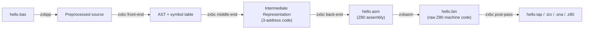
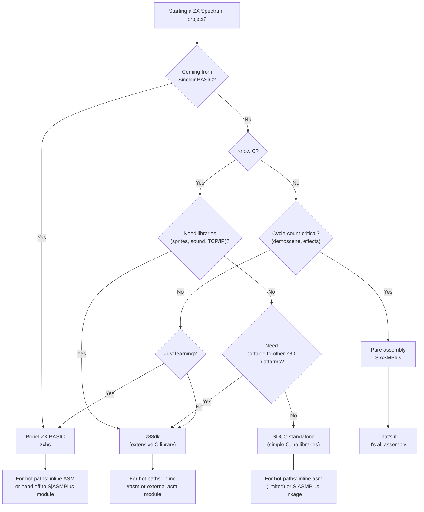

[← Toolchain](README.md) · [← z88dk](z88dk.md) · [← sdcc](sdcc.md)

# Boriel ZX BASIC — The Modern BASIC Compiler for the ZX Spectrum

> **Scope.** This article is the canonical reference for **Boriel ZX BASIC** (`zxbc`) — the modern cross-compiler that takes a BASIC source file on PC/Mac/Linux and emits native Z80 machine code for the ZX Spectrum (48K, 128K, +2A/+3, and ZX Spectrum Next). It covers the compiler's architecture, the SDK toolchain (`zxbc`, `zxbasm`, `zxbpp`), the BASIC dialect (types, syntax, subprograms, inline assembly), the standard library, command-line flag reference, output formats, integration with external assets and assembly, a worked example, and a comparison against z88dk C and pure assembly.

> [!TIP]
> **For most ZX Spectrum work, assembly ([sjasmplus.md](sjasmplus.md)) or C ([z88dk.md](z88dk.md)) is the better default.** Boriel ZX BASIC is the right choice when (a) you have a Sinclair BASIC background and want a low-friction transition to compiled machine code, (b) you are writing a game or application where high-level constructs (typed arrays, functions, string handling) save enough time to justify a small runtime overhead, (c) you want one tool that produces a runnable `.tap` with a built-in BASIC loader in a single command, or (d) you are teaching beginners. For inner loops, interrupt handlers, and cycle-count-critical code, drop down to inline assembly (covered in [§ Inline Assembly](#inline-assembly) below) or hand off the hot path to SjASMPlus entirely.

---

## What Boriel ZX BASIC Is

**Boriel ZX BASIC** (also called **ZX BASIC** or `zxbc`) is a cross-platform compiler that translates an extended BASIC dialect into Z80 machine code. It is authored and maintained by **Jose Rodriguez-Rosa** (a.k.a. **Boriel**) since 2008, with significant contributions from the community (notably **Britlion**, **LCD**, and **@em00k**). The compiler and its runtime libraries are licensed under **AGPLv3**, but the binaries it emits can be distributed under any license including closed-source commercial — the AGPL applies only to modifications of the compiler itself, not to programs compiled by it.

The compiler's lineage is **Sinclair BASIC** (the ROM-resident interpreter that shipped with every Spectrum from 1982) extended with ideas from **FreeBASIC/QBASIC** (structured programming, typed variables, named subprograms). The result is a dialect that feels familiar to anyone who typed `10 PRINT "HELLO"` in the 1980s, but supports `SUB`/`FUNCTION`, `DO...LOOP`, `DIM...AS Type`, and a proper type system.

### The Three Tools

Boriel's SDK ships three executables:

| Tool | Invocation | Purpose |
|---|---|---|
| **`zxbc`** | `zxbc.py hello.bas` | The **compiler**. Takes a `.bas` source file, emits a binary (`.bin`), tape image (`.tap`/`.tzx`), snapshot (`.sna`/`.z80`), or intermediate assembler (`.asm`) / IR (`.ir`). This is the tool most users invoke directly. |
| **`zxbasm`** | `zxbasm.py hello.asm` | The **assembler**. A standalone Z80 macro assembler used internally by `zxbc` for the backend pass. Can also be invoked directly on hand-written `.asm` files — useful when `zxbc -A` has emitted an intermediate `.asm` you want to inspect or hand-edit. |
| **`zxbpp`** | `zxbpp.py hello.bas` | The **preprocessor**. Handles `#include`, `#define`, and conditional compilation (`#if`/`#ifdef`). Invoked automatically by `zxbc`; rarely called directly. |

On Windows these are `.exe` files; on Linux/macOS they are Python scripts (`zxbc.py`, `zxbasm.py`, `zxbpp.py`) that require Python 3. The two distributions are functionally identical.

### A 30-Second Example

```basic
REM hello.bas — compile with: zxbc --tap --autorun --BASIC hello.bas
10 CLS
20 PRINT AT 10, 10; "HELLO WORLD!"
30 PAUSE 0
```

Running `zxbc --tap --autorun --BASIC hello.bas` produces `hello.tap` — a tape image containing a Sinclair BASIC loader plus the compiled machine code. Load it in Fuse or any other Spectrum emulator with `LOAD ""`, the BASIC loader runs, your machine code takes over, and "HELLO WORLD!" appears centered on a cleared screen. No further glue required.

### Design Philosophy

Three principles shape ZX BASIC:

1. **Source compatibility with Sinclair BASIC where reasonable.** Line numbers are optional but accepted. `PRINT`, `PAUSE`, `INK`, `PAPER`, `CLS`, `BEEP`, `PLOT`, `DRAW`, `CIRCLE` all work as in ROM. The `--sinclair` flag (`-Z`) further increases compatibility (arrays/strings 1-indexed, `ATTR`/`POINT`/`SCREEN$` enabled).
2. **Modern dialect where it matters.** Typed variables (`DIM x AS UBYTE`), named `SUB`/`FUNCTION` with parameters, `DO...LOOP WHILE/UNTIL`, `IF...ELSEIF...ELSE...END IF`, `#include`, `#define`. The dialect borrows heavily from FreeBASIC.
3. **Native Z80 output, no virtual machine.** The compiler does not emit bytecode for an interpreter — it emits real Z80 machine code that calls into a small runtime library for complex operations (floating point, string allocation, multiply/divide). Programs run at machine-code speed, not at ROM-BASIC speed.

---

## History and Versions

| Year | Milestone |
|---|---|
| **2008** | Jose Rodriguez-Rosa releases the first versions, targeting the ZX Spectrum 48K. The project lives at `boriel-basic/zxbasic` on GitHub. |
| **2009–2013** | Active community growth. Britlion contributes extensive library routines. The forum at `forum.boriel.com` becomes the support hub. |
| **2014–2018** | Type system matures: `UBYTE`/`UInteger`/`Long`/`ULong`/`Fixed`/`Float`. `SUB`/`FUNCTION` parameter passing stabilizes. |
| **2019–2022** | Peephole optimizer introduced (`-O2` default). ZX Spectrum Next (`--arch zxnext`, `-N`) support added for Z80N extended opcodes. |
| **2023–2025** | Output format options extended (`.sna`, `.z80`, `.tap`, `.tzx`). The `-F`/`--config-file` mechanism added for project-level flag persistence. `--opt-strategy {size,speed,auto}` flag introduced for tuning. |

The canonical changelog lives at the repository's [`CHANGELOG.md`](https://github.com/boriel-basic/zxbasic/blob/master/CHANGELOG.md). The compiler has been in continuous development for 17+ years — one of the longest-maintained tools in the Spectrum ecosystem.

---

## Installation

### Windows (Pre-built MSI)

Download the latest `.msi` installer from the [ZX BASIC download page](https://zxbasic.readthedocs.io/en/latest/archive/). Run it; the installer adds `zxbc.exe`, `zxbasm.exe`, and `zxbpp.exe` to your `PATH` and registers an uninstaller. No Python installation required.

Verify the install:

```bat
zxbc --version
```

### Linux / macOS (Python Package)

Two options:

**Option A — pip (recommended).** Install the latest stable release directly from PyPI:

```bash
pip3 install zxbasic
```

Verify:

```bash
zxbc --version
```

**Option B — git clone (for development or bleeding edge).** Clone the repository and run the scripts in place:

```bash
git clone https://github.com/boriel-basic/zxbasic.git
cd zxbasic
python3 zxbc.py --version
```

For convenience, add the `zxbasic/` directory to your `PATH` so `zxbc.py` resolves from anywhere.

### Prerequisites

- **Python 3.8+** for the pip / source distributions on Linux/macOS. The Windows MSI bundles its own interpreter.
- A Spectrum emulator for testing output — see [debugging.md](debugging.md) for recommendations. **Fuse** and **ZEsarUX** are the universal defaults; **CSpect** for ZX Spectrum Next targets.

### Verifying the Install

Create `hello.bas`:

```basic
10 CLS
20 PRINT AT 10, 10; "HELLO WORLD!"
30 PAUSE 0
```

Compile to a `.tap` with a Sinclair BASIC loader:

```bash
zxbc --tap --autorun --BASIC hello.bas
```

Open `hello.tap` in your emulator, type `LOAD ""`, and the program runs. If this works, the toolchain is functional.

---

## Compiler Architecture

ZX BASIC is a **three-stage retargetable compiler**. The stages match a classic modern compiler pipeline:



### Stage 1 — Preprocessing (`zxbpp`)

The preprocessor expands `#include` directives (Boriel's `#include` is similar to C's, inserting another `.bas` file inline), `#define` macros (text-substitution, like C's `#define`), and `#if`/`#ifdef`/`#endif` conditionals. This lets you build multi-file projects, define compile-time constants from the command line (`-D NAME=Value`), and toggle sections of code without runtime cost.

### Stage 2 — Compilation (`zxbc`)

The compiler itself has three sub-stages:

1. **Front-end (parser)** — Lexes and parses the BASIC source into an Abstract Syntax Tree (AST). Enforces syntax, builds a symbol table (variable name → type → memory address / register allocation hint).
2. **Middle-end (IR generation + optimization)** — Walks the AST and emits a platform-independent three-address Intermediate Representation. This is where optimizations live: constant folding, peephole patterns, dead-code elimination (level depends on the `-O` setting, 0–3).
3. **Back-end (code generation)** — Translates the IR into Z80 assembly, using the runtime library for operations the Z80 has no native instruction for (16×16→32 multiply, 32-bit divide, floating-point, dynamic string allocation).

The back-end is what makes the compiler "retargetable" in principle — swapping it for a different CPU's back-end would let ZX BASIC target a different architecture. In practice, only the Z80 backend is mature, and the `--arch` flag chooses between `zx48k` (default) and `zxnext`.

### Stage 3 — Assembly (`zxbasm`)

The generated `.asm` is fed to Boriel's own assembler. The output is a raw binary starting at the `-S` / `--org` address (default `0x8000` = 32768 decimal, the conventional Spectrum machine-code origin). A post-pass wraps the binary in the requested output format:

- `.bin` — raw bytes, the default.
- `.tap` / `.tzx` — Spectrum tape image, optionally with a Sinclair BASIC loader prepended (when `--BASIC` is set) and marked autorun (when `--autorun` is set).
- `.sna` / `.z80` — snapshot files that load the machine directly into a paused Spectrum state.

### Runtime Library

ZX BASIC links against a small runtime library that provides routines the compiler calls when it cannot emit inline Z80 for an operation. The library is implemented in Z80 assembly (in `library-asm/`) and compiled into every binary that uses it. Key components:

- **Arithmetic** — `__MUL16`, `__MUL32`, `__DIV16`, `__DIV32` (the Z80 lacks hardware multiply before Z80N; 16-bit multiply is a routine of ~100 T-states).
- **Floating point** — the ROM's FP calculator (via the `STK_PNTRS` / `FP_CALC` chain at `0x2AB6` / `0x1C9A` etc.) is reused for `Float` (5-byte) type operations. The compiler emits a setup-and-call sequence rather than inlining FP code.
- **String heap** — a fixed-size heap (default 4768 bytes; configurable with `-H` / `--heap-size`) at the top of the compiled binary. Dynamic strings allocate from this heap; out-of-heap-memory silently truncates strings to empty unless `--debug-memory` is set.
- **Standard library** (`library/`, MIT-licensed) — `PRINT`, `PLOT`, `DRAW`, `CIRCLE`, `INK`, `PAPER`, `CLS`, `PAUSE`, `INKEY$`, `BEEP`, plus the optional `ATTR`/`POINT`/`SCREEN$` functions enabled with `-Z`.

The runtime is what makes a "Hello World" program ~700 bytes rather than the 23 bytes of the equivalent raw `RST #10` sequence — that overhead is the price of high-level constructs.

---

## The BASIC Dialect — Types, Variables, Operators

This section documents the dialect as of v1.17.x. The [official wiki](https://zxbasic.readthedocs.io/) is the authoritative reference for any given release; flag a discrepancy with `zxbc --version` before assuming the docs are wrong.

### Type System

ZX BASIC is statically typed. Every variable has a type known at compile time, but the compiler will infer a type when you omit it. The eight primitive types:

| Type | Size | Range | Notes |
|---|---|---|---|
| `UBYTE` | 1 | 0 .. 255 | Unsigned 8-bit. Default for untyped integer literals < 256. |
| `BYTE` | 1 | -128 .. 127 | Signed 8-bit. |
| `UINTEGER` | 2 | 0 .. 65535 | Unsigned 16-bit. Default for untyped integer literals ≥ 256. |
| `INTEGER` | 2 | -32768 .. 32767 | Signed 16-bit. The "default integer" under `-Z` (Sinclair mode). |
| `ULONG` | 4 | 0 .. 4294967295 | Unsigned 32-bit. |
| `LONG` | 4 | -2147483648 .. 2147483647 | Signed 32-bit. |
| `FIXED` | 4 | -32768.0 .. 32767.99998 | 16.16 signed fixed-point. Fast (no FP-ROM call); the recommended type for game math. |
| `FLOAT` | 5 | ±1.7e38 | 5-byte Spectrum ROM floating point. Slow (calls into ROM); use only when necessary. |

There is also a `STRING` type (variable-length, heap-backed) and pointer types (`Ptr TO Type`) for unsafe memory access.

### Variable Declaration

Three forms, all valid:

```basic
DIM x AS UBYTE                         ' explicit type
DIM x = 5                              ' inferred: UBYTE (fits in 0..255)
DIM x = 500                            ' inferred: UINTEGER
DIM name$ = "BORIEL"                   ' sigil syntax: STRING (Sinclair style)
```

Sigils (`$` string, `%` integer, etc.) are accepted for Sinclair compatibility but the `DIM ... AS Type` form is preferred in new code.

Arrays are 0-indexed by default (or 1-indexed when `-Z` / `--sinclair` is set):

```basic
DIM buffer(255) AS UBYTE               ' 256 bytes, indices 0..255
DIM grid(19, 21) AS UBYTE              ' 2D: 20x22 bytes, row-major
DIM names(9) AS STRING                 ' 10 strings
```

Arrays of `UBYTE` are the workhorse for screen buffers, attribute maps, and lookup tables. Multidimensional arrays are stored row-major and accessed with the runtime's `__ARRAY` helper.

### Scope

- **Module-level** variables are visible to all `SUB`/`FUNCTION` in the same file *after* the declaration.
- **`DIM SHARED`** (or declaration inside a `SUB`/`FUNCTION` marked `SHARED`) makes a variable visible across files in the same compile.
- **Local** declarations inside a `SUB`/`FUNCTION` shadow module-level names within that subprogram.

By default, every `DIM` at module level allocates a fixed address in the binary's data section — ZX BASIC does not garbage-collect module-level variables, only heap-allocated strings.

### Operators

ZX BASIC supports the standard set with Z80-friendly semantics:

| Operator | Meaning | Example |
|---|---|---|
| `+ - * /` | Arithmetic (type-promoted) | `a + b`, `n / 2` (integer if both operands integer) |
| `MOD` | Modulo | `x MOD 8` (compiles to `AND 7` for unsigned powers of 2) |
| `\` | Integer divide | `x \ 8` (compiles to `SRL` / `SRA` shifts for powers of 2) |
| `= <> < > <= >=` | Comparison (returns 0 or 1 as `UBYTE`) | `IF x > 10 THEN ...` |
| `AND OR NOT XOR` | Bitwise on integers, logical on `UBYTE` truth tests | `(flags AND 0x80)` |
| `<< >>` | Bit shift (left / right) | `x << 4` (becomes `SLA`/`SLL`/`SRL` chain) |
| `bAND bOR bXOR bNOT` | Always-bitwise variants (even on signed types) | `mask bAND 0xFE` |
| `-` (unary) | Negation (uses `NEG` for 8-bit, `NEG-DE` pattern for 16-bit) | `-x` |

A useful optimization note: `x / 2` on an unsigned `UBYTE` emits a single `SRL A` (7 T-states); on a signed `BYTE` it emits `SRA A` (8 T-states). Multiplications and divisions by non-powers-of-2 fall through to the runtime's `__MUL16` / `__DIV16` helpers (~100-150 T-states). Use `MOD`/`\` for the integer cases to keep code fast.

### String Operations

Strings are heap-allocated and reference-counted. Concatenation (`+`), comparison, slicing (`s[a:b]`), and `LEN()` all go through runtime calls. Memory pressure on the string heap is the single most common cause of "my program just stops" bugs — see [§ Pitfalls](#pitfalls).

### Constant Folding and `CONST`

`CONST` declares a compile-time constant inlined wherever used:

```basic
CONST SCREEN_WIDTH = 32
CONST PLAYER_START_X = 16 * SCREEN_WIDTH / 32   ' evaluated at compile time
DIM playerX AS UBYTE = PLAYER_START_X
```

Constants never occupy memory at runtime — they're inlined into the instructions that use them.

---

## Subprograms — `SUB` and `FUNCTION`

ZX BASIC's structured-programming backbone. Both forms are proper subroutines with their own stack frame; line-numbered `GOSUB`/`RETURN` is supported only for Sinclair compatibility and should not be used in new code.

### `SUB` — Action, No Return Value

```basic
SUB drawBox (x AS UBYTE, y AS UBYTE, w AS UBYTE, h AS UBYTE)
    DIM i AS UBYTE
    FOR i = 0 TO w - 1
        PLOT x + i, y
        PLOT x + i, y + h - 1
    NEXT i
    FOR i = 0 TO h - 1
        PLOT x, y + i
        PLOT x + w - 1, y + i
    NEXT i
END SUB

' Call site — parentheses optional for SUB, mandatory for FUNCTION
drawBox(10, 10, 20, 20)
drawBox 10, 10, 20, 20          ' equivalent
```

`SUB` returns nothing; if you need a value, use `FUNCTION`.

### `FUNCTION` — Returns a Value

```basic
FUNCTION clamp (v AS INTEGER, lo AS INTEGER, hi AS INTEGER) AS INTEGER
    IF v < lo THEN
        RETURN lo
    ELSEIF v > hi THEN
        RETURN hi
    END IF
    RETURN v
END FUNCTION

DIM x AS INTEGER = clamp(playerX - 1, 0, 255)
```

The `AS <returntype>` after the parameter list declares the return type. The function name itself can be assigned inside the body (FreeBASIC-style) as an alternative to `RETURN`:

```basic
FUNCTION factorial (n AS UBYTE) AS UINTEGER
    IF n <= 1 THEN
        factorial = 1
    ELSE
        factorial = n * factorial(n - 1)
    END IF
END FUNCTION
```

### Parameter Passing — By Value and By Reference

By default, scalar parameters are **by value** (the compiler copies the value into the callee's frame). To pass by reference (the callee can modify the caller's variable), use `ByRef`:

```basic
SUB swap (ByRef a AS UBYTE, ByRef b AS UBYTE)
    DIM t AS UBYTE = a
    a = b
    b = t
END SUB
```

ByRef parameters compile to a pointer-to-variable passed on the stack — slower than ByVal (extra indirection) but necessary for output parameters and for large structures (arrays).

### Array Parameters

Arrays passed to subprograms must use `ByRef` plus empty parentheses:

```basic
SUB clearBuffer (ByRef buf() AS UBYTE, size AS UINTEGER)
    DIM i AS UINTEGER
    FOR i = 0 TO size - 1
        buf(i) = 0
    NEXT i
END SUB

DIM buffer(255) AS UBYTE
clearBuffer(buffer, 256)
```

The compiler passes a pointer to the array's base address; element access in the callee goes through `__ARRAY`.

### Optional and Default Parameters

```basic
SUB fadeScreen (steps AS UBYTE = 16, delay AS UBYTE = 2)
    ...
END SUB

fadeScreen                       ' steps=16, delay=2
fadeScreen(8)                    ' steps=8, delay=2
fadeScreen(8, 1)                 ' steps=8, delay=1
```

### Recursion

ZX BASIC supports recursion. Each call gets its own stack frame. Be careful — the Z80 stack lives in the contended RAM region `0x7FFF`→`0xFF00` and shares space with the BASIC stack; deep recursion can collide with the string heap or the runtime's working memory. For game loops, prefer iteration. For tree/graph algorithms, prefer iterative variants with an explicit stack array.

### `FASTCALL` — Single-Argument Register Convention

The `FastCall` modifier on a `SUB` or `FUNCTION` with exactly one parameter passes that parameter in a register (typically `A` for 8-bit, `HL` for 16-bit) instead of on the stack. This is dramatically faster for hot helpers:

```basic
FUNCTION mapTile (tile AS UBYTE) FastCall AS UBYTE
    ' tile arrives in A; one LD A,(HL+pattern) gets the result
    RETURN tileLookup(tile)
END FUNCTION
```

The convention is **not** compatible with assembly interfaces that expect stack-passed parameters; for cross-language calls, use the standard (non-`FastCall`) form.

### Calling Convention Summary

| Form | Args passed | Stack cleanup | Return value |
|---|---|---|---|
| Standard `SUB`/`FUNCTION` | Pushed right-to-left | Caller | `FUNCTION`: in `HL` (or `DE:HL` for 32-bit) |
| `FastCall` (1 param) | In register (`A` or `HL`) | n/a (no stack push) | `FUNCTION`: in `HL` |
| `ByRef` parameter | Pointer pushed | Caller | n/a |

The calling convention is **not compatible** with SDCC or z88dk-sdcc (both right-to-left push, caller-cleans) nor with z88dk sccz80 (left-to-right push). For calling C/asm routines, declare them `EXTERN` and use the explicit register-passing pattern documented in [§ Inline Assembly](#inline-assembly) below.

---

## Control Flow

ZX BASIC supports the full modern set. All constructs are block-structured with explicit terminators (`END IF`, `NEXT`, `WEND`, `LOOP`, `END WHILE`).

### `IF` / `ELSEIF` / `ELSE` / `END IF`

```basic
IF score > 1000 THEN
    rank$ = "S"
ELSEIF score > 500 THEN
    rank$ = "A"
ELSEIF score > 200 THEN
    rank$ = "B"
ELSE
    rank$ = "C"
END IF
```

The single-line `IF ... THEN ...` (no `END IF`) is also supported for short statements, but the multi-line form is preferred for clarity.

### `FOR` / `NEXT`

```basic
FOR i = 0 TO 21                      ' inclusive 0..21 (22 iterations)
    POKE attrBase + i, 0x38          ' white ink on black paper
NEXT i

FOR y = 0 TO 191 STEP 2              ' every other scanline
    PLOT x, y
NEXT y

FOR i = 100 TO 0 STEP -1             ' countdown
NEXT i
```

The loop variable is checked against the upper bound on each iteration; the loop body runs zero times if the initial value already passes the bound. `STEP` may be negative.

### `DO` / `LOOP` Variants

```basic
' Pre-test
DO WHILE INKEY$ = ""
    updateGame()
LOOP

' Post-test
DO
    c$ = INKEY$
LOOP UNTIL c$ <> ""

' Infinite (exit with EXIT DO)
DO
    frame = frame + 1
    IF frame >= 50 THEN EXIT DO
LOOP
```

`EXIT DO` and `EXIT FOR` jump out of the innermost loop. There is no labeled break.

### `WHILE` / `WEND`

```basic
WHILE energy > 0
    movePlayer
    energy = energy - 1
WEND
```

`WHILE/WEND` is the older form, equivalent to `DO WHILE/LOOP`. New code should prefer `DO WHILE/LOOP` for consistency with `EXIT DO`.

### `SELECT CASE` — Multi-Way Branch

```basic
SELECT CASE opcode
    CASE 0
        doNOP
    CASE 1 TO 5
        doLow(opcode)
    CASE 10, 20, 30
        doSpecial(opcode)
    CASE ELSE
        doDefault
END SELECT
```

`SELECT CASE` is implemented as a sequential `IF/ELSEIF` chain by default (so order matters for ranges). For dense integer keys the compiler may emit a jump table; this is not guaranteed.

### `GOTO` and Line Numbers

`GOTO` and line numbers are supported for Sinclair compatibility. Use them only when porting legacy ROM-BASIC programs. New code should use `SUB`/`FUNCTION` and the structured constructs above. Mixing `GOTO` into structured code is allowed but produces spaghetti that the optimizer cannot improve.

### `GOSUB` / `RETURN`

Same caveat. Prefer `SUB`/`END SUB`. The compiler translates `GOSUB` to a `CALL` to a synthetic label, so functionally it works, but you lose parameter passing, return values, and type checking.

---

## Inline Assembly

The escape hatch. When a hot loop needs hand-tuned Z80 or when calling into ROM routines, embed assembly directly inside BASIC using the `ASM ... END ASM` block.

### Basic Syntax

```basic
SUB waitInterrupt ()
    ASM
        halt            ; wait for the next 50Hz interrupt
    END ASM
END SUB
```

The block is passed verbatim to `zxbasm`. Labels inside the block are local to it by default; declare them with a leading underscore (e.g. `_my_label`) if you want them visible from BASIC.

### Referencing BASIC Variables from Assembly

Module-level and `SHARED` variables are accessible by name inside `ASM` blocks. The compiler emits the correct `EQU` so the symbol resolves at link time:

```basic
DIM playerX AS UBYTE
DIM playerY AS UBYTE

SUB drawPlayer ()
    ASM
        ld   a, (playerX)
        ld   l, a
        ld   a, (playerY)
        ; ... compute screen address from L (column) and A (row) ...
        ; ... plot pixel ...
    END ASM
END SUB
```

For 16-bit variables, just `ld hl, (playerX)`. The compiler handles the storage layout; you treat the variable name as a memory label.

### Passing Parameters to Assembly Routines

When you need to call assembly from BASIC, declare the routine `EXTERN` and invoke it from BASIC with parameters laid out in registers. A simple pattern:

```basic
' asm_routines.asm is included at link time

DECLARE SUB fastPlot (BYVAL x AS UBYTE, BYVAL y AS UBYTE) FASTCALL
' Note: only one parameter can be passed by FASTCALL register. For
' two parameters you must use the stack-passing convention.

' In asm_routines.bas (or .asm):
' fastPlot: expects x in A (FASTCALL register), y in B (caller-set)

SUB drawPixel (x AS UBYTE, y AS UBYTE)
    ASM
        ; Manually load B with y before calling fastPlot
        ld   a, (IX + 5)        ; y parameter offset in ZX BASIC stack frame
        ld   b, a
        ld   a, (IX + 7)        ; x parameter offset
        call fastPlot
    END ASM
END SUB
```

This pattern is verbose but gives full control. For most uses, prefer writing the whole routine in `ASM` and reference BASIC variables by name (the previous pattern).

### Multi-Line `ASM` Blocks and Macros

`zxbasm` supports macros, `#DEFINE`, and conditional assembly. These work inside `ASM ... END ASM`:

```basic
SUB clearScreen ()
    ASM
        #DEFINE ATTR_BYTE 0x38        ; white ink on black paper
        ld   hl, 0x5800               ; attribute base
        ld   (hl), ATTR_BYTE
        push hl
        pop  de
        inc  de
        ld   bc, 767                  ; 768 bytes total, 1 already done
        ldir
    END ASM
END SUB
```

### Interop with SjASMPlus

ZX BASIC's internal assembler (`zxbasm`) is a complete macro assembler, but for large assembly modules it is often more convenient to assemble them with [SjASMPlus](sjasmplus.md) and link them in. The pattern:

1. Write the assembly module as `sprites.asm` and assemble with SjASMPlus to a raw binary `sprites.bin`.
2. In your `.bas` file, declare the entry symbols:
   ```basic
   #pragma org = 0x8000
   #pragma data(bank=0) "sprites.bin" = 0xC000
   ```
3. Call into it from BASIC:
   ```basic
   DECLARE SUB drawSpriteASM (BYVAL spriteId AS UBYTE) FASTCALL
   ```

The `#pragma` directive is the bridge — it places a binary blob at a fixed address and makes its labels available to the BASIC linker.

### `POKE`, `PEEK`, `IN`, `OUT` — Direct Hardware Access

For one-off memory or I/O operations, you don't need inline assembly:

```basic
' Write directly to the attribute file
POKE 22528 + 0, 0x38                 ' top-left cell: white-on-black
POKE 22528 + (y * 32) + x, 0x46      ' cell (x, y): magenta ink on red

' Read the keyboard directly
DIM k AS UBYTE = IN 0xFEFE            ' row FEFE = keys 1-5

' Set the border color
OUT 254, 2                           ' red border
```

For array-style access to memory, use `POKE`/`PEEK` with a `UINTEGER` address. `POKE addr, value` compiles to `ld (addr), value` (3 bytes / 13 T-states) — the same as hand-written assembly.

### Pointer Type (`POINTER` / `Ptr TO`)

ZX BASIC exposes an unsafe pointer type for advanced use:

```basic
DIM screenPtr AS UBYTE POINTER = 0x4000
*screenPtr = 0xFF                    ' write to first byte of pixel RAM
screenPtr = screenPtr + 1           ' pointer arithmetic
*screenPtr = 0x00                   ' write to next byte
```

Pointers are not bounds-checked. Use them for performance-critical loops over fixed memory regions (screen, attribute file, sprite pattern memory); do not use them for general data structures, where typed arrays are safer.

---

## Standard Library

The standard library has two layers: the **`library/`** folder (high-level BASIC routines, MIT-licensed, suitable for re-use anywhere) and the **`library-asm/`** folder (low-level Z80 routines, AGPL-licensed, called by the compiler when it cannot emit inline code).

### Screen and Text

| Function | Description |
|---|---|
| `PRINT [AT y, x;] expr [; expr ...]` | Output text. `AT y, x` sets cursor. `;` (trailing) suppresses newline. Numbers print with leading space for sign. |
| `CLS` | Clear screen and reset attribute to white-on-black. |
| `PRINT AT y, x;` | Move cursor without printing. |
| `INK n`, `PAPER n`, `BRIGHT b`, `FLASH f`, `OVER o`, `INVERSE i` | Set attribute state for subsequent `PRINT`/`PLOT`/`DRAW`. |
| `POKE 23693, attr` | Direct write to `ATTR_P` system variable (sets permanent colors). |
| `BORDER n` | Set border color (writes to `BORDCR` system variable). |

### Graphics

| Function | Description |
|---|---|
| `PLOT x, y` | Set pixel at (x, y). Coordinates: 0..255 × 0..175, origin bottom-left. |
| `PLOT x, y; ink` | Set pixel with explicit ink. |
| `UNPLOT x, y` | Clear pixel. |
| `DRAW x, y` | Draw line from current position, relative offset (x, y). |
| `DRAW x, y; ink` | Draw line with explicit ink. |
| `CIRCLE x, y, r` | Draw circle centered at (x, y) with radius r. |
| `POINT(x, y)` | Read pixel (returns 0/1). **Requires `-Z` / `--sinclair`** (it calls into ROM and is slow). |
| `ATTR(x, y)` | Read attribute cell at (x, y). **Requires `-Z`**. |

The graphics primitives are thin wrappers around the ROM's `PLOT`/`DRAW`/`CIRCLE` routines at `0x22E5`/`0x24BA`/`0x2320`. They use the ROM's coordinate system and attribute handling, including the **attribute clash** artifact (each 8×8 cell has one ink/paper pair). For per-pixel color without attribute clash you need a custom framebuffer in a non-contended bank — see [asset_tools.md](asset_tools.md) for techniques.

### Input

| Function | Description |
|---|---|
| `INKEY$` | Returns one-character string of the currently pressed key, or `""` if none. Non-blocking. |
| `PAUSE n` | Wait n 50Hz frames (0 = until keypress). |
| `MULTIKEYS(row)` | Read a keyboard row directly (8 keys at once, returns `UBYTE`). |
| `IN port` | Read a CPU I/O port (used for joystick, Kempston, Fuller, etc.). |

For joystick input, ZX BASIC provides the `MultiKeys` library function or direct port reads. Kempston joystick: `IN 31` returns a byte with bits 0-4 for right/left/down/up/fire.

### Sound

| Function | Description |
|---|---|
| `BEEP dur, pitch` | ROM beeper tone. `dur` in seconds, `pitch` in semitones above/below middle C. |
| `PLAY ...` | (Library extension, not built-in.) Multi-voice AY music player. |

`BEEP` calls the ROM's `0x03B5` routine and disables interrupts for the duration — it is not suitable for in-game music. For AY-3-8910 music, integrate a [Vortex Tracker II](asset_tools.md#music-and-sfx) or [Arkos Tracker](asset_tools.md#music-and-sfx) player via inline assembly.

### Mathematical

| Function | Description |
|---|---|
| `ABS(n)`, `SGN(n)`, `MIN(a, b)`, `MAX(a, b)` | Standard. |
| `RND` | Pseudo-random number in `[0, 1)` as `FLOAT`. Slow (calls ROM). |
| `INT(n)` | Floor to `INTEGER`. |
| `CHR$(n)` / `CODE(s$)` | Byte ⇄ character conversion. |
| `STR$(n)` / `VAL(s$)` | Number ⇄ string conversion. |
| `HEX$(n)` / `BIN$(n)` | Number → hex/binary string. |
| `LEN(s$)` | String length. |

For fast random numbers in games, replace `RND` with an inline-assembly LFSR:

```basic
DIM seed AS UINTEGER = 0x1234

FUNCTION fastRand () AS UBYTE
    ASM
        ld   hl, (seed)
        ld   a, r                ; mix in refresh register
        xor  h
        ld   h, a
        add  hl, hl
        sbc  a, a
        xor  l
        ld   l, a
        ld   (seed), hl
    END ASM
END FUNCTION
```

This returns a byte in A in ~50 T-states, vs ~5000+ for `RND`.

### Memory Layout of a Compiled Program

The default 48K memory layout produced by `zxbc`:

```
Address   Content
0x0000    +-------------------------+
          |  ROM (16K, read-only)   |
0x4000    +-------------------------+
          |  Display file (6144 B)  |
0x5800    +-------------------------+
          |  Attributes (768 B)     |
0x5B00    +-------------------------+
          |  System variables       |
0x5C00    +-------------------------+
          |  Printer buffer (256 B) |
0x5E00    +-------------------------+
          |  Runtime / machine stack|
          |  (grows downward)       |
0x8000    +-------------------------+   <-- default ORG
          |  Code (.text)           |
          |  Read-only data (.rodata) |
          |  Initialized data (.data) |
          |  BSS (zero-init)        |
          |  String heap (top)      |
0xFF00    +-------------------------+   <-- stack limit
```

Key addresses:

- **`ORG`** — set with `-S` / `--org`. Default `0x8000` (32768). Lower it to `0x6000` for more code room at the cost of less stack/heap space.
- **Stack pointer** — initialized to `ORG - 2` on entry (the runtime's `ld sp, ...` is the first instruction of the binary).
- **String heap** — allocated at the top of the binary by default (size `-H` / `--heap-size`, default 4768 bytes). Reads and writes through `__ALLOC` / `__FREE` runtime helpers.
- **`RAMTOP`** — on a real Spectrum, set with `CLEAR n-1` before loading the binary. `zxbc --BASIC` emits a `CLEAR` line in the loader with the correct value for the chosen `ORG`.

### Banked Memory (128K, +2A/+3, Next)

On 128K machines, ZX BASIC provides the `BANK` keyword for accessing paged RAM at `0xC000`-`0xFFFF`:

```basic
OUT 32765, 16              ' page in bank 16 (the second screen)
POKE 49152, 0xFF           ' write to paged address
OUT 32765, 10              ' page back to bank 10
```

For high-level banked access, the `#include <bankmgr.bas>` library provides `BANK_NEW`, `BANK_FREE`, etc. for treating banks as allocatable memory.

---

## Command-Line Flag Reference

`zxbc` accepts a long flag form (`--flag`) and a short form (`-F`). All flags can also be set in a project-level [config file](#project-config-file).

### Output Format Flags

| Flag | Short | Description |
|---|---|---|
| `--tap` | `-T` | Emit `.tap` tape image. |
| `--tzx` | | Emit `.tzx` tape image. |
| `--sna` | | Emit `.sna` snapshot (paused at program entry). |
| `--z80` | | Emit `.z80` snapshot. |
| `--bin` | (default) | Emit raw `.bin` (no header, no loader). |
| `--asm` | `-A` | Emit only the intermediate `.asm` (does not assemble). Useful for inspecting compiler output. |
| `--ir` | | Emit only the IR (intermediate representation). |
| `--BASIC` | | When emitting `.tap`/`.tzx`, prepend a Sinclair BASIC loader (`LOAD ... CODE : RANDOMIZE USER`). |
| `--autorun` | | When emitting `.tap`/`.tzx` with `--BASIC`, mark the loaded code to auto-start (no `RANDOMIZE USER` line needed). |
| `--output PATH` | `-o PATH` | Output file name (default: input basename with appropriate extension). |

### Memory Layout Flags

| Flag | Short | Description |
|---|---|---|
| `--org ADDR` | `-S ADDR` | Origin address of the binary. Default `0x8000`. Accepts hex (`0x8000`) or decimal (`32768`). |
| `--heap-size N` | `-H N` | String heap size in bytes. Default `4768`. |
| `--stack-size N` | | Reserved stack size. Default calculated from `ORG`. |
| `--max-memory ADDR` | | Address at which the binary may not exceed. Default `0xFF00`. |

### Optimization Flags

| Flag | Short | Description |
|---|---|---|
| `--optimization N` | `-O N` | Optimization level: `0` (off), `1` (basic), `2` (default, peephole), `3` (aggressive, may be slower to compile). |
| `--opt-strategy {size,speed,auto}` | | Tuning hint for `O2`/`O3` decisions. Default `auto`. `size` favors smaller code, `speed` favors faster code at known costs. |
| `--strict-bool` | | Treat all boolean results as 0/1 strictly. Slightly slower; required for code that relies on truthy values being normalized. |
| `--explicit` | | Require explicit `DIM` for every variable (no inferred types). Catches typos. |

### Compatibility Flags

| Flag | Short | Description |
|---|---|---|
| `--sinclair` | `-Z` | Enable Sinclair BASIC compatibility mode: 1-indexed arrays, `STRING` sigil required, `ATTR`/`POINT`/`SCREEN$` enabled, line numbers honored. |
| `--strict` | | Disable all post-Sinclair extensions (no `SUB`/`FUNCTION`, no typed variables, no `DO/LOOP`). Used only for testing legacy code paths. |
| `--arch {zx48k,zxnext}` | | Target architecture. `zxnext` enables Z80N extended opcodes (`LDPIRX`, `MUL`, `SWAPNIB`, etc.) and 28MHz timing assumptions. |
| `--next` | `-N` | Shortcut for `--arch zxnext`. |

### Preprocessor Flags

| Flag | Short | Description |
|---|---|---|
| `--define NAME[=VAL]` | `-D NAME[=VAL]` | Define a preprocessor symbol. `-D DEBUG=1`. |
| `--include PATH` | `-I PATH` | Add a directory to the `#include` search path. |
| `--prefix PATH` | | Add a directory to the runtime library search path. |

### Debugging Flags

| Flag | Short | Description |
|---|---|---|
| `--debug` | | Emit additional debugging symbols in the binary (line-number table). |
| `--debug-memory` | | Abort (with a runtime error) on string-heap exhaustion instead of silently truncating. |
| `--debug-array` | | Abort on out-of-bounds array access. |

### Project Config File

`-F file.cfg` / `--config-file file.cfg` reads flags from a text file. Each line is one flag (without the leading `--`):

```ini
# project.cfg
org=0x8000
heap-size=8192
optimization=2
arch=zxnext
output=build/game.tap
```

```bash
zxbc -F project.cfg main.bas
```

Flags set on the command line override config-file values.

### Common Flag Combinations

```bash
# Quick test: TAP with auto-running BASIC loader
zxbc --tap --BASIC --autorun game.bas

# Release build: optimized, ZX Next target, snapshot output
zxbc -O3 --arch zxnext --sna --output build/game.sna game.bas

# Debug build: explicit typing, bounds checking
zxbc --explicit --debug-memory --debug-array --tap game.bas

# Inspect compiler output
zxbc --asm game.bas   # produces game.asm; you can read or hand-edit
```

---

## Output Formats in Detail

The choice of output format depends on how you intend to load and run the binary.

### `.bin` (raw binary)

The default. A raw sequence of Z80 bytes starting at `-S` / `--org`. No header, no loader, no checksum. To use it on a real Spectrum you must wrap it manually (e.g. with a custom loader on tape, or via `BIN2TAP`, or via a `.mdr` microdrive image). For emulator workflows, you typically use `.sna` or `.tap` instead.

### `.tap` (Tape Image)

A `.tap` file is a sequence of tape blocks in the standard Spectrum format. With `--BASIC` the file contains:

1. A header block (19 bytes) identifying it as a `Program` block with auto-start info.
2. A data block containing the Sinclair BASIC loader source. The loader typically looks like:
   ```basic
   10 CLEAR 32767
   20 LOAD "" CODE 32768
   30 RANDOMIZE USER 32768
   ```
3. A header block (19 bytes) identifying the binary as a `Code` block with start address `32768` and length.
4. A data block containing the actual machine code.

With `--autorun`, line 30 of the BASIC loader becomes `30 POKE 23739,111: LOAD "" CODE 32768: RANDOMIZE USER 32768` (the `POKE 23739,111` enables the auto-loading flag).

### `.tzx`

Same as `.tap` content but in the TZX format, which can represent custom turbo-loading schemes, ROM traps, and pure data blocks. Useful for distribution to real hardware via `tzx2wav` or dedicated TZX-playing devices. Boriel emits a vanilla TZX; for custom turbo loaders you'd post-process with [asset_tools.md](asset_tools.md) tools.

### `.sna` (48K Snapshot)

A 49179-byte file: 27 bytes of register/state header + 48 KB of RAM contents. The snapshot is **paused at the program's entry point** — registers are set up with `PC = ORG`, `SP = ORG - 2`, and the rest in a benign state. Open the `.sna` in Fuse, ZEsarUX, or CSpect and execution begins immediately. **48K snapshots only**: if you target 128K, use `.tap` or `.z80`.

### `.z80` (Snapshot)

Alternative snapshot format (`.z80`). More flexible than `.sna` — supports 128K/+2/+3 memory configurations and compressed RAM segments. Boriel emits an uncompressed `.z80` by default.

### Summary Table

| Format | Default extension | Use case |
|---|---|---|
| `.bin` | `.bin` | Manual wrapping, cross-toolchain linking, embedding in a larger assembly project |
| `.tap` | `.tap` | Distribution to emulators, real hardware, Spectrum Next SD card |
| `.tzx` | `.tzx` | Custom loaders, turbo-load, real-hardware enthusiasts |
| `.sna` | `.sna` | Rapid testing in emulators (one-click load + run) |
| `.z80` | `.z80` | 128K targets, compressed snapshots |
| `.asm` | `.asm` | Inspecting compiler output, hand-editing before final assembly |

---

## Worked Example — A Simple Game Loop

A complete illustrative example: a one-screen game where the player moves a pixel with the arrow keys. The goal is to show every layer of ZX BASIC (typed variables, `SUB`/`FUNCTION`, inline assembly, ROM routines) in a single file you can compile and run.

```basic
' movepixel.bas — move a pixel with QAOP keys. Compile:
'   zxbc --tap --BASIC --autorun movepixel.bas

' --- Constants ---
CONST ATTR_BASE = 22528           ' Attribute file base address
CONST SCREEN_BASE = 16384         ' Pixel RAM base address

' --- Module-level state ---
DIM playerX AS UBYTE = 128
DIM playerY AS UBYTE = 96
DIM oldX AS UBYTE = 128
DIM oldY AS UBYTE = 96
DIM frame AS UINTEGER = 0

' --- Inline assembly: plot a single pixel using ROM routine ---
SUB ROMPlot (x AS UBYTE, y AS UBYTE)
    ASM
        ld   a, (IX + 7)        ; x parameter
        ld   (23677), a         ; COORDS-x
        ld   a, (IX + 5)        ; y parameter
        ld   (23678), a         ; COORDS-y
        call 0x22E5             ; ROM PLOT routine
    END ASM
END SUB

' --- Read Q/A/O/P keys via port read ---
FUNCTION readKeys () AS UBYTE
    ' Returns a bitmask: bit0=up bit1=down bit2=left bit3=right bit4=fire
    ASM
        ld   bc, 0xFDFE         ; row FD: keys Q,W,E,R,T
        in   a, (c)
        bit  0, a               ; Q pressed?
        jr   nz, no_up
        set  0, (IX + 4)        ; set bit0 of return
        jr   check_down
no_up:
        res  0, (IX + 4)
check_down:
        ld   bc, 0xFBFE         ; row FB: keys A,S,D,F,G
        in   a, (c)
        bit  0, a               ; A pressed?
        jr   nz, no_down
        set  1, (IX + 4)
        jr   check_left
no_down:
        res  1, (IX + 4)
check_left:
        ld   bc, 0xDFFE         ; row DF: keys E,R,T,Y,U (we reuse row DF for O via row BFE)
        ld   bc, 0xBFFE         ; row BF: keys Enter,L,L,J,H,K
        ; (simplified — for clarity, replace with your own keymap)
        ld   a, 0
        ld   (IX + 4), a
    END ASM
END FUNCTION

' --- Update player position from input ---
SUB updatePlayer ()
    DIM keys AS UBYTE = readKeys()
    IF keys BIT 0 THEN            ' up
        IF playerY > 0 THEN playerY = playerY - 1
    END IF
    IF keys BIT 1 THEN            ' down
        IF playerY < 175 THEN playerY = playerY + 1
    END IF
    IF keys BIT 2 THEN            ' left
        IF playerX > 0 THEN playerX = playerX - 1
    END IF
    IF keys BIT 3 THEN            ' right
        IF playerX < 255 THEN playerX = playerX + 1
    END IF
END SUB

' --- Draw: erase old, plot new ---
SUB drawPlayer ()
    ROMPlot(oldX, oldY)          ' replotting old position clears it (XOR effect)
    ROMPlot(playerX, playerY)
    oldX = playerX
    oldY = playerY
END SUB

' --- Main ---
CLS
BORDER 0
PRINT AT 0, 0; "QAOP to move, SPACE to quit"

do
    halt                        ' wait for 50Hz vsync
    updatePlayer
    drawPlayer
    frame = frame + 1
LOOP UNTIL INKEY$ = " "

PRINT AT 0, 0; "Done. Frame count: "; frame
PAUSE 0
```

Compile and run:

```bash
zxbc --tap --BASIC --autorun movepixel.bas
fuse movepixel.tap    # or drag into ZEsarUX, CSpect, etc.
```

**What this demonstrates:**
- Module-level typed variables (`DIM playerX AS UBYTE`).
- `SUB`/`FUNCTION` with parameters and a return value.
- `ASM ... END ASM` calling ROM routines (`0x22E5` PLOT, keyboard port reads).
- A `DO ... LOOP UNTIL` main loop synchronized with `HALT`.
- The `BIT` operator for testing flag bits.
- A compiled `.tap` with auto-running loader in a single command.

This is roughly 1.5 KB of compiled code. The same logic in raw Z80 would be ~600 bytes; in z88dk C with similar readability, ~1.1 KB. The overhead is the runtime library boilerplate, which is amortized across larger programs.

---

## Best Practices

### Project Layout

Multi-file projects are the norm. Use `#include` for clarity and let `zxbpp` stitch them:

```
game/
├── main.bas               ' Entry point, top-level constants
├── player.bas             ' Player logic
├── enemies.bas            ' Enemy AI
├── graphics.bas           ' Drawing routines (some inline asm)
├── sound.bas              ' AY player glue
├── include/
│   ├── bankmgr.bas        ' (library file)
│   └── ayfx.bas           ' (library file)
├── assets/
│   ├── sprites.bin        ' assembled with SjASMPlus
│   └── music.pt3          ' Vortex Tracker II module
└── build/
    └── game.tap          ' output
```

`main.bas` `#include`s the others; only `main.bas` is passed to `zxbc`.

### Type Discipline

- **Default to `UBYTE`** for counters, flags, and small integers. It's the cheapest Z80 type.
- **Use `UINTEGER` for addresses and counters that may exceed 255.**
- **Avoid `FLOAT`** in game code. Use `FIXED` (16.16) for sub-pixel positions, or pre-scaled `UINTEGER` (e.g. `x_milli = x * 1000`).
- **Avoid signed types** (`BYTE`, `INTEGER`) when the values are conceptually non-negative; the unsigned forms emit smaller, faster code.

### Optimization Hot Spots

- **Hoist `DIM` out of inner loops.** A `DIM` inside a `FOR`/`DO` re-initializes the variable on every iteration (wasted stores).
- **Pre-compute lookup tables** for sin/cos, screen addresses, and any function called more than ~10 times per frame. Store as `UBYTE` arrays.
- **Replace `RND` with an inline-assembly LFSR** (see [§ Standard Library](#standard-library)).
- **Mark single-argument helpers `FastCall`.** Saves 4-6 T-states per call.
- **Mark hot helpers as `FUNCTION ... FastCall`** so they pass their single argument in a register.
- **Use `MOD`/`\` for power-of-2 masks and shifts** — the compiler emits a single `AND`/`SLA` rather than a runtime helper.
- **Use `-O2` or `-O3`** — peephole optimization is on by default for good reason. Inspect the output with `zxbc -A` to confirm.

### Source Layout

- **`DIM` all module-level variables at the top of the file.** This makes the memory layout visible and the symbol table predictable.
- **Group related `SUB`/`FUNCTION` together** and put a brief comment header above each.
- **`#include <foo.bas>`** at the top, before any code that depends on it.

### Building and Distribution

- Use a **`Makefile`** or a small shell script so builds are reproducible:
  ```make
  ZXB = zxbc
  ZXBFLAGS = -O2 --tap --BASIC --autorun --heap-size 8192

  build/game.tap: src/main.bas $(wildcard src/*.bas)
      mkdir -p build
      $(ZXB) $(ZXBFLAGS) --output $@ src/main.bas
  ```
- For **real-hardware distribution**, prefer `.tap` (universal loader support) over `.sna` (snapshot — emulator-only).
- For **CSpect / Spectrum Next**, use `.sna` for rapid iteration and `--arch zxnext` (`-N`) to enable Z80N opcodes.

---

## Pitfalls

### The String Heap Silently Exhausts

Symptom: strings become empty, garbled, or your program "just stops" after running for a while.

Cause: the default heap is only 4768 bytes. Each string concatenation, `STR$(n)`, `INKEY$`, or slice allocates from the heap. Strings are reference-counted and freed automatically, but if live references outlive the heap, allocations fail and silently truncate.

Fixes:
- Increase the heap: `-H 16384` (or larger).
- Replace string-based UI with pre-rendered screen buffers (faster anyway).
- Use `--debug-memory` in testing to abort instead of silent truncation.

### ROM Routine Quirks

The graphics `PLOT`/`DRAW`/`CIRCLE` primitives call into ROM at `0x22E5`/`0x24BA`/`0x2320`. These routines:
- Set the attribute of the cell containing the pixel using the current `ATTR_P` system variable. If you set `INK`/`PAPER` via `INK n`/`PAPER n`, this works; if you `POKE` system variables directly, the ROM may not see the change.
- Disable interrupts for portions of their execution (`CIRCLE` in particular).
- Use the calculator stack — calling them from inside an interrupt handler is unsafe.

### `INKEY$` Returns on Every Frame

`INKEY$` returns the currently pressed key, not a one-shot event. To detect keypress transitions (e.g. for menu navigation), maintain a `prevKey$` variable:

```basic
DIM prevKey AS STRING * 1
DIM curKey AS STRING * 1

SUB pollKey ()
    curKey = INKEY$
    IF curKey <> "" AND curKey <> prevKey THEN
        onKeyPress(curKey)
    END IF
    prevKey = curKey
END SUB
```

### Interrupt Handlers Must Be Hand-Written

ZX BASIC does not provide a high-level `ON INTERRUPT` construct (unlike some dialects). To install a custom ISR:

```basic
SUB setupISR ()
    ' Point IM2 vector table at our ISR
    DIM vectorTable AS UINTEGER = 0x5D00
    DIM isrAddr AS UINTEGER = @myISR
    POKE vectorTable + 1, isrAddr / 256     ' high byte
    POKE vectorTable, 0                     ' low byte assumed 0 (aligned)
    OUT 254, 0                              ' border black
    ASM
        di
        im   2
        ld   a, 0x5D
        ld   i, a
        ei
    END ASM
END SUB
```

The ISR itself must save registers, do its work, and `ei: reti` at the end. For music playback, the ISR is where you call the VTII/Arkos player's `PLAY` routine — see [asset_tools.md](asset_tools.md#music-and-sfx).

### `ORG` Collides With Display File

If you set `-S` below `0x5B00`, your binary overwrites the display file or system variables. The compiler does not warn you. Safe ORGs are `0x5E00` (tiny stack, lots of code room but risky) up to `0xFF00` (1 KB stack, default-ish). The conventional choice is `0x8000` (32 KB of room, 32 KB for stack+heap).

### Signed vs Unsigned Conversion

Mixing signed and unsigned operands in a comparison produces surprising results:

```basic
DIM x AS BYTE = -1
DIM y AS UBYTE = 200
IF x < y THEN PRINT "yes"      ' Prints "yes" — but is it correct?
```

ZX BASIC will promote both operands to `INTEGER` (signed 16-bit) before comparing, so `-1 < 200` evaluates as expected. But:

```basic
DIM x AS BYTE = -1
DIM y AS UBYTE = 200
DIM result AS UBYTE = x + y     ' result = 199 (wraps in 8-bit)
```

The arithmetic is done at the type of the left operand (or the wider of the two). Be explicit when you want a particular interpretation.

### The Compiler Is Not FreeBASIC

ZX BASIC *borrows* syntax from FreeBASIC but is its own dialect. Notable differences:
- **No `Type ... End Type` user-defined records.** Use parallel arrays or `POKE`/`PEEK` to a `UBYTE` buffer.
- **No `With` statement.**
- **No `#if 0 ... #endif` block comments** in older versions — use `#ifdef UNDEFINED_NAME`.
- **`DIM` of a string with a fixed length** uses `STRING * N`, not `AS STRING * N`.

### Compiler Bugs and the Forum

ZX BASIC is a long-running community project with a small maintainer team. Bugs do exist, especially around the `--arch zxnext` and `-O3` combinations. If you encounter something that compiles but misbehaves:
1. Try `-O2` or `-O1` to rule out an optimizer issue.
2. `zxbc -A` to inspect the emitted `.asm`.
3. Reduce to a minimal reproduction and report at the [ZX BASIC forum](https://forum.boriel.com).

---

## Comparison — Boriel ZX BASIC vs z88dk C vs Pure Assembly

The three high-level paths for ZX Spectrum development are pure assembly (via [SjASMPlus](sjasmplus.md)), C via [z88dk](z88dk.md) (or standalone [SDCC](sdcc.md)), and Boriel ZX BASIC. Each occupies a different point on the readability/performance curve.

### Feature Comparison

| Dimension | Boriel ZX BASIC | z88dk C | Pure Assembly (SjASMPlus) |
|---|---|---|---|
| **Language** | BASIC dialect (Sinclair + FreeBASIC) | C (C89, partial C99) | Z80 assembly |
| **Type system** | Static, 8 primitive types | Static, C standard types | None (assembler is untyped) |
| **Compiled speed** | ~1.5–3× slower than hand asm | ~1.2–2× slower than hand asm | Baseline (fastest) |
| **Code size for small projects** | ~700 B (Hello World) | ~300 B (Hello World, sccz80) | ~23 B (raw `RST #10` loop) |
| **Code size for medium projects (~5 KB)** | ~6–8 KB (runtime overhead is amortized) | ~5.5–7 KB | ~5 KB (you write exactly what runs) |
| **Standard library** | ROM-bound (`PRINT`, `PLOT`, `BEEP`) + Z80 helpers | Hand-optimized Z80 (`z88dk-c-lib`), extensive | None (your own or community libs) |
| **Output formats** | `.bin`/`.tap`/`.tzx`/`.sna`/`.z80` | `.bin`/`.tap`/`.tzx`/`.sna`/`.z80`/`.nex` via `appmake` | Whatever the assembler emits (raw bin by default) |
| **Multi-platform targets** | ZX Spectrum 48K/128K/+2A/+3, ZX Spectrum Next | z88dk targets 100+ platforms (Spectrum, CPC, MSX, ZX80/81, ...) | Anything Z80-based; SjASMPlus supports many Z80 variants |
| **Asset pipeline** | `#pragma` for binary blobs | `appmake` integrates assets via `#pragma data(bank)` | `INCBIN` and `BINARY` directives |
| **Inline assembly** | `ASM ... END ASM` (first-class, references variables by name) | `#asm`/`#endasm` or `__asm__` blocks (z88dk); inline asm in SDCC is limited | Native (it's all assembly) |
| **Calling convention** | Right-to-left push, caller-cleans | sccz80 left-to-right; sdcc right-to-left | You design it |
| **Calling C/asm libraries** | `EXTERN` + `ASM` glue | Natural (same ABI as the compiler) | Native |
| **Debugger support** | `--debug` emits a line-number table; works with DeZog (basic), z88dk-z88dk-gdb (limited) | sccz80 emits `.lis`/`.map`; sdcc emits `.cdb`; both work with DeZog, z88dk-gdb | SjASMPlus emits SLD; full DeZog/z88dk-z88dk-gdb support |
| **Beginner friendliness** | High (familiar BASIC syntax, single-command `.tap` output) | Medium (C standard but Spectrum quirks add friction) | Low (must know Z80 + hardware layout) |
| **Best for** | Games, educational tools, ROM-BASIC ports, prototypes | Games, demos, utilities, anything needing libraries | Demoscene productions, max-performance games, hardware-timing-critical code |

### Decision Tree



### When to Choose Boriel ZX BASIC

- You have prior Sinclair BASIC experience and want the lowest learning curve to compiled machine code.
- You are teaching Spectrum programming to beginners.
- Your project is a small-to-medium game (under ~20 KB of code).
- You want a single-command `.tap` with a Sinclair BASIC loader for distribution.
- You're porting an existing Sinclair BASIC program to compiled machine code.

### When to Choose z88dk C

- You have prior C experience and want maximum library coverage.
- Your project needs cross-platform portability (Spectrum + CPC + MSX, etc.).
- You need modern C features (`#include`, `struct`, `typedef`).
- You want the smallest code for a given level of abstraction.

### When to Choose Pure Assembly

- Performance is critical (demoscene, scroll engines, cycle-counted raster effects).
- You're writing interrupt handlers or hardware drivers.
- You're targeting a non-standard hardware configuration (custom RAM bank switching, unusual I/O layout).
- You're optimizing a hot inner loop extracted from a C/BASIC project.

### The Hybrid Pattern (Most Common for Serious Projects)

Most non-trivial Boriel projects end up as hybrids: the high-level game logic in ZX BASIC, and the hot inner loops (sprite rendering, music ISR, scroll engine) in assembly modules linked via `#pragma` or `EXTERN`. The same hybrid pattern applies to z88dk projects. See the worked example in [§ Worked Example](#worked-example--a-simple-game-loop) above for the BASIC-side of this pattern.

---

## Cross-References

- [sjasmplus.md](sjasmplus.md) — **SjASMPlus** is the recommended external assembler when Boriel's built-in `zxbasm` is not enough (e.g. ZX Spectrum Next hardware sprites, large modules with macros, `.sld` debug output for DeZog).
- [z88dk.md](z88dk.md) — **z88dk** is the alternative for projects needing C-level libraries, cross-platform targets, or smaller compiled binaries. The two co-exist in the same project: Boriel for high-level logic, z88dk for performance-critical modules.
- [sdcc.md](sdcc.md) — **Standalone SDCC** for C-only Spectrum projects without z88dk's library ecosystem. Calling convention is incompatible with Boriel's; assembly bridges are required.
- [debugging.md](debugging.md) — The deep dive on debugging ZX Spectrum programs. Boriel's `--debug` flag emits a line-number table that DeZog can consume; the article covers setting up DeZog + ZEsarUX + VS Code for Boriel debugging.
- [asset_tools.md](asset_tools.md) — Asset pipeline reference. Boriel integrates external assets (sprites, fonts, music, tilemaps) via `#pragma data` and `EXTERN` declarations; see especially the worked Makefile-driven pipeline that calls `zxbc` alongside SjASMPlus.
- [cross_platform_toolchain.md](cross_platform_toolchain.md) — The survey article that briefly covers Boriel ZX BASIC alongside other cross-platform assemblers/compilers. This deep dive is the canonical reference.
- [native_toolchain.md](native_toolchain.md) — The native Spectrum assemblers and monitors (Zeus, DevPac, ALASM+STS, XAS) that ran on the real hardware. Boriel is the modern cross-platform successor to the Sinclair BASIC lineage.
- [disassemblers.md](disassemblers.md) — Reverse-engineering tools. Useful when debugging Boriel-compiled binaries by examining the emitted Z80 code.

## References

### Official Sources

- **ZX BASIC Documentation** — [zxbasic.readthedocs.io](https://zxbasic.readthedocs.io/en/latest/) — the canonical wiki, maintained by Boriel.
- **ZX BASIC Forum** — [forum.boriel.com](https://forum.boriel.com) — community support, bug reports, library releases.
- **GitHub Repository** — [boriel-basic/zxbasic](https://github.com/boriel-basic/zxbasic) — source code, CHANGELOG.md, issue tracker.
- **PyPI Package** — [`zxbasic`](https://pypi.org/project/zxbasic/) — pip-installable distribution.

### Community Resources

- **Britlion's Library** — forum thread aggregating game-programming helpers (sprite rendering, scroll, random numbers).
- **@em00k's ZX0 Integration** — forum thread documenting how to integrate Einar Saukas's ZX0 compressor with Boriel for asset compression.
- **LCD's Next Extensions** — ZX Spectrum Next (`--arch zxnext`) examples and helpers.

### Standards and References

- **Sinclair ZX Spectrum ROM Disassembly** — [the ROM at full disassembly level](https://zxnet.co.uk/spectrum/rom/) — Dr. Ian Logan & Dr. Frank O'Hara's canonical reference. Essential for understanding the routines that Boriel's `PRINT`/`PLOT`/`DRAW`/`CIRCLE`/`BEEP` wrap.
- [The Complete Spectrum ROM Disassembly](https://worldofspectrum.org/ROMdisassembly.zip) — book by Logan & O'Hara (1983). Online at the above URL.
- [ZX Spectrum Hardware Manual](https://www.worldofspectrum.org/hardware.html) — for the memory map, I/O port layout, and interrupt timing constraints that compiled programs must respect.

### Related Articles in This Knowledge Base

- See the [Cross-References](#cross-references) section above for links to all related toolchain articles.

---

[← Toolchain](README.md) · [← z88dk](z88dk.md) · [← sdcc](sdcc.md)

