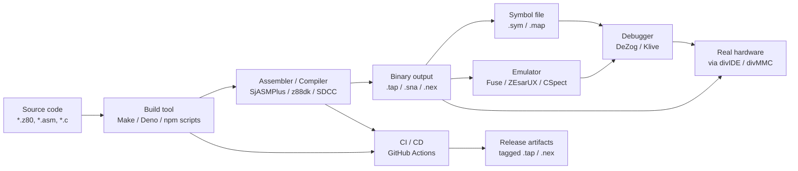

[← Home](../README.md) · [Toolchain](README.md)

# Cross-Platform Toolchain — Modern ZX Spectrum Development on PC, Mac, and Linux

> **Applies to**: All tracks. Cross-platform tools target the entire Spectrum family — **Original** 16K/48K/128K/+2/+2A/+3, **Soviet** clones (Pentagon, Scorpion, Kay, Profi), and **New Gen** hardware including the ZX Spectrum Next (Z80N, `.nex` output). Host platforms: Windows, macOS, Linux, and (for some tools) FreeBSD and Raspberry Pi. For the era when development happened *on the Spectrum itself*, see [Native Toolchain](native_toolchain.md).

---

## Overview

Modern ZX Spectrum development happens on the machine on your desk, not on the machine you are targeting. A 2025 developer writes Z80 source in **Visual Studio Code**, assembles it with **SjASMPlus**, tests it in **Fuse** or **ZEsarUX**, optionally targets the **ZX Spectrum Next** with **Z80N** extensions, ships the result as a `.tap` or `.sna` or `.nex` file, and never touches a real Spectrum during development unless they want to.

This workflow displaced native development between **1993 and 2000** in the West and between **2000 and 2010** in the former Soviet scene. The transition was driven by three forces:

- **Hardware scarcity**: original Spectrums and their CRTs are aging, scarce, and increasingly expensive. Soviet clones (Pentagon, Scorpion) are even harder to find working examples of in 2025.
- **Editor productivity**: modern editors (VS Code, Sublime, Vim) provide syntax highlighting, jump-to-definition, autocomplete, linting, and split views that no native Spectrum editor could match.
- **Process modernization**: version control (Git), continuous integration (GitHub Actions), automated testing, and project hosting (GitHub) simply cannot exist on a 1980s 8-bit machine.

The cost of the transition was the loss of **instant on-hardware feedback**. The native-era developer pressed a key and watched the program execute on the exact hardware it would ship on. The modern developer runs the program in an emulator and trusts that the emulator is accurate enough — and learns to test on real hardware before shipping.

This article surveys the modern cross-platform toolchain: assemblers, C compilers, IDEs, emulators, build systems, testing frameworks, and asset tools. It ends with a recommended setup for common project types.

### What Was Gained and Lost

| Aspect | Native (pre-1995) | Cross-Platform (2025) |
|---|---|---|
| **Edit-assemble-test loop** | Seconds (disk) to minutes (tape) | Milliseconds to seconds |
| **Hardware accuracy** | Exact — runs on real thing | Requires emulator; emulator accuracy varies |
| **Editor features** | Full-screen text editor | Syntax highlight, autocomplete, jump-to-def, linting |
| **Source control** | Manual tape/disk backups | Git, GitHub, branches, pull requests |
| **Testing** | Manual play-through | Automated unit tests via emulator scripting |
| **Project scale** | Single-file sources up to 64 KB | Multi-file projects unlimited size |
| **Collaboration** | One developer, one machine | Distributed teams via GitHub |
| **CI/CD** | Impossible | GitHub Actions, automated builds on every push |
| **Asset pipeline** | Hand-drawn sprites in native editors | PNG → Spectrum format conversion tools |
| **Cost to start** | Buy a Spectrum (£125 in 1982) | Use the PC you already own |

> [!NOTE]
> The native vs cross-platform question is no longer a real choice for new Spectrum development. Cross-platform tools are universally faster, easier, and more capable. Native development survives only in hobbyist and historical-authenticity niches (see the sibling article's "Why Native Tools Still Matter" section). This article focuses on the modern cross-platform toolchain.

---

## Why Cross-Platform Won

The displacement of native Spectrum development by cross-platform workflows was driven by four reinforcing factors.

### Hardware Reality

Original ZX Spectrums are 40+ years old in 2025. The ULA chips are failing, the membranes are unreliable, the CRTs (when used) are dying. Soviet clones are in even worse shape — most were hand-soldered in the 1990s and have not aged well. A modern developer who wants to actually run code on real hardware must either maintain aging equipment (expensive, time-consuming) or use modern recreations (Harlequin, ZXUno, ZX Spectrum Next — still expensive and scarce).

Cross-platform development plus emulator testing avoids the hardware problem entirely. When ready to test on real hardware, the developer transfers the assembled binary to a real Spectrum via **divIDE** or **divMMC** SD-card interfaces.

### Editor Productivity

A modern programmer's editor (VS Code being the dominant choice in 2025) provides:

- **Syntax highlighting** for Z80 assembly (via extensions)
- **Jump-to-definition** across multiple source files
- **Rename refactoring** of labels and symbols
- **Autocomplete** of mnemonics, labels, and macro parameters
- **Inline error reporting** from the assembler ("problem matcher")
- **T-state meter** showing cycle counts inline
- **Integrated debugging** via DeZog or Klive

None of this is possible on a native Spectrum editor. The productivity multiplier is estimated at **5–10×** for typical assembly work — and grows with project size.

### Process Modernization

Modern software development practice — Git version control, GitHub hosting, code review via pull requests, automated CI builds, issue tracking — does not exist on native Spectrum hardware. A 2025 cross-platform project can:

- Push a commit to GitHub
- Trigger a GitHub Actions workflow that assembles the source on Linux/macOS/Windows
- Run automated regression tests
- Publish a downloadable `.tap` file as a build artifact
- Notify collaborators of the result

This workflow is simply impossible in the native model. For any project larger than a single-file demo, the cross-platform workflow is the only one that scales.

### Performance

Assembling a 100 KB Z80 source file takes SjASMPlus **2–3 seconds** on a modern PC. The same assembly on a real Spectrum takes **minutes** — sometimes tens of minutes for large sources. The 1000× speed advantage is decisive for iterative development.

### When Native Still Wins

Cross-platform loses on three counts:

1. **Cycle-exact timing analysis**: emulators approximate but do not perfectly reproduce contention, floating bus, and per-cycle video beam behavior. For the most timing-sensitive demos, native hardware observation is irreplaceable.
2. **Peripheral testing**: real joystick, real Kempston mouse, real audio output through the AY chip — these require real hardware.
3. **Demoscene purity**: some compos require development on original hardware as an artistic constraint.

For all other use cases — including nearly all modern game development, educational projects, and most demoscene work — cross-platform is the right choice.

---

## The Modern Pipeline Overview

A modern Spectrum project has the same basic shape regardless of tool choice: write source, build, test, ship. The tools vary but the pipeline is stable.

### Pipeline Diagram



### The Three Primary Outputs

| Format | Use Case | Tool Support |
|---|---|---|
| **`.tap`** (tape image) | Loading via emulated tape; broadest compatibility; smallest payload for 48K | SjASMPlus `SAVETAP`, z88dk default, Pasmo |
| **`.sna` / `.szx`** (snapshot) | Instant-load state for development; preserves RAM contents | SjASMPlus `SAVESNA`, Fuse native format |
| **`.nex`** (Next executable) | ZX Spectrum Next only; supports banked loading and machine config | SjASMPlus `SAVENEX`, Zeus 4 |

The **`.tap`** format remains the universal interchange format for classic 48K/128K targets. **`.nex`** is the modern equivalent for the ZX Spectrum Next.

### The Build Tool Role

The build tool orchestrates the pipeline. Its jobs:

1. **Assemble** the source (call the assembler with the right flags)
2. **Export symbols** (for the debugger to use)
3. **Launch the emulator** with the assembled binary (optional, for testing)
4. **Run automated tests** (assertions via emulator scripting)
5. **Package the release** (`.tap` file plus any documentation)

Build tools in active use: **Make** (classic, ubiquitous), **Deno task graph** (modern JS-based, used by dysphoria.net), **npm scripts** (Node ecosystem), **CMake** (popular when assembler is C-based and packaged for Linux distros).

---

## Cross-Platform Assemblers Survey

The cross-platform assembler landscape is dominated by **SjASMPlus** as the primary recommendation, with a long tail of alternatives serving different niches.

### SjASMPlus (Primary Recommendation)

**SjASMPlus** is the de facto standard cross-assembler for modern ZX Spectrum development. Originally based on SjASM by Aprisobal, it is now maintained by **z00m128** on GitHub under a BSD license.

Key features:

- **3-pass design**: forward references resolved reliably
- **Lua scripting engine**: generate tables, compute constants, even write parts of the source programmatically
- **Full instruction set support**: documented and undocumented Z80, R800, **Z80N** (ZX Spectrum Next), i8080, LR35902 (Game Boy)
- **Comprehensive Spectrum directives**: `SAVESNA`, `SAVETAP`, `SAVEHOB`, `INCTRD`, `SAVEHOB` for TR-DOS, `SAVENEX` for Next
- **Virtual device mode**: `DEVICE ZXSPECTRUM128`, `DEVICE NEX`, `DEVICE AMSTRADCPC464` — bounds-check memory accesses against the target machine
- **Macro language with defines, struct support, conditional assembly, block repeating**
- **Extremely fast**: 1 million lines assembled in 2–3 seconds on modern hardware
- **Cross-platform**: Linux, macOS, Windows, Raspberry Pi, BSD
- **512+ automated tests** in CI (which double as usage examples)
- **Active maintenance**: regular releases through 2025

Example SjASMPlus source:

```z80
    DEVICE ZXSPECTRUM128        ; target 128K Spectrum
    ORG #8000                   ; entry point
Start:
    LD  HL, Message
    CALL PrintString
    RET

Message:
    DB  "Hello, World!", 0

    SAVESNA "hello.sna", Start  ; produce snapshot
    SAVETAP "hello.tap", Start  ; produce tape image
```

### Pasmo (Beginner-Friendly Alternative)

**Pasmo** is a deliberately minimal Z80 cross-assembler written in C++ by Julián Albo. Its strengths are simplicity and portability: a single C++ source file compiles on virtually any platform with any C++ compiler. Pasmo is the right choice for:

- **Learning Z80**: no macro language to learn, just mnemonics
- **Quick projects**: single-file sources where SjASMPlus's power is overkill
- **Environments where SjASMPlus cannot easily build**: Pasmo has no dependencies beyond a C++ compiler

Pasmo's limitations: no Z80N support, no Lua scripting, limited output formats (raw binary and `.tap` only), no `DEVICE` virtual machine mode.

### z88dk-z80asm (z88dk Toolchain Component)

**z88dk-z80asm** is the assembler component of the z88dk C development toolkit. It is a capable standalone assembler but is designed primarily as the backend for z88dk's C compiler. Distinctive features:

- **Sections and BSS management**: proper separation of code, initialized data, and uninitialized data
- **`PHASE` / `DEPHASE`**: assemble code at one address but execute at another (essential for ROM cartridges, bank-switched code)
- **Multi-chip support**: Z80, Z180, Z80N — designed for the z88dk multi-target universe
- **Linker and librarian**: multi-object linking, library archives

> [!WARNING]
> **z88dk-z80asm is not the same project as z88dk itself.** z88dk is the full C toolkit (compiler + assembler + linker + libraries); z88dk-z80asm is just the assembler binary within it. Both are covered in [z88dk.md](z88dk.md) (planned). Do not confuse this with **z80asm** (different author, different project).

### vasm (Portable Retargetable)

**vasm** is Dr. Volker Barthelmann's portable retargetable assembler, hosted at `sun.hasenbraten.de/vasm`. It supports multiple CPU backends (Z80 among them) and multiple syntax modules (Motorola, Madmac, oldstyle). Its strengths:

- **Linkable object files**: assemble to `.o`, link later — supports multi-source-file projects with a separate link step
- **Multi-CPU**: the same toolchain handles 6502, 68000, ARM, and Z80 — useful for developers working across retro platforms
- **Mature and stable**: long development history, conservative evolution

vasm is the right choice for developers already using it for other retro platforms or who need its specific linker-based workflow.

### WLA-DX (Multi-Architecture)

**WLA-DX** is a development system supporting a wide range of 8/16-bit CPUs: 6502, 6800, 68000, Z80, GB-Z80 (Game Boy), SPC700 (SNES audio), HUC6280 (PC Engine), and SuperFX. Its strengths:

- **Same toolchain for many platforms**: a developer working on Game Boy, NES, SNES, and Spectrum projects can use one assembler
- **Linker-based**: WLA-DX produces linkable objects that the `wlalink` linker combines into the final binary
- **Active maintenance**: regular updates through 2025

WLA-DX is the right choice for developers working across multiple retro platforms.

### zmac (George Phillips)

**zmac** is a Z-80 macro cross-assembler maintained by George Phillips. Its strengths:

- **Trivially buildable**: full C source, compiles anywhere with a C compiler
- **Simple and reliable**: decades of bug-fix history, conservative behavior
- **`.tzx` and `.tap` output**: Spectrum-friendly defaults

zmac is the right choice for developers who want a stable, no-surprises assembler with the smallest possible toolchain footprint.

### RASM (Edouard Berge)

**RASM** is a fast French Z80 assembler with particular popularity in the French demoscene. Its strengths:

- **Very fast assembly**: competitive with SjASMPlus
- **Built-in Crunchers**: integrated support for ABP, RCS, LZ4, ZX0, ZX1, ZX2, Z80, MegaLZ — useful for size-optimized demos
- **Sprite and tile conversion**: built-in helpers for converting images to Spectrum sprite formats

RASM is particularly popular with size-coding demoscene developers.

### Minor Alternatives

- **SpectrASM**: cross-platform IDE/assembler combination, smaller user base
- **zasm-kio**: niche alternative maintained for Kay/Scorpion clone compatibility
- **tniasm**: small, fast alternative with limited feature set
- **TASM (Telemark Assembler)**: DOS-era Z80/table-driven assembler, still has users but largely superseded

### Assembler Comparison Matrix

| Feature | SjASMPlus | Pasmo | z88dk-z80asm | vasm | WLA-DX | zmac | RASM |
|---|---|---|---|---|---|---|---|
| **Z80 documented** | ✅ | ✅ | ✅ | ✅ | ✅ | ✅ | ✅ |
| **Z80 undocumented** | ✅ | ❌ | ✅ | ⚠️ | ✅ | ✅ | ✅ |
| **Z80N (Next)** | ✅ | ❌ | ✅ | ❌ | ❌ | ❌ | ❌ |
| **i8080** | ✅ | ❌ | ✅ | ❌ | ❌ | ❌ | ❌ |
| **LR35902 (GB)** | ✅ | ❌ | ✅ | ❌ | ✅ | ❌ | ❌ |
| **Macros** | ✅ | ❌ | ✅ | ✅ | ✅ | ✅ | ✅ |
| **Lua scripting** | ✅ | ❌ | ❌ | ❌ | ❌ | ❌ | ❌ |
| **Linker (multi-object)** | ⚠️ | ❌ | ✅ | ✅ | ✅ | ❌ | ❌ |
| **Sections / BSS** | ⚠️ | ❌ | ✅ | ✅ | ✅ | ❌ | ❌ |
| **`.tap` output** | ✅ | ✅ | ✅ | ⚠️ | ⚠️ | ✅ | ✅ |
| **`.sna` output** | ✅ | ❌ | ⚠️ | ❌ | ❌ | ❌ | ⚠️ |
| **`.nex` (Next) output** | ✅ | ❌ | ✅ | ❌ | ❌ | ❌ | ❌ |
| **TR-DOS (`SAVEHOB`, `INCTRD`)** | ✅ | ❌ | ❌ | ❌ | ❌ | ❌ | ❌ |
| **DEVICE virtual machine** | ✅ | ❌ | ⚠️ | ❌ | ❌ | ❌ | ❌ |
| **Integrated crunchers** | ❌ | ❌ | ❌ | ❌ | ❌ | ❌ | ✅ |
| **License** | BSD | GPL | GPL | MPL | GPL | GPL | GPL |
| **Active maintenance (2025)** | ✅ | ⚠️ | ✅ | ✅ | ✅ | ⚠️ | ⚠️ |
| **Typical use case** | Modern Spectrum dev | Learning Z80 | z88dk backend | Multi-CPU retro | Multi-platform retro | Minimal toolchain | French demoscene |

> [!TIP]
> **For new projects, choose SjASMPlus.** It has the best combination of features, performance, active maintenance, and community support. Pick one of the alternatives only if you have a specific reason (existing multi-platform toolchain, learning Z80 with minimal tools, etc.).

---

## C Compilers and High-Level Languages

Some developers prefer a high-level language to assembly. The Spectrum ecosystem has two serious C toolchains and several higher-level alternatives.

### z88dk (The Only Serious C Toolkit)

**z88dk** is the only C development kit that comes ready out-of-the-box to target the ZX Spectrum. Started in 1998/1999 to enable a TCP stack for the Cambridge Z88, it has grown into a comprehensive toolkit:

- **100+ Z80-family targets**: not just the ZX Spectrum, but also the Cambridge Z88, CP/M machines, MSX, Amstrad CPC, Sam Coupé, Texas Instruments calculators, the ZX Spectrum Next, and dozens of others
- **250k+ lines of optimized assembly libraries**: the largest repository of Z80 assembly source code online. The C standard library is mostly handwritten assembly for performance.
- **Two C compiler backends**: the z88dk-native `sccz80` compiler and the **SDCC** (Small Device C Compiler) backend, selectable per build
- **Single-command builds**: `zcc +zx program.c -create-app` produces a ready-to-load `.tap` file
- **Active maintenance**: regular releases through 2025

Usage examples:

```bash
# Basic: compile C to .tap for 48K Spectrum
zcc +zx program.c -create-app

# Use SDCC backend for tighter code
zcc +zx program.c -create-app -compiler=sdcc

# +3 disk image instead of tape
zcc +zx program.c -create-app -subtype=plus3

# ZX Spectrum Next target with Z80N extensions
zcc +zx -clib=ndos program.c -create-app -subtype=nex
```

### SDCC (Small Device C Compiler)

**SDCC** is a standalone optimizing C compiler supporting several 8-bit CPUs including Z80, Z180, Rabbit 2000/3000, and others. For Spectrum development, SDCC is most commonly used **through the z88dk wrapper** — which provides the Spectrum-specific runtime, libraries, and build automation. Using SDCC standalone requires the developer to handle all of this manually.

Key SDCC features:

- **Aggressive optimization**: SDCC is known for producing tighter code than `sccz80` for many constructs
- **Standards compliance**: closer to ANSI C than `sccz80`'s dialect
- **Active research**: regular releases incorporating new optimization techniques

### Boriel ZX BASIC (Modern BASIC Compiler)

**Boriel ZX BASIC** is a modern BASIC dialect compiler that targets Z80 and specifically the ZX Spectrum. For developers who want **BASIC syntax with modern tooling**, this is the recommended choice.

Key features:

- **FreeBASIC/QBASIC-inspired syntax**: familiar to anyone who used 1990s BASIC dialects
- **Compiles to native Z80**: not interpreted like Sinclair BASIC — produces machine code binaries
- **Type system**: typed variables, structs, arrays, far more capable than Sinclair BASIC
- **Active maintenance**: regular releases through 2025

```basic
REM Boriel ZX BASIC example
DIM x AS UBYTE = 5
DIM name$ AS STRING * 16 = "Hello"
PRINT name$; " "; x
DO
  PAUSE 0
LOOP UNTIL INKEY$ = " "
```

### Turbo Rascal (Pascal-like)

**Turbo Rascal** is a Pascal-inspired language originally targeting the Commodore 64, with later ZX Spectrum support. It is particularly popular in the educational retro-dev community for teaching structured programming concepts on 8-bit platforms.

### When to Use C vs Assembly

| Criterion | C (z88dk/SDCC) | Assembly (SjASMPlus) |
|---|---|---|
| **Project size** | >4 KB | Any size |
| **Development speed** | Faster (high-level constructs) | Slower (per-instruction) |
| **Runtime performance** | Good but not optimal | Optimal (manual cycle counting) |
| **Code size** | Larger (compiler overhead) | Smaller |
| **Portability** | Easy to retarget to other Z80 platforms | Manual rewrite |
| **Programmer skill floor** | Lower (knows C) | Higher (knows Z80) |
| **Best for** | Games, applications, anything >4 KB | Demos, interrupts, very small code (≤4 KB) |

> [!TIP]
> **Rule of thumb**: if the project will exceed 4 KB of binary size, consider z88dk C. Below that threshold, assembly is usually simpler. The 4 KB boundary is where the C runtime overhead becomes a small enough fraction to be worth the productivity gain.

---

## IDEs and Editor Integration

Modern Spectrum development is dominated by **Visual Studio Code** as the editor of choice, with several specialized extensions. Two integrated IDEs (DeZog, Klive) provide tighter round-trip debugging.

### VS Code Ecosystem (Dominant in 2025)

The following VS Code extensions are recommended for Spectrum development:

#### Z80 Macro-Assembler (Martin Bórik)

The **Z80 Macro-Assembler** extension provides:

- **Syntax highlighting** for SjASMPlus, z88dk-z80asm, and other Z80 assemblers
- **Jump-to-definition** for labels and symbols across multiple source files
- **Rename refactoring** of labels
- **Autocomplete** of mnemonics, labels, and macro parameters
- **Problem matcher**: parses assembler output and shows errors inline in the editor
- **Macro documentation** on hover

This is the foundational extension for any VS Code-based Spectrum development workflow.

#### Z80 Assembly Meter (Néstor Sancho)

The **Z80 Assembly Meter** extension shows **T-state counts** in the VS Code status bar for the currently-selected instruction. Invaluable for:

- Performance tuning (will this loop fit in one frame?)
- Cycle counting for timing-sensitive routines (raster sync, audio drivers)
- Comparing two implementation approaches for a hot path

The meter handles documented and undocumented Z80, Z80N, and common SjASMPlus fake instructions (like `LD HL,DE`).

#### DeZog (Z80 Debugger for VS Code)

**DeZog** is a Z80 debugger integrated into VS Code. It supports multiple backends:

- **CSpect** emulator
- **ZEsarUX** emulator
- **MAME** (work in progress for ZX Next)
- **dzrp7800** hardware-based debuggers

DeZog provides:

- **Source-level debugging**: set breakpoints in Z80 source, step through, inspect variables
- **Memory view** in hex and ASCII
- **Register display** and edit
- **Assembly-level single-step** when source is unavailable
- **Watch expressions** for symbolic inspection
- **Unit test framework** (assembly-based tests)

DeZog is the recommended debugger for serious Spectrum development in 2025.

#### Klive IDE (Dotneteer)

**Klive IDE** is a cross-platform IDE for the Spectrum (and ZX81) built on VS Code. It integrates:

- **Emulator** (in-editor Spectrum execution)
- **Assembler** (built-in, SjASMPlus-compatible)
- **Debugger** with breakpoints, memory view, register inspection
- **Asset editors**: sprite editor, screen designer
- **Disassembler** for reverse engineering

Klive is the right choice for developers who want a single integrated environment rather than assembling VS Code extensions themselves. It runs on Windows and macOS.

### Standalone IDEs

- **ZXDevStudio** (Windows-only): older Windows IDE with integrated editor, assembler, and emulator; still used but less actively maintained than the VS Code ecosystem
- **ZX Spin** (Windows-only): an older Windows IDE/emulator combination; popular in the late 2000s but largely superseded

### Other Editors

- **Vim / Neovim**: syntax files available for SjASMPlus, z88dk-z80asm
- **Emacs**: z80-mode and asm-mode provide syntax highlighting
- **Sublime Text**: community syntax definitions
- **Kate**: SjASMPlus ships Kate syntax highlighting directly in its source distribution

### IDE Comparison Matrix

| Feature | VS Code + extensions | Klive IDE | ZXDevStudio |
|---|---|---|---|
| **Cross-platform** | ✅ (Win/Mac/Linux) | ⚠️ (Win/Mac) | ❌ (Windows only) |
| **Integrated emulator** | ❌ (via DeZog bridge) | ✅ | ✅ |
| **Source-level debugger** | ✅ (DeZog) | ✅ | ⚠️ |
| **Asset editors** | ❌ (separate tools) | ✅ (sprite, screen) | ✅ |
| **Disassembler** | ❌ (separate tool) | ✅ | ⚠️ |
| **Active maintenance** | ✅ | ✅ | ⚠️ |
| **Best for** | Power users, team projects | Integrated workflow | Legacy Windows users |

> [!TIP]
> **For new projects, use VS Code with the Z80 Macro-Assembler + Z80 Assembly Meter + DeZog extensions.** This combination is the most flexible, cross-platform, and actively maintained modern Spectrum development environment.

---

## Emulators for Development

The emulator is the cross-platform developer's *real hardware* during iteration. Choice of emulator matters because accuracy, debugging support, and scripting differ.

### Fuse (Cross-Platform, Mature)

**Fuse** (the Free Unix Spectrum Emulator) is the canonical cross-platform Spectrum emulator. Key features:

- **Cross-platform**: Linux, macOS, Windows, FreeBSD
- **All Spectrum models**: 16K, 48K, 128K, +2, +2A, +3, plus Russian clones (Pentagon, Scorpion)
- **Mature and accurate**: 20+ years of development
- **Scripting**: supports BasicLoadScript and similar automation
- ** Debugger**: built-in monitor/debugger with breakpoints, memory view, disassembly

Fuse is the recommended default emulator for non-Next development.

### ZEsarUX (ZX-Family Focus)

**ZEsarUX** is a ZX-family-focused emulator with particularly rich debugging and hardware support:

- **All Spectrum models** plus ZX-Uno, ZX Spectrum Next, Chroma 81, and other modern hardware
- **Rich debugging**: breakpoints, watchpoints, conditional traps, full register inspection
- **Reverse debugging**: step backwards through execution
- **TS-Conf and Baseconf support**: emulates the ZX Evolution's extended graphics modes
- **Cross-platform**: Linux, macOS, Windows, Raspberry Pi

ZEsarUX is recommended for serious reverse engineering work, ZX Spectrum Next development, and TS-Conf/BaseConf targets.

### CSpect (ZX Spectrum Next Specialist)

**CSpect** is a ZX Spectrum Next-focused emulator by Mike Dailly. Its strengths:

- **Most complete ZX Spectrum Next emulation**: Z80N instructions, layer 2 graphics, tile modes, sprites, expanded banking
- **Built-in debugger** with map-file support for source-level labels
- **Used by DeZog** as a debug backend

> [!WARNING]
> **CSpect has faced recent uncertainty** (community discussions in 2023-2024 raised questions about its long-term availability). New projects targeting the ZX Spectrum Next should consider MAME as a fallback — MAME's Next emulation is now considered the most accurate per the SjASMPlus documentation.

### JSSpeccy 3 (JavaScript / WASM)

**JSSpeccy 3** is a JavaScript/WebAssembly-based Spectrum emulator. Its distinctive use case is **embedding in web pages** and **integration with JS-based build pipelines**:

- Runs in any modern browser
- Embeddable in project documentation pages
- Scriptable from TypeScript/JavaScript (the [dysphoria.net](https://dysphoria.net/2025/05/18/setting-up-a-modern-zx-spectrum-toolchain-part-1-of-2/) toolchain uses JSSpeccy 3 for TypeScript-based unit testing of Z80 code)
- Cross-platform (anywhere a browser runs)

JSSpeccy 3 is the right choice for projects that need to embed a Spectrum in a web page or test Z80 code from a JavaScript/TypeScript harness.

### MAME (Multi-Purpose, Most Accurate Next)

**MAME** (Multi Arcade Machine Emulator) includes Spectrum and ZX Spectrum Next emulation. While MAME is not Spectrum-specific, its Next emulation is currently considered the most complete and accurate. MAME has a built-in debugger and is supported by DeZog for Next development.

MAME is the right choice when the primary concern is Next-emulation accuracy and CSpect is unavailable.

### Emulator Selection Guide

| Emulator | Best For | Platforms | Debugger | Next Support |
|---|---|---|---|---|
| **Fuse** | Default for classic Spectrum | Win/Mac/Linux/BSD | ✅ | ❌ |
| **ZEsarUX** | Reverse engineering, TS-Conf | Win/Mac/Linux/Pi | ✅ (rich) | ✅ |
| **CSpect** | Next development (uncertain future) | Win | ✅ | ✅ (best) |
| **JSSpeccy 3** | Web embedding, TS testing | Browser | ⚠️ | ❌ |
| **MAME** | Next fallback, accuracy | Win/Mac/Linux | ✅ | ✅ (most accurate) |

> [!NOTE]
> For deeper emulator comparison including cycle-exact accuracy analysis and FPGA implementations, see the planned [11_emulation/software/emulator_comparison.md](../11_emulation/software/emulator_comparison.md) article.

---

## Build Systems and Orchestration

The build tool orchestrates the assemble → symbol-export → test → ship pipeline. Three approaches are in active use in 2025.

### The Classic Makefile

**Make** is the default build tool for Spectrum projects. A complete minimal `Makefile`:

```makefile
# Minimal Spectrum project Makefile

ASSEMBLER = sjasmplus
EMULATOR = fuse
TARGET = hello.tap
SRC = hello.z80

$(TARGET): $(SRC)
	$(ASSEMBLER) --msg=war --outprefix=build/ $(SRC)

run: $(TARGET)
	$(EMULATOR) build/$(TARGET)

clean:
	rm -f build/*

.PHONY: run clean
```

Usage:

```bash
make           # assemble the project
make run       # assemble + launch Fuse with the .tap
make clean     # remove build artifacts
```

Make is universal, runs on every platform, and is well-understood. Its weakness is cross-platform path handling (backslashes vs forward slashes, executable extensions on Windows).

### Deno Task Graph (Modern JS-Based)

The [dysphoria.net toolchain](https://dysphoria.net/2025/05/18/setting-up-a-modern-zx-spectrum-toolchain-part-1-of-2/) uses **Deno's task system** for orchestration. Deno is a modern JavaScript/TypeScript runtime with native task dependencies. Example `deno.json`:

```json
{
  "tasks": {
    "test": {
      "command": "deno test --allow-write=testout/ --allow-read",
      "dependencies": ["assemble"]
    },
    "genfont": "deno run build/makefont.ts > generated/font.z80",
    "symtojs": "cat generated/symbols.txt | deno run --allow-env build/symbolstojs.ts > generated/symbols.ts",
    "assemble": {
      "command": "sjasmplus --msg=war --nologo --outprefix=dist/ --sym=generated/symbols.txt -Wno-fwdref root.z80 && deno task symtojs",
      "dependencies": ["genfont"]
    }
  }
}
```

Deno's strengths: native TypeScript, dependency-aware task graph, single `deno task test` to build and run all tests, integrates well with JS-based testing frameworks.

### Node / npm Scripts

Older JS-based projects use `package.json` scripts with npm. This works but lacks Deno's dependency-graph feature — every script either re-builds unconditionally or relies on external orchestration.

### CMake

**CMake** is rare for Spectrum projects themselves but useful when the assembler is C-based (SjASMPlus, Pasmo) and packaged for Linux distributions. A Linux distribution's package build chain typically expects CMake.

### Recommended Choice

For new projects:

- **Make** if the team is comfortable with classic Unix tooling — universal, well-documented
- **Deno** if the project involves TypeScript-based testing, asset generation in JS, or web embedding — modern, integrated
- **npm scripts** if the project is part of a larger JS/Node ecosystem

---

## Testing and Continuous Integration

Modern Z80 development supports testing practices that were impossible in the native era.

### Unit Testing Strategies

Three approaches are in active use:

#### 1. Emulator-Scripted Assertions

The dysphoria.net approach: write TypeScript test cases that drive JSSpeccy (or another scriptable emulator), run the assembled binary, and assert on memory/register state after execution. This allows testing Z80 code from a high-level language with rich assertion libraries.

#### 2. DeZog Assembly Tests

DeZog's test framework: write test cases in Z80 assembly, run them under the DeZog debugger, and assert via memory/register state. Tests live alongside the source code in `.asm` files. This is appropriate when tests must run in pure Z80 context.

#### 3. Snapshot Diffing

Some projects maintain reference snapshots (`.sna` files of known-good states) and diff against freshly-assembled runs. Useful for regression testing of demos and games where visual/audio output is hard to assert programmatically.

### Continuous Integration

GitHub Actions makes Z80 CI practical. A minimal `.github/workflows/build.yml`:

```yaml
name: Build
on: [push, pull_request]
jobs:
  build:
    runs-on: ubuntu-latest
    steps:
      - uses: actions/checkout@v4
      - name: Install SjASMPlus
        run: |
          sudo apt-get update
          sudo apt-get install -y sjasmplus
      - name: Assemble
        run: sjasmplus --msg=war --outprefix=build/ main.z80
      - name: Upload artifact
        uses: actions/upload-artifact@v4
        with:
          name: spectrum-build
          path: build/*.tap
```

On every push, GitHub assembles the project on a clean Linux VM and uploads the resulting `.tap` as a downloadable artifact. Failures (assembler errors) show up as red checks on the commit; the team gets pull-request-blocking regression protection for free.

### Real-World Example Structure

A typical modern Spectrum project's CI pipeline:

1. On every push: assemble, run automated tests, upload `.tap` artifact
2. On every tagged release: assemble, run full test suite, publish `.tap` to GitHub Releases
3. Nightly: rebuild and re-test against latest z88dk/SjASMPlus releases to catch upstream regressions

---

## Asset Tools

Modern Spectrum projects have access to a healthy ecosystem of asset conversion tools, far more capable than the native-era sprite editors.

### Image → Spectrum Format

| Tool | Use |
|---|---|
| **ZX Paintbrush** | Cross-platform GUI editor for Spectrum screens, attributes, fonts |
| **png2scr** | Command-line PNG → Spectrum `.scr` (48K display) converter |
| **scr2png** | Reverse: Spectrum `.scr` → PNG for screenshots |
| **GIMP with Spectrum export plugin** | Image editing in a familiar tool, export to Spectrum format |
| **SevenUp** | Sprite editor with Spectrum palette and attribute management |
| **Speccy Paint** | Pixel-level Spectrum screen editor |

A typical asset pipeline: artist creates graphics in **Aseprite** or **ProMotion NG** (with palette restricted to Spectrum colors) → exports as PNG → `png2scr` converts to `.scr` → Z80 code includes the `.scr` directly via SjASMPlus's `INCBIN` directive.

### Font Tools

Custom 8×8 fonts can be created in **ZX Paintbrush**, **Fony**, or hand-edited in binary. The resulting 768-byte font binary (96 characters × 8 bytes) can be included in Z80 source with `INCBIN`.

### Music

Modern music composition for Spectrum uses PC-based trackers that produce the same module formats as the native trackers:

- **Vortex Tracker II** — produces `.pt3` files (covered in [vortex_tracker.md](../06_sound/trackers_and_formats/vortex_tracker.md))
- **Arkos Tracker 2 / 3** — produces `.aks` / `.akg` / `.akm` files (covered in [arkos_tracker.md](../06_sound/trackers_and_formats/arkos_tracker.md))

Both produce module files that small Z80 player routines (typically 300-700 bytes) can play back at runtime. The full tracker documentation is in [06_sound/trackers_and_formats/](../06_sound/trackers_and_formats/README.md).

### Binary Asset Packers / Crunchers

For size-optimized releases (especially 1K/4K demos), binary packers compress the assembled binary:

| Packer | Algorithm | Typical Ratio |
|---|---|---|
| **ZX0** | LZ77-style, optimal | 35-50% of original |
| **ZX1** | ZX0 variant, faster depack | 35-50% of original |
| **ZX2** | newer variant | 35-50% of original |
| **MegaLZ** | LZ-style, fast depack | 40-55% of original |
| **RCS** | Resource Compression System | variable |
| **LZ4** | standard LZ4 | 45-60% of original |

The cruncher output is a compressed binary plus a tiny Z80 depacker (typically 30-100 bytes) that decompresses the data at runtime. **RASM** has integrated support for several of these; **SjASMPlus** requires a separate cruncher pass.

---

## A Modern Recommended Setup (Decision Matrix)

Different project types have different optimal toolchain setups. The table below summarizes recommendations by project type.

| Project Type | Recommended Setup |
|---|---|
| **Learning Z80 (first project)** | Pasmo + Fuse, no IDE overhead. Write source in any text editor; assemble with `pasmo --tap hello.z80 hello.tap`; load in Fuse. |
| **Modern assembly project (commercial-grade game, large demo)** | **SjASMPlus + VS Code** with Z80 Macro-Assembler + Z80 Assembly Meter extensions; **Fuse** or **ZEsarUX** for testing; **DeZog** for debugging; **Make** or **Deno** for build orchestration; **GitHub Actions** for CI. |
| **C-based project** | **z88dk** (`zcc +zx ...`) + VS Code C/C++ extension; **Fuse** for testing; (optional) SDCC backend via `-compiler=sdcc` for tighter code. |
| **ZX Spectrum Next target** | **SjASMPlus** (Z80N support, `.nex` output) + **MAME** or **ZEsarUX** for testing; **DeZog** for debugging (CSpect support uncertain). |
| **Hardware-curious / demoscene purity** | **SjASMPlus** + **real hardware via divIDE/divMMC**; cycle-count with **Z80 Assembly Meter**; test on multiple emulator implementations before hardware transfer. |
| **Modern BASIC-flavored** | **Boriel ZX BASIC** compiler + Fuse for testing; VS Code for editing. |
| **Multi-platform retro project** (Spectrum + C64 + NES) | **WLA-DX** for assembler consistency across platforms; per-platform emulators. |
| **Educational / classroom** | **z88dk C** or **Boriel ZX BASIC**; **Fuse** with integrated debugger; pre-built VM image with all tools installed. |
| **Reverse engineering** | **ZEsarUX** with reverse debugging; **DeZog** for source-level analysis (when source exists); dedicated disassembler tools (planned `disassemblers.md`). |

> [!TIP]
> **Default recommendation for new Spectrum development in 2025**: SjASMPlus + VS Code (Z80 Macro-Assembler + Z80 Assembly Meter extensions) + Fuse or ZEsarUX + DeZog for debugging + Make or Deno for build + GitHub Actions for CI. This is the most productive combination and the one used by most active modern Spectrum developers.

---

## Worked Example: Hello World

A complete minimal project demonstrating the modern cross-platform workflow.

### Source: `hello.z80` (SjASMPlus syntax)

```z80
    DEVICE ZXSPECTRUM48           ; target 48K Spectrum
    ORG #8000                     ; entry point at 32768

Start:
    ; Clear screen by setting attributes + pixels to 0
    LD  HL, #4000                 ; screen base
    LD  (HL), #56                 ; INK 7 (white) on PAPER 0 (black), bright
    LD  DE, #4001
    LD  BC, #17FF                 ; 6143 bytes
    LDIR                          ; fill screen

    ; Print "HELLO" via ROM routine
    LD  A, 2
    CALL #1601                    ; ROM: open channel 2 (upper screen)
    LD  DE, Message
    LD  BC, MessageEnd - Message
    CALL #203C                    ; ROM: PR_STRING

    ; Infinite loop
Loop:
    JR Loop

Message:
    DB  #16, 0, 0                 ; AT 0,0
    DB  "HELLO, WORLD!"
MessageEnd:

    SAVESNA "build/hello.sna", Start
    SAVETAP "build/hello.tap", Start
```

### Build: `Makefile`

```makefile
ASSEMBLER = sjasmplus
EMULATOR = fuse

build/hello.tap: hello.z80
	mkdir -p build
	$(ASSEMBLER) --msg=war --outprefix=build/ --sym=build/symbols.txt hello.z80

run: build/hello.tap
	$(EMULATOR) build/hello.sna

clean:
	rm -rf build

.PHONY: run clean
```

### VS Code: `.vscode/tasks.json`

```json
{
  "version": "2.0.0",
  "tasks": [
    {
      "label": "build",
      "type": "shell",
      "command": "make",
      "group": { "kind": "build", "isDefault": true },
      "problemMatcher": ["$sjasmplus"]
    },
    {
      "label": "run",
      "type": "shell",
      "command": "make run",
      "dependsOn": "build"
    }
  ]
}
```

With this in place:

- `Ctrl+Shift+B` builds the project (assemble to `build/hello.tap` and `build/hello.sna`)
- `make run` from the terminal launches Fuse with the snapshot
- VS Code's `problemMatcher` parses SjASMPlus errors into clickable inline diagnostics

### Expected Output

The assembled `build/hello.tap` is approximately 50-100 bytes (the binary plus a tape header). Loading it in Fuse displays a black screen with `HELLO, WORLD!` in the upper-left corner.

---

## Pitfalls

Six pitfalls catch new cross-platform Spectrum developers repeatedly.

### 1. Assembler Dialect Mismatches

SjASMPlus, Pasmo, z88dk-z80asm, vasm, and zmac all use **slightly different Z80 assembly syntax**. Common differences:

- **Label colons**: some require trailing colons (`Label:`), some make them optional, some accept both
- **Hex prefix**: `#FF` (SjASMPlus, ZX convention), `$FF` (Pasmo, WLA-DX), `0FFh` (z88dk-z80asm, traditional), `0xFF` (C-style, sometimes)
- **Expression operators**: bitwise vs boolean, modulo, exponentiation all vary
- **Macro syntax**: `MACRO`/`ENDM` vs `.macro`/`.endm`, parameter passing conventions
- **Comment characters**: `;` everywhere, but some tools also accept `//` or `#`

**Fix**: pick one assembler and stick with it. If you must mix tools, isolate the incompatible code in separately-assembled files.

### 2. Binary Format Confusion

The `.tap`, `.sna`, `.szx`, `.tzx`, `.nex`, and `.p` extensions all mean different things:

| Format | Purpose | Load Time |
|---|---|---|
| `.tap` | Tape image ( Sinclair tape protocol) | Realistic loading (slow without acceleration) |
| `.tzx` | Enhanced tape image (TZX format, supports custom loaders) | Realistic loading |
| `.sna` | Snapshot (Z80 machine state, 48K or 128K) | Instant — full state restored |
| `.szx` | Snapshot (ZX-State format, compressed) | Instant |
| `.z80` | Snapshot (Z80 emulator format) | Instant |
| `.nex` | ZX Spectrum Next executable | Instant (Next-specific) |
| `.p` | Pentagon snapshot | Instant |
| `.scr` | Raw screen memory (no program) | N/A — just pixel data |

**Fix**: use `.tap` for distribution and broad emulator compatibility; use `.sna` or `.szx` for development iteration; use `.nex` only for ZX Spectrum Next targets.

### 3. Emulator-vs-Hardware Timing

> [!WARNING]
> **Code that works in Fuse may fail on real hardware.** Emulators approximate but do not perfectly reproduce the ZX Spectrum's **contention model** (ULA's theft of bus cycles during screen draw), **floating bus** reads, and per-cycle video beam behavior. Timing-sensitive code — raster sync, multi-channel beeper music, cycle-exact effects — must be tested on real hardware before release.

**Fix**: develop in Fuse for speed, then validate on real hardware (via divIDE/divMMC) or in a more accurate emulator (ZEsarUX for contention, CSpect/MAME for Next) before shipping.

### 4. ZX Next vs Classic 48K Compatibility

Code using Z80N extensions (`LD DE,(HL+nn)`, `LD HL,(SP+nn)`, `NEXTREG`, `BRLD`, `BRRD`, etc.) **will not run on classic Spectrums**. The SjASMPlus `SAVENEX` directive produces a file that classic emulators cannot load. Conversely, classic 48K code runs fine on the Next in compatibility mode but does not benefit from any Next features.

**Fix**: explicitly decide which platform you are targeting. Use `DEVICE ZXSPECTRUM48` or `DEVICE ZXSPECTRUM128` for classic targets; `DEVICE NEX` for Next. Document the target in your project README.

### 5. z80asm vs z88dk-z80asm Confusion

There are **two unrelated projects** named z80asm:

- **z80asm** (several older standalone projects by this name)
- **z88dk-z80asm** (the assembler inside the z88dk toolkit)

They use **different syntax**, **different feature sets**, and produce **different output formats**. Documentation found online for one does not apply to the other.

**Fix**: always check which tool the documentation refers to. If you are using z88dk, you are using z88dk-z80asm — find documentation in the [z88dk wiki](https://github.com/z88dk/z88dk/wiki).

### 6. Symbol File Path Issues in VS Code

The **Z80 Macro-Assembler** VS Code extension needs the symbol file location configured correctly to enable jump-to-definition and autocomplete across files. By default, the extension looks for symbols in the same directory as the source; if your build emits symbols elsewhere (e.g., `build/symbols.txt`), the extension will not find them.

**Fix**: configure the extension's `z80-macro-assembler.symbolsFile` setting (or similar — check the current extension docs) to point at the actual symbol file location produced by your build.

---

## Cross-References

- [Native Toolchain](native_toolchain.md) — the sibling article covering pre-cross-platform Spectrum development
- [Tracker History](../06_sound/trackers_and_formats/tracker_history.md) — modern AY music composition with cross-platform trackers
- [Vortex Tracker II](../06_sound/trackers_and_formats/vortex_tracker.md) — produces `.pt3` files playable by any Spectrum program
- [Arkos Tracker](../06_sound/trackers_and_formats/arkos_tracker.md) — produces `.aks`/`.akg`/`.akm` files for modern embedded use
- [PT3 Format](../06_sound/trackers_and_formats/pt3_format.md) — the format VTII produces; embedded in Z80 programs
- [Assembly Development](../05_development/02_assembly/README.md) — programming concepts the cross-platform toolchain supports

Planned per-tool deep-dives (separate articles in this directory):

- `sjasmplus.md` — the recommended cross-assembler in detail
- `z88dk.md` — the C toolkit in depth
- `sdcc.md` — SDCC backend for Z80
- `vscode_integration.md` — VS Code Z80 extensions in depth
- `zdevstudio.md`, `zxdstudio.md`, `zx_spin.md` — standalone IDEs
- `asset_tools.md` — image/font/sprite/music asset pipeline
- `makefiles.md` — build orchestration patterns
- `debugging.md` — debugging strategies in detail
- `testing.md` — automated testing for Z80

Planned emulator deep-dives in `11_emulation/software/`:

- [`fuse.md`](../11_emulation/software/fuse.md), [`zesarux.md`](../11_emulation/software/zesarux.md), [`cspect.md`](../11_emulation/software/cspect.md), [`emulator_comparison.md`](../11_emulation/software/emulator_comparison.md)

## References

- [Setting Up a Modern ZX Spectrum Toolchain, Part 1](https://dysphoria.net/2025/05/18/setting-up-a-modern-zx-spectrum-toolchain-part-1-of-2/) — Andrew's reference 2025 toolchain using SjASMPlus + VS Code + JSSpeccy 3 + Deno
- [Setting Up a Modern ZX Spectrum Toolchain, Part 2](https://dysphoria.net/) — TypeScript-based Z80 unit testing approach
- [z88dk.org](https://z88dk.org/site/) — official z88dk documentation
- [z88dk on GitHub](https://github.com/z88dk/z88dk) — source, issues, releases
- [SjASMPlus on GitHub](https://github.com/z00m128/sjasmplus) — source, releases, documentation
- [Boriel ZX BASIC Compiler](https://www.boriel.com/post/the-zx-basic-compiler) — official site
- [Klive IDE on GitHub](https://github.com/Dotneteer/kliveide) — source and documentation
- [Klive IDE documentation](https://dotneteer.github.io/kliveide/) — user guide
- [Break Into Program — ZX Spectrum development with modern tools](http://www.breakintoprogram.co.uk/software_development/zx-spectrum-development-with-modern-tools) — Dean Belfield's reference toolchain guide
- [A Tour of Z80 Cross-Assemblers — Bumbershoot Software](https://bumbershootsoft.wordpress.com/2025/03/15/a-tour-of-z80-cross-assemblers/) — comparative review of cross-assemblers
- [Stack Overflow: Favourite ZX Spectrum development tools](https://stackoverflow.com/questions/77507/what-are-your-favourite-zx-spectrum-development-tools) — community discussion (archived)
- [Creating Future — ZX Spectrum Assembly Programming](https://www.creatingfuture.eu/2022/04/12/zx-spectrum-assembly-programming/) — modern tool survey
- [SDCC homepage](https://sdcc.sourceforge.net/) — Small Device C Compiler
- [vasm homepage](http://sun.hasenbraten.de/vasm/) — portable retargetable assembler
- [WLA-DX on GitHub](https://github.com/vhelin/wla-dx) — multi-architecture assembler/linker
- [Pasmo homepage](https://www.nongnu.org/pasmo/) — minimal Z80 cross-assembler
