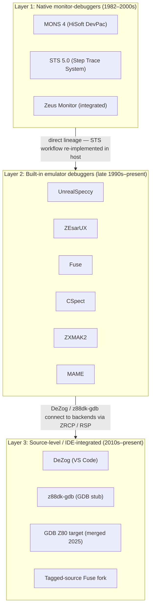
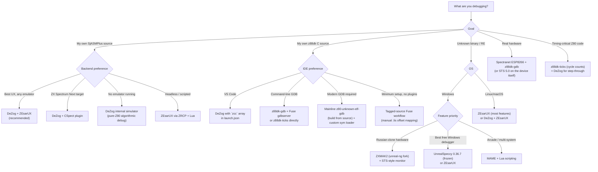

[← Toolchain](README.md) · [← Cross-Platform Toolchain](cross_platform_toolchain.md)

# Debugging

ZX Spectrum debugging spans three eras and three distinct layers: the **native monitor-debugger** tradition of the 1980s–1990s (MONS, STS, Zeus Monitor), the **built-in emulator debuggers** that replaced them in the late 1990s and 2000s (UnrealSpeccy, ZEsarUX, Fuse, CSpect, ZXMAK2, MAME), and the **modern source-level debuggers** that integrate with VS Code, GDB, and SjASMPlus / z88dk source files (DeZog, z88dk-gdb, tagged-source Fuse fork, mainline GDB with Z80 target).

This article is the canonical reference across all three layers. It is structured so you can find the right tool for your task quickly, with the comparison matrices and decision tree near the end. The compiler-integration section is the explicit bridge to [sjasmplus.md](sjasmplus.md) and [z88dk.md](z88dk.md) — both assemblers emit debug metadata in formats designed to be consumed by the tools documented here.

> [!TIP]
> **Are you looking for the SLD (Source-Level Debug) data emitted by SjASMPlus?** Jump to [DeZog deep dive](#dezog--the-modern-source-level-debugger) and [Compiler integration](#compiler-integration--producing-debug-metadata). The `.sld.txt` file produced by `sjasmplus --sld --fullpath` is consumed by DeZog to provide step-through-Z80-source debugging inside VS Code.
>
> **Are you looking for the `.lis` listing files and `z88dk-gdb` tool from z88dk?** Jump to [GDB-based Debuggers and the GDB Z80 Target](#gdb-based-debuggers-and-the-gdb-z80-target) and [Compiler integration](#compiler-integration--producing-debug-metadata).

---

## The Three-Layer Model



**Layer 1 (native monitor-debuggers)** ran on the Spectrum itself, occupying target-program memory and communicating with the developer via the Spectrum's own keyboard and screen. STS 5.0's 19-byte resident and window-panel UI made it the best-in-class monitor of the native era.

**Layer 2 (emulator debuggers)** moved the monitor into the host PC, gaining unlimited breakpoints, conditional expressions, memory-access watchpoints, and reverse debugging — features impossible in a 19-byte resident. UnrealSpeccy (0.36.7, ~2008) is the direct spiritual successor to STS; ZEsarUX, Fuse, CSpect, ZXMAK2, and MAME all followed with their own debugger implementations.

**Layer 3 (source-level / IDE-integrated)** brings debugging into modern development environments. DeZog (a VS Code extension) is the dominant choice; z88dk-gdb uses the GDB Remote Serial Protocol to bring true GDB semantics to Z80; GDB itself gained official Z80 target support in 2025.

The three layers are not mutually exclusive — DeZog, for example, is simultaneously layer 2 (it embeds its own Z80 simulator) and layer 3 (it drives VS Code's debug UI), and it can connect to any layer-2 emulator backend via ZRCP (ZEsarUX), CSpect's plugin API, or MAME's debug socket.

---

## Common Concepts

Before surveying the tools, it is worth defining the vocabulary that all three layers share — and noting where they differ.

### Breakpoints

A **breakpoint** stops execution when the program counter reaches a specified address. There are several flavors:

| Type | What it catches | Layer 1 (STS) | Layer 2 (ZEsarUX et al.) | Layer 3 (DeZog) |
|---|---|---|---|---|
| **Execution** (`br`) | opcode fetch at address | ✅ 1 at a time (`W`) | ✅ unlimited | ✅ unlimited |
| **Memory read** (`br read`) | memory load at address | ❌ | ✅ (Fuse, ZEsarUX, UnrealSpeccy) | ✅ (via emulator) |
| **Memory write** (`br write`) | memory store at address | ❌ | ✅ (Fuse, ZEsarUX, UnrealSpeccy) | ✅ (via emulator) |
| **Port read** (`br port read`) | `IN r,(C)` / `IN A,(n)` | ❌ | ✅ (Fuse, ZEsarUX) | ⚠️ (depends on backend) |
| **Port write** (`br port write`) | `OUT (n),r` / `OUT (C),r` | ❌ | ✅ (Fuse, ZEsarUX) | ⚠️ (depends on backend) |
| **Time** (`br time`) | N t-states after frame start | ❌ | ✅ (Fuse) | ⚠️ |
| **Event** (`br event`) | disk-interface page-in, tape start, RZX end | ❌ | ✅ (Fuse, ZEsarUX) | ⚠️ |
| **Conditional** (`if condition`) | break only when expression true | ❌ | ✅ C-like syntax | ✅ (DeZog expression language) |

Layer-1 breakpoints are limited because the resident is 19 bytes — only one trap can be patched in at a time. Layer-2 and layer-3 debuggers face no such constraint because the breakpoint machinery lives in the host, not in target memory.

### Watchpoints and watches

A **watchpoint** halts execution when a memory location or expression changes value. A **watch** is a passive observation — a value displayed in a side panel without halting.

Layer 1 has neither (the resident cannot observe without breaking). Layer 2 has both, typically with C-like expression syntax: `(out & 0FF)==0FD && (val&7)==3`. Layer 3 exposes watches via VS Code's standard Watch panel; watchpoints depend on the backend emulator.

### Step variants

| Variant | Behavior | STS key | ZEsarUX | DeZog (VS Code) |
|---|---|---|---|---|
| **Step into** | execute one instruction; descend into `CALL` | `SS+Z` | `F7` | F11 |
| **Step over** | if `CALL`, set temp breakpoint at return; run subroutine at full speed | `SS+X` (v5.0+) | `F8` | F10 |
| **Step out** | run until current subroutine returns | ❌ | ⚠️ | Shift+F11 |
| **Skip instruction** | advance PC without executing (RAM only) | `SS+T` | ❌ | ❌ |
| **Trace** | continuous step-into with optional screen refresh | `T` | ⚠️ | ❌ |
| **Step back** | reverse-execute one instruction (requires history) | ❌ | ✅ | ✅ |
| **Reverse continue** | run backward until a breakpoint | ❌ | ✅ | ✅ |

Step-over is the most useful single-step variant — it lets you skip library routines and well-tested subroutines. Step-back and reverse-continue are layer-2/3 features made possible by emulator CPU-history buffers (ZEsarUX CPU History, DeZog reverse-fifo); they are impossible on real Z80 hardware.

### Register and memory inspection

Every debugger displays the Z80 register file: AF, BC, DE, HL, IX, IY, SP, PC, I, R, plus the alternate set AF', BC', DE', HL'. STS uniquely tracks the **R refresh register** in real time — important for programs that use `LD A,R` / `LD R,A` for timing-sensitive code.

Memory inspection differs in scope:

- **Layer 1**: only the currently-visible 16 KB bank of the 128K address space (STS is the exception — it can display all 8 banks via the `[B]` command).
- **Layer 2**: the full 64 KB address space, plus all paged banks of any 128K / +2A / +3 / Pentagon / Next memory model.
- **Layer 3**: same as layer 2 (DeZog delegates to its emulator backend); plus memory pointed to by HL, DE, etc. is shown automatically next to those registers in VS Code's variable view.

### Symbol / label integration

A debugger that knows your source-level labels (function names, variable names, jump targets) is dramatically more useful than one that shows bare hex addresses. The integration path differs by layer:

| Layer | How labels reach the debugger |
|---|---|
| **STS 5.0** | Reads the ALASM 3.5 symbol-table directly from target memory (in-page 7) |
| **UnrealSpeccy** | Loads XAS7, ALASM 4.42–5.0x, or ALASM+STS label tables via `Ctrl-A` |
| **ZEsarUX** | Loads `.sym` / `.lbl` / `.map` files via the debugger's `load symbols` command |
| **Fuse** | Loads `.map` files; the tagged-source fork also loads a `.lis`-derived tagged listing |
| **DeZog** | Reads `.sld` (SjASMPlus), `.list` (z80asm), `.map` (z88dk), or `.lbl` (snapshot) — multi-format |
| **z88dk-gdb** | Reads the `.map` produced by `zcc -m`; source-level via `.lis` files |
| **GDB (official, 2025+ Z80 target)** | Reads ELF/DWARF debug info, or `.map` / `.sym` for stripped binaries |

The compiler-integration section below documents exactly how to make SjASMPlus and z88dk emit the right files.

---

## Layer 1 — Native Monitor-Debuggers

The native monitor-debuggers ran on the Spectrum itself: the developer loaded the program, loaded the monitor, set a breakpoint, and let the monitor catch execution and redisplay registers + memory. The 1980s produced a handful of competing monitors; the 1990s Russian scene produced STS, which dominated.

### The major native monitors

| Monitor | Year | Origin | Notes |
|---|---|---|---|
| **MONS 4** (HiSoft DevPac) | 1983–1988 | UK (HiSoft) | Canonical commercial monitor of the Western 48K era. Separate program from GENS assembler. ~1 KB resident. |
| **MON 2** | early 1990s | Russia (port) | A port of a Western monitor; limited multi-bank support. |
| **FOXMON 128** | early 1990s | Russia (Fox) | 128K-aware; basic window-panel UI. |
| **ADM 7.08** | early 1990s | Russia | Compact monitor with limited disassembly. |
| **STS 5.0** | 1995–1996 | Russia (Kharkov, StALKER / Dmitry Partsyrny) | **Best-in-class native monitor.** 19-byte resident, full disassembler with undocumented opcodes, all 8 RAM banks visible, 4 step variants, ALASM 3.5 label integration, NMI button support. |
| **Zeus Monitor** | 1983, refined through 2010s | UK (Steve Smith) | Unique among major assemblers: the monitor is integrated into the Zeus assembler — assemble, drop into monitor, return to editor at exact line being debugged. |

### Why STS was best-in-class

STS surpassed every other native monitor-debugger of its era on five axes:

1. **Tiny footprint** — 19 bytes in target memory vs 512 B–1 KB for competitors.
2. **Symbolic debugging** — read ALASM 3.5's label table directly to display source-level labels (unique among native monitors).
3. **Multi-bank visibility** — display any of the 8 RAM pages of the 128K address space, not just the currently-paged one.
4. **Step variants** — four distinct single-step modes: step-into (`SS+Z`), step-over (`SS+X`), skip-instruction (`SS+T`), continuous trace (`T`).
5. **Undocumented opcodes** — disassembler correctly emitted `SLL`, `LD A,F`, etc., critical for demoscene work.

### Hardware-assisted debugging: the NMI button

The Scorpion ZS-256 shipped with a physical **Magic Button** wired to the Z80's NMI line. Combined with STS's NMI handler, this gave Russian-scene developers a **hardware breakpoint anywhere in any program** — including inside crashed programs, interrupt handlers, and timing-critical loops. This was the 1980s equivalent of today's In-Circuit Emulator (ICE) debugging, and directly enabled the Russian scene's strong reverse-engineering tradition (cracktros, training menus, game modifications).

> [!NOTE]
> **For the full STS 5.0 reference** — including the breakpoint trap mechanism with code examples, the 6×8 font, the window-panel UI, the paging-port decoding scheme, the TR-DOS @-function disk access, the label-table bridge to ALASM 3.5, the step-variant comparison table, and the full STS-vs-MONS-vs-Zeus capability matrix — see [native_toolchain.md § The STS Tradition](native_toolchain.md#the-sts-tradition-russian). That article also documents the **post-native lineage**: how UnrealSpeccy, ZEsarUX, and other emulator debuggers are direct spiritual successors to STS, often written as deliberate re-creations of its workflow.

### When native monitors still matter

For modern development, native monitor-debuggers are primarily of historical interest. The practical work happens in emulator debuggers (layer 2) and source-level debuggers (layer 3). However, native monitors remain useful for:

- **Real-hardware development** on original Spectrum, Pentagon, or Scorpion — where no host debugger is available
- **Debugging timing-critical code** where emulator timing differs from real hardware
- **Hardware/peripheral driver development** that depends on real bus behavior
- **Historical study** of 1980s–1990s commercial software

---

## Layer 2 — Built-in Emulator Debuggers

When development migrated from real hardware to PC emulators in the late 1990s, the STS tradition did not die — it moved into the host. The first generation of Windows-based Spectrum emulators was written by the same developers (and the same audience) who had built the native assemblers and monitors. Their built-in debuggers are direct descendants of STS, often written as deliberate re-creations of its workflow with features STS could never offer because it had to fit in a 19-byte resident.

### ZEsarUX (Cesar Hernandez Bano)

**ZEsarUX** (ZX Second-Emulator And Released for UniX) is the most feature-complete debugger-emulator of the modern era. Created by **Cesar Hernandez Bano**, it is a cross-platform (Linux, macOS, Windows, FreeBSD, Haiku, Raspberry Pi) emulator for the entire Sinclair range and many related machines (Spectrum 16K through +3, Pentagon, Chloe, Prism, Chrome, ZX-Uno, ZX Spectrum Next, Sam Coupé, ZX80, ZX81, QL, Z88, plus Amstrad CPC, MSX, Jupiter Ace, and others).

ZEsarUX's debugger is the **deepest in any Spectrum-class emulator**:

| Feature | Notes |
|---|---|
| **Reverse debugging** | Step backward through execution history; `reverse continue`, `reverse step`, and configurable history depth. |
| **CPU History** | Every instruction executed is recorded with full register state, allowing post-mortem analysis of any past moment. |
| **Conditional breakpoints** | C-like expressions: `pc==0x9F40 && (a&0xF0)==0x10`. Break on memory read/write, port read/write, time, events. |
| **Built-in assembler** | Edit and re-assemble code in-place at the cursor. |
| **Disassembler** | Full Z80 + Z80N + undocumented opcodes. |
| **Hex editor** | Inspect and patch memory directly. |
| **Sprite and tile viewers** | ZX Next sprites, Timex screens, layer 2, lores, hires — all visualised. |
| **Find bytes** | Search memory for byte sequences with wildcards. |
| **Memory Cheat** | Find counters of energy, lives, ammo — the standard game-cheat tool, fully integrated. |
| **Infinite lives finder** | Heuristic for finding the memory address that holds the lives counter. |
| **CPU Transaction log** | Records every memory and I/O transaction over a configurable window. |
| **BASIC viewer** | Inspect and edit the running BASIC program, its variables, and GOSUB stack. |
| **Show TV electron position** | Visualise the current scan position of the emulated CRT beam. |
| **Source code loading** | Load `.asm` source directly into the debugger; label-aware stepping. |
| **Text adventure debugger** | Step through Quill/Paws/Daad/Gac condacts; watch flags/objects/messages; map view. |

#### ZRCP — ZEsarUX Remote Command Protocol

ZEsarUX exposes its debugger externally via **ZRCP**, a TCP protocol that DeZog (and other clients) can connect to. ZRCP is the bridge that turns ZEsarUX from a layer-2 standalone debugger into a layer-3 backend for VS Code.

To enable ZRCP, launch ZEsarUX with:

```bash
zesarux --noconfig --smartloadpath /path/to/project \
  --enable-esxdos-handler --rtc --enable-zrcp \
  --zrcp-listen-port 10000
```

Then connect DeZog to `localhost:10000`.

> [!NOTE]
> **Without ZRCP, ZEsarUX is a competent standalone debugger.** With ZRCP + DeZog, it becomes a full source-level IDE debugger with reverse execution, conditional breakpoints, and SjASMPlus label integration. See [DeZog deep dive](#dezog--the-modern-source-level-debugger) below for the integrated workflow.

#### Reverse debugging in ZEsarUX

ZEsarUX's reverse-debugging feature is implemented via a circular buffer of CPU-state snapshots. When the user requests `reverse step`, the emulator restores the previous snapshot; `reverse continue` walks backward until a breakpoint matches.

This is invaluable for diagnosing **non-deterministic bugs** — interrupts firing at the wrong time, race conditions between main code and ISR, or memory corruption that becomes visible only long after the actual bug. Forward-only debuggers force you to restart the program from the beginning each time you miss the moment of interest; reverse debugging lets you rewind.

### Fuse (Free Unix Spectrum Emulator)

**Fuse** is the long-standing reference-class emulator for accurate Spectrum emulation, originally a Linux project (1999, Philip Kendall) and now cross-platform with GTK+ (Linux), Qt (Windows/Linux), and macOS Cocoa front-ends. Its debugger is described in the manual as "moderately powerful, completely transparent" — it is gdb-like in command structure.

#### Debugger layout and commands

The GTK+ Fuse debugger presents six panes:

1. **Z80 state + last bytes written to peripherals**
2. **Active breakpoints**
3. **64 KB memory map** with `W?` / `C?` markers indicating writable / contended regions in 2 KB chunks
4. **Disassembly** starting at PC (scrollable)
5. **Stack**
6. **Pending events** (interface page-ins, tape events, RZX)

Commands are gdb-flavoured (abbreviated, case-insensitive, decimal/hex with `$` or `0x`):

- `br{eakpoint} [address] [if condition]` — execution breakpoint
- `br{eakpoint} (re{ad}|w{rite}) [address] [if condition]` — memory access breakpoint
- `br{eakpoint} p{ort} (re{ad}|w{rite}) port [if condition]` — I/O port breakpoint
- `br{eakpoint} ti{me} time [if condition]` — time-based breakpoint (t-states after frame start)
- `br{eakpoint} ev{ent} area:detail [if condition]` — event-based breakpoint
- `cl{ear}`, `cond{ition}`, `com{mands}`, `dis{assemble}`, `dum{p}`, `set`, `step`, `eval{uate}`

Fuse's debugger is particularly strong on **event breakpoints** — it can trap the moment a disk interface (Beta 128, DISCiPLE, DivIDE, DivMMC, +D, Opus, Interface 1, Multiface, SpeccyBoot, Spectranet, ZXATASP, ZXCF) pages in or out, when a tape starts/stops playing, or when an RZX recording ends. This is unmatched by other emulators for debugging copy-protection or disk-loading routines.

#### `--debugger-command` for batched setup

Multi-line debugger commands can be supplied at startup via the `--debugger-command` flag — essential for non-interactive use and reproducible debugging setups:

```bash
fuse --debugger-command $'breakpoint 0x8000 if a==0\nbreakpoint write 0x5C00\nstep\nstep' game.sna
```

#### Fuse's gdbserver mode

Fuse (and its forks) can expose a **gdbserver** on TCP port 1337 — the same RSP protocol that real-hardware Spectranet cards and z88dk's `z88dk-gdb` use. This is how Fuse is wired into layer-3 GDB-based debug workflows. See [GDB-based Debuggers and the GDB Z80 Target](#gdb-based-debuggers-and-the-gdb-z80-target) below.

### CSpect (Mike Dailly)

**CSpect** is Mike Dailly's ZX Spectrum Next emulator, focused on the Next's extended architecture (layer 2, lores, hires, sprites, tilemap, NextRegs, Z80N, DMA, 2 MB RAM, divmmc, esxdos). It is the standard emulator for Next development.

CSpect's debugger is invoked by pressing **F1** during emulation. It provides:

- Full Z80 + Z80N register display including `R` and alternate register set
- Disassembly with Next-instruction support
- Memory view (any of the 8 banks visible)
- **NextReg viewer** — every Next register (16 of them) with named values
- Sprite viewer, tilemap viewer, layer-2 viewer
- Breakpoints (execution, memory read/write, port read/write)
- `.map` file loading for label-aware disassembly (emitted by SjASMPlus's `CSPECTMAP` directive)

CSpect exposes its debug interface via a **plugin API** — DeZog uses this for layer-3 integration. The plugin protocol is different from ZRCP and the MAME debug socket, but DeZog abstracts all three behind a common remote-emulator interface.

#### The CSpect fake instructions (`exit`, `break`, `setbrk`, `clrbrk`)

SjASMPlus, when invoked with `--zxnext=cspect`, enables four **debug pseudo-instructions** that emit zero machine code and only have effect when run inside CSpect:

```z80
        break                ; halt in CSpect's debugger at this point
        setbrk 1             ; turn on breakpoint #1
        clrbrk 2             ; turn off breakpoint #2
        exit                 ; terminate CSpect emulation
```

These are invaluable for instrumenting Next code: drop a `break` inline at any point of interest and CSpect stops there without needing to pre-set a breakpoint at a fixed address. Note that they emit no bytes, so they are safe to leave in production builds — they simply do nothing on real hardware or other emulators.

### UnrealSpeccy (SMT) — STS's spiritual successor

**UnrealSpeccy** (final version 0.36.7, circa 2008; author SMT, with contributions from Dexus, Alone Coder, and deathsoft) is the **direct spiritual successor to STS**. Its credits string explicitly thanks *"Stalker — thanks for STS"*, confirming direct lineage.

UnrealSpeccy's monitor exceeds STS on every dimension:

| Capability | STS 5.0 | UnrealSpeccy 0.36.7 |
|---|---|---|
| Code breakpoints | 1 (single) | **Unlimited** |
| Conditional expressions | ❌ | ✅ C-like syntax, e.g. `(out & 0FF)==0FD && (val&7)==3` |
| Memory-access breakpoints | ❌ (exec only) | ✅ separate R / W / X flags |
| On-screen watches | ❌ | ✅ arbitrary C expressions |
| Built-in assembler | ❌ (disasm only) | ✅ assemble-as-you-type at cursor |
| Step variants | `SS+Z` / `SS+X` / `SS+T` / `T` | `F7` step, `F8` trace-skip-calls, `F11` run-until-SP-returns |
| Cursor positions | 1 (backstack via Backspace) | **8 slots** (`Ctrl+1`..`Ctrl+8` save, `1`..`8` go) |
| Symbol/label loading | ALASM 3.5 only | **Same 3-method scheme**: XAS7, ALASM 4.42–5.0x, ALASM+STS |
| Memory-ripper tool | ❌ | ✅ marks read/written bytes, replaces unreferenced with `#CF` |
| Disk editor | sector load/save only | ✅ both physical-track and logical-sector views |
| Target footprint | 19 bytes (resident) | 0 (host-side debugger) |

The continuity is striking: UnrealSpeccy's `Ctrl-A` label-loading dialog supports the *exact same three methods* as STS 5.0's symbol-table bridge. UnrealSpeccy is effectively what STS would have become if it had run on the host PC instead of inside the Spectrum.

> [!NOTE]
> **UnrealSpeccy is Windows-only** and effectively frozen at 0.36.7. For modern cross-platform work, use **ZEsarUX** (which matches or exceeds UnrealSpeccy on every feature) or **DeZog + emulator backend**.

### ZXMAK2 (unreal-ng fork)

**ZXMAK2** is a Windows-based Spectrum emulator descended from ZXMAK (by Vladimir Kladov) and actively maintained as the **unreal-ng** fork. It targets the Russian-clone audience specifically — Pentagon, Scorpion, Profi, ATM-Turbo, Kay1024 — and includes a debugger that inherits the UnrealSpeccy/STS workflow conventions. ZXMAK2's debugger is the standard tool for Russian-scene demoscene and reverse-engineering work on Windows.

### MAME

**MAME** (Multiple Arcade Machine Emulator) includes a Spectrum driver and a **cross-system unified debugger**. MAME's debugger is gdb-like, scriptable in Lua (the `emu` namespace) or Python, and exposes a **debug TCP socket** that DeZog uses as a third backend option alongside ZEsarUX and CSpect.

MAME's debugger is most useful when:

- Your project also targets arcade hardware (e.g. Pac-Man hardware, Galaga hardware — both Z80-based)
- You want consistent debugging across many platforms (MAME emulates hundreds of Z80 machines)
- You need cycle-exact cross-checking against MAME's well-validated Z80 core

MAME also accepts **trace files** from its own debugger via `trace game.tr,0,0,cycle` — these are consumed by z80dismblr for offline code-flow-graph disassembly (see [disassemblers.md](disassemblers.md)).

---

## Layer 3 — Source-Level / IDE-Integrated Debuggers

The defining feature of layer-3 debuggers is **source-level debugging** — stepping through your `.asm` or `.c` source files line-by-line, with labels resolved to their source names and the ability to set breakpoints on source lines rather than hex addresses. They require debug metadata from the assembler/compiler (the **SLD**, **listing**, **map**, or **DWARF** file) and a backend that executes the Z80 code.

### DeZog — the modern source-level debugger

**DeZog** (authored by **maziac** / Thorsten Kämpfer) is a Visual Studio Code extension that provides source-level debugging for Z80 assembly. It is the **dominant choice for modern SjASMPlus and z88dk development**, and the only layer-3 tool that integrates directly with VS Code's standard Debug Adapter Protocol (so all VS Code's debug UI — breakpoints pane, watches, call stack, variables — works out of the box).

#### Architecture: VS Code front-end + Remote back-end

```mermaid
flowchart LR
    VSCode["VS Code<br/>+ DeZog extension"] -- DAP --> DZ["DeZog Debug Adapter"]
    DZ -- ZRCP --> ZES["ZEsarUX"]
    DZ -- CSpect Plugin API --> CSP["CSpect"]
    DZ -- MAME debug socket --> MAME["MAME"]
    DZ -- in-process --> SIM["Built-in Z80 simulator"]
    DZ -. reads .sld / .list / .map .-> Meta["Debug metadata files"]
```

DeZog itself contains a built-in Z80 simulator (sufficient for pure-Z80 programs that don't touch hardware), but for any real Spectrum work it delegates to a real emulator backend. The four supported backends are:

1. **Internal Z80 simulator** (zero setup; no hardware emulation — suitable for pure-algorithm debugging)
2. **ZEsarUX** via ZRCP (recommended for full Spectrum / ZX Next / 128K work; supports reverse debugging)
3. **CSpect** via plugin API (recommended for ZX Spectrum Next)
4. **MAME** via debug socket (for arcade and cross-platform Z80 work)

This abstraction is the key to DeZog's usefulness: the source-level UI stays identical regardless of backend, so you can switch emulators without changing your workflow.

#### Feature set

DeZog's feature list reads like a modern native debugger:

| Feature | Notes |
|---|---|
| **Step over / into / out** | Standard VS Code F10 / F11 / Shift+F11 |
| **Reverse step / reverse continue** | When backend supports it (ZEsarUX, internal sim) |
| **Conditional breakpoints** | Expression language; e.g. `pc==0x9F40 && (a&0xF0)==0x10` |
| **Code coverage visualization** | After a run, lines executed are colored in the editor — invaluable for finding dead code and untested paths |
| **State save/restore** | Snapshot the Z80 state to disk; restore later (time-travel debugging) |
| **Watches** | VS Code's standard Watch panel; expressions resolve to labels or memory values |
| **Memory viewer / editor** | Side panel; supports banked ('long') addresses |
| **Stack view** | Top-of-stack with automatic label resolution |
| **Call stack** | Walks back through CALL return addresses; click to navigate |
| **Number-label resolution** | When you see `0x9F40`, DeZog also shows `main_loop` if that label exists |
| **Hovering** | Hover over a register to see its value + pointed-to memory; hover over a label to see its address |
| **ZX Next sprite viewer** | Visualises all 64 sprites with positions, patterns, visibility flags |
| **ZX Next pattern viewer** | Visualises all 64 sprite patterns |
| **Custom memory models** | Define non-standard memory layouts for unusual targets |
| **Custom peripheral simulation** | Extend the internal simulator with peripheral hooks |
| **Unit test framework** | Run automated tests against Z80 code under DeZog's control |
| **`launch.json` configuration** | Per-project debug configuration; selects backend, breakpoint files, paths |

#### Reading source files

DeZog can step through either:

- **`.list` files** (assembler listing output — single file with all source + addresses), or
- **`.asm` source files** (the original source — DeZog opens each file in the editor and tracks the current line)

For `.asm` source stepping, DeZog needs the **SLD (Source-Level Debug)** file emitted by SjASMPlus via `--sld --fullpath`. The SLD file maps every Z80 address to a source file + line number, similar to DWARF debug info for C/C++ compilers.

#### A minimal `launch.json`

```json
{
  "version": "0.2.0",
  "configurations": [
    {
      "name": "DeZog + ZEsarUX",
      "type": "dezog",
      "request": "launch",
      "program": "${workspaceFolder}/build/hello.sna",
      "sjasmplus": [
        "--zxnext=cspect",
        "--sld --fullpath",
        "--outprefix=build/",
        "hello.asm"
      ],
      "remoteType": "zrcp",
      "zrcp": {
        "hostname": "localhost",
        "port": 10000
      },
      "load": "hello.sna",
      "start": "main_entry"
    }
  ]
}
```

This configuration runs SjASMPlus to build the project, connects to a ZEsarUX instance on port 10000, loads the resulting snapshot, and starts execution at the `main_entry` label.

#### Companion VS Code extensions

The DeZog README recommends several companion extensions that together turn VS Code into a complete Z80 IDE:

- **ASM Code Lens** (maziac) — syntax highlighting for Z80, label completion, go-to-definition, find references, rename refactoring.
- **Z80 Instruction Set** (maziac) — hover any Z80 opcode to see affected flags + a description.
- **Hex Hover Converter** — hover any number to see its decimal / hex / binary equivalents.
- **ZX SNA File Viewer / ZX NEX File Viewer** — view snapshot and NEX file contents.
- **ZX81 BASIC to P-File Converter** (Sebastien Andrivet's tool chain).

---

## GDB-based Debuggers and the GDB Z80 Target

The previous section covered the **VS Code** source-level debugger (DeZog). The other major source-level path is **GDB** — the GNU Debugger — which brings the standard `gdb` command-line UX, `gdb`-compatible IDE integrations (Eclipse, VS Code via the `cppvscode` / `Native Debug` extensions), and a uniform wire protocol (**RSP**, the Remote Serial Protocol) for connecting to any gdbserver-speaking backend.

The Z80 story in GDB has two distinct threads:

| GDB variant | Origin | Status |
|---|---|---|
| **`z88dk-gdb`** | Part of the z88dk toolkit, derived from `z88dk-ticks` | Bundled with z88dk; speaks a z88dk-specific RSP dialect and connects to Fuse's gdbserver (port 1337) and Spectranet cards. Source: [z88dk Toolchain Overview](https://github.com/z88dk/z88dk/wiki/Toolchain-Overview). |
| **`gdb` mainline Z80 target** (`z80-unknown-elf-gdb` / `z80-none-elf-gdb`) | Sergey Belyashov's patch, committed by binutils-gdb maintainers on **2021-07-17** | **In mainline GDB since July 2021.** Active maintenance through at least 2026-07 (Ronald Hecht, Aaron Griffith, Simon Marchi committing fixes). Built from source with `--target=z80-unknown-elf`. |
| **CE-Programming / kraj binutils-gdb forks** | Pre-built binaries for TI-84+ CE (`z80-none-elf`) | Convenient for users not wanting to compile from source. The kraj fork is the one referenced in the SjASMPlus / SDCC community. |

The two are **not interchangeable**: `z88dk-gdb` is a small custom client built around z88dk's `.map` and `.lis` listing format, while mainline `z80-unknown-elf-gdb` reads standard ELF / DWARF (or `.sym` / `.map` for stripped binaries). The right choice depends on whether your toolchain emits ELF (which neither SjASMPlus nor z80asm do by default — both emit raw binary + `.map`).

### `z88dk-gdb` + `z88dk-ticks`

**`z88dk-ticks`** is a command-line Z80 emulator used to **measure cycle counts** of code fragments. It also embeds a debugger and disassembler. It is invaluable for hand-optimizing inner loops where every T-state matters (Spectrum demos, AY music players, time-critical raster effects).

Typical use:

```bash
# Time a function: address range 0x8000-0x8040 in 48K Spectrum mode
z88dk-ticks -mz80 --ticks 0x8000,0x8040 myprog.bin
```

**`z88dk-gdb`** wraps `z88dk-ticks`'s debugger with a **gdbserver-speaking front-end** so any RSP client (command-line `gdb`, Eclipse CDT, VS Code's `cppvscode` extension, or `cgdb`) can connect. Typical targets:

- **Fuse's gdbserver mode** (Fuse listens on TCP port 1337 when launched with `--gdbserver`)
- **Spectranet cards on real Spectrum hardware** (the card has an ESP8266-based remote-debug bridge)
- **Direct connection to z88dk-ticks** (the bundled cycle-counting emulator)


### Mainline GDB Z80 Target (`z80-unknown-elf-gdb`)

The Z80 architecture was added to **mainline GDB** on **17 July 2021** by **Sergey Belyashov** in the commit `Add basic Z80 CPU support` to the `binutils-gdb` repository. Since then it has received active maintenance through 2026:

| Date | Author | Change |
|---|---|---|
| 2021-07-17 | Sergey Belyashov | Initial Z80 CPU support (the foundational commit) |
| 2025-06-11 | Aaron Griffith | Fix size of `add ii,rr` and `ld (ii+d),n` (instruction-length bugs) |
| 2026-06-04 | Simon Marchi | Guard against missing symtab in `skip_prologue` |
| 2026-07-07 | Ronald Hecht | Fix endless loop in frame unwinder and validation fix |

(Source: the [git history of `gdb/z80-tdep.c` in binutils-gdb](https://sourceware.org/git/?p=binutils-gdb.git;a=history;f=gdb/z80-tdep.c;hb=HEAD) on sourceware.org.)

> [!IMPORTANT]
> **As of mid-2026 the Z80 target is in mainline GDB source**, but it has **not yet been picked up by most Linux distributions**. The Debian / Ubuntu `gdb` package does not include Z80 support; you must build GDB from source with `--target=z80-unknown-elf`. The [TLMBoy blog post on GDBRSP](https://chciken.dev/tlmboy/2023/03/17/gdbrsp.html) documents a known-good build recipe; the [CE-Programming binutils-gdb fork](https://github.com/CE-Programming/binutils-gdb) ships pre-built binaries that are convenient if you don't want to compile.

#### Building mainline GDB with Z80 support

```bash
git clone https://sourceware.org/git/binutils-gdb.git
cd binutils-gdb
mkdir build && cd build
../configure --target=z80-unknown-elf --prefix=$HOME/.local/z80-gdb
make -j$(nproc)
make install
# Result: $HOME/.local/z80-gdb/bin/z80-unknown-elf-gdb
```

The `--target=z80-unknown-elf` (or `z80-none-elf`) triple selects the Z80 backend. The resulting `z80-unknown-elf-gdb` understands Z80 registers (`info registers` shows `af bc de hl ix iy sp pc i r` and the alternate set), can disassemble Z80 code (`disassemble 0x8000 0x8040`), and speaks RSP to any gdbserver-compatible backend.

#### What mainline GDB adds over z88dk-gdb

The tradeoff is real: `z88dk-gdb` is zero-setup (ships with z88dk, knows z88dk's `.map` format natively) but is a thin wrapper. Mainline `z80-unknown-elf-gdb` is a full modern GDB with:

- **Python scripting** — write custom pretty-printers, automated test scripts, hardware-state inspectors
- **Full DWARF support** — if your toolchain emits ELF+DWARF (e.g. SDCC's `---debug` flag does emit some debug info; z88dk's `sccz80` can be coaxed into emitting C-source line info)
- **GDB/MI** — machine-readable output, enabling IDE integrations (Eclipse CDT, KDevelop, VS Code via extensions)
- **Tracepoints and fast trace** — non-stop collection of execution data without breaking
- **Reverse execution** — when paired with a backend that supports record/replay (rr-style)
- **Standard `gdb` commands** — `watch`, `rwatch`, `awatch`, `catch`, `tui` mode, scripting via `.gdbinit`

The cost is that your toolchain must emit **ELF or a symbol format GDB understands**. SjASMPlus emits raw binary + `.sld.txt` (Source-Level Debug data for DeZog, not GDB); z88dk emits raw binary + `.map`. To use mainline GDB with either toolchain you typically:

1. Assemble/compile the binary as usual.
2. Generate a `.sym` or `.map` file.
3. Use `gdb`'s `add-symbol-file` command to associate symbols with the loaded binary.

Or, more cleanly, use `z80-unknown-elf-gcc` from the CE-Programming / mainline binutils-gdb to emit a proper ELF — but then you are using GNU `as` (the Z80 backend of GAS), not SjASMPlus or z80asm. That is a real ecosystem tradeoff.

### Tagged-Source Debugging in Fuse (Derek Fountain)

Derek Fountain documented a practical technique for **source-level debugging in the standard (un-forked) Fuse emulator** using the `.lis` listing files emitted by z88dk. The approach, described in his [z88dk .lis debugging guide](https://www.derekfountain.org/z88dk_lis_debugging.php), works as follows:

1. Compile with `zcc -a -l -clib=ndos` to emit a `.lis` listing file alongside the binary.
2. The `.lis` file contains every Z80 instruction with its **offset from the start of the listing** — but not its **absolute runtime address** (because z88dk's CRT0 startup code precedes `main`).
3. Run the program in Fuse, break at `main`, read PC from the register panel.
4. Add `(runtime_address_of_main) - (listing_offset_of_main)` to every other listing offset to derive absolute addresses.
5. Set Fuse breakpoints at those absolute addresses.

This is a **manual** source-to-runtime mapping — what DWARF / SLD do automatically for GDB / DeZog. It is the workaround available when you want source-level debugging with z88dk output but cannot (or prefer not to) install DeZog or build mainline GDB.

The technique is fragile (any change to the CRT0 startup changes every offset), but it works and is documented step-by-step in Fountain's guide. It is the **minimum-viable source-level debugging** path on stock Fuse.

### SpectNetIDE (Victor Gamerman)

**SpectNetIDE** is another VS Code-based Z80 development environment (authored by **Victor Gamerman**) with an integrated debugger. Where DeZog focuses on debugging alone and delegates the editor to vanilla VS Code, SpectNetIDE bundles the full development cycle:

- Z80 assembly project model with multi-file support
- Annotation-based disassembly view
- Integrated ZX Spectrum emulator (its own, not delegated)
- Debugger with breakpoints, memory view, register view, stepping
- VS Code-integrated

SpectNetIDE's debugger is **less full-featured than DeZog** (no reverse execution, no code-coverage visualization, fewer backend options) but the **all-in-one** nature is attractive for developers who want one extension rather than DeZog + ASM Code Lens + Z80 Instruction Set + Hex Hover Converter. SpectNetIDE sees less active development than DeZog as of 2024–2026, but remains a viable choice.

### Other minor GDB / RSP options

A handful of other tools speak GDB's Remote Serial Protocol and can be used as backends for `z80-unknown-elf-gdb` or any RSP client:

| Tool | Backend | Notes |
|---|---|---|
| **Spectranet ESP8266 bridge** | Real Spectrum hardware | The Spectranet card speaks RSP natively; connect GDB over Wi-Fi to debug on real iron. |
| **QEMU Z80 forks** | Software emulator | Several community forks add Z80 to QEMU; each speaks RSP via QEMU's `-gdb` flag. |
| **emu-programming / z80emu (Joël Yliluoma)** | Software emulator | Embedded Z80 emulator with optional RSP hooks; used in research / hobby projects. |
| **Custom gdbstub in any Z80 emulator** | DIY | The RSP wire format is simple enough that many homebrew emulators implement it; see [TLMBoy's GDBRSP writeup](https://chciken.dev/tlmboy/2023/03/17/gdbrsp.html) for a from-scratch implementation guide. |

The point of RSP is exactly this: **any backend that speaks RSP becomes a debuggable target for any GDB client**. This is what makes mainline `z80-unknown-elf-gdb` so important — once you have a GDB that understands Z80, you can debug against *any* of these backends without per-tool adapter code.

---

## Compiler Integration — Producing Debug Metadata

Source-level debugging requires **metadata that maps addresses to source files and line numbers**. Without it, the debugger can only show bare hex. With it, you can set breakpoints by source line, step through your own code, and see your own labels in the register / memory panes.

The two ZX Spectrum toolchains covered in this directory emit debug metadata in **different formats**:

| Toolchain | What it emits | Format | Consumed by |
|---|---|---|---|
| **SjASMPlus** (`--sld --fullpath`) | `.sld.txt` (Source-Level Debug) | SjASMPlus-specific; one line per addressable instruction with `[source_file:line]` tag | **DeZog** (primary consumer); **ZEsarUX** (via `.sld` loader) |
| **z88dk / z80asm** (`-l`, `-m`, `-debug`) | `.lis` (listing) + `.map` (symbol map) + `.def` (z80asm labels) | z88dk-specific listing format; `.map` is a fairly standard address→symbol table | **z88dk-gdb** (`.map`); **Tagged-source Fuse** workflow (`.lis`); **DeZog** (`.list` / `.map` / `.lbl`); **z88dk-dis** (`.map` for symbolic disassembly) |
| **SDCC** (`--debug`) | `.cdb` (Code Database) + `.asm` with `C$label$` markers | SDCC-specific; rich C-symbol info | **SDCDB** (SDCC's native debugger); **DeZog** (via `--debug` z88dk wrapper) |
| **GAS (GNU as) for Z80** (`-g`) | ELF + DWARF | Standard | **Mainline GDB** (`z80-unknown-elf-gdb`); any DWARF-aware tool |

The SjASMPlus and z88dk paths are detailed in [sjasmplus.md](sjasmplus.md) and [z88dk.md](z88dk.md) respectively; this section documents the **debugger-facing** side of each pipeline.

### SjASMPlus — the `--sld --fullpath` pipeline

SjASMPlus emits SLD (Source-Level Debug) data when invoked with the `--sld` flag. Combined with `--fullpath`, every addressable instruction in the resulting listing gets a tag pointing back to the absolute source file path and line number:

```bash
sjasmplus --sld --fullpath \
  --zxnext=cspect \
  --outprefix=build/ \
  --sym=build/hello.sym \
  hello.asm
```

This produces four files relevant to debugging:

1. **`build/hello.sld.txt`** — the SLD file (Source-Level Debug). Format: `source-file|line|address|instruction`. This is what DeZog reads to map runtime PC values back to source lines.
2. **`build/hello.sym`** — symbol table. Format: `equ label value`. Used by ZEsarUX, CSpect, and any tool that wants label→address resolution.
3. **`build/hello.lst`** — assembly listing with addresses + source interleaved.
4. **`build/hello.sna`** (or `.nex`, `.tap`, etc.) — the actual binary.

For DeZog to consume the SLD file, the `.sld.txt` must be in the **same directory** as the assembled binary, and the **absolute source paths** stored in the SLD must match the files open in VS Code (this is why `--fullpath` is mandatory — relative paths break when DeZog moves between machines).

#### SLD format internals

The SLD file is line-oriented. Each line is one of:

```
S|source-file
L|line-number|address
C|source-file|line-number|address|instruction-text
E|...  (end-of-file marker)
```

`C` lines are the heart of the format — they are what DeZog parses to build its address→source map. The DeZog source code documents the full grammar in [`z80sld.ts`](https://github.com/maziac/DeZog/blob/master/src/z80sld.ts).

#### SjASMPlus directives that affect debug output

| Directive / flag | Effect |
|---|---|
| `--sld` | Emit the `.sld.txt` file |
| `--fullpath` | Store absolute source paths in the SLD (required for DeZog cross-machine use) |
| `--sym=<file>` | Emit a `.sym` symbol file (consumed by ZEsarUX, CSpect, UnrealSpeccy) |
| `--list=<file>` | Emit a `.lst` listing with addresses + source |
| `CSPECTMAP <file>` | Emit CSpect-specific `.map` (address→label) — see [sjasmplus.md § Output Directives](sjasmplus.md) |
| `--exp=<file>` | Export the global symbol table in a different format |
| `LABELTABLE <file>` | Alternative symbol-table emit directive |

See [sjasmplus.md](sjasmplus.md) for the complete list of output directives with examples.

### z88dk — the `.lis` + `.map` + `.list` pipeline

z88dk emits three relevant files for debugging:

| File | Produced by | Content |
|---|---|---|
| `.lis` | `zcc -a -l` or `zcc -lis` | A listing of every C line alongside the Z80 assembly emitted for it. Maps **C source → Z80 asm** but **not** asm → final address (CRT0 startup offset not yet applied). |
| `.map` | `zcc -m` | Address→symbol table. **Authoritative** for runtime addresses — produced by z80asm after the link step. Used by z88dk-dis, z88dk-gdb, DeZog, and any tool that needs label resolution. |
| `.list` | `z80asm -l` (internal) | A `.asm`-flavored listing with addresses + source, similar to SjASMPlus's `.lst`. This is what DeZog's `.list` consumer reads. |

Typical z88dk command for full debug info:

```bash
zcc +zx -clib=new -vn -O3 \
  -m           `# emit .map` \
  -a           `# emit .lis (assembler listing with C source interleaved)` \
  -g           `# emit source-level debug info into .lis (Newlib only)` \
  -debug       `# SDCC: emit .cdb Code Database (when -compiler=sdcc)` \
  hello.c -o build/hello.bin -create-app
```

#### What DeZog reads from z88dk output

DeZog can consume any of these formats — the relevant `launch.json` settings are:

```jsonc
{
  "program": "${workspaceFolder}/build/hello.sna",
  "list": ["build/hello.list"],    // .list from z80asm (preferred for source stepping)
  "symbols": "build/hello.map",    // .map for label resolution
  "zcc": ["+zx", "-clib=new", "-m", "-a", "-g", "hello.c", "-o", "build/hello.bin", "-create-app"]
}
```

When the `zcc` array is present, DeZog invokes z88dk on debug start, waits for the build to finish, then loads the resulting `.sna` / `.tap` / `.bin` and `.map` / `.list`.

### CSpect debug pseudo-instructions (the `--zxnext=cspect` path)

The CSpect fake instructions covered in the [CSpect section](#the-cspect-fake-instructions-exit-break-setbrk-clrbrk) above are a **third path** to debug-instrumentation — neither source-level stepping nor symbol resolution, but **in-source breakpoint instrumentation**. They let you write a `break` directive directly in your SjASMPlus source at the point where you want to halt, without having to pre-set a breakpoint at a fixed address.

This is conceptually identical to C's `__builtin_trap()`, Python's `breakpoint()`, or JavaScript's `debugger;` statement. The compile-time cost is zero (no bytes emitted); the runtime cost is zero unless the program is running under CSpect.

Example — debugging a sprite collision routine:

```z80
collision_check:
        ld a, (sprite_x)
        sub (other_sprite_x)
        jp c, .overlap
        ret
.overlap:
        break                    ; <- always stop here in CSpect
        ld a, 0xFF
        ld (collision_flag), a
        ret
```

When run in CSpect, execution halts at the `break` and the developer can inspect registers, memory, and the NextReg viewer. When the same binary runs on real Spectrum Next hardware or in any other emulator, the `break` is a no-op.

### Producing ELF + DWARF for mainline GDB

If you specifically want to use mainline `z80-unknown-elf-gdb`, neither SjASMPlus nor z88dk will emit ELF/DWARF directly. Your options are:

1. **Use SDCC with `--debug`** — SDCC emits `.cdb` (Code Database), not DWARF, but the [SDCC docs](http://sdcc.sourceforge.net/doc/sdccdbgy.pdf) describe how to wrap it with a script that converts `.cdb` into a GDB-compatible symbol file.
2. **Use GNU `as` (GAS) with the Z80 target** — emit ELF directly from assembly, but you lose SjASMPlus's and z80asm's richer macro / module systems and Spectrum-specific output directives.
3. **Post-process the `.map` into a GDB script** — a small Python script can convert z88dk's `.map` into a series of `add-symbol-file` / `set $pc` commands for GDB.
4. **Use the `objcopy` from binutils** to wrap the raw binary in an ELF container with a minimal symbol table derived from the `.map`.

For most ZX Spectrum development this complexity is not justified — **DeZog + SjASMPlus `.sld.txt`** or **z88dk-gdb + Fuse's gdbserver** are the recommended paths. Mainline GDB + DWARF is the choice when you need to integrate with a debugger-agnostic toolchain (e.g. a CI pipeline that already instruments with GDB).

---

## Comparison Matrix

The table below collapses the major **ZX Spectrum** debuggers covered in this article onto a single grid, so you can pick by feature rather than by tool. Layer-1 (native monitor-debuggers) is omitted because for modern work it has been entirely superseded; see [native_toolchain.md § The STS Tradition](native_toolchain.md#the-sts-tradition-russian) for that comparison.

| Feature | ZEsarUX | Fuse | CSpect | UnrealSpeccy | MAME | DeZog (VS Code) | z88dk-gdb | Mainline GDB Z80 |
|---|---|---|---|---|---|---|---|---|
| **Layer** | 2 (built-in) | 2 (built-in) | 2 (built-in) | 2 (built-in) | 2 (built-in) | 3 (VS Code) | 3 (GDB stub) | 3 (GDB) |
| **Platforms** | Lin/macOS/Win/BSD/Haiku/Pi | Lin/macOS/Win | Win | Win-only (frozen 0.36.7) | Lin/macOS/Win | Cross-platform (VS Code) | Cross-platform | Cross-platform |
| **Source-level stepping** | ⚠️ via `.sld`/`.asm` load | ⚠️ via tagged-source `.lis` | ⚠️ via `.map` labels | ❌ | ❌ | ✅ `.sld` / `.list` / `.map` | ⚠️ `.map` only | ✅ DWARF |
| **Symbol resolution** | ✅ `.sym`/`.lbl`/`.map` | ✅ `.map` | ✅ `.map` (CSPECTMAP) | ✅ XAS/ALASM labels | ✅ | ✅ multi-format | ✅ `.map` (z88dk) | ✅ ELF symbols |
| **Conditional breakpoints** | ✅ C-like | ✅ C-like | ✅ | ✅ C-like | ✅ | ✅ DeZog expr | ✅ GDB syntax | ✅ GDB syntax |
| **Memory R/W watchpoints** | ✅ | ✅ | ✅ | ✅ | ✅ | ⚠️ backend-dependent | ✅ `watch`/`rwatch` | ✅ `watch`/`rwatch` |
| **Port I/O breakpoints** | ✅ | ✅ | ⚠️ | ⚠️ | ✅ | ⚠️ backend-dependent | ⚠️ | ⚠️ |
| **Reverse debugging** | ✅ | ❌ | ❌ | ❌ | ⚠️ | ✅ (ZEsarUX/internal sim) | ❌ | ⚠️ (record/replay) |
| **ZX Spectrum Next (Z80N)** | ✅ | ❌ | ✅ (best-in-class) | ❌ | ❌ | ✅ via CSpect/ZEsarUX | ❌ | ❌ |
| **Built-in assembler** | ✅ | ❌ | ❌ | ✅ | ❌ | (uses external) | ❌ | ❌ |
| **Built-in disassembler** | ✅ | ✅ | ✅ | ✅ | ✅ | ✅ | ✅ | ✅ |
| **Hex editor** | ✅ | ❌ | ⚠️ | ✅ | ⚠️ | ✅ | ❌ | ❌ |
| **Sprite/tile viewers** | ✅ (ZX Next sprites) | ❌ | ✅ | ❌ | ❌ | ✅ (via CSpect) | ❌ | ❌ |
| **Code-coverage visualization** | ❌ | ❌ | ❌ | ❌ | ❌ | ✅ | ❌ | ❌ |
| **IDE integration** | (standalone) | (standalone) | (standalone) | (standalone) | (standalone) | ✅ VS Code DAP | ✅ any GDB-aware IDE | ✅ any GDB-aware IDE |
| **Headless / scriptable** | ✅ ZRCP + Lua | ⚠️ `--debugger-command` | ⚠️ plugin API | ❌ | ✅ Lua/Python | ⚠️ via ZRCP/MAME | ✅ `.gdbinit` / Python | ✅ `.gdbinit` / Python |
| **Status (2026)** | Active | Active | Active | Frozen 0.36.7 | Active | **Most active** | Maintenance | Active (mainline GDB) |

### Decision Tree



The chart assumes modern cross-platform development. If you are working on **real original hardware** (Spectrum 48K, 128K, +2, +3, Pentagon, Scorpion), the practical options narrow to: STS 5.0 or another native monitor on the device itself, or the Spectranet ESP8266 bridge speaking RSP to a host-side GDB.

### Three Recommended Workflows

Rather than leaving the decision tree as the only guide, here are three concrete end-to-end workflows that cover the vast majority of modern ZX Spectrum development.

#### Workflow A — SjASMPlus + DeZog + ZEsarUX (the recommended default)

The dominant workflow for assembly-language Spectrum development in 2026. Suitable for new SjASMPlus projects of any size, including ZX Spectrum Next work.

1. **Assemble with debug data:**
   ```bash
   sjasmplus --sld --fullpath --zxnext=cspect \
     --sym=build/prog.sym --list=build/prog.lst \
     --outprefix=build/ prog.asm
   ```
2. **Launch ZEsarUX with ZRCP:**
   ```bash
   zesarux --noconfig --enable-zrcp --zrcp-listen-port 10000 \
     --smartloadpath . --machine tbblue
   ```
3. **Configure `launch.json` in VS Code** (see [DeZog deep dive](#a-minimal-launchjson) above) to point at the `.sld.txt` and the ZEsarUX port.
4. **Press F5.** VS Code builds, uploads the binary to ZEsarUX, and stops at the entry label. F10 steps over, F11 steps in, Shift+F11 steps out. Reverse-step is available via the toolbar when the backend supports it.

This workflow gives you: source-level stepping in your own `.asm` files, label resolution everywhere, code-coverage visualisation, and reverse debugging.

#### Workflow B — z88dk C + z88dk-gdb + Fuse gdbserver (for C developers)

For developers writing in C rather than assembly, the z88dk pipeline is more natural than wrestling with SLD files.

1. **Compile with debug info:**
   ```bash
   zcc +zx -clib=new -vn -O3 -m -a -g hello.c -o build/hello.bin -create-app
   ```
2. **Launch Fuse with gdbserver:**
   ```bash
   fuse --gdbserver build/hello.sna
   # Fuse listens on TCP 1337
   ```
3. **Connect z88dk-gdb:**
   ```bash
   z88dk-gdb build/hello.map
   (gdb) target remote localhost:1337
   (gdb) break main
   (gdb) continue
   ```

Alternatively, use **DeZog** with the `zcc` array in `launch.json` (described in [Compiler Integration](#compiler-integration--producing-debug-metadata)) for a VS Code-flavoured version of the same workflow.

#### Workflow C — mainline GDB + DWARF (for cross-architecture toolchain integration)

When you need to integrate Z80 debugging with a wider CI / CD pipeline that already uses GDB, or when you want full DWARF debug info on C compiled with SDCC.

1. **Build GDB from source with Z80 target:**
   ```bash
   git clone https://sourceware.org/git/binutils-gdb.git
   cd binutils-gdb && mkdir build && cd build
   ../configure --target=z80-unknown-elf --prefix=$HOME/.local/z80-gdb
   make -j$(nproc) && make install
   ```
2. **Compile C with SDCC's debug flag:**
   ```bash
   sdcc -mz80 --debug --no-peep hello.c -o hello.ihx
   ```
3. **Wrap the binary for GDB** (`.ihx` → ELF via `objcopy`, or load directly with `add-symbol-file`).
4. **Connect to a gdbserver backend** (Fuse port 1337, QEMU Z80 fork, or custom gdbstub).

This workflow is the most setup-heavy but the most flexible — once mainline GDB understands Z80, every GDB feature (Python scripting, TUI, reverse-debugging with `record`, tracepoints, GDB/MI for IDE integration) becomes available.

### Best Practices

Regardless of which debugger you choose, these practices will save you time:

- **Always assemble / compile with debug data on**, even for release builds. The `.sld.txt` / `.map` / `.lis` files are tiny relative to the binary, and they cost nothing at runtime. You will need them when a bug report comes in months later.
- **Commit the `.map` file to version control** alongside the binary. The `.sld.txt` can be regenerated, but the `.map` is the canonical symbol table for post-mortem debugging.
- **Set entry breakpoints at well-known labels** (`main`, `main_loop`, `vblank_isr`) rather than at hex addresses. Label-based breakpoints survive code edits; hex breakpoints do not.
- **Use conditional breakpoints sparingly** on hot loops. A conditional breakpoint evaluated on every instruction fetch can slow emulation by 10–100×. For hot loops, prefer a memory write watchpoint on the variable you care about.
- **Save ZEsarUX / DeZog state snapshots** when you reach a bug. The `.sna` snapshot plus the current Z80 register state is a complete reproducer — far better than "try to reproduce it again."
- **Use the disassembler to verify** that the bytes in memory match your assembler listing. A misplaced `ORG` or a wrong `BANK` directive can silently shift code; the disassembler is the ground truth.
- **For reverse debugging**, configure the history depth to cover at least one full frame (≈70 000 t-states for 50 Hz, ≈17 500 for the default ZEsarUX window). Too shallow and you cannot rewind to the actual cause; too deep and memory consumption explodes.
- **For CSpect fake instructions** (`break`, `exit`, `setbrk`, `clrbrk`), leave them in the source permanently. They emit zero bytes and have zero cost on non-CSpect targets. Removing them and re-adding them later is wasted effort.
- **When mixing C and assembly** in z88dk, set breakpoints on the assembly labels that wrap the C function, not on the C function name. The C name may not survive the compiler's symbol mangling in a recognizable form.

### Pitfalls

Common traps to be aware of when using these debuggers:

#### Setup and connection pitfalls

- **ZRCP port already in use.** If a previous ZEsarUX did not shut down cleanly, port 10000 may still be held. Kill the orphan process or pick a different port in `launch.json`. DeZog's error message is often cryptic (`ECONNREFUSED`) — check `lsof -i :10000`.
- **CSpect plugin path mismatch.** DeZog's CSpect backend expects the `DeZogPlugin.dll` in CSpect's plugin directory. The CSpect README documents this but it is a frequent source of "connection failed" errors on first setup.
- **SjASMPlus `--fullpath` not set.** Without `--fullpath`, the SLD file stores only the basename (`hello.asm`), and DeZog cannot find the source when VS Code opens the file from a different directory. Symptom: breakpoints don't bind.
- **`zcc` array in `launch.json` blocking forever.** If the z88dk build fails silently (missing `+target`, typo in `-clib`), DeZog waits indefinitely for the binary. Check the DeZog output panel for compiler errors before assuming the debugger is hung.
- **Mainline GDB built without `--target=z80-unknown-elf`.** The default `gdb` build on Linux has no Z80 backend and silently treats Z80 binaries as opaque blobs. Always check `info arch` after starting GDB — if Z80 is not in the list, rebuild.

#### Debugging-behavior pitfalls

- **Reverse debugging + interrupts.** Reverse-stepping across an interrupt can produce surprising results because the interrupt is "un-fired" in reverse, which may not match the program's actual past state. If you need to debug an ISR, prefer a forward breakpoint at the ISR entry over reverse-stepping into it.
- **Memory watchpoints on contended memory.** The Spectrum's contended-memory timing differs from the debugger's notion of "memory access." A watchpoint on a contended address may fire at a different instruction than expected because of the contention delay. Use a register watchpoint or a wider code breakpoint if this is an issue.
- **DeZog code-coverage colors persist after rebuild.** The coverage overlay is cleared only on a fresh debug session. If you rebuild mid-session, stale coverage data may mislead you into thinking code was not executed when it actually was.
- **ZEsarUX history depth vs. memory.** A 100 000-instruction history buffer consumes roughly 10 MB of host RAM (one snapshot per instruction). On a constrained Raspberry Pi, this can exhaust memory and crash ZEsarUX silently. Start at 20 000 and increase only if you need deeper reverse debugging.
- **Fake instructions in production builds.** SjASMPlus's `--zxnext=cspect` flag enables the `break`/`exit`/`setbrk`/`clrbrk` debug pseudo-instructions but **also** enables CSpect-specific behaviors in some other directives. If you ship a binary built with `--zxnext=cspect`, test it on real Next hardware or another emulator before release — some edge cases differ from `--zxnext` alone.
- **Tagged-source `.lis` workflow breaks on CRT0 changes.** Derek Fountain's manual `.lis`-to-runtime offset mapping is fragile. Any z88dk upgrade that changes the CRT0 startup sequence invalidates every offset. Prefer DeZog's automatic `.list` consumer when possible.

#### Workflow pitfalls

- **Treating `z88dk-ticks` as a full emulator.** `ticks` is a cycle counter, not a faithful Spectrum emulator. It does not emulate the ULA, the AY chip, or memory contention. Code that works in `ticks` may fail on real hardware or in Fuse. Use `ticks` for cycle-counting inner loops, then validate in a full emulator.
- **Depending on UnrealSpeccy on modern macOS/Linux.** UnrealSpeccy 0.36.7 is Windows-only and effectively frozen. Porting efforts exist but are unofficial. New projects should target ZEsarUX or DeZog instead.
- **Skipping the `.map` file in version control.** Without the `.map`, post-mortem debugging of a reported bug becomes guesswork. The `.map` is a few KB and is the only artifact that lets a stack trace from a crashdump be resolved to function names.

## Cross-References

This article is the canonical reference for **debugging tools**; the following adjacent articles provide depth on specific areas:

- [sjasmplus.md](sjasmplus.md) — the canonical reference for SjASMPlus, including the `--sld --fullpath` flag that produces the Source-Level Debug file consumed by DeZog, the `CSPECTMAP` directive that emits CSpect-compatible `.map` files, and the `--zxnext=cspect` flag that enables the four debug pseudo-instructions (`break`, `exit`, `setbrk`, `clrbrk`) documented in [§ CSpect fake instructions](#the-cspect-fake-instructions-exit-break-setbrk-clrbrk) above.
- [z88dk.md](z88dk.md) — the canonical reference for z88dk, including the `zcc -m -a -g` flags that emit the `.map` / `.lis` / `.list` files consumed by DeZog and z88dk-gdb, the calling conventions you need to know to interpret the call stack in any debugger, and the section placement rules that determine where your code lands in the Z80 address space.
- [disassemblers.md](disassemblers.md) — canonical reference for offline disassembly. Disassemblers are complementary to debuggers: a disassembler produces a static listing for study; a debugger observes the program in motion. The Fuse and MAME trace outputs (`.tr` files) consumed by z80dismblr are produced from the same emulators documented here.
- [cross_platform_toolchain.md](cross_platform_toolchain.md) — the cross-platform survey article covering all toolchain components. The debugger section of that article is now a brief summary that links here for depth.
- [native_toolchain.md](native_toolchain.md) — the native survey article. Its [§ The STS Tradition](native_toolchain.md#the-sts-tradition-russian) section is the canonical reference for the Layer 1 native monitor-debuggers and the post-native lineage that produced UnrealSpeccy, ZEsarUX, and the modern emulator-debugger tradition.
- [../05_development/02_assembly/](../05_development/02_assembly/README.md) — Z80 assembly programming concepts. The interrupt-service-routine patterns documented there are exactly what you will be debugging with breakpoint-on-ISR techniques described in [§ Pitfalls](#pitfalls).
- [../08_reverse_engineering/](../08_reverse_engineering/README.md) — reverse engineering methodology. Static disassembly (covered there) and dynamic debugging (covered here) are the two halves of any reverse-engineering effort.
- [../11_emulation/software/](../11_emulation/software/) — emulator deep dives. The emulators documented here as debugger hosts (Fuse, ZEsarUX, CSpect, MAME) are also documented there from the accuracy / features / configuration angle.

## References

### Layer 1 — Native monitor-debuggers

- [STS 5.0 documentation](https://speccy.info/STS) (Russian; Speccy.info wiki) — the canonical STS reference, including the 19-byte resident mechanism and the label-table bridge to ALASM.
- [MONS 4 / HiSoft DevPac manual](https://worldofspectrum.org/InfoSeek/Infoseek.cgi) — HiSoft DevPac product literature on World of Spectrum.
- The full STS / MONS / Zeus Monitor reference is in [native_toolchain.md § The STS Tradition](native_toolchain.md#the-sts-tradition-russian) in this directory.

### Layer 2 — Built-in emulator debuggers

- [ZEsarUX homepage & documentation](https://github.com/chernandezba/zesarux) (Cesar Hernandez Bano) — official source for the ZEsarUX feature list, ZRCP protocol, and reverse-debugging implementation.
- [Fuse manual § The Debugger](https://fuse-emulator.sourceforge.net/manual-7.html) — the canonical reference for Fuse's gdb-like debugger commands, breakpoint types, and `--debugger-command` flag.
- [Fuse Ubuntu manpage](https://manpages.ubuntu.com/manpages/focal/man1/fuse.1.html) — documents the `--gdbserver` flag and TCP port 1337 used by z88dk-gdb.
- [CSpect homepage](https://dailly.blogspot.com/) (Mike Dailly's blog) — CSpect release announcements and feature notes; the canonical source for ZX Spectrum Next-specific debugger features.
- [UnrealSpeccy 0.36.7 credits & monitor reference](https://hc3.gl/UnrealSpec_en.html) — documents the STS-lineage monitor, the 8 cursor slots, and the XAS7/ALASM/STS label-loading methods.
- [ZXMAK2 / unreal-ng fork](https://github.com/zxmak/zxmak2) — the active fork targeting Russian-clone hardware.
- [MAME debugger documentation](https://docs.mamedev.org/debugger/) — the cross-system gdb-like debugger; documents the Lua scripting interface and the debug TCP socket used by DeZog.

### Layer 3 — Source-level / IDE-integrated debuggers

- [DeZog (GitHub)](https://github.com/maziac/dezog) (maziac / Thorsten Kämpfer) — the canonical README and feature list, including all four backend protocols (ZRCP, CSpect plugin, MAME socket, internal simulator) and the SLD grammar.
- [DeZog launch.json reference](https://github.com/maziac/DeZog/blob/master/doc/launch.md) — every DeZog configuration option, including `sjasmplus[]`, `zcc[]`, `list`, `symbols`, `remoteType`, `load`, `start`, and reverse-debugging controls.
- [ASM Code Lens](https://marketplace.visualstudio.com/items?itemName=maziac.asm-code-lens) — companion VS Code extension for label completion, go-to-definition, and find references in Z80 assembly.
- [SpectNetIDE (GitHub)](https://github.com/povticas/spectnetide) (Victor Gamerman) — the integrated VS Code Z80 development environment with built-in emulator and debugger.

### GDB and the Z80 target

- [GDB binutils-gdb `gdb/z80-tdep.c` history](https://sourceware.org/git/?p=binutils-gdb.git;a=history;f=gdb/z80-tdep.c;hb=HEAD) — the authoritative source for the Z80 target's mainline history. The foundational commit is Sergey Belyashov's `Add basic Z80 CPU support` (2021-07-17); active maintenance is visible through 2026-07-07 (Ronald Hecht's frame-unwinder fix).
- [CE-Programming binutils-gdb fork](https://github.com/CE-Programming/binutils-gdb) — pre-built `z80-none-elf` binaries, convenient for users who do not want to compile GDB from source.
- [kraj / binutils-gdb fork](https://github.com/kraj/binutils-gdb) — another community fork referenced in the SjASMPlus / SDCC community.
- [TLMBoy: Implementing the GDB Remote Serial Protocol](https://chciken.dev/tlmboy/2023/03/17/gdbrsp.html) (chciken) — the best from-scratch guide to the RSP wire format, with a known-good recipe for building `z80-unknown-elf-gdb`.
- [GDB Remote Serial Protocol documentation](https://sourceware.org/gdb/current/onlinedocs/gdb.html/Remote-Protocol.html) — the canonical RSP specification.
- [z88dk Toolchain Overview](https://github.com/z88dk/z88dk/wiki/Toolchain-Overview) — official description of `z88dk-gdb` and `z88dk-ticks`, including the connection to Fuse's gdbserver.
- [SDCC Debugger documentation](http://sdcc.sourceforge.net/doc/sdccdbgy.pdf) — SDCDB, the SDCC native debugger, and how `.cdb` Code Database maps C source to Z80 addresses.

### Compiler integration (debug metadata)

- [SjASMPlus documentation](https://z00m128.github.io/sjasmplus/documentation.html) — official CLI flag list (`--sld`, `--fullpath`, `--sym`, `--list`, `--exp`), the `CSPECTMAP` and `LABELTABLE` directives, and the `--zxnext=cspect` debug pseudo-instructions.
- [DeZog `z80sld.ts`](https://github.com/maziac/DeZog/blob/master/src/z80sld.ts) — the SLD-format parser in DeZog's source. The grammar in code is the authoritative reference for the `.sld.txt` format.
- [z88dk `.lis` debugging guide](https://www.derekfountain.org/z88dk_lis_debugging.php) (Derek Fountain) — the step-by-step tagged-source workflow for stock Fuse + z88dk `.lis` listings.
- [z88dk zcc flag reference](https://github.com/z88dk/z88dk/blob/master/doc/zcc.html) — documents `-m`, `-a`, `-g`, `-l`, `-debug`, and the SDCC-specific `--debug` pass-through.

### Reverse debugging (general)

- [Reverse Debugging with GDB](https://sourceware.org/gdb/current/onlinedocs/gdb.html/Reverse-Execution.html) — the canonical reverse-execution specification (applies to any backend that supports it, including ZEsarUX and DeZog).
- [ZEsarUX CPU History & reverse-debugging notes](https://github.com/chernandezba/zesarux#debugger) — the implementation notes for ZEsarUX's circular-buffer reverse-debugging.

