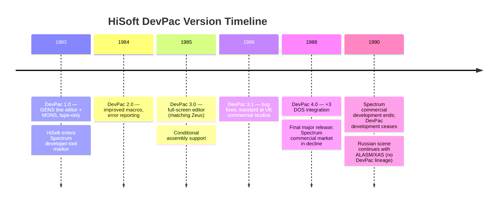
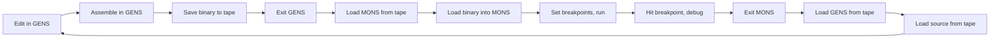

[← Home](../README.md) · [Toolchain](README.md)

# HiSoft DevPac — GENS, MONS, and the Workhorse of the UK Commercial Spectrum Era

**HiSoft DevPac** was the most widely used native Z80 assembler in the UK commercial Spectrum software industry. Released in **1983** by HiSoft (UK), DevPac was a two-program suite — **GENS** (the assembler, "Generator of Equated Notes and Source") and **MONS** (the monitor/debugger) — that together formed the daily toolchain at virtually every UK software house through the late 1980s. Where [Zeus](zeus_assembler.md) was the *innovator's choice* — first with a full-screen editor, first with integrated debugging — DevPac was the *workhorse*: reliable, conservative, and trusted with the largest commercial source files.

DevPac's reign spanned roughly **1983–1990**, from the early Spectrum tape era through the +2A/+3 disk era. By the late 1980s, HiSoft DevPac 3 and 4 (the disk-integrated releases) were the de facto standard at studios like Ocean, Gremlin, Ultimate, and the smaller houses producing the era's biggest games. The Russian Spectrum scene standardised on **ALASM** and **XAS** instead (DevPac had no Soviet distribution); DevPac's lineage ended when UK Spectrum development itself wound down around 1990.

This article is the **deep-dive reference** for DevPac as a tool: its history, design philosophy, the GENS assembler's source language and directives, the MONS monitor's debugging model, the two-program workflow, commercial studio adoption, the +3 DOS integration, and DevPac's legacy. For the broader native-toolchain survey, see [native_toolchain.md](native_toolchain.md). For DevPac's primary Western competitor, see [zeus_assembler.md](zeus_assembler.md).

---

## History

### HiSoft and the 1983 Launch

**HiSoft** was a UK software house founded in the early 1980s to produce developer tools for 8-bit microcomputers. The company's product line ranged across the ZX Spectrum, Amstrad CPC, Commodore 64, and later the Atari ST and Amiga. HiSoft's tools were characterised by **professional polish and conservative reliability** rather than experimental features — a positioning that suited commercial studios who would not adopt bleeding-edge tools when deadlines were at stake.

**DevPac for the ZX Spectrum** shipped in **1983** at a comparable price to Zeus (£12–15). The original 1983 release was tape-only, targeted at the 48K Spectrum, and consisted of two programs: **GENS** (the assembler) and **MONS** (the monitor). The naming convention reflected HiSoft's CP/M heritage — `GEN` and `MON` were traditional CP/M-era tool names; HiSoft added the trailing `S` (variously interpreted as "Source" for GENS and "System" for MONS, though HiSoft's documentation never officially expanded the abbreviations).

### Version History (1983–1988)

| Version | Year | Highlights |
|---|---|---|
| **DevPac 1.0** | 1983 | Initial release; GENS line editor + MONS monitor; tape only; 48K Spectrum |
| **DevPac 2.0** | 1984 | Improved macro support, expanded error reporting, +3 capability for upcoming 128K machines |
| **DevPac 3.0** | 1985 | **Full-screen editor** (matching Zeus); conditional assembly; broader documentation |
| **DevPac 3.1** | 1986 | Bug fixes; the version most widely deployed in commercial studios during the peak game era |
| **DevPac 4.0** | 1988 | +3 DOS integration; source and binary on +3 disk; final major release |

By the late 1980s, **DevPac 3.1** was the standard tool at most UK software houses. The +3 DOS-integrated DevPac 4 (1988) extended the toolchain's life for studios still producing +2A/+3 software, but by 1990 the commercial Spectrum market was in terminal decline and DevPac development effectively ended.



---

## Design Philosophy — Reliability Over Innovation

DevPac's defining design choice — set by HiSoft in 1983 and preserved through every version — was **reliability over innovation**. Where Zeus shipped with a full-screen editor in 1983 (when virtually no Spectrum software had one), DevPac 1.0 used a conservative line editor. Where Zeus integrated editor + assembler + monitor + disassembler in one program, DevPac deliberately kept them separate. HiSoft's reasoning was pragmatic:

- **Separate programs crash separately.** An editor crash did not lose the source. An assembler crash did not lose the in-progress binary. A monitor crash during debugging did not corrupt the source.
- **Separate programs are easier to maintain.** HiSoft could ship a GENS bug fix without re-testing MONS, and vice versa. This mattered for a small commercial tools vendor.
- **Commercial studios wanted predictable behaviour.** A studio shipping a game in six weeks could not afford a toolchain that did surprising things. DevPac's conservatism was a feature, not a bug.

The trade-off was **workflow friction**. Switching from GENS to MONS required saving the source (to tape on early DevPac, to disk on DevPac 4), exiting GENS, loading MONS, loading the assembled binary into MONS, and only then starting to debug. The cycle took a minute or more on tape; on the +3 with disk, perhaps 15 seconds. Compare Zeus's seconds-long integrated cycle, and the DevPac trade-off looks punishing for hobbyists.

Commercial studios accepted the trade-off because their bottleneck was **not** the edit-assemble-test cycle. The bottleneck was understanding what the code did, which required MONS's structured debugging — and MONS was, by most accounts, a better debugger than Zeus's integrated monitor for tracking down subtle bugs in large binaries. DevPac users debugged more slowly but more methodically.

---

## GENS — The Assembler

**GENS** ("Generator of Equated Notes and Source") is DevPac's two-pass macro assembler. Through versions 1–4 it gained features but always kept its core design: a two-pass assembly with forward references resolved in pass 2, macros, conditional assembly, and the documented Z80 instruction set.

### The Two-Pass Assembly

GENS, like most Z80 assemblers, runs **two passes**:

1. **Pass 1** — determine the address of every label by computing instruction sizes. Forward references are noted but not yet resolved.
2. **Pass 2** — generate the actual bytes, resolving all label references (forward and backward).

This is identical to how every modern Z80 cross-assembler (sjasmplus, pasmo, z88dk-z80asm) works. The two-pass design lets the developer use forward references freely — `JR forward` followed later by `forward:` assembles correctly because pass 2 has the final address.

### GENS Source Language

The GENS source language is standard Z80 assembly with HiSoft's naming conventions. A typical GENS source:

```z80
; ----------------------
; Clear screen routine
; ----------------======
        ORG  #8000
CLEAR_SCREEN:
        LD   HL, #4000       ; screen base
        LD   (HL), 0          ; clear first byte
        LD   DE, #4001
        LD   BC, #17FF        ; 6143 bytes
        LDIR                  ; block-fill with 0
        RET

        END  CLEAR_SCREEN     ; entry point for MONS
```

Labels in GENS are alphanumeric identifiers followed by `:` at the start of a line. HiSoft preferred uppercase labels (`CLEAR_SCREEN`, not `clear_screen`) — a convention adopted by most commercial Spectrum studios of the era.

### Numeric Notation

GENS accepts decimal by default; hex with `#` prefix or `&` prefix or `h` suffix; binary with `%` prefix or `b` suffix:

```z80
        LD   A, 255           ; decimal
        LD   A, #FF           ; hex (HiSoft preferred)
        LD   A, &FF           ; hex (alternate)
        LD   A, 0FFh          ; hex (CP/M convention)
        LD   A, %11111111     ; binary
```

### Directives

The key GENS directives:

| Directive | Function |
|---|---|
| `ORG nn` | Set the assembly origin |
| `EQU` | Assign a constant value to a label (`label EQU nn`) |
| `DB` / `DEFB` | Define byte(s) of data |
| `DW` / `DEFW` | Define word(s) of data (2-byte, little-endian) |
| `DM` / `DEFM` | Define message (text string) |
| `DS` / `DEFS` | Define storage (reserve n bytes) |
| `END [label]` | Mark end of source; optional entry-point label for MONS |
| `INCLUDE "file"` | Include another source file (DevPac 3+ with disk) |
| `IF expr` ... `ELSE` ... `ENDIF` | Conditional assembly |
| `MACRO name params` ... `ENDM` | Macro definition |
| `PHASE nn` / `DEPHASE` | Assemble as if at a different address (for relocatable code) |

### Macros

GENS macros follow a standard Z80 macro model:

```z80
        MACRO WAIT_VBLANK
loop    HALT
        LD   A,(FRAMES)        ; #5C78, ROM frame counter
        CP   B
        JR   NZ, loop
        ENDM

; Usage:
        LD   B, target_frame
        WAIT_VBLANK            ; macro invocation
```

DevPac 2.0+ added parameterised macros. The macro language was less elaborate than XAS's, but adequate for the repetitive patterns commercial games required (memory fill, sprite blit, audio register setup).

### Conditional Assembly

```z80
DEBUG   EQU   1

        IF DEBUG
        LD    A, '*'
        RST   #10              ; debug marker
        ENDIF

        ; ... main code ...

        IF DEBUG
        LD    A, '/'
        RST   #10
        ENDIF
```

Conditional assembly was essential for producing both 48K and 128K versions of a game from a single source — wrap the 128K AY music code in `IF _128K` and toggle the symbol at assembly time.

---

## MONS — The Monitor

**MONS** is DevPac's machine-code monitor and debugger. It is a separate program from GENS, loaded when the developer needs to debug assembled code. MONS provides breakpoints, single-step execution, register inspection and editing, memory display and modification, and disassembly.

### MONS Commands

MONS presents a single-key command prompt:

| Key | Command | Function |
|---|---|---|
| `G` | Go | Run from current PC (or specified address) |
| `S` | Step | Execute one instruction, return to MONS |
| `N` | Next | Step over a `CALL` |
| `B` | Breakpoint | Set/clear a breakpoint at an address |
| `D` | Disassemble | Show code as Z80 mnemonics |
| `M` | Memory | Hex-dump a memory region |
| `R` | Registers | Display and edit CPU registers |
| `F` | Fill | Fill memory with a byte |
| `C` | Copy | Block memory copy (`LDIR` equivalent) |
| `L` | Load | Load binary or snapshot from tape/disk |
| `W` | Write | Save binary or snapshot to tape/disk |
| `Q` | Quit | Exit MONS (back to BASIC or to GENS via `*` command) |

The command set is similar to Zeus's integrated monitor — both inherited from the CP/M-era monitor tradition. The difference is that MONS, being a separate program, occupies memory on its own and could be entered from any running program (via `RST #38` trap or NMI button on hardware) without losing the in-memory binary.

### Breakpoint Technique

MONS uses the standard **RST #38 replacement technique** — same as Zeus's monitor. The original byte at the breakpoint address is saved and replaced with `#FF` (the `RST #38` opcode). When execution hits that byte, the CPU vectors to `#0038`, where MONS has installed its breakpoint handler. The handler restores the original byte, captures the registers, and returns control to the MONS prompt.

This technique cannot break on ROM addresses (the ROM is read-only) or on memory about to be overwritten by self-modifying code. For these cases, commercial developers used **hardware NMI buttons** (Multiface, DK'Tronics) or wrote in-game debug hooks that called `RST #38` directly at chosen points.

### Register and Memory Display

MONS's `R` command shows all CPU registers in a standard layout:

```
AF = 1234  BC = 5678  DE = 9ABC  HL = DEF0
AF'= 0000  BC'= 0000  DE'= 0000  HL'= 0000
IX = 0000  IY = 5C3A  PC = 8000  SP = FFFF
I = 1F    R = 1F2A    IFF1 = 0   IFF2 = 0   IM = 1
```

The `M` command shows memory as a hex+ASCII dump:

```
8000  21 00 40 36 00 11 01 40  01 FF 17 ED B0 C9 00 00  |! . 6 ... @ ........|
8010  00 00 00 00 00 00 00 00  00 00 00 00 00 00 00 00  |....................|
```

Any value can be edited by typing a new one — both registers and memory.

---

## The GENS-MONS Workflow

DevPac's two-program design required the developer to switch between GENS and MONS during debugging. The cycle on tape-based DevPac 1–3:



Each loop iteration took **1–3 minutes** on tape — painfully slow compared to Zeus's seconds-long integrated cycle. On the +3 with DevPac 4 (1988), disk I/O brought the cycle down to ~15 seconds, but the structural friction remained.

### Why Studios Accepted the Friction

Commercial studios in the 1980s typically had multiple developers, each working on separate parts of a game (engine, sprites, audio, level data). The GENS-MONS split suited this model:

- The **assembly step** (GENS) was the lead programmer's responsibility — assembling the full game source, which might be 16–32 KB of Z80.
- The **debugging step** (MONS) was done by whichever developer was tracking down a specific bug. MONS could be loaded with just the relevant binary fragment, without the full source.
- The **source-binary separation** meant that GENS crashes (which did happen with large sources) did not corrupt the in-progress binary that another developer might be debugging.

Zeus's integrated model assumed one developer doing everything in one session. DevPac's split model accommodated team workflows better.


---

## DevPac vs Zeus — The Western Choice

For UK and Western European developers through the 1980s, the realistic choice was between **DevPac** and **Zeus**. Both originated in 1983, both were UK products, both targeted the same audience. The choice was a matter of workflow preference and studio culture.

| Aspect | DevPac (GENS+MONS) | Zeus |
|---|---|---|
| **Editor (1983)** | Line editor | Full-screen |
| **Editor (1985+)** | Full-screen (DevPac 3) | Full-screen |
| **Architecture** | Two separate programs | One integrated program |
| **Maximum source size** | 32 KB+ (GENS was reliable on large sources) | ~16 KB (integration cost memory) |
| **Edit-assemble-test cycle** | 1–3 min (tape), 15 s (disk) | Seconds |
| **Stability with large sources** | Excellent | Good but source-size limited |
| **Team workflow** | Suited multi-developer teams | Suited solo developer |
| **Market position** | Standard at commercial studios | Standard at hobbyists / small studios |
| **Typical user** | UK games industry professional | Enthusiast, educator, hobbyist |
| **Active development** | Ended 1988 | Continued (Zeus 4, 2017+) |

### Why Commercial Studios Standardised on DevPac

The commercial Spectrum games industry — Ocean, Gremlin, Ultimate, Rare, Software Creations, theOliver twins, and dozens of smaller houses — overwhelmingly used DevPac. Three reasons:

1. **Reliability on large sources.** Commercial games had 16–32 KB of Z80 source. GENS was known for assembling such sources without error where Zeus could run out of memory.
2. **Team workflow.** A studio with three programmers working on the same game needed the GENS-MONS split — one developer could assemble the full source while another debugged a fragment in MONS. Zeus's integrated model assumed single-developer sessions.
3. **Risk aversion.** Commercial studios with publishing deadlines and financial commitments could not afford toolchain surprises. DevPac was conservative, well-documented, and HiSoft was responsive to bug reports from professional users.

### Why Hobbyists Preferred Zeus

For individual hobbyists and small studios without team coordination concerns, Zeus's integrated cycle was a major productivity win. A hobbyist iterating on a 4 KB demo could press a key in Zeus and be debugging in seconds; the same cycle in DevPac took a minute on tape. Zeus also had the better disassembler — useful for hobbyists reverse engineering other people's code, less so for commercial studios writing original code.

---

## DevPac 4 and the +3 DOS Era

The release of the **ZX Spectrum +3** in 1987 — with its built-in 3-inch floppy disk drive and +3 DOS — was a productivity revolution for Spectrum development. DevPac 4 (1988) was HiSoft's disk-integrated release, and it dramatically shortened the edit-assemble-test cycle.

### +3 Disk Integration

DevPac 4 supported:

- **Source files on +3 disk** — loading and saving took 1–2 seconds instead of minutes
- **Binary files on +3 disk** — assembled output saved directly to disk
- **Multiple source files** — large projects could split source across disk files (using `INCLUDE`)
- **GENS-MONS handoff via disk** — exit GENS, load MONS, both reading the same disk

The disk-based workflow brought DevPac's cycle time down from minutes to ~15 seconds — competitive with Zeus's integrated cycle for the first time. By this point, however, the commercial Spectrum market was in terminal decline (the +3 was the last Sinclair-branded Spectrum), and DevPac 4 had only a short commercial life.

### The End of the DevPac Era

By 1990, the commercial Spectrum market had effectively ended. UK studios had moved to the Amiga, Atari ST, and increasingly the IBM PC. HiSoft itself transitioned to developing tools for those platforms. DevPac development ceased; the final release was DevPac 4 (1988).

The Russian Spectrum scene, which kept native development alive through the late 1990s, never adopted DevPac. ALASM and XAS — written by Russian authors for the TR-DOS / Pentagon ecosystem — filled the same role. DevPac's lineage ended with the Western Spectrum era.

---

## DevPac's Legacy

DevPac's influence on Z80 assembly conventions persists in modern cross-assemblers:

- **The `ORG` directive name** — used by sjasmplus, pasmo, z88dk-z80asm; originated in the CP/M-era tradition DevPac inherited
- **The `DB`/`DW`/`DS` directive names** — used by virtually every Z80 assembler; DevPac standardised these on the Spectrum
- **Uppercase label conventions** — many modern Spectrum projects still use `CLEAR_SCREEN:` rather than `clear_screen:` as a DevPac-era convention
- **The `#` hex prefix** — used by sjasmplus and several other modern assemblers; DevPac popularised it on the Spectrum (Zeus also used it; the two conventions converged)

DevPac source files, archived from commercial studios of the 1980s, remain readable by sjasmplus today with minor edits — a testament to the stability of the Z80 assembly conventions HiSoft helped establish.


---

## Frequently Asked Questions

### Is DevPac still available?

DevPac is **abandonware**. Original DevPac 1–4 TAP/TZX images are freely downloadable from World of Spectrum and other archives. HiSoft itself no longer exists as a going concern (the company wound down in the 1990s). DevPac runs in any Spectrum emulator.

### Can I use DevPac source files with sjasmplus?

Mostly yes, with minor edits. DevPac's `#` hex prefix matches sjasmplus's default. DevPac's `DM` directive (define message) should be changed to `DB "text"`. DevPac's `END label` directive should be removed or replaced with the appropriate sjasmplus directive. Macro syntax is similar but not identical — parameterised macros may need adjustment.

### Why didn't DevPac get a ZX Spectrum Next version?

By the time the Next was announced (2016), HiSoft had been defunct for over two decades. Only Zeus had a continuous development history through its author Simon Brattel. The modern Next-targeted native assembler is Zeus 4; modern cross-platform alternatives are sjasmplus and z88dk-z80asm.

### What's the difference between GENS and GENMONS?

Some HiSoft packaging combined GENS and MONS into a single binary called **GENMONS** — typically the tape-loaded all-in-one variant for users who wanted both programs available without reloading. Functionally, GENS and MONS were always separate programs; GENMONS was a packaging convenience that allowed either to be loaded into memory without a tape swap.

### Did DevPac support undocumented Z80 instructions?

Yes, from DevPac 3 onwards. The Z80 has several undocumented instructions (`SLI A`/`SLL A`, the `CB`-prefix halves of `LD (HL),R` combinations, the `I`/`R` register pairs). DevPac 3+ assembled these correctly, which mattered because commercial games routinely used them for performance.

### How does MONS compare to modern debuggers?

MONS is primitive by modern standards — it lacks source-level debugging, conditional breakpoints, watch expressions, and reverse debugging. But its core capabilities (unconditional breakpoints, single-step, register/memory inspection) cover the basic debugging workflow. Modern developers use **DeZog** (in VS Code) connected to ZEsarUX or CSpect for source-level debugging — see [debugging.md](debugging.md).

---

## Summary

HiSoft DevPac — GENS the assembler, MONS the monitor — was the **workhorse of the UK commercial Spectrum era**. From its 1983 launch through the late 1980s, DevPac was the standard tool at virtually every UK software house producing Spectrum games. Its conservative, two-program design prioritised reliability over innovation, and this conservatism was exactly what commercial studios with deadlines needed.

DevPac's reign ended with the commercial Spectrum market around 1990. The Russian Spectrum scene, which kept native development alive longer, used ALASM and XAS instead — DevPac had no Soviet lineage. Today, DevPac is of historical interest: its source-file conventions (`#` hex, `ORG`, `DB`/`DW`/`DS`, uppercase labels) live on in modern cross-assemblers, and archived commercial source from the 1980s remains readable by sjasmplus with minor edits.

For modern Spectrum development, use **sjasmplus + VS Code + DeZog + ZEsarUX/CSpect** (see [cross_platform_toolchain.md](cross_platform_toolchain.md) and [debugging.md](debugging.md)). DevPac is for running in an emulator when you want to experience the authentic 1980s commercial-Spectrum workflow.

---

## References

### Primary Sources

- **HiSoft DevPac manuals (versions 2, 3, 4)** — the canonical reference for GENS and MONS commands, directives, and operating procedures. Original HiSoft documentation, archived at World of Spectrum.
- **HiSoft advertisements** in *Sinclair User*, *CRASH*, *Your Spectrum*, *Your Sinclair* (1983–1988) — launch-era documentation of DevPac versions and pricing
- **Contemporary reviews** in *CRASH* (1983–1987) and *Your Spectrum* (1984–1986) — feature comparisons with Zeus, TASM, and other 1980s assemblers

### Modern Sources

- **World of Spectrum archives** — downloadable DevPac 1.0–4.0 TAP/TZX files for use in emulators, plus original HiSoft documentation
- **Archive of commercial Spectrum source code** — DevPac-format source files from 1980s commercial studios, occasionally surfacing in retro-computing archives
- **Retro-computing community discussions** — recollections from 1980s commercial developers about DevPac usage at Ocean, Gremlin, Ultimate, and other studios

### Related Articles in This Knowledge Base

- [Native Toolchain](native_toolchain.md) — survey of all four major native assemblers (Zeus, DevPac, ALASM, XAS)
- [Zeus Assembler](zeus_assembler.md) — DevPac's primary Western competitor
- [ALASM + STS](alasm_sts.md) — the dominant Soviet-native assembler
- [XAS Assembler](xas_assembler.md) — the Soviet alternative to ALASM
- [Cross-Platform Toolchain](cross_platform_toolchain.md) — modern replacements including sjasmplus, pasmo, z88dk
- [Debugging](debugging.md) — modern source-level debugging with DeZog, ZEsarUX, CSpect
- [sjasmplus](sjasmplus.md) — the de facto modern cross-assembler that inherited DevPac's conventions
