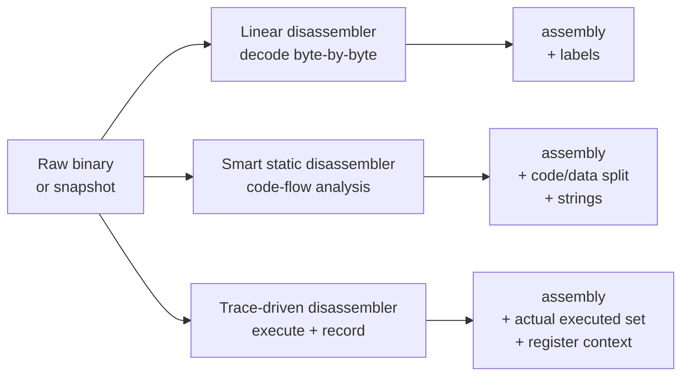
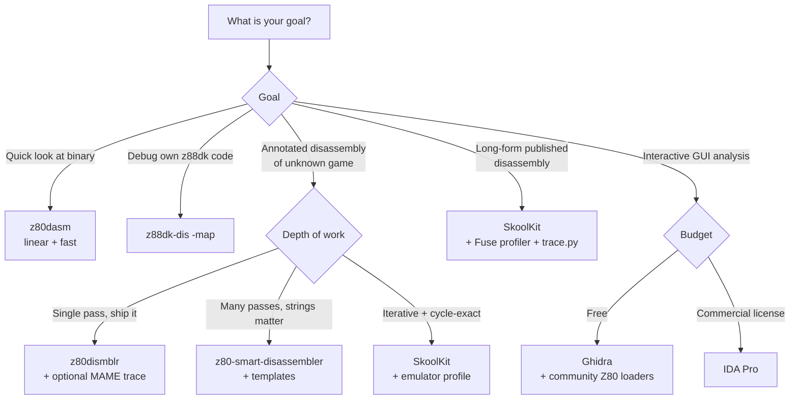

[← Toolchain](README.md) · [Cross-Platform Toolchain](cross_platform_toolchain.md)

# Disassemblers — From Raw Z80 Bytes to Annotated Source

---

## Overview

A disassembler is the bridge between machine code and human-readable assembly. On the ZX Spectrum — a 3.5 MHz Z80 with 48 KB of RAM and no symbol information embedded in binaries — a good disassembler is the foundational tool of reverse engineering, compatibility layers, source recovery, porting, and academic study of commercial games from 1982–1992.

Unlike modern x86/ARM binaries, Z80 programs have:

- **No file headers.** A `.z80` or `.sna` snapshot is a raw memory dump with a small header. There is no PE, ELF, or Mach-O structure telling you where code begins.
- **No symbol tables.** Compiler and assembler metadata are stripped at assembly time.
- **Mixed code and data in the same address space.** A single byte sequence could be a `CALL` target, a sprite, a font glyph, or a music score — the disassembler cannot tell which without help.
- **Self-modifying code, overlays, and bank-switching.** Code that pages in different RAM banks, copies itself to a different address and runs there, or uses the R-register for timing is common.
- **Heavy use of indirect jumps and computed calls.** `JP (HL)`, `JP (IX)`, and tables of addresses indexed at runtime defeat purely static analysis.

For these reasons a Z80 disassembler is more than a decoder of opcodes. The serious tools in this category distinguish code from data, recover labels from jump targets, cross-reference callers, accept user-provided annotations, and increasingly run a *simulated trace* to see which bytes the program actually executes. The chapters below describe each family of tool, the workflow for producing a readable disassembly, and the trade-offs between them.

This article focuses on tools you can run today on Linux, macOS, and Windows. The commercially-significant disassemblers of the 1980s and 1990s (the in-emulator monitors of STS, Zeus, DevPac, ALASM) are covered in [native_toolchain.md](native_toolchain.md); the modern emulator debuggers with built-in disassembly (UnrealSpeccy, ZXMAK2, ZX-M8XXX, ZEsarUX, Fuse) are covered there too.

---

## The Three Approaches



| Approach | How it works | Strengths | Weaknesses |
|---|---|---|---|
| **Linear** | Decode every byte as an instruction, in address order. | Simple, predictable, reversible (assembles back to identical bytes). | Interprets data as garbage instructions; misses code only reachable via indirect jumps. |
| **Smart static** (a.k.a. *code-flow* or *recursive descent*) | Start at the entry point; decode each instruction; recursively follow direct calls, jumps, and returns. Mark unreached bytes as data. | Clean separation of code vs data; recovers labels; can detect strings. | Cannot follow indirect jumps (`JP (HL)`) without user hints; assumes code is reachable from the entry point at all. |
| **Trace-driven** | Run the program in a simulator, record each executed instruction, then disassemble only the executed set. | Definitive code/data split — anything not executed is data (or not-yet-reached code). Catches self-modifying and overlay code. | Misses code paths you did not exercise (rare branches, secret levels, copy protection routines). Requires an accurate simulator and a thorough playthrough. |

In practice, every mature reverse-engineering workflow uses **all three**: a linear pass for first orientation, a smart-static pass to produce the bulk of the annotated listing, and trace runs to confirm or refine the code/data boundary.

---

## z80dasm — The Unix Baseline

**z80dasm** is the canonical command-line Z80 disassembler for Unix-like systems. It is a small, dependency-free C program originally written by Jan Panteltje as `dz80` 3.0, then substantially extended by Tomaz Solc (`lvitals/z80dasm` on GitHub) who added a UNIX-style CLI, block-file support, symbol files, and Z180 instructions. It is the default `z80dasm` package on Debian, Ubuntu, FreeBSD, and Homebrew.

The project's central promise is **reversibility**: any disassembly produced by z80dasm can be re-assembled by `z80asm` (or the original Zilog assembler in `--zilog` mode) to a byte-identical binary. This is rigorously tested in CI and is the project's reason for existing alongside more sophisticated tools.

### Installation

```bash
# Debian / Ubuntu / Raspberry Pi OS:
sudo apt install z80dasm

# macOS via Homebrew:
brew install z80dasm

# FreeBSD:
pkg install z80dasm

# From source:
git clone https://github.com/lvitals/z80dasm.git
cd z80dasm
cmake -S . -B build && cmake --build build && sudo cmake --install build
```

### Command summary

```bash
z80dasm [options] file
```

| Flag | Effect |
|---|---|
| `-g 0xADDR` / `--origin=ADDR` | Set the load address of the binary. Default `0x0100` (CP/M convention). For a Spectrum snapshot, you usually want `-g 0x8000` or wherever the loaded code actually lives. |
| `-l` / `--labels` | Try to recover label names from jump and call targets. The most useful single flag. |
| `-o FILE` / `--output=FILE` | Write disassembly to FILE instead of STDOUT. |
| `-s FILE` / `--sym-output=FILE` | Write the symbol table to FILE. |
| `-S FILE` / `--sym-input=FILE` | Read known symbols from FILE (see below). |
| `-b FILE` / `--block-def=FILE` | Read block boundaries (code vs bytedata vs worddata vs pointers) from FILE. |
| `-a` / `--address` | Append `; addr` comment to every line. |
| `-t` / `--source` | Append `; hexdump ascii` comment to every line — invaluable for spotting strings vs code. |
| `-z` / `--zilog` | Emit Zilog-syntax mnemonics (changes `JR` to `JRL` etc. for assembler compatibility). |
| `-v` / `--verbose` | Increase verbosity. Repeat for more detail. |

### Symbol files

A symbol file is plain text with three directives:

```
include "other.sym"     ; recursively include another symbol file
symbol: equ 0x4000      ; define a label at this address
; comment line
```

z80dasm writes symbol files in the same format with `--sym-output=FILE`, so the workflow is iterative: disassemble, spot a label you recognize, edit the `.sym` file, disassemble again. The label name propagates into the assembly output.

### Block files

A block file specifies the type of each region of the input. This is how you tell z80dasm "treat 0x4000-0x5AFF as bytedata" (the Spectrum display file) or "0x5B00-0x5B7F as pointers" (the system variables area):

```
; Spectrum 48K memory layout
block: start 0x4000 end 0x5B00 type bytedata
block: start 0x5B00 end 0x5C00 type pointers
block: start 0x5C00 end 0xFF57 type code
```

Supported block types: `code` (disassemble as instructions), `bytedata` (`DEFB`), `worddata` (`DEFW`), `pointers` (`DEFW` but label-substituted).

### Typical first disassembly

```bash
# Extract the RAM region from a 48K Spectrum .sna (skip the 27-byte header):
dd if=game.sna bs=27 skip=1 of=game.bin

# Disassemble starting at 0x8000 with labels and address comments:
z80dasm -l -a -t -g 0x8000 -o game.asm game.bin
```

The result is a flat `game.asm` that, while missing code/data distinction, will re-assemble to the original bytes and is the right starting point for a smarter pass.

### When to use z80dasm

- You want a guaranteed-reversible disassembly with no surprises.
- You are scripting a CI pipeline that needs to verify two binaries are byte-identical.
- You are doing a quick first look at a code fragment.
- You need a tool that is in every Linux distribution's package manager.

z80dasm does **not** do code-flow analysis or trace-driven disassembly. For real reverse engineering, pair it with one of the smart tools below.

---

## z88dk-dis — The Multi-CPU Toolkit Disassembler

**`z88dk-dis`** is the disassembler that ships with [z88dk](z88dk.md). It is a more capable sibling of z80dasm for everyday use, with broader CPU support and tighter integration with z88dk's `.map` file format.

### CPU coverage

| CPU | Notes |
|---|---|
| Z80 | Documented + undocumented (II, IY half-regs, `LD A,I`, etc.) |
| Z80N | ZX Spectrum Next extended instructions (`LDIX`, `LDWS`, `MUL`, `PIXELDN`, `SWAPNIB`, etc.) |
| Z180 / HD64180 | Hitachi/Zilog extended Z80 |
| Z80 GBZ80 | Sharp LR35902 / Game Boy CPU (no IX/IY, no alternate `AF'`, has `LDH (a8),A`, `STOP`, `DAA` differences) |
| 8080 | Intel 8080 (Z80's predecessor; no IX/IY) |
| 8085 | Intel 8085 (slightly extended 8080) |
| R800 | MSX2+/turboR R800 (Z80-compatible with extensions) |
| Rabbit 2000 / 3000 | Rabbit's Z80-derived microcontrollers |
| EZ80 | Zilog eZ80 (24-bit addressing) |

For Spectrum work this means you can disassemble both vanilla 48K/128K code (`-z80`) and Spectrum Next binaries (`-z80n`) without changing tools.

### Usage

```bash
z88dk-dis [options] file.bin
```

| Flag | Effect |
|---|---|
| `-cpu=<cpu>` | Choose CPU family: `z80`, `z80n`, `z180`, `gbz80`, `ez80`, `r2k`, `r3k`, `r800`, `8080`, `8085`. |
| `-org=<addr>` | Load address of the binary. |
| `-map=<file>` | Read z88dk `.map` file (emits symbolicated disassembly). |
| `-o=<file>` | Output file. |
| `-t=<table>` | Custom opcode table (advanced). |

### Map-file symbolication

The single most useful feature of `z88dk-dis` is its integration with z88dk's `.map` format. If you compiled the binary yourself with `zcc ... -m`, the `.map` file contains every public symbol and its address. Disassembling with `-map=` then produces output like:

```
0x8000 _main:
0x8000 CD 05 80    CALL zx_cls
0x8003 3E 0A       LD   A, 0x0A
0x8005 CD 12 80    CALL zx_print_str
```

This is invaluable when debugging your own compiled code or checking what the C compiler emitted for a given function.

### When to use z88dk-dis

- You are disassembling code you compiled with z88dk.
- You need Z80N or GBZ80 support that z80dasm lacks.
- You already have a `.map` file from a z88dk build and want symbolicated output.
- You need to inspect a multi-CPU binary in one tool.

`z88dk-dis` is a linear disassembler like z80dasm — it does not do code-flow analysis. For smart disassembly use `z80dismblr` or `z80-smart-disassembler` (below).

---

## z80dismblr — Code-Flow-Graph Disassembler (Now DeZog)

**z80dismblr** by Maziac is a TypeScript-based command-line disassembler that performs **code-flow-graph (CFG) analysis** to distinguish code from data, labels subroutines automatically, generates local-label syntax inside subroutines, and emits call graphs and flow charts as Graphviz `.dot` files. It also accepts MAME trace (`.tr`) files to refine the code/data split using real execution data.

> [!NOTE]
> z80dismblr has been **discontinued as a standalone tool**. Its functionality was folded into the [DeZog](https://github.com/mazog/DeZog) VS Code debugger, where the disassembler runs interactively. The standalone binary is still useful for batch jobs and is preserved on GitHub at [maziac/z80dismblr](https://github.com/maziac/z80dismblr), but new development happens inside DeZog.

### What CFG analysis buys you

A linear disassembler starts at address 0 and decodes until the end. z80dismblr instead starts at a known entry point (the SNA's PC, or a label you provide with `--codelabel`) and recursively follows:

- Direct `CALL target` and `RST n`
- Direct `JP target` (unconditional)
- Conditional `JR cc, target` / `JP cc, target` (both branches)
- `DJNZ target`

When the analyzer encounters a `RET`, `JP (HL)`, or `RST 8`, it stops the current path and backtracks to explore other pending branches. Bytes never touched by any path are marked as data.

### Output sample

```
; Subroutine: Size=38, CC=4.
; Called by: INTRPT1[A612h].
; Calls: SUB164.
901C SUB166:
901C 2A ED 8F     LD   HL,(DATA146)      ; 8FEDh
901F .sub166_loop:
901F 7E           LD   A,(HL)
9020 FE FF        CP   255               ; FFh, -1
9022 28 11        JR   Z,.sub166_l2      ; 9035h
...
9034 C9           RET
```

Note the auto-generated label names (`SUB166`, `DATA146`), the local-label syntax (`.sub166_loop`), the cross-references (`Called by:`, `Calls:`), and the size + cyclomatic complexity statistics. A `CALL` to a recovered label substitutes the name in place of the raw address.

### Usage

```bash
# SNA input (entry point comes from the snapshot header):
./z80dismblr-macos --sna myfile.sna --out myfile.list

# Raw binary with explicit code start:
./z80dismblr-macos --bin 0 game.bin --codelabel 0x8000 MAIN_START --out game.list

# Multiple binaries at different load addresses:
./z80dismblr-macos \
    --bin 0x0000 rom0.bin \
    --bin 0x1000 rom1.bin \
    --bin 0x2000 rom2.bin \
    --codelabel 0x800 MAIN_START \
    --out combined.list

# Use a MAME trace file to refine the code/data split:
./z80dismblr-macos --bin 0 game.bin --tr mame_trace.tr --out game.list
```

### MAME trace input

A MAME trace file (`.tr`) is a text log of every instruction the emulator executed, with register state and the current PC. z80dismblr parses this file and marks every executed address as code, dramatically improving accuracy on code that uses indirect jumps, self-modifying code, or overlays.

To generate a MAME trace:

1. Start MAME with the Spectrum driver and debugger: `mame64 spectrum -debug`
2. In the debugger console: `trace game.tr,0,0,cycle`
3. Play the game (interact with everything you can).
4. Stop tracing: `trace 0`

The resulting `game.tr` can be hundreds of MB; z80dismblr streams it without loading it all into memory.

### When to use z80dismblr

- You want a single-pass smart disassembly of a snapshot or ROM with minimal manual annotation.
- You want to consume a MAME trace for maximum accuracy.
- You want call graphs and flow charts as `.dot` files.
- You intend to load the result into DeZog for further work — the file format is compatible.

z80dismblr is the natural step up from z80dasm when you want a working annotated disassembly in one shot.

---

## z80-smart-disassembler — String-Aware Static Disassembler

**z80-smart-disassembler** by cormacj is a Python tool that focuses on a different problem: **identifying strings and data areas** in an otherwise flat binary. Inspired by the DOS-era *Sourcer* tool, it tries to produce a readable, well-commented disassembly with minimal user input — just the load address and (optionally) a template file.

It was originally written for Amstrad CPC ROMs (which is why the default assembler is `z88`), but it handles any Z80 code, including Spectrum snapshots.

### What it does that others don't

The disassembler runs **five passes**:

1. **Identify addressable areas** — find every label reachable from jumps, calls, and loads.
2. **Search for strings** — scan data areas for sequences of printable characters bounded by known terminators (defaults: 0, 13, 141, or any printable char with bit 7 set, the Spectrum's token-string convention).
3. **Build code structure** — emit disassembly with code/data distinction.
4. **Validate labels** — ensure every label referenced is defined.
5. **Produce final listing** — format with optional address/hex/ASCII comments, code explanations, and cross-references.

The string-detection pass is what makes this tool unique. Without it, a sequence like `48 65 6C 6C 6F 00` (the bytes for `Hello\0`) would be disassembled as garbage instructions; z80-smart-disassembler instead emits:

```
S_0109:                         ;
DEFB "Hello, world!", &00  ;&109:
```

### Templates

When the automatic detection fails (or you want to override it), a template file lets you mark regions explicitly:

```
; Format: start, end, type, label
; Types: b=byte, w=word, s=string, c=code, p=pointer
0x100, 0x108, c, Hello
0x109, 0x117, s, HelloString
0xc006, (0xc004), c, JumpTable   ; pointer dereference
```

The pointer form `(0xc004)` is particularly clever: it reads the word at that address and uses it as the end of the range, so a jump table described by a pointer in a ROM header gets disassembled correctly.

### Usage

```bash
# Install: clone the repo, requires Python 3:
git clone https://github.com/cormacj/z80-smart-disassembler.git
cd z80-smart-disassembler

# Disassemble a CP/M .COM file at the conventional 0x100:
./z80-disassembler.py -l 0x100 -e 0x118 -a maxam -o hello.asm HELLO.COM

# Disassemble a Spectrum 48K snapshot's RAM (skipping the SNA header):
dd if=game.sna bs=27 skip=1 of=game.bin
./z80-disassembler.py -l 0x8000 -a z80asm -o game.asm game.bin

# With a labels file (BIOS/ROM entry points):
./z80-disassembler.py -l 0xc000 -t amstrad_rom_template.txt \
    --labels amstrad-labels.txt -a z80asm -o rom.asm RODOS219.ROM

# Enable verbose code explanations:
./z80-disassembler.py -l 0x100 --explain 2 -o out.asm prog.bin
```

### Comment levels

The `--comments` (`-c`) flag controls per-line annotation:

- `-c 0`: no comments
- `-c 1`: address only (`;0x108:`)
- `-c 2`: (default) address + hex + ASCII dump (`;0x108:   dd 7e 00  ".~."`)

The `--explain` flag adds English-language descriptions of what each instruction does:

- `--explain 1`: only data references
- `--explain 2`: every instruction (`LD A, 0x2e` → "Load A with 0x2e")

### Helper script: `generate_string_locations.sh`

This shell script scans a binary for plausible strings and emits a template file. Useful as a starting point — review the output and remove false positives before feeding it back as `-t template.txt`.

### Limitations

- Cannot follow LDIR-relocated code automatically (the disassembler sees the source bytes as data, not the destination where they actually execute). Use a template entry to mark the destination region.
- Sometimes generates references to labels that don't exist (acknowledged as a known issue).

### When to use z80-smart-disassembler

- You want the most readable first-pass output for an unknown binary.
- You are working with Amstrad CPC ROMs (its native use case).
- You need string detection that other tools lack.
- You don't mind running Python.

---

## SkoolKit — The Spectrum-Native Disassembly Toolkit

**SkoolKit** is *the* standard tool for producing long-form, human-annotated disassemblies of ZX Spectrum software. Maintained by Richard D. Clarke (skoolkit.ca), it is a Python suite of utilities that takes a raw snapshot and produces, through an iterative annotation process, a complete HTML or Markdown website with cross-referenced disassembly, comments, memory maps, audio captures, and source-code downloads.

Published SkoolKit disassemblies — the [Spectrum ROM disassembly](https://skoolkid.github.io/rom/), [Manic Miner](https://skoolkit.ca/en/disassemblies/manic_miner/), [Jet Set Willy](https://skoolkit.ca/en/disassemblies/jet_set_willy/), [Jetpac](https://github.com/mrcook/jetpac-disassembly), [Hungry Horace](https://skoolkit.ca/en/disassemblies/hungry_horace/), [Atic Atac](https://skoolkit.ca/en/atic_atac/) — are the canonical references for how these games work. If you are studying a Spectrum game at any depth, you are probably reading a SkoolKit output.

### The five core tools

| Tool | Purpose |
|---|---|
| `sna2skool.py` | **Snapshot to skool file.** Reads `.sna`/`.szx`/`.z80` plus a code execution map (from an emulator profiler), produces an initial `.skool` file and a `.ctl` (control) file marking code/data block boundaries. |
| `skool2ctl.py` | Extracts the control file from an existing `.skool` file. |
| `skool2asm.py` | Extracts pure assembly from a `.skool` file (for re-assembly with SjASMPlus, z80asm, etc.). |
| `skool2html.py` | Renders the `.skool` file as a complete cross-referenced HTML website. |
| `trace.py` | **The killer feature.** Runs the snapshot in a built-in cycle-exact Z80 simulator (with 128K banking, memory contention, I/O contention, MEMPTR/WZ, and AY audio) and emits a trace, a profile, audio WAV, or a t-states count. |

Auxiliary tools include `bin2sna.py` (construct a snapshot from raw bytes), `snapmod.py` (modify snapshot registers/memory), `snapinfo.py` (snapshot metadata), `tap2sna.py` (load a `.tap`/`.tzx` into a snapshot by simulating the loader), `rzxplay.py` (replay RZX input recordings), and `skoolkit9to10.py` (migration).

### The skool file format

A `.skool` file looks like assembly source with extra directives in comments:

```
b40001:3B0A 3D 5A       LD   A,(Lives)        ; load player 1 lives
c40003:3B0A 3D 5A       LD   A,(Lives)        ; (alternate entry from continues)
;
; The lives counter is decremented in two places. This is the
; main game loop's check.
b40005:FE 00           CP   0                ; no lives left?
b40007:28 12           JR   Z, GameOver
```

The first character of each line is a **block type**:

- `b` — byte block (data)
- `c` — code block (instruction)
- `g` — gap (ignored bytes)
- `s` — string (text data)
- `t` — start of a title block
- `u` — UDG (User Defined Graphics) data
- `i` — ignored by reassembly
- `=` — register (entry point definition)
- `;` — comment

After the block type, the format is `@ADDR:HEXBYTES ASSEMBLY ; COMMENT`. The skool file is human-editable; you annotate and re-render to HTML in a tight loop.

### The control file

The `.ctl` file is a simpler list of block boundaries and annotations:

```
b $4000                  ; start of display file (bytes)
b $5B00                  ; start of attrs
c $5B80                  ; entry point
b $5B8E
c $5CB0
$608A label=level_init
$608A,3 Black Border
$608D,3 Clear the screen
$6090,3 Reset the screen colours
```

`sna2skool.py` generates an initial `.ctl` from the snapshot and a code execution map. You then iterate: edit the `.ctl`, regenerate the `.skool`, repeat until you understand the program.

### Profiling / tracing

The code execution map comes from an emulator profiler. **Fuse** has one built in (`Machine > Profiler > Start`). Run the emulator, play the game thoroughly — exercise every code path you can — then stop the profiler and save the map. SkoolKit then uses this map to mark every executed address as code and everything else as data. This is far more accurate than purely static analysis.

SkoolKit 9.1+ also includes its own integrated simulator (`trace.py`) that can run a snapshot headlessly and produce an execution trace, an AY/beeper WAV capture, or a t-states count. Version 10.0 added MEMPTR/WZ simulation (when memory and I/O contention are enabled), so even timing rasters can be reverse-engineered without touching a real Spectrum.

### Example workflow

```bash
# Install:
pip install skoolkit

# From a 48K Spectrum snapshot + Fuse profile, create initial ctl + skool:
sna2skool.py -M jetpac.map -g jetpac.ctl jetpac.z80 > jetpac.skool

# After editing jetpac.ctl, regenerate the skool:
sna2skool.py -c jetpac.ctl -H jetpac.z80 > jetpac.skool

# Render the final HTML site:
skool2html.py jetpac.skool

# Extract pure assembly for re-assembly:
skool2asm.py jetpac.skool > jetpac.asm
sjasmplus jetpac.asm     # produces a binary byte-identical to the original

# Capture the AY intro music as a WAV (SkoolKit 10.0+):
tap2sna.py -c machine=128 "Robocop - Side A.tzx" robocop.z80
trace.py --ay --stop 39978 robocop.z80 robocop.wav

# Count T-states for a single instruction stream (SkoolKit 10.0+):
trace.py --cmio --tstates --start 0x8000 --stop 0x8050 game.z80
```

### What makes SkoolKit special

- It is the **only** Z80 disassembly toolkit that targets long-form, narrative disassembly. Other tools produce assembly files; SkoolKit produces a website with hyperlinks, memory maps, audio captures, and prose.
- The built-in simulator is cycle-exact for the 48K and 128K Spectrum (including memory and I/O contention), so timing-critical code can be analysed without running on real hardware.
- The `.skool` format is intentionally line-oriented and diff-friendly — every change is reviewable in a version-control diff.
- A large corpus of published disassemblies uses SkoolKit, so the format is well-understood by the Spectrum community.

### When to use SkoolKit

- You are producing a **publishable, long-form disassembly** of a Spectrum game.
- You want a final output that is an HTML website with cross-references and comments.
- You want cycle-exact simulation to verify timing.
- You are studying one of the many games for which a SkoolKit disassembly already exists.

SkoolKit is not a good choice for quick one-off disassembly of a small binary; it pays its overhead only when the goal is a thorough, annotated reference.

---

## IDA Pro — The Commercial Reference

**IDA Pro** by Hex-Rays is the dominant commercial disassembler and decompiler in the reverse-engineering industry. It has supported the Z80 as a first-class processor module since the 1990s.

### Availability

| Variant | Z80 support |
|---|---|
| **IDA Pro 9.x** (current, paid) | Z80 module bundled with the base license. Supports documented + most undocumented opcodes. |
| **IDA Pro Free** (free download) | Z80 **not** included. |
| **IDA Pro 3.7** (1997, freeware) | **Z80 module included**. DOS Turbo-Vision UI. Still works under DOSEMU on Linux. Often cited as the "free IDA for Z80" baseline. |
| **IDA Home** (consumer tier) | Z80 not included. |

### What IDA gives you for Z80

- **Interactive code/data marking**: click on an address, press `C` for code, `D` for data (byte/word/dword), `A` for ASCII string, `B` for binary. The disassembler updates live.
- **Automatic code-flow analysis** that recursively follows `CALL`, `JP`, `JR`, and conditional branches.
- **Cross-references (XRefs)**: every instruction that references a label is tracked. Click an XRef to jump to the caller.
- **Function reconstruction**: IDA detects `CALL ... RET` boundaries and treats them as functions, with stack-frame analysis.
- **Non-returning function marking**: tell IDA a function never returns (e.g. a fatal error handler) and it will treat the bytes after each `CALL` to it as data — invaluable for code with inline data after CALLs.
- **IDAPython and IDC scripting** for automation. Useful for batch-applying symbol names from a SkoolKit `.ctl` file.
- **GDB bridge**: IDA can drive a remote GDB target (MAME's gdbserver, for instance) and pull live register/memory state.

### Output sample (from IDA's documentation gallery)

```
ROM:02A0 sub_2A0:
ROM:02A0                 ld      a, 7Fh
ROM:02A2                 in      a, (0FEh)
ROM:02A4                 rra
ROM:02A5                 jr      c, loc_2B2
ROM:02A7                 ld      a, 7Fh
ROM:02A9                 in      a, (0FEh)
ROM:02AB                 rra
ROM:02AC                 jr      c, loc_2B2
ROM:02AE                 ld      a, 14h
ROM:02B0                 scf
ROM:02B1                 ret
ROM:02B2 ; ---------------------------------------------------------------------------
ROM:02B2 loc_2B2:                                ; CODE XREF: sub_2A0+5j
ROM:02B2                                         ; CODE XREF: sub_2A0+Cj
ROM:02B2                 or      a
ROM:02B3                 ret
ROM:02B3 ; End of function sub_2A0
```

### IDA's decompiler (Hex-Rays)

For x86/ARM/PPC, IDA's Hex-Rays decompiler produces C-like pseudocode. For Z80, **there is no official Hex-Rays decompiler**. The community has produced experimental Z80 decompiler plugins but none approach production quality. For Z80-to-C, you must do the lifting by hand.

### Loading a Spectrum snapshot

IDA does not have a built-in loader for `.sna` or `.z80` snapshot files. The standard workflow:

1. Extract the RAM region to a raw binary: `dd if=game.sna bs=27 skip=1 of=game.bin`
2. In IDA: `File > Load File > Binary File`, select `game.bin`.
3. Set processor type to `Zilog Z80`.
4. Set loading address to `0x8000` (or wherever the snapshot's PC lives).
5. After loading, manually set the entry point: press `G`, type the PC address, then press `C` to mark it as code.

A community IDAPython script ([z80-loader](https://github.com/idiom/sna-loader)) automates this for several snapshot formats.

### When to use IDA

- You already own an IDA license (it is expensive; a commercial single-user named license is several thousand USD per year).
- You are doing reverse engineering as your day job and IDA's workflow is what you know.
- You want interactive editing in a GUI.
- You want XRefs that Ghidra cannot produce as cleanly.

### When to avoid IDA

- For pure Spectrum work, IDA is overkill. The freeware 3.7 is a historical curiosity; modern Z80 reverse engineering on a budget is better served by Ghidra.

---

## Ghidra — The Free Modern Standard

**Ghidra** is the NSA's open-source reverse-engineering suite, released in 2019. It is the closest free competitor to IDA Pro and includes a Z80 processor module out of the box.

### What Ghidra gives you for Z80

- **Fully interactive GUI** with code browser, function graph view, decompiler view (no Z80 decompiler backend — see below).
- **Code-flow analysis** with auto-detection of functions, XRefs, and call graphs.
- **Snapshot loading via community plugins** (e.g. [Ghidra-Spectrum-Loaders](https://github.com/...)) that wrap `.sna`, `.z80`, `.tap`, `.tzx` files into a memory segment layout.
- **Scripting via Python (Jython) and Java** for automation.
- **Version tracking** of analysis sessions.
- **Collaboration mode**: multiple analysts can work on the same Ghidra server-shared project.

### Known issues with the Z80 module

The Ghidra Z80 processor module (`z80.slaspec`) historically **did not decode undocumented opcodes** (issue [NationalSecurityAgency/ghidra#1335](https://github.com/NationalSecurityAgency/ghidra/issues/1335)). Examples that were skipped:

- `FD 7C` — `LD A,IYH`
- `FD 25` — `DEC IYH`
- `CB` prefix combinations on half-registers
- `ED` prefix undocumented (`LDI` variants, `NEG2`, `RETN` variants)

Workarounds:

1. Edit `z80.slaspec` to add the missing instructions and recompile the processor module.
2. Patch the offending bytes as `DEFB` and add an `#emulated-insn` comment in the listing.
3. Use a community-maintained Z80 slaspec (search GitHub for `ghidra-z80-undocumented` forks).

Modern Ghidra releases (11.x) have improved undocumented-opcode coverage significantly; check the latest release notes.

### Loading a Spectrum snapshot

```text
1. File > Import File...
2. Select game.sna (or game.bin after stripping the SNA header).
3. Format: Raw.
4. Language: Z80 (default variant).
5. Options: set base address to 0x8000 (the typical code load address).
6. Import.
7. Auto-analyze (default settings are usually fine).
```

For SNA/Z80 snapshot formats with their full headers, a community loader script can populate register state and segment layout automatically.

### Workflow tips for Ghidra on Z80

- Define common data types upfront: `byte_t`, `word_t`, `addr_t` (16-bit pointer).
- Mark the Spectrum's fixed memory regions as data: `0x4000-0x5AFF` (display file), `0x5B00-0x5BFF` (system variables), `0x5C00-0x5CB5` (system state).
- Apply the [Spectrum ROM labels](https://skoolkid.github.io/rom/) to addresses `0x0000-0x3FFF` if your program calls into the ROM.
- Use the **Decompile** window only for orientation; for Z80 it produces poor output and should not be relied upon.

### When to use Ghidra

- You want a free, modern, GUI-based interactive disassembler.
- You are already familiar with Ghidra from x86/ARM work.
- You want to script large reverse-engineering tasks in Java/Python.
- You need collaboration features.

### When to avoid Ghidra

- You need cycle-accurate simulation. Ghidra's emulation is functional, not cycle-exact; use SkoolKit's `trace.py` instead.
- You want output that re-assembles to byte-identical binaries. Ghidra's assembly export is good but not always perfect.
- Undocumented Z80 opcodes are central to your analysis (use z80dasm or patch the slaspec).

---

## Reko — The .NET Cross-Target Disassembler

**Reko** (uxmal/reko) is an open-source deconstruction project that aims to recover high-level C-like pseudocode from machine code. It supports Z80 (and many other CPUs) with a tracing disassembler that does code-flow analysis from an entry point.

### Distinguishing features

- **Cross-platform** via .NET 6+ (Linux, macOS, Windows).
- **C-like decompiler output** for several architectures. For Z80 the output is rough but improving.
- **User metadata via C-style attributes**:
  ```c
  [[reko::address("0204")]]
  [[reko::returns(register, "bc")]] int16
  my_fun(
      [[reko::arg(register, "hl")]] char *);
  ```
  This lets you declare calling conventions, register usage, and known addresses in a header file that Reko consults.
- **Command-line and GUI** versions. The GUI was Windows-only for a long time; a cross-platform version is under development.

### When to use Reko

- You want a tracing disassembler that runs from the command line on Linux.
- You want to experiment with C-style decompiler output for Z80.
- You are working on multiple architectures and want one tool.

Reko's Z80 support is less mature than z80dasm's linear decoding or Ghidra's interactive analysis. Treat it as an experimental option.

---

## Honorable Mentions

Several other disassemblers see use in the Z80 community but are not the primary recommendation:

- **`dz80`** (Jan Panteltje, original): The predecessor of z80dasm. Available but superseded.
- **`f9dasm`** (Daniel Dallmann): A general-purpose 8/16-bit disassembler that includes Z80 and many other CPUs (6800, 6809, 8085, etc.). Useful if you work across multiple 8-bit families.
- **`Disark`** (Arnold `z88dk` ecosystem): An older Z80 disassembler with code/data distinction. Used as the backend of `sikorama/z80-smart-disassembler`.
- **`z80dis`** (rkd77): A minimal Python disassembler producing z88dk-z80asm-syntax output.
- **`Daisy`** (Tommy Thorn): A retargetable decompiler with experimental Z80 support.
- **`dz80dec`** and **`z80dasm++.cpp`**: Various one-file hobbyist tools found on GitHub.

For dynamic analysis (running the code while disassembling), the **emulator debuggers** covered in [native_toolchain.md](native_toolchain.md) — UnrealSpeccy, ZXMAK2, ZX-M8XXX, ZEsarUX, Fuse — all combine a live disassembly view with breakpoints, watches, and register inspection. For Z80 work, **dynamic analysis** is the gold standard when you have a working emulator set up.

---

## Comparison Matrix

| Tool | Type | Approach | Undoc ops | Snapshot loaders | Symbol files | Interactive | Platform |
|---|---|---|---|---|---|---|---|
| **z80dasm** | CLI | Linear | ✅ | ❌ | `.sym` | ❌ | Linux / macOS / Win |
| **z88dk-dis** | CLI | Linear | ✅ | ❌ | z88dk `.map` | ❌ | Cross-platform (z88dk) |
| **z80dismblr** | CLI | CFG + trace | ✅ | `.sna` + raw | Auto-generated | ❌ | Cross-platform binary |
| **z80-smart-disassembler** | CLI | Smart static + strings | ✅ | ❌ | `.labels` file | ❌ | Any (Python 3) |
| **SkoolKit** | CLI | Linear + trace | ✅ | `.sna`/`.szx`/`.z80`/`.tap`/`.tzx` | `.ctl` + `.skool` | ❌ | Any (Python 3) |
| **IDA Pro** | GUI | CFG + interactive | ✅ | Community scripts | IDC / IDAPython | ✅ | Win / Linux / macOS |
| **Ghidra** | GUI | CFG + interactive | ⚠️ (improving) | Community plugins | Jython / Java | ✅ | Cross-platform (JDK) |
| **Reko** | CLI / GUI | Tracing + decompiler | ⚠️ | Limited | C-style attributes | Optional | Cross-platform (.NET) |

### CPU coverage

| Tool | Z80 | Z80N | Z180 | GBZ80 | 8080 | R800 | Rabbit | EZ80 |
|---|---|---|---|---|---|---|---|---|
| z80dasm | ✅ | ❌ | ✅ | ❌ | ❌ | ❌ | ❌ | ❌ |
| z88dk-dis | ✅ | ✅ | ✅ | ✅ | ✅ | ✅ | ✅ | ✅ |
| z80dismblr | ✅ | ✅ | ❌ | ❌ | ❌ | ❌ | ❌ | ❌ |
| z80-smart-disassembler | ✅ | ❌ | ❌ | ❌ | ❌ | ❌ | ❌ | ❌ |
| SkoolKit | ✅ | ❌ | ❌ | ❌ | ❌ | ❌ | ❌ | ❌ |
| IDA Pro | ✅ | ⚠️ | ✅ | ❌ | ✅ | ⚠️ | ❌ | ❌ |
| Ghidra | ✅ | ⚠️ | ✅ | ✅ | ✅ | ✅ | ⚠️ | ⚠️ |
| Reko | ✅ | ❌ | ❌ | ❌ | ❌ | ❌ | ❌ | ❌ |

---

## Decision Tree — Which Tool to Use When



The most common modern workflow for a serious Spectrum project:

1. **Start with `z80dasm`** to verify the binary loads and check the byte-level disassembly is sane.
2. **Generate a profile** in Fuse (or use SkoolKit's `trace.py`) to find the actual code paths.
3. **Run `sna2skool.py`** with the profile to produce the initial `.ctl` and `.skool`.
4. **Iterate**: edit `.ctl`, regenerate `.skool`, render HTML.
5. **For tricky sections** (self-modifying code, copy protection), **load the snapshot in Ghidra or an emulator debugger** for interactive analysis.
6. **Final output** is the SkoolKit HTML site plus an optional re-assembly script (`skool2asm.py` + `sjasmplus`) that verifies byte-identical reconstruction.

---

## Best Practices

- **Always start with the entry point.** A snapshot has a PC in its header; a tape file has the loader's load address; a ROM has its reset vector. Disassemble from there.
- **Get a code execution profile before doing anything else.** A 30-minute thorough playthrough in Fuse produces a profile that saves hours of manual annotation.
- **Trust but verify.** Disassemblers guess; they do not know. Spot-check critical paths in an emulator debugger (UnrealSpeccy, ZX-M8XXX) before believing a call graph.
- **Keep annotation files separate from raw disassembly.** SkoolKit's `.ctl`, z80dasm's `.sym`, z80-smart-disassembler's template — these are the deliverables. Regenerating the disassembly from a different tool and re-applying annotations is the standard migration path.
- **Use `sjasmplus` for round-trip verification.** Once you have a cleaned `.asm`, assemble it back. If the bytes match the original binary, your disassembly is provably complete.
- **Apply known labels** (Spectrum ROM routines at `0x0000-0x3FFF`, system variables at `0x5C00-0x5CB5`, etc.) before any other annotation. It instantly reveals what the program calls into.
- **Mark the display file and attribute file as data early.** `0x4000-0x5AFF` (display) and `0x5800-0x5AFF` (attributes) are almost never code; getting them out of the way cleans up the listing dramatically.
- **Use `IN A,(0xFE)` to spot keyboard reads.** A `LD A,0x7F / IN A,(0xFE)` sequence is reading the keyboard half-row 6-0. Knowing this instantly reveals the input routine.
- **Watch for the `R` register.** Code that increments `R` deliberately (`INC R`, or that depends on `R` advancing differently than expected) is doing timing tricks. It usually indicates a raster effect or a copy-protection check.
- **Version-control your annotation files.** A `.ctl` file checked into Git means every annotation change is reviewable; a mistake is one revert away.

---

## Pitfalls

### Wrong entry point

A linear disassembler run from address 0 will produce garbage unless you tell it the actual load address. For a 48K Spectrum `.sna` file, the binary starts at `0x4000` (display file) and contains the snapshot's saved register state at the top; the actual entry point (PC) is in the 27-byte header. Always extract the header first, read the PC value, and pass `-g <PC>` (z80dasm) or `--origin=<PC>` (other tools).

### Treating data as code

The classic failure mode: a sprite, font, or music score gets disassembled as a stream of `LD`/`INC`/`PUSH` instructions, producing pages of plausible-looking nonsense. Symptoms include `LD A,(N)` followed by a random register combination, or long runs of `LD (HL),n`. The fix is to use a smart disassembler or, in IDA/Ghidra, manually press `D` on the data range.

### Missing code reachable only via indirect jump

`JP (HL)`, `JP (IX)`, `JP IY`, and `RST 10/18/20/28/30` (which jump through a table) defeat pure static analysis. The disassembler sees the `JP (HL)` and stops following, even though HL holds a perfectly valid code address loaded from a table earlier. Solutions:

- Use trace data (MAME trace, SkoolKit's `trace.py`, Fuse profiler).
- Manually add table entries as labels (e.g. `--codelabel 0x8000 MENU_0 --codelabel 0x8010 MENU_1`).
- Use IDA's "Switch Editor" or Ghidra's switch recovery to detect jump tables.

### Wrong bank assumption (128K Spectrum)

A 128K Spectrum snapshot has all eight 16 KB RAM banks saved in the file. If you disassemble the entire file linearly from the start, you will see Bank 0 (page 0, which is the home bank at slot 0-0x3FFF after a reset) followed by Bank 1, Bank 2, etc. But the CPU's view of memory at runtime is one home bank plus whichever page is paged into `0xC000-0xFFFF` via the 7FFDh port. You must disassemble with bank awareness, or disassemble each bank separately with its correct load offset.

### Self-modifying code and overlays

Code that writes to its own later instructions (e.g. patching an `LD A,n` with a different `n`) or that copies itself to a new address and runs there cannot be statically disassembled correctly. The disassembler sees the source bytes (often just `DEFB` data) and never the destination. Solutions:

- Run the program until after the SMC/overlay executes, then dump memory from the emulator (Fuse: `Machine > Memory > Save binary`).
- Use SkoolKit's `trace.py` to simulate execution, which handles copy and self-modify correctly.

### Assembler syntax incompatibility

Disassemblers target different assembler dialects:

- **z80dasm** defaults to `z80asm` syntax (lowercase, Zilog mnemonics). Output reassembles with z88dk's `z80asm`.
- **z80dismblr** targets SjASMPlus-compatible syntax with local labels.
- **z80-smart-disassembler** supports `z88`, `maxam`, `z80asm`, `pyradev` dialects.
- **SkoolKit's `skool2asm.py`** produces SjASMPlus syntax by default.

If you switch assemblers mid-project, you will need to convert: `LD A,(HL)` vs `LD A,[HL]`, hex literals `0xNN` vs `NNh` vs `&NN`, label-syntax differences, etc. Use [sjasmplus.md](sjasmplus.md) as a reference for the most common modern target.

### Undocumented opcodes silently dropped

`FD 7C` (`LD A,IYH`), `DD CB d nn` (bit operations on half-index registers), `ED`-prefix undocumented variants — some disassemblers (notably older Ghidra Z80 module versions) silently skip these. The disassembly looks correct but re-assembles to a different binary. Always run round-trip verification: `sjasmplus output.asm` and `cmp` the result against the original.

### Compressed / crunched binaries

Many Spectrum programs are stored on tape in a compressed form (LZ77, ZX0, ZX7, MegaLZ, etc.) and only decompress at load time. Disassembling the compressed bytes is meaningless. Always decompress first:

- For `.tap`/`.tzx` files, use SkoolKit's `tap2sna.py` to load and execute the loader, ending with a clean snapshot.
- For raw compressed payloads, use `z88dk-zx0` / `z88dk-zx7` / `dzx0` / `dzx7` to decompress.

### Wrong assumptions about Z80N

If you are disassembling a ZX Spectrum Next `.nex` file or a binary known to use Z80N instructions, you must enable Z80N mode in the disassembler (`-cpu=z80n` for `z88dk-dis`, `--z80n` flag where available). Otherwise, byte sequences like `ED B4` (`LDIX`) will decode as `ED` prefix followed by `B4` (`OR H`), producing wrong output.

---

## Cross-References

- [Cross-Platform Toolchain](cross_platform_toolchain.md) — survey article situating disassemblers in the wider toolchain.
- [sjasmplus.md](sjasmplus.md) — the assembler used for round-trip verification of disassembler output.
- [z88dk.md](z88dk.md) — `z88dk-dis` is part of the z88dk toolkit; `z88dk-ticks` complements disassembly with cycle-counting emulation.
- [native_toolchain.md](native_toolchain.md) — the in-emulator monitors (STS, Zeus, DevPac, ALASM, XAS) and modern emulator debuggers (UnrealSpeccy, ZXMAK2, ZX-M8XXX, ZEsarUX, Fuse) covered there.
- [../08_reverse_engineering/](../08_reverse_engineering/README.md) — broader reverse engineering methodology.
- [../05_development/02_assembly/](../05_development/02_assembly/README.md) — Z80 assembly programming (target language of disassembler output).
- [../11_emulation/software/](../11_emulation/software/) — emulators (Fuse, ZEsarUX, CSpect, MAME) used for profiling and tracing.

---

## References

### Disassemblers

- [z80dasm on GitHub (lvitals/z80dasm)](https://github.com/lvitals/z80dasm) — source, issues.
- [z80dasm(1) man page](https://linux.die.net/man/1/z80dasm) — definitive command reference.
- [z88dk/z88dk](https://github.com/z88dk/z88dk) — home of `z88dk-dis`.
- [maziac/z80dismblr](https://github.com/maziac/z80dismblr) — standalone CFG disassembler (folded into DeZog).
- [DeZog on GitHub (mazog/DeZog)](https://github.com/mazog/DeZog) — VS Code Z80 debugger, current home of z80dismblr's algorithms.
- [cormacj/z80-smart-disassembler](https://github.com/cormacj/z80-smart-disassembler) — string-aware Python disassembler.
- [skoolkid/skoolkit](https://github.com/skoolkid/skoolkit) — SkoolKit source.
- [skoolkit.ca](https://skoolkit.ca/) — SkoolKit documentation and canonical example disassemblies.

### Commercial and open-source GUI tools

- [IDA Pro — Hex-Rays](https://hex-rays.com/) — commercial; Z80 module in the base license.
- [IDA Z80 disassembly gallery](https://docs.hex-rays.com/core/disassembler/disassembly-gallery/z80) — IDA's Z80 output sample.
- [Ghidra (NSA)](https://ghidra-sre.org/) — official site.
- [Ghidra on GitHub](https://github.com/NationalSecurityAgency/ghidra) — source and issue tracker.
- [Ghidra Z80 undocumented opcodes issue #1335](https://github.com/NationalSecurityAgency/ghidra/issues/1335) — historical context.
- [Reko on GitHub (uxmal/reko)](https://github.com/uxmal/reko) — open-source decompiler.

### Community references

- [The Complete Spectrum ROM Disassembly](https://skoolkid.github.io/rom/) — the canonical SkoolKit reference output.
- [Reverse engineering ZX Spectrum games (Michael R. Cook)](https://mrcook.uk/reverse-engineering-zx-spectrum-games) — walkthrough of SkoolKit on Jetpac.
- [Retrocomputing SE: tracing disassemblers for the Z80](https://retrocomputing.stackexchange.com/questions/29877/what-are-some-tracing-disassemblers-for-the-z80) — community Q&A surveying options.
- [Retro Reversing — ZX Spectrum](https://www.retroreversing.com/zxspectrum) — broader ZX reverse engineering portal.
- [z80.info — undocumented opcodes](http://www.z80.info/z80undoc.htm) — the canonical reference for the undocumented instructions every serious disassembler must decode.
- [The Undocumented Z80 Documented (Sean Young)](http://www.myquest.nl/z80undocumented/z80-documented-v0.91.pdf) — the standard reference, cited by every Z80 tool.

### Adjacent tools

- [SjASMPlus](https://github.com/z00m128/sjasmplus) — assembler used for round-trip verification.
- [Fuse emulator](https://fuse-emulator.sourceforge.net/) — has the built-in profiler used by SkoolKit.
- [MAME](https://www.mamedev.org/) — has the trace facility consumed by z80dismblr.
- [z88dk-ticks](https://github.com/z88dk/z88dk/tree/master/src/ticks) — cycle-counting emulator useful alongside disassembly.

