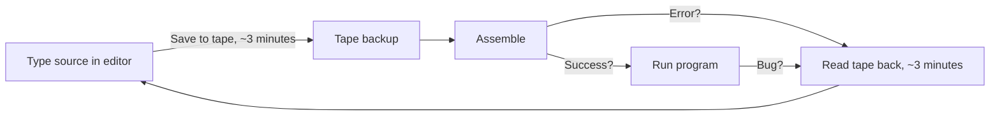
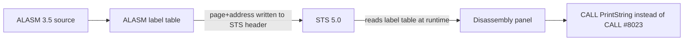

[← Home](../README.md) · [Toolchain](README.md)

# Native Toolchain — Assemblers, Monitors, and Editors That Ran on the Spectrum

> **Applies to**: All tracks. **Original** ZX Spectrum 16K/48K/128K/+2/+2A/+3 (1982–1992), **Soviet** clones (Pentagon, Scorpion, Kay, Profi, ATM Turbo — 1989–present), **New Gen** via Zeus 4 on ZX Spectrum Next. This article covers the era when the developer's editor, assembler, and debugger all ran *on the same machine* as the target program. For the modern PC/Mac/Linux alternative, see [Cross-Platform Toolchain](cross_platform_toolchain.md).

---

## Overview

For the first eight years of the ZX Spectrum's life — from the 16K launch in April 1982 through roughly 1990 — **every commercial Spectrum program was written, assembled, and debugged on a Spectrum**. Cross-assemblers existed but ran on minicomputers or expensive PCs that few developers could afford. The single-machine workflow was not a choice; it was the only practical option.

This workflow had one decisive advantage: **instant feedback**. The developer typed assembly, pressed a key, the assembler ran, and the result executed on the exact hardware the program would ship on. There were no emulator mismatches, no contention-model guesses, no transfer step. When code worked in Zeus or DevPac, it worked on every Spectrum ever made.

The cost was *everything else*. Editing happened in 24-row text windows on a flickery CRT. Source code lived on cassette tape (slow, sequential) until the TR-DOS disk interface arrived in 1985-1986. Assembling a 16 KB source file on a 3.5 MHz Z80 took minutes — and a single typo sent the developer back to the editor. Debuggers were primitive: a few breakpoints, a memory dump, a single-step key. Source code comments in the commercial era were often sparse because the developer *was* the maintenance team.

The native toolchain era produced **two distinct ecosystems**:

- **Western (1982–1990)**: dominated by **Zeus** (Crystal Computing, 1983) and **HiSoft DevPac / GENS-MONS** (1983). Commercial studios standardized on DevPac; serious hobbyists and small studios preferred Zeus. Both originated in the UK.
- **Soviet / post-Soviet (1989–2000s)**: dominated by **ALASM** and **XAS**, both Russian-developed, both tightly integrated with TR-DOS and the Pentagon/Scorpion clone hardware. Native development persisted far longer in the former Soviet Union because PCs were scarce and expensive through the late 1990s.

This article surveys both ecosystems and explains why the native workflow survived as long as it did — and why it still has niche practitioners in the 2020s.

### Native vs Cross-Platform at a Glance

| Aspect | Native (this article) | Cross-Platform (sibling article) |
|---|---|---|
| **Host** | The Spectrum itself | Modern PC, Mac, or Linux |
| **Edit-assemble-test loop** | Seconds (disk) to minutes (tape) | Milliseconds to seconds |
| **Hardware accuracy** | Exact — runs on the real thing | Requires emulator or transfer to hardware |
| **Editor quality** | Line editors (early) to full-screen (mid-1980s+) | Modern IDE: syntax highlighting, autocomplete, jump-to-definition |
| **Source control** | Manual tape/disk backups | Git, CI/CD, automated testing |
| **Era of dominance** | 1982–1995 (West), 1989–2005 (former USSR) | 1995–present |
| **Still used today?** | Hobbyist / demoscene purists | Universal |

> [!NOTE]
> The two articles are complementary. This one covers *what ran on the Spectrum*; [Cross-Platform Toolchain](cross_platform_toolchain.md) covers *what replaced it*. Per-tool deep-dives (zeus_assembler.md, devpac_gens_mons.md, alasm_sts.md, etc.) are planned as separate articles.

---

## The Pre-Assembler Era: Machine Code from BASIC

When the ZX Spectrum launched in April 1982, no assembler was commercially available for it. The first programs written in Z80 machine code were assembled by hand — the developer looked up opcodes in the Zilog manual, wrote the bytes in hexadecimal on paper, and entered them into the Spectrum through BASIC `DATA` statements and a `POKE` loader. Every commercial game in 1982-1983 was produced this way.

### The DATA/POKE Loader Pattern

The canonical 1982 workflow:

```basic
 10 REM Machine code loader
 20 FOR n = 0 TO 47
 30   READ d: POKE 30000 + n, d
 40 NEXT n
 50 DATA 62, 38, 211, 254, 201      ; LD A,#26: OUT (#FE),A: RET
 60 DATA 33, 0, 64, 34, 92, 91       ; LD HL,#4000: LD (#5B5C),HL
 70 DATA ...
100 RANDOMIZE USR 30000
```

The developer maintained the **decimal byte list** by hand. A 4 KB game was roughly 4,000 numbers typed across hundreds of `DATA` lines. A single typo — say `38` instead of `3B` — produced a crash that was nearly impossible to locate without a monitor program.

### Monitor Programs

A **monitor** was a small ROM-resident or tape-loaded program that exposed four primitive operations: examine memory, modify memory, execute at address, and (sometimes) single-step. Examples from 1982-1983:

| Monitor | Origin | Capability |
|---|---|---|
| **ROM's `USR`/`PEEK`/`POKE`** | Built-in | Minimal — only what BASIC provided |
| **MCT** (Machine Code Tester) | Various authors | Display/modify memory, simple disassembly |
| **SYS** | Tape-distributed | Add breakpoints, register inspection |
| **Snapshots via Interface 1** | Sinclair (1984) | Save/restore full machine state |

These were the only debugging tools available before the first integrated monitor/debugger packages (Zeus, MONS) appeared in 1983.

### Hex Loader Tapes

A 1983 alternative to `DATA` statements was the **hex loader** — a small BASIC program that read a string of hex bytes (`"3E26D3FEC9..."`), converted them two characters at a time, and `POKE`d them into memory. Magazines printed these hex strings; readers typed them in by hand. The `PRINT PEEK 23755 + 256 * PEEK 23756` checksum trick verified entry accuracy.

### Why This Was the Only Option

Cross-assemblers for Z80 existed in 1982-1983, but they ran on:

- **CP/M systems** with Z80 cards — typically S-100 bus machines costing $3,000+
- **PDP-11 and VAX minicomputers** — university or corporate equipment
- **Early IBM PC** with development tools — $1,500+ just for the PC

A Spectrum cost £125–£175. The audience for Spectrum development tools was Spectrum owners. The first commercial Spectrum assemblers therefore had to *run on the Spectrum*. This produced the toolchain surveyed in the next section.

---

## The Big Four Native Assemblers

Four native Z80 assemblers dominated the Spectrum's commercial and demoscene eras. Two were Western (Zeus, DevPac); two were Soviet (ALASM, XAS). Together they cover virtually all Spectrum-era Z80 development from 1983 through the late 1990s.

### Zeus (Crystal Computing / Simon Brattel & Neil Mottershead, 1983)

**Zeus** was the most ambitious Spectrum-native assembler ever built. Originally written by Neil Mottershead for the Nascom 2 and ported to the Spectrum by Mottershead and Simon Brattel in 1983, Zeus shipped as a commercial product from Crystal Computing at £12.95.

Zeus was distinguished by its integration: a full-screen editor, a macro assembler, a monitor, and a disassembler were all in one program. The user edited source in the editor, pressed a key to assemble, watched the assembly output appear inline, and could immediately drop into the monitor to debug. No other Spectrum assembler matched this level of integration until Zeus 4 in the 2010s.

**Zeus is unique among native assemblers in that it is still actively developed.** Simon Brattel continues to maintain Zeus 4 for the ZX Spectrum Next, with the latest releases adding Z80N instruction support, the `.nex` executable output format, and integration with the Next's expanded memory banking. No other native assembler has a 40+ year continuous development history.

Key Zeus features even in its 1983 form:

- Full-screen editor with cursor addressing (rare for 1983)
- Symbolic labels (not just numeric addresses)
- Conditional assembly (`IF`/`ELSE`/`ENDIF`)
- Macro definitions with parameters
- Built-in disassembler for reverse engineering
- Machine-code monitor with breakpoints and single-step

### HiSoft DevPac / GENS-MONS (HiSoft, 1983)

**HiSoft DevPac** was the workhorse of the commercial Spectrum era. Released in 1983 by HiSoft (UK) and refined through versions 2, 3, and 4 in the late 1980s, DevPac was a two-program suite:

- **GENS** — the assembler ("Generator of Equated Notes and Source")
- **MONS** — the monitor/debugger

DevPac's strengths were **speed and reliability**. GENS was a fast two-pass assembler that could handle large commercial game sources (16–32 KB of Z80) reliably. MONS provided the breakpoints, register display, and memory inspection that developers needed to track down crashes. The combination became the de facto standard at UK software houses through the late 1980s.

DevPac supported macros, conditional assembly, and the documented Z80 instruction set. Its editor was a full-screen editor by version 3 (1985), replacing the original line-based editor. The +3 disk version of DevPac 4 (1988) integrated directly with +3 DOS for fast source loading and saving.

DevPac's weakness was its conservatism — it did not pursue the experimental features (per-module frequency tables, packed pattern encoding, etc.) that Soviet-developed assemblers would adopt in the 1990s. By 1990 DevPac was mature but static, and the Soviet toolchain surge overtook it for new demoscene work.

### ALASM + STS (Various Russian Authors, 1992–2000s)

**ALASM** (ALenkin Assembler, sometimes "A.L.A.S.M.") is the dominant native assembler of the Soviet and post-Soviet Spectrum scene. Developed in several versions from 3.0 through 5.x by various Russian authors across the 1990s, ALASM was the standard tool at every major Russian demoscene party (CC, diHALT, CAFe) and at game studios targeting the TR-DOS ecosystem.

ALASM's defining features:

- **TR-DOS native**: source code, binaries, and assembled output lived on TR-DOS disk from the start. No tape workflow ever applied.
- **Fast assembly**: ALASM was specifically optimized for the slow Soviet clone hardware and could assemble large sources in seconds rather than minutes.
- **STS integration**: ALASM was paired with the **STS** debugger (Step Trace System), which provided hardware-assisted single-step and breakpoint capabilities on compatible clone hardware.
- **Multi-file projects**: ALASM supported `INCLUDE` directives for splitting large projects across multiple disk files — essential for ambitious demos.
- **Cyrillic comments**: source files routinely contained Russian-language comments in the Spectrum's character set.

ALASM versions 4 and 5 added improved editors, expanded macro support, and better TR-DOS file management. The tool remained in active use into the 2000s in the Russian scene and is still the reference assembler for legacy TR-DOS project restoration.

### XAS (Russian, v7.x–9.x)

**XAS** is ALASM's primary alternative in the Russian scene. Developed through versions 7, 8, and 9 across the 1990s, XAS targeted the same audience (Pentagon and Scorpion owners with TR-DOS) but emphasized different design choices:

- **Macro focus**: XAS's macro system was more elaborate than ALASM's, making it popular with the demoscene for generating repetitive code patterns (sprite data tables, scroll routines, music player routines).
- **Different editor model**: XAS used a more IDE-like editing model than ALASM's traditional editor, with multi-window source views on compatible hardware.
- **Scene adoption**: XAS was particularly popular at the **Elite Group** and **Progress** demoscene crews, while ALASM dominated elsewhere.

Both ALASM and XAS targeted the same TR-DOS file formats and produced compatible binary output. The choice between them was largely a matter of crew/scene tradition.

### Feature Comparison Matrix

| Feature | Zeus (1983+) | DevPac / GENS (1983+) | ALASM (1992+) | XAS (1990s) |
|---|---|---|---|---|
| **Origin** | UK (Crystal Computing / Brattel) | UK (HiSoft) | Russia | Russia |
| **Editor** | Full-screen (1983!) | Line → full-screen (v3, 1985) | Full-screen, multi-window | Full-screen, IDE-like |
| **Macro assembler** | ✅ | ✅ | ✅ | ✅ (elaborate) |
| **Conditional assembly** | ✅ | ✅ | ✅ | ✅ |
| **Integrated monitor** | ✅ Built-in | ✅ (MONS, separate program) | ✅ (STS, separate program) | ⚠️ (external tools) |
| **Disassembler** | ✅ Built-in | ⚠️ (separate) | ⚠️ (separate) | ⚠️ (separate) |
| **TR-DOS native** | ❌ (UK tape/disk) | ❌ (UK tape/+3 disk) | ✅ (designed for TR-DOS) | ✅ (designed for TR-DOS) |
| **Multi-file projects** | Limited | Limited | ✅ `INCLUDE` | ✅ `INCLUDE` |
| **Z80N (Next) support** | ✅ (Zeus 4, modern) | ❌ | ❌ | ❌ |
| **Active development** | ✅ (Zeus 4 by Brattel, 2020s) | ❌ (final release 1988) | ❌ (frozen at v5) | ❌ (frozen at v9) |
| **Typical source size** | Up to 16 KB | Up to 32 KB | Up to 64 KB (TR-DOS) | Up to 64 KB (TR-DOS) |

> [!NOTE]
> **TASM is not in this table** — there are two unrelated TASM-named tools. The native Spectrum TASM (a simple 1980s assembler) is covered below under minor tools. The cross-platform **TASM (Telemark Assembler)** is a different DOS-era product covered in [Cross-Platform Toolchain](cross_platform_toolchain.md). Confusing the two is a common mistake in modern retro-dev discussions.

---

## Minor and Specialist Native Assemblers

Beyond the big four, a long tail of less widely adopted assemblers served niche audiences. Each has some claim to historical importance.

### TASM (Native Spectrum Version)

Not to be confused with the later DOS-based Telemark Assembler (covered in the cross-platform article), the native **TASM** was a simple early-1980s Z80 assembler for the Spectrum. It supported the documented Z80 instruction set and basic label usage but lacked macros or conditional assembly. TASM was distributed on tape and saw limited use among hobbyists in 1983-1985, after which it was largely replaced by DevPac and Zeus.

### ZXASM 3.0

**ZXASM 3.0** was a Russian-developed native assembler with tight integration to the **STS** debugger (the same STS paired with ALASM). ZXASM targeted developers who wanted STS debugging without adopting ALASM's full workflow. The tool was less widely used than ALASM but had a loyal following among developers who preferred its editor.

### PikAsm

**PikAsm** was a specialist assembler paired with the **VAST** toolchain in some professional Soviet-era workflows. PikAsm targeted a narrower audience than ALASM/XAS but had a reputation for clean macro handling and was used in several commercial Soviet clone game productions.

### Laser Genius (Ocean)

**Laser Genius**, distributed by Ocean Software, was a cartridge-based assembler for the Spectrum's Interface 2 ROM cartridge port. The cartridge format meant instant load (vs. minutes for a tape-loaded assembler) — a significant productivity advantage for early-1980s commercial work. Laser Genius was used internally at Ocean and licensed to a small number of partner studios. Its closed distribution model limited its broader influence.

### AVRA and Other Minor Tape-Era Tools

Several other assemblers saw limited distribution in the 1982-1985 tape era, including **AVRA** and various one-off tools published in magazines. Most are of historical interest only — they typically supported only the documented Z80 instruction set, lacked macros, and were replaced by DevPac or Zeus as soon as those tools became widely available.

---

## The Editor Workflow: Line Editors to Full-Screen

The native-era developer's daily experience was dominated by the **edit-assemble-test loop**. The friction in this loop drove most toolchain evolution from 1982 to 1990.

### Line Editors (1982–1984)

The earliest Spectrum assemblers inherited the **line editor** model from Sinclair BASIC: source code was edited one line at a time, with line numbers, exactly like a BASIC listing. To change a single instruction, the developer re-typed the entire line. There was no cursor-addressable full-screen editing.

```
100  LD HL,#4000       ; screen base
110  LD (HL),0          ; clear first byte
120  INC HL             ; next
130  DEC BC
140  LD A,B
150  OR C
160  JR NZ,110
```

The line editor was usable but slow. A 4 KB source file could have 400+ lines, and navigating to a specific line required either typing the line number or scrolling sequentially.

### Full-Screen Editors (1985+)

The arrival of full-screen editors on the Spectrum (Zeus had this in 1983; DevPac gained it with version 3 in 1985) was a major productivity breakthrough. The developer could now move the cursor anywhere in the source, edit in place, and see the surrounding context. Source files looked more like modern text files:

```
; ----------------------
; Clear screen routine
; ----------------------
Clear_Screen:
    LD  HL,#4000          ; screen base
    LD  (HL),0            ; clear first byte
    LD  DE,#4001
    LD  BC,#17FF          ; 6143 bytes
    LDIR                  ; block-fill with 0
    RET
```

Full-screen editing reduced the cost of writing well-commented source — which in turn improved code quality and made maintenance practical.

### Tape Workflow: The Slow Era

On tape-only 48K Spectrums (1982–1985), the edit-assemble-test loop was painful:



Each loop iteration could take 5–10 minutes if a tape save and reload were involved. Developers adopted strategies to minimize tape usage:

- **Resident source**: keep source in RAM, only save to tape at the end of a session
- **Small test programs**: assemble tiny fragments in isolation rather than the full project
- **Printed listings**: keep a paper copy of stable source code as a backup against tape failure

### TR-DOS Revolution (1985+)

The TR-DOS disk interface (Beta Disk interface, 1985) changed everything. Source load/save dropped from minutes to seconds, multi-file projects became practical via `INCLUDE`, and the developer could keep multiple source files, binaries, and asset files on the same disk. The edit-assemble-test loop dropped to 10–30 seconds, comparable to early PC assemblers.

The Soviet clone scene adopted TR-DOS as its **universal** disk interface — every Pentagon, Scorpion, and Kay came with TR-DOS support. This is why ALASM and XAS were designed TR-DOS-first: by the time they were developed (early 1990s), the entire Soviet scene was disk-based.

### RAM Disk Tricks on 128K

The 128K, +2, +2A, and +3 introduced banked memory. Some advanced workflows used the upper memory banks as a **RAM disk** — loading source code into upper banks, switching banks to assemble against a different source file, and keeping the main 48K bank free for the editor and assembler. This technique, popular with Zeus power users and later Soviet developers, effectively eliminated disk I/O during the edit-assemble-test loop.

---

## Debuggers and Monitors

Native development required native debugging. Three monitor/debugger traditions emerged:

### The HiSoft MONS Tradition

**MONS** (the monitor half of HiSoft DevPac) was the canonical commercial debugger of the 1980s. It provided:

- **Memory display** in hex and ASCII, with cursor-addressable editing
- **Register display** (AF, BC, DE, HL, IX, IY, SP, PC, I, R)
- **Breakpoints** — set a 1-byte `RST #38` or similar trap at an address; MONS catches the trap and re-enters its display
- **Single-step** — execute one instruction and re-enter the display
- **Disassembly** — show memory as Z80 mnemonics (read-only)

MONS was a separate program from GENS (the assembler). The developer assembled the program to memory or disk, exited GENS, loaded MONS, loaded the program, set breakpoints, and ran. The split workflow was tolerable but tedious for tight iteration.

### The STS Tradition (Russian)

**STS** (Step Trace System, also expanded as *Stalker Trace System* and retrospectively as *Stealth Monitor*) was the dominant Russian-scene debugger of the 1990s and the best-in-class monitor-debugger of the entire native Spectrum era. Originally developed by **Dmitry Partsyrny** (pen name **STALKER**) in **Kharkov, Ukraine** in 1994, STS was refined across versions 2.6, 3.3, 5.0, and later community-maintained releases through the late 1990s.

STS's significance is best understood by what it replaced. Before STS, Russian clone developers used a fragmented landscape of monitors ported or cloned from Western originals: **MONS 4** (HiSoft DevPac's monitor), **MON 2**, **FOXMON 128**, and **ADM 7.08**. Each had limitations — single-bank visibility, no disassembly, no register-set switching, no label integration. STS, designed from scratch for the 128K clone architecture, surpassed all of them and became the standard debugger at every major Russian demoscene party (CC, diHALT, CAFe, FunTop) through the late 1990s.

#### Version History

| Version | Year | Source | Key additions |
|---|---|---|---|
| **STS 2.6** | 1994 | Spectrophoby #1 (StALKER / KVANtSOFt) | Original release: 19-byte resident, window panels, full disassembler with undocumented opcodes, register-set switching, single-breakpoint trap |
| **STS 3.3** | 1995 | Stalker (Kharkov) | Disk error handling, label support, ALASM integration began |
| **STS 5.0** | 1995–1996 | ZX-Ревю 1996 №9 | Full ALASM 3.5 integration (symbol-table bridge), separate Trace Call processing (`SS+Z` step-into vs `SS+X` step-over), Disasm-to-Disk with variable DEFB bytes per line, panel scroll without cursor move |
| **STS 6.x** | Late 1990s | Community extensions | Windowing refinements, expanded label tables, post-Stalker community maintenance |

STS was paired with **ALASM** (its primary integration partner) and also with **ZXASM 3.0** and **TASM 128**. The STS+ALASM combination on a Pentagon or Scorpion with TR-DOS was the standard professional Russian-scene development stack of the late 1990s.

#### Architecture: The 19-Byte Resident

STS's defining architectural innovation was its **two-component design**: a small resident routine that lived in the target program's memory, and a much larger monitor body that occupied an entire 16 KB RAM bank.

**Memory layout** (128K Spectrum, STS v2.6+):

| Region | Address range | Contents |
|---|---|---|
| `#0000–#3FFF` (ROM) | System ROM | 48K BASIC or 128K editor ROM; STS does **not** occupy this. |
| `#4000–#7FFF` (RAM bank) | Target program or STS screen | When STS is active, page 7 is paged in here: this becomes the STS second screen + STS code. |
| `#8000–#BFFF` (RAM bank) | Target program | STS occupies **none** of this when invoked — the user's program is intact here. |
| `#C000–#FFFF` (page 5 / bank #13) | Target program | STS occupies **none** of this either. The 19-byte resident is the only footprint. |
| Page 7 (when STS active) | All 16 KB | STS code body at `#DB00` (56064), ~9 KB; second screen at `#4000`-offset; STS font and panels share the rest. |

STS itself resides in **page 7** (bank #16) — the same bank the 128K Spectrum normally reserves for the second display and TR-DOS work buffers. When STS is invoked, it pages itself in, takes over the screen, runs its monitor loop, and on exit pages the original bank back. The user's program memory is preserved across STS invocations; only the 19-byte resident lives in the target's address space.

**The Resident** — STS's clever trick — is just **19 bytes** that the monitor installs in the target program's address space (the lower 48 KB, anywhere in `#4000..#BFEE` where free space can be found). The resident is what makes STS invocable from the target program without occupying main memory. Its job:

- Catch the breakpoint trap (set via `W` command) and vector back into the monitor
- Switch the paging register (`#7FFD`) to bring page 7 (STS) into view
- Preserve enough register state for the monitor to display
- Restore the 3 bytes at the breakpoint address (the trap replaced them)

The resident is **dynamically modified** by the monitor — different breakpoint addresses, different paging states require different resident variants. The `[E]` (sEtup) command re-installs or relocates the resident.

**Paging port**: STS uses `OUT (#FD),A` with `A < #20` to switch banks. This works because of the partial port decoding on clone hardware — the high byte of the address is ignored, and the value of `A` directly maps to the 128K `#7FFD` paging bits:

```
Bit:  F E D C B A 9 8 7 6 5 4 3 2 1 0
Value:0 0 0 r s p a g 1 1 1 1 1 1 0 1

where:
  p a g  = RAM page (0–7)    → bits 0–2 of #7FFD
  s      = screen select     → bit 3 of #7FFD
  r      = ROM select        → bit 4 of #7FFD
```

This decoding matches the standard 128K Pentagon/Profi/Leningrad port scheme. STS does **not** work on hardware that decodes bits 8–15 of the port address (some unusual clones) without hardware modification.

**Disk access via TR-DOS @-functions**: STS does **not** include its own disk driver. It calls the TR-DOS ROM's `@` functions (`@READ`, `@WRITE`, etc.) directly. This means:

- STS does not corrupt TR-DOS system variables (`#5CCB`–`#5D15`)
- Programs being debugged that *do* use those variables (custom loaders, copy protection) keep their state intact
- STS cannot read non-TR-DOS disk formats natively (the @-functions assume 256-byte TR-DOS sectors) — though single-sector reads from MS-DOS or iS-DOS disks are possible via direct sector addressing

#### User Interface: Window Panels and the 6×8 Font

STS's UI was a **window-panel interface** running in full-screen mode on the second display. This was a significant departure from the line-oriented MONS tradition and brought the Spectrum debugger closer to the look-and-feel of contemporary PC debuggers (Turbo Debugger, CodeView).

**Panel modes** — the central workspace has two switchable views:

| Mode | Toggle | What it shows |
|---|---|---|
| **Disassembler** | `[SS+4]` (cycles to this) | Memory decoded as Z80 mnemonics, including **all undocumented instructions** (`SLL`, `LD A,F`, etc.). PC cursor (white highlight) tracks the current execution point. |
| **List** (hex dump) | `[SS+4]` (cycles back) | Raw memory in hex + ASCII side-by-side, cursor-addressable for byte editing. Used for inspecting data tables, sprite data, font data — anything that does not disassemble cleanly. |

Both panels honor the current **Bank** setting (`[B]` command) — STS can display any of the eight 16 KB RAM pages of the 128K Spectrum, not just the visible page 5. This was a major advantage over MONS, which could only see the currently-paged bank.

**Window management** commands:

- `[SS+1]` — Zoom/Unzoom the active panel (toggle between split-view and full-screen single panel)
- `[SS+2]` — Move panel up/down (rearrange the split)
- `[SS+8]`, `[SS+9]` — Scroll panel content **without moving the cursor** (v5.0+); useful for peeking at adjacent memory while keeping the cursor on the line of interest
- `[CS+1]` — Toggle User Screen (switch between STS display and the program's own screen — see below)
- `[CS+3]` / `[CS+U]` — Page Up
- `[CS+4]` / `[CS+Y]` — Page Down

**The 6×8 font**: STS uses a custom 6×8 pixel font instead of the standard 8×8 Spectrum ROM font. This fits **42 characters per line** instead of the standard 32 — a 31% density increase that matters enormously for hex+ASCII displays and disassembly listings. The font is built into STS in page 7 and does not consume target-program memory.

**User Screen toggle** (`[CS+1]`): STS preserves the target program's screen by using the 128K's second screen for itself. Pressing `[CS+1]` flips between the STS display and the program's actual display — invaluable for debugging games and demos that draw to the screen. The target's display is *not* corrupted by STS being invoked.

**Number base toggle** (`[SS+3]`): all numeric displays switch between decimal and hexadecimal. Useful when the target program's documentation (or magazine articles) quote addresses in decimal.

**Error signaling via BORDER**: STS uses the Spectrum's border color as a status indicator, since the border is the one display element always visible regardless of panel state:

| BORDER color | Meaning |
|---|---|
| Red | Search pattern not found in 64 KB (Find command exhausted all banks) |
| Cyan | Disk full (Save command failed) |
| Yellow | Sector number > 15 (warning — likely a TR-DOS catalog error) |

#### Command Reference

STS's command set is keyboard-driven, with single-key and `Symbol Shift + key` / `Caps Shift + key` chords. The `SS` and `CS` notation follows Russian-scene convention (SS = Symbol Shift, also Russian-mode toggle on Cyrillic keyboards; CS = Caps Shift).

**Memory and navigation:**

| Key | Command | Description |
|---|---|---|
| `M` | set Memory address | Set the address at which the panel displays. |
| `B` | set Bank | Set the `#7FFD` paging value (RAM page, screen, ROM). Bits 5–7 forced to 0; bit 3 forced to 1 (screen 1, STS's own). |
| `E` | sEtup | Resident address, key-click sound on/off, panel colors, cursor attributes (byte value). Exit with `SPACE` or `CS+SPACE`. |

**Memory operations:**

| Key | Command | Description |
|---|---|---|
| `I` | fIll block | Fill a memory range with a 1–8 byte pattern. The `▒` character marks the end of the pattern. Use `CS+0` (DELETE) to shorten. |
| `O` | cOpy block | Copy a memory block to a new address. ⚠️ **Does not restore the resident** — if the copy overwrites the resident, STS cannot be invoked again until reinstalled via `E`. |
| `F` | Find bytes/text | Search for a byte pattern with an **AND mask** — bits where the mask is 1 must match; bits where the mask is 0 are ignored. Searches all 64 KB across all banks with the current Bank setting. BORDER turns red if not found. |
| `N` | find Next | Continue search from cursor. In List mode, searches at the cursor position; in Disassembler mode, searches at the top of the panel (because Z80 instructions have variable length). |

**Disk operations** (via TR-DOS `@` functions — system variables preserved):

| Key | Command | Description |
|---|---|---|
| `L` | Load file | Read a named TR-DOS file. STS reads the catalog first and shows the file's Start address and Length from the directory entry. |
| `S` | Save file | Write a named TR-DOS file. |
| `SS+L` | Load sectors | Read 1–255 TR-DOS sectors into any RAM page (except page 7). Does not modify any system variables. Current track/sector can be queried by pressing `SS+L` then `ENTER` (analog of the `#5CF4`–`#5CFF` variables). |
| `SS+S` | Save sectors | Write 1–255 sectors. Same constraints as `SS+L`. |

`SS+ENTER` (v5.0+) during filename entry: write the file to its **original disk location** (in-place update). This was OldMan's invention and eliminated the TR-DOS problem of leftover duplicate files.

**Debug commands:**

| Key | Command | Description |
|---|---|---|
| `W` | BreakPoint | Set a software breakpoint. Replaces 3 bytes at the target address with a trap; the resident catches the trap and returns to STS. **Only one breakpoint at a time.** Does not use the stack. Original 3 bytes are restored on return. |
| `SS+Z` | Step command | Execute one Z80 instruction, then return to STS. (v5.0+: step-into for `CALL` — descends into subroutines.) |
| `SS+X` | (v5.0+) | Step-over for `CALL` — sets a temporary breakpoint at the instruction after the `CALL` and runs. |
| `SS+T` | Skip command | "Jump over" the current instruction (RAM only). Uses `W` to set a one-shot breakpoint after the instruction. |
| `SS+K` | Jump to PC | Run from the address in the PC register. White PC cursor shows the resume line. STS screen remains visible. |
| `J` | Jump to address | Run from an arbitrary address. Sets User screen first. Returns via breakpoint. |
| `T` | trace | Continuous step mode, with or without screen indication (without = faster). Internally emulates `SS+Z`. |
| `X` | Alt register | Toggle between primary (`AF`, `BC`, `DE`, `HL`) and alternate (`AF'`, `BC'`, `DE'`, `HL'`) register sets in the display. |

**Quit options** (`Q`):

- **To TASM 128** — restore stack, set Bank=`#14`, `JP #C000` (re-enters TASM at its entry point)
- **To BASIC / ZXASM** — restore stack, set Bank=`#10`, `RET` (returns to BASIC or ZXASM's caller)
- **Restart TR-DOS** — set Bank=`#10`, `JP 0` to TR-DOS ROM (warm boot the disk OS)

**Escape**: `CS+SPACE` cancels any in-progress command input.

**Label support** (v5.0+, with ALASM 3.5 integration — see below):

- `SS+5` — toggle label display; STS reads the ALASM label table to render symbolic names instead of bare addresses in the disassembly panel

#### Debugging Model: Single Breakpoint, R Tracking, Step Variants

STS's debugging model is built around three constraints of native Spectrum debugging: (1) the Z80 has no hardware breakpoint registers, (2) the 19-byte resident must stay tiny, and (3) the target program's stack cannot be trusted. STS's solutions to these constraints are the source of its reputation as best-in-class.

**The breakpoint trap mechanism**:

STS implements breakpoints by **patching the target instruction with a 3-byte jump to the resident**. The mechanism:

```z80
; Before: target code at #8000:
#8000  CD 23 80     CALL #8023      ; original instruction (3 bytes)

; After: STS sets breakpoint via W command:
#8000  CD xx yy     CALL RESIDENT   ; 3 bytes replaced with CALL to resident entry
                                  ; (resident's address is patched in)
```

When the target executes the patched instruction, control transfers to the 19-byte resident, which:

1. Saves the Z80 register state (AF, BC, DE, HL, IX, IY, SP, PC, I, R — including the **R register refresh counter**, which STS uniquely tracks)
2. Restores the original 3 bytes at the breakpoint address
3. Switches the paging register to bring page 7 (STS) into view
4. Jumps into the STS monitor body

The trap is **stack-free** — the resident uses fixed addresses in page 7 to save state, not `PUSH` instructions. This is critical because the target program may have corrupted SP, may be running with SP pointing to nonexistent memory, or may be inside an interrupt handler with very little stack headroom.

**The single-breakpoint limitation**: Because the resident is only 19 bytes, only one trap address is recorded at a time. Setting a new `W` breakpoint clears the previous one. For workflows requiring multiple breakpoints, STS developers fell back on step-tracing (the `T` command).

**Step / Skip / Trace variants** (the most sophisticated single-step system on any Spectrum debugger):

| Command | Behavior | Use case |
|---|---|---|
| `SS+Z` (step) | Execute the current instruction. If it is a `CALL`, descend into the subroutine (step-into). | Default single-step for tracing algorithm flow. |
| `SS+X` (step-over, v5.0+) | If the current instruction is a `CALL`, set a temporary breakpoint at the return address and run. The subroutine executes at full speed; control returns to STS at the instruction after the `CALL`. | Skip over library routines, BIOS calls, well-tested subroutines. |
| `SS+T` (skip) | "Jump over" the current instruction **without executing it**. Sets a one-shot breakpoint at PC + instruction_length and runs from there. RAM only (does not work on ROM). | Skip an instruction that is known to crash or hang — for example, a `HALT` or an infinite loop being debugged. |
| `T` (trace) | Continuous `SS+Z` in a loop, with optional screen refresh between instructions. Without screen refresh, runs at full speed until a breakpoint or ESC. | Fast tracing through long routines where per-instruction inspection is not needed until something interesting happens. |

**R-register tracking**: The Z80's **R register** (refresh counter) increments with each instruction executed and is rarely surfaced by debuggers. STS displays and tracks R, which matters for two reasons:

1. Programs that read R (for random number generation, copy protection, or cycle counting) can be debugged with their R-dependent behavior intact
2. The Z80's `LD A,R` and `LD R,A` instructions affect interrupt timing (IFF2 is copied to the parity flag during `LD A,R`); STS's R tracking ensures these subtle effects are observable

**Register set switching** (`X` command): The Z80 has two complete register sets — primary (`AF`, `BC`, `DE`, `HL`) and alternate (`AF'`, `BC'`, `DE'`, `HL'`). Programs that use `EXX` to swap between them (common in interrupt handlers and tight inner loops) are difficult to debug without seeing both sets simultaneously. STS's `X` command toggles the display between primary and alternate, allowing the developer to inspect whichever set the program is currently *not* using.

#### ALASM 3.5 Integration: The Symbol-Table Bridge

The most significant feature of STS 5.0 was its **tight integration with ALASM 3.5**, the leading Russian-scene assembler of 1995–1996. Before this, STS (like all Spectrum debuggers) displayed only numeric addresses in its disassembly panel — `CALL #8023`, `JP #C015`, `LD HL,(#5B5C)`. The developer had to mentally translate these numbers back to the labels in their source code. This cognitive overhead was the single biggest productivity tax on native Spectrum development.

STS 5.0 + ALASM 3.5 eliminated this overhead via a **shared symbol-table protocol**:



**The handshake**: When ALASM 3.5 is launched, it locates the STS resident in memory, then writes **three pieces of information** into a fixed header location inside STS's page-7 body:

1. **ALASM's own page number** — so STS knows where ALASM's code lives if it needs to call back
2. **The label table's page number** — which 16 KB bank contains the label table
3. **The label table's address** within that page

With this information, STS 5.0's disassembler can resolve any address against the label table and display the corresponding symbolic name. The `SS+5` command toggles label display on/off.

**The compatibility constraint**: This handshake is **version-specific**. ALASM 3.5 expects STS 5.0's header layout; STS 5.0 expects ALASM 3.5's label table format. Using STS 4.x or earlier with ALASM 3.5 does not work (the header is at the wrong offset). Using STS 5.0 with ALASM 3.0 or earlier also does not work (the label table layout differs). The ZX-Ревю 1996 №9 article explicitly warns: "using other versions of STS with ALASM 3.5 is undesirable" — meaning the integration silently produces wrong labels rather than crashing.

**Why this was groundbreaking**: Symbolic debugging — seeing `CALL PrintString` instead of `CALL #8023` — was a feature of high-end PC debuggers (Turbo Debugger, CodeView) that Spectrum developers had only read about. STS 5.0 + ALASM 3.5 brought it to a 3.5 MHz Z80 with 128 KB of RAM. This was the closest the native Spectrum toolchain ever came to matching the cross-platform development experience that would displace it within five years.

#### Hardware Compatibility and the NMI Button

STS was designed for the 128K clone hardware that dominated the Russian scene. Its port-decoding assumptions and memory model were tuned to specific clone architectures.

**Compatible hardware** (verified by the Spectrophoby #1 article, 1995):

| Clone | Compatibility | Notes |
|---|---|---|
| **Pentagon 128** | ✅ Full | STS's primary target. The most common Russian clone. |
| **Profi** | ✅ Full | Similar port decoding to Pentagon. |
| **Leningrad 1/2** | ⚠️ Requires "proper expansion" | Some Leningrad variants decode port bits differently; STS works only on correctly-modified units. |
| **Kharkov** | ✅ Full | STS's home city — local clones were naturally compatible. |
| **Krasnodar** | ✅ Full | Same Pentagon-style decoding. |
| **Scorpion ZS-256** | ✅ Full | Scorpion has its own Shadow Service Monitor (see below), but STS runs alongside it. |
| **ATM Turbo** | ⚠️ Varies by mode | ATM's PC-compatible modes change port decoding. |
| **Original 128K / +2 / +3** | ⚠️ Works with caveats | Sinclair hardware decodes `#7FFD` differently from clones; some STS features (specifically the `OUT (#FD),A` shortcut) may not work without adaptation. |

**Incompatible hardware**: Clones that decode additional port address bits (bits 8–15) — typically professional or unusual designs — require hardware modification to run STS. The Spectrophoby article notes this and promises that "version 3 will remove this constraint" (which did not happen in mainline STS).

**The NMI Button**:

The hardware feature that defined STS's reverse-engineering role was the **physical NMI (Non-Maskable Interrupt) button** wired to the Z80's NMI line on certain clones:

| Clone | NMI button stock? | Notes |
|---|---|---|
| **Scorpion ZS-256** | ✅ Yes — labeled "Magic Button" | Scorpion's own Shadow Service Monitor (in ROM) handles the NMI by default. STS replaces or coexists with this handler. |
| **Profi** | ✅ Yes (most variants) | Profi's hardware design included NMI as a debugging aid from the start. |
| **Pentagon 128** | ⚠️ Varies | Official Pentagon spec includes NMI; some clone builders omitted it to save cost. Aftermarket NMI kits were common. |
| **Leningrad, Kay, others** | ⚠️ Often retrofitted | The NMI button was such a common modification that russian-scene BBSes distributed NMI-kit wiring diagrams. |

When the NMI button is pressed during program execution, the Z80 vectors to address `#0066` (the NMI handler entry point). On a Scorpion, this is in ROM and triggers the Shadow Service Monitor. On clones running STS, STS installs its own `#0066` handler that vectors into the resident, which captures full register state and drops into the STS display.

This combination — **NMI button + STS handler** — gave Russian-scene developers a **hardware breakpoint anywhere in any program**:

- During commercial game execution (to find copy protection or cheat codes)
- During demoscene production playback (to extract effects or study techniques)
- Inside crashed programs where the target's own stack and register state are corrupted
- Inside interrupt handlers and timing-critical loops where a software breakpoint would change timing

> [!IMPORTANT]
> The Russian scene's strong reverse-engineering tradition — visible in the thousands of demoscene cracktros, training menus, and game modifications produced from 1992 through the 2000s — was directly enabled by the NMI+STS combination. Without a hardware way to break into arbitrary programs, much of this work would have been impractical. The Scorpion's stock Magic Button was the gold standard; Pentagon and Profi owners added NMI kits to match.

**Comparison to the Scorpion Shadow Service Monitor**: The Scorpion ZS-256 shipped with a built-in ROM-resident debugger called the **Shadow Service Monitor**, activated by the Magic Button (NMI). This was a competent monitor-debugger in its own right — memory display, register inspection, breakpoints. STS, however, offered significantly more: the window-panel UI, the disassembler with undocumented opcodes, the symbol-table integration with ALASM, multi-bank visibility, and the step variants (`SS+Z` / `SS+X` / `SS+T`). Many Scorpion owners installed STS as a replacement for or supplement to the Shadow Service Monitor.

#### Why STS Was Best-in-Class

STS surpassed every other native Spectrum monitor-debugger of its era. The comparison table below summarizes the gap:

| Capability | MONS 4 (DevPac) | MON 2 | FOXMON 128 | ADM 7.08 | **STS 5.0** |
|---|---|---|---|---|---|
| **Origin** | UK (HiSoft) | Russia (port) | Russia (Fox) | Russia | Russia (Kharkov) |
| **Year** | 1983–1988 | early 1990s | early 1990s | early 1990s | 1994–1996 |
| **Memory footprint in target** | ~1 KB | ~1 KB | ~512 B | ~512 B | **19 bytes** |
| **Multi-bank visibility** (128K) | ❌ | ⚠️ (limited) | ✅ | ⚠️ | ✅ (all 8 pages) |
| **Window-panel UI** | ❌ (line) | ❌ | ⚠️ (basic) | ❌ | ✅ (zoom, scroll, move) |
| **Disassembler with undocumented ops** | ❌ | ❌ | ⚠️ | ❌ | ✅ |
| **6×8 font (42 chars/line)** | ❌ (32 chars) | ❌ | ❌ | ❌ | ✅ |
| **Number base toggle (Dec/Hex)** | ❌ | ❌ | ❌ | ❌ | ✅ |
| **R register tracking** | ❌ | ❌ | ❌ | ❌ | ✅ |
| **Register set switching (`X`)** | ❌ | ❌ | ⚠️ | ❌ | ✅ |
| **Step-over (`SS+X`)** | ❌ | ❌ | ❌ | ❌ | ✅ (v5.0+) |
| **Skip instruction (`SS+T`)** | ❌ | ❌ | ❌ | ❌ | ✅ |
| **Symbolic labels** | ❌ | ❌ | ❌ | ❌ | ✅ (with ALASM 3.5) |
| **AND-mask Find** | ❌ (exact) | ⚠️ | ⚠️ | ❌ | ✅ |
| **Sector-level disk I/O** | ❌ | ❌ | ⚠️ | ❌ | ✅ (1–255 sectors) |
| **NMI button integration** | ❌ | ⚠️ | ⚠️ | ⚠️ | ✅ (full handler) |
| **Stack-free breakpoint trap** | ❌ (uses stack) | ❌ | ⚠️ | ❌ | ✅ |
| **TR-DOS @-function disk access** | N/A | ⚠️ | ✅ | ✅ | ✅ (system vars preserved) |
| **Disasm-to-Disk** | ❌ | ❌ | ⚠️ | ❌ | ✅ (variable DEFB bytes) |
| **User Screen toggle** | ❌ | ❌ | ⚠️ | ❌ | ✅ (preserves program screen) |

STS's advantages cluster in five areas:

1. **Tiny footprint**: 19 bytes vs. 512 B–1 KB for competitors. STS could debug programs that had no room for a larger resident — including 1K and 4K demoscene intros where every byte counted.
2. **Symbolic debugging**: The ALASM 3.5 label integration was unique. No other native Spectrum debugger could display source-level labels.
3. **Multi-bank visibility**: Full 128K awareness. Competitors could only see the currently-paged bank, missing data and code in other banks.
4. **Step variants**: Four distinct single-step modes (`SS+Z`, `SS+X`, `SS+T`, `T`) versus the single "step" command on other debuggers.
5. **Undocumented opcodes**: The disassembler correctly emitted `SLL`, `LD A,F`, etc. — critical for the demoscene, where undocumented opcodes were used routinely for size optimization.

The result was that by 1996, STS had effectively eliminated its Russian-scene competitors. MON 2, FOXMON 128, and ADM 7.08 persisted only on machines where STS could not run (port-decoding incompatibilities) or with developers who had grown up with them and saw no reason to switch. STS became the **universal debugger** of the late native era.

### The Zeus Integrated Tradition

**Zeus** alone among major Spectrum assemblers integrated the monitor into the assembler itself. The user could assemble, hit a key, drop into the monitor, debug, hit a key, return to the editor at the exact line being debugged. This tight integration was Zeus's defining productivity advantage and was not matched by any other native tool until Zeus 4 in the 2010s.

### Capability Comparison

A higher-level comparison across the three debugger traditions (STS is covered in depth above; this table summarizes the top-level differences):

| Capability | MONS (DevPac) | STS (ALASM/ZXASM) | Zeus Monitor |
|---|---|---|---|
| Memory display/edit | ✅ | ✅ | ✅ |
| Register display (incl. R) | ⚠️ (no R) | ✅ (full, with R) | ⚠️ (no R) |
| Multi-bank visibility | ❌ (one bank) | ✅ (all 8 pages) | ⚠️ (varies) |
| Breakpoints | ✅ (software trap) | ✅ (software + hardware NMI) | ✅ (software trap) |
| Step-into / step-over | ⚠️ (step only) | ✅ (`SS+Z` / `SS+X` / `SS+T` / `T`) | ⚠️ (step + trace) |
| Disassembly with undocumented ops | ❌ | ✅ | ⚠️ |
| Symbolic labels | ❌ | ✅ (with ALASM 3.5) | ✅ (within Zeus source) |
| Integrated with editor | ❌ (separate program) | ⚠️ (separate but tightly coupled via label table) | ✅ (one program) |
| Hardware NMI support | ❌ | ✅ (Scorpion/Profi/Pentagon with NMI kit) | ⚠️ (emulated in Zeus 4) |
| Target memory footprint | ~1 KB | **19 bytes** | ~1 KB |
| Window-panel UI | ❌ (line-oriented) | ✅ (zoom, scroll, move) | ✅ (full-screen) |

### Hardware-Assisted Debugging Tricks

Beyond the STS NMI button, native-era developers invented several hardware-assisted debugging techniques:

- **Switchable ROM pagers**: some clones allowed swapping the system ROM for a debug ROM at the press of a button, providing monitor access even when the target program had crashed the system ROM
- **Logic analyzers on the expansion bus**: professional studios (Ocean, Gremlin) occasionally hooked logic analyzers to the Spectrum's edge connector to capture exact bus activity for timing-sensitive bugs
- **Custom NMI cartridges**: developers without STS-compatible clones built simple NMI-button cartridges that vectored to a tiny monitor routine

These tricks were the 1980s equivalent of today's In-Circuit Emulator (ICE) debugging.

### The Post-Native Lineage: Modern Emulator Debuggers

When post-Soviet development migrated from real hardware to PC emulators in the late 1990s and early 2000s, the STS tradition did not die — it moved *into the host*. The first generation of Windows-based Spectrum emulators was written by the same developers (and the same audience) who had built the native assemblers and monitor-debuggers. Their built-in debuggers are direct descendants of STS, often written as deliberate re-creations of its workflow with features STS could never offer because it had to fit in a 19-byte resident.

For modern reverse engineering and demoscene development, these emulator debuggers **replaced** STS-class monitors. The decision row in [When to Choose Native](#when-to-choose-native-decision-guide) reflects this: native monitor-debuggers are now primarily of historical interest, and the practical work happens in emulator debuggers.

#### UnrealSpeccy (SMT, original)

The direct spiritual successor to STS. Author **SMT** (with contributions from Dexus, Alone Coder, and deathsoft); final version 0.36.7 circa 2008. The UnrealSpeccy credits string explicitly thanks *"Stalker — thanks for STS"* — confirming direct lineage.

UnrealSpeccy's monitor exceeds STS in almost every dimension:

| Capability | STS 5.0 | UnrealSpeccy 0.36.7 |
|---|---|---|
| Code breakpoints | 1 (single) | **Unlimited** |
| Conditional expressions | ❌ | ✅ C-like syntax, e.g. `(out & 0FF)==0FD && (val&7)==3` |
| Memory-access breakpoints | ❌ (exec only) | ✅ separate R / W / X flags |
| On-screen watches | ❌ | ✅ arbitrary C expressions, e.g. `M(pc)==0CB && pc->1 >= 10` |
| Built-in assembler | ❌ (disasm only) | ✅ assemble-as-you-type at cursor |
| Step variants | `SS+Z` / `SS+X` / `SS+T` / `T` | `F7` step, `F8` trace-skip-calls, `F11` run-until-SP-returns |
| Cursor positions | 1 (backstack via Backspace) | **8 slots** (`Ctrl+1`..`Ctrl+8` save, `1`..`8` go) |
| Symbol/label loading | ALASM 3.5 only | **Same 3-method scheme**: XAS7, ALASM 4.42–5.0x, ALASM+STS (press `Ctrl-A`) |
| Memory-ripper tool | ❌ | ✅ marks read/written bytes, replaces unreferenced with `#CF` |
| Disk editor | sector load/save only | ✅ both physical-track and logical-sector views |
| Target footprint | 19 bytes (resident) | 0 (host-side debugger) |

The continuity is striking: UnrealSpeccy's `Ctrl-A` label-loading dialog supports the *exact same three methods* as STS 5.0's symbol-table bridge (XAS7 in bank 6; ALASM 4.42–5.0x in pages 1–7; ALASM+STS in bank 7). UnrealSpeccy is effectively what STS would have become if it had run on the host PC instead of inside the Spectrum.

#### Unreal Speccy Portable (djdron, scor)

A cross-platform port of the UnrealSpeccy core. The **portable version** was created by djdron and scor; the original PC version was by SMT, Dexus, Alone Coder, and deathsoft. The portable rewrite targets Windows, Linux, macOS, Symbian, WinMobile, Dingoo A320, Android, PSP, and Raspberry Pi — a deliberately portable C++ core designed to seed the mobile/handheld Spectrum ecosystem.

The portable version **focuses on the emulation core**, not the debugger. Most of UnrealSpeccy's monitor features (conditional breakpoints, ripper tool, label loading) were trimmed in the port. It is the right choice for playing software on a non-Windows host, but for serious debugging work, use the original UnrealSpeccy or unreal-ng.

#### ZXMAK2 (zxmak)

A .NET-based emulator with the strongest hardware-model coverage of any Spectrum emulator. Written in C#, requires .NET Framework 4 and DirectX 9 (or Mono on Linux). Evolution: ZXMAK (C++, 2001–2003) → ZXMAK.NET (2005–2008, SourceForge) → ZXMAK2 (current, on GitHub).

ZXMAK2's hallmark is the **"Virtual Machine" design**: emulated hardware can be changed on the fly without restarting the emulator. Supported models include 48, 128, +3, Pentagon 128/512/1024, Scorpion 256/1024 (with PROF-ROM variants), ATM 4.50, ATM 7.10, PentEvo 4096K, Profi 3.xx/5.xx, Sprinter, Quorum 64/256, Leningrad 1, BYTE 48K, and LEC 48/528 — plus a plugin system for custom configurations.

ZXMAK2 is the only emulator that supports **every major Russian clone family** in a single binary. Its debugger is less feature-rich than UnrealSpeccy's (no conditional expressions, no ripper tool), but the model coverage makes it indispensable for debugging software that targets obscure clones. Recent additions include an Intel HEX file loader that bridges the modern cross-assembler workflow: assemble with SjASMPlus on the host, then load the resulting `.ihx` directly into ZXMAK2's address space.

#### unreal-ng (alfishe)

The bleeding edge of the STS tradition — a debugger-first emulator designed for the 2020s. Author **alfishe** describes it as *"a modern, scriptable, multi-instance ZX Spectrum/Pentagon emulator platform for developers, demosceners, reverse engineers, testing, visualization, and AI automation. Inspired by unreal speccy but went way far and beyond."*

unreal-ng is a fully re-engineered, cross-platform core (Windows 32/64-bit, Linux 32/64-bit, macOS 64-bit) built with CMake + Qt 6.x. The architecture is explicitly modular: separate `core` (all emulation logic), GUI, tests, and benchmarks subprojects. Verification uses Google Test; performance uses Google Benchmark.

What sets unreal-ng apart from every predecessor is its **automation surface**: multi-instance operation (run many emulated machines in parallel, useful for batch reverse engineering and CI), scripting, and an explicit "AI automation" target audience. This is the first Spectrum emulator designed for programmatic rather than interactive use as a first-class use case.

#### ZX-M8XXX / ZX Matrix (Bedazzle)

The most feature-rich modern Spectrum debugger, and the one that pushes furthest past the STS paradigm. Author **Bedazzle**; current version 0.15.16; vanilla JavaScript with zero build tools or dependencies — served as static files from any web server and opened in a modern browser. The credits string names JSSpeccy 3, EmuzWin, Swan, and ZXMAK2 as inspirations, but ZX-M8XXX has grown well past any of them in RE-tooling depth.

ZX-M8XXX is what happens when the question changes from *"how do we replicate STS in software?"* to *"what would Ghidra-for-Spectrum look like?"* It supports 48K, 128K, +2, +2A, +3, Pentagon, Pentagon 1024, and Scorpion ZS 256 (the STS-era hardware families), but the supported-machines list is almost incidental — the point is the reverse-engineering workflow built on top.

Debugger features unique to ZX-M8XXX (none of UnrealSpeccy / ZXMAK2 / unreal-ng / ZEsarUX / Fuse have all of these):

| Feature | What it does |
|---|---|
| **Memory heatmap** | Visualizes which addresses were read/written/executed over a run, color-coded by access type. Reveals data vs. code regions at a glance — the ripper-tool concept from UnrealSpeccy, evolved into a live visualization. |
| **Memory region marking** | Manual/auto classification of memory regions as code, data, text, or graphics. Auto-detection runs during execution. |
| **Cross-references (XRefs)** | Tracks every reference to every labeled address (Ghidra/IDA-style). Click a label, see every callsite. |
| **Subroutine detection + code folding** | Identifies `CALL`/`RET` boundaries automatically; subroutines can be collapsed/expanded in the disassembly view. |
| **Runtime call stack tracking** | Tracks `CALL`/`RST`/`INT`/`RET` dynamically — the call stack that STS could only approximate via SP inspection. |
| **Execution trace history** | 10,000-instruction rolling history with navigation; step backwards through execution. |
| **Breakpoint ΔT counter** | Cycle-exact timing measurement between breakpoints — replaces the manual "set breakpoint at start, set breakpoint at end, subtract t-states" workflow. |
| **Labels import/export** | Project-level label persistence; the symbol-table bridge generalized beyond ALASM 3.5 to any source format. |
| **Project save/load** | Complete session state (breakpoints, labels, markings, bookmarks, watches) serialized for later resumption or sharing. |
| **Graphics Viewer** | Sprite-search tool that scans memory for tile graphics with configurable dimensions. |
| **Text Scanner** | String search across the whole address space. |
| **OCR Text Ripper** | Screen-text recognition with custom cell sizes (4–8 × 4–16 px), grid origin offsets, font extraction from memory, and multi-charset support. |
| **Game Mapper** | Captures game rooms, stitches them into a navigable map grid, exports as PNG or JSON. |
| **Compare Tool** | Snapshot / binary / emulator-state diffing. |
| **Explorer** | Universal file-format inspector (TAP/TZX/SNA/Z80/SZX/RZX/TRD/SCL/MGT/DSK/MDR/OPD/ZIP) with BASIC decoder, disassembly, hex dump, and disk-map visualization. |

The integrated assembler is sjasmplus-compatible, so a developer can edit, assemble, debug, label, and export a reverse-engineered binary entirely inside one browser tab. The TR-DOS, +3 DSK, MGT, OPD, and Microdrive support plus 4-drive BetaDisk emulation mean every storage subsystem that ever shipped for the Spectrum is reachable from the same debugger.

ZX-M8XXX is the *current state of the art* for Spectrum reverse engineering as of the mid-2020s. It is what a developer today should reach for when the task is "understand this binary" — not UnrealSpeccy, not ZEsarUX, not the original STS.

#### The Western Ecosystem

The Russian-language emulator tradition is the direct heir to STS, but the Western ecosystem has its own strong debuggers:

- **ZEsarUX** (Cesar Hernandez González): cross-platform (Win/Mac/Linux/RPi), the reference emulator for timing accuracy and the only mature choice for TS/TC2068, Spectrum Next, and Chroma 81 debugging. Strong debugger with full register set, breakpoints, memory editor, disassembler, and TS-conf/Next-specific views.
- **Fuse** (Free Unix Spectrum Emulator, the standard *nix emulator): a competent basic debugger exposed through the GTK/Qt UI. Less rich than UnrealSpeccy for reverse engineering, but the default install on most Linux distributions.
- **EightyOne** (Charlie Robson): Windows-only, focused on Timex Sinclair machines (TS/TC2048/TC2068) and ZX80/81. Simpler debugger; the right choice when working with non-Sinclair-clone hardware variants.

#### Why This Matters for the Native-vs-Cross-Platform Decision

The lineage is the point. When a developer today wants the *STS workflow* — disassembly with labels, conditional breakpoints, step-into/over, register-set switching, multi-bank visibility, ripper-style code extraction — they no longer run STS on real hardware. They open UnrealSpeccy, ZXMAK2, or unreal-ng. The native monitor-debugger's feature set has been fully absorbed by the host-side emulator debugger, with substantial additions (unlimited breakpoints, conditional expressions, memory-access traps, host-side disk access, ripper tools).

This is why the [When to Choose Native](#when-to-choose-native-decision-guide) decision guide lists native monitor-debuggers as historical rather than practical: the modern reverse-engineering environment *is* an emulator with a debugger, and the best of those emulators are the direct descendants of STS.

---

## Library and Asset Tools (Native)

A complete development workflow needed more than just an assembler. The native-era Spectrum ecosystem developed a healthy layer of supporting tools.

### Sprite Editors

- **SSA** (Spectrum Sprite Animator): one of the earliest sprite editors, allowing the artist to draw 16×16 or 32×24 sprites and export them as binary data with `INCLUDE`-compatible `.asm` files
- **Sprite Designer** (various versions): similar functionality with additional attributes-per-sprite editing
- **AGD (Arcade Game Designer)**: a later, BASIC-like game construction tool that integrated sprite editing, level design, and a built-in game framework — the native Spectrum equivalent of modern game engines like Unity, albeit far simpler

### Screen Designers and Font Editors

Screen designers allowed pixel-level editing of the full 256×192 display with attribute (color) overlay. Examples included **The Artist**, **Paint Brush**, and various demoscene-internal tools. Font editors supported the 8×8 character ROM format and allowed custom font creation for use in demos and games.

### Music

Music editors were a major category. The native Spectrum scene produced:

- **Sound Tracker 1.1** (1990) — the first AY pattern-grid tracker (covered in [sound_tracker.md](../06_sound/trackers_and_formats/sound_tracker.md))
- **Asc Sound Master** (1992) — Soviet alternative (covered in [asc_sound_master.md](../06_sound/trackers_and_formats/asc_sound_master.md))
- **Pro Tracker 1/2/3** (1995–1997) — the format-defining lineage (covered in [protracker.md](../06_sound/trackers_and_formats/protracker.md))

All of these were native Spectrum programs that produced module files playable by small Z80 player routines embedded in games and demos.

> [!NOTE]
> The cross-references to `06_sound/trackers_and_formats/` reflect that the music subculture was so active in the native era that it generated its own complete toolchain ecosystem. AY music composition deserves (and has) its own dedicated article series separate from the general assembler/monitor toolchain.

---

## Track Differences

The native toolchain era split sharply along the three tracks defined in this knowledge base.

### Original Track (Western, 1982–1995)

In the UK and Western Europe, native Spectrum development followed a clear arc:

- **1982–1983**: pre-assembler era; machine code from BASIC `DATA` loaders; magazine hex listings
- **1983–1985**: Zeus and DevPac dominate; tape workflow; commercial studios standardize on DevPac, hobbyists and small studios use Zeus
- **1985–1990**: TR-DOS, +3 disk, and RAM-disk tricks improve the loop; DevPac 3/4 and Zeus 2/3 mature
- **1990–1995**: cross-platform development (initially on Amiga, then PC) gradually displaces native work for commercial games; native work continues for the demoscene

The Western commercial industry moved off native Spectrum development roughly between 1990 (when cross-platform Z80 assemblers on the Amiga became practical) and 1993 (by which point the commercial Spectrum market was itself dying). After 1993, native Western Spectrum development was almost entirely demoscene or hobbyist.

### Soviet Track (1989–2000s)

The Soviet and post-Soviet scene followed a **very different timeline** for three structural reasons:

1. **Hardware scarcity delayed the migration**: PCs and Amigas were scarce and expensive in the former USSR through the mid-1990s. A Pentagon clone in 1993 cost a fraction of an entry-level PC.
2. **TR-DOS-first design**: ALASM and XAS were designed from the start for disk-based development, removing the worst pain point of the early Western native workflow (tape-based source code)
3. **Demoscene economics**: Soviet demoscene parties (CC, diHALT) continued to accept Spectrum entries as the primary category through the early 2000s, sustaining a viable native development scene

As a result, ALASM and XAS remained in active use through the late 1990s, with some developers continuing native work into the 2000s. The Cyrillic UI and Cyrillic source comments of the Russian tools were not obstacles in the local scene — they were features.

> [!IMPORTANT]
> The persistence of native Spectrum development in the former Soviet scene is **not** a sign of technological backwardness. It reflects rational economic decisions in a context where the alternative (PC-based cross-development) was unaffordable through the late 1990s. By the time PCs became affordable in the former USSR, the Spectrum scene had matured into a distinct subculture with its own toolchain conventions — and the transition to cross-platform development happened gradually, on local terms.

### New Gen Track (2010s–present)

The ZX Spectrum Next, launched in 2020, revived the native toolchain concept for a modern audience. **Zeus 4**, developed by Simon Brattel for the Next, is the only native assembler that supports the Next's Z80N extended instruction set, the `.nex` executable format, and the Next's expanded memory banking. Modern Next developers can use Zeus 4 for an authentic native experience — or use cross-platform SjASMPlus, which also supports Z80N and `.nex` output.

The other New Gen platforms (Sprinter, ZX Evolution with TS-Conf) have smaller development communities that use a mix of cross-platform tools and Russian-native legacy tools.

---

## Why Native Tools Still Matter (and Modern Substitutes)

Most Spectrum development in 2025 is cross-platform (covered in the sibling article). Native development survives in four niches:

### 1. Historical Authenticity

Software restorations, museum installations, and educational demonstrations benefit from using the original tools. A demo of how a 1986 game was developed is more authentic on Zeus or DevPac than on a modern PC assembler.

### 2. Demoscene Purity

A small but active demoscene subculture insists on writing code on real hardware, often for the **1k** and **4k intro** competition categories where the constraint of developing on the target machine is part of the artistic statement.

### 3. Cycle-Exact Analysis

Some timing-sensitive analysis — particularly contention-model verification, floating-bus experiments, and per-cycle video beam positioning — is easier to perform on the real hardware than on an emulator. A native monitor running on the real machine can observe behavior that no emulator-based debugger can.

### 4. Restoration of Source Code

When restoring commercial-era source code from binaries, native assemblers can produce output that matches the original byte-for-byte (down to label allocation, expression evaluation, and assembler quirks). This is sometimes important for archival accuracy.

### When to Choose Native (Decision Guide)

| Scenario | Choose Native If... | Otherwise Use Cross-Platform |
|---|---|---|
| **Learning Z80 basics** | You want period authenticity | You want fast iteration (recommended) |
| **Demoscene intro (1k/4k)** | The compo requires native development | Cross-platform is fine; size-optimize with SjASMPlus |
| **Reverse engineering** | You need to debug code that rewrites the NMI handler, pages memory in ways the emulator does not model, or relies on analog hardware behavior | **ZX-M8XXX** (browser, reverse-engineering-first, recommended default). Alternatives by need: **UnrealSpeccy** (STS-successor, conditional breakpoints), **ZXMAK2** (widest clone coverage), **unreal-ng** (multi-instance / automation), **ZEsarUX** (Next/TS2068), **Fuse** (Linux default), **EightyOne** (ZX80/81). See [The Post-Native Lineage](#the-post-native-lineage-modern-emulator-debuggers) for the full landscape |
| **ZX Next development** | You want Zeus 4's integrated experience | SjASMPlus + VS Code is more modern (recommended) |
| **Restoring lost source** | Byte-exact assembler-quirk matching matters | Modern cross-assembler reconstruction is fine |

For the overwhelming majority of modern Spectrum development, **cross-platform tooling** (covered in [Cross-Platform Toolchain](cross_platform_toolchain.md)) is the right choice. Native tooling remains valuable for the four niches above and for historical understanding — which is the primary purpose of this article.

---

## Cross-References

- [Cross-Platform Toolchain](cross_platform_toolchain.md) — the sibling article covering modern PC/Mac/Linux tooling
- [Tracker History](../06_sound/trackers_and_formats/tracker_history.md) — the 30-year lineage of ZX music trackers, all native-developed
- [Sound Tracker 1.1](../06_sound/trackers_and_formats/sound_tracker.md) — the first AY tracker, a native Spectrum program
- [Pro Tracker](../06_sound/trackers_and_formats/protracker.md) — the format-defining native lineage (1995–1997)
- [Assembly Development](../05_development/02_assembly/README.md) — programming concepts that the native toolchain supports
- [BASIC Development](../05_development/01_basic/README.md) — the pre-assembler environment

Planned per-tool deep-dives (separate articles in this directory):

- `zeus_assembler.md` — Zeus (1983+) and Zeus 4 for ZX Next
- `devpac_gens_mons.md` — HiSoft DevPac / GENS-MONS
- `alasm_sts.md` — ALASM and STS
- `xas_assembler.md` — XAS
- `spectrum_basic_mcode.md` — machine code from BASIC (pre-assembler era)

## References

- [Spectrum Computing — Zeus Assembler entry](https://spectrumcomputing.co.uk/entry/9010/ZX-Spectrum/Zeus_Assembler) — catalogue and download
- [Spectrum Computing — HiSoft Devpac entry](https://spectrumcomputing.co.uk/entry/8091/ZX-Spectrum/HiSoft_Devpac) — DevPac download and metadata
- [HiSoft DevPac 4 manual (PDF)](https://worldofspectrum.org/pub/sinclair/games-info/h/HiSoftDevpacV4.0.pdf) — primary documentation
- [desdes.com — Zeus Z80 Assembler resources](https://www.desdes.com/products/oldfiles/zeus.htm) — modern Zeus distribution and extras
- [Simon Goodwin's Zeus Next extras](https://simon.mooli.org.uk/nextech/z80n/index.html) — Z80N additions for Zeus on the ZX Next
- [Wikipedia — Zeus Assembler](https://en.wikipedia.org/wiki/Zeus_Assembler) — historical summary
- [Wikipedia — Scorpion ZS-256](https://en.wikipedia.org/wiki/Scorpion_ZS-256) — Shadow Service Monitor and Magic Button documentation
- [ZX-Ревю 1996 №9 — STS 5.0 monitor-debugger article](https://zxpress.ru/book_articles.php?id=670) — primary source for STS 5.0 features and ALASM 3.5 integration (Dmitry Partsyrny / STALKER, Kharkov)
- [Spectrophoby #1 — STS Monitor 2.6 description](https://zxpress.ru/ru/ezines/spectrophoby/01/sts-monitor-6-2-sistemnyy-monitor-otladchik-dlya-zx-spectrum-128k-s-okonnym-interfeysom) — primary source for STS 2.6 architecture, command set, and hardware compatibility
- [zxaaa.net — STS 3.3 Help demo](https://zxaaa.net/view_demo.php?id=1711) — downloadable STS 3.3 help program (Stalker, 1995, Kharkov)
- [speccy.info — Stalker Stealth Monitor](https://speccy.info/Stalker_Stealth_Monitor) — Russian-language STS summary
- [zxart.ee — Debugger archive (Russian)](https://zxart.ee/rus/soft/system-software/programming/debaggery/) — catalog of native Spectrum debuggers including STS, MONS, FOXMON, ADM
- [zx-pk.ru](https://zx-pk.ru) — primary Russian-language forum; STS, ALASM, XAS, and NMI-kit discussions concentrate here
- [Break Into Program — Retro Computer Festival 2024](http://www.breakintoprogram.co.uk/events/retro-computer-festival-2024-exhibit-4) — hands-on Zeus demonstration
- [zxart.ee — Assembler/MCode archive](https://zxart.ee/eng/software/system-software/programming/assemblermcode/) — searchable archive of native assemblers
- [UnrealSpeccy 0.36.7 documentation (SMT)](https://github.com/mkoloberdin/unrealspeccy/blob/master/doc/unreal_e.txt) — primary source for the original UnrealSpeccy monitor-debugger: unlimited conditional breakpoints, C-like watch expressions, XAS/ALASM label loading (same 3 methods as STS 5.0), ripper tool, and the explicit credit to STALKER for STS
- [UnrealSpeccy source mirror (mkoloberdin)](https://github.com/mkoloberdin/unrealspeccy) — preserved source tree of the SMT/Dexus/Alone Coder original
- [Unreal Speccy Portable (djdron/scor)](https://github.com/djdron/unrealspeccyp) — cross-platform port to Windows/Linux/macOS/Android/PSP/RPi/Dingoo; deliberately trimmed debugger feature set
- [ZXMAK2 (zxmak)](https://github.com/zxmak/zxmak2) — .NET-based "Virtual Machine" emulator supporting 18+ clone families (48, 128, +3, Pentagon, Scorpion, ATM, PentEvo, Profi, Sprinter, Quorum, Leningrad, BYTE, LEC); on-the-fly hardware switching; Intel HEX loader for cross-assembly workflow
- [unreal-ng (alfishe)](https://github.com/alfishe/unreal-ng) — modern re-engineered, scriptable, multi-instance, AI-automation-ready emulator platform; cross-platform CMake + Qt 6 build; the 2020s continuation of the UnrealSpeccy/STS lineage
- [ZXMAK / ZXMAK.NET history](https://sourceforge.net/projects/zxmak-dotnet/files/zxmak-dotnet/) — earlier ZXMAK.NET releases (2005–2008), predecessor to ZXMAK2
- [ZX-M8XXX / ZX Matrix (Bedazzle)](https://github.com/Bedazzle/ZX-M8XXX) — vanilla JavaScript reverse-engineering-first emulator with the most feature-rich Spectrum debugger available (memory heatmap, XRefs, code folding, runtime call stack, OCR text ripper, game mapper, integrated sjasmplus-compatible assembler, project save/load)

