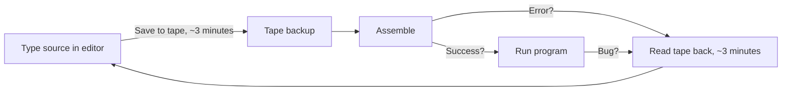

[← Home](../README.md) · [Toolchain](README.md)

# Native Toolchain — Assemblers, Monitors, and Editors That Ran on the Spectrum

> **Applies to**: All tracks. **Original** ZX Spectrum 16K/48K/128K/+2/+2A/+3 (1982–1992), **Soviet** clones (Pentagon, Scorpion, Kay, Profi, ATM Turbo — 1989–present), **New Gen** via Zeus 4 on ZX Spectrum Next. This article covers the era when the developer's editor, assembler, and debugger all ran *on the same machine* as the target program. For the modern PC/Mac/Linux alternative, see [Cross-Platform Toolchain](cross_platform_toolchain.md).

---

## Overview

For the first eight years of the ZX Spectrum's life — from the 16K launch in April 1982 through roughly 1990 — **every commercial Spectrum program was written, assembled, and debugged on a Spectrum**. Cross-assemblers existed but ran on minicomputers or expensive PCs that few developers could afford. The single-machine workflow was not a choice; it was the only practical option.

This workflow had one decisive advantage: **instant feedback**. The developer typed assembly, pressed a key, the assembler ran, and the result executed on the exact hardware the program would ship on. There were no emulator mismatches, no contention-model guesses, no transfer step. When code worked in Zeus or DevPac, it worked on every Spectrum ever made.

The cost was *everything else*. Editing happened in 24-row text windows on a flickery CRT. Source code lived on cassette tape (slow, sequential) until the TR-DOS disk interface arrived in 1985-1986. Assembling a 16 KB source file on a 3.5 MHz Z80 took minutes — and a single typo sent the developer back to the editor. Debuggers were primitive: a few breakpoints, a memory dump, a single-step key. Source code comments in the commercial era were often sparse because the developer *was* the maintenance team.

The native toolchain era produced **two distinct ecosystems**:

- **Western (1982–1990)**: dominated by **Zeus** (Crystal Computing, 1983) and **HiSoft DevPac / GENS-MONS** (1983). Commercial studios standardized on DevPac; serious hobbyists and small studios preferred Zeus. Both originated in the UK.
- **Soviet / post-Soviet (1989–2000s)**: dominated by **ALASM** and **XAS**, both Russian-developed, both tightly integrated with TR-DOS and the Pentagon/Scorpion clone hardware. Native development persisted far longer in the former Soviet Union because PCs were scarce and expensive through the late 1990s.

This article surveys both ecosystems and explains why the native workflow survived as long as it did — and why it still has niche practitioners in the 2020s.

### Native vs Cross-Platform at a Glance

| Aspect | Native (this article) | Cross-Platform (sibling article) |
|---|---|---|
| **Host** | The Spectrum itself | Modern PC, Mac, or Linux |
| **Edit-assemble-test loop** | Seconds (disk) to minutes (tape) | Milliseconds to seconds |
| **Hardware accuracy** | Exact — runs on the real thing | Requires emulator or transfer to hardware |
| **Editor quality** | Line editors (early) to full-screen (mid-1980s+) | Modern IDE: syntax highlighting, autocomplete, jump-to-definition |
| **Source control** | Manual tape/disk backups | Git, CI/CD, automated testing |
| **Era of dominance** | 1982–1995 (West), 1989–2005 (former USSR) | 1995–present |
| **Still used today?** | Hobbyist / demoscene purists | Universal |

> [!NOTE]
> The two articles are complementary. This one covers *what ran on the Spectrum*; [Cross-Platform Toolchain](cross_platform_toolchain.md) covers *what replaced it*. Per-tool deep-dives (zeus_assembler.md, devpac_gens_mons.md, alasm_sts.md, etc.) are planned as separate articles.

---

## The Pre-Assembler Era: Machine Code from BASIC

When the ZX Spectrum launched in April 1982, no assembler was commercially available for it. The first programs written in Z80 machine code were assembled by hand — the developer looked up opcodes in the Zilog manual, wrote the bytes in hexadecimal on paper, and entered them into the Spectrum through BASIC `DATA` statements and a `POKE` loader. Every commercial game in 1982-1983 was produced this way.

### The DATA/POKE Loader Pattern

The canonical 1982 workflow:

```basic
 10 REM Machine code loader
 20 FOR n = 0 TO 47
 30   READ d: POKE 30000 + n, d
 40 NEXT n
 50 DATA 62, 38, 211, 254, 201      ; LD A,#26: OUT (#FE),A: RET
 60 DATA 33, 0, 64, 34, 92, 91       ; LD HL,#4000: LD (#5B5C),HL
 70 DATA ...
100 RANDOMIZE USR 30000
```

The developer maintained the **decimal byte list** by hand. A 4 KB game was roughly 4,000 numbers typed across hundreds of `DATA` lines. A single typo — say `38` instead of `3B` — produced a crash that was nearly impossible to locate without a monitor program.

### Monitor Programs

A **monitor** was a small ROM-resident or tape-loaded program that exposed four primitive operations: examine memory, modify memory, execute at address, and (sometimes) single-step. Examples from 1982-1983:

| Monitor | Origin | Capability |
|---|---|---|
| **ROM's `USR`/`PEEK`/`POKE`** | Built-in | Minimal — only what BASIC provided |
| **MCT** (Machine Code Tester) | Various authors | Display/modify memory, simple disassembly |
| **SYS** | Tape-distributed | Add breakpoints, register inspection |
| **Snapshots via Interface 1** | Sinclair (1984) | Save/restore full machine state |

These were the only debugging tools available before the first integrated monitor/debugger packages (Zeus, MONS) appeared in 1983.

### Hex Loader Tapes

A 1983 alternative to `DATA` statements was the **hex loader** — a small BASIC program that read a string of hex bytes (`"3E26D3FEC9..."`), converted them two characters at a time, and `POKE`d them into memory. Magazines printed these hex strings; readers typed them in by hand. The `PRINT PEEK 23755 + 256 * PEEK 23756` checksum trick verified entry accuracy.

### Why This Was the Only Option

Cross-assemblers for Z80 existed in 1982-1983, but they ran on:

- **CP/M systems** with Z80 cards — typically S-100 bus machines costing $3,000+
- **PDP-11 and VAX minicomputers** — university or corporate equipment
- **Early IBM PC** with development tools — $1,500+ just for the PC

A Spectrum cost £125–£175. The audience for Spectrum development tools was Spectrum owners. The first commercial Spectrum assemblers therefore had to *run on the Spectrum*. This produced the toolchain surveyed in the next section.

---

## The Big Four Native Assemblers

Four native Z80 assemblers dominated the Spectrum's commercial and demoscene eras. Two were Western (Zeus, DevPac); two were Soviet (ALASM, XAS). Together they cover virtually all Spectrum-era Z80 development from 1983 through the late 1990s.

### Zeus (Crystal Computing / Simon Brattel & Neil Mottershead, 1983)

**Zeus** was the most ambitious Spectrum-native assembler ever built. Originally written by Neil Mottershead for the Nascom 2 and ported to the Spectrum by Mottershead and Simon Brattel in 1983, Zeus shipped as a commercial product from Crystal Computing at £12.95.

Zeus was distinguished by its integration: a full-screen editor, a macro assembler, a monitor, and a disassembler were all in one program. The user edited source in the editor, pressed a key to assemble, watched the assembly output appear inline, and could immediately drop into the monitor to debug. No other Spectrum assembler matched this level of integration until Zeus 4 in the 2010s.

**Zeus is unique among native assemblers in that it is still actively developed.** Simon Brattel continues to maintain Zeus 4 for the ZX Spectrum Next, with the latest releases adding Z80N instruction support, the `.nex` executable output format, and integration with the Next's expanded memory banking. No other native assembler has a 40+ year continuous development history.

Key Zeus features even in its 1983 form:

- Full-screen editor with cursor addressing (rare for 1983)
- Symbolic labels (not just numeric addresses)
- Conditional assembly (`IF`/`ELSE`/`ENDIF`)
- Macro definitions with parameters
- Built-in disassembler for reverse engineering
- Machine-code monitor with breakpoints and single-step

### HiSoft DevPac / GENS-MONS (HiSoft, 1983)

**HiSoft DevPac** was the workhorse of the commercial Spectrum era. Released in 1983 by HiSoft (UK) and refined through versions 2, 3, and 4 in the late 1980s, DevPac was a two-program suite:

- **GENS** — the assembler ("Generator of Equated Notes and Source")
- **MONS** — the monitor/debugger

DevPac's strengths were **speed and reliability**. GENS was a fast two-pass assembler that could handle large commercial game sources (16–32 KB of Z80) reliably. MONS provided the breakpoints, register display, and memory inspection that developers needed to track down crashes. The combination became the de facto standard at UK software houses through the late 1980s.

DevPac supported macros, conditional assembly, and the documented Z80 instruction set. Its editor was a full-screen editor by version 3 (1985), replacing the original line-based editor. The +3 disk version of DevPac 4 (1988) integrated directly with +3 DOS for fast source loading and saving.

DevPac's weakness was its conservatism — it did not pursue the experimental features (per-module frequency tables, packed pattern encoding, etc.) that Soviet-developed assemblers would adopt in the 1990s. By 1990 DevPac was mature but static, and the Soviet toolchain surge overtook it for new demoscene work.

### ALASM + STS (Various Russian Authors, 1992–2000s)

**ALASM** (ALenkin Assembler, sometimes "A.L.A.S.M.") is the dominant native assembler of the Soviet and post-Soviet Spectrum scene. Developed in several versions from 3.0 through 5.x by various Russian authors across the 1990s, ALASM was the standard tool at every major Russian demoscene party (CC, diHALT, CAFe) and at game studios targeting the TR-DOS ecosystem.

ALASM's defining features:

- **TR-DOS native**: source code, binaries, and assembled output lived on TR-DOS disk from the start. No tape workflow ever applied.
- **Fast assembly**: ALASM was specifically optimized for the slow Soviet clone hardware and could assemble large sources in seconds rather than minutes.
- **STS integration**: ALASM was paired with the **STS** debugger (Step Trace System), which provided hardware-assisted single-step and breakpoint capabilities on compatible clone hardware.
- **Multi-file projects**: ALASM supported `INCLUDE` directives for splitting large projects across multiple disk files — essential for ambitious demos.
- **Cyrillic comments**: source files routinely contained Russian-language comments in the Spectrum's character set.

ALASM versions 4 and 5 added improved editors, expanded macro support, and better TR-DOS file management. The tool remained in active use into the 2000s in the Russian scene and is still the reference assembler for legacy TR-DOS project restoration.

### XAS (Russian, v7.x–9.x)

**XAS** is ALASM's primary alternative in the Russian scene. Developed through versions 7, 8, and 9 across the 1990s, XAS targeted the same audience (Pentagon and Scorpion owners with TR-DOS) but emphasized different design choices:

- **Macro focus**: XAS's macro system was more elaborate than ALASM's, making it popular with the demoscene for generating repetitive code patterns (sprite data tables, scroll routines, music player routines).
- **Different editor model**: XAS used a more IDE-like editing model than ALASM's traditional editor, with multi-window source views on compatible hardware.
- **Scene adoption**: XAS was particularly popular at the **Elite Group** and **Progress** demoscene crews, while ALASM dominated elsewhere.

Both ALASM and XAS targeted the same TR-DOS file formats and produced compatible binary output. The choice between them was largely a matter of crew/scene tradition.

### Feature Comparison Matrix

| Feature | Zeus (1983+) | DevPac / GENS (1983+) | ALASM (1992+) | XAS (1990s) |
|---|---|---|---|---|
| **Origin** | UK (Crystal Computing / Brattel) | UK (HiSoft) | Russia | Russia |
| **Editor** | Full-screen (1983!) | Line → full-screen (v3, 1985) | Full-screen, multi-window | Full-screen, IDE-like |
| **Macro assembler** | ✅ | ✅ | ✅ | ✅ (elaborate) |
| **Conditional assembly** | ✅ | ✅ | ✅ | ✅ |
| **Integrated monitor** | ✅ Built-in | ✅ (MONS, separate program) | ✅ (STS, separate program) | ⚠️ (external tools) |
| **Disassembler** | ✅ Built-in | ⚠️ (separate) | ⚠️ (separate) | ⚠️ (separate) |
| **TR-DOS native** | ❌ (UK tape/disk) | ❌ (UK tape/+3 disk) | ✅ (designed for TR-DOS) | ✅ (designed for TR-DOS) |
| **Multi-file projects** | Limited | Limited | ✅ `INCLUDE` | ✅ `INCLUDE` |
| **Z80N (Next) support** | ✅ (Zeus 4, modern) | ❌ | ❌ | ❌ |
| **Active development** | ✅ (Zeus 4 by Brattel, 2020s) | ❌ (final release 1988) | ❌ (frozen at v5) | ❌ (frozen at v9) |
| **Typical source size** | Up to 16 KB | Up to 32 KB | Up to 64 KB (TR-DOS) | Up to 64 KB (TR-DOS) |

> [!NOTE]
> **TASM is not in this table** — there are two unrelated TASM-named tools. The native Spectrum TASM (a simple 1980s assembler) is covered below under minor tools. The cross-platform **TASM (Telemark Assembler)** is a different DOS-era product covered in [Cross-Platform Toolchain](cross_platform_toolchain.md). Confusing the two is a common mistake in modern retro-dev discussions.

---

## Minor and Specialist Native Assemblers

Beyond the big four, a long tail of less widely adopted assemblers served niche audiences. Each has some claim to historical importance.

### TASM (Native Spectrum Version)

Not to be confused with the later DOS-based Telemark Assembler (covered in the cross-platform article), the native **TASM** was a simple early-1980s Z80 assembler for the Spectrum. It supported the documented Z80 instruction set and basic label usage but lacked macros or conditional assembly. TASM was distributed on tape and saw limited use among hobbyists in 1983-1985, after which it was largely replaced by DevPac and Zeus.

### ZXASM 3.0

**ZXASM 3.0** was a Russian-developed native assembler with tight integration to the **STS** debugger (the same STS paired with ALASM). ZXASM targeted developers who wanted STS debugging without adopting ALASM's full workflow. The tool was less widely used than ALASM but had a loyal following among developers who preferred its editor.

### PikAsm

**PikAsm** was a specialist assembler paired with the **VAST** toolchain in some professional Soviet-era workflows. PikAsm targeted a narrower audience than ALASM/XAS but had a reputation for clean macro handling and was used in several commercial Soviet clone game productions.

### Laser Genius (Ocean)

**Laser Genius**, distributed by Ocean Software, was a cartridge-based assembler for the Spectrum's Interface 2 ROM cartridge port. The cartridge format meant instant load (vs. minutes for a tape-loaded assembler) — a significant productivity advantage for early-1980s commercial work. Laser Genius was used internally at Ocean and licensed to a small number of partner studios. Its closed distribution model limited its broader influence.

### AVRA and Other Minor Tape-Era Tools

Several other assemblers saw limited distribution in the 1982-1985 tape era, including **AVRA** and various one-off tools published in magazines. Most are of historical interest only — they typically supported only the documented Z80 instruction set, lacked macros, and were replaced by DevPac or Zeus as soon as those tools became widely available.

---

## The Editor Workflow: Line Editors to Full-Screen

The native-era developer's daily experience was dominated by the **edit-assemble-test loop**. The friction in this loop drove most toolchain evolution from 1982 to 1990.

### Line Editors (1982–1984)

The earliest Spectrum assemblers inherited the **line editor** model from Sinclair BASIC: source code was edited one line at a time, with line numbers, exactly like a BASIC listing. To change a single instruction, the developer re-typed the entire line. There was no cursor-addressable full-screen editing.

```
100  LD HL,#4000       ; screen base
110  LD (HL),0          ; clear first byte
120  INC HL             ; next
130  DEC BC
140  LD A,B
150  OR C
160  JR NZ,110
```

The line editor was usable but slow. A 4 KB source file could have 400+ lines, and navigating to a specific line required either typing the line number or scrolling sequentially.

### Full-Screen Editors (1985+)

The arrival of full-screen editors on the Spectrum (Zeus had this in 1983; DevPac gained it with version 3 in 1985) was a major productivity breakthrough. The developer could now move the cursor anywhere in the source, edit in place, and see the surrounding context. Source files looked more like modern text files:

```
; ----------------------
; Clear screen routine
; ----------------------
Clear_Screen:
    LD  HL,#4000          ; screen base
    LD  (HL),0            ; clear first byte
    LD  DE,#4001
    LD  BC,#17FF          ; 6143 bytes
    LDIR                  ; block-fill with 0
    RET
```

Full-screen editing reduced the cost of writing well-commented source — which in turn improved code quality and made maintenance practical.

### Tape Workflow: The Slow Era

On tape-only 48K Spectrums (1982–1985), the edit-assemble-test loop was painful:



Each loop iteration could take 5–10 minutes if a tape save and reload were involved. Developers adopted strategies to minimize tape usage:

- **Resident source**: keep source in RAM, only save to tape at the end of a session
- **Small test programs**: assemble tiny fragments in isolation rather than the full project
- **Printed listings**: keep a paper copy of stable source code as a backup against tape failure

### TR-DOS Revolution (1985+)

The TR-DOS disk interface (Beta Disk interface, 1985) changed everything. Source load/save dropped from minutes to seconds, multi-file projects became practical via `INCLUDE`, and the developer could keep multiple source files, binaries, and asset files on the same disk. The edit-assemble-test loop dropped to 10–30 seconds, comparable to early PC assemblers.

The Soviet clone scene adopted TR-DOS as its **universal** disk interface — every Pentagon, Scorpion, and Kay came with TR-DOS support. This is why ALASM and XAS were designed TR-DOS-first: by the time they were developed (early 1990s), the entire Soviet scene was disk-based.

### RAM Disk Tricks on 128K

The 128K, +2, +2A, and +3 introduced banked memory. Some advanced workflows used the upper memory banks as a **RAM disk** — loading source code into upper banks, switching banks to assemble against a different source file, and keeping the main 48K bank free for the editor and assembler. This technique, popular with Zeus power users and later Soviet developers, effectively eliminated disk I/O during the edit-assemble-test loop.

---

## Debuggers and Monitors

Native development required native debugging. Three monitor/debugger traditions emerged:

### The HiSoft MONS Tradition

**MONS** (the monitor half of HiSoft DevPac) was the canonical commercial debugger of the 1980s. It provided:

- **Memory display** in hex and ASCII, with cursor-addressable editing
- **Register display** (AF, BC, DE, HL, IX, IY, SP, PC, I, R)
- **Breakpoints** — set a 1-byte `RST #38` or similar trap at an address; MONS catches the trap and re-enters its display
- **Single-step** — execute one instruction and re-enter the display
- **Disassembly** — show memory as Z80 mnemonics (read-only)

MONS was a separate program from GENS (the assembler). The developer assembled the program to memory or disk, exited GENS, loaded MONS, loaded the program, set breakpoints, and ran. The split workflow was tolerable but tedious for tight iteration.

### The STS Tradition (Russian)

**STS** (Step Trace System) was the Russian-scene debugger that paired with ALASM and ZXASM. STS was distinguished by **hardware-assisted debugging** on compatible clone hardware:

- The Scorpion, Profi, and some Pentagon variants shipped with a **physical NMI button** wired to the Z80's NMI line
- Pressing the button vectored execution to STS's ROM-resident handler, which captured register state and dropped into the STS display
- This provided a hardware-assisted breakpoint *anywhere* in any program — including commercial games the developer was reverse engineering

STS was therefore not just a development tool but a **reverse engineering tool**. The Russian scene's strong reverse engineering tradition (visible in the many demoscene cracktros and intros from the era) was directly enabled by STS+NMI hardware.

### The Zeus Integrated Tradition

**Zeus** alone among major Spectrum assemblers integrated the monitor into the assembler itself. The user could assemble, hit a key, drop into the monitor, debug, hit a key, return to the editor at the exact line being debugged. This tight integration was Zeus's defining productivity advantage and was not matched by any other native tool until Zeus 4 in the 2010s.

### Capability Comparison

| Capability | MONS (DevPac) | STS (ALASM/ZXASM) | Zeus Monitor |
|---|---|---|---|
| Memory display/edit | ✅ | ✅ | ✅ |
| Register display | ✅ | ✅ | ✅ |
| Breakpoints | ✅ (software trap) | ✅ (software + hardware NMI) | ✅ (software trap) |
| Single-step | ✅ | ✅ | ✅ |
| Disassembly | ✅ (read-only) | ✅ | ✅ (in editor) |
| Integrated with editor | ❌ (separate program) | ⚠️ (separate but tightly coupled) | ✅ (one program) |
| Hardware NMI support | ❌ | ✅ (Scorpion/Profi/Pentagon) | ⚠️ (emulated in Zeus 4) |

### Hardware-Assisted Debugging Tricks

Beyond the STS NMI button, native-era developers invented several hardware-assisted debugging techniques:

- **Switchable ROM pagers**: some clones allowed swapping the system ROM for a debug ROM at the press of a button, providing monitor access even when the target program had crashed the system ROM
- **Logic analyzers on the expansion bus**: professional studios (Ocean, Gremlin) occasionally hooked logic analyzers to the Spectrum's edge connector to capture exact bus activity for timing-sensitive bugs
- **Custom NMI cartridges**: developers without STS-compatible clones built simple NMI-button cartridges that vectored to a tiny monitor routine

These tricks were the 1980s equivalent of today's In-Circuit Emulator (ICE) debugging.

---

## Library and Asset Tools (Native)

A complete development workflow needed more than just an assembler. The native-era Spectrum ecosystem developed a healthy layer of supporting tools.

### Sprite Editors

- **SSA** (Spectrum Sprite Animator): one of the earliest sprite editors, allowing the artist to draw 16×16 or 32×24 sprites and export them as binary data with `INCLUDE`-compatible `.asm` files
- **Sprite Designer** (various versions): similar functionality with additional attributes-per-sprite editing
- **AGD (Arcade Game Designer)**: a later, BASIC-like game construction tool that integrated sprite editing, level design, and a built-in game framework — the native Spectrum equivalent of modern game engines like Unity, albeit far simpler

### Screen Designers and Font Editors

Screen designers allowed pixel-level editing of the full 256×192 display with attribute (color) overlay. Examples included **The Artist**, **Paint Brush**, and various demoscene-internal tools. Font editors supported the 8×8 character ROM format and allowed custom font creation for use in demos and games.

### Music

Music editors were a major category. The native Spectrum scene produced:

- **Sound Tracker 1.1** (1990) — the first AY pattern-grid tracker (covered in [sound_tracker.md](../06_sound/trackers_and_formats/sound_tracker.md))
- **Asc Sound Master** (1992) — Soviet alternative (covered in [asc_sound_master.md](../06_sound/trackers_and_formats/asc_sound_master.md))
- **Pro Tracker 1/2/3** (1995–1997) — the format-defining lineage (covered in [protracker.md](../06_sound/trackers_and_formats/protracker.md))

All of these were native Spectrum programs that produced module files playable by small Z80 player routines embedded in games and demos.

> [!NOTE]
> The cross-references to `06_sound/trackers_and_formats/` reflect that the music subculture was so active in the native era that it generated its own complete toolchain ecosystem. AY music composition deserves (and has) its own dedicated article series separate from the general assembler/monitor toolchain.

---

## Track Differences

The native toolchain era split sharply along the three tracks defined in this knowledge base.

### Original Track (Western, 1982–1995)

In the UK and Western Europe, native Spectrum development followed a clear arc:

- **1982–1983**: pre-assembler era; machine code from BASIC `DATA` loaders; magazine hex listings
- **1983–1985**: Zeus and DevPac dominate; tape workflow; commercial studios standardize on DevPac, hobbyists and small studios use Zeus
- **1985–1990**: TR-DOS, +3 disk, and RAM-disk tricks improve the loop; DevPac 3/4 and Zeus 2/3 mature
- **1990–1995**: cross-platform development (initially on Amiga, then PC) gradually displaces native work for commercial games; native work continues for the demoscene

The Western commercial industry moved off native Spectrum development roughly between 1990 (when cross-platform Z80 assemblers on the Amiga became practical) and 1993 (by which point the commercial Spectrum market was itself dying). After 1993, native Western Spectrum development was almost entirely demoscene or hobbyist.

### Soviet Track (1989–2000s)

The Soviet and post-Soviet scene followed a **very different timeline** for three structural reasons:

1. **Hardware scarcity delayed the migration**: PCs and Amigas were scarce and expensive in the former USSR through the mid-1990s. A Pentagon clone in 1993 cost a fraction of an entry-level PC.
2. **TR-DOS-first design**: ALASM and XAS were designed from the start for disk-based development, removing the worst pain point of the early Western native workflow (tape-based source code)
3. **Demoscene economics**: Soviet demoscene parties (CC, diHALT) continued to accept Spectrum entries as the primary category through the early 2000s, sustaining a viable native development scene

As a result, ALASM and XAS remained in active use through the late 1990s, with some developers continuing native work into the 2000s. The Cyrillic UI and Cyrillic source comments of the Russian tools were not obstacles in the local scene — they were features.

> [!IMPORTANT]
> The persistence of native Spectrum development in the former Soviet scene is **not** a sign of technological backwardness. It reflects rational economic decisions in a context where the alternative (PC-based cross-development) was unaffordable through the late 1990s. By the time PCs became affordable in the former USSR, the Spectrum scene had matured into a distinct subculture with its own toolchain conventions — and the transition to cross-platform development happened gradually, on local terms.

### New Gen Track (2010s–present)

The ZX Spectrum Next, launched in 2020, revived the native toolchain concept for a modern audience. **Zeus 4**, developed by Simon Brattel for the Next, is the only native assembler that supports the Next's Z80N extended instruction set, the `.nex` executable format, and the Next's expanded memory banking. Modern Next developers can use Zeus 4 for an authentic native experience — or use cross-platform SjASMPlus, which also supports Z80N and `.nex` output.

The other New Gen platforms (Sprinter, ZX Evolution with TS-Conf) have smaller development communities that use a mix of cross-platform tools and Russian-native legacy tools.

---

## Why Native Tools Still Matter (and Modern Substitutes)

Most Spectrum development in 2025 is cross-platform (covered in the sibling article). Native development survives in four niches:

### 1. Historical Authenticity

Software restorations, museum installations, and educational demonstrations benefit from using the original tools. A demo of how a 1986 game was developed is more authentic on Zeus or DevPac than on a modern PC assembler.

### 2. Demoscene Purity

A small but active demoscene subculture insists on writing code on real hardware, often for the **1k** and **4k intro** competition categories where the constraint of developing on the target machine is part of the artistic statement.

### 3. Cycle-Exact Analysis

Some timing-sensitive analysis — particularly contention-model verification, floating-bus experiments, and per-cycle video beam positioning — is easier to perform on the real hardware than on an emulator. A native monitor running on the real machine can observe behavior that no emulator-based debugger can.

### 4. Restoration of Source Code

When restoring commercial-era source code from binaries, native assemblers can produce output that matches the original byte-for-byte (down to label allocation, expression evaluation, and assembler quirks). This is sometimes important for archival accuracy.

### When to Choose Native (Decision Guide)

| Scenario | Choose Native If... | Otherwise Use Cross-Platform |
|---|---|---|
| **Learning Z80 basics** | You want period authenticity | You want fast iteration (recommended) |
| **Demoscene intro (1k/4k)** | The compo requires native development | Cross-platform is fine; size-optimize with SjASMPlus |
| **Reverse engineering** | You need cycle-exact hardware observation | ZEsarUX or Fuse emulation is sufficient |
| **ZX Next development** | You want Zeus 4's integrated experience | SjASMPlus + VS Code is more modern (recommended) |
| **Restoring lost source** | Byte-exact assembler-quirk matching matters | Modern cross-assembler reconstruction is fine |

For the overwhelming majority of modern Spectrum development, **cross-platform tooling** (covered in [Cross-Platform Toolchain](cross_platform_toolchain.md)) is the right choice. Native tooling remains valuable for the four niches above and for historical understanding — which is the primary purpose of this article.

---

## Cross-References

- [Cross-Platform Toolchain](cross_platform_toolchain.md) — the sibling article covering modern PC/Mac/Linux tooling
- [Tracker History](../06_sound/trackers_and_formats/tracker_history.md) — the 30-year lineage of ZX music trackers, all native-developed
- [Sound Tracker 1.1](../06_sound/trackers_and_formats/sound_tracker.md) — the first AY tracker, a native Spectrum program
- [Pro Tracker](../06_sound/trackers_and_formats/protracker.md) — the format-defining native lineage (1995–1997)
- [Assembly Development](../05_development/02_assembly/README.md) — programming concepts that the native toolchain supports
- [BASIC Development](../05_development/01_basic/README.md) — the pre-assembler environment

Planned per-tool deep-dives (separate articles in this directory):

- `zeus_assembler.md` — Zeus (1983+) and Zeus 4 for ZX Next
- `devpac_gens_mons.md` — HiSoft DevPac / GENS-MONS
- `alasm_sts.md` — ALASM and STS
- `xas_assembler.md` — XAS
- `spectrum_basic_mcode.md` — machine code from BASIC (pre-assembler era)

## References

- [Spectrum Computing — Zeus Assembler entry](https://spectrumcomputing.co.uk/entry/9010/ZX-Spectrum/Zeus_Assembler) — catalogue and download
- [Spectrum Computing — HiSoft Devpac entry](https://spectrumcomputing.co.uk/entry/8091/ZX-Spectrum/HiSoft_Devpac) — DevPac download and metadata
- [HiSoft DevPac 4 manual (PDF)](https://worldofspectrum.org/pub/sinclair/games-info/h/HiSoftDevpacV4.0.pdf) — primary documentation
- [desdes.com — Zeus Z80 Assembler resources](https://www.desdes.com/products/oldfiles/zeus.htm) — modern Zeus distribution and extras
- [Simon Goodwin's Zeus Next extras](https://simon.mooli.org.uk/nextech/z80n/index.html) — Z80N additions for Zeus on the ZX Next
- [Wikipedia — Zeus Assembler](https://en.wikipedia.org/wiki/Zeus_Assembler) — historical summary
- [zx-pk.ru](https://zx-pk.ru) — primary Russian-language forum; ALASM, XAS, and STS discussions concentrate here
- [Break Into Program — Retro Computer Festival 2024](http://www.breakintoprogram.co.uk/events/retro-computer-festival-2024-exhibit-4) — hands-on Zeus demonstration
- [zxart.ee — Assembler/MCode archive](https://zxart.ee/eng/software/system-software/programming/assemblermcode/) — searchable archive of native assemblers

