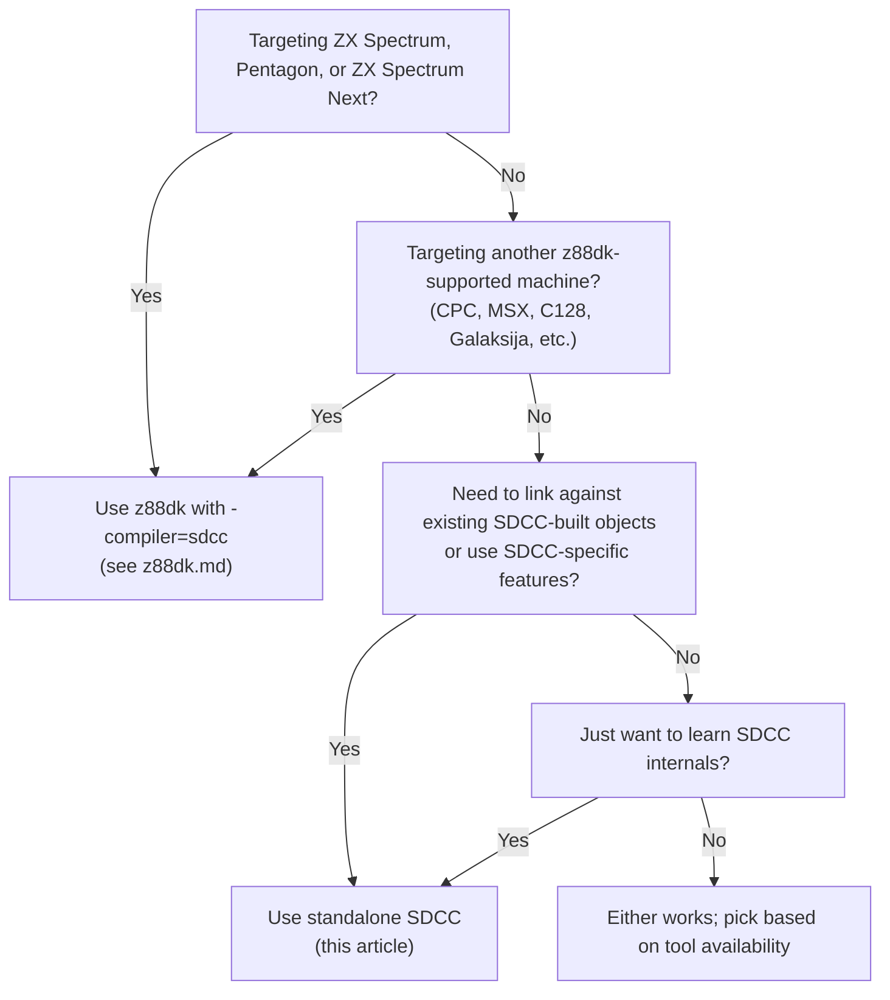

[← Toolchain](README.md) · [← z88dk](z88dk.md)

# SDCC — Small Device C Compiler (Standalone Reference)

**SDCC** (Small Device C Compiler) is the leading open-source C compiler for 8-bit microprocessors. It supports the Z80 family (Z80, Z180, GBZ80, Rabbit 2000/3000, R800, eZ80), the Zilog Z80's primary 8-bit rivals (MCS51, STM8, PDK13/14/15, HC08, S08), and several others. For the ZX Spectrum developer it is one of the three ways to compile C: stand-alone SDCC, z88dk-sccz80 (z88dk's native compiler), or z88dk's patched SDCC (`-compiler=sdcc`) wrapped inside the `zcc` front-end.

This article is the canonical reference for using SDCC **standalone** — i.e. invoking `sdcc -mz80` directly, without z88dk's `zcc` wrapper. The z88dk integration is documented in [z88dk.md](z88dk.md); this article complements that one by explaining what the wrapper abstracts away and how to use SDCC directly when z88dk is unavailable, undesirable, or when you need a feature that z88dk patches out.

> [!TIP]
> **For most ZX Spectrum work, use [z88dk](z88dk.md) instead of standalone SDCC.** z88dk's `zcc -compiler=sdcc` runs the same SDCC compiler with a much better library, automatic CRT0 selection, target-specific I/O, and a single-command build for `.tap` / `.sna` / `.nex`. Standalone SDCC is the right choice when (a) you are targeting generic Z80 hardware not in z88dk's target list, (b) you are studying how SDCC works internally, (c) you need to interoperate with other SDCC-built object files, or (d) you want to avoid z88dk's patch set and use the canonical SDCC release. This article documents all four cases.

---

## Scope and Coverage

This article covers:

- **SDCC's Z80 port specifically** — `sdcc -mz80` and `sdasz80` / `sdldz80` (assembler and linker). Other SDCC ports (MCS51, STM8, etc.) are out of scope.
- **The standalone toolchain**: `sdcc`, `sdcc-bin`, `sdasz80` (or `sdas+z80`), `sdldz80`, `sdcdb`, `sdcdb-frontend`, `ucsim`.
- **The C dialect** that SDCC accepts (`--std-sdcc89`, `--std-sdcc99`, partial C99), the calling conventions, the segment model, and the runtime expectations.
- **Output formats**: Intel HEX (`.ihx`), binary via `makebin`, ELF/DWARF (experimental in current SDCC).
- **Debugging**: `.cdb` (Code Database) format and the `sdcdb` source-level debugger. `.cdb` is also consumed by other tools (z88dk-gdb, DeZog via translation layers).
- **Integration patterns**: how to link SDCC-compiled objects against hand-written assembly (SjASMPlus, sdasz80, GAS Z80) and how to bring up a bare-metal target with a custom `crt0.s`.

This article does **not** duplicate [z88dk.md](z88dk.md)'s coverage of the z88dk library API, the `+target` system, `appmake`, or z88dk-specific pragmas. The two articles are complementary: this one is the canonical SDCC reference, [z88dk.md](z88dk.md) is the canonical z88dk reference, and the [Comparison](#comparison-standalone-sdcc-vs-z88dk-sdcc) section below tells you when to use which.

---

## A Brief History of SDCC's Z80 Port

| Year | Event |
|---|---|
| 2000 | SDCC project starts as an open-source Small-C descendant, originally targeting MCS51 (8051). |
| 2003–2005 | **Z80 port added** by the SDCC community. The port shares the C front-end with MCS51 but has its own back-end code generator. |
| 2008 | GBZ80 (Game Boy Z80 variant) port added. |
| 2010 | **z88dk integration begins**: z88dk patches SDCC to share the same library model as sccz80, allowing mix-and-match compilation. |
| 2013 | Z180 port added (extended Z80 with 16-bit registers and MMU). |
| 2014 | Rabbit 2000/3000 port added. |
| 2017 | R800 port added (MSX2+/turboR Z80 variant). |
| 2019 | SDCC 4.0 ships — major code-quality improvements for Z80, including better register allocation and the lospre pass. |
| 2021–2024 | Active maintenance. SDCC 4.2 (2023) refines Z80 code generation further; peephole optimizer rules improved. |
| 2025 | **4.3.0** current release; `.cdb` debug format extended; experimental DWARF output for some ports. |

The Z80 port has been a first-class SDCC target since the mid-2000s. Today it produces competitive code quality — within 10–20% of hand-written assembly for typical algorithmic code, and often better than z88dk's legacy sccz80 for floating-point-heavy code (SDCC has its own optimized float library).

---

## Installation

### Pre-built binaries

SDCC ships pre-built for the major platforms. Download from <https://sdcc.sourceforge.net/>.

| Platform | Package | Notes |
|---|---|---|
| **Windows** | Installer `.exe` from sourceforge | Adds SDCC to PATH; includes sdcdb. |
| **macOS** | `brew install sdcc` | Homebrew formula tracks recent releases. |
| **Linux (Debian/Ubuntu)** | `apt install sdcc` | Often a release or two behind; build from source for latest. |
| **Linux (Fedora)** | `dnf install sdcc` | Same caveat. |
| **FreeBSD** | `pkg install sdcc` | Ports tree also has a `devel/sdcc` option for HEAD. |

Verify the installation:

```bash
sdcc --version
# SDCC : mcs51/z80/z180/r2k/r3ka/gbz80/tlcs90/ez80_z80/z80n STM8 ... 4.3.0 # ...
```

The list of supported ports in the version string confirms the Z80 backend is built in. If only `mcs51` appears, your SDCC was built without Z80 support — build from source.

### Building from source

Building from source is needed for the latest features or when your distro's package lacks the Z80 backend:

```bash
# 1. Get the source
svn co https://svn.code.sf.net/p/sdcc/code/trunk sdcc
# or: download the 4.3.0 release tarball

cd sdcc

# 2. Configure (you need Boost, bison, flex, gputils optionally)
./configure --prefix=$HOME/.local/sdcc

# 3. Build and install
make -j$(nproc)
make install

# 4. Add to PATH
export PATH="$HOME/.local/sdcc/bin:$PATH"
sdcc --version
```

On macOS, install dependencies first: `brew install boost bison flex gputils`. The build takes ~5 minutes on a modern laptop.

### The SDCC toolchain layout

After installation, the SDCC `bin/` directory contains several tools. The relevant ones for Z80 development:

| Tool | Purpose |
|---|---|
| `sdcc` | The C compiler. Drives preprocessing, compilation, assembly, and linking in one invocation (or stops at any stage with `-c`, `-S`, or `-E`). |
| `sdcc-bin` | Internal helper invoked by `sdcc` for some ports. Not normally called directly. |
| `sdcpp` | The C preprocessor (a fork of gcc's cpp). Invoked automatically by `sdcc`. |
| `sdasz80` (or `sdas+z80`) | The Z80 assembler. Assembles `.s` / `.asm` files into `.rel` (SDCC's relocatable object format). |
| `sdldz80` (or `sdld+z80`) | The Z80 linker. Combines `.rel` files and library `.lib` files into a final `.ihx` (Intel HEX). |
| `sdar` | Archiver — creates `.lib` library files from `.rel` objects. |
| `sdcdb` | The source-level debugger. Reads `.cdb` debug info and debugs `.ihx` programs. |
| `sdcdb-frontend` | Optional GUI front-end for sdcdb. |
| `makebin` | Converts `.ihx` (Intel HEX) into a raw binary `.bin`. |
| `ucsim` | Simulator/emulator for several SDCC targets including Z80. Useful for testing without real hardware or an external emulator. |

The naming convention `sdasz80` / `sdldz80` is older; some installations use `sdas+z80` / `sdld+z80` instead (the `+` form is from newer SDCC). The two are equivalent.

### Where SDCC looks for headers and libraries

SDCC has a built-in search path, typically:

- `/usr/local/share/sdcc/include` (or wherever `--prefix` pointed during build)
- `/usr/local/share/sdcc/lib/z80` for Z80-specific libraries

Inspect with `sdcc --print-search-dirs`.

---

## Command-Line Reference (Z80-specific)

SDCC's flag surface is large because it covers many ports. The flags below are the Z80-relevant subset — anything marked `(MCS51 only)` in the SDCC manual can be ignored for Z80 work.

### Selecting the target

```bash
sdcc -mz80       hello.c        # Z80
sdcc -mz80n     hello.c        # Z80N (ZX Spectrum Next; same as -mz80 + Z80N extensions)
sdcc -mz180     hello.c        # Z180 (extended Z80)
sdcc -mgbz80    hello.c        # Game Boy Z80 (slightly different opcode set)
sdcc -mr2k      hello.c        # Rabbit 2000
sdcc -mr3ka     hello.c        # Rabbit 3000A
sdcc -m ez80_z80 hello.c       # eZ80 in Z80-compatibility mode
```

For Spectrum development use `-mz80` (or `-mz80n` for Next assembly language).

### C dialect

| Flag | Effect |
|---|---|
| `--std-c89` | Strict C89. Most SDCC extensions disabled. |
| `--std-sdcc89` | **(default)** C89 + SDCC-specific extensions (`__sfr`, `__at`, `__interrupt`, etc.). |
| `--std-c99` | C99 (incomplete — some constructs unsupported). |
| `--std-sdcc99` | C99 + SDCC extensions. Recommended for new code. |
| `--funsigned-char` | Make `char` unsigned by default (avoids surprises on Z80). |

### Output control

| Flag | Effect |
|---|---|
| `-S` | Compile to `.asm` only; do not assemble or link. |
| `-c` | Compile and assemble to `.rel`; do not link. |
| `-E` | Preprocess only. |
| `-o path` | Output path (file or directory). |
| `--no-std-crt0` | Do not link the default CRT0. **Always use this for ZX Spectrum targets** (you provide your own). |
| `--codeseg NAME` | Put code (and `const`) in `.area _NAME` instead of `.area _CODE`. |
| `--constseg NAME` | Documented but **does not work for Z80** — consts always land in the code segment. |

### Memory placement

```bash
sdcc -mz80 --no-std-crt0 --code-loc 0x8000 --data-loc 0xC000 \
     --stack-loc 0xFF00 hello.c crt0.rel
```

| Flag | Meaning |
|---|---|
| `--code-loc N`   | Address of the `_CODE` segment. |
| `--data-loc N`   | Address of the `_DATA` segment (initialized data). |
| `--stack-loc N`  | Initial value of SP. |

These are *linker* options, but `sdcc` forwards them to `sdldz80` automatically.

### Optimization

| Flag | Effect |
|---|---|
| `--opt-code-speed` | Optimize for speed (limited effect on Z80). |
| `--opt-code-size` | Optimize for size (limited effect on Z80). |
| `--max-allocs-per-node N` | Tune the register allocator. Default 3000; raise for more aggressive optimization (slower compile, sometimes better code), lower for faster compile. |
| `--no-peep` | Disable peephole optimizer. Use when investigating code-gen bugs. |
| `--peep-file FILE` | Add extra peephole rules. |
| `--nogcse` / `--noloopreverse` / `--nolospre` | Disable specific optimization passes. |
| `--oldralloc` | Use the legacy register allocator (sometimes produces different code). |

For best results on Z80, experiment with `--max-allocs-per-node 100000` (slow compile, slightly better code) on release builds.

### Code generation specifics

| Flag | Effect |
|---|---|
| `--callee-saves fn1,fn2,...` | Save/restore registers in the named functions (default: caller saves). |
| `--all-callee-saves` | All functions save/restore registers. |
| `--callee-saves-bc` | Always save/restore BC on entry/exit (smaller code at call sites, larger per-function). |
| `--fomit-frame-pointer` | Omit the IX frame pointer (frees IX for general use; saves 2 bytes per function). |
| `--fno-omit-frame-pointer` | Always use a frame pointer (default; needed for some debugging). |
| `--reserve-regs-iy` | Do not use IY as a general register. Required when calling into ZX ROM (which uses IY for system variables). |
| `--debug` | Emit `.cdb` debug info (essential for source-level debugging — see [§ Debugging](#debugging-sdcc-and-cdb)). |

### Pragmas (in source)

SDCC supports `#pragma` directives that mirror many command-line flags. Pragmas apply to the rest of the current translation unit (or until changed).

```c
#pragma save          // save current pragma state
#pragma codeseg BANK2 // subsequent code goes in .area _BANK2
#pragma restore       // restore prior state

#pragma callee_saves my_function   // my_function will save registers itself
#pragma opt_code_speed              // optimize this file for speed
#pragma less_pedantic               // silence a few common warnings
#pragma disable_warning 110         // disable specific warning
```

### Defines defined by SDCC

The compiler predefines several macros. The most useful for portable code:

```c
#ifdef __SDCC
  /* This is SDCC, not gcc/clang */
  #ifdef __SDCC_z80
    /* Targeting Z80 */
  #endif
#endif

#if __STDC_VERSION__ >= 199901L
  /* --std-c99 or --std-sdcc99 active */
#endif
```

`__SDCC_VERSION_MAJOR`, `__SDCC_VERSION_MINOR`, `__SDCC_VERSION_PATCH` are also defined — useful for working around bugs in specific SDCC releases.

---

## Calling Conventions and ABI

SDCC's Z80 ABI is **stack-based**: function arguments are pushed on the stack by the caller, and locals live on the stack inside the callee. This is the same fundamental design as gcc's Z80 port, but the details differ.

### Function prologue / epilogue

A typical SDCC-compiled function:

```z80
_my_function:
    push  ix
    ld    ix, 0
    add   ix, sp             ; IX = frame pointer
    ; ... allocate locals by subtracting from SP ...
    ; ... function body ...
    ld    sp, ix             ; restore SP
    pop   ix
    ret
```

The frame pointer (IX) is always present unless `--fomit-frame-pointer` is used. Arguments are accessed at positive offsets from IX (`4(ix)`, `6(ix)` ...), locals at negative offsets.

### Argument passing

Arguments are pushed **right-to-left** (C89-style) on the stack. The leftmost argument is at the lowest stack address.

```c
void f(int a, int b, int c);
// Caller code (sketch):
//   ld hl, c_value
//   push hl
//   ld hl, b_value
//   push hl
//   ld hl, a_value
//   push hl
//   call _f
//   ; stack cleanup by caller (small-c convention):
//   pop bc, bc, bc   ; or add sp, 6
```

Note: this is the **caller-cleans** variant (SDCC's default). The compiler supports `--callee-saves` to make specific functions clean up their own stack (similar to z88dk's `__z88dk_callee`).

### Return values

- `char`, `unsigned char`, `int`, `unsigned int`, pointer: returned in **HL** (high byte in H, low in L). An 8-bit value goes in L.
- `long`, `unsigned long`, `float`: returned in **DEHL** (most-significant in D, least-significant in L).
- `struct` returns: by implicit pointer argument (SDCC rewrites `return s;` as `memcpy(implicit_ret_ptr, &s, sizeof(s));`).
- `void`: no return value.

### Register preservation

**By default, the caller saves registers.** Any register that needs to survive a function call must be pushed before the call and popped after.

Alternative: use `--callee-saves fn` (or `--all-callee-saves`) to make the callee save/restore everything it touches. This is more efficient when calling small functions from larger ones (the push/pop is done once per function instead of once per call site).

For ISRs (`__interrupt` functions), SDCC automatically saves and restores all registers it touches. Use `#pragma exclude` to suppress saving specific registers in an ISR.

### Mixed C and assembly

SDCC's inline assembly syntax:

```c
__asm
    ; Z80 assembly here (sdasz80 syntax)
    ld a, (hl)
    inc hl
    ld (hl), a
__endasm;
```

For non-trivial assembly, write a separate `.s` file (sdasz80 syntax) and link it in:

```make
hello.ihx: hello.c helper.s crt0.s
	sdcc -mz80 --no-std-crt0 --debug -c hello.c
	sdasz80 -g crt0.s
	sdasz80 -g helper.s
	sdcc -mz80 --no-std-crt0 --debug hello.rel crt0.rel helper.rel
```

### Calling a C function from assembly

The idiom (caller is assembly, callee is C):

```z80
; Caller: call _my_function(int x, int y)
; Push right-to-left, call, then pop:
        ld   hl, y_value
        push hl
        ld   hl, x_value
        push hl
        call _my_function
        pop  bc          ; discard x
        pop  bc          ; discard y
        ; return value is in HL
```

### SDCC vs z88dk calling conventions

The two compilers have **different ABIs** — you cannot directly link SDCC objects against sccz80 objects. The key differences:

| Aspect | SDCC (standalone) | z88dk sccz80 | z88dk -compiler=sdcc |
|---|---|---|---|
| Argument push order | Right-to-left | Left-to-right | Right-to-left (SDCC native) |
| Stack cleanup | Caller (default) | Caller (default) | Caller (default) |
| `__z88dk_fastcall` | n/a | One arg in DEHL | One arg in DEHL |
| `__z88dk_callee` | n/a | Callee pops args | Callee pops args |
| Frame pointer | IX | IX or IY | IX |
| IY use | General register (unless `--reserve-regs-iy`) | System variable base (preserved) | IY freed by patch |

z88dk's `-compiler=sdcc` patch adapts SDCC's output to use z88dk's calling conventions when calling library functions. This is why you can mix sccz80 and z88dk-patched-sdcc objects within z88dk but **not** standalone SDCC objects.

---

## Comparison: Standalone SDCC vs z88dk-sdcc

Since z88dk includes a patched copy of SDCC, the natural question is when to use which. The compiler proper is essentially the same; the difference is what surrounds it.

### What's the same

- The **code generator** is the same SDCC Z80 backend (with minor patches in z88dk's case to fix bugs and integrate with z88dk's library model).
- The **ABI** for non-library functions is essentially identical (stack-based, right-to-left push, caller-cleans by default).
- The **C dialect** is the same (both support `--std-sdcc89` / `--std-sdcc99`).
- The **inline assembly syntax** is the same.
- The **peephole optimizer** is largely the same (z88dk adds a few Z80-specific rules).

### What's different

| Aspect | Standalone SDCC | z88dk `-compiler=sdcc` |
|---|---|---|
| **Standard library** | SDCC's portable C library (small, slow, generic) | z88dk's newlib or classic — hand-optimized assembly routines for `memcpy`, `printf`, `sqrt`, line drawing, etc. |
| **Targets** | Generic Z80; no Spectrum-specific setup | ~100 specific machines with pre-built CRT0, library config, appmake output |
| **CRT0** | You write your own; `--no-std-crt0` plus a `crt0.s` file | Picked automatically based on `+target` |
| **Output format** | `.ihx` (Intel HEX) by default; `makebin` to get `.bin` | `.tap`, `.sna`, `.nex`, `.tzx`, `.dsk`, `.rom`, etc. via `appmake` |
| **Floating-point library** | SDCC's built-in (`_fadd`, `_fmul`, `_fdiv`) | Choice of `math48`, `math32` (IEEE), `mbf32` (Microsoft Binary Format), `DAZM88` |
| **ZX Spectrum library API** | None | `<arch/zx.h>`, `<graphics.h>`, `<games.h>`, `<sound.h>`, `<arch/zxn.h>` (Next) |
| **Calling convention flexibility** | `--callee-saves`, `--all-callee-saves` | Above + `__z88dk_fastcall`, `__z88dk_callee`, `__smallc`, `__stdc` keywords |
| **Front-end** | Direct `sdcc` invocation | `zcc` wraps `sdcc`; integrates with VS Code + DeZog + SjASMPlus |
| **Build dependencies** | Just SDCC | z88dk (which embeds SDCC) + Boost (to build SDCC patch from source) |
| **License** | GPL + some library exceptions | Clarified Artistic (classic lib) / BSD-like (newlib); SDCC patches inherit SDCC license |
| **Debugging** | `.cdb` + `sdcdb` (works but minimal UI) | `.cdb` translated to z88dk `.lis` / `.map`; consumable by DeZog and z88dk-gdb |
| **Update cadence** | SDCC releases every 6–12 months | z88dk nightly; SDCC patch follows upstream |

### When to use standalone SDCC

- **Generic Z80 target** (custom hardware, RC2014, simple trainer boards) where z88dk has no `+target`.
- **Cross-platform code reuse**: the same source builds with SDCC for Z80 and for STM8 / MCS51 / etc. — useful for portable firmware.
- **Interoperability with other SDCC objects**: you have a `.lib` from another SDCC project and need ABI compatibility.
- **Learning how SDCC works internally**: studying the compiler without z88dk's wrapper hiding the details.
- **Avoiding z88dk's patch set**: you want the canonical SDCC release for reproducibility.
- **Distribution packaging**: some distributions ship SDCC but not z88dk.
- **Academic / publishable work**: the SDCC upstream is the canonical citation.

### When to use z88dk-sdcc (instead)

- **You're targeting the ZX Spectrum** (any model: 16K, 48K, 128K, +2, +3, Pentagon, Next). z88dk has a vastly better library for this target.
- **You need `.tap`, `.sna`, `.nex`, or `.tzx` output**. SDCC alone only produces `.ihx` / `.bin`.
- **You need hardware abstraction** (CRT0, banking, IM2 setup, AY player, joystick read).
- **You want to mix C and assembly easily** (z88dk's `extern` declarations and SjASMPlus integration).
- **You need to debug with DeZog** (z88dk's `.lis` / `.map` formats are first-class).

### A simple decision rule



---

## CRT0 — The C Runtime Startup File

Every C program needs a small piece of assembly that runs first, prepares the environment, calls `main()`, and on exit returns control to the loader or OS. This is the **CRT0** (C Run-Time Zero, i.e. "the runtime that runs before main()"). z88dk picks this automatically; standalone SDCC requires you to provide one.

A minimal CRT0 for a ZX Spectrum 48K target looks like this (in sdasz80 syntax):

```z80
        .area _CODE

_start:
        ; 1. Set up the stack. The default 48K Spectrum has RAM 0x4000–0xFFFF.
        ;    Place the stack at the top: 0xFF57 is the printer buffer start,
        ;    but we'll use 0xFFFF for simplicity.
        ld      sp, #0xFF00

        ; 2. Zero the BSS section (uninitialized globals).
        ld      hl, #_s_BSS
        ld      de, #_s_BSS
        inc     de
        ld      bc, #_l_BSS
        ld      a, c
        or      b
        jr      z, bss_done
        ld      (hl), #0
        ldir
bss_done:

        ; 3. Copy initialized DATA from ROM (CODE) to RAM (DATA).
        ;    (skipped for a simple in-place model)

        ; 4. Call main().
        call    _main

        ; 5. On return, do nothing — Spectrum programs typically
        ;    either loop forever or return to the loader.
        halt
        jr      .-2             ; infinite halt loop

        ; Symbols defined by the linker:
        .globl _main
        .globl _s_BSS          ; start of BSS
        .globl _l_BSS          ; length of BSS
```

The link step combines this `crt0.rel` with the program's `.rel` files:

```bash
sdasz80 -o crt0.s                    # produces crt0.rel
sdcc -mz80 -c hello.c                # produces hello.rel
sdcc -mz80 --no-std-crt0 --code-loc 0x8000 \
     --data-loc 0xC000 hello.rel crt0.rel
```

The result is `hello.ihx`, which `makebin` converts to a raw `.bin`. From there you wrap it into a `.tap` or `.sna` with whatever tool you prefer (SjASMPlus's `SAVESNA`, or hand-built loaders).

> [!NOTE]
> For real Spectrum work, you almost certainly want z88dk's CRT0 — it handles all of banking, IM2 setup, attribute setup, RAMTOP management, etc. Writing your own CRT0 is mainly for custom hardware or for understanding what z88dk does behind the scenes.

---

## Integration with SjASMPlus

If you write most of your program in SjASMPlus (assembly) and want to call a single C function, or vice versa, you need to bridge SDCC's object format (`.rel`) with SjASMPlus's binary output. There are two ways:

### Option A: SDCC as the primary, SjASMPlus as binary blob

Use SjASMPlus to assemble a binary blob of pure data or fixed-address routines, then `INCBIN` it from the C-side via SDCC's `__at` addressing:

```c
// hello.c
__at(0x9000) extern unsigned char player_sprite[256];
__at(0x9100) extern void draw_player(int x, int y);  // implemented in asm

void main(void) {
    draw_player(100, 80);
}
```

```z80
; player.asm (SjASMPlus)
    ORG 0x9000
player_sprite:
    INCBIN "player.spr"
    ; pad to 256 bytes

    ORG 0x9100
draw_player:
    ; SDCC calling convention: args on stack, right-to-left, caller cleans
    ; y at 4(ix), x at 6(ix)
    push ix
    ld   ix, 0
    add  ix, sp
    ; ... draw using player_sprite and (ix+6), (ix+4) ...
    pop  ix
    ret
```

Build with:

```bash
sjasmplus player.asm --outprefix=build/
sdcc -mz80 --no-std-crt0 --code-loc 0x8000 hello.c crt0.rel
```

### Option B: SjASMPlus as primary, SDCC-compiled objects linked in

This is harder because SjASMPlus doesn't natively emit SDCC `.rel` files. The usual workaround is to let SDCC do the final link:

1. Compile C code with `sdcc -c` to produce `.rel` and `.asm`.
2. Use SjASMPlus to assemble the assembly-side code into a binary at a known address.
3. Either (a) include the binary into the SDCC link via a small `.s` stub that does `.byte` directives, or (b) convert SjASMPlus's binary to a `.rel` with a tool like `bin2rel`.

For complex projects, this is the point where most developers switch to z88dk, which handles the SjASMPlus ↔ SDCC integration automatically.

### Integration with the GNU Assembler (GAS Z80)

If you have GAS-built Z80 objects (e.g. from the mainline GDB Z80 toolchain workflow), they emit ELF objects with DWARF debug info. SDCC cannot directly link ELF objects — SDCC's `sdldz80` expects `.rel` (its own format). The options are:

- Use GAS end-to-end (no SDCC in the loop) for full DWARF debug support.
- Re-assemble the GAS source with `sdasz80` (the syntax is similar but not identical).
- Use a linker like `lwa51` or `objcopy` to translate, with significant manual work.

For practical ZX Spectrum development, the GAS + SDCC combination is rarely worth the effort. Pick one toolchain and stay within it.

---

## Debugging: SDCC and `.cdb`

SDCC's debug format is `.cdb` (Code Database). It is a text-based format with one record per line, describing types, functions, symbols, line-number mappings, and stack-frame layouts. Enable it with `--debug` on the `sdcc` invocation:

```bash
sdcc -mz80 --debug --no-std-crt0 hello.c crt0.rel
```

This produces both `hello.ihx` (the program) and `hello.cdb` (the debug info) plus `.lk` (linker map) and `.noi` (symbol/noise info).

### `.cdb` format (briefly)

Each line in a `.cdb` file begins with a record-type character:

```
L:line|file|address                       (line-number mapping)
F:function$file$line$address$...          (function definition)
S:variable$file$...                       (symbol)
T:type info
...
```

The format is documented in `sdcdb`'s doc directory in the SDCC source tree. For day-to-day debugging you don't need to read `.cdb` directly — `sdcdb` consumes it for you.

### `sdcdb` — the source-level debugger

SDCC ships a CLI debugger `sdcdb` that uses `.cdb` plus the `.ihx` program. The workflow:

```bash
sdcc -mz80 --debug --no-std-crt0 hello.c crt0.rel
# produces hello.ihx and hello.cdb

sdcdb hello.ihx
# (gdb-like interface)
(sdcdb) break main
(sdcdb) run
(sdcdb) step
(sdcdb) print variable_name
(sdcdb) continue
```

The commands are heavily inspired by GDB: `break`, `run`, `step`, `next`, `print`, `continue`, `where`, `list`, `quit`. The sdcdb command set is a subset of GDB's.

### `sdcdb` backends: ucsim

`sdcdb` does not directly debug a real Spectrum or an external emulator. It talks to **`ucsim`**, SDCC's simulator/emulator for several targets including Z80. To debug against ucsim:

```bash
sdcdb -sim hello.ihx
# or explicitly:
s51 hello.ihx       # ucsim's Z80 front-end (despite the name)
```

`ucsim` simulates a generic Z80 with controllable memory layout. For ZX Spectrum-specific debugging (screen, attributes, banking, AY), `sdcdb`/`ucsim` is not enough — use [DeZog](debugging.md) with Fuse / ZEsarUX / CSpect instead.

### `.cdb` consumers outside sdcdb

The `.cdb` format is documented and stable enough that other tools consume it:

- **z88dk** — when you use z88dk's `-compiler=sdcc`, the `.cdb` is translated into z88dk's `.lis` / `.map` formats, allowing DeZog and `z88dk-gdb` to debug SDCC-built code as if it were sccz80-built.
- **DeZog** — has experimental `.cdb` support; the recommended path is via z88dk's translation.
- **`z88dk-gdb`** — reads `.cdb` indirectly via z88dk's translation layer.

For full coverage of these debuggers see [debugging.md](debugging.md).

---

## A Worked Example — Bare-metal SDCC for ZX Spectrum 48K

This example builds a tiny "Hello, World" for the ZX Spectrum 48K using **only standalone SDCC** — no z88dk wrapper. It demonstrates: writing a CRT0, calling into the Spectrum ROM for printing, building a `.ihx` + `.bin`, and wrapping that into a `.tap`.

### Directory layout

```
hello-sdcc/
├── hello.c                 ; the C source
├── crt0.s                  ; custom CRT0
├── Makefile
└── build/
    ├── hello.ihx           ; linker output
    ├── hello.bin           ; makebin output
    └── hello.tap           ; wrapped for emulators
```

### `crt0.s`

```z80
        .area _CODE

_start:
        ; Set stack to a safe high address.
        ld      sp, #0xFF00

        ; Zero the BSS (uninitialized globals).
        ld      hl, #_s_BSS
        ld      de, #_s_BSS
        inc     de
        ld      bc, #_l_BSS
        ld      a, c
        or      b
        jr      z, bss_done
        ld      (hl), #0
        ldir
bss_done:

        ; Call main().
        call    _main

        ; On return, loop forever.
loop:   halt
        jr      loop

        ; Linker-provided symbols.
        .globl _main
        .globl _s_BSS
        .globl _l_BSS
```

### `hello.c`

```c
/* Print a string at the top-left of the screen using the Spectrum ROM's
 * RST 0x10 (PRINT-A) routine. We have to set the channel first.
 */

__sfr __at 0xFE Border;       /* writing any byte to port 0xFE sets border color
                                  and toggles the speaker bit */

static void rom_print_char(char c) {
    __asm
        ld      a, 4 (ix)        ; first arg (after the saved IX)
        rst     0x10             ; ROM PRINT-A
    __endasm;
}

static void rom_print_str(const char *s) {
    while (*s) {
        rom_print_char(*s++);
    }
}

void main(void) {
    unsigned char i;

    /* Set border to black (color 0). */
    Border = 0;

    /* Print a message. */
    rom_print_str("Hello from SDCC!");

    /* Loop forever. */
    while (1) {
        for (i = 0; i < 200; i++) ;
    }
}
```

### `Makefile`

```make
SDCC    := sdcc
SDASZ80 := sdasz80
MAKEBIN := makebin

all: build/hello.tap

build/crt0.rel: crt0.s
	mkdir -p build
	$(SDASZ80 -g -o build/crt0.rel crt0.s

build/hello.rel: hello.c
	mkdir -p build
	$(SDCC) -mz80 --std-sdcc99 -c -o build/hello.rel hello.c

build/hello.ihx: build/hello.rel build/crt0.rel
	$(SDCC) -mz80 --no-std-crt0 --code-loc 0x8000 --data-loc 0xC000 \
	     --stack-loc 0xFF00 -o build/hello.ihx build/hello.rel build/crt0.rel

build/hello.bin: build/hello.ihx
	$(MAKEBIN) -s 32768 < build/hello.ihx > build/hello.bin

build/hello.tap: build/hello.bin
	sjasmplus tools/wrap_bin.asm --tmpdir=build/ \
	   -DBIN_FILE="\"build/hello.bin\"" \
	   -DBIN_START=0x8000 -DOUT_FILE="\"build/hello.tap\""

clean:
	rm -rf build/
```

The `wrap_bin.asm` is a small SjASMPlus script that takes a binary blob and a start address and produces a Spectrum `.tap` (basic loader + code block). z88dk's `appmake +zx` does this in one step; standalone SDCC users need to write or borrow a wrapper.

### What you'd write differently in z88dk

The same program in z88dk is:

```c
#include <arch/zx.h>
#include <stdio.h>

void main(void) {
    zx_border(INK_BLACK);
    printf("Hello from SDCC (via z88dk)!\n");
}
```

Built with:

```bash
zcc +zx -clib=new -compiler=sdcc -create-app hello.c -o hello
```

That single command produces a `.tap` file with everything wired up. The CRT0, the binary wrapping, the printf implementation, and the border-set routine are all handled by the library. The standalone SDCC version above is what the library does for you, made explicit.

---

## Best Practices

1. **Use `--no-std-crt0` and write your own CRT0.** SDCC's default CRT0 is for generic Z80 and assumes a specific memory model. For Spectrum work, always supply your own.

2. **Use `--funsigned-char` for new code.** Z80 char-handling is faster when chars are unsigned. Make this the project default.

3. **Use `--reserve-regs-iy` if you call into the Spectrum ROM.** The ROM uses IY as a system-variable base; if SDCC also uses IY as a general register, calls into ROM trash the system variables.

4. **Use `__critical` for ISR functions and shared state.** SDCC's `__critical` keyword emits `di`/`ei` pairs automatically.

5. **Use `--max-allocs-per-node 100000` for release builds.** The compile is slower but the code is usually a few percent smaller.

6. **Profile with `--cyclomatic` early.** Identifies complex functions that are good optimization candidates.

7. **For float code, link against a faster math library.** SDCC's default float library is correct but slow. For embedded work, fixed-point is usually the right answer.

8. **Always emit `.cdb` info with `--debug` in development.** Even if you don't use sdcdb, the `.cdb` file lets you post-mortem a crash with map+source cross-referencing.

9. **Pin the SDCC version in CI.** SDCC's Z80 code generation evolves; a 4.2 → 4.3 upgrade can change binary sizes by several percent.

10. **For anything beyond a simple project, switch to z88dk.** SDCC alone is a great learning tool and the right choice for portable Z80 code, but for ZX Spectrum-specific work the z88dk wrapper is almost always the better engineering decision.

---

## Pitfalls

### Memory model pitfalls

- **The default SDCC memory model is "small"** — which on Z80 means "everything in the same 64 KB address space, no banking". If you have >32 KB of code or data, you must implement your own banking.
- **No automatic BSS zeroing without CRT0.** If your CRT0 doesn't explicitly zero `_s_BSS` through `_s_BSS + _l_BSS`, uninitialized globals contain whatever was in memory at load time. Symptom: program works on a freshly-reset Spectrum but crashes after a warm restart.
- **Stack placement is your responsibility.** SDCC does not check that `--stack-loc` is in valid RAM. Setting SP outside the Spectrum's 0x4000–0xFFFF range (e.g. into ROM) is a hard crash.

### Code generation pitfalls

- **`--fomit-frame-pointer` breaks some debugging** — without IX as frame pointer, `sdcdb` cannot walk the stack. Don't use this for development builds.
- **IY clobbering the ROM** — if you call into the Spectrum ROM without `--reserve-regs-iy`, the ROM's system variables get trashed. Symptom: random characters appear in the border, keyboard stops working, or the machine hard-crashes.
- **`--callee-saves-bc` is incompatible with some library functions** — SDCC's built-in library assumes BC is caller-saved.
- **Float support silently pulls in 4 KB of library** — using a single `float` variable in your program adds the entire float library. Use fixed-point unless you really need float.
- **`__interrupt` functions need a manually-installed vector** — SDCC does not place the vector entry in the IM2 table for you on Z80. You must add a `jp _isr` at the right address yourself.

### Linker pitfalls

- **`.ihx` files contain address records** — if your `--code-loc` is wrong, `makebin` will produce a binary with garbage (or zeros) before your code, inflating the file size. Verify the first record's address matches your expected start.
- **Library search order matters** — if you have multiple SDCC installations (e.g. system package + z88dk's patched copy), make sure the right one is on PATH.
- **Cross-port linking fails** — `.rel` files built for `-mz80` cannot be linked with `-mgbz80` objects. The ABIs are different.

### Integration pitfalls

- **SjASMPlus objects are not `.rel` files** — SDCC's `sdldz80` cannot directly link SjASMPlus binaries. You need a translation step.
- **Inline `__asm` blocks must use sdasz80 syntax**, not SjASMPlus syntax. The two assemblers are 95% identical but differ in directives and some expression syntax.
- **Calling ROM routines trashes AF, BC, DE** — always wrap ROM calls in push/pop pairs or use `__critical` to save state.

### Standalone SDCC vs z88dk pitfalls

- **Object files are not interchangeable** — even with the same SDCC version, a `.rel` built standalone won't link against z88dk's library because of the calling-convention patches.
- **The SDCC manual is the canonical reference** — z88dk's documentation describes the wrapper, not SDCC itself. For SDCC flag behavior, consult the SDCC manual directly.

---

## Cross-References

This article is the canonical reference for **standalone SDCC**. Related articles:

- [z88dk.md](z88dk.md) — the canonical reference for **z88dk** (which wraps SDCC). Read that article's [§ Comparison: z88dk vs Standalone SDCC](z88dk.md#comparison-z88dk-vs-standalone-sdcc) for the converse of this article's [§ Comparison](#comparison-standalone-sdcc-vs-z88dk-sdcc).
- [sjasmplus.md](sjasmplus.md) — the assembly-side of C + assembly integration. See especially the sections on `INCBIN`, `STRUCTURE`, and output directives.
- [cross_platform_toolchain.md](cross_platform_toolchain.md) — the survey article that situates SDCC among all cross-platform Z80 tools.
- [debugging.md](debugging.md) — the canonical reference for ZX Spectrum debugging. See especially § GDB-based Debuggers and the GDB Z80 Target (for the GAS+GAS+DWARF alternative path) and § Compiler Integration — Producing Debug Metadata (for how `.cdb` compares to SLD and DWARF).
- [../05_development/02_assembly/](../05_development/02_assembly/README.md) — Z80 assembly programming; see especially the planned `c_with_sdcc.md`, `c_with_z88dk.md`, and `mixed_c_asm.md` articles covering C-language development patterns and mixing C with assembly.

---

## References

### Official

- [SDCC homepage](https://sdcc.sourceforge.net/) — official site, downloads, forum links.
- [SDCC manual (current release)](https://sdcc.sourceforge.net/doc/sdcc-doc.pdf) — the canonical reference for flags, pragmas, and the C dialect.
- [SDCC wiki](https://sourceforge.net/p/sdcc/wiki/) — community-maintained. The [Z80 wiki page](https://sourceforge.net/p/sdcc/wiki/z80/) has Z80-specific notes.
- [SDCC on GitHub (mirror)](https://github.com/sdcc/sdcc) — convenient browse of SVN trunk.
- [SDCC snapshot builds](https://sourceforge.net/p/sdcc/snapshots/) — bleeding-edge nightly builds.

### Output format and tooling

- [Intel HEX format](https://en.wikipedia.org/wiki/Intel_HEX) — Wikipedia reference for SDCC's primary output format.
- [ucsim](https://sourceforge.net/p/sdcc/code/HEAD/tree/ucsim/) — SDCC's simulator, debug target for sdcdb.
- [sdcdb documentation](https://sdcc.sourceforge.net/doc/sdbcdb.html) — debugger command reference.

### `.cdb` debug format

- [SDCC CDB format](https://sourceforge.net/p/sdcc/wiki/CDB%20file%20format/) — community-documented.
- Internal SDCC source: `src/dbg/cdbfile.c` (canonical reference for advanced consumers).

### SDCC vs z88dk

- [z88dk wiki: SDCC integration](https://www.z88dk.org/wiki/doku.php?id=toolchain:sdcc_integration) — what z88dk patches in SDCC, and why.
- [z88dk forum thread on SDCC vs sccz80 code quality](https://z88dk.org/forum/) — recurring community discussion.

### Tutorials and examples

- [retro-vault/libsdcc-z80](https://github.com/retro-vault/libsdcc-z80) — bare-metal SDCC library for Z80, useful as a CRT0 reference.
- [k1.spdns.de zasm/sdcc integration notes](https://k1.spdns.de/Develop/Projects/zasm/Documentation/) — practical guidance for using SDCC objects from another assembler.

### Community

- [SDCC forum / mailing list](https://sourceforge.net/p/sdcc/mailman/sdcc-user/) — bug reports, feature requests, usage questions.
- [r/embedded](https://www.reddit.com/r/embedded/) — broader 8-bit MCU community, SDCC is often discussed.
- [#sdcc on Libera.Chat](https://web.libera.chat/) — IRC channel (low traffic but real-time).


