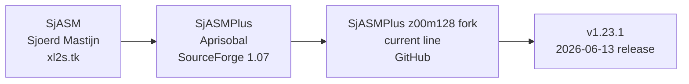
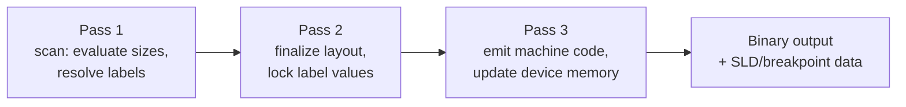

[← Toolchain](README.md) · [Cross-Platform Toolchain](cross_platform_toolchain.md)

# SjASMPlus — Z80 Cross-Assembler with Lua Scripting, Device Emulation, and ZX Next Support

---

## Overview

SjASMPlus is the **de facto standard cross-assembler for modern ZX Spectrum development**. It is a command-line tool that runs on Windows, Linux, macOS, FreeBSD, and Raspberry Pi, and emits machine code for the Z80, R800, Z80N (ZX Spectrum Next), i8080, and Sharp LR35902/SM83 (Game Boy) CPUs from a single source tree.

What makes SjASMPlus the default choice is not that it assembles Z80 code — every cross-assembler does that. It is the **directives layer built on top**: a complete ZX Spectrum device model that understands RAM pages, slots, and 16 KB banking; pseudo-ops that emit snapshot files (`SAVESNA`), tape files (`SAVETAP`), TR-DOS disks (`SAVETRD`), Hobeta files (`SAVEHOB`), Intel HEX (`SAVEHEX`), +3 DOS files (`SAVE3DOS`), AMSDOS files (`SAVEAMSDOS`), Amstrad CPC snapshots (`SAVECPCSNA`, `SAVECDT`, `SAVECPR`), and ZX Spectrum Next NEX files (`SAVENEX`) — all without any external post-processing. Source-level debugging data (`.sld.txt`) is emitted for DeZog, CSpect, and ZEsarUX. Breakpoint lists for UnrealSpeccy, ZEsarUX, MAME, and Fuse are produced directly from `SETBP` markers in the source.

The assembler is built around three orthogonal feature pillars that distinguish it from earlier alternatives:

1. **A three-pass assembler core** that resolves forward references, label arithmetic, and `EQU` chains in a single run — no manual pass ordering.
2. **A virtual-device memory model** (`DEVICE`) that lets the assembler itself track which RAM page is paged into which slot at any given address. Other assemblers deal in flat 64 KB; SjASMPlus deals in the same paged memory the target machine has.
3. **An embedded Lua 5.5 interpreter** that runs *inside* the assembler, with bindings to read and write labels, defines, the symbol table, memory, and device state. Lua is used for code generation, table construction, build automation, and conditional assembly that exceeds what `IFDEF` can express.

The tool is licensed BSD, has 512+ automated tests in CI, and assembles roughly one million source lines in 2–3 seconds on a modern machine.

---

## History and Lineage

SjASMPlus has a three-generation lineage that explains both its naming and its design:



| Generation | Author | Years | Key contribution |
|---|---|---|---|
| **SjASM** (original) | Sjoerd Mastijn (`xl2s.tk`) | early 2000s | The original Z80 cross-assembler whose source became the foundation. Lightweight, single-pass,Win32-only. |
| **SjASMPlus** (Aprisobal) | Aprisobal | 2004–2010s | Forked SjASM, added the *Plus* feature set: macros, modules, structures, conditional assembly. Hosted on SourceForge; final version there was 1.07. The SourceForge project is still available as historical archive. |
| **SjASMPlus z00m128 fork** | z00m128 (current maintainer) | 2010s–present | The actively maintained line. Imported Aprisobal's source into GitHub, then substantially extended: Lua 5.5 scripting engine, virtual device mode, ZX Next Z80N support, SAVENEX, SLD data export, 512+ CI tests, cross-platform CMake build, BSD license. Current version 1.23.1 (June 2026). |

> [!NOTE]
> There is a *separate* `sjasmplus/sjasmplus` GitHub repository (also called "SJAsmPlus: Z80 cross-assembler") that is an older independent fork with CMake support but no active development since roughly 2017. The **z00m128/sjasmplus** repository is the actively maintained one and the one this article covers. If you find documentation that does not mention Lua, `DEVICE`, or SAVENEX, you are looking at the wrong fork.

The contemporary alternatives — RASM (Edouard BERGE), z88dk's `z80asm`, Pasmo, vasm, WLA-DX, zmac — are covered in [Cross-Platform Toolchain](cross_platform_toolchain.md). SjASMPlus dominates because of the combination of device emulation, output format coverage, Lua scripting, and ZX Spectrum Next first-class support.

---

## Installation

### Pre-built Windows binary

Download from the [GitHub releases page](https://github.com/z00m128/sjasmplus/releases/latest). The zip archive contains `sjasmplus.exe`, an `examples/` directory, and offline documentation. No installation — just put `sjasmplus.exe` on `PATH` or invoke it directly.

### Build from source (Linux, macOS, BSD, Raspberry Pi)

Requires a C++17 compiler (GCC 9 or later, Clang 10+, Apple Clang 12+, MSVC 2019 16.11+). Two build systems are provided:

```bash
# Option A: GNU Make (the simpler path)
git clone https://github.com/z00m128/sjasmplus.git
cd sjasmplus
make
sudo make install        # installs sjasmplus to /usr/local/bin

# Option B: CMake (for IDE integration and custom toolchains)
mkdir build && cd build
cmake ..
cmake --build . --parallel
```

The Makefile detects the platform automatically and links the bundled Lua 5.5 source tree — no external Lua dependency is needed. CMake is preferred when building with MSVC or when integrating into a larger build system.

### Package manager availability

SjASMPlus is packaged in several distributions:

- **Homebrew** (macOS): `brew install sjasmplus`
- **Debian/Ubuntu** (bookworm+): `apt install sjasmplus`
- **FreeBSD ports**: `devel/sjasmplus`
- **MSYS2** (Windows): `pacman -S mingw-w64-x86_64-sjasmplus`

Package versions can lag the upstream releases by weeks to months; for the latest features (`SIZEOF`, glue operator, `SAVEHEX`, etc.) build from source or use the GitHub release binary.

### Verify installation

```bash
sjasmplus --version
# SjASMPlus 1.23.1 (https://github.com/z00m128/sjasmplus)
```

---

## Command-Line Interface

The basic invocation is:

```bash
sjasmplus [options] sourcefile(s)
```

Multiple source files are processed in order as if concatenated. STDIN can be spliced in with `-` as a source argument.

### CPU selection

| Flag | Effect |
|---|---|
| `--zxnext[=cspect]` | Enable ZX Spectrum Next Z80N undocumented opcodes (LDIX, LDWS, MUL, PIXELDN, SETAE, SWAPNIB, etc.) — these are **real new opcodes** baked into the Next's CPU silicon, not source-level expansions. The `=cspect` variant additionally enables the CSpect-emulator-specific **debug pseudo-instructions** (`exit`, `break`, `setbrk`, `clrbrk`) which emit zero bytes and exist only as debugger hooks. |
| `--i8080` | Restrict instruction set to Intel 8080 only; disable all Z80-specific instructions and source-level fake expansions. |
| `--lr35902` | Sharp LR35902 / SM83 (Game Boy CPU) mode. |

By default (no CPU flag) the assembler accepts the full Z80 + R800 + undocumented Z80 instruction set.

### Output control

| Flag | Effect |
|---|---|
| `--lst[=<file>]` | Emit listing file (default: `<source>.lst`) |
| `--lstlab[=sort]` | Append symbol table to listing; optionally sorted |
| `--sym=<file>` | Emit symbol table file |
| `--exp=<file>` | Emit exports file (see `EXPORT` pseudo-op) |
| `--hex=<file>` | Emit Intel HEX (`-` for STDOUT) |
| `--raw=<file>` | Emit raw machine code to `<file>` in addition to in-source directives |
| `--sld[=<file>]` | Emit Source Level Debugging data for DeZog / CSpect / ZEsarUX |
| `--outprefix=<path>` | Prefix all in-source output filenames (folder must exist; trailing slash required) |
| `--cleanonerror` | Delete produced binaries on error (listing/symbol files are kept) |

### Build configuration

| Flag | Effect |
|---|---|
| `-D<NAME>[=<value>]` / `--define <NAME>[=<value>]` | Pre-define a symbol (used by `IFDEF`) |
| `-i <path>` / `-I <path>` / `--inc= <path>` | Add include search path (later paths take priority) |
| `-W[no-]<id>` | Enable/disable a warning by ID; use `--help=warnings` to list |
| `--fullpath[=on\|rel\|off]` | How much file-path detail to put in error messages |
| `--color=[on\|off\|auto]` | ANSI color in errors/warnings; `auto` respects `NO_COLOR` |
| `--syntax=<...>` | Adjust parser syntax — see [Source Format and Syntax](#source-format-and-syntax) |
| `--reversepop` | Reverse `POP` register order (compatibility with base SjASM) |
| `--dirbol` | Allow directives at the beginning of a line (column 0) |
| `--nofakes` | Disable fake instructions (same as `--syntax=F`) |
| `--longptr` | In `NONE` device mode, allow program counter `$` to advance past `#FFFF` |
| `--dos866` | Convert source from Windows-1251 to DOS-866 (Cyrillic legacy sources) |

### Verbosity

`--msg=` selects the stderr verbosity: `all` (default), `war`, `err`, `none`. Two special values exist for CI integration:

- `--msg=lst` — stderr becomes a listing stream (clashes with `--lst`)
- `--msg=lstlab` — listing + sorted symbols

`--nologo` suppresses the startup banner; useful for piping.

---

## The Three-Pass Assembly Model

SjASMPlus processes the entire source three times sequentially. Between passes, the symbol table and Lua global state are preserved; all other data is discarded.



| Pass | Purpose | Emits code? |
|---|---|---|
| **1** | Evaluate code size, build initial symbol table. Forward references may be unresolved. | ❌ |
| **2** | Finalize all label values. At end of pass, every symbol should be settled. | ❌ |
| **3** | Emit machine code using the now-frozen symbol table. Update virtual device memory. This is also when `sj.get_byte()` / `sj.get_word()` Lua calls work. | ✅ |

If a symbol evaluates to a different value in Pass 3 than in Pass 2, SjASMPlus emits a *phase error*: the source is too complex to settle within two passes and must be rewritten. In practice this is rare — the three-pass model handles all sane forward-reference, `EQU`-chain, and macro-expansion patterns.

The Lua `sj.pass` read-only variable returns `1`, `2`, or `3`, so scripts can run expensive code generation only when needed.

---

## Source Format and Syntax

A source line has the form:

```
[label]   [directive | instruction]   [; comment]
```

The label is optional but, when present, must begin in column 0 *or* be preceded by `>` (the indent-label operator introduced in v1.22.0). The label may or may not be followed by a colon. The instruction field may contain multiple statements separated by colons — the colon is the inline-statement separator:

```z80
loop:   ld a, 10      ; one statement
        ld b, 20      ; another
        ; colon-inline form:
        ld a, 10 : ld b, 20 : sub b
```

### Numeric literals

| Format | Example | Notes |
|---|---|---|
| Hexadecimal | `#4F`, `0x4F`, `4Fh`, `$4F` | All four forms accepted. A hex literal starting with a letter (e.g., `4Fh`) requires the trailing `h`; otherwise the parser sees an identifier. |
| Decimal | `79`, `79d`, `0d79` | Plain decimal is the default. |
| Binary | `01001111b`, `0b01001111`, `%01001111` | Three accepted forms. |
| Octal | `117o`, `117q`, `0o117` | Three accepted forms. |
| Character | `'A'`, `'"'` | Single chars evaluate to their ASCII value. |
| String | `"Hello"` | Used with `DB`, `DW`, etc. |

Digit grouping with underscore (`1_000_000`) is supported since v1.21.0 to improve readability of large constants.

### String literals with suffixes

Since v1.20.3, string literals can carry a suffix that modifies the last character:

- `"text"Z` — append a zero terminator (C-style string)
- `"text"C` — set bit 7 of the last character (Spectrum-style string terminator, common in `DC` and ABYTEC)

These are equivalent to writing `"text",0` and `'t','e','x','t'|128` respectively, but inline.

### `--syntax=` flags

The `--syntax=` option is a comma-separated list of single-letter flags that adjust the parser. The most useful:

| Flag | Effect |
|---|---|
| `a` | Accept single-comma argument lists for `LD`/`PUSH`/`POP` (e.g., `push af,bc,de`) |
| `F` | Warn on every fake-instruction use |
| `s` | Disable sub-word substitution (see [Substitution](#substitution-and-defines)) |
| `m` | **Removed** in v1.20.0 — old "mac"-style syntax, no longer supported |

---

## Labels

Labels are case-sensitive, may be up to ~70 characters long, and may contain letters, digits, `_`, `.`, `!`, `?`, `#`, `@`. The `.` has special meaning: it joins a module name to a local label (see [Modules](#modules-and-namespaces)).

### Regular labels

```z80
Start:    ld hl, Message
loop      ld a, (hl)          ; "loop" is a regular global label
          or a
          ret z
          inc hl
          jp loop
```

### Local labels

Local labels start with `.` (a dot) and attach to the **most recently defined non-local label** in the same module. They cannot be referenced outside their parent. This is the standard idiom for `loop` and `.next` labels:

```z80
ParseNumber:
.loop      ld a, (hl)         ; defines ParseNumber.loop
           inc hl
           cp '0'
           jp c, .done       ; jumps to ParseNumber.done
           cp '9'+1
           jp nc, .done
           jr .loop
.done      ret                ; defines ParseNumber.done
```

### Temporary labels

Temporary labels (a.k.a. anonymous labels) are defined with a single digit `0`–`9` or a name with the `_b` / `_f` suffix:

```z80
1:         ld a, (hl)
           inc hl
           cp 0
           jr nz, 1b         ; "jump to previous 1:" (backward)

scan_f     ld a, (hl)         ; "scan_f" named for clarity
           inc hl
           or a
           jr nz, scan_f     ; jump to "scan_f" defined above

find_byte:
           ld a, (hl)
           cp 0FFh
           jr z, found_b     ; "jump to previous 'found'" (backward)
           inc hl
           jr find_byte
found      ret
```

Backward references use suffix `_b` or `N b` (digit followed by `b`); forward references use `_f` or `N f`. Temporary labels let you reuse simple names like `loop`, `next`, `done` across the file without module wrapping.

### `@` labels

Labels starting with `@` are **absolute**: they ignore the current module namespace. Useful inside macros where the macro should not leak its own internal labels into the caller's namespace:

```z80
        MACRO peek_byte addr?
@local_label:  ld a, (addr?)
               ret
        ENDM
```

### SIZEOF operator (v1.22.0+)

`SIZEOF label` returns the size of a region defined by `label` ... `label_end` (a label whose name is the original name with `_end` appended), or the size of a `STRUCT` instance. Useful for table sizing without manual `EQU`:

```z80
Buffer:    BLOCK 256
Buffer_end:

        ld bc, SIZEOF Buffer    ; ld bc, 256
```

---

## Substitution and Defines

`DEFINE` (and `DEFARRAY`) implement **text substitution** at parse time — distinct from `EQU`, which assigns a numeric value to a label. A `DEFINE` value is spliced verbatim into the source line wherever its identifier appears, and substitution is *iterated*: after each replacement, the line is re-scanned for further substitutions (up to about 30 iterations) until stable.

```z80
DEFINE  NAME    "Spectrum"
DEFINE  WIDTH   32
        ld bc, WIDTH         ; becomes "ld bc, 32"
        db "Hello ", NAME   ; becomes "Hello Spectrum"
```

### Sub-word matching

By default, every underscore `_` in an identifier is treated as a **sub-word boundary**. The substitution engine tries various combinations of adjacent sub-words to match a define. This lets related defines share a stem:

```z80
DEFINE  WIDTH       32
DEFINE  HEIGHT      24
DEFINE  BUFFER_SIZE WIDTH_HEIGHT
        ld bc, BUFFER_SIZE    ; -> "WIDTH_HEIGHT" -> "32_24" (error: not a number)
```

In practice sub-word matching is more often surprising than helpful. Most projects disable it with `--syntax=s` for predictable whole-word substitution.

### Glue operator (v1.22.0+)

A *whitespace-enclosed* underscore adjacent to a substitution result is the **glue operator**: after substitution completes, the surrounding whitespace is removed. This enables token concatenation:

```z80
DEFINE  REG  bc
ld      REG _ lo      ; -> "ld bc_lo" (if bc_lo is a label)
ld      REG _ hi      ; -> "ld bc_hi"
```

Without the glue operator, the result would be `ld bc _ lo` — three separate tokens, a parse error.

### DEFARRAY

`DEFARRAY` defines an array of define values, indexed at parse time:

```z80
DEFARRAY messages "OK", "ERR", "BUSY", "DONE"
        ld hl, messages#2      ; -> "DONE" -> ld hl, DoneString
        db messages#0          ; -> "OK"
```

The `#` operator reads an array element by index. `messages#` (without index) returns the array size.

---

## Predefined Defines

SjASMPlus exposes the assembler's own state as predefined defines. The most useful:

| Define | Value | Purpose |
|---|---|---|
| `__SJASMPLUS__` | 24-bit version number (`0x011701` for 1.23.1) | Version-conditional code |
| `__VERSION__` | String `"1.23.1"` | Display in build banner |
| `__PASS__` | `1`, `2`, or `3` | Run Lua code only on final pass |
| `__DATE__` | `"YYYY-MM-DD"` | Embed build date in binary |
| `__TIME__` | `"hh:mm:ss"` | Embed build time in binary |
| `__FILE__` | current source filename | Lua scripting |
| `__LINE__` | current source line number | Lua scripting and diagnostics |
| `__INCLUDE_LEVEL__` | include nesting depth | Detect top-level vs included source |
| `__ERRORS__` / `__WARNINGS__` | running count | Abort on first error via `ASSERT __ERRORS__ == 0` |
| `__COUNTER__` | monotonically increasing | Generate unique labels across macro expansions (via Lua) |
| `__BASE_FILE__` | top-level source filename | Build metadata |

Deprecated aliases (`_SJASMPLUS`, `_VERSION`, `_RELEASE`, `_ERRORS`, `_WARNINGS`) still exist for backward compatibility with pre-1.16 sources but should not be used in new code.

---

## Conditional Assembly

`IF` / `IFN` / `IFDEF` / `IFNDEF` / `IFEXIST` / `ELSE` / `ELSEIF` / `ELIF` / `ENDIF` control which source lines are assembled based on the value of an expression or the existence of a label/define. Conditions are evaluated in Pass 2; the assembler skips the not-taken branch entirely.

```z80
        DEFINE DEBUG 1

        IFDEF DEBUG
            ASSERT EndCode < #8000, "Code overflowed into RAM bank boundary"
            DISPLAY "DEBUG BUILD"
        ELSE
            DISPLAY "RELEASE BUILD"
        ENDIF
```

`IFDEF NAME` is true if `NAME` is defined as either a label or a define. `IFEXIST NAME` is true only if `NAME` is a label with a known value — useful when a Lua script conditionally inserts a label.

### Multi-target builds

The standard idiom for one source tree, multiple targets:

```z80
        ; build with: sjasmplus -D TARGET_128 game.asm
        ;      or:    sjasmplus -D TARGET_NEXT game.asm

        IFDEF TARGET_48
            DEVICE ZXSPECTRUM48
        ENDIF
        IFDEF TARGET_128
            DEVICE ZXSPECTRUM128
        ENDIF
        IFDEF TARGET_NEXT
            DEVICE ZXSPECTRUMNEXT
            ; enable Z80N instructions:
            ;   (no flag needed — DEVICE ZXSPECTRUMNEXT implies Z80N)
        ENDIF

        ; later in source:
        IFDEF TARGET_NEXT
            ldix            ; Z80N instruction
            pixeldn
        ELSE
            ld a, (hl)      ; manual LDIX implementation
            inc hl
        ENDIF
```

---

## Block Repeat (DUP / REPT / EDUP)

`DUP count` / `REPT count` repeats a block of source lines a fixed number of times:

```z80
        DUP 8
            sla b
        EDUP                    ; equivalent to 8x "sla b"
```

Since v1.20.2, `DUP` accepts an optional index variable:

```z80
        DUP 4, i
            db i, i*2, i*3      ; emits: 0 0 0 | 1 2 3 | 2 4 6 | 3 6 9
        EDUP
```

Zero-count `DUP` is allowed since v1.19.0 — the block is simply skipped, useful when the count is computed at build time.

### Dot-repeat

For single-instruction repetition, use the `.N` prefix:

```z80
        .3 nop              ; emits "nop : nop : nop"
        .(8-len) db 0       ; conditional padding
```

The count must be an integer or a parenthesized expression; it cannot be a label.

---

## Macros

`MACRO name args...` / `ENDM` defines a macro. Macro arguments are referenced inside the body using the `name?` syntax (identifier suffixed with `?`). Arguments become temporary defines during expansion; substitution rules apply.

```z80
        MACRO  MUL8x8 a?, b?
            ; result in HL (a? * b?), preserves A
            ld l, a?
            ld h, 0
            ld b, 8
            xor a
@@loop:     add hl, hl
            rl c
            djnz @@loop
        ENDM

        MUL8x8 c, d             ; expands inline
```

Macro bodies are stored **unparsed** at definition time and are only parsed during expansion. This is what allows forward references inside macros to work — by the time the macro expands, all labels it references exist.

### Macros with label generation

Macros that need unique labels per expansion use `@`-prefixed names (which ignore module namespace) combined with `__COUNTER__`:

```z80
        MACRO  WAIT_VBLANK
            @wait_vblank_ NAMESPACE __COUNTER__
            ld a, 0FFh
@loop:      in a, (#FE)
            rra
            jr nc, @loop
            ENDNAMESPACE
        ENDM
```

Or use Lua (`sj.insert_label`) for fully programmable label generation.

### Multi-line expansion

A macro expansion is treated as if its lines were spliced into the source at the invocation point. `IFDEF`, `DUP`, and nested `MACRO` invocations inside a macro body all work as if they appeared inline.

---

## Structures (STRUCT)

`STRUCT` defines a structured-data template — a named layout of fields with offsets. After definition, the structure name can be used as a type in `DB`/`DW` initialization, and structure fields are accessible via the `.` operator.

```z80
        STRUCT  Point
x           BYTE  0
y           BYTE  0
color       BYTE  7
        ENDS

        ; Define initialized instances:
Player      Point 100, 50, 7
Enemy1      Point 200, 80, 2
Enemy2      Point 150, 90, 2

        ; Access fields:
        ld a, (Player.x)        ; A = 100
        ld b, (Player.y)        ; B = 50
        ld hl, Player+Point.y   ; address of Player.y field
```

### Field types in STRUCT

| Directive | Size | Purpose |
|---|---|---|
| `BYTE` / `DB` | 1 byte | 8-bit value or string |
| `WORD` / `DW` | 2 bytes | 16-bit value, little-endian |
| `D24` | 3 bytes | 24-bit value (for Z80N `LD HL,(nn)` etc.) |
| `DWORD` / `DD` | 4 bytes | 32-bit value |
| `BLOCK n` / `BLOCK n, init` | n bytes | Reserved / initialized block |
| `ALIGN n` | varies | Pad to alignment |
| `DUP n, ...` | varies | Repeated sub-struct |
| Nested `STRUCT` | size of nested struct | Composition |

### SIZEOF and offsetof

```z80
        STRUCT Sprite
w           BYTE
h           BYTE
data        BLOCK 0       ; marker — actual data follows
        ENDS

        ; sizeof Sprite == 2
        ; offsetof Sprite.data == 2

        ld bc, SIZEOF Sprite
        ld a, Sprite.data       ; offset of .data field = 2
```

Structures are how SjASMPlus bridges the gap between C-style "typeful" data and raw Z80 byte emission. Library-style code typically declares structures for hardware registers, file headers, and asset formats.

---

## Modules and Namespaces

`MODULE name` / `ENDMODULE` wraps a block of code in a namespace. All labels defined inside become `name.label`. Local labels (`.x`) inside a module attach to the most recent *non-local* label in the same module.

```z80
        MODULE Math

Add:    add a, b
        ret

Sub:    sub b
        ret

.table  db 1, 2, 3, 4, 5    ; defines Math.table

        ENDMODULE

        ; From outside:
        call Math.Add
        ld hl, Math.table
```

Modules can be nested — inner module names are joined with dots: `Math.Fast.Add`.

### Module-aware label references

Inside a module, you can reference sibling labels without the module prefix:

```z80
        MODULE Game
Update:     call Render         ; calls Game.Render
Render:     ret
        ENDMODULE
```

To reference a label outside the current module, use the fully qualified name: `call Audio.PlaySound`.

### `ENDMODULE` is optional

A `MODULE` directive without a matching `ENDMODULE` extends to the end of the source file. This is common for single-module projects: `MODULE Game` at the top, and every label is implicitly `Game.label`.

---

## Real Device Mode (DEVICE)

`DEVICE` is the killer feature that distinguishes SjASMPlus from every other Z80 cross-assembler. It puts the assembler into a **virtual device memory model** where the assembler tracks RAM pages, slots, and bank-switching state as it emits code. Instead of dealing in a flat 64 KB address space, you deal with the same paged memory the target machine has.

### Built-in devices

| Device ID | Description | Slots × Size | Pages |
|---|---|---|---|
| `NONE` | Default. Flat 64 KB; no banking. | 1 × 64 KB | 1 |
| `ZXSPECTRUM48` | ZX Spectrum 16K/48K | 1 × 64 KB | 1 |
| `ZXSPECTRUM128` | ZX Spectrum 128 / +2 | 4 × 16 KB (slot 3 = #C000-#FFFF) | 8 (pages 0–7; page 0 = ROM) |
| `ZXSPECTRUM256` | 256K Russian clone (Pentagon 256 etc.) | 4 × 16 KB | 16 |
| `ZXSPECTRUM512` | 512K (Pentagon 512) | 4 × 16 KB | 32 |
| `ZXSPECTRUM1024` | 1024K (ATM Turbo 2 / Pentagon 1024 SL) | 4 × 16 KB | 64 |
| `ZXSPECTRUM2048` | 2048K | 4 × 16 KB | 128 |
| `ZXSPECTRUM4096` | 4096K | 4 × 16 KB | 256 |
| `ZXSPECTRUM8192` | 8192K | 4 × 16 KB | 512 |
| `ZXSPECTRUMNEXT` | ZX Spectrum Next | 8 × 8 KB | 224 (1.75 MiB); default mapping: `{14, 15, 10, 11, 4, 5, 0, 1}` |
| `NOSLOT64K` | 64 KB with extended pages (ZX80/ZX81 dev with DeZog) | 1 × 64 KB | 32 (2 MiB total) |
| `AMSTRADCPC464` | Amstrad CPC 464 | 4 × 16 KB | 4 (64K) |
| `AMSTRADCPC6128` | Amstrad CPC 6128 | 4 × 16 KB | 8 (128K) |
| `AMSTRADCPCPLUS` | Amstrad CPC+ (GX4000) | 4 × 16 KB | 32 (512K) |

Custom devices can be defined with `DEFDEVICE`.

### Slots, Pages, and `SLOT` / `PAGE`

A **slot** is a 16 KB (or 8 KB on the Next) region of the Z80's address space — e.g., slot 3 on `ZXSPECTRUM128` is `#C000`–`#FFFF`. A **page** is a 16 KB (or 8 KB) RAM bank. At any time, each slot has one page mapped into it. `PAGE n` selects the page that subsequent code is emitted into; `SLOT n` selects which slot to write to.

```z80
        DEVICE ZXSPECTRUM128

        ; Default slot is 3 (#C000-#FFFF), page 0 is mapped there.
        ; Emit code in main RAM bank (page 0):
        ORG #C000
MainRoutine:
        call #03D4           ; call ROM CLS
        ret

        ; Switch to page 2 (the "banked" RAM page):
        PAGE 2
        ORG #C000            ; this ORG refers to offset in page 2
BankedRoutine:
        ld a, 2
        ld (#5CF4), a        ; TR-DOS: select file 2
        call #0700           ; call TR-DOS entry
        ret

        ; Emit a snapshot:
        SAVESNA "out.sna", MainRoutine
```

Without `DEVICE`, none of this works. `ORG` in a non-device source just sets the program counter; in a device source, `ORG` + `PAGE` + `SLOT` together specify exactly where in the emulated machine's memory the bytes go.

### Per-device output directives

| Directive | Effect |
|---|---|
| `SAVESNA "file.sna", entry` | Emit a 48K or 128K SNA snapshot, depending on the device |
| `SAVETAP "file.tap", entry[, type]` | Emit a TAP tape file; type: 0=BASIC loader, 1=CODE block, 2=screen, 3=headless |
| `SAVEBIN "file.bin"[, start[, length]]` | Emit raw bytes from device memory |
| `SAVEDEV "file", start, length` | Like SAVEBIN but reads from any page (not just the current slot) |
| `SAVETRD "disk.trd"[, "file.ext"[, start, length, autoflush]]` | Append a file to a TR-DOS disk image (creates disk if missing) |
| `SAVEHOB "file.$b"[, "source.ext"[, start, length, autoflush]]` | Emit a standalone Hobeta file |
| `SAVEHEX "file.hex"` | Emit Intel HEX (v1.22.0+) |
| `SAVE3DOS "file"[, start, length, autoflush]` | Emit a +3DOS file (header + data) |
| `SAVEAMSDOS "file.bin"[, start, length]` | Emit an AMSDOS file (CPC) |
| `SAVECPCSNA "file.sna"[, entry]` | Emit a CPC snapshot |
| `SAVECDT "file.cdt"[, entry]` | Emit a CPC CDT tape |
| `SAVECPR "file.cpr"` | Emit a CPC+ cartridge |
| `SAVENEX ...` | Emit a ZX Spectrum Next NEX file — see [ZX Spectrum Next Support](#zx-spectrum-next-support) |
| `EMPTYTAP "file.tap"` | Open a new empty TAP for subsequent `TAPOUT` writes |
| `EMPTYTRD "disk.trd"[, tracks]` | Create a new empty TR-DOS disk image (80 tracks default) |

### Reading device memory at assembly time

In device mode, the `{address}` and `{b address}` operators read WORD and BYTE values from the virtual device memory *during assembly*. This enables self-referential data:

```z80
        DEVICE ZXSPECTRUM128

        ORG #8000
TableStart:
        dw EndMarker - TableStart     ; length of table (computed at assembly time)
        db 1, 2, 3, 4, 5, 6, 7, 8
EndMarker:
        ; Verify by reading device memory:
        ASSERT {TableStart} == EndMarker - TableStart
```

Lua's `sj.get_byte(addr)` and `sj.get_word(addr)` provide the same capability from script.

---

## Fake Instructions (Source-Level Opcode Expansions)

The Z80 has many missing instructions that "would be nice." SjASMPlus fakes them by expanding each source-level mnemonic into a sequence of **real Z80 opcodes** at parse time. They improve readability at the cost of some performance (and sometimes unexpected flag effects). Use `--syntax=F` or `--nofakes` to warn on every fake-instruction use, or just write the real instruction sequence.

> [!NOTE]
> **The word "fake" has two unrelated meanings in SjASMPlus.** This section covers **source-level opcode expansions** — patterns like `LD BC,DE` that rewrite to `LD B,D : LD C,E` and emit ordinary Z80 bytes that run on any Z80 CPU.
>
> Separately, the `--zxnext=cspect` flag enables CSpect-emulator-only **debug pseudo-instructions** (`exit`, `break`, `setbrk`, `clrbrk`) that emit **zero machine code** and exist only as hooks for the CSpect debugger. The official SjASMPlus docs also call these "fake instructions," but they share nothing with the expansions documented here except the word.
>
> Neither category should be confused with the **ZX Spectrum Next Z80N ISA** (LDIX, MUL, MIRROR A, SWAPNIB, …), which consists of **real new opcodes** with new byte encodings baked into the Next's custom CPU silicon.

### 16-bit load fakes

```z80
ld bc, de         ; -> ld b, d : ld c, e
ld hl, bc         ; -> ld h, b : ld l, c
ld bc, (hl)       ; -> ld c, (hl) : inc hl : ld b, (hl) : dec hl
ld de, (ix+5)     ; -> ld e, (ix+5) : ld d, (ix+6)
```

### Auto-incrementing / decrementing loads

`LDI` and `LDD` (not to be confused with the real `LDIR`/`LDDR`) are fakes that increment/decrement the index register after the load:

```z80
ldi a, (hl)       ; -> ld a, (hl) : inc hl
ldi (hl), bc      ; -> ld (hl), c : inc hl : ld (hl), b : inc hl
ldd a, (de)       ; -> ld a, (de) : dec de
ldd (ix+5), hl    ; -> ld (ix+5), l : dec ix : ld (ix+5), h : dec ix
```

### 16-bit arithmetic on DE

```z80
add de, bc        ; -> ex de, hl : add hl, bc : ex de, hl
add de, de        ; -> ex de, hl : add hl, hl : ex de, hl      (alternative: sla de)
sub de, bc        ; -> or a : ex de, hl : sbc hl, bc : ex de, hl
sub hl, bc        ; -> or a : sbc hl, bc
```

The 16-bit `add de, de` and `sub hl, hl` patterns emit `;; consider alternative:` comments in the docs showing faster hand-written alternatives (e.g., `sla de` is 7 T-states faster than `ex de,hl : add hl,hl : ex de,hl`).

### 16-bit shifts

```z80
rl bc             ; -> rl c : rl b        (rotates BC left through carry)
sla hl            ; -> add hl, hl         (logical left shift, fast)
sra hl            ; -> sra h : rr l       (arithmetic right)
```

### Multi-argument `LD` / `PUSH` / `POP`

With `--syntax=a`, SjASMPlus accepts comma-separated argument lists:

```z80
        ld a, 1, b, 2, c, 3   ; emits ld a,1 : ld b,2 : ld c,3
        push af, bc, de       ; emits push af : push bc : push de
        pop de, bc, af        ; emits pop de : pop bc : pop af
```

### When to use fake instructions

| Use them for | Avoid them for |
|---|---|
| Application code where clarity beats cycle-counting | Inner loops where T-states matter |
| Initialization sequences | Interrupt handlers |
| Data structure setup | Code that must match a specific instruction encoding (e.g., for jump tables) |
| Reading and writing 16-bit values from memory | Code that must not modify flags unexpectedly (e.g., between `cp` and `jp z`) |

---

## ZX Spectrum Next Support

The ZX Spectrum Next has an extended Z80 called the **Z80N**. SjASMPlus provides first-class Z80N support, making it the standard assembler for Next development.

### Enabling Z80N mode

Z80N instructions are enabled in any of three ways:

1. `DEVICE ZXSPECTRUMNEXT` — implicitly enables Z80N (recommended)
2. `--zxnext` CLI flag — enables Z80N without changing the device
3. `--zxnext=cspect` — additionally enables the CSpect emulator's `exit`, `break`, `setbrk`, `clrbrk` pseudo-instructions for debugging

### Z80N instruction set

| Instruction | Effect | T-states |
|---|---|---:|
| `swapnib` | Swap high and low nibbles of A | 4 |
| `mirror a` | Mirror bits of A (bit 0 ↔ bit 7, etc.) | 4 |
| `mul` / `mul de` | `DE = D × E` (16-bit result from 8-bit operands) | 4 |
| `add hl, a` | `HL = HL + A` (signed extend) | 4 |
| `add de, a` | `DE = DE + A` (signed extend) | 4 |
| `add bc, a` | `BC = BC + A` (signed extend) | 4 |
| `add hl, nn` | `HL = HL + nn` (16-bit immediate) | 10 |
| `add de, nn` | `DE = DE + nn` | 10 |
| `add bc, nn` | `BC = BC + nn` | 10 |
| `ldix` | Like `LDI` but does not overwrite destination if source byte is `0xFF` | 14 |
| `ldwx` | Like `LDI` but does not write — used to test memory | 14 |
| `lddx` | Like `LDD` but skips write if source byte is `0xFF` | 14 |
| `ldirx` | Block `LDIX` | 14 per byte |
| `ldirscale` | `LDIR` with scaling — copies `BC` bytes but increments HL by `(IX+5:IX+4)` per copy | 14 per byte |
| `ldir1` / `ldir2` / `ldir3` | M1-cycle-aware `LDIR` variants for contention-sensitive code | variable |
| `ldws` | `LD (DE), (HL)` then `INC L` and `INC D` (sprite-tile row copy) | 14 |
| `pixeldn` | `HL += 256` (move to next row in linear address) | 4 |
| `setae` | `A = (HL) ^ A` then `HL = addr of A in 8KiB bank` | 14 |
| `jp (c)` | Jump to `#0000 + C` | 6 |
| `test n` | `A & n` setting flags only (no writeback) | 7 |
| `nextreg r, v` | `NEXTREG_REG = r; NEXTREG_DAT = v` (one-byte register write) | 9 |
| `nextreg a, r` | `NEXTREG_DAT = r; NEXTREG_REG = A` | 9 |
| `outnextreg a` | Write A to NEXTREG_DAT (used after nextreg r, v) | 6 |

These instructions enable fast Layer 2 graphics blitting, hardware sprite management, and tile engine code that would require long macro sequences on a stock Z80.

### NEX file format (SAVENEX)

NEX is the ZX Spectrum Next's native executable format. A `.nex` file bundles code, banks of RAM (any of banks 0–223), the Layer 2 / Layer 0 (screen) data, palette, optional load screen, optional ENTRY bank, and metadata. SjASMPlus produces NEX files through a multi-step `SAVENEX` sequence:

```z80
        DEVICE ZXSPECTRUMNEXT
        ORG #8000
Start:  ; ... main program ...
        ret

        ; Open the NEX file, specify entry point and bank 0
        SAVENEX OPEN "game.nex", Start, $C000, 0

        ; Optionally include screen data:
        SAVENEX BAR 0, 0, 256, 192      ; visible area (Next hardware border handling)
        SAVENEX PALETTE 9, 0, 0, 1      ; palette type 9 (Layer 2 8-bit), doorglobal=0, doornum=0, enabled=1
        SAVENEX SCREEN Lorioli.scr       ; load screen BMP

        ; Auto-close and write the footer:
        SAVENEX CLOSE
```

Full `SAVENEX` sub-directives: `OPEN`, `CLOSE`, `CORE`, `BANK`, `BAR`, `SCREEN`, `PALETTE`, `LAYER2`, `AUTORUN`, `CFG`, `APPEND`. See the official SjASMPlus documentation Chapter 9 for the complete reference.

### Other Next-specific directives

- `CSPECTMAP "file.map"` — emit a labels file in CSpect's format (used by the CSpect emulator to display labels in its debugger)
- `LABELSLIST "file.lbl"` — emit a labels list in z80ool/z88dk-style format
- `BPLIST "file" zesarux|unreal|mame|fuse` — emit breakpoint lists for `SETBP` markers in the format the target emulator expects

---

## Lua Scripting

SjASMPlus embeds **Lua 5.5.0** (since v1.21.1) inside the assembler. Lua scripts run between passes and have full access to the assembler's symbol table, defines, memory, and device state. This is what makes SjASMPlus a *code-generation tool* rather than just an assembler.

Lua blocks are delimited by `LUA` / `ENDLUA`:

```z80
        LUA
        print("Hello from Lua!")
        ENDLUA
```

By default, Lua code runs in **every pass**. To run code only on the final pass (when memory is populated and labels are frozen), use `LUA PASS3`:

```z80
        LUA PASS3
        -- only execute during pass 3, when device memory is readable
        local i = 0
        while sj.get_byte(0x8000 + i) ~= 0 do
            i = i + 1
        end
        sj.insert_label("StringEnd", 0x8000 + i)
        ENDLUA
```

`LUA ALLPASS` is the explicit form of the default (run on every pass).

### Bindings reference

The full Lua API. The `sj.*` namespace is the modern interface; `_c`, `_pc`, `_pl` are convenient short aliases.

| Binding | Effect |
|---|---|
| `_c("expr")` / `sj.calc("expr")` | Evaluate an assembly-time expression. Returns 32-bit integer. |
| `_pc("code")` / `sj.parse_code("code")` | Parse a string of Z80 assembly at this point. |
| `_pl("label code")` / `sj.parse_line("label code")` | Parse a full source line including a label. |
| `sj.error("msg")`, `sj.warning("msg")` | Emit compiler error/warning |
| `sj.file_exists("path")` | Check for file existence |
| `sj.get_define("name")` | Get define value as string (nil if undefined) |
| `sj.insert_define("id", "value")` | Create or overwrite a define |
| `sj.get_label("name")` | Get label value (0 if undefined, -1 if invalid name) |
| `sj.insert_label("name", addr)` | Create or overwrite a label; respects current module namespace |
| `sj.current_address` | Current `$` (writable; equivalent to `ORG`) |
| `sj.pass` | Read-only. Current pass (1, 2, or 3). |
| `sj.error_count`, `sj.warning_count` | Read-only counters |
| `sj.add_byte(byte)`, `sj.add_word(word)` | Emit a byte/word to output and advance `$` |
| `sj.get_byte(addr)`, `sj.get_word(addr)` | Read from device memory (Pass 3 only) |
| `sj.get_device()` | Current device ID ("NONE" if no device) |
| `sj.get_modules()` | Current module namespace as a string |
| `sj.set_device("id"[, ramtop])` | Switch device mid-source |
| `sj.set_page(n)`, `sj.set_slot(n_or_addr)` | Change current page/slot |
| `sj.get_page_at(addr)` | Page mapped at address (or `LABEL_PAGE_OUT_OF_BOUNDS` / `LABEL_PAGE_ROM`) |
| `sj.shellexec("cmd")` | Run a shell command (also available via `SHELLEXEC` pseudo-op) |
| `sj.exit(code)` | Terminate assembler |

### Practical Lua patterns

**Generate a lookup table** (sin table for demos):

```z80
        LUA
        for i = 0, 255 do
            local v = math.floor(math.sin(i * math.pi * 2 / 256) * 127 + 128)
            sj.add_byte(v)
        end
        ENDLUA
```

**Conditional symbol definition** based on code size:

```z80
        LUA PASS3
        local code_size = sj.current_address - _c("Start")
        if code_size > 0x4000 then
            sj.error("Code exceeds 16 KB bank limit: " .. code_size .. " bytes")
        end
        sj.insert_label("CodeSize", code_size)
        ENDLUA
```

**External file inclusion** (read data files and emit their bytes):

```z80
        LUA
        local f = io.open("assets/sprite.bin", "rb")
        local data = f:read("*all")
        f:close()
        for i = 1, #data do
            sj.add_byte(data:byte(i))
        end
        ENDLUA
```

This is more flexible than `INCBIN` because Lua can pre-process the data (filter, transform, encode).

**Run an external tool**: build assets, fetch data, or coordinate with other tools:

```z80
        SHELLEXEC "make assets"
```

### Lua version migration notes

- **v1.20.0** replaced tolua++ with LuaBridge 2.6 and upgraded Lua to 5.4
- **v1.21.1** upgraded to Lua 5.5

Scripts written for the old `tolua++` bindings may need adjustment: most bindings are unchanged in semantics but a few had to be modified. The SjASMPlus `tests/lua/` directory has working examples.

---

## Source-Level Debugging (SLD) Data

> [!TIP]
> **This section documents the SLD producer (SjASMPlus).** For the consumer side — how DeZog, CSpect, ZEsarUX, z88dk-gdb, and mainline GDB read SLD / `.map` / `.lis` / DWARF files, plus the full three-layer debugger model (native monitor-debuggers → emulator debuggers → source-level IDE debuggers) — see [debugging.md](debugging.md). That article is the canonical reference for **ZX Spectrum debugging tools** and includes a comparison matrix, decision tree, and three end-to-end workflows built around SjASMPlus + DeZog + ZEsarUX.

The `--sld[=<file>]` CLI option tells SjASMPlus to emit a Source Level Debugging data file (default name: `<source>.sld.txt`). The SLD file maps every assembled byte back to its source file, line number, and surrounding label scope. DeZog (the VS Code Z80 debugger), CSpect, and ZEsarUX consume SLD files to provide source-level debugging — set a breakpoint on a Z80 source line, see variable names, step through source instead of disassembly.

The SLD file format is line-oriented:

```
<filename>|<line>|<time>|<address>|<page>|<extra>
```

Where `<extra>` can include the enclosing module, struct, or block. The full format is documented in Chapter 10 of the official documentation; most developers never need to read it directly.

### How to write debuggable source

SLD relies on labels and a straightforward control flow. To make source-level debugging work well:

- Define labels at function entries (`FunctionName:`)
- Use `STRUCT` for data layouts — SLD tracks structure field offsets
- Avoid computed `JP (HL)` tables where possible — SLD cannot follow them
- Use `MODULE` / `ENDMODULE` to give scopes meaningful names
- Prefer `ORG` + `DEVICE` over `OUTPUT` for proper address tracking

The `SLDOPT` directive configures SLD output: `SLDOPT COMMENT off` skips source comments, `SLDOPT SWAPON` / `SWAPOFF` swap two address regions (for banked code).

---

## Breakpoint Lists (BPLIST and SETBP)

The `BPLIST "file" unreal|zesarux|mame|fuse` directive opens a breakpoint list file in the format the target emulator expects. The `SETBP` directive then adds breakpoints at the current address (or at a named label).

```z80
        DEVICE ZXSPECTRUM128
        BPLIST "debug.bpx" unreal    ; for UnrealSpeccy

MainLoop:
        SETBP                    ; breakpoint at MainLoop
        ; ...

HandleInput:
        SETBP                    ; breakpoint at HandleInput
        SETBP "in a == 0"        ; conditional breakpoint (Unreal format only)
        ; ...
```

Each emulator format has different capabilities:

| Emulator | File | Conditional | Notes |
|---|---|---|---|
| **UnrealSpeccy** | `bpx.ini` | ✅ C-like | Loaded from the emulator UI |
| **ZEsarUX** | any name | ❌ | File contains CLI options; ZEsarUX needs `--enable-breakpoints` |
| **MAME** | any name | ✅ | Format: `bp 0xADDR[,condition]`; used with `-debug -debugscript file.txt` |
| **Fuse** | any name | ❌ | File contains debugger commands |

This bridges the assembler directly into the reverse-engineering workflow: write `SETBP` markers next to suspect code in the source, run a one-shot `sjasmplus --sld game.asm`, and the resulting `.sld.txt` + `.bpx` files give you source-level debugging with breakpoints already set.

---

## Common Pseudo-ops Reference

A condensed reference for the most frequently used pseudo-ops. The official documentation has the complete list (200+ entries).

### Output and organization

| Pseudo-op | Effect |
|---|---|
| `ORG addr` | Set program counter to `addr` |
| `OUTPUT "file"` | Open raw output file (legacy; use `--raw=` or `SAVEBIN` instead) |
| `OUTEND` | Close output file |
| `ALIGN n[, fill]` | Align `$` to multiple of `n` (1, 2, 4, ..., 32768) |
| `DEVICE id` | Switch into device mode (see [Real Device Mode](#real-device-mode-device)) |
| `PAGE n`, `SLOT n` | Change current page/slot (device mode only) |
| `MMU n, page` | ZX Next 8 KB slot paging (Next device only) |

### Data definition

| Pseudo-op | Effect |
|---|---|
| `DB` / `BYTE` | Define bytes (numbers or string) |
| `DW` / `WORD` | Define words (little-endian) |
| `DD` / `DWORD` | Define double words (32-bit, little-endian) |
| `D24` | Define 24-bit value (3 bytes, little-endian) |
| `DC "text"` | Define bytes with bit 7 set on last char (Spectrum string terminator) |
| `DZ "text"` | Define string with appended zero (C-style) |
| `DP "text"` / `DEFP` | Define Pascal string (length byte prefix) (v1.22.0+) |
| `BLOCK n[, init]` | Reserve `n` bytes, optionally initialized |
| `ABYTE off data` | Like `DB` but each byte has `off` added |
| `ABYTEC off data` | Like `ABYTE` with bit-7 termination on last byte |
| `ABYTEZ off data` | Like `ABYTE` with appended zero |
| `INCBIN "file"[, off[, len]]` | Include binary file (optionally offset and length) |
| `INCHOB "file.$b"` | Include a Hobeta file (skip its 17-byte header) |
| `INCTRD "disk.trd", "file.ext"` | Include a file from inside a TR-DOS disk image |

### Symbol management

| Pseudo-op | Effect |
|---|---|
| `EQU` (label `name EQU value`) | Assign a constant numeric value to a label |
| `DEFL` (label `name DEFL value`) | Assign a *redefinable* label (changes value between passes) |
| `DEFINE name value` | Text substitution (see [Substitution](#substitution-and-defines)) |
| `DEFARRAY name items...` | Array of defines |
| `EXPORT symbol1[, symbol2...]` | Add symbol to exports file (`--exp`)|
| `MODULE name` / `ENDMODULE` | Namespace (see [Modules](#modules-and-namespaces)) |
| `STRUCT name` / `ENDS` | Define a structure (see [Structures](#structures-struct)) |
| `MACRO name args...` / `ENDM` | Define a macro |
| `UNSAFE` / `ENDUNSAFE` | Suppress errors to warnings (use sparingly) |

### Diagnostics

| Pseudo-op | Effect |
|---|---|
| `ASSERT expr[, msg]` | Error if `expr` is zero |
| `DISPLAY "text"` | Print message to stderr during assembly |
| `ERROR "text"` / `WARNING "text"` | Force error/warning |
| `DEFINE+ name value` | Override an existing define without warning |

---

## Worked Example: A Complete 128K Spectrum Program

A minimal but complete program demonstrating the standard idiom: `DEVICE` mode, banked code, snapshot output, and SLD data emission.

```z80
; hello.asm — assemble with: sjasmplus --sld --fullpath hello.asm
        DEVICE ZXSPECTRUM128

; -----------------------------------------------------------
; Constants
; -----------------------------------------------------------
ATTR_WHITE   EQU  0x38
MSG_ATTR     EQU  ATTR_WHITE

        STRUCT MsgEntry
ptr            DW  0
len            DB  0
        ENDS

; -----------------------------------------------------------
; Entry point
; -----------------------------------------------------------
        ORG  #8000
Start:
        di
        ld   sp, #FF00

        ; Print a message via ROM routine
        ld   a, 2
        call #1601            ; OPEN CHANNEL 2 (128K)

        ld   de, HelloMsg
        ld   bc, HelloMsg_Len
        call PrintStr

        ; Wait for any key
        ei
.WaitKey:
        halt
        in   a, (#FE)
        cpl
        and  #1F
        jr   z, .WaitKey

        ; Exit to BASIC
        rst  #08
        db   0                ; ERROR 0 = no error, returns to BASIC

; -----------------------------------------------------------
; Subroutine: print string via ROM PRINT rout #203C
; -----------------------------------------------------------
PrintStr:
        ; DE = string, BC = length
        ld   hl, #203C         ; PRINT rout in 48K ROM
        ; For 128K we use the BASIC ROM directly
.Loop:
        ld   a, b
        or   c
        ret  z
        ld   a, (de)
        inc  de
        dec  bc
        rst  #10              ; PRINT-A
        jr   .Loop

; -----------------------------------------------------------
; Data
; -----------------------------------------------------------
HelloMsg:   db "Hello, SjASMPlus!", 13
HelloMsg_Len EQU $ - HelloMsg

        ; Verify code fits in 16 KB RAM bank
        ASSERT $ <= #C000, "Code overflowed into ROM/banking boundary"

        ; -----------------------------------------------------------
        ; Output
        ; -----------------------------------------------------------
        SAVESNA "hello.sna", Start
        SAVETAP "hello.tap", Start, 1        ; type 1 = CODE block
        SAVEBIN "hello.bin", Start, $ - Start
```

Build and run:

```bash
sjasmplus --sld --fullpath hello.asm
# Produces: hello.sna (snapshot, loadable by any emulator)
#           hello.tap (tape image, also BASIC-loader compatible)
#           hello.bin (raw machine code)
#           hello.sld.txt (source-level debug data for DeZog)

fuse hello.sna
# Or open in any Spectrum emulator
```

---

## Comparison with Other Cross-Assemblers

> [!NOTE]
> **Extended-ISA support is broken out per platform below** rather than collapsed into a single "CPU coverage" row. Each row corresponds to a distinct Z80-family ISA — its own silicon, its own extensions — and is enabled or rejected by a different flag per assembler. A tool that supports the baseline Z80 does not automatically support Z80N, R800, or any other extended variant.

### CPU and Extended-ISA Coverage

| Extended ISA (platform) | SjASMPlus | RASM | z88dk z80asm | Pasmo | vasm | WLA-DX | zmac |
|---|---|---|---|---|---|---|---|
| **Baseline Z80** (+ undocumented: SLL, LD A,F, …) | ✅ (default) | ✅ | ✅ (`-mz80`)<sup>1</sup> | ✅ | ✅ | ✅ | ✅ |
| **ZX Spectrum Next Z80N** (LDIX, MUL, MIRROR A, SWAPNIB, PIXELDN, SETAE, JP (C), NEXTREG, LDWS, LDDX, LDIRX) | ✅ (`--zxnext` or `DEVICE ZXSPECTRUMNEXT`) | ❌ | ✅ (`-mz80n`) | ❌ | ❌ | ✅ | ❌ |
| **MSX R800** (MULUB, MULUW, hardware multiply) | ✅ (default — Z80 mode recognises R800 opcodes) | ❌ | ✅ (`-mr800`) | ❌ | ❌ | ❌ | ❌ |
| **HD64180 / Z180** (MLT, additional on-chip peripherals) | ❌ | ❌ | ✅ (`-mz180`) | ❌ | ✅ | ❌ | ✅ (`--z180` CLI flag or `.z180` in-source directive) |
| **Rabbit 2000 / 3000 / 4000 / 5000 / 6000** (RCM family — alternative memory model + IO instructions) | ❌ | ❌ | ✅ (`-mr2ka`, `-mr3k`, `-mr4k`, `-mr5k`, `-mr6k`) | ❌ | ✅ (RCM2/3/4k) | ❌ | ❌ |
| **Zilog eZ80** (24-bit addressing, ADL mode, extended register set) | ❌ | ❌ | ✅ (`-mez80`, `-mez80_z80`) | ❌ | ❌ | ✅ | ❌ |
| **Intel 8080** (Z80-superset stripped back — no `EX DE,HL` swap, no alt regs, no IX/IY) | ✅ (`--i8080`) | ❌ | ✅ (`-m8080`) | ❌ | ✅ | ✅ | ✅ (in-source `.8080` directive) |
| **Intel 8085** (8080 + RIM/SIM/LHLD/SHLD extensions) | ❌ | ❌ | ✅ (`-m8085`) | ❌ | ✅ | ❌ | ❌ |
| **Sharp LR35902 / SM83** (Game Boy CPU — Z80-like with absent `IX/IY`, no `EX AF,AF'`) | ✅ (`--lr35902`) | ❌ | ✅ (`-mgbz80`) | ❌ | ✅ | ✅ (`wla-gb`) | ❌ |
| **NEC KC160** (Korean Z80 successor with bit-manipulation extensions) | ❌ | ❌ | ✅ (`-mkc160`, `-mkc160_z80`) | ❌ | ❌ | ❌ | ❌ |

<sup>1</sup> z88dk-z80asm exposes two variants per CPU: `-mz80` (default — accepts undocumented opcodes) and `-mz80_strict` (rejects them). The same `_strict` suffix is available for every CPU row above (`-mz80n_strict`, `-mz180_strict`, etc.) — useful when generating code for a strict original-silicon target.

> [!NOTE]
> **z88dk-z80asm wins on CPU breadth.** It is the only assembler in this table that supports every Z80-family ISA — Z80, Z80N, R800, Z180, Rabbit 2000–6000, eZ80, 8080, 8085, GBZ80, KC160. If your project targets multiple Z80-family machines and you want one toolchain, z88dk-z80asm is the answer. SjASMPlus and WLA-DX are tied for second place on desktop retro targets; SjASMPlus wins specifically for ZX Spectrum / ZX Spectrum Next because of its `DEVICE` model, snapshot output, and Lua scripting (see next table).

### Other Features

| Feature | SjASMPlus | RASM | z88dk z80asm | Pasmo | vasm | WLA-DX | zmac |
|---|---|---|---|---|---|---|---|
| **Device emulation (`DEVICE`)** | ✅ (14 devices) | ⚠️ (partial) | ❌ | ❌ | ❌ | ⚠️ (per-target config) | ❌ |
| **Snapshot output (`SAVESNA`)** | ✅ | ✅ | ❌ | ❌ | ❌ | ❌ | ❌ |
| **Tape output (`SAVETAP`)** | ✅ | ✅ | ❌ | ❌ | ❌ | ❌ | ❌ |
| **TR-DOS disk output (`SAVETRD`)** | ✅ | ❌ | ❌ | ❌ | ❌ | ❌ | ❌ |
| **ZX Next NEX output (`SAVENEX`)** | ✅ | ❌ | ❌ | ❌ | ❌ | ❌ | ❌ |
| **Lua scripting** | ✅ (5.5) | ❌ | ❌ | ❌ | ❌ | ❌ | ❌ |
| **Structures (`STRUCT`)** | ✅ | ✅ | ❌ | ❌ | ❌ | ✅ | ❌ |
| **Modules/namespaces** | ✅ | ❌ | ⚠️ | ❌ | ❌ | ⚠️ | ❌ |
| **Fake instructions** (source-level opcode expansions, e.g. `LD BC,DE` → `LD B,D:LD C,E`) | ✅ (many) | ✅ | ❌ | ❌ | ❌ | ⚠️ | ❌ |
| **Multi-line colon (`LD A,B:INC A`)** | ✅ | ✅ | ❌ | ❌ | ❌ | ❌ | ❌ |
| **Source-level debugging (SLD)** | ✅ (DeZog/CSpect/ZEsarUX) | ❌ | ❌ | ❌ | ❌ | ❌ | ❌ |
| **Conditional assembly** | ✅ (rich) | ✅ | ✅ | ✅ | ✅ | ✅ | ✅ |
| **Three-pass forward refs** | ✅ | ✅ (2-pass) | ❌ | ❌ | ⚠️ | ⚠️ | ✅ |
| **License** | BSD | GPL | Clarified Artistic | GPL | MPL | GPL | Public Domain |

SjASMPlus dominates for ZX Spectrum development specifically because every other tool either:

- Requires external tools to produce snapshot/tape/disk/NEX files (RASM, z88dk, Pasmo, vasm, WLA-DX, zmac)
- Does not model bank-switching memory directly (everyone except SjASMPlus)
- Lacks Lua or other code generation (everyone)
- Has weaker module/namespace support (everyone except z88dk, and even z88dk's is weaker)

Note that **CPU-coverage breadth is the one axis on which z88dk-z80asm beats SjASMPlus**: z88dk-z80asm is the only tool here that supports every Z80-family ISA from 8080 through KC160. SjASMPlus covers the ISAs that matter for ZX Spectrum work (Z80, Z80N, R800, 8080, LR35902) but does not extend to the Rabbit, eZ80, HD64180, or KC160 families. For multi-target Z80-family work (e.g. portable libraries that must also build for MSX TR or Rabbit hardware), z88dk-z80asm is the correct choice.

#### Sources for the CPU-coverage table

Every cell in the **CPU and Extended-ISA Coverage** table above is verifiable against an authoritative source. The list below documents those sources; see also the main [References](#references) section at the end of the article.

- **SjASMPlus column** — the [SjASMPlus documentation](https://z00m128.github.io/sjasmplus/documentation.html) explicitly lists the `--zxnext[=cspect]`, `--i8080`, and `--lr35902` CLI flags and states that R800's `MULUB`/`MULUW` are recognised in default Z80 mode. The same docs list HD64180, Rabbit, eZ80, 8085, and KC160 as **absent** from the supported CPU list.
- **RASM column** — the [RASM README on EdouardBERGE/rasm](https://github.com/EdouardBERGE/rasm) and the [user manual](http://rasm.wikidot.com/english-index:home) describe RASM as a Z80 assembler with no Z80N, R800, Z180, Rabbit, eZ80, 8085, or KC160 mode. SjASMPlus's own [features list](https://github.com/z00m128/sjasmplus) classifies RASM as a "Z80/Z80N" assembler, but the RASM documentation does not confirm Z80N support — the cell is marked ❌ conservatively.
- **z88dk-z80asm column** — the `-m` CPU list (`8080, 8080_strict, 8085, 8085_strict, ez80, ez80_strict, ez80_z80, ez80_z80_strict, gbz80, gbz80_strict, kc160, kc160_strict, kc160_z80, kc160_z80_strict, r2ka, r2ka_strict, r3k, r3k_strict, r4k, r4k_strict, r5k, r5k_strict, r6k, r6k_strict, r800, r800_strict, z180, z180_strict, z80, z80_strict, z80n, z80n_strict`) is printed by z88dk-z80asm itself on invalid input, and is documented in [`src/z80asm/t/cpu.t`](https://github.com/z88dk/z88dk/blob/master/src/z80asm/t/cpu.t) and [`src/z80asm/t/help.txt`](https://github.com/z88dk/z88dk/blob/master/src/z80asm/t/help.txt) in the z88dk repository. The Rabbit `r2ka` through `r6k` modes correspond to Rabbit 2000, 3000, 4000, 5000, and 6000 respectively.
- **Pasmo column** — the [Pasmo homepage](https://pasmo.speccy.org/) documents Pasmo as a strict Z80 (and Z80 undocumented) assembler with no extended-ISA modes.
- **vasm column** — the [vasm home page](http://sun.hasenbraten.de/vasm/) lists the supported CPU families as including "Z80 family (Z80, 8080, 8085, GBZ80, 64180, RCM2/3/4k)". RCM2/3/4k are the Rabbit 2000/3000/4000 cores. vasm does not list Z80N, R800, eZ80, or KC160.
- **WLA-DX column** — the [WLA-DX README](https://github.com/vhelin/wla-dx) lists supported architectures as "Z80; Z80N; eZ80; GB (GB-Z80); … 8008; 8080 …". The `wla-gb` binary specifically targets the Sharp LR35902/SM83. WLA-DX does not list R800, Z180, Rabbit, 8085, or KC160.
- **zmac column** — the [zmac home page (48k.ca/zmac)](http://48k.ca/zmac.html), maintained by George Phillips, documents zmac as a Z80/8080/Z-180 macro cross-assembler descended from Bruce Norskog's 1978 original. The home page explicitly states "Undocumented Z-80 instructions are supported as well as 8080 and Z-180 (aka HD64180)." Z-180 mode is enabled via the `--z180` CLI flag or the `.z180` in-source directive; 8080 mode is enabled via the `.8080` in-source directive. No Z80N, R800, Rabbit, eZ80, 8085, LR35902, or KC160 modes exist.

> [!NOTE]
> If a future release of any tool adds support for an ISA marked ❌ here, please file an issue or PR against this article's source. The table is intentionally conservative: when a tool's own documentation does not explicitly claim support for an extended ISA, the cell is marked ❌ rather than assumed.

---

## When to Use SjASMPlus — and When Not

### Use SjASMPlus when

- You are writing ZX Spectrum software (any model: 16K, 48K, 128K, +2, +2A, +3, Pentagon, Scorpion, ATM, ZX Next)
- You want a single toolchain that produces snapshots, tapes, disks, and NEX files
- You need ZX Spectrum Next Z80N support
- You write for Soviet clones with extended memory (Pentagon 1024, ATM Turbo, etc.)
- You want source-level debugging with DeZog, CSpect, or ZEsarUX
- You need code generation (lookup tables, asset encoding) without external preprocessing
- You need conditional multi-target builds from one source tree

### Consider alternatives when

- **You target Game Boy / SM83**: use RGBDS (the Game Boy scene's standard assembler) — SjASMPlus's `--lr35902` works but RGBDS has better tooling.
- **You target MSX**: use the MDL/tniASM family or sjasmplus in `AMSTRADCPC*` mode; msxdev tools integrate better with MSX-specific BIOS calls.
- **You want C compilation**: use z88dk (which uses z80asm internally) — see [z88dk](z88dk.md).
- **You need exact binary reproducibility of 1980s source**: use the original native assembler (Zeus, DevPac, ALASM) via emulator — see [Native Toolchain](native_toolchain.md).
- **You prefer macro-heavy code with template metaprogramming**: RASM has unique macro features that some demoscene projects prefer.

---

## Best Practices

1. **Always use `DEVICE` for Spectrum targets.** Without `DEVICE`, the assembler cannot emit snapshots, tapes, or disks, and bank switching is not tracked.
2. **Put `ASSERT $ <= #limit` at the end of each bank.** Catches overflow before it overwrites the next page.
3. **Use `STRUCT` for hardware register blocks.** Makes intent clear (`ld a, (Border.color)` reads better than `ld a, (#5C8D)`).
4. **Define modules per subsystem** (`MODULE Audio`, `MODULE Video`, `MODULE Game`). Enables local-label reuse without collisions.
5. **Always pass `--sld`** — even if you do not use DeZog now, you may want to later. The file is small and free.
6. **Use `-D` for build-time configuration** (`-D DEBUG=1`, `-D TARGET_128`). Avoid `IFDEF` with hand-edited defines inside source for the same reason.
7. **Use `DISPLAY` for build-time banner info** (`DISPLAY "Built: ", __DATE__, " ", __TIME__`). Helps identify which build is running.
8. **Use Lua for code generation, not for complex logic.** Lua blocks that exceed 30–50 lines should be refactored into an external `.lua` file included via `dofile()`.
9. **Use `--cleanonerror` in CI** to avoid shipping corrupt binaries.
10. **Pin the sjasmplus version** in CI (`sjasmplus --version` check at the top of the build script). Releases are backward-compatible but forward-incompatible features appear regularly.

---

## Pitfalls

### Pitfall 1: Forgetting `DEVICE` and getting cryptic errors

**Broken**:

```z80
        ORG #8000
Main:   ret
        SAVESNA "out.sna", Main     ; ERROR: not in device mode
```

**Why it fails**: `SAVESNA` (and all per-device directives) require device mode to know which kind of snapshot to produce (48K, 128K, +3, etc.) and where to write bytes in the device's paged memory.

**Fixed**:

```z80
        DEVICE ZXSPECTRUM128
        ORG #8000
Main:   ret
        SAVESNA "out.sna", Main
```

### Pitfall 2: Sub-word substitution surprises

**Broken**:

```z80
        DEFINE VERSION 3
        ; Later:
        ld a, _VERSION         ; expected: "ld a, 3"
                              ; actual: "ld a, _VERSION" — does not match
```

**Why it fails**: Defines starting with `_` are restricted to substitution only at the beginning of an identifier, to prevent accidental mid-word matches.

**Fixed** (option 1 — disable sub-word matching globally):

```bash
sjasmplus --syntax=s source.asm
```

**Fixed** (option 2 — use a name without leading underscore):

```z80
        DEFINE VERSION 3
        ld a, VERSION          ; works
```

### Pitfall 3: Phase errors from symbol value changes between passes

**Broken**:

```z80
        ld hl, Computed        ; Computed is computed in Lua during pass 3

        LUA
        local v = ...          ; depends on device memory contents
        sj.insert_label("Computed", v)
        ENDLUA
```

**Why it fails**: SjASMPlus requires that all label values match between passes 2 and 3. If a Lua script computes a label value based on device memory (which is only populated in pass 3), the value cannot be known in pass 2.

**Fixed**: run the Lua block only on pass 3, but make sure the *value* is independent of pass:

```z80
        LUA
        if sj.pass == 3 then
            -- read device memory and emit some output bytes
            sj.add_byte(sj.get_byte(0x8000))
        end
        -- but do NOT insert labels here based on device memory
        ENDLUA
```

### Pitfall 4: Memory layout mismatches in 128K banked code

**Broken**:

```z80
        DEVICE ZXSPECTRUM128
        ORG #C000
BankARoutine:                  ; lives in page 0
        ; ...
        ret

        PAGE 2                 ; switch to page 2
        ORG #C000             ; emit at #C000 again — in page 2!
BankBRoutine:
        call BankARoutine      ; calls #C000 — but which bank is paged at runtime?
        ret
```

**Why it fails**: The assembler uses one set of addresses but at runtime the bank at `#C000` is whichever page was last written to `#7FFD`. The `call BankARoutine` will jump to the wrong routine if bank 2 is paged at runtime.

**Fixed**: at runtime, page in the correct bank before calling:

```z80
        ld a, (#5B5C)          ; read current BANK_M (system variable)
        or  7                   ; preserve high bits, set bank 0
        ld  (#7FFD), a          ; page bank 0 in
        call BankARoutine
        ; then page back to bank 2:
        ld  a, (#5B5C)
        or  2 | 7               ; page bank 2
        ld  (#7FFD), a
        call BankBRoutine
```

Or use a memory map / overlay architecture where each routine is at a different address.

---

## Cross-References

- [Native Toolchain](native_toolchain.md) — the predecessors: Zeus, DevPac, ALASM, XAS. SjASMPlus is their cross-platform successor.
- [Cross-Platform Toolchain](cross_platform_toolchain.md) — sibling survey covering z88dk, SDCC, RASM, Pasmo, vasm, WLA-DX, and the IDEs.
- [z88dk](z88dk.md) — the C compiler toolchain. z88dk uses its own `z80asm` for assembly output; SjASMPlus is preferred for pure-assembly projects.
- [disassemblers.md](disassemblers.md) — when working from binaries, the disassembler output is typically massaged into SjASMPlus-compatible source.
- [Assembly Development](../05_development/02_assembly/README.md) — programming concepts SjASMPlus supports.
- [ZX Spectrum Next](../02_hardware/newgen/README.md) — the Z80N ISA reference.

---

## References

- [SjASMPlus GitHub (z00m128/sjasmplus)](https://github.com/z00m128/sjasmplus) — the actively maintained repository; source, releases, issue tracker.
- [SjASMPlus 1.23.1 Documentation](https://z00m128.github.io/sjasmplus/documentation.html) — the official reference. ~4500 lines covering every directive, every Lua binding, every device variant.
- [SjASMPlus SourceForge (Aprisobal/sjasmplus)](https://sourceforge.net/projects/sjasmplus/) — historical archive; versions up to 1.07.
- [SjASM original (Sjoerd Mastijn)](http://xl2s.tk) — the root of the lineage.
- [SjASMPlus tests directory](https://github.com/z00m128/sjasmplus/tree/master/tests) — 512+ automated tests; each is a worked example of one feature.
- [DeZog (maziac/dezog)](https://github.com/maziac/dezog) — VS Code Z80 debugger; consumes SjASMPlus `.sld.txt` files.
- [CSpect emulator](https://dailly.blogspot.com/) — Mike Dailly's ZX Spectrum Next emulator; consumes `.map` files from `CSPECTMAP`.
- [ZX Spectrum Next Documentation](https://zxnext.io/) — official Next specs including Z80N instruction encoding.
- [ZX Spectrum Next Z80N instruction reference](https://gitlab.com/NextZ80/development-guide/-/blob/master/Z80NInstructionSet.adoc) — opcode table.
- [VS Code Z80 Macro-Assembler extension (mborik)](https://marketplace.visualstudio.com/items?itemName=mborik.vsc-z80-macro-assembler) — syntax highlighting, completion, and DeZog integration for SjASMPlus source.

### Sources for the Comparison Tables

These are the authoritative references used to verify every cell in the [CPU and Extended-ISA Coverage](#cpu-and-extended-isa-coverage) table and the [Other Features](#other-features) table. Inline citations also appear in the [Sources for the CPU-coverage table](#sources-for-the-cpu-coverage-table) subsection above.

- **[SjASMPlus documentation](https://z00m128.github.io/sjasmplus/documentation.html)** (z00m128) — official CLI flag list (`--zxnext`, `--i8080`, `--lr35902`), R800 MULUB/MULUW recognition in default Z80 mode, complete features list.
- **[z88dk repository](https://github.com/z88dk/z88dk)** — upstream source for z88dk-z80asm. The complete `-m` CPU list (30 modes: `8080, 8085, ez80, gbz80, kc160, r2ka, r3k, r4k, r5k, r6k, r800, z180, z80, z80n`, each with a `_strict` variant) is in [`src/z80asm/t/help.txt`](https://github.com/z88dk/z88dk/blob/master/src/z80asm/t/help.txt) and verified by [`src/z80asm/t/cpu.t`](https://github.com/z88dk/z88dk/blob/master/src/z80asm/t/cpu.t).
- **[vasm home page](http://sun.hasenbraten.de/vasm/)** (Volker Barthelmann) — "Z80 family (Z80, 8080, 8085, GBZ80, 64180, RCM2/3/4k)" is the authoritative list of vasm's Z80-family CPU modules.
- **[WLA-DX README](https://github.com/vhelin/wla-dx)** (Ville Helin) — supported architectures: Z80; Z80N; eZ80; GB (GB-Z80); 8008; 8080; plus non-Z80-family cores.
- **[zmac home page](http://48k.ca/zmac.html)** (George Phillips) — documents Z80, 8080, and Z-180 (HD64180) support, the `--z180` CLI flag, and the `.8080` / `.z180` in-source directives.
- **[RASM repository](https://github.com/EdouardBERGE/rasm)** (Édouard Bergé) — the official README and [user manual](http://rasm.wikidot.com/english-index:home) describe RASM as a Z80 assembler; no extended-ISA modes are documented.
- **[Pasmo homepage](https://pasmo.speccy.org/)** (Julian Albo) — Pasmo targets strict Z80 + undocumented opcodes; no extended-ISA modes.
- **[z88dk project overview](https://github.com/z88dk/z88dk)** — confirms that `z88dk-dis` covers 8080, 8085, GBZ80, Z80, Z180, Z80N, EZ80, R800, and Rabbit 2000/3000 (the disassembler's CPU coverage mirrors the assembler's).

---
