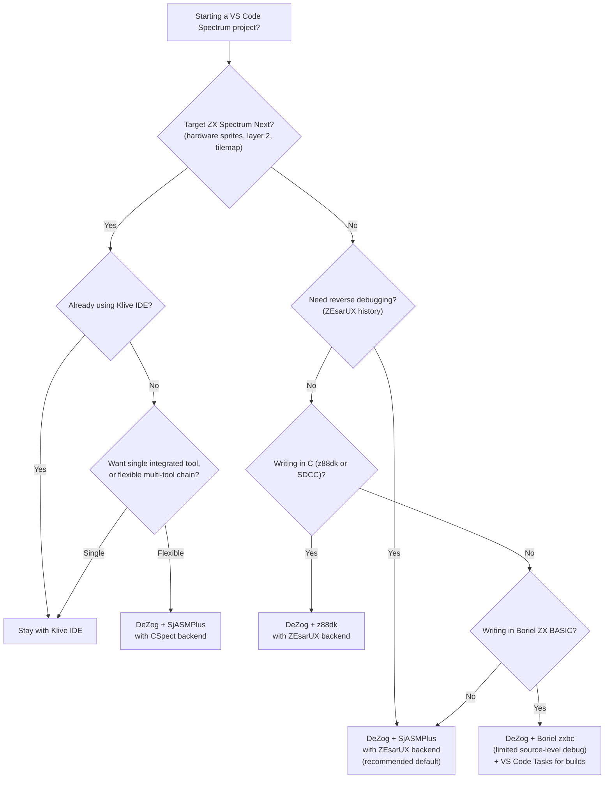

[← Toolchain](README.md) · [← cross_platform toolchain](cross_platform_toolchain.md) · [← debugging](debugging.md)

# VS Code Integration — The Modern ZX Spectrum Developer Environment

> **Scope.** This article is the canonical reference for using **Visual Studio Code** as the integrated development environment for ZX Spectrum development. It covers the ecosystem of Z80-specific extensions (DeZog, Z80 Macro-Assembler, Z80 Assembly Meter, Klive IDE, SpectNetIDE, ASM Code Lens, Hex Editor), the generic VS Code features that complete the workflow (Tasks, launch configurations, problem matchers, workspace layout), a recommended end-to-end setup that takes a project from `mkdir` to a source-level debugging session in ZEsarUX, comparison matrices, decision trees, best practices, and pitfalls. The intended reader is comfortable with VS Code basics (settings, extensions, the Command Palette) and wants to apply it to ZX Spectrum development specifically.

> [!TIP]
> **VS Code is the recommended IDE for new ZX Spectrum development** on macOS, Linux, and Windows. It is free, open-source (under the [MIT license for the core; the official Microsoft build adds proprietary branding and the Marketplace](https://github.com/microsoft/vscode)), has first-class Z80 extensions, and runs identically across the three operating systems. The standalone IDEs covered in [cross_platform_toolchain.md](cross_platform_toolchain.md) (Klive IDE, SpectNetIDE, ZXDevStudio, ZX Spin) are good choices if you want an all-in-one Spectrum-only environment — but VS Code's combination of language services, Git integration, terminal, and extensibility is hard to match.

---

## Why VS Code for ZX Spectrum Development

The ZX Spectrum toolchain has historically been a command-line affair: edit in one tool, assemble in another, run in an emulator, debug with pen and paper. Standalone IDEs (Klive IDE, SpectNetIDE, ZXDevStudio, ZX Spin) closed some of that gap, but each locks you into a single maintainer's vision of what the workflow should look like.

VS Code inverts the model. It is a generic text editor with a thin language-service protocol and a deep extension API. The Z80 community has built the pieces you need:

- **Syntax highlighting and language services** for Z80 assembly (multiple extensions, see below).
- **Source-level debugging** via DeZog, which bridges VS Code's Debug Adapter Protocol to ZEsarUX, CSpect, MAME, and an internal Z80 simulator.
- **Cycle-count analysis** via the Z80 Assembly Meter, which annotates each instruction's T-state cost inline.
- **Hex-dump viewing** of `.scr`, `.tap`, `.sna`, and other binary formats via Microsoft's Hex Editor extension.
- **Build tasks and problem matchers** that turn `zxbc`, `z88dk-zcc`, `sdcc`, and `sjasmplus` output into clickable error messages.
- **Integrated terminal** so the emulator, the assembler, and the file watcher all live in one window.

The result is a single application that handles every step of the inner loop: edit → assemble → flash → debug → edit. This article walks through how to assemble that environment.

### What VS Code Is — and Isn't

- **Is** a text editor with first-class extension support, Git integration, an integrated terminal, and a debug protocol.
- **Is not** an emulator. You still run Fuse, ZEsarUX, CSpect, or MAME separately; VS Code talks to them over a debug protocol.
- **Is not** a compiler. SjASMPlus, z88dk, SDCC, and Boriel ZX BASIC run as external tools, invoked via Tasks or the integrated terminal.
- **Is not** a Spectrum-specific environment. The Spectrum-specific features come from extensions written by the community.

The payoff: VS Code is the one tool that scales from a one-file assembly hack to a multi-directory hybrid project mixing C, assembly, BASIC, music modules, and sprites — with a consistent UI throughout.

### Platform Notes

| OS | Recommended install | Notes |
|---|---|---|
| **macOS** | "Visual Studio Code.app" from [code.visualstudio.com](https://code.visualstudio.com) | Apple Silicon native (universal binary). Homebrew: `brew install --cask visual-studio-code`. |
| **Linux** | `.deb` / `.rpm` / `.tar.gz` from the website, or `snap install code --classic` | On Wayland, add `--enable-features=UseOzonePlatform --ozone-platform=wayland` to `argv` if you see flicker. |
| **Windows** | User installer from the website, or `winget install Microsoft.VisualStudio.Code` | Add to PATH during install so `code` works from `cmd` and PowerShell. |

All three platforms support the same extension ecosystem. The Z80 extensions are pure JavaScript/TypeScript and have no native dependencies.

---

## The Extension Ecosystem

The table below summarizes every VS Code extension that materially helps with ZX Spectrum development. Each is covered in depth later in this article.

| Extension | Author | Purpose | Status (2025) |
|---|---|---|---|
| **DeZog** | [Maz (Marian Alte)](https://marketplace.visualstudio.com/items?itemName=maz.maz) | Z80 source-level debugger. Bridges VS Code's Debug Adapter Protocol to ZEsarUX, CSpect, MAME, and an internal simulator. Reads SLD (SjASMPlus), `.lis`/`.map` (z88dk), `.cdb` (SDCC). | Active, regular releases. The de facto Spectrum debugger. |
| **Z80 Macro-Assembler** | [Imanolea (Manuel Martínez)](https://marketplace.visualstudio.com/items?itemName=imanolea.z80-macroasm) | Language server for Z80 assembly: syntax highlighting, snippets, completion, label navigation. Supports SjASMPlus, z88dk-z80asm, Pasmo, and generic syntaxes. | Active. The most popular Z80 language extension. |
| **Z80 Assembly Meter** | [the.colon (Tobias B. Staar)](https://marketplace.visualstudio.com/items?itemName=the.colon.z80-meter) | Inline T-state and byte-size annotations next to each instruction. Supports Z80, Z80N (Spectrum Next), and several variants. | Active. Essential for cycle-count-critical code. |
| **ASM Code Lens** | [tage3broke](https://marketplace.visualstudio.com/items?itemName=tage3broke.asmcodelens) | Code-lens annotations for assembly: label addresses, instruction sizes, references. Works alongside Z80 Macro-Assembler. | Active. |
| **Hex Editor** | [Microsoft](https://marketplace.visualstudio.com/items?itemName=ms-vscode.hexeditor) | Binary file viewer/editor for `.bin`, `.scr`, `.tap`, `.sna`, `.z80`, `.nex`, etc. | Official Microsoft extension. |
| **Klive IDE** | [Dotneteer (Zsoldos Gábor)](https://marketplace.visualstudio.com/items?itemName=dotneteer.kliveide) | Combined emulator + assembler + debugger, purpose-built for ZX Spectrum and ZX Spectrum Next. Optional VS Code extension variant. | Active. Standalone IDE is primary; VS Code extension provides language services. |
| **SpectNetIDE** | [Dotneteer (Zsoldos Gábor)](https://marketplace.visualstudio.com/items?itemName=dotneteer.spectnetide) | Earlier VS Code extension by the Klive author. Emulator integration, Z80 assembly language services, disassembly view. Superseded by Klive for new projects. | Maintenance mode. |
| **z80asm** | [tom-nixon](https://marketplace.visualstudio.com/items?itemName=tom-nixon.z80asm) | Minimal Z80 syntax highlighting. Pre-dates Z80 Macro-Assembler; kept here for historical context. | Unmaintained; use Z80 Macro-Assembler instead. |
| **Z80 Instruction Set** | [community](https://marketplace.visualstudio.com/items?itemName=eoranged.z80-instruction-set) | Hover reference for Z80 opcodes: shows T-states, byte encoding, affected flags. | Useful for learners. Lightweight. |

The **minimum useful set** for a new project is:

1. **DeZog** (debugging)
2. **Z80 Macro-Assembler** (editing)
3. **Z80 Assembly Meter** (timing analysis)
4. **Hex Editor** (binary inspection)

The others are situational. Klive and SpectNetIDE overlap with DeZog + Macro-Assembler; pick one stack and stick with it.

### Installing Extensions

From the UI: `View → Extensions` (or `Cmd/Ctrl+Shift+X`), search by name, click Install.

From the command line (reproducible setup, useful for CI):

```bash
code --install-extension maz.maz                  # DeZog
code --install-extension imanolea.z80-macroasm     # Z80 Macro-Assembler
code --install-extension the.colon.z80-meter       # Z80 Assembly Meter
code --install-extension ms-vscode.hexeditor       # Hex Editor
```

Save these in a setup script in your project's `docs/` folder so new contributors get the same environment.

### Workspace Recommendations

VS Code supports workspace-level extension recommendations. Create `.vscode/extensions.json` in your project root:

```json
{
  "recommendations": [
    "maz.maz",
    "imanolea.z80-macroasm",
    "the.colon.z80-meter",
    "ms-vscode.hexeditor"
  ]
}
```

When a contributor opens the project for the first time, VS Code prompts to install the recommended extensions.

---

## DeZog — The Z80 Source-Level Debugger

**DeZog** is the centerpiece of the VS Code ZX Spectrum workflow. It is a Debug Adapter Protocol implementation that lets VS Code's built-in debugger UI (breakpoints, call stack, watch, memory view, register view) drive an external Z80 emulator or its own internal simulator.

DeZog is authored and maintained by **Maz (Marian Alte)** since 2019. Source and documentation: [github.com/maz-tools/DeZog](https://github.com/maz-tools/DeZog).

### Architecture

```mermaid
flowchart LR
    VSCode["VS Code<br/>(Debug UI)"] -- Debug Adapter Protocol --> DZ["DeZog<br/>(DAP server)"]
    DZ -- ZRCP socket --> ZZX["ZEsarUX<br/>(recommended)"]
    DZ -- CSpect plugin API --> CS["CSpect<br/>(for ZX Next)"]
    DZ -- MAME debug socket --> MAME["MAME"]
    DZ -- in-process --> SIM["Built-in Z80 simulator"]
    DZ -- reads --> SLD["SLD / .lis / .map / .cdb"]
    SRC["Source files<br/>(.asm / .c / .bas)"] -. referenced by . -> VSCode
```

### Backends

DeZog supports four backends. Choose based on what you are developing:

| Backend | Best for | Pros | Cons |
|---|---|---|---|
| **ZEsarUX** | 48K, 128K, +2A/+3, ZX Next (general dev) | Reverse debugging, full ZX hardware emulation, ZX Next support, mature | Requires ZEsarUX running in `--expect-zrcp` mode |
| **CSpect** | ZX Spectrum Next (especially hardware sprites, layer 2, tilemap) | Most accurate ZX Next hardware emulation | Requires the cspect-dezog plugin; no reverse debugging |
| **MAME** | Cross-platform Z80 work (arcade, MSX, Spectrum, etc.) | Universal coverage | No ZX-specific UI; less polished Spectrum experience |
| **Internal simulator** | Pure-Z80 algorithm debugging (no I/O) | Zero setup | No hardware emulation; `IN`/`OUT`/memory-mapped IO will not work |

For most ZX Spectrum work, **ZEsarUX is the recommended backend**. CSpect is the right choice when you specifically target ZX Spectrum Next hardware features that ZEsarUX does not emulate as accurately (sprite compositing in particular).

### Symbol File Formats

DeZog reads debug metadata emitted by the major assemblers/compilers:

| Format | Producer | Configuration |
|---|---|---|
| **SLD** (Source Level Debug) | SjASMPlus | Pass `--sld --fullpath` to `sjasmplus`. |
| `.lis` + `.map` | z88dk (sccz80) | `zcc` produces these alongside the binary by default. |
| `.cdb` | SDCC, z88dk `-compiler=sdcc` | SDCC emits `.cdb` by default. |
| `.sym` | Pasmo, miscellaneous | Use as a fallback when no richer format is available. |

The SLD format is the richest — it carries source-file/line mappings, watchable expressions, and bank information. DeZog's SLD support is the reason SjASMPlus is the recommended assembler for new projects.

### Configuration — `launch.json`

A typical `.vscode/launch.json` for a SjASMPlus + ZEsarUX workflow:

```json
{
  "version": "0.2.0",
  "configurations": [
    {
      "name": "DeZog: ZEsarUX (48K)",
      "type": "dezog",
      "request": "launch",
      "program": "${workspaceFolder}/build/game.sna",
      "sldFile": "${workspaceFolder}/build/game.sld",
      "zrcp": {
        "host": "localhost",
        "port": 10001
      },
      "zesarux": {
        "path": "zesarux",
        "args": ["--machine", "48k", "--expect-zrcp", "--nowait"]
      },
      "stopOnEntry": true,
      "registerOnStart": ["PC", "SP", "AF", "BC", "DE", "HL", "IX", "IY"],
      "history": {
        "reverseDebugBacktrace": true,
        "historySize": 65536
      },
      "preLaunchTask": "build"
    }
  ]
}
```

Key fields:

- `type: "dezog"` — VS Code's signal to use the DeZog debug adapter.
- `program` — the binary to load into the emulator (`.sna`, `.tap`, `.z80`, or `.nex`).
- `sldFile` — the SLD debug symbol file emitted by `sjasmplus --sld`.
- `zrcp` — ZEsarUX Remote Command Protocol endpoint. Match these to the `--expect-zrcp` flag passed to ZEsarUX.
- `zesarux.path` and `zesarux.args` — DeZog can launch ZEsarUX itself on session start. Without these, you must start ZEsarUX manually with `--expect-zrcp --port 10001`.
- `stopOnEntry` — pause at the program's entry point so you can set breakpoints before any code runs.
- `registerOnStart` — which CPU registers to display in the Variables view.
- `history.reverseDebugBacktrace` — enables the reverse-debugging backtrace view (ZEsarUX-only feature).
- `preLaunchTask` — the VS Code Task name to run before starting the debug session (typically `build`, which invokes your assembler).

### Features in the Debug Session

Once the debug session is running, the standard VS Code debug UI applies:

- **Continue / Step Over / Step Into / Step Out** — mapped to DeZog's instruction-level stepping. Source-level stepping works when the symbol file has source/line info; otherwise DeZog falls back to instruction stepping.
- **Breakpoints** — set on source lines or on memory addresses. DeZog supports several Spectrum-specific breakpoint types: execution, memory read, memory write, port read, port write.
- **Watch** — Z80 expressions: register names (`A`, `HL`, `IX`), symbols (variable names from SLD/`.lis`), and simple arithmetic (`HL + 10`).
- **Call Stack** — call hierarchy from the current PC. With reverse debugging (ZEsarUX), the call stack is reconstructed from history.
- **Memory View** — hex-dump of any memory range. Useful for inspecting the display file, attribute file, or your own buffers.
- **Disassembly View** — when no source is available (e.g. stepping into ROM routines), DeZog shows the disassembled Z80.
- **Register View** — all CPU registers including `R` (refresh), `I` (interrupt vector), `IFF1`/`IFF2`, and `IM` (interrupt mode).

### Reverse Debugging (ZEsarUX only)

ZEsarUX records every executed instruction to a circular history buffer. DeZog exposes this as VS Code's **Step Back** and **Reverse Continue** commands. With `history.reverseDebugBacktrace: true`, the call stack is reconstructed from the history — letting you see how you got to the current state, not just where you are.

This is invaluable for diagnosing crashes. Set a breakpoint on the crash address, run until it hits, then **Step Back** repeatedly to walk up the chain of calls that led there. The history depth is configurable (`history.historySize`, default 65536 instructions; increase for long-running sessions).

### DeZog Settings (`settings.json`)

Workspace-level settings to put in `.vscode/settings.json`:

```json
{
  "dezog.zesarux_exe": "zesarux",
  "dezog.history.enabled": true,
  "dezog.history.size": 65536,
  "dezog.assembler": "sjasmplus",
  "dezog.launch.loadObsolescenceWarning": false
}
```

See the DeZog [README](https://github.com/maz-tools/DeZog/blob/master/README.md) for the full settings catalog.

---

## Z80 Macro-Assembler Extension — Editing and Language Services

The **Z80 Macro-Assembler** extension by **Imanolea (Manuel Martínez)** is the most widely used Z80 language extension for VS Code. It provides syntax highlighting, completion, snippets, label navigation, and basic diagnostics for Z80 assembly source.

Source: [github.com/imanolea/z80-macroasm-vscode](https://github.com/imanolea/z80-macroasm-vscode) (mirror; the canonical distribution is via the VS Code Marketplace).

### Features

- **Syntax highlighting** for Z80 instructions, registers, directives, comments, strings, and numbers. Uses TextMate grammars, so it works in any editor that supports them (VS Code, Sublime Text via conversion, etc.).
- **Snippets** for common idioms: `LD16` (16-bit load HL,NN), `LDIR` (with comments), `MEMSET`, `MEMCPY`, etc.
- **Completion** for instruction mnemonics, register names, and (when configured) labels from the current file.
- **Symbol provider** — `Cmd/Ctrl+Shift+O` brings up the list of labels in the current file; `Cmd/Ctrl+T` across the workspace (if multiple `.asm` files are open).
- **Go to Definition** — `F12` on a label jumps to its definition, including across `INCLUDE` boundaries if the files are in the workspace.
- **Diagnostics** — flags unknown mnemonics and obvious syntax errors. Not a full assembler pass; for full validation you still need to run `sjasmplus`.

### Supported Assemblers

The extension has variants of the grammar tuned for different assemblers. In `.vscode/settings.json`:

```json
{
  "z80MacroAssembler.assembler": "sjasmplus",
  "z80MacroAssembler.formatting.enabled": true,
  "z80MacroAssembler.completion.caseInsensitive": true
}
```

Supported values include `sjasmplus`, `z88dk-z80asm`, `pasmo`, `generic`. The choice affects which directives are highlighted (e.g. `SAVESNA` for SjASMPlus, `DEFC` for z88dk-z80asm) and which snippets are offered.

### Customizing the Grammar

The extension ships a default grammar; if you have project-specific macros that you want highlighted as keywords, you can extend the grammar in `settings.json`:

```json
{
  "z80MacroAssembler.additionalKeywords": [
    "MEMPTR",
    "MEMREAD",
    "MEMWRITE",
    "PORTREAD"
  ],
  "z80MacroAssembler.additionalDirectives": [
    "MYMACRO",
    "STRUCT_END"
  ]
}
```

### File Associations

By default VS Code does not know what to do with `.asm` files (there are several conflicting extensions for it). Add this to `settings.json` to claim the extension for Z80 Macro-Assembler:

```json
{
  "files.associations": {
    "*.asm": "z80-macroasm",
    "*.inc": "z80-macroasm",
    "*.s": "z80-macroasm",
    "*.z80": "z80-macroasm",
    "*.z80asm": "z80-macroasm"
  }
}
```

### Limitations

- **No real assembler integration.** The extension does not invoke `sjasmplus` or any other assembler; it parses the file with its own simplified grammar. Errors that the real assembler would catch (undefined labels, wrong macro arity, illegal addressing modes) are not flagged.
- **No symbol table across files.** Completion uses labels from the current file only. For cross-file navigation, use the workspace symbol search (`Cmd/Ctrl+T`) — it works because the extension registers each label as a symbol.
- **Formatting is opinionated.** If you have a project style guide (e.g. label column 1, mnemonic column 9, operands column 17), you may need to disable the extension's formatter and use a custom one.

---

## Z80 Assembly Meter — Cycle Counting in the Editor

The **Z80 Assembly Meter** by **the.colon (Tobias B. Staar)** is a unique extension that annotates each Z80 instruction with its T-state cost and byte size, inline in the editor.

A line like:

```z80
    ld hl, 0x4000    ; load screen base
    ldir             ; copy bytes
```

becomes:

```z80
    ld hl, 0x4000    ; load screen base                 [3 bytes, 10 T]
    ldir             ; copy bytes                       [2 bytes, 21 T/iter]
```

(Annotations appear as code lenses above each line.)

### Why This Matters

ZX Spectrum development is often timing-sensitive:
- **Beeper music** engines must complete their work within the 64-microsecond vertical blank.
- **Multicolor effects** require precise cycle counting to change attributes mid-frame.
- **Game loops** must finish their update + draw within the ~70000-T-state frame budget.
- **Wait loops** (e.g. `djnz $-` for delay) need a known cycle count.

Hand-counting T-states from a printed opcode table is error-prone. The Meter automates it.

### Configuration

```json
{
  "z80AssemblyMeter.cpu": "z80",            // or "z80n", "z180", "z80gb"
  "z80AssemblyMeter.showCodeLens": true,
  "z80AssemblyMeter.showTStates": true,
  "z80AssemblyMeter.showBytes": true,
  "z80AssemblyMeter.showTotal": true,       // show running total for selected lines
  "z80AssemblyMeter.timingModel": "contended" // or "uncontended" — applies ZX Spectrum contention
}
```

The `timingModel: "contended"` setting is the Spectrum-specific one: it accounts for the [contention pattern](../01_cpu/z80_architecture.md) of the 48K Spectrum where accesses to upper RAM (`0x4000`–`0x7FFF`) incur extra T-states depending on the frame position. For the ZX Spectrum Next at 28MHz, use `z80n` and `uncontended`.

### Total-Toggle Selection Mode

Highlighting a range of lines and pressing the Meter's "Show Total" command displays:
- Total T-states for the selection.
- Total bytes for the selection.
- Time in microseconds at 3.5 MHz (Spectrum) or 7 MHz / 14 MHz / 28 MHz (Next).

This is invaluable for sizing wait loops and checking that a routine fits within a frame.

### Coverage

The Meter supports the entire Z80 instruction set plus the **Z80N extensions** (`LDPIRX`, `MUL`, `SWAPNIB`, `MIRROR`, `NEXTREG` reads via `LD A,NN ; NEXTREG R,A`, etc.). Coverage is verified against the [z80-nopcode-reference](https://github.com/Imanolea/z80-macroasm-vscode) reference and the [ZX Spectrum Next technical specification](https://gitlab.com/thesmog358/tbblue/-/raw/master/docs/nextreg.txt).

---

## Klive IDE and SpectNetIDE — Combined Emulator + Editor Extensions

Both **Klive IDE** and its predecessor **SpectNetIDE** are by the same author, **Dotneteer (Zsoldos Gábor)**. They represent a different model from the DeZog + Macro-Assembler combination: instead of bridging VS Code to an external emulator, each ships **its own integrated emulator** and exposes the Spectrum's state through VS Code views.

### Klive IDE

Klive is the active project ([github.com/Dotneteer/kliveide](https://github.com/Dotneteer/kliveide)). The standalone application (`.app` / `.exe`) is the primary distribution; the VS Code extension provides language services (syntax highlighting, completion) and bridges the standalone emulator's debug protocol to VS Code's Debug Adapter Protocol.

**Strengths:**

- **First-class ZX Spectrum Next support.** Klive emulates the Next's layer 2, hardware sprites, tilemap, and DMA. CSpect is the only other emulator with comparable Next hardware coverage; Klive's integration is tighter because the debugger is part of the same program.
- **Built-in Z80 assembler** (the *Klive Z80 Assembler*), which produces debug symbol information that the IDE consumes directly — no external symbol file configuration needed.
- **ZX BASIC support**: Klive integrates Boriel's ZX BASIC compiler, allowing mixed-language projects (Z80 assembly + ZX BASIC) within the same IDE.
- **Memory, register, and disassembly views** purpose-built for Z80, not the generic VS Code hex view.
- **Combined keyboard / Kempston / Cursor joystick / Sinclair joystick model** in the emulator.

**Limitations:**

- The emulator is Klive's own (a clean-room reimplementation). For Spectrum 48K/128K it is accurate; for some edge cases (especially around timing and contention) it is less battle-tested than Fuse or ZEsarUX. Cross-test on a second emulator before releasing.
- The Klive Z80 Assembler has slightly different syntax from SjASMPlus — mostly compatible, but some macros and directives differ. Existing SjASMPlus projects may need small adjustments.
- The VS Code extension requires the standalone Klive application to be installed; it talks to the standalone over a local protocol.

### When to Choose Klive

- Your project targets ZX Spectrum Next hardware features.
- You want a single-vendor stack (emulator + assembler + debugger + editor) rather than assembling your own.
- You write ZX BASIC + assembly hybrid projects and want consistent syntax highlighting for both.

### When to Choose DeZog + SjASMPlus Instead

- You target the standard 48K / 128K Spectrum and want the most battle-tested emulator (Fuse, ZEsarUX).
- You want reverse debugging (only ZEsarUX supports this, via DeZog).
- You want to keep the assembler decoupled from the IDE so CI can run it headless.

### SpectNetIDE

SpectNetIDE is Klive's predecessor. It pioneered the integrated-emulator model for VS Code but has been superseded by Klive for new development. SpectNetIDE remains functional but receives only maintenance updates.

If you are starting a new project, use Klive. If you have an existing SpectNetIDE project, the migration path is to switch the assembler input to SjASMPlus and the debugger to DeZog — see the [migration notes](https://github.com/Dotneteer/kliveide/wiki/Migrating-from-SpectNetIDE) in the Klive wiki.

---

## Hex Editor — Binary File Inspection

The **Hex Editor** extension by Microsoft is the official binary viewer for VS Code. Install it from the Marketplace (`ms-vscode.hexeditor`) or via `code --install-extension ms-vscode.hexeditor`.

### Use Cases for ZX Spectrum Development

- **Inspecting `.scr` files.** A Spectrum screen dump is 6912 bytes; opening it in the hex editor lets you see the bitmap + attribute layout directly.
- **Inspecting `.tap` / `.tzx` files.** Tape files have a block structure (header + data) that's easier to understand in hex than in a text editor.
- **Inspecting `.sna` / `.z80` snapshots.** Look at the register save state, the RAM contents, or compare two snapshots to see what changed.
- **Inspecting `.bin` output.** Verify that your assembler produced the bytes you expect — for example, confirming that `0x8000: 0x21 0x00 0x40` is `ld hl, 0x4000`.
- **Inspecting `.nex` files.** The ZX Spectrum Next file format has a header with metadata (entry point, stack pointer, register state) that is most readable in hex.

### Activating the Hex View

VS Code does not open binary files in hex by default. To open a file in the Hex Editor:

1. Right-click the file in the Explorer.
2. Select **"Open With..." → "Hex Editor"**.

Or configure `settings.json` to use Hex Editor by default for binary file types:

```json
{
  "workbench.editorAssociations": {
    "*.bin": "hexeditor.hexedit",
    "*.scr": "hexeditor.hexedit",
    "*.tap": "hexeditor.hexedit",
    "*.tzx": "hexeditor.hexedit",
    "*.sna": "hexeditor.hexedit",
    "*.z80": "hexeditor.hexedit",
    "*.nex": "hexeditor.hexedit",
    "*.rom": "hexeditor.hexedit"
  }
}
```

### Features

- **Hex + ASCII columns.** Standard hex-dump layout.
- **Multi-byte interpretation.** Select 1, 2, 4, or 8 bytes and the editor shows their interpretation as signed/unsigned integer, float, or double.
- **Endianness toggle.** Little-endian (Z80 native) by default.
- **Search.** Find by hex bytes or by ASCII text.
- **Edit and save.** Changes write back to the file.
- **Memory layout overlay** — does not exist as a built-in feature, but can be approximated by typing `0x8000` in the address bar to jump to the entry point of a snapshot.

### Limitations

- **No file-format awareness.** The Hex Editor does not know that `.scr` files are bitmap+attribute; you must read the structure yourself. For format-aware inspection, use a dedicated tool (e.g. `xxd`, `tapinfo`, or [SkoolKit](disassemblers.md) `snapinfo.py`).
- **No diff view** between two binary files. Use the VS Code Compare feature on two text dumps (`xxd -g1 file.scr > file.hex`) for that.

---

## Other Useful Extensions

### ASM Code Lens

Lightweight extension that adds code-lens annotations above each label: total bytes of the labeled block, count of references, and the resolved address (when the symbol file is loaded).

Pairs well with the **Z80 Assembly Meter** — Meter shows per-instruction cost, ASM Code Lens shows per-block totals.

### Z80 Instruction Set Reference

A minimal extension that shows reference info on hover for any Z80 opcode. Useful for learners who don't yet have the opcode table memorized. Redundant once you know the instruction set, but harmless to keep installed.

### Generic VS Code Extensions That Complete the Workflow

These aren't Spectrum-specific but they round out the development environment:

- **C/C++** (`ms-vscode.cpptools`) — for IntelliSense when editing C code targeting z88dk or SDCC. Configure `includePath` to point at your z88dk install's `include/` directory.
- **Python** (`ms-python.python`) — for asset-pipeline scripts (png2scr, tmx2map, etc.). See [asset_tools.md](asset_tools.md) for the asset pipeline.
- **EditorConfig** (`editorconfig.editorconfig`) — for consistent formatting across contributors.
- **Rewrap** (`stkb.rewrap`) — for re-flowing comment blocks in assembly source.
- **GitLens** (`eamodio.gitlens`) — for blame and history on assembly source files.

---

## Build Tasks and Problem Matchers

VS Code Tasks are the bridge between the editor and your build tools. A task is a JSON description of a command to run; VS Code can execute it on demand (via `Cmd/Ctrl+Shift+B` for the default build task, or `Cmd/Ctrl+Shift+P → Tasks: Run Task`) or trigger it from a debug session's `preLaunchTask`.

A **problem matcher** parses the command's output and turns error/warning lines into clickable items in VS Code's Problems panel — the same UX as a compiled language.

### `.vscode/tasks.json` for SjASMPlus

```json
{
  "version": "2.0.0",
  "tasks": [
    {
      "label": "build",
      "type": "shell",
      "command": "sjasmplus",
      "args": [
        "--sld",
        "--fullpath",
        "--outprefix=build/",
        "--lst",
        "src/main.asm"
      ],
      "group": {
        "kind": "build",
        "isDefault": true
      },
      "problemMatcher": {
        "owner": "sjasmplus",
        "fileLocation": ["relative", "${workspaceFolder}"],
        "pattern": {
          "regexp": "^(.*?):(\\d+):\\s*(error|warning):\\s*(.*)$",
          "file": 1,
          "line": 2,
          "severity": 3,
          "message": 4
        }
      },
      "presentation": {
        "echo": true,
        "reveal": "always",
        "focus": false,
        "panel": "shared"
      }
    }
  ]
}
```

This makes `Cmd/Ctrl+Shift+B` run SjASMPlus with the SLD debug-info flag (so DeZog has symbols), the `--fullpath` flag (so SLD paths resolve from any working directory), and the listing output. The `problemMatcher` parses SjASMPlus's `path:line: error: message` format and turns each into a Problems-panel entry.

### `.vscode/tasks.json` for z88dk

```json
{
  "version": "2.0.0",
  "tasks": [
    {
      "label": "build-z88dk",
      "type": "shell",
      "command": "zcc",
      "args": [
        "+zx",
        "-vn",
        "-O3",
        "-clib=new",
        "-lm",
        "-create-app",
        "-o",
        "build/game",
        "src/main.c"
      ],
      "group": "build",
      "problemMatcher": "$gcc",
      "presentation": {
        "reveal": "always"
      }
    }
  ]
}
```

z88dk's `zcc` emits GCC-style error messages (`file:line:col: error: message`), so VS Code's built-in `$gcc` problem matcher works out of the box — no custom pattern needed.

### `.vscode/tasks.json` for Boriel ZX BASIC

```json
{
  "version": "2.0.0",
  "tasks": [
    {
      "label": "build-boriel",
      "type": "shell",
      "command": "zxbc",
      "args": [
        "-O2",
        "--tap",
        "--BASIC",
        "--autorun",
        "--heap-size", "8192",
        "-o", "build/game.tap",
        "src/main.bas"
      ],
      "group": "build",
      "problemMatcher": {
        "owner": "zxbc",
        "fileLocation": ["relative", "${workspaceFolder}"],
        "pattern": {
          "regexp": "^\\s*(.*?):(\\d+):\\s*(error|warning):\\s*(.*)$",
          "file": 1,
          "line": 2,
          "severity": 3,
          "message": 4
        }
      }
    }
  ]
}
```

### Multi-Task Pipelines (Asset Build + Code Build)

Real projects typically build assets (sprites, fonts, music) and code separately. VS Code supports `dependsOn` for multi-step tasks:

```json
{
  "version": "2.0.0",
  "tasks": [
    {
      "label": "build-assets",
      "type": "shell",
      "command": "make",
      "args": ["-C", "assets", "all"],
      "problemMatcher": []
    },
    {
      "label": "build-code",
      "type": "shell",
      "command": "sjasmplus",
      "args": ["--sld", "--fullpath", "--outprefix=build/", "src/main.asm"],
      "problemMatcher": {"owner": "sjasmplus", "pattern": {"regexp": "^(.*?):(\\d+):\\s*(error|warning):\\s*(.*)$", "file": 1, "line": 2, "severity": 3, "message": 4}},
      "dependsOn": "build-assets"
    },
    {
      "label": "build",
      "dependsOn": ["build-code"],
      "group": {"kind": "build", "isDefault": true},
      "problemMatcher": []
    }
  ]
}
```

Running `build` invokes `build-code`, which first invokes `build-assets`. Output from each task appears in the integrated terminal.

### File Watcher — Auto-Build on Save

For instant feedback, configure a file watcher to trigger the build task whenever you save a source file:

```json
// .vscode/settings.json
{
  "files.autoSave": "afterDelay",
  "files.autoSaveDelay": 1000
}
```

```json
// .vscode/tasks.json — extend with "watch" task
{
  "label": "watch",
  "type": "shell",
  "command": "find src -name '*.asm' -o -name '*.inc' | entr -c sjasmplus --sld --outprefix=build/ src/main.asm",
  "isBackground": true,
  "problemMatcher": {
    "owner": "sjasmplus",
    "pattern": {"regexp": "^(.*?):(\\d+):\\s*(error|warning):\\s*(.*)$", "file": 1, "line": 2, "severity": 3, "message": 4},
    "background": {
      "activeOnStart": true,
      "beginsPattern": "^sjasmplus",
      "endsPattern": "^(.*?):(\\d+):\\s*(error|warning):\\s*(.*)$|SjASMPlus .* done"
    }
  },
  "group": "build"
}
```

Requires the [`entr`](http://eradman.com/entrproject/) utility (Linux/macOS: `brew install entr`; Windows: use `watchexec` instead). Once running, every save triggers a rebuild within ~100 ms.

---

## Worked Example — A Complete Project Setup

This section walks through creating a new ZX Spectrum project from scratch, configured for VS Code with the SjASMPlus + DeZog + ZEsarUX stack.

### Project Layout

```
game/
├── .vscode/
│   ├── settings.json         # editor + extension settings
│   ├── tasks.json            # build task(s)
│   ├── launch.json           # DeZog debug configuration
│   └── extensions.json       # recommended extensions
├── src/
│   ├── main.asm              # entry point
│   ├── video.asm             # screen routines
│   └── include/
│       └── macros.asm        # shared macros
├── assets/
│   └── title.scr             # title screen (built separately)
├── build/                    # output directory (gitignored)
│   ├── game.sna
│   ├── game.sld
│   └── game.lst
├── Makefile                  # top-level build orchestration
└── README.md
```

### Step 1 — `.vscode/extensions.json`

```json
{
  "recommendations": [
    "maz.maz",
    "imanolea.z80-macroasm",
    "the.colon.z80-meter",
    "ms-vscode.hexeditor"
  ]
}
```

### Step 2 — `.vscode/settings.json`

```json
{
  "files.associations": {
    "*.asm": "z80-macroasm",
    "*.inc": "z80-macroasm",
    "*.s": "z80-macroasm"
  },
  "z80MacroAssembler.assembler": "sjasmplus",
  "z80AssemblyMeter.cpu": "z80",
  "z80AssemblyMeter.timingModel": "contended",
  "z80AssemblyMeter.showTotal": true,
  "dezog.zesarux_exe": "zesarux",
  "dezog.history.enabled": true,
  "dezog.history.size": 65536,
  "search.exclude": {
    "**/build": true
  },
  "files.exclude": {
    "**/build/*.lst": true,
    "**/.git": true
  }
}
```

### Step 3 — `.vscode/tasks.json`

```json
{
  "version": "2.0.0",
  "tasks": [
    {
      "label": "build",
      "type": "shell",
      "command": "sjasmplus",
      "args": [
        "--sld",
        "--fullpath",
        "--lst",
        "--outprefix=build/",
        "src/main.asm"
      ],
      "group": {"kind": "build", "isDefault": true},
      "problemMatcher": {
        "owner": "sjasmplus",
        "fileLocation": ["relative", "${workspaceFolder}"],
        "pattern": {
          "regexp": "^(.*?):(\\d+):\\s*(error|warning):\\s*(.*)$",
          "file": 1,
          "line": 2,
          "severity": 3,
          "message": 4
        }
      }
    },
    {
      "label": "clean",
      "type": "shell",
      "command": "rm",
      "args": ["-rf", "build/"],
      "problemMatcher": []
    }
  ]
}
```

### Step 4 — `.vscode/launch.json`

```json
{
  "version": "0.2.0",
  "configurations": [
    {
      "name": "Debug in ZEsarUX (48K)",
      "type": "dezog",
      "request": "launch",
      "program": "${workspaceFolder}/build/game.sna",
      "sldFile": "${workspaceFolder}/build/game.sld",
      "zrcp": {
        "host": "127.0.0.1",
        "port": 10001
      },
      "zesarux": {
        "path": "zesarux",
        "args": [
          "--machine", "48k",
          "--expect-zrcp",
          "--nowait",
          "--no-border",
          "--ao", "none"
        ]
      },
      "stopOnEntry": true,
      "preLaunchTask": "build",
      "history": {
        "reverseDebugBacktrace": true,
        "historySize": 65536
      }
    },
    {
      "name": "Debug in CSpect (ZX Next)",
      "type": "dezog",
      "request": "launch",
      "program": "${workspaceFolder}/build/game.nex",
      "sldFile": "${workspaceFolder}/build/game.sld",
      "cspect": {
        "path": "cspect.exe",
        "args": ["-nex=${workspaceFolder}/build/game.nex"],
        "remote": true
      },
      "stopOnEntry": true,
      "preLaunchTask": "build"
    },
    {
      "name": "Debug in internal simulator",
      "type": "dezog",
      "request": "launch",
      "program": "${workspaceFolder}/build/game.bin",
      "sldFile": "${workspaceFolder}/build/game.sld",
      "stopOnEntry": true,
      "preLaunchTask": "build"
    }
  ]
}
```

This launches three configurations:
1. **ZEsarUX (48K)** — full Spectrum 48K emulation with reverse debugging.
2. **CSpect (ZX Next)** — for `.nex` projects targeting Spectrum Next.
3. **Internal simulator** — quick tests with no emulator setup, suitable for pure-Z80 algorithm work.

### Step 5 — Sample Source (`src/main.asm`)

```z80
    DEVICE ZXSPECTRUM48
    ORG 0x8000
start:
    ld   hl, 0x5800
    ld   (hl), 0x38
    push hl
    pop  de
    inc  de
    ld   bc, 767
    ldir
    ; infinite loop
loop:
    halt
    jr   loop
    SAVESNA "build/game.sna"
```

### Step 6 — First Build and Debug

1. `Cmd/Ctrl+Shift+B` — builds. SLD file appears in `build/`.
2. `F5` — launches the "Debug in ZEsarUX (48K)" configuration. DeZog starts ZEsarUX, loads the snapshot, and pauses at the entry point.
3. Set a breakpoint on `loop:`. Press Continue. Program halts at the breakpoint.
4. Inspect `HL`, `DE`, `BC` in the Variables view; inspect the display file via Memory View (`0x5800`).

### Step 7 — Source-Level Debugging Session

With the SLD file loaded, clicking in the gutter of `src/main.asm` sets a breakpoint tied to the source line, not the address. Editing the source and rebuilding preserves the breakpoint (DeZog re-resolves it from the new SLD).

Reverse debugging: when paused at a crash or breakpoint, press the **Step Back** button (or `Cmd/Ctrl+Shift+-`) to execute the previous instruction. The Call Stack panel updates to show the chain of calls that led to the current state.

---

## Comparison of VS Code Stacks

There are three viable stacks for ZX Spectrum development in VS Code. They overlap but optimize for different needs.

### Stack Comparison Matrix

| Dimension | **DeZog + SjASMPlus + ZEsarUX** | **Klive IDE** | **SpectNetIDE** (legacy) |
|---|---|---|---|
| **Assembler** | SjASMPlus (or z88dk-z80asm, Pasmo) | Klive Z80 Assembler (built-in) | Built-in |
| **Emulator** | ZEsarUX, CSpect, MAME, or internal simulator | Klive's integrated emulator | SpectNetIDE's integrated emulator |
| **Debugger** | DeZog (DAP bridge) | Klive's integrated debugger | SpectNetIDE's integrated debugger |
| **Symbol format** | SLD (SjASMPlus), `.lis`/`.map` (z88dk), `.cdb` (SDCC) | Built-in (no external file needed) | Built-in |
| **Reverse debugging** | ✅ via ZEsarUX history | ❌ | ❌ |
| **ZX Spectrum Next** | ✅ via CSpect backend | ✅ first-class | ⚠️ partial |
| **Cross-platform editor** | ✅ macOS / Linux / Windows | ✅ | ✅ |
| **Cross-platform emulator** | ✅ | ⚠️ standalone app needs per-OS build | ⚠️ |
| **Mixed-language projects (asm + BASIC + C)** | ✅ via Tasks (any toolchain) | ✅ via built-in ZX BASIC integration | ⚠️ |
| **CI / headless builds** | ✅ Tasks run `sjasmplus` directly | ❌ requires GUI for the IDE itself | ❌ |
| **Maturity / maintenance** | Very active (all 3 projects) | Active | Maintenance |
| **Learning curve** | Steep (3+ tools to configure) | Moderate (one tool to learn) | Moderate |
| **Best for** | Most projects — maximum flexibility and tool choice | ZX Spectrum Next projects; users who want one tool | Legacy SpectNetIDE projects only |

### Decision Tree



### The Default Recommendation

For most new ZX Spectrum development, the default stack is **DeZog + SjASMPlus + ZEsarUX**, plus the **Z80 Macro-Assembler** extension for editing and the **Z80 Assembly Meter** for timing. This stack is:
- Built entirely from actively-maintained, cross-platform tools.
- Decoupled — the assembler and emulator are independent processes, so you can swap either.
- Compatible with every ZX Spectrum target (48K through Next) by changing two config values.
- Reproducible — `tasks.json` and `launch.json` check into Git, so contributors get the same setup.

Use Klive IDE when your primary target is the ZX Spectrum Next and you value integration over flexibility. Use SpectNetIDE only if you have an existing project on it.

---

## Best Practices

### Check In `.vscode/` Configuration

The `.vscode/` directory should be committed to Git (or your SCM of choice). It contains the project's build and debug configuration and is the single source of truth for how the project is built and debugged.

Files to commit:
- `.vscode/tasks.json` — build tasks and problem matchers.
- `.vscode/launch.json` — debug configurations.
- `.vscode/extensions.json` — recommended extensions.
- `.vscode/settings.json` — workspace settings. **But see the User vs. Machine Settings note below.**

### Separate User vs. Machine Settings

Some settings are user/machine-specific and should not be committed:
- Paths to executables (`/usr/local/bin/sjasmplus` vs `/opt/homebrew/bin/sjasmplus`).
- Theme preferences.
- Font family and size.

Use VS Code's split between **User Settings** (global, in `~/Library/Application Support/Code/User/settings.json` on macOS) and **Workspace Settings** (`.vscode/settings.json`). Keep paths in User Settings; keep workspace-level configuration (file associations, extension-specific configuration that's portable) in Workspace Settings.

For executable paths that must be in workspace settings (e.g. `dezog.zesarux_exe`), use `PATH` lookup: omit the explicit path and let DeZog find `zesarux` in `PATH`. This is the default behavior.

### Use `--fullpath` with SjASMPlus

The `--fullpath` flag (or `--fullpath` followed by the source path) makes SjASMPlus emit absolute paths in the SLD file. Without it, the SLD contains paths relative to the assembler's working directory, and DeZog may fail to map source lines back to your project files.

```bash
sjasmplus --sld --fullpath --outprefix=build/ src/main.asm
```

### Use the Same Source Directories for Build and Debug

If your `tasks.json` builds from `src/main.asm` and your `launch.json` references `build/game.sna`, both paths must be consistent. The `preLaunchTask` runs the build task before the debug session, so they must agree on where the output goes.

### Pin Tool Versions for Reproducibility

For contributors and CI:

```bash
# tools.lock
sjasmplus: 1.20.1
z88dk: 2.3
sdcc: 4.3.0
zesarux: 5.0
dezog-vscode-extension: 2.4.1
```

Keep this file at the project root. Document in README how to install matching versions. CI scripts read from this file.

### Use the Multi-Root Workspace for Multi-Component Projects

If your project has separate code and asset pipelines maintained by different people, use a VS Code multi-root workspace:

```code-game.code-workspace
{
  "folders": [
    {"path": "."},
    {"path": "../game-assets"}
  ],
  "settings": { /* workspace-level settings */ }
}
```

Both folders appear in the Explorer; tasks and launch configs are shared. Useful when the asset pipeline is its own repository.

---

## Pitfalls

### "Cannot connect to ZEsarUX at port 10001"

DeZog launches ZEsarUX for you when `zesarux.path` is set. But if you start ZEsarUX separately and DeZog also tries to launch it, two instances compete for port 10001. Solutions:
- Let DeZog launch ZEsarUX (don't start it manually).
- Or omit `zesarux.path` and start ZEsarUX yourself with `zesarux --expect-zrcp --port 10001`.

### Stale SLD File After a Build Failure

If the build fails, the SLD file may be missing or stale (from a previous successful build). DeZog then loads the old symbols and breakpoints don't fire where you expect. Fix: include `clean` in your build script, or set `dezog.launch.checkFileExists: true`.

### Wrong Working Directory for Tasks

By default, tasks run in `${workspaceFolder}`. If your assembler expects to be run from `src/` (e.g. for relative `INCLUDE` paths), set `cwd` in the task:

```json
{
  "label": "build",
  "type": "shell",
  "command": "sjasmplus",
  "args": ["main.asm"],
  "options": {"cwd": "${workspaceFolder}/src"}
}
```

### Source Path Mismatch in SLD

If you move a source file or rebuild from a different machine, the absolute paths in the SLD file may not match. Re-run the build with `--fullpath` to refresh them.

### Reverse Debugging Runs Out of History

ZEsarUX's history is a fixed-size circular buffer (default 65536 instructions). For long-running sessions, you'll lose the earliest history. Increase `historySize` in `launch.json`, or pause and restart the debug session to reset.

### DeZog Extension vs. DeZog CLI

DeZog ships two things: a VS Code extension (`maz.maz` in the Marketplace) and a debug adapter (auto-installed by the extension). Don't try to install DeZog from npm or run it directly — the extension handles installation and lifecycle.

### Conflicting Extensions

The `imanolea.z80-macroasm` and the older `tom-nixon.z80asm` extensions both claim `.asm` files. If both are installed, you'll see inconsistent highlighting. Uninstall `tom-nixon.z80asm` and use only `imanolea.z80-macroasm`.

### ZEsarUX Version Drift

ZEsarUX is in active development and the ZRCP protocol gains new commands in each release. DeZog targets the latest stable ZEsarUX. If you run an older ZEsarUX, you may see "unknown command" errors. Update ZEsarUX to match DeZog's expected version (documented in the DeZog release notes).

### Linux: Wayland Audio Glitches

If ZEsarUX runs under Wayland and the audio stutters or pops, run it with `SDL_AUDIODRIVER=alsa` (or `pulseaudio`) explicitly. Wayland audio routing is still maturing; the X11 backend is more reliable for now.

### The `program` Path in launch.json Must Be Absolute or Use Variables

VS Code substitutes `${workspaceFolder}`, `${fileDirname}`, etc. Don't hard-code paths like `/Users/alice/game/build/game.sna` — they break for other contributors. Always use `${workspaceFolder}/build/game.sna`.

### Klive IDE Version Mismatches With VS Code Extension

The Klive VS Code extension talks to the Klive standalone app over a local protocol. They must be from the same release. If you upgrade one without the other, the protocol may mismatch. Update both together.

### Per-Machine `launch.json` Differences

You may want one developer to use ZEsarUX and another to use CSpect. VS Code supports per-platform overrides in `launch.json` using `osx`, `linux`, `windows` keys:

```json
{
  "configurations": [
    {
      "name": "Debug",
      "type": "dezog",
      "request": "launch",
      "program": "${workspaceFolder}/build/game.sna",
      "sldFile": "${workspaceFolder}/build/game.sld",
      "zrcp": {"host": "127.0.0.1", "port": 10001},
      "osx": {"zesarux": {"path": "/Applications/ZEsarUX.app/Contents/MacOS/zesarux"}},
      "linux": {"zesarux": {"path": "/usr/local/bin/zesarux"}},
      "windows": {"zesarux": {"path": "C:\\Tools\\ZEsarUX\\zesarux.exe"}}
    }
  ]
}
```

---

## Cross-References

- [debugging.md](debugging.md) — the canonical reference for ZX Spectrum debugging, covering the three-layer model (native monitor-debuggers, built-in emulator debuggers, source-level / IDE-integrated debuggers). DeZog is the recommended source-level debugger; this article covers its VS Code integration, while debugging.md covers it in the broader debugger landscape.
- [sjasmplus.md](sjasmplus.md) — the recommended Z80 cross-assembler for VS Code workflows. Produces the SLD debug symbols that DeZog consumes.
- [z88dk.md](z88dk.md) — the C compiler toolkit. Used with VS Code Tasks; emits `.lis`/`.map` symbols for DeZog.
- [sdcc.md](sdcc.md) — standalone SDCC. Emits `.cdb` debug symbols for DeZog.
- [boriel_zxbasic.md](boriel_zxbasic.md) — Boriel ZX BASIC compiler. Integrated into VS Code via Tasks and `launch.json` configurations.
- [asset_tools.md](asset_tools.md) — the asset pipeline (sprites, fonts, music, compression). VS Code Tasks orchestrate the asset tools (Makefile or shell scripts).
- [cross_platform_toolchain.md](cross_platform_toolchain.md) — the survey article that briefly mentions VS Code extensions; this deep dive is the canonical reference.
- [native_toolchain.md](native_toolchain.md) — the native Spectrum assemblers/monitors; useful context for understanding why the modern cross-platform toolchain replaced them.
- [disassemblers.md](disassemblers.md) — RE tools for inspecting unknown binaries; the Hex Editor extension complements them for quick in-editor inspection.

## References

### Official Sources

- **Visual Studio Code** — [code.visualstudio.com](https://code.visualstudio.com) — official site and downloads.
- **VS Code Documentation** — [code.visualstudio.com/docs](https://code.visualstudio.com/docs) — the canonical reference for Tasks, launch configurations, settings, and the Debug Adapter Protocol.
- **VS Code Marketplace** — [marketplace.visualstudio.com/vscode](https://marketplace.visualstudio.com/vscode) — extension distribution.

### Extension Documentation

- **DeZog** — [github.com/maz-tools/DeZog](https://github.com/maz-tools/DeZog) — README, settings reference, sample configurations.
- **Z80 Macro-Assembler** — [VS Code Marketplace page](https://marketplace.visualstudio.com/items?itemName=imanolea.z80-macroasm).
- **Z80 Assembly Meter** — [VS Code Marketplace page](https://marketplace.visualstudio.com/items?itemName=the.colon.z80-meter).
- **Hex Editor** — [github.com/microsoft/vscode-hexeditor](https://github.com/microsoft/vscode-hexeditor) — Microsoft's official Hex Editor.
- **Klive IDE** — [github.com/Dotneteer/kliveide](https://github.com/Dotneteer/kliveide) and [dotneteer.github.io/kliveide](https://dotneteer.github.io/kliveide/) — the documentation site.
- **SpectNetIDE** — [github.com/Dotneteer/spectnetide](https://github.com/Dotneteer/spectnetide) (legacy; see Klive for active development).

### VS Code Concepts Used

- **Tasks** — [Tasks documentation](https://code.visualstudio.com/docs/editor/tasks).
- **Debugging** — [Debugging documentation](https://code.visualstudio.com/docs/editor/debugging).
- **Debug Adapter Protocol** — [microsoft/debug-adapter-protocol](https://github.com/microsoft/debug-adapter-protocol) — the protocol DeZog implements.
- **Language Server Protocol** — [microsoft/language-server-protocol](https://github.com/microsoft/language-server-protocol) — the protocol used by Z80 Macro-Assembler's language features.
- **Workspace Settings** — [settings.json reference](https://code.visualstudio.com/docs/getstarted/settings#_workspace-settings).

### Companion Tools

- **ZEsarUX** — [github.com/chernandezba/zesarux](https://github.com/chernandezba/zesarux) — the recommended DeZog backend.
- **CSpect** — [cspect.org](https://cspect.org) — the recommended ZX Spectrum Next emulator.
- **SjASMPlus** — [github.com/z00m128/sjasmplus](https://github.com/z00m128/sjasmplus) — the recommended assembler for VS Code workflows.
- **Fuse** — [fuse-emulator.sourceforge.net](http://fuse-emulator.sourceforge.net/) — a secondary emulator for cross-testing.

### Related Articles in This Knowledge Base

- See the [Cross-References](#cross-references) section above for links to all related toolchain articles.

---

[← Toolchain](README.md) · [← cross_platform toolchain](cross_platform_toolchain.md) · [← debugging](debugging.md)
