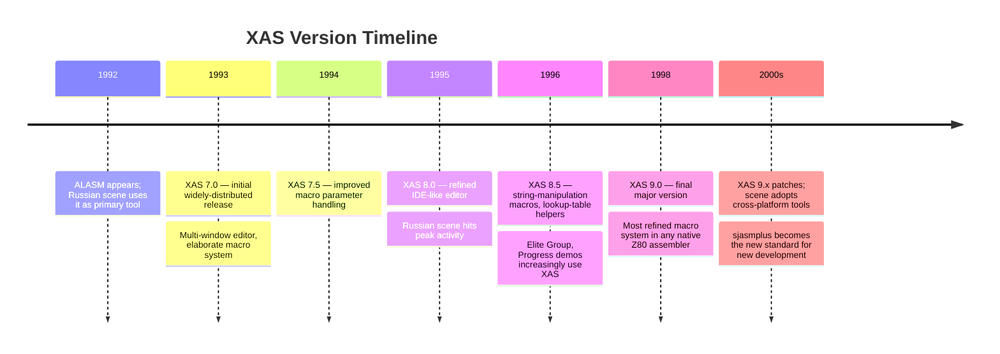

[← Home](../README.md) · [Toolchain](README.md)

# XAS Assembler — The Russian Scene's Code-Generation Specialist

**XAS** is the second of the two major Russian-native Z80 assemblers, alongside [ALASM](alasm_sts.md). Developed across the 1990s in versions 7.x through 9.x, XAS served the same audience as ALASM — Russian Spectrum clone owners developing for the TR-DOS disk ecosystem centered on the [Pentagon](../02_hardware/clones/pentagon.md) and Scorpion hardware. Where ALASM was the **generalist** assembler that dominated mainstream Russian development, XAS was the **specialist** assembler favored by demoscene crews focused on code generation — particularly **Elite Group** and **Progress**, two of the most technically ambitious Russian demo crews of the 1990s.

XAS's distinguishing feature was its **elaborate macro system**, optimized for generating repetitive code patterns common in demoscene work — sprite data tables, scroll routines, music player stubs, and the procedural content generation that Russian demos increasingly relied on. Where ALASM treated macros as a useful feature, XAS treated macros as the central design axis. For demoscene developers pushing the limits of what 64 KB of Z80 code could express, XAS's macro capabilities were decisive.

This article is the **deep-dive reference** for XAS as a tool: its history, macro-centric design philosophy, source language, the elaborate macro system that set it apart, its workflow, its place in the Russian scene, and its legacy. For the broader native-toolchain survey, see [native_toolchain.md](native_toolchain.md). For XAS's primary competitor, see [alasm_sts.md](alasm_sts.md).

---

## History

### Origins (Early 1990s)

XAS emerged from the Russian Spectrum scene in the early 1990s, slightly after ALASM (1992). The authorship is less clearly documented than ALASM's — XAS was developed by various Russian community members, with the version-numbering tradition starting at 7.x rather than 1.x for reasons that are now unclear (possibly picking up numbering from a precursor tool, possibly a authorship/branding choice to distinguish from ALASM's lower version numbers).

By 1993–1994, XAS was established as the alternative to ALASM in the Russian scene. Both tools targeted the same TR-DOS / Pentagon / Scorpion ecosystem, both were Russian-language, both produced compatible binary output. The difference was in design priorities: ALASM prioritized reliability and generality; XAS prioritized macro power and code generation.

### Version History

XAS's version history spans roughly a decade:

| Version | Year | Highlights |
|---|---|---|
| **XAS 7.0** | 1993 | Initial widely-distributed version; elaborate macro system, multi-window editor |
| **XAS 7.5** | 1994 | Improved macro parameter handling, expanded standard library |
| **XAS 8.0** | 1995 | Refined editor with IDE-like features, conditional macro expansion |
| **XAS 8.5** | 1996 | String-manipulation macros, lookup-table generation helpers |
| **XAS 9.0** | 1998 | Final major version; most refined macro system in any native Z80 assembler |
| **XAS 9.x** | late 1990s–2000s | Minor patches; scene adoption gradually shifts to cross-platform tools |

The progression from 7.0 to 9.0 was a story of **incremental refinement of the macro system** rather than feature addition. Each version added macro capabilities that enabled increasingly ambitious code-generation patterns in Russian demoscene productions.



---

## Design Philosophy — Code Generation First

XAS's design philosophy was sharply distinct from ALASM's:

- **ALASM**: build a reliable general-purpose assembler suitable for both commercial game development and demoscene work. Optimise for the typical case.
- **XAS**: build a powerful code-generation tool suitable for ambitious demoscene work, even at the cost of generality. Optimise for the demanding case.

This meant XAS made design choices that would have been surprising in a general-purpose tool:

### Macros as the Central Abstraction

In ALASM (and Zeus, DevPac), macros were a useful feature layered on top of a standard assembler. In XAS, macros were the **central abstraction** — the tool was designed around what macros could do, and other features existed to support the macro system.

The result was a macro language closer to a small programming language in its own right than to the simple substitution macros of other Z80 assemblers. XAS macros could:

- Take parameters of multiple types (numeric, string, label)
- Iterate over parameter lists (variadic macros)
- Conditionally expand based on parameter values
- Manipulate strings at assembly time
- Generate lookup tables algorithmically
- Recursively expand other macros

For demoscene developers, this meant XAS could express procedural content generation — sprite data computed at assembly time, music note tables generated from formulas, scroll routines unrolled to exact sizes — that would have required hand-writing thousands of lines in a less capable macro language.

### The Multi-Window IDE-Like Editor

XAS 7.0's other distinguishing feature was its **multi-window editor** — an IDE-like editing model unusual for 1990s Spectrum tools. Where ALASM had a traditional full-screen editor (one file visible at a time), XAS could display multiple source files in tiled windows on compatible hardware:

```
+----------------+----------------+
| MAIN.A         | ENGINE.A       |
| ; main loop    | ; sprite code  |
| Main_Entry:    | Sprite_Init:   |
|   CALL Init    |   LD HL,#4000  |
|   CALL Loop    |   ...          |
+----------------+----------------+
| MACROS.A       | STATUS         |
| ; code-gen     | Assembling...  |
| MACRO Gen...   | Pass 1 of 2    |
+----------------+----------------+
```

This was a significant productivity advantage for developers working across multiple source files — they could see the macro definitions, the engine code, and the main loop simultaneously, without context-switching between files. On standard Pentagon hardware with a single display, the windows were small but usable; on Scorpion and other higher-end clones with extended display modes, XAS's editor was genuinely impressive.

The multi-window model anticipated modern IDE conventions by years. Western Spectrum tools never had anything comparable — even Zeus's full-screen editor was single-window.

### Trade-Offs

XAS's macro-centric design had costs:

- **Slower assembly** — heavy macro expansion required more processing than simple substitution. XAS was slower than ALASM on equivalent sources.
- **Steeper learning curve** — the macro language was complex enough to require dedicated study. ALASM's simpler macros were learnable in an afternoon.
- **Narrower applicability** — XAS was overkill for commercial game development where the codebase was mostly hand-written. Commercial Russian studios typically used ALASM, not XAS.
- **Editor resource cost** — the multi-window editor consumed memory that could otherwise hold source. On 48K-based clones, XAS's maximum source size was smaller than ALASM's.

For demoscene crews whose work demanded code generation, these trade-offs were worthwhile. For everyone else, ALASM was the better choice.

---

## XAS Source Language

The XAS source language is standard Z80 assembly at its core, with the macro system layered on top. The base syntax is compatible with ALASM and largely compatible with DevPac and Zeus.

### Basic Syntax

```z80
; Glavnyy zikl igry (main game loop)
        ORG  #8000
MAIN_ENTRY:
        CALL ENGINE_INIT
        CALL AUDIO_INIT
.MAIN_LOOP
        HALT
        CALL UPDATE_INPUT
        CALL UPDATE_WORLD
        CALL RENDER_FRAME
        JR   .MAIN_LOOP
```

Note the use of `.MAIN_LOOP` as a local label (prefixed with `.`) scoped to the most recent global label — same convention as ALASM. This compatibility made it easy to share source between XAS and ALASM.

### Directives

The XAS directives cover the standard set plus macro-specific extensions:

| Directive | Function |
|---|---|
| `ORG nn` | Set the assembly origin |
| `EQU` | Assign a constant value to a label |
| `DB` / `DEFB` | Define byte(s) of data |
| `DW` / `DEFW` | Define word(s) of data |
| `DM` / `DEFM` | Define message (text string) |
| `DS` / `DEFS` | Define storage (reserve n bytes) |
| `INCLUDE "file"` | Include another source file |
| `INCBIN "file"` | Include a raw binary file |
| `IF expr` ... `ELSE` ... `ENDIF` | Conditional assembly |
| `MACRO name params` ... `ENDM` | Macro definition |
| `REPT n` ... `ENDR` | Repeat block (XAS 8+) |
| `IRP var, list` ... `ENDR` | Iterate over a parameter list |
| `IRPC var, string` ... `ENDR` | Iterate over characters in a string |
| `STRING var` | Declare a string parameter in a macro |
| `CONCAT str1, str2` | String concatenation (assembly-time) |
| `SUBSTR str, start, len` | String substring extraction |
| `PHASE nn` / `DEPHASE` | Assemble as if at a different address |
| `ENT` | Entry point |
| `OUTPUT "file"` | Set the output file |

The `IRP`, `IRPC`, `STRING`, `CONCAT`, and `SUBSTR` directives are XAS-specific and central to its code-generation capabilities. They give XAS macros the ability to iterate and construct strings — capabilities normally found in a scripting language, not an assembler.

---

## The XAS Macro System

XAS's macro system is what sets it apart from every other native Z80 assembler. The system has three layers:

### Layer 1: Parameterised Substitution Macros

The base layer, common to all macro-capable Z80 assemblers:

```z80
        MACRO CLEAR_SCREEN
        LD   HL, #4000
        LD   (HL), 0
        LD   DE, #4001
        LD   BC, #17FF
        LDIR
        ENDM
```

XAS supports this, as do ALASM, Zeus, DevPac, and sjasmplus. This is the baseline.

### Layer 2: Variadic and Conditional Macros

XAS macros can accept variable-length parameter lists and conditionally expand:

```z80
        MACRO INIT_TABLES
        IRP  ADDR, <#4000, #5800, #6000, #C000>
        LD   HL, ADDR
        LD   (HL), 0
        LD   DE, ADDR + 1
        LD   BC, 255
        LDIR
        ENDM
        ENDM

        ; Usage: expands to four copies of the fill loop,
        ; one for each address
        INIT_TABLES
```

The `IRP` (iterate over real parameters) directive iterates over a comma-separated list at assembly time, expanding the macro body once per item. This is a **code generation** capability — the macro writes repetitive code at assembly time.

Conditional macro expansion (XAS 8+):

```z80
        MACRO LOAD_REGISTER reg, value, fast
        IF fast
        LD   reg, value          ; 2-byte immediate load (7 T)
        ELSE
        LD   A, value
        LD   reg, A              ; via accumulator (slower but smaller)
        ENDIF
        ENDM

        LOAD_REGISTER BC, #0000, 1     ; fast version
        LOAD_REGISTER DE, #FFFF, 0     ; small version
```

The `fast` parameter selects between two code-generation strategies, decided at assembly time.

### Layer 3: Algorithmic Code Generation

The most distinctive XAS capability — using `IRPC`, string manipulation, and recursion to **generate code algorithmically**:

```z80
        MACRO GEN_SINE_TABLE amplitude, length
        ; Generate a sine table at assembly time
        ; using polynomial approximation
        ADDR = 0
        REPT length
        ; compute sine(2*pi*ADDR/length) * amplitude
        VALUE = POLY_SINE(ADDR, length) * amplitude / 256
        DB   VALUE
        ADDR = ADDR + 1
        ENDM
        ENDM

        GEN_SINE_TABLE 127, 256       ; 256-byte sine table, amplitude 127
```

This is a stylised example (the actual `POLY_SINE` would be defined as a sequence of arithmetic operations), but it illustrates XAS's capability: **compute a sine table at assembly time and emit the bytes directly**, without requiring an external generator. This was used heavily in Russian demos for circle/vector effects, plasma effects, and any other graphics work requiring precomputed mathematical tables.

### Example: Unrolled Sprite Blit

A classic XAS code-generation pattern — unroll a sprite blit loop for performance:

```z80
        MACRO BLIT_SPRITE_LINE source, dest, width
        LD   HL, source
        LD   DE, dest
        LD   BC, width
        LDIR
        ENDM

        MACRO BLIT_SPRITE_UNROLLED sprite_addr, screen_addr, width, height
        CURRENT_LINE = sprite_addr
        CURRENT_DEST = screen_addr
        REPT height
        BLIT_SPRITE_LINE CURRENT_LINE, CURRENT_DEST, width
        CURRENT_LINE = CURRENT_LINE + width
        CURRENT_DEST = CURRENT_DEST + 256       ; next screen line
        ENDM
        ENDM

        ; Fully unrolled 16x16 sprite blit - 16 separate LDIR sequences
        BLIT_SPRITE_UNROLLED Sprite_Data, #4000 + 32 + 32*8, 16, 16
```

The result is 16 unrolled `LDIR` sequences — much faster than a nested loop, at the cost of code size. XAS made this pattern easy; in ALASM or DevPac, the same effect required either hand-unrolling or a much more cumbersome macro construction.

For demoscene work where every cycle counted, XAS's code generation was a major competitive advantage. Russian demos of the mid-to-late 1990s routinely pushed performance boundaries that Western tools would have struggled to express cleanly.

---

## XAS in the Russian Scene

XAS's scene adoption was narrower than ALASM's, but concentrated in the most technically ambitious corners of the Russian demoscene.

### Elite Group and Progress

**Elite Group** and **Progress** were two of the most influential Russian demo crews of the 1990s. Both used XAS as their primary assembler, and both pushed the boundaries of what was possible on Pentagon hardware:

- **Elite Group** — known for plasma effects, vector graphics, and procedural content. Their demos routinely featured mathematically-generated visuals (sine tables, plasma gradients, vector wireframes) that demanded XAS's code-generation capabilities.
- **Progress** — known for scroll routines, multiplexed hardware sprites (on Scorpion and ATM Turbo clones), and tight cycle-counting effects. Their work demanded the unrolled-loop patterns that XAS macros expressed cleanly.

Other Russian crews typically used ALASM, but crews focused on technical excellence gravitated to XAS.

### Russian Studios and XAS

Commercial Russian game studios — Step Creative Group, Delta Labs, and similar — typically used ALASM, not XAS. Game development had less need for procedural code generation; the code was mostly hand-written game logic, level data handling, and asset decompression. XAS's macro power was overkill for this work.

The pattern mirrors the Western scene, where studios used DevPac (the reliable workhorse) and hobbyists/experimenters used Zeus (the innovative tool). In Russia: studios used ALASM, ambitious demoscene crews used XAS.

### XAS at Demoscene Parties

XAS-developed productions were a visible presence at Russian demoscene parties through the late 1990s:

- **CC** (Championship of Computers) — XAS-developed demos and intros consistently placed in the top ranks
- **diHALT** — XAS productions in the Spectrum compo were common
- **CAFe** — XAS used in both 4K/64K intro compos and demo compos

The winning productions from these parties, when source was released, frequently showed the unmistakable signs of XAS development — heavy macro use, IRP/REPT blocks, algorithmic table generation.

---

## Frequently Asked Questions

### Is XAS still available?

XAS 9.x is freely available from Russian Spectrum archives (Proton's site, trd.speccy.com). It runs on any TR-DOS-capable Spectrum emulator (ZEsarUX, UnrealSpeccy, ZXMAK2, Fuse with TR-DOS support). Real-hardware usage on Pentagon/Scorpion clones is rare but possible.

### Can XAS macros be translated to sjasmplus?

Largely yes. sjasmplus has its own macro system that covers most of XAS's capabilities:

- **Simple parameterised macros** — direct equivalent
- **`REPT` / `ENDR`** — sjasmplus supports `REPT` / `ENDR`
- **`IRP` / `IRPC`** — sjasmplus supports `DUP` (similar to REPT) and indirect macro iteration
- **String manipulation (`CONCAT`, `SUBSTR`)** — sjasmplus supports some string operations; complex cases require Lua scripting (sjasmplus's Lua integration is more powerful than XAS's macro string ops)

For most XAS macros, a direct sjasmplus translation exists. For algorithmic code generation, sjasmplus's Lua scripting (a full programming language) exceeds XAS's macro language.

### Why didn't XAS get adopted outside Russia?

XAS had no Western distribution. It was a Russian-language tool, documented only in Russian, optimized for Russian clone hardware, and circulating only within the Russian scene. Western developers in the 1990s had no knowledge of it, and by the time Western retro-dev communities discovered Russian Spectrum tools in the 2000s, cross-platform assemblers (sjasmplus, pasmo) had become the standard.

### Did XAS support the ZX Spectrum Next?

No. XAS development ceased before the Next's release. Modern Next-targeted development uses sjasmplus (cross-platform, Z80N support, `.nex` output). XAS's lineage ended with classic clone hardware.

### Why did XAS start at version 7?

The exact reason is unclear from available documentation. Two plausible explanations: (1) XAS inherited version numbering from a precursor tool that had reached version 6; (2) XAS's author chose a high starting number to position the tool as mature relative to ALASM (which was at version 3-4 in the same period). The actual reason is now lost to scene history.

---

## Summary

XAS was the **code-generation specialist** of the Russian-native Z80 assembler ecosystem. Where ALASM was the generalist workhorse that dominated mainstream Russian development, XAS was the specialist tool favored by the most technically ambitious demoscene crews — Elite Group, Progress, and others pushing the limits of what 64 KB of Z80 could express.

XAS's distinctive feature was its **elaborate macro system**, with variadic parameters, conditional expansion, string manipulation, and algorithmic code generation. Combined with its multi-window IDE-like editor, XAS anticipated modern IDE conventions by years. The trade-offs — slower assembly, steeper learning curve, narrower applicability — made XAS a poor fit for general game development but an excellent fit for ambitious demoscene work.

XAS development ceased in the early 2000s as the Russian scene adopted cross-platform tools. But the technical legacy of XAS-developed productions — visible in the source code released by Russian demo crews — remains a testament to what a powerful macro language could express on 1990s hardware.

For modern Spectrum development, use **sjasmplus + VS Code + Lua scripting** for equivalent code-generation capabilities. XAS is for running in a TR-DOS-capable emulator when you want to study the Russian demoscene's macro-driven workflow.

---

## References

### Primary Sources

- **XAS 9.x documentation** (Russian) — the canonical reference for XAS commands, directives, and macro system. Author documentation archived at Russian Spectrum sites.
- **Elite Group and Progress production source code** — released demoscene productions showing XAS macro patterns in real use, archived at zx-art.ru
- **Russian demoscene party proceedings** — CC, diHALT, CAFe results with downloadable XAS-developed productions

### Modern Sources

- **Proton's Spectrum site** (Russian) — primary modern archive for XAS and other Russian-scene tools
- **trd.speccy.com** — TR-DOS software archive, including XAS-developed productions with source
- **zx-art.ru** — Russian demoscene archive with downloadable productions, many including XAS-format source
- **sjasmplus documentation** — modern cross-assembler that provides equivalent macro and Lua-scripting capabilities

### Related Articles in This Knowledge Base

- [Native Toolchain](native_toolchain.md) — survey of all four major native assemblers (Zeus, DevPac, ALASM, XAS)
- [Zeus Assembler](zeus_assembler.md) — the Western innovator's-choice alternative
- [HiSoft DevPac / GENS-MONS](devpac_gens_mons.md) — the Western commercial-studio alternative
- [ALASM + STS](alasm_sts.md) — XAS's Russian-scene competitor
- [Cross-Platform Toolchain](cross_platform_toolchain.md) — modern replacements including sjasmplus
- [sjasmplus](sjasmplus.md) — the modern cross-assembler whose macro + Lua capabilities extend XAS's tradition
- [Debugging](debugging.md) — modern source-level debugging with DeZog, ZEsarUX, CSpect
- [Pentagon clone](../02_hardware/clones/pentagon.md) — the dominant Soviet clone hardware XAS targeted
