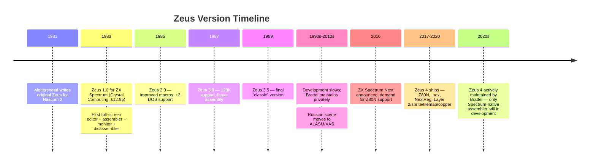

[← Home](../README.md) · [Toolchain](README.md)

# Zeus Assembler — Simon Brattel & Neil Mottershead's 40-Year Integrated Z80 Development Environment

**Zeus** is the longest-lived, most feature-complete, and arguably most influential Z80 assembler ever produced for the ZX Spectrum. Originally written by **Neil Mottershead** for the Nascom 2 kit computer and ported to the just-launched ZX Spectrum by Mottershead and **Simon Brattel** in **1983**, Zeus shipped commercially from Crystal Computing at £12.95 — competing in the same 1983 market that also saw the launch of HiSoft DevPac / GENS-MONS. Where DevPac became the *workhorse* of UK commercial studios, Zeus became the *innovator's choice* — first to ship with a full-screen editor on the Spectrum, first to integrate editor + assembler + monitor + disassembler in one program, and — uniquely among Spectrum-native assemblers — **still actively developed today**, with Zeus 4 supporting the ZX Spectrum Next's Z80N CPU, `.nex` output format, and expanded memory banking.

This article is the **deep-dive reference** for Zeus as a tool: its history, design philosophy, feature set, version history, source-language conventions, monitor/disassembler integration, and the modern Zeus 4 release on the ZX Spectrum Next. For the broader native-toolchain survey (where Zeus sits alongside DevPac, ALASM, and XAS), see [native_toolchain.md](native_toolchain.md). For modern cross-platform alternatives that have largely replaced Zeus for new Spectrum development, see [cross_platform_toolchain.md](cross_platform_toolchain.md) and [sjasmplus.md](sjasmplus.md) in particular.

---

## History

### The Nascom 2 Origin (1981–1982)

Neil Mottershead wrote the original Zeus in 1981 for the **Nascom 2**, a British kit computer based on the Z80 and launched in 1979. The Nascom had a small but enthusiastic developer community, and Mottershead's assembler stood out for its integration: rather than the typical separate editor/assembler/linker toolchain of the era, Zeus combined editing, assembly, and debugging in a single program. This integration was possible because the Nascom ran a single-tasking ROM-based OS — there was no benefit to separate programs, and a lot of benefit to a unified workflow.

When Sinclair launched the ZX Spectrum in April 1982, Mottershead recognized it as the natural successor to the Nascom — same CPU, similar memory map, much larger market. He began porting Zeus, joined by **Simon Brattel**, a UK developer who had worked on other Nascom software.

### The 1983 Spectrum Launch (Crystal Computing)

Zeus for the Spectrum shipped in **1983** from **Crystal Computing** (later Crystal Software), a UK software house specialising in developer tools. The launch price was **£12.95** — comparable to HiSoft DevPac, and roughly half the price of a typical commercial game. Crystal Computing positioned Zeus as a professional tool, advertising in * Sinclair User*, *CRASH*, and *Your Spectrum* through 1983-1985.

The 1983 Zeus was **unusually complete for its time**. Key features that distinguished it from contemporaries:

- **Full-screen editor** with cursor addressing — virtually unheard-of on the Spectrum in 1983, when most assemblers used line-based editors
- **Symbolic labels** (e.g., `loop:`, `print_char:`) rather than requiring numeric addresses
- **Macro definitions with parameters** — write once, expand many times
- **Conditional assembly** (`IF`/`ELSE`/`ENDIF`) for variant builds from one source
- **Integrated monitor** — set breakpoints, single-step, inspect memory and registers, all without leaving Zeus
- **Integrated disassembler** — point at a memory address and get a Z80 listing back, useful for reverse engineering and self-debugging

This integration is what set Zeus apart. DevPac users had to switch between GENS (the assembler) and MONS (the monitor) — two separate programs, with the source lost from memory on switch. Zeus users pressed a key and dropped straight from source editing into monitor debugging, with the source still loaded.

### Version History (1983–1990s)

| Version | Year | Highlights |
|---|---|---|
| **Zeus 1.0** | 1983 | Initial Spectrum release; full-screen editor, monitor, disassembler |
| **Zeus 2.0** | 1985 | Improved macro language, +3 DOS support for disk-based sources |
| **Zeus 3.0** | 1987 | Conditional assembly enhancements, 128K RAM support, faster assembly |
| **Zeus 3.5** | 1989 | Bug fixes; final "classic" version that commercial studios standardized on |
| **Zeus 4** (early) | 1990s | Limited distribution; transition to Next-era development begins |

By the late 1980s, Zeus had become the **standard tool at serious hobbyist and small-studio developers** in the UK. Commercial studios typically used HiSoft DevPac (which was seen as more reliable for very large sources), but Zeus had the enthusiasts.

### The Hiatus (1990s–2000s)

Through the 1990s, Spectrum-native development declined as developers moved to PCs and cross-assemblers. Zeus development slowed. Simon Brattel continued to maintain the code privately, but no major release appeared for over a decade.

The Russian Spectrum scene — which kept native development alive through the late 1990s — standardized on **ALASM** and **XAS** instead, neither of which shared any lineage with Zeus. The Pentagon/Scorpion ecosystem developed its own toolchain conventions optimized for TR-DOS disk storage; Zeus's UK tape/disk heritage was irrelevant there.

### The Zeus 4 Revival (2010s–present)

When the **ZX Spectrum Next** was announced in 2016 (delivering 2017–2020), it created demand for a native assembler that supported the Next's Z80N CPU (a Z80 variant with new instructions), the `.nex` executable format, and the Next's expanded memory banking. Simon Brattel returned to active Zeus development, producing **Zeus 4** — a modernised version that runs natively on the Next (or in any Spectrum emulator) and supports the full Next feature set.

Zeus 4 features:

- **Z80N instruction support** — all new Next instructions (`LD DEIX`,`PIXELDN`, `NEXTREG` reads, etc.)
- **`.nex` output format** — produces Next-native executables directly
- **NextReg awareness** — assemble-time configuration of Next registers
- **Layer 2 / sprite / tilemap / copper helpers** — Zeus 4 ships with macro libraries for the Next's hardware features
- **Cross-development mode** — Zeus 4 runs on the Next itself but also works in CSpect, ZEsarUX, and other Next-supporting emulators

Zeus 4 is **the only native Z80 assembler still in active development as of the 2020s**. Its nearest competitor for Next-targeted development is the cross-platform **sjasmplus**, which also supports Z80N and `.nex` output — see [sjasmplus.md](sjasmplus.md) for comparison.




---

## Design Philosophy — Integration First

Zeus's defining design choice — made by Mottershead in 1981 and preserved through every version since — is **total integration**. The 1983 Zeus was not an assembler with a debugger bolted on; it was a single program in which editing, assembling, debugging, and reverse-engineering code were equally first-class operations. This was a deliberate contrast to:

- The **separate-tool Unix philosophy** (editor → assembler → linker → debugger as distinct programs)
- The **BASIC-POKE workflow** (write bytes by hand in BASIC, then call `RANDOMIZE USR`)
- The **contemporary Spectrum assemblers** (DevPac's GENS/MONS split, or the earlier line-editors with no debugger at all)

### Why Integration Won for Zeus Users

The integrated workflow cut the **edit-assemble-test cycle** from minutes (load the monitor, transfer the binary, run, crash, return to editor) to seconds (press a key in Zeus). For commercial game development, where a programmer might cycle this loop hundreds of times per day, the time saving was decisive. For hobbyists learning Z80, the ability to instantly see what the code did — by stepping through it in the built-in monitor — was a major pedagogical advantage.

The trade-off was that Zeus had to fit an editor, an assembler, a monitor, and a disassembler into the Spectrum's 48 KB of RAM (or 128 KB on later models) *alongside the user's source code and assembled binary*. This required careful memory management and meant Zeus's maximum source size was smaller than DevPac's. For most hobbyist work this was fine; for very large commercial projects (16–32 KB of Z80 source), DevPac was preferred.

### The Edit-Assemble-Test Loop in Zeus

A typical Zeus session:

1. **Load Zeus** from tape (1983–1989) or disk (1989+).
2. **Load source** from tape/disk, or type new source in the full-screen editor.
3. **Press `A` to assemble** — Zeus runs a two-pass assembly, reporting any errors inline.
4. **If errors**, click on the error line in the editor to fix it; re-assemble.
5. **If success**, press `M` to drop into the monitor with the binary loaded.
6. **Set a breakpoint** at the entry point, **press `G`** (go) to run.
7. **Hit the breakpoint**; **step** through code with `S`, inspecting registers and memory.
8. **Exit monitor** with `E` — return to the editor with the source still loaded.
9. **Edit and re-assemble** — the cycle repeats in seconds.

Compare to DevPac, where each test cycle required exiting GENS, loading MONS, loading the assembled binary into MONS, debugging, exiting MONS, reloading GENS, reloading the source. The DevPac cycle could take a minute or more; the Zeus cycle was seconds.

---

## The Zeus Source Language

Zeus's source language is a **fairly standard Z80 assembly syntax** with the usual label-opcode-operand-comment format, augmented with macros and conditional assembly directives.

### Basic Syntax

```z80
; Comment starts with semicolon
        ORG  #8000           ; origin: code assembles here
start:
        LD   HL, message     ; HL points to string
        LD   B, 13           ; B = string length
loop:
        LD   A, (HL)         ; A = next char
        RST  #10             ; print it
        INC  HL              ; advance
        DJNZ loop            ; repeat for B chars
        RET

message:
        DB   "Hello, World!"
```

This syntax will be familiar to anyone who has used any Z80 assembler. The differences between Zeus, DevPac, ALASM, and sjasmplus are largely cosmetic — labels, comments, hex notation (`#` vs `$` vs `0x`), and directive names.

### Labels

Zeus supports **symbolic labels** — alphanumeric names ending in `:` — that resolve to addresses during assembly. Forward and backward references are both supported:

```z80
loop:        ; backward reference works
        ...
        JR   loop

        JR   forward        ; forward reference also works
        ...
forward:
```

Labels can also be assigned constant values with `EQU`:

```z80
SCREEN   EQU  #4000
ATTRS    EQU  #5800
PIRATE   EQU  100           ; a "magic number" given a name
```

### Numeric Notation

Zeus accepts decimal by default; hex with `#` prefix or `h` suffix; binary with `b` suffix or `%` prefix:

```z80
        LD   A, 255          ; decimal
        LD   A, #FF          ; hex (Zeus style)
        LD   A, 0FFh         ; hex (alternate style)
        LD   A, %11111111    ; binary
        LD   A, 11111111b    ; binary (alternate)
```

### Directives

The key Zeus directives:

| Directive | Function |
|---|---|
| `ORG nn` | Set the assembly origin (where the next instructions assemble to) |
| `EQU` | Assign a constant value to a label (`label EQU nn`) |
| `DB` / `DEFB` | Define byte(s) of data |
| `DW` / `DEFW` | Define word(s) of data (2-byte, little-endian) |
| `DM` / `DEFM` | Define message (text string, no length prefix) |
| `DS` / `DEFS` | Define storage (reserve n bytes) |
| `INCLUDE "file"` | Include another source file (Zeus 3+) |
| `IF expr` ... `ELSE` ... `ENDIF` | Conditional assembly |
| `MACRO name params` ... `ENDM` | Macro definition |
| `phase nn` / `dephase` | Assemble as if at a different address (for relocatable code) |
| `OUTPUT "file",nn` | Set the output file and start address |
| `BINARY "file"` | Include a raw binary file |

### Macros

Zeus macros are defined with `MACRO` and called by name:

```z80
        MACRO wait_for_vblank
loop    HALT
        LD   A,(#5C7A)       ; FRAMES counter
        CP   B
        JR   NZ, loop
        ENDM

; Usage:
        LD   B, frame_target
        wait_for_vblank      ; expands to the macro body
```

Zeus 2.0+ added **parameterised macros**:

```z80
        MACRO memset addr, value, count
        LD   HL, addr
        LD   (HL), value
        LD   DE, addr+1
        LD   BC, count-1
        LDIR
        ENDM

        memset #4000, 0, 6144    ; clear pixel RAM
        memset #5800, %00111, 768 ; clear attr RAM to white-on-black
```

Macros are expanded inline; the resulting source is what gets assembled.

### Conditional Assembly

```z80
DEBUG   EQU 1

        IF DEBUG
        LD   A, '*'
        RST  #10              ; debug marker
        ENDIF

        ; ... main code ...

        IF DEBUG
        LD   A, '/'
        RST  #10
        ENDIF
```

Conditional assembly lets you maintain one source for both debug and release builds — toggle `DEBUG EQU 0` and the debug code disappears from the assembled output.


---

## The Built-In Monitor

Zeus's **monitor** is a machine-code debugger integrated into the assembler itself. From the editor, pressing `M` drops the user into the monitor with the assembled binary loaded at its `ORG` address. The monitor commands are typed at a single-key prompt:

| Key | Command | Function |
|---|---|---|
| `G` | Go | Run from current PC (or specified address) |
| `S` | Step | Execute one instruction, then return to monitor |
| `N` | Next | Step over a `CALL` (treat it as a single instruction) |
| `B` | Breakpoint | Set/clear a breakpoint at an address |
| `D` | Disassemble | Show code as Z80 mnemonics from an address |
| `M` | Memory | Hex-dump a memory region |
| `R` | Registers | Display and edit CPU registers |
| `F` | Fill | Fill memory with a byte |
| `C` | Copy | Block memory copy (like `LDIR`) |
| `E` | Exit | Return to the editor (source still loaded) |
| `L` | Load | Load binary or snapshot from tape/disk |
| `W` | Write | Save binary or snapshot to tape/disk |

### Breakpoints

Zeus breakpoints use the standard **RST #38 replacement technique** — the monitor saves the original byte at the breakpoint address and replaces it with `#FF` (the `RST #38` opcode). When execution hits that byte, the CPU vectors to address `#0038`, where Zeus's monitor has installed its breakpoint handler. The handler restores the original byte, captures the registers, and returns control to the monitor prompt.

This technique has a known limitation: it cannot break on **ROM addresses** (the ROM is read-only) or on **memory that is about to be overwritten by self-modifying code**. For these cases, Zeus 4 added **hardware-supported breakpoints** on the ZX Spectrum Next, which use the Next's debug hardware rather than RST replacement.

### Register and Memory Inspection

The monitor's `R` command shows the current state of all CPU registers in a familiar layout:

```
AF = 1234 BC = 5678 DE = 9ABC HL = DEF0
AF'= 0000 BC'= 0000 DE'= 0000 HL'= 0000
IX = 0000 IY = 5C3A PC = 8000 SP = FFFF
I = 1F   R = 1F2A   IFF1 = 0  IFF2 = 0  IM = 1
Flags: S Z X H X P/V N C
        . . . . . . . .
```

Any value can be edited by typing a new one. The `M` command shows memory as a hex+ASCII dump:

```
8000  21 0D 80 11 0A 00 CD 32  09 48 65 6C 6C 6F 2C 20   |!......2. Hello, |
8010  57 6F 72 6C 64 21 00 00  00 00 00 00 00 00 00 00   |World!..........|
```

The combined editor + monitor workflow means a developer can spot a bug, switch to the editor, fix the source, re-assemble, and re-test in under 30 seconds — all without leaving Zeus.

---

## The Built-In Disassembler

The monitor's `D` command runs the built-in disassembler, producing a Z80 listing from memory bytes. The output is similar to what `z80dasm` would produce today:

```
8000  21 0D 80         LD   HL,#800D
8003  11 0A 00         LD   DE,#000A
8006  CD 32 09         CALL #0932
8009  C9               RET
800A  ...
```

The disassembler uses the same syntax as the assembler, so the output is **round-trippable** — you can copy the disassembled listing, paste it into the editor as a source, modify it, and re-assemble. This was a major advantage for reverse engineering: take a snapshot of a running game, load it into Zeus, disassemble from a known entry point, annotate the listing, and re-assemble a modified version.

### Limitations

The Zeus disassembler is **linear-sweep** — it disassembles bytes sequentially without following control flow. This means it cannot distinguish code from data; a sprite table in the middle of code shows up as garbage mnemonics. The user has to manually identify data regions (e.g., by inserting `DB` directives) — the same problem every linear-sweep disassembler has. Modern RE work typically uses **SkoolKit** for this reason, but Zeus's built-in disassembler was the best option in the 1980s.

---

## Zeus 4 — The Modern Era

The 2017+ Zeus 4 release is a significant rewrite that preserves Zeus's design philosophy while adding ZX Spectrum Next support.

### Z80N Instruction Support

The Z80N is a Z80 variant designed for the Next, adding instructions that don't exist on classic Z80:

| Instruction | Function |
|---|---|
| `LD DEIX,nn` | Load 16-bit immediate into IX (high) and DE (low) |
| `LD BCIX,nn` | Same with BC and IX |
| `PIXELDN` | Add A to IX (pixel-draw helper) |
| `PIXELAD` | Compute pixel address from C/B into HL |
| `SETAE` | Set A to byte at (HL+IY) |
| `NEXTREG r,n` | Write to Next register r |
| `LD A,NEXTREG r` | Read from Next register r |
| `LDIX` / `LDWS` / `LDDX` / `LDPIRX` | Modified block-transfer variants |
| `SWAPNIB` / `MIRROR` | Byte-manipulation helpers |
| ... and many more |

Zeus 4 supports all Z80N instructions in its assembler; classic Zeus does not.

### `.nex` Output Format

The `.nex` file format is the ZX Spectrum Next's native executable format. A `.nex` file contains:

- A header with magic bytes and version
- The bank configuration to load (which of banks 0-7 to populate)
- The entry point and initial register state
- Optional Layer 2 / sprite / tilemap initial state
- Optional NextReg initial configuration

Zeus 4 produces `.nex` files directly from the `OUTPUT` directive, removing the need for a separate `.nex` packer.

### NextReg-Aware Assembly

The Next has 256 **NextRegs** — 8-bit configuration registers accessible via `#243B` (select) and `#253B` (data) that control everything from CPU speed to memory mapping to peripheral enables. Zeus 4 lets you set NextRegs at assembly time:

```z80
        OUTPUT "demo.nex"
        ORG  $8000

        ; Configure Next for Layer 2 display
        NEXTREG $15, %00000010    ; Layer 2 in bank 6, on
        NEXTREG $70, 0            ; Layer 2 palette at 0
        ; ... assemble Layer 2 demo ...

main_loop:
        ; ... game loop ...
        JR main_loop
```

The resulting `.nex` file, when loaded, executes with the NextRegs pre-configured.

### Cross-Development with Zeus 4

Although Zeus 4 runs natively on the Next, it is also usable in emulators (CSpect, ZEsarUX, MAME) for cross-development. The workflow:

1. Run Zeus 4 in CSpect on the developer's PC
2. Edit and assemble the source inside Zeus 4 in the emulator
3. Test the resulting `.nex` immediately in the same emulator
4. Transfer the `.nex` to real Next hardware for final testing (via SD card)

For modern Next-targeted development, the **sjasmplus** cross-assembler (see [sjasmplus.md](sjasmplus.md)) is the more common choice — it runs natively on the developer's PC, integrates with VS Code, and produces the same `.nex` output. Zeus 4 remains the option for developers who want the integrated native-edit-assemble-test experience on real Next hardware.


---

## Zeus vs sjasmplus — Choosing a Modern Next Toolchain

For developers targeting the **ZX Spectrum Next** today, the realistic choice is between **Zeus 4** (native, integrated) and **sjasmplus** (cross-platform, command-line). Both produce `.nex` files; both support Z80N; both are actively maintained. The choice is about workflow, not capability.

| Aspect | Zeus 4 | sjasmplus |
|---|---|---|
| **Host** | Native on Next, or any Next-capable emulator | PC/Mac/Linux native |
| **Editor** | Built-in full-screen editor | External (VS Code, Notepad++, vim) |
| **Assembler** | Integrated | Command-line tool |
| **Debugger** | Integrated monitor with Next hardware breakpoints | External (CSpect/DeZog, ZEsarUX) |
| **Disassembler** | Built-in | External (z80dasm, IDA, Ghidra) |
| **Source control** | Manual file management | Git-friendly plain text |
| **Build automation** | Manual | Make, CMake, CI/CD pipelines |
| **Iteration speed** | Seconds (native) | Milliseconds (cross) |
| **Hardware accuracy** | Exact on real Next | Requires emulator or transfer to Next |
| **Learning curve** | One integrated program | Multiple tools to learn |

### When to choose Zeus 4

- You are developing **on a real Next** (or in an emulator that runs the Next ROM) and want the integrated edit-assemble-test loop
- You are **teaching Z80** and want a single program that does everything
- You are **reverse engineering** Next software and want the disassembler + monitor integrated with the assembler
- You prefer **one tool** over a multi-tool pipeline

### When to choose sjasmplus

- You are developing on a **PC/Mac/Linux** and want native performance
- You want **VS Code integration** with syntax highlighting, autocomplete, jump-to-definition
- You are working on **large projects** with multiple source files, Git version control, and CI builds
- You need to **automate builds** with Make or similar

In practice, most modern Next development uses **sjasmplus + VS Code + CSpect** as the standard pipeline. Zeus 4 is the choice for purists, educators, and developers who want the authentic native experience.


---

## Frequently Asked Questions

### Is Zeus still commercially available?

The original Crystal Computing release (1983 Zeus) is abandonware — freely downloadable from Spectrum archives. **Zeus 4** for the ZX Spectrum Next is available from Simon Brattel's website (see [References](#references)) and is actively maintained. Brattel continues to release updates as Next firmware evolves.

### Can I use Zeus source files with other assemblers?

Mostly yes, with minor edits. Zeus uses `#` for hex (`#FF`) where sjasmplus uses `$` (`$FF`) and DevPac uses `&` or `0x`. Zeus's `DM` directive (define message) is unusual — most other assemblers use `DB "text"`. Macro syntax varies between assemblers. A few minutes of find-and-replace typically ports a Zeus source to sjasmplus or vice versa.

### Why didn't Zeus dominate the Soviet scene?

By the time the Soviet clone scene matured (1989–1992), Zeus had no distribution in the USSR. The Russian scene standardized on **ALASM** and **XAS**, which were written by Russian authors for the TR-DOS / Pentagon ecosystem. Zeus's UK tape/disk heritage was irrelevant to the Soviet workflow. See [alasm_sts.md](alasm_sts.md) and [xas_assembler.md](xas_assembler.md).

### Why did commercial UK studios prefer DevPac over Zeus?

For very large commercial sources (16–32 KB of Z80), DevPac's **GENS** assembler was considered more reliable than Zeus. Zeus's integrated design also meant that an editor crash could lose the source, where DevPac's separate GENS/MONS programs kept source and binary in separate memory. By the late 1980s, **DevPac 3/4** was the safer choice for studios with deadlines; Zeus was the choice for hobbyists and small teams who valued the integrated workflow. See [devpac_gens_mons.md](devpac_gens_mons.md).

### Can Zeus 4 assemble classic 48K Spectrum code?

Yes. Zeus 4 is a strict superset of classic Zeus — anything that assembled on Zeus 3.5 will assemble on Zeus 4. You can use Zeus 4 to develop 48K software without touching any Z80N or Next-specific features. The output will be a standard `.tap` or `.bin` rather than a `.nex`.

### Does Zeus support the +3 DOS disk format?

Zeus 2.0 (1985) onwards supports +3 DOS disk for source loading and saving on the +2A/+3. Earlier versions are tape-only. Zeus 4 on the Next uses the Next's native SD-card filesystem.


---

## Summary

Zeus's 40+ year continuous development history is unique among Z80 assemblers. From its 1981 Nascom 2 origin through its 1983 Spectrum launch to its modern Zeus 4 incarnation on the ZX Spectrum Next, Zeus has held to a single design principle: **integration**. Editor, assembler, monitor, and disassembler in one program, with the edit-assemble-test cycle measured in seconds rather than minutes.

For the 1980s commercial and hobbyist Spectrum scene, Zeus was the innovator's choice — first with a full-screen editor, first with integrated debugging, first with a built-in disassembler. For the modern Next scene, Zeus 4 is the only native assembler still in active development, offering the same integrated workflow for the Next's expanded hardware.

The modern alternative is **sjasmplus + VS Code + CSpect**, which trades integration for cross-platform performance and modern IDE features. Both are valid choices; the question is whether the developer wants one integrated tool or a multi-tool pipeline.

---

## References

### Primary Sources

- **Simon Brattel's Zeus site** — official source for Zeus 4 binaries, documentation, and release notes for the ZX Spectrum Next version
- [Crystal Computing advertisements](https://archive.org/details/sinclair-user-magazine) in *Sinclair User*, *CRASH*, *Your Spectrum* (1983–1985) — launch-era documentation of Zeus 1.0–2.0 features and pricing
- **ZX Spectrum Next Team — *ZX Spectrum Next Programmer's Guide*** (2017+) — official documentation of the Z80N CPU, `.nex` format, and NextReg system that Zeus 4 targets

### Contemporary Reviews

- *Your Spectrum* review of Zeus (1983–1984 issues) — contemporary assessment of Zeus vs DevPac
- *CRASH* assembler comparison articles (1984–1986) — feature comparisons across Zeus, DevPac, and other 1980s assemblers
- *[Sinclair User](https://archive.org/details/sinclair-user-magazine)* toolchain roundups (1985–1987) — coverage of Zeus 2.0–3.0 enhancements

### Modern Sources

- [World of Spectrum archives](https://worldofspectrum.org/) — downloadable Zeus 1.0–3.5 TAP/TZX files for use in emulators
- [ZX Spectrum Next forum](https://specnext.org/) — active discussion of Zeus 4 features, bug reports, and release announcements
- **Simon Brattel interviews and talks** — author's perspective on the 40-year Zeus development history

### Related Articles in This Knowledge Base

- [Native Toolchain](native_toolchain.md) — survey of all four major native assemblers (Zeus, DevPac, [ALASM](https://zxpress.ru/), XAS)
- [Cross-Platform Toolchain](cross_platform_toolchain.md) — modern sjasmplus, [z88dk](https://github.com/z88dk/z88dk), SDCC alternatives
- [[sjasmplus](https://github.com/z00m128/sjasmplus)](sjasmplus.md) — Zeus 4's modern cross-platform counterpart for Next development
- [devpac_gens_mons.md](devpac_gens_mons.md) — HiSoft DevPac, Zeus's Western contemporary
- [alasm_sts.md](alasm_sts.md) — dominant Soviet-native assembler
- [xas_assembler.md](xas_assembler.md) — Soviet alternative to [ALASM](https://zxpress.ru/)
- [memory_and_io_next.md](../05_development/03_memory_and_io/memory_and_io_next.md) — Next memory banking that Zeus 4 targets
