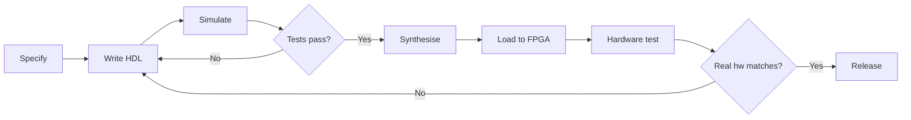

[← Home](../../README.md) · [Emulation](../README.md) · [FPGA Cores](README.md)

# Spectrum FPGA Implementation — How Cores Are Designed

Implementing the ZX Spectrum in an FPGA is a substantial engineering project that requires deep understanding of the original hardware, fluency in hardware description languages (HDL), and rigorous testing against known-good reference behavior. This article covers the practical process of designing a Spectrum FPGA core — from initial specification through HDL coding, simulation, synthesis, and timing verification.

Whether the goal is a [MiSTer](mist_mister_core.md) core, a [ZX-Uno](zx_uno_core.md), a [Harlequin](harlequin_sizif.md), or a new custom design, the same fundamental engineering process applies. This article focuses on the general methodology, with references to specific Spectrum FPGA implementations for concrete examples.

For cycle-exact timing considerations specifically, see [fpga_timing_accuracy.md](fpga_timing_accuracy.md). For a list of existing FPGA Spectrum implementations, see the other articles in this section.

---

## Specification

Before any HDL is written, the implementer must produce a **precise specification** of what the core will do. This typically includes:

### Machine Models

Which Spectrum variants will the core support?

- **Sinclair 48K** — original 1982 model, 16 KB ROM, 48 KB RAM, no AY sound
- **Sinclair 128K / +2 / +2A / +3** — Amstrad-era models with AY-3-8912 sound and banked memory
- **Pentagon 128** — Russian clone with different banking and TR-DOS
- **Other clones** — Scorpion, ATM Turbo, TK90X/TK95, etc.

Each machine model has a different ROM, banking scheme, port layout, and video timing. The implementer must specify which combinations are supported.

### Peripherals

Which peripherals will the core emulate?

- **AY-3-8912** sound chip
- **Beta 128** disk interface (with VG93 / FD1793 floppy controller)
- **+3 floppy disk** interface (with UPD765)
- **DivMMC / DivIDE** SD/CF storage
- **Interface 1** (microdrives, RS-232, ZX Net)
- **Currah µSpeech**
- **Multiface 128 / 3**
- **Kempston / Sinclair joysticks**
- **PS/2 keyboard / mouse**

Each peripheral is a separate module that must be specified and implemented.

### Video Output

What video output modes will the core provide?

- **Composite video** (RF or direct) — for CRT TVs
- **RGB video** — for SCART or RGB monitors
- **VGA** — at 15 kHz (authentic) or 31 kHz (scandoubled)
- **HDMI** — digital, requires a scaler
- **50 Hz / 60 Hz** — UK/European vs US/Japanese refresh rates

### Performance Targets

- **CPU speed** — standard 3.5 MHz, or turbo modes (7 MHz, 14 MHz)?
- **Memory** — minimum 48 KB, or extended to 512 KB / 4 MB?
- **FPGA resource budget** — how many logic elements, memory blocks, PLLs are available?

### Compatibility Targets

- **Cycle-exact timing** vs approximate — does the core need to pass the FUSE test suite?
- **Software compatibility** — must it run every existing Spectrum game/demo, or only most?

The specification phase typically takes days to weeks of research, often involving consultation of Chris Smith's *The ZX Spectrum ULA: How to Design a Microcomputer* and the original Sinclair schematics.
---

## Module Decomposition

A Spectrum FPGA core is typically organized as a hierarchy of Verilog (or VHDL) modules:

```
spectrum_top.v           # Top-level: instantiates all submodules
├── z80_top.v            # The Z80 CPU (usually T80)
├── ula.v                # The ULA: video, memory arbitration, I/O ports
│   ├── video_addr_gen.v # Video address generator
│   ├── shift_reg.v      # Pixel shift register
│   ├── colour_encoder.v # Colour lookup
│   └── arbitrer.v       # CPU/video memory arbitration
├── ram.v                # RAM (single or dual port, for video fetch + CPU)
├── rom.v                # ROM (loaded from .mif file)
├── ay_3_8912.v          # AY-3-8912 sound chip
├── keyboard.v           # Keyboard matrix scanner
├── joystick.v           # Kempston / Sinclair joystick decoder
├── beta128.v            # Beta 128 disk interface
├── divmmc.v             # DivMMC SD-card storage
├── ps2_keyboard.v       # PS/2 keyboard interface (optional)
└── audio_mixer.v        # Beeper + AY mixer
```

### The T80 Z80 Core

The most common Z80 implementation for FPGA Spectrum cores is **T80** — an open-source Verilog Z80 core originally written by **Daniel Wallner** and refined by the community over many years. The T80's key features:

- **Cycle-accurate** — matches the original Z80's instruction timing cycle-by-cycle, including undocumented instructions and the precise cycle counts of `LD A,I`, `LD A,R`, `RLD`, `RRD`, `LDI`, `CPI`, `INI`, etc.
- **Bus-compatible** — exposes the same bus signals as a real Z80: `A[15:0]`, `D[7:0]`, `M1`, `MREQ`, `IORQ`, `RD`, `WR`, `RFSH`, `BUSACK`, `WAIT`, `INT`, `NMI`, `RESET`
- **Synthesizable** — written in synthesizable Verilog, can target any FPGA vendor (Intel/Altera, Xilinx, Lattice, etc.)
- **Compact** — uses about 2,000–2,500 logic elements, fitting comfortably in even small FPGAs

The T80 is the foundation of most Spectrum FPGA cores, including MiSTer's Spectrum core, the ZX-Uno core, and the Harlequin. Variants and forks exist (T80n, T80s, etc.) with minor differences in implementation.

#### T80 Bus Interfacing

The T80 exposes a classic Z80 bus. To use it in a Spectrum core, the implementer wires it up to the address decoder and memory:

```verilog
z80_top cpu (
    .RESET_n(reset_n),
    .CLK(clk),         // Typically 3.5 MHz derived from a PLL
    .WAIT_n(wait_n),   // Asserted by the ULA during contended cycles
    .INT_n(int_n),     // Asserted by the ULA every 20 ms (50 Hz interrupt)
    .NMI_n(1'b1),      // Tied high unless NMI button is implemented
    .BUSRQ_n(1'b1),    // Tied high (no DMA bus requests)
    .M1_n(cpu_m1_n),
    .MREQ_n(cpu_mreq_n),
    .IORQ_n(cpu_iorq_n),
    .RD_n(cpu_rd_n),
    .WR_n(cpu_wr_n),
    .RFSH_n(cpu_rfsh_n),
    .A(cpu_a),
    .D(cpu_d)
);
```

The `WAIT_n` signal is critical for memory contention: when the ULA needs to fetch video bytes from RAM, it asserts `WAIT_n`, holding the CPU for the necessary cycles. This produces the characteristic **contended memory** timing of the original Spectrum.

---

## ULA Implementation

The ULA (Uncommitted Logic Array) is the heart of the Spectrum — and the most complex part of any FPGA core. The ULA module implements:

### Video Address Generator

A counter that walks through the display RAM, fetching pixel bytes and attribute bytes in the correct order. The Spectrum's video memory layout is unusual — pixel addresses are not linear but interleaved in a complex pattern:

| Field | Bits | Meaning |
|---|---|---|
| `0 1 0 Y7 Y6 Y2 Y1 Y0` | high byte | High portion of address, with `Y7` and `Y6` from vertical position |
| `Y5 Y4 Y3 X4 X3 X2 X1 X0` | low byte | Low portion, with `Y5–Y3` from vertical position (within character row) and `X7–X0` from horizontal character position |

The ULA must generate these addresses correctly to match the original's video memory layout. This is implemented as a Verilog counter with appropriate bit shuffling.

### Pixel Shift Register

Once a pixel byte is fetched from RAM, it is loaded into an 8-bit shift register that shifts out one pixel per video clock cycle. The attribute byte (INK, PAPER, BRIGHT, FLASH) is latched and applied to each shifted pixel via a multiplexer.

### Color Encoder

The color encoder combines:

- The current pixel bit (0 = PAPER, 1 = INK)
- The attribute byte (INK, PAPER, BRIGHT)
- The BORDER register (for non-display areas)
- The FLASH state (a 1 Hz toggle that swaps INK and PAPER for cells with FLASH set)

...and produces the final RGB output. The color palette is a small lookup table mapping the 8 Spectrum colors (with bright variants) to RGB values.

### Memory Arbitration

The ULA shares RAM with the CPU. During the active display area (when pixels are being fetched), the ULA asserts `WAIT_n` on the CPU during specific cycles to gain memory access. The arbitration pattern is:

- During the **border** area (top/bottom/sides of the screen), the CPU has full speed — no contention
- During the **active display** area, the CPU is held off (WAIT asserted) during pixel and attribute fetch cycles
- The pattern of WAIT assertions is **asymmetric** — different on different scanline positions

Reproducing this exact pattern in the FPGA core is what gives authentic **contended memory** behavior. The Harlequin's documentation (Smith's book) is the authoritative reference for this arbitration pattern.

### Floating Bus

The "floating bus" effect occurs when the CPU reads from port `#FF` during specific cycles — instead of reading the keyboard matrix, it reads the byte the ULA is currently fetching from video RAM. This is reproduced in FPGA cores by routing the ULA's video-fetch data onto the CPU data bus during those specific cycles.
---

## Peripheral Modules

Each peripheral is implemented as a separate Verilog module that connects to the CPU's bus and exposes I/O ports. Some examples:

### AY-3-8912 Sound Chip

The AY-3-8912 implementation includes:

- **Register file** — 16 registers (tone A period, tone B period, tone C period, noise period, mixer, volume A/B/C, envelope period, envelope shape, I/O ports)
- **Tone generators** — three 12-bit countdown timers, each producing a square wave at the period's frequency
- **Noise generator** — a 5-bit LFSR (linear feedback shift register) producing pseudo-random noise
- **Envelope generator** — a state machine producing 16 envelope shapes (attack, decay, sustain, release combinations)
- **DAC** — three 4-bit digital-to-analog converters (one per channel)
- **I/O ports** — the AY-3-8912 has two 8-bit I/O ports (port A on the 8912, ports A and B on the 8910); these are used on the Spectrum for the +2 serial port and the Kempston mouse

The AY module responds to I/O writes at the Spectrum's standard AY port addresses (`#FFFD` for register selection, `#BFFD` for data write, `#FFFD`/`#FBFD` combinations for read).

### Beta 128 Disk Interface

The Beta 128 module implements:

- **VG93 (FD1793) floppy disk controller** — the Western Digital FD1793 (or its Russian equivalent, VG93) is a complex IC that handles the low-level floppy disk protocol (MFM encoding, track seeking, sector reading/writing)
- **Memory banking** — the Beta 128 pages its TR-DOS ROM into the Spectrum's address space when accessed
- **Disk image loading** — for FPGA cores, the actual floppy disk is typically replaced by a disk image (`.trd` or `.scl` file) stored on SD card

The VG93 implementation is itself a substantial Verilog module — often 500+ lines of HDL.

### DivMMC / DivIDE

The DivMMC module provides SD-card-based mass storage, emulated in FPGA:

- **SPI interface** to the SD card (real or emulated)
- **Memory banking** for the DivMMC ROM and RAM (paged in via the Spectrum's normal banking mechanism)
- **Filesystem support** — typically FAT16/FAT32, allowing direct file access

### Keyboard

The keyboard module:

- Scans an 8×8 matrix of key switches (the original Spectrum's keyboard layout)
- For PS/2 keyboards (used in MiSTer, ZX-Uno, Sizif-512), translates PC scan codes to Spectrum matrix positions
- Exposes the keyboard state at port `#FE` (alongside the speaker, MIC, EAR, BORDER bits)

---

## Simulation

Before synthesis (which produces the FPGA bitstream), the core must be **simulated** in software. Simulation allows the implementer to:

- Verify instruction timing
- Check video signal generation
- Test peripheral behavior
- Run automated test suites against the simulated core

### Verilog Simulation Tools

Common Verilog simulators:

- **Icarus Verilog** — open-source, command-line, fast for small to medium designs
- **Verilator** — open-source, converts Verilog to C++ for extremely fast simulation
- **ModelSim / QuestaSim** — commercial, full-featured, widely used in industry
- **GTKWave** — open-source waveform viewer for analyzing simulation output

### Test Bench

A Verilog **test bench** is a non-synthesizable module that drives the synthesizable core with stimulus and checks outputs. For a Spectrum core:

```verilog
module spectrum_tb;
    reg clk = 0;
    reg reset_n = 0;
    wire [7:0] video_r, video_g, video_b;
    wire hsync, vsync;
    wire [7:0] audio;

    spectrum_top dut(
        .clk(clk),
        .reset_n(reset_n),
        .video_r(video_r),
        .video_g(video_g),
        .video_b(video_b),
        .hsync(hsync),
        .vsync(vsync),
        .audio(audio)
    );

    initial begin
        // Generate clock
        forever #5 clk = ~clk;
    end

    initial begin
        // Apply reset, then wait
        #20 reset_n = 1;
        #1000000;
        // Check video timing or other behaviour
        $finish;
    end
endmodule
```

The test bench loads a ROM image, lets the simulated Spectrum boot, and checks specific behaviors — for example, that the video sync signals occur at the right times, or that the CPU reads the expected bytes from ROM.

### Test Programs

The same **test programs** used to validate software emulators (see [test_suites.md](../software/test_suites.md)) are used for FPGA cores:

- **ZEXALL / ZEXDOC** — exercise every Z80 instruction, verifying the T80 CPU
- **FUSE test suite** — contended memory, INT timing, video timing
- **Sensible tests** — floating bus, contention patterns
- **Pentagon Diag ROM** — Russian clone validation (for Pentagon-supporting cores)

A test program is loaded into the simulated Spectrum's RAM (as if from tape), executed, and its output compared to known-good values.

---

## Synthesis and Implementation

Once simulation passes, the core is **synthesized** — converted from Verilog to a bitstream that programs the FPGA:

### Toolchain

The synthesis toolchain depends on the FPGA vendor:

- **Intel/Altera Quartus Prime / Quartus II** — for Cyclone-series FPGAs (MiSTer, ZX-Uno, Harlequin, Sizif-512)
- **Xilinx Vivado / ISE** — for Xilinx FPGAs (Spartan, Artix, etc.)
- **Lattice Diamond** — for Lattice FPGAs (iCE40, MachXO)
- **Project IceStorm** — open-source toolchain for Lattice iCE40 FPGAs

### Synthesis Steps

1. **Synthesis** — Verilog is parsed and converted to a netlist of FPGA primitives (LUTs, flip-flops, DSPs, RAM blocks)
2. **Mapping** — netlist primitives are mapped to the specific FPGA's resources
3. **Place and route** — mapped primitives are placed at specific locations on the FPGA and connected
4. **Timing analysis** — the placed-and-routed design is checked against timing constraints
5. **Bitstream generation** — the final FPGA configuration file is produced

Each step is configured by **constraints files** (`.qsf` for Quartus, `.xdc` for Vivado) that specify pin assignments, clock frequencies, and timing requirements.

### Resource Usage

A typical Spectrum core for a small FPGA (like the ZX-Uno's Cyclone IV EP4CE6) uses:

| Resource | Usage | Available |
|---|---|---|
| **Logic elements** | 4,000–5,000 | 6,272 |
| **Memory bits** | 50,000–100,000 | 276,480 |
| **PLLs** | 1–2 | 2 |
| **I/O pins** | 30–40 | up to 185 |

This leaves headroom for additional peripherals (Beta 128, DivMMC, AY, ULAplus) but is tight for Next-era features.

### Timing Closure

After synthesis, the design must achieve **timing closure** — every signal path must meet its timing constraint (setup time, hold time, clock-to-output). For a Spectrum core running at 3.5 MHz, this is trivial; even the slowest FPGA can handle 3.5 MHz easily. But for turbo modes (7 MHz, 14 MHz) or Next-era extensions (layer 2 at high clock rates), timing closure becomes a real concern.

The timing report produced by Quartus/Vivado identifies paths that fail timing, and the implementer must adjust the design (add registers, restructure logic, etc.) to meet the constraints.
---

## Hardware Verification

Once the bitstream is loaded onto a physical FPGA, the implementer performs **hardware verification** — confirming that the synthesized core behaves correctly on real hardware:

### Real-Time Test Programs

The same test programs used in simulation (ZEXALL, FUSE test suite, Sensible tests, Pentagon Diag ROM) are loaded onto the FPGA hardware and run. Their output is compared to known-good results.

### Real-Hardware Comparison

For cycle-exact cores, the implementer compares the FPGA core's behavior against real Spectrum hardware:

- **Video signal timing** — using an oscilloscope or logic analyser, comparing HSYNC/VSYNC timing to a real Spectrum
- **Memory access timing** — measuring WAIT signal assertions
- **Audio output** — comparing beeper and AY waveforms to a real Spectrum

### Software Compatibility Testing

A broad range of Spectrum software is loaded and tested:

- **Commercial games** — Manic Miner, Jet Set Willy, Chuckie Egg, Knight Lore, etc.
- **Demoscene productions** — demos that push the hardware (contended memory effects, raster interrupts, multicolor modes)
- **System software** — BASIC, TR-DOS, +3DOS
- **Peripherals-using software** — games that use AY music, Beta 128 disks, etc.

Any failures are diagnosed and the core is revised. This iterative process continues until the core passes the test suite and runs the target software library.

---

## The Iterative Development Cycle

Spectrum FPGA core development is fundamentally iterative:



Each iteration may take days to weeks, depending on the complexity of the change. Major releases typically involve months of work, with multiple cycles of simulate → synthesize → test → refine.

---

## Open-Source Spectrum Cores

Implementers interested in studying or modifying existing Spectrum FPGA cores can explore these open-source projects:

- **MiSTer ZX Spectrum core** — on GitHub, includes the full Verilog source
- **ZX-Uno core** — open-source under GPL
- **Harlequin** — Chris Smith's ULA recreation, documented in his book and accompanying source
- **Sizif-512** — Victor Trucco's project, on GitHub
- **T80** — Daniel Wallner's Z80 core, hosted on OpenCores and various GitHub mirrors

These projects are valuable resources for new implementers — they demonstrate working designs that can be studied, modified, and extended.

---

## FAQ

**Q: How long does it take to implement a Spectrum FPGA core?**
For an experienced HDL engineer with the right reference materials, a basic 48K Spectrum core takes 2–4 weeks of focused work. Adding peripherals, 128K support, cycle-exact timing, and broad software compatibility can extend this to several months. A complete MiSTer-quality core is a multi-year community project.

**Q: Do I need to understand the original Spectrum hardware deeply?**
Yes. The ULA's behavior is documented in Chris Smith's book (essential reading), and the Z80's instruction timing is documented in the official Zilog data book. Without these references, achieving cycle-exact timing is essentially impossible.

**Q: Can I write a Spectrum core in VHDL instead of Verilog?**
Yes — VHDL and Verilog are both synthesizable HDLs. The choice is largely stylistic; most existing Spectrum cores use Verilog, but VHDL implementations exist. The T80 Z80 core is available in both languages.

**Q: How do I learn FPGA development generally?**
Start with a beginner FPGA board (like the Lattice iCEstick or a small Cyclone IV dev board) and work through introductory Verilog/VHDL tutorials. Once comfortable with the basics, study existing open-source cores (like the MiSTer Spectrum core) to see how real-world designs are structured.

**Q: What's the easiest way to contribute to an existing Spectrum FPGA project?**
Pick a specific bug report or feature request from the project's issue tracker, fork the repository, and submit a pull request. The maintainers are usually welcoming of contributions, especially well-tested ones that come with simulation evidence.

**Q: Can I implement the ZX Spectrum Next in FPGA?**
Yes — the Next itself is an FPGA-based machine, and several emulators (CSpect, ZEsarUX) provide partial Next support. The MiSTer project has a Next core in development. However, the Next's feature set (layer 2, sprites, tilemap, copper, Z80N) is substantially more complex than the original Spectrum, requiring more FPGA resources and more development effort.

---

## Summary

Implementing the ZX Spectrum in FPGA is a substantial but tractable engineering project. The process involves specifying the target machine models and peripherals, decomposing the design into Verilog modules, writing and simulating the HDL, synthesising to a bitstream, and rigorously testing against real hardware and the standard test suite.

The open-source Spectrum FPGA community provides extensive reference material: the T80 Z80 core, Chris Smith's ULA documentation, and complete source code for projects like MiSTer, ZX-Uno, Harlequin, and Sizif-512. For anyone interested in retro-computing hardware or FPGA development generally, a Spectrum core is an excellent learning project with deep community support.

---

## References

### Primary Sources
- [Chris Smith, The ZX Spectrum ULA: How to Design a Microcomputer](http://www.zxdesign.info/) — the definitive technical reference on the ULA's internal design
- **Daniel Wallner's T80 Z80 core** — open-source Verilog Z80, hosted on OpenCores and various GitHub mirrors
- **Zilog Z80 CPU Product Specification** — official Z80 datasheet with instruction timing tables
- [Sinclair ZX Spectrum service manual](https://www.worldofspectrum.org/hardware.html) — original hardware schematics

### Open-Source Cores
- **MiSTer ZX Spectrum core** — on GitHub, full Verilog source
- [ZX-Uno core](https://github.com/zxdos/zx-uno) — GPL-licensed Verilog
- **Harlequin project pages** — Chris Smith's documentation
- **Sizif-512 GitHub** — Victor Trucco's open-source project

### FPGA Development Tools
- **Intel Quartus Prime** — for Altera/Intel FPGAs
- **Xilinx Vivado** — for Xilinx FPGAs
- **Icarus Verilog** — open-source simulator
- **GTKWave** — waveform viewer

### Cross-References
- [FPGA Timing Accuracy](fpga_timing_accuracy.md) — cycle-exact timing considerations
- [MiST / MiSTer Core](mist_mister_core.md) — specific MiSTer Spectrum core
- [[ZX-Uno](https://github.com/zxdos/zx-uno)](zx_uno_core.md) — specific ZX-Uno core
- [ZX Evolution](zxevo.md) — hybrid Z80 + CPLD + MCU approach
- [Harlequin / Sizif](harlequin_sizif.md) — drop-in ULA recreation
- [Test Suites](../software/test_suites.md) — test programs used for verification
