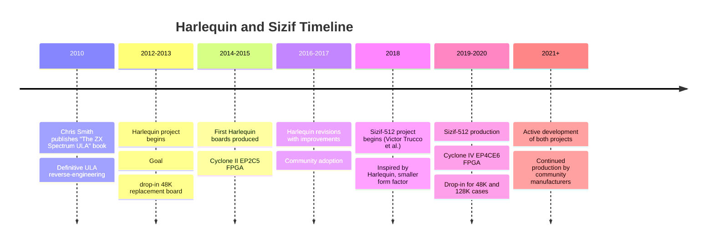

[← Home](../../README.md) · [Emulation](../README.md) · [FPGA Cores](README.md)

# Harlequin and Sizif — Modern FPGA Spectrums in Original Form Factor

The **Harlequin** and **Sizif** (specifically the **Sizif-512**) are modern FPGA-based Spectrum clones designed to **fit inside an original Sinclair Spectrum case** and behave as drop-in replacements for the original 48K Spectrum hardware. Both projects recreate the Spectrum's hardware at the gate level using small FPGAs, providing modern reliability while preserving the exact form factor, connectors, and behaviour of the original Sinclair machine.

Where [MiSTer](mist_mister_core.md) is a multi-platform retro host and [ZX-Uno](zx_uno_core.md) is a single-board "Spectrum++" with extended features, the Harlequin and Sizif aim at a different goal: **invisible modernisation of original hardware**. A user with a dead 48K Spectrum (failed ULA, corroded PCB, dead keyboard membrane) can remove the original PCB, drop in a Harlequin or Sizif board, and have a working Spectrum that uses the original case, keyboard, power supply, and TV output.

This article covers the Harlequin and Sizif projects, their histories, hardware designs, the FPGA ULA recreation, and their place in the modern Spectrum hardware ecosystem. For other modern Spectrum options, see [mist_mister_core.md](mist_mister_core.md), [zx_uno_core.md](zx_uno_core.md), and [zxevo.md](zxevo.md).

---

## The Harlequin Project

### History and Motivation

The **Harlequin** was designed by **Chris Smith**, the author of *The ZX Spectrum ULA: How to Design a Microcomputer* — the definitive technical reference on the Spectrum's ULA (Uncommitted Logic Array). Smith's deep understanding of the ULA's internal design, gained through years of reverse-engineering work, made him uniquely qualified to recreate the ULA in FPGA.

The Harlequin project began around **2012–2013** with the goal of producing a drop-in Spectrum 48K replacement board that would fit inside an original Sinclair case. Key motivations:

- **Failing original ULAs** — the Ferranti-made ULA in the 48K Spectrum was a custom chip produced only for Sinclair; when units failed, there were no replacements
- **Authenticity preservation** — Spectrum enthusiasts wanted to keep using original cases, keyboards, and power supplies, not switch to a different physical form factor
- **ULA reverse-engineering completion** — Smith's book documented the ULA's behaviour in unprecedented detail; the Harlequin was the natural next step — implementing that understanding in hardware

### Harlequin Hardware Design

The Harlequin uses a small FPGA (originally an Altera **Cyclone II EP2C5**, later revised for other FPGAs) to recreate the entire Spectrum 48K except the Z80 CPU and the RAM. Specifically, the Harlequin board contains:

- **The FPGA** — implementing the ULA (video generation, memory arbitration, I/O) and supporting logic
- **A real Z80 CPU** — usually a modern CMOS Z84C00, socketed for replacement
- **RAM chips** — typically 32 KB or 64 KB of static RAM (modern SRAM, replacing the original's 4116 / 4532 DRAMs which are notoriously unreliable)
- **ROM** — either a real EPROM with the 16K Spectrum BASIC ROM, or a flash chip that can be reprogrammed with different ROMs
- **Power supply circuitry** — generating the +5V, -5V, and +12V supplies that the Z80 and the original Spectrum peripherals expect
- **Connectors matching the original Spectrum** — edge connector, TV RF output (modulator), EAR/MIC jacks, expansion port

The Harlequin's PCB is designed to fit **inside the original Sinclair rubber-key Spectrum case** — same dimensions, same mounting holes, same connector positions. A user simply removes the original Spectrum PCB and replaces it with the Harlequin board; the case, keyboard, and power supply are reused.

### The ULA Recreation

The Harlequin's defining achievement is its **faithful ULA recreation in FPGA**. Smith's reverse-engineering work (documented in his book) identified the exact internal logic of the ULA:

- The **video address generator** — the counter that fetches pixels and attributes from RAM
- The **shift register** — converting parallel pixel/attribute bytes into the serial video stream
- The **colour encoder** — combining the shifted pixel data with the BORDER register to produce the final video output
- The **memory arbitration** — the logic that asserts the CPU's WAIT signal during video fetch cycles
- The **timing generator** — the divide-by-N counter that produces the various clocks (CPU clock, video sync, etc.)
- The **I/O ports** — the `0xFE` port (speaker, MIC, EAR, BORDER, keyboard) and the contended-memory decoding

The Harlequin implements all of this in Verilog HDL, synthesised onto the Cyclone II FPGA. The result is a ULA that behaves **identically** to the original Ferranti ULA — same timing, same memory contention, same video signal. The Harlequin passes all the standard Spectrum timing tests (the FUSE test suite, Sensible tests, etc.) with the same results as a real 48K Spectrum.

### Harlequin Variants

The Harlequin has gone through several revisions:

- **Harlequin 1** — the original, using Cyclone II EP2C5
- **Harlequin 2** — revised with improvements to the power supply and connector placement
- **Harlequin 3** — further refinements, better RF modulator replacement
- **Harlequin 48K** — version specifically targeted at the original rubber-key Spectrum case
- **Harlequin 128K** — version that fits the Spectrum +2 / +3 case (with extensions for the +2 / +3 hardware)

All versions share the same FPGA-based ULA recreation approach; the differences are in the PCB layout, connector placement, and exact features supported.
---

## The Sizif-512

### History

The **Sizif-512** is a more recent (2018+) drop-in Spectrum replacement designed by **Victor Trucco** and other Brazilian contributors, with input from the broader retro-computing community. The Sizif-512 was inspired by the Harlequin's approach but uses a different FPGA (Cyclone IV EP4CE6 — the same as the [ZX-Uno](zx_uno_core.md)) and supports both 48K and 128K modes.

The "512" in the name refers to the Sizif's support for 512 KB of paged RAM — a substantial extension over the Harlequin's 48K-only design. The Sizif-512 is positioned as a Harlequin successor that adds modern features while preserving the drop-in form factor.

### Sizif-512 Hardware

The Sizif-512 hardware includes:

- **Cyclone IV EP4CE6 FPGA** — implementing the ULA, memory controller, and supporting logic
- **Real Z80 CPU** — socketed, usually a modern CMOS Z84C00
- **512 KB static RAM** — replacing both the original SRAM and the banked RAM of 128K Spectrums
- **Flash ROM** — holding multiple ROM images (48K, 128K, +2, +3, service) selectable at boot
- **Power supply** — modern switching regulators for +5V, -5V, +12V
- **Original-form-factor connectors** — edge connector, TV RF output, EAR/MIC, expansion port
- **Optional PS/2 keyboard port** — for users who want to bypass the membrane keyboard
- **Optional SD card interface** — for software loading without tapes

The Sizif-512 is designed to fit in **both 48K and 128K / +2 / +3 cases** — a significant advantage over the Harlequin, which was originally 48K-only.

### Sizif-512 Features

The Sizif-512 supports:

- **48K mode** — full Spectrum 48K compatibility
- **128K mode** — Spectrum 128 / +2 emulation with AY-3-8912 sound and banked RAM
- **Pentagon 128 mode** — Russian clone compatibility
- **Turbo mode** — 7 MHz or 14 MHz CPU speeds
- **ULAplus** — extended colour palette (256 colours)
- **DivMMC** — SD-card-based software loading (via the optional SD interface)
- **PS/2 keyboard** — for users who want modern keyboard input
- **Multiple ROMs** — selectable at boot
- **Tape loading** — via the original EAR port, supporting `.tap` / `.tzx` playback from a phone or computer

The Sizif-512's combination of features makes it arguably the most capable drop-in Spectrum replacement available. It combines the Harlequin's ULA-faithful approach with the ZX-Uno's modern extensions, all in an original-form-factor PCB.

### Sizif-512 vs Harlequin

| Aspect | Harlequin | Sizif-512 |
|---|---|---|
| **Original release** | 2012–2013 | 2018 |
| **Designer** | Chris Smith | Victor Trucco et al. |
| **FPGA** | Cyclone II EP2C5 | Cyclone IV EP4CE6 |
| **Supported models** | 48K (early versions); 128K (later) | 48K, 128K, Pentagon 128 |
| **Turbo mode** | Optional | Yes (7 MHz, 14 MHz) |
| **ULAplus** | No | Yes |
| **PS/2 keyboard** | No | Optional |
| **SD card** | No | Optional |
| **Best for** | Authentic 48K Spectrum | Modern, capable Spectrum replacement |

The Harlequin is preferred by purists who want **exact** 48K authenticity (and who respect Chris Smith's ULA-recreation work). The Sizif-512 is preferred by users who want a more capable modern replacement with optional conveniences like PS/2 keyboard and SD card loading.
---

## The ULA Recreation: Why It Matters

The Spectrum's ULA is the most critical — and most difficult to recreate — component of the machine. The ULA is responsible for:

### Memory Arbitration

The original Spectrum uses a single block of DRAM shared between the Z80 CPU and the ULA's video fetch logic. The ULA asserts the CPU's WAIT signal during specific cycles to prevent bus contention when the video fetcher needs RAM. The result is the famous **contended memory** timing — certain RAM addresses (specifically the upper 16 KB of the 48K address space, `0x4000`–`0x7FFF`) cause the CPU to be held off during pixel and attribute fetches.

The Harlequin and Sizif-512 recreate this contention **exactly**, including:

- The specific cycles where WAIT is asserted (which depend on the scanline position)
- The pattern of contention during the active display vs border
- The interaction between contented and uncontented memory accesses
- The "floating bus" effect (reading port `0xFF` during specific cycles returns the byte the ULA is currently fetching)

### Video Signal Generation

The ULA generates the Spectrum's video signal — the composite PAL signal (or RF-modulated signal for the TV output) that produces the picture on a CRT television. The ULA's video signal includes:

- **Horizontal sync** — at the end of each scanline
- **Vertical sync** — at the end of each frame
- **Blanking periods** — horizontal and vertical blanking intervals
- **Colour burst** — for the PAL colour decoder in the TV
- **Pixel data** — the actual screen content, shifted out at the pixel clock

The Harlequin recreates this entire signal chain — sync timing, blanking, colour burst, and pixel data — producing a composite video signal that is **indistinguishable from a real 48K Spectrum**. When connected to a CRT TV, the picture looks identical to original hardware.

### Audio Generation

The ULA also generates the **beeper audio** — the 1-bit PWM sound from port `0xFE`. The ULA's beeper implementation has specific timing characteristics (the beeper output is updated at specific points in the video frame, not continuously) that affect the sound of beeper-based music and games. The Harlequin and Sizif-512 preserve these timing characteristics, producing authentic beeper audio.

### Why Software Tests Matter

The Spectrum demoscene has developed a body of **timing-sensitive tests** — software that exercises specific ULA behaviours and verifies they match real hardware. The Harlequin and Sizif-512 pass these tests, demonstrating that their ULA recreation is faithful:

- **FUSE test suite** — instructions, contended memory, INT timing, video timing
- **Sensible tests** — by Andrew Owen, exercising floating bus, contention patterns
- **Float Spell** — multicolour demo that depends on exact video timing
- **Pentagon Diag ROM** — diagnostic for Russian clones

Passing these tests is the gold standard for ULA recreation. The Harlequin and Sizif-512 are among the few FPGA clones that achieve full marks.

---

## Harlequin/Sizif vs Other Options

How do the Harlequin and Sizif-512 compare to other modern Spectrum options?

| Aspect | Harlequin / Sizif | MiSTer | ZX-Uno | ZX Evolution |
|---|---|---|---|---|
| **Form factor** | Original Spectrum case | Desktop FPGA box | Small standalone board | Standard desktop |
| **Real Z80 CPU** | Yes | No (HDL model) | No (HDL model) | Yes |
| **ULA authenticity** | Excellent (Smith's reverse-engineering) | Good (HDL model) | Good | N/A (Pentagon-class) |
| **Tape loading** | Via original EAR port | Via SD card | Via SD card | Via SD/IDE |
| **CRT/TV output** | RF/composite (authentic) | HDMI/VGA/composite | VGA | SVGA |
| **Best for** | Restoring original Spectrum hardware | Multi-platform retro | Affordable standalone | Russian-scene TR-DOS |

### Why Choose Harlequin or Sizif?

These boards are the right choice when:

- You **already own** an original Spectrum case and keyboard and want to revive it
- You want **maximum authenticity** in a real-hardware form factor
- You need **RF or composite output** for a CRT TV (rather than VGA/HDMI)
- You respect Chris Smith's ULA work and want the most faithful ULA recreation

For most other use cases (general Spectrum enjoyment, software development, demoscene production), MiSTer, ZX-Uno, or software emulators are more practical.

---

## FAQ

**Q: Where can I buy a Harlequin or Sizif-512?**
Both are typically sold by retro-computing retailers in small batches. The Harlequin is sold by **Retroleum** (UK) and various European Spectrum stores. The Sizif-512 is sold primarily through Brazilian and European retailers, and via the project's GitHub. Self-build from open-source PCB files is also possible.

**Q: Can I use a real Spectrum power supply with these boards?**
Yes. The Harlequin and Sizif-512 are designed to accept the original Spectrum's 9V DC input (via the original power jack) and regulate it internally to the +5V, -5V, +12V the machine needs. Modern switching regulators handle this more efficiently than the original Spectrum's linear regulators.

**Q: Do I need a real Spectrum case?**
No, but it's the intended use. The Harlequin and Sizif-512 boards can be used "bare" on a desk, with a PS/2 keyboard (for the Sizif-512) or an external membrane keyboard adapter. However, the boards are designed to fit in original Spectrum cases, which is their primary use case.

**Q: Can I use original Spectrum peripherals (Interface 1, microdrives, joysticks) with these boards?**
Yes. The Harlequin and Sizif-512 expose the original Spectrum edge connector, so any original peripheral works. Interface 1, microdrives, Kempston joysticks, the Currah µSpeech, and other hardware connect as on a real Spectrum.

**Q: Is the Harlequin/Sizif better than a real Spectrum?**
"Better" is subjective. For authenticity (matching a 1982 48K Spectrum), a real Spectrum is the gold standard — but it's 40 years old and unreliable. The Harlequin and Sizif provide the same authenticity with modern reliability. For practical daily use, they are unambiguously better.

**Q: Are these projects open source?**
Yes. Both the Harlequin and Sizif-512 hardware schematics and FPGA core source are publicly available. The projects are non-commercial (or low-cost) community efforts.

**Q: How do I update the firmware?**
Via JTAG (using an Altera USB-Blaster or compatible). The Harlequin and Sizif have JTAG headers on the PCB for flashing new bitstreams. Some Sizif-512 revisions support SD-card-based firmware updates.

---

## Summary

The Harlequin and Sizif-512 represent a different approach to modern Spectrum hardware than the [MiSTer](mist_mister_core.md) or [ZX-Uno](zx_uno_core.md). Rather than building new standalone hardware, they aim to **invisibly modernise original Sinclair hardware** — fitting inside original Spectrum cases and behaving as drop-in replacements for the failed PCBs of 40-year-old machines.

Chris Smith's Harlequin is the original (2012–2013) and the most faithful ULA recreation, based on Smith's authoritative reverse-engineering work in *The ZX Spectrum ULA: How to Design a Microcomputer*. Victor Trucco's Sizif-512 (2018+) extends the concept with modern features (turbo mode, ULAplus, PS/2 keyboard, SD card) while preserving the drop-in form factor.

For Spectrum enthusiasts who own original hardware and want to keep it alive, the Harlequin and Sizif-512 are the ideal solutions — providing modern reliability without sacrificing the authentic experience.

---

## References

### Primary Sources
- **Chris Smith's book**: *The ZX Spectrum ULA: How to Design a Microcomputer* — the definitive technical reference on the ULA, basis for the Harlequin design
- **Harlequin project pages**: Chris Smith's documentation of the Harlequin hardware and FPGA core
- **Sizif-512 GitHub**: Victor Trucco's open-source project, including schematics and Verilog HDL
- **Retroleum catalogue**: UK retro-computing retailer selling Harlequin boards

### Community Resources
- **World of Spectrum forums**: English-language discussion of Harlequin and Sizif
- **ZX-Uno community / zorlac.es**: Spanish-scene discussion (Sizif draws on ZX-Uno technology)
- **Spectrum demoscene timing tests**: FUSE test suite, Sensible tests, Float Spell — used to validate ULA recreation

### Cross-References
- [MiST / MiSTer Core](mist_mister_core.md) — alternative FPGA approach (HDL Z80, multi-platform)
- [ZX-Uno](zx_uno_core.md) — Sizif-512 uses the same Cyclone IV EP4CE6 FPGA
- [ZX Evolution](zxevo.md) — Russian hybrid approach (real Z80 + CPLD)
- [FPGA Implementation](fpga_implementation.md) — how these ULA recreations are designed
- [FPGA Timing Accuracy](fpga_timing_accuracy.md) — cycle-exact timing considerations
- [ULA Video Timing](../../05_development/05_display_and_timing/ula_video_timing.md) — Spectrum ULA timing details
