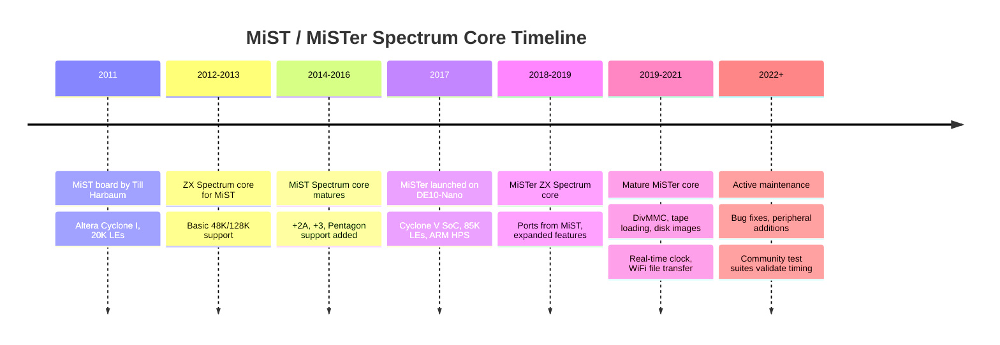

[← Home](../../README.md) · [Emulation](../README.md) · [FPGA Cores](README.md)

# MiST / MiSTer ZX Spectrum Core — FPGA Hardware Emulation

The **MiST** and **MiSTer** projects are FPGA-based retro-computing platforms that host **hardware cores** — synthesized re-implementations of classic computers in programmable logic. The **ZX Spectrum core for MiST/MiSTer** recreates the Sinclair hardware at the gate level, offering a level of authenticity no software emulator can match: cycle-exact CPU timing, real video signal generation, and exact peripheral behavior. For Spectrum enthusiasts who want a "real" Spectrum without vintage hardware unreliability, the MiSTer Spectrum core is the gold standard of modern hardware emulation.

This article covers the MiSTer platform, the Spectrum core's history, its hardware coverage (Sinclair models, Russian/Spanish clones, peripherals), the core's architecture and configuration, and how it compares to both real hardware and software emulators like [Fuse](../software/fuse.md) and [ZEsarUX](../software/zesarux.md). Other FPGA options are covered in [zx_uno_core.md](zx_uno_core.md), [zxevo.md](zxevo.md), and [harlequin_sizif.md](harlequin_sizif.md).

---

## The MiST and MiSTer Platforms

### MiST (2011–2016)

**MiST** (short for "MIST" — **M**inimal **I**ntegration **S**ystem **T**hing, or simply the project name by Till Harbaum) was an FPGA board developed around 2011 specifically for retro-computing core hosting. The original MiST used an **Altera Cyclone I** FPGA with 20,000 logic elements — enough to host a single computer core at a time, loaded from SD card at boot.

The MiST supported dozens of cores: Amiga (Amiga 500), Atari ST, Commodore 64, Amstrad CPC, MSX, Apple II, and many others. The ZX Spectrum core for MiST was developed early in the project's life by community contributors, and established the basic design that the later MiSTer core would extend.

### MiSTer (2017–present)

**MiSTer** is the successor to MiST, launched around 2017 by Alexey Melnikov (the project lead). MiSTer uses the **Terasic DE10-Nano** board, which features a much more capable **Intel/Altera Cyclone V SoC 5CSEMA5** FPGA with 85,000 logic elements, plus a built-in ARM Cortex-A9 dual-core hard processor system (HPS) running Linux.

The DE10-Nano's combination of:
- **Large FPGA fabric** (85K LEs) — enough for the most complex retro machines (Amiga 1200 with AGA, IBM PC AT, Neo Geo)
- **ARM HPS running Linux** — handles file I/O, networking, and user interface
- **Affordable price** (~$130 USD for the bare board, $200+ with add-ons) — accessible to hobbyists
- **Open hardware ecosystem** — many add-on boards (USB hub, SDRAM, I/O board, analog video output)

has made MiSTer the dominant FPGA retro-computing platform of the modern era. Hundreds of thousands of MiSTer units are in active use worldwide.

### Why FPGA for Spectrum Emulation?

Software emulators (Fuse, ZEsarUX, CSpect) approximate hardware behavior by simulating individual chips in code. This works well for most use cases but has fundamental limitations:

- **Cycle accuracy** — software must predict exact hardware cycle counts, which is hard to get right
- **Sub-cycle interactions** — real hardware has timing overlaps, bus contention, and signal-level events that software emulation struggles to model
- **Analogue behavior** — video signal timing, audio DAC characteristics, and CRT display interactions are hard to model in pure software

FPGA cores, by contrast, **reconstruct the hardware itself** in programmable logic. The CPU is implemented as actual flip-flops and combinational logic; the video generator runs in real time at the original clock; the AY-3-8912 sound chip is a hardware implementation. The result is **effectively real hardware** — without vintage silicon unreliability.

For Spectrum enthusiasts who want absolute authenticity (cycle-exact timing, real CRT-compatible video output, exact audio), MiSTer is the answer.
---

## Hardware Coverage

The MiSTer ZX Spectrum core (the main actively maintained version, often called the **SpectrumNext** or simply **Spectrum** core) supports a comprehensive range of Spectrum models:

### Sinclair Models

| Model | ROM | RAM | Notes |
|---|---|---|---|
| **Spectrum 16K** | 16K BASIC ROM | 16K | Original 1982 model |
| **Spectrum 48K** | 48K BASIC ROM | 48K | Standard 1982–1983 model |
| **Spectrum 128K** (Spanish) | 128K Spanish ROM | 128K | 1986 Spanish launch |
| **Spectrum +2** (grey) | 128K +2 ROM | 128K | Amstrad 1987, AY-3-8912 sound |
| **Spectrum +2A** (black) | +3 ROM (banked) | 128K | Amstrad 1987, +2A/+3 banking |
| **Spectrum +3** | +3 ROM (banked) | 128K | Amstrad 1987, +3 floppy disk |

### Clones

| Clone | Origin | Notes |
|---|---|---|
| **Pentagon 128** | Russia 1991 | Russian-scene standard, TR-DOS |
| **Pentagon 512/1024** | Russia 1990s | Extended RAM Pentagon variants |
| **Scorpion 256/1024** | Russia 1990s | Russian clone with ZXM rom |
| **ATM Turbo** | Russia 1990s | 512K RAM, CP/M capable |
| **TK90X / TK95** | Brazil/Spain | Portuguese-language clones |
| **Inves Spectrum+** | Spain | Spanish 48K clone |

### Peripherals

The core emulates a wide range of peripherals, typically with on-core (FPGA) implementations:

- **AY-3-8912 sound chip** — full 3-channel sound with envelope and noise
- **Beta 128 disk interface** — for TR-DOS .trd / .scl disk images (Russian scene)
- **+3 floppy disk interface** — for +3 .dsk images
- **DivMMC / DivIDE** — SD-card-based mass storage via .img files
- **Kempston joystick** — at port `#1F`
- **Sinclair joysticks** — Interface 2 style
- **Interface 1** — microdrives, RS-232, ZX Net (partial)
- **Currah µSpeech** — speech synthesis cartridge
- **Multiface 128 / Multiface 3** — snapshot/poke hardware
- **Proface / Ram Turbo** — various third-party pokes/ups

### Storage

The MiSTer Spectrum core loads software from SD card via the HPS Linux system, supporting:

- **`.tap` / `.tzx`** — tape images (loaded into the virtual cassette, with ROM-based loading via the `LOAD ""` command)
- **`.z80` / `.sna` / `.szx`** — snapshot files
- **`.trd` / `.scl`** — TR-DOS disk images (Beta 128)
- **`.dsk`** — +3 / CPC / generic disk images
- **`.rom`** — cartridge / interface ROM dumps

Files are selected via the MiSTer on-screen-display (OSD) menu, accessible via F12 or a button combination.
---

## Core Architecture

The MiSTer ZX Spectrum core is implemented in **Verilog HDL**, synthesized to the Cyclone V FPGA. The core's top-level modules include:

### Z80 CPU

The core uses a **cycle-accurate Z80 implementation in Verilog** — typically the **T80** core (by Daniel Wallner) or a derivative. The T80 is a well-established open-source Z80 implementation that matches the original Z80's instruction timing cycle-by-cycle, including the undocumented instructions (`SLL`, `LD A,R`, `LD A,I`, `RLD`/`RRD` with their exact cycle counts).

For Pentagon and other clones, the core can use alternative CPU timing to match the clone's actual clock divisor (the Pentagon runs at 3.5 MHz nominal, but the actual crystal on a real Pentagon is 3.5 MHz divided differently from the Sinclair).

### ULA (Video and Memory Arbitration)

The Spectrum's **ULA** (Uncommitted Logic Array) is the heart of the machine — it generates the video signal, performs memory arbitration between CPU and video fetch, and handles the keyboard, tape, and speaker. The MiSTer core's ULA module implements:

- **Video timing** — exactly matching the original Spectrum's 64 µs line, 311 lines per frame, with the correct blank/sync periods
- **Memory contention** — the CPU is held off (WAIT signal asserted) when the ULA is fetching display bytes, matching the original's contended-memory timing
- **Border color** — via the `BORDER` register at port `#FE`
- **Attribute bytes** — the FLASH and BRIGHT bits, with proper blink timing (1 Hz for FLASH)
- **Floating bus** — the famous "floating bus" effect, where reading port `#FF` during specific cycles returns the byte being fetched by the ULA, used by some demos and games

### AY-3-8912 Sound Chip

The core implements the **AY-3-8912** programmable sound generator (PSG) at the register level. The implementation covers:

- 3 tone channels with 12-bit frequency
- 1 noise channel with 5-bit period
- 1 envelope generator with 16 modes
- I/O ports (used for the +2's serial port and some clone extensions)
- Exact register timing matching the real chip

### Peripheral Modules

Each emulated peripheral is a separate Verilog module, instantiated as needed:

- `beta128.v` — the Russian disk interface
- `divmmc.v` — SD card mass storage
- `plus3_fdc.v` — the +3 floppy disk controller (UPD765)
- `if1.v` — Interface 1 (microdrives, RS-232, ZX Net)
- `currah_uspeech.v` — Currah µSpeech
- `kempston.v`, `sinclair_joysticks.v` — joystick interfaces

This modular design allows the core to be configured with different peripheral mixes for different Spectrum models and use cases.

---

## Video Output

One of MiSTer's key advantages over software emulators is **real video output**. The DE10-Nano's FPGA generates video signals directly, which can be output through several pathways:

- **HDMI** (via the DE10-Nano's on-board HDMI port) — digital, 720p/1080p scaled from the original 50 Hz / 60 Hz Spectrum video. The scaler handles aspect ratio correction and produces a sharp image.
- **Analogue VGA** (via the MiSTer **Analogue I/O Board**) — 15 kHz RGB or 31 kHz VGA, switchable. Allows direct connection to CRT monitors for an authentic retro look.
- **Composite / S-Video** (via the Analogue I/O Board with appropriate cables) — for connecting to old CRT TVs.

The FPGA-generated video signal has **pixel-perfect timing** — each Spectrum pixel is exactly 4 CPU cycles wide (in the lower 256×192 display area), exactly as on real hardware. Software emulators must approximate this with their host display's refresh rate, leading to potential judder; MiSTer's video is locked to the original timing.

The core supports **50 Hz** (UK/European Spectrum) and **60 Hz** (US/Japanese models and some clones) video, switchable via the OSD.

---

## Audio Output

Audio from the core is mixed and output via:

- **HDMI audio** — embedded in the HDMI video stream, stereo or mono
- **Analogue audio** (via the Analogue I/O Board) — 3.5mm jack, higher quality than HDMI

The audio mix includes:

- **Beeper** — the 1-bit speaker (port `#FE`), with the original's PWM-like audio characteristics
- **AY-3-8912** — 3-channel PSG sound (when the AY is enabled, on 128K/+2/+3 models or when an AY interface is configured)
- **Currah µSpeech** — when the Currah cartridge is loaded

The AY-3-8912 implementation is at the original clock rate (typically 1.7734 MHz on the 128K, derived from the Spectrum's master clock), producing the exact tone frequencies of the original hardware.

---

## OSD Menu and Configuration

The MiSTer **on-screen display (OSD)** is the primary configuration interface, accessed via F12 (or a long-press of the user button). The OSD overlays a menu on the video output and is navigated with a keyboard or joystick.

The Spectrum core's OSD menu typically includes:

- **Load ROM / Tape / Disk** — file browser for loading software
- **Machine type** — 16K / 48K / 128K / +2 / +2A / +3 / Pentagon / Scorpion / etc.
- **Peripherals** — toggle Interface 1, DivMMC, Currah, etc.
- **Video** — 50Hz / 60Hz, scandoubler (for VGA), aspect ratio, integer scaling
- **Audio** — stereo / mono, beeper volume, AY volume
- **Save / Load state** — snapshot the core's state to SD card
- **Reset** — hard / soft reset
- **Joy** — keyboard-to-joystick mapping

Settings are saved to a `.cfg` file on the SD card, so configuration persists across reboots.
---

## MiSTer vs Real Spectrum vs Software Emulators

The three approaches — real vintage hardware, FPGA core, software emulator — each have their place:

| Aspect | Real Spectrum | MiSTer FPGA | Software Emulator |
|---|---|---|---|
| **Timing accuracy** | 100% (it is the real thing) | ~99% (cycle-exact, with rare divergences in edge cases) | 90–98% (depends on emulator) |
| **Reliability** | Poor (40-year-old capacitors, ULA failures, keyboard membrane decay) | Excellent (modern FPGA, no vintage silicon) | Excellent (it's just software) |
| **Cost** | £100–£300+ for a working 48K, often more for boxed | £200–£300 for a full MiSTer setup (DE10-Nano + USB hub + SDRAM + I/O board + case) | Free |
| **CRT output** | Native (RF or composite) | Yes (via Analogue I/O Board) | Via emulated scanlines (not as authentic) |
| **Software loading** | Tape (slow), disk (moderate), DivMMC | SD card (instant) | Host filesystem (instant) |
| **Peripherals** | Real hardware (rare, expensive) | FPGA emulation (perfect, free) | Software emulation (variable accuracy) |
| **Keyboard** | Real Spectrum keyboard | USB keyboard (with PS/2-style mappings) | Host keyboard |
| **Portability** | None | None (desktop device) | Full (laptops, phones, web browsers) |

### When to Choose MiSTer

MiSTer is the right choice when:

- You want **near-perfect hardware authenticity** without vintage hardware's reliability problems
- You want **real video output** to a CRT monitor or TV
- You are doing **demoscene development** that depends on cycle-exact timing
- You want **one device** that emulates the Spectrum, Amiga, Atari ST, C64, and dozens of others
- You want a **permanent retro-computing setup** rather than a software emulator on a general-purpose computer

### When to Choose Real Hardware Instead

Real Spectrum is preferred when:

- You want the **complete authentic experience** (real keyboard feel, real case, real power LED)
- You are demonstrating hardware to a museum audience
- You need **peripheral hardware** that MiSTer does not emulate (rare interface cards, original printers)
- Nostalgia demands the original

### When to Choose a Software Emulator Instead

Software emulators are preferred when:

- You want **portability** (laptop, phone, web browser)
- You want **reverse engineering tooling** (debuggers, disassemblers, memory views — ZEsarUX is far more capable than the MiSTer OSD)
- You are doing **development** where fast rebuild-and-test cycles matter (the `.nex` workflow in CSpect)
- Cost is a concern

---

## FAQ

**Q: How accurate is the MiSTer Spectrum core compared to real hardware?**
Very accurate — typically indistinguishable for software that does not depend on sub-cycle analog effects. The CPU is cycle-exact; the ULA's memory contention matches the original; the AY-3-8912 produces correct tones. Known divergences are typically in obscure edge cases (specific floating-bus cycles, exact PAL color phase, etc.) that affect a handful of demos but no commercial software.

**Q: Can I load my old Spectrum tape collection?**
Yes. The core loads `.tap` and `.tzx` files, with the original ROM-based loading routine. You can experience the famous loading bars and screeching audio — or use the "load instant" option if you prefer to skip the wait.

**Q: Does MiSTer support the ZX Spectrum Next?**
Partial. There is a separate **Spectrum Next core** for MiSTer that implements some Next features (Z80N, layer 2, sprites, tilemap), but it is less complete than [CSpect](../software/cspect.md) for Next-specific work. The standard Spectrum core focuses on original Sinclair hardware.

**Q: Do I need the Analogue I/O Board?**
No — MiSTer works with HDMI alone. The Analogue I/O Board adds VGA/composite/S-video outputs and analog audio, which are valuable for CRT enthusiasts but not required for general use.

**Q: Do I need the SDRAM module?**
For the Spectrum core, no — the Spectrum's 48K/128K RAM fits comfortably in the FPGA's on-chip memory. Other cores (Amiga, PC) require the SDRAM module, so most MiSTer owners add it as standard.

**Q: Can I use a real Spectrum keyboard?**
With an adapter, yes. Various community projects (e.g., the **Speccy2010 keyboard adapter**) allow connecting a real Spectrum keyboard to MiSTer via USB or PS/2. Most users simply use a standard USB keyboard, mapping the Spectrum's keyword-entry system to a PS/2-style keyboard layout.

**Q: Is the core actively maintained?**
Yes. The Spectrum core has had regular updates over the years, adding peripheral support, fixing bugs, and improving timing accuracy. Bug reports are filed via the [MiSTer FPGA forums](https://misterfpga.org) or via GitHub.

**Q: Can I run Russian TR-DOS software?**
Yes. The Pentagon and Scorpion machine types include the Beta 128 disk interface, and `.trd` / `.scl` disk images load directly. Russian software (games, demos, system software) runs as on a real Pentagon.

---

## Summary

The MiSTer ZX Spectrum core is the **most authentic Spectrum experience available without owning real vintage hardware**. By synthesising the Spectrum's hardware in FPGA logic, the core achieves cycle-exact timing, real video signal generation, and exact peripheral behavior — things that software emulators can only approximate.

For Spectrum enthusiasts who value authenticity and are willing to invest in a MiSTer setup, the core is the natural choice. It is also one of dozens of cores available on MiSTer, making a single device a universal retro-computing platform.

For development, reverse engineering, or casual use, software emulators like [Fuse](../software/fuse.md), [ZEsarUX](../software/zesarux.md), and [CSpect](../software/cspect.md) remain more practical. But for the gold-standard authentic Spectrum experience, MiSTer is the answer.

---

## References

### Primary Sources
- **MiSTer FPGA project**: [misterfpga.org](https://misterfpga.org) — official MiSTer project site, documentation, and community forums
- **MiSTer ZX Spectrum core on GitHub**: source code, releases, and issue tracking for the actively maintained core
- **Terasic DE10-Nano board**: official hardware documentation for the MiSTer platform
- **MiST legacy project**: archived information about the original MiST platform and cores

### Community Resources
- **MiSTer FPGA forums**: [misterfpga.org](https://misterfpga.org) — community discussion and support
- **Atari-Forum MiSTer subforum**: the main English-language MiSTer discussion forum
- **ZX Spectrum core wiki**: documentation specific to the Spectrum core, including configuration tips and known issues

### Cross-References
- [[ZX-Uno](https://github.com/zxdos/zx-uno) Core](zx_uno_core.md) — alternative FPGA platform for the Spectrum
- [ZX Evolution](zxevo.md) — Russian FPGA Spectrum
- [Harlequin / Sizif](harlequin_sizif.md) — modern FPGA Spectrum hardware
- [FPGA Implementation](fpga_implementation.md) — how Spectrum FPGA cores are designed
- [FPGA Timing Accuracy](fpga_timing_accuracy.md) — deep dive on cycle-exact timing in FPGA cores
- [Emulator Comparison](../software/emulator_comparison.md) — software emulators overview
