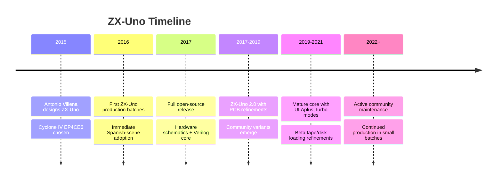

[← Home](../../README.md) · [Emulation](../README.md) · [FPGA Cores](README.md)

# ZX-Uno — Open-Source FPGA Spectrum on a Single Board

The **ZX-Uno** is an open-source, single-board FPGA implementation of the ZX Spectrum and its clones, designed by the Spanish retro-computing community around **Antonio Villena** and released in **2016**. Unlike the [MiSTer](mist_mister_core.md) platform (a general retro-computing host that loads different machine cores), the ZX-Uno is **purpose-built for the Spectrum** — a small PCB with an FPGA, SD card slot, PS/2 keyboard connector, video output, and audio output, designed specifically to be a modern Spectrum clone.

The ZX-Uno's design priorities are:

- **Affordability** — a complete ZX-Uno costs roughly €60–€80, vs €200+ for a MiSTer setup
- **Self-containment** — a working Spectrum in a small board, no PC or monitor required (output to a TV or monitor)
- **Open source** — both hardware (schematics and PCB layout) and core (Verilog HDL) are publicly available
- **Spanish scene heritage** — designed and initially produced by the Spanish-speaking Spectrum community (the Spanish Spectrum scene is among the most active in the world)
- **ULAplus and extensions** — the ZX-Uno's core includes ULAplus (extended color palette), hardware turbo modes, and several Spectrum-era peripherals, making it a "Spectrum++" rather than a strict re-implementation

This article covers the ZX-Uno's history, hardware design, the FPGA core it runs, its feature set (including ULAplus), the software ecosystem, and how it compares to other FPGA Spectrum options. For other FPGA approaches, see [mist_mister_core.md](mist_mister_core.md), [zxevo.md](zxevo.md), and [harlequin_sizif.md](harlequin_sizif.md).

---

## History

### The Spanish Scene and the Need for Modern Hardware

Spain was one of the ZX Spectrum's largest markets — the "Spectrum 48K" and later "Spectrum 128K" (the Spanish launch had the +128K first, in 1986, produced by Investronica) sold in massive numbers throughout the 1980s. Spanish software houses (Opera Soft, Dinamic, Topo Soft, Zigurat, Erbe) produced hundreds of games, and the Spanish Spectrum demoscene remained active into the 2000s.

By the 2010s, however, vintage Spectrum hardware was failing — the original 48K ULAs were dying, keyboards were worn out, and power supplies were unreliable. The Spanish scene needed modern hardware that behaved like a Spectrum but did not suffer from 30-year-old silicon issues. The ZX-Uno was the answer.

### Antonio Villena and the ZX-Uno Design

**Antonio Villena** is a Spanish engineer and Spectrum enthusiast known for several retro-computing hardware projects. In 2015–2016, he designed the ZX-Uno as a single-board FPGA Spectrum, using the **Altera (now Intel) Cyclone IV EP4CE6** FPGA — a small, affordable chip with about 6,000 logic elements, enough to host the Spectrum core and peripherals.

Key design decisions:

- **Cyclone IV EP4CE6 FPGA** — small but sufficient for the Spectrum, cheap (~€8–€10 in single quantities)
- **MicroSD card slot** — for loading software (TAP, TZX, Z80, SNA, TRD, SCL, DSK images)
- **Mini-USB for power** — modern power standard, no vintage 9V supply needed
- **PS/2 keyboard port** — accepts standard PS/2 keyboards (and via adapter, USB keyboards)
- **VGA output** — for connection to modern monitors, with 50 Hz / 60 Hz scan-rate options
- **3.5mm audio jack** — stereo audio output (beeper + AY)
- **Expansion header** — exposes FPGA I/O pins for future add-ons

The ZX-Uno was first produced in **small batches in 2016** and was an immediate success in the Spanish Spectrum community. The first batches sold out quickly, and the project went through several PCB revisions to refine the design.

### Open Source Release and Community Adoption

In 2017, Villena released the ZX-Uno as fully open source:

- **Hardware** (schematics, PCB Gerber files) under a permissive license
- **FPGA core** (Verilog HDL) under the GNU GPL
- **Bootloader and SD image format** documented publicly

This allowed other manufacturers and hobbyists to produce ZX-Uno boards, and several variants emerged — including the **ZX-Uno 2.0** (revised PCB with better power regulation and connectors) and community-built versions with different form factors.

The ZX-Uno's open-source release also influenced other projects — the **Sizif-512** (covered in [harlequin_sizif.md](harlequin_sizif.md)) is partially inspired by ZX-Uno's ULA-recreation approach, and various Russian FPGA clones have adopted ZX-Uno-compatible core features.
---

## Hardware Design

### The Cyclone IV EP4CE6 FPGA

The ZX-Uno's heart is the **Intel/Altera Cyclone IV EP4CE6E22C8N** FPGA. Key specifications:

| Parameter | Value |
|---|---|
| **Logic elements** | 6,272 |
| **Embedded memory** | 276 KB (M9K blocks) |
| **PLLs** | 2 |
| **Maximum user I/O** | 185 (in the largest package) |
| **Process node** | 60 nm |
| **Configuration flash** | External EPCQ16 (16 Mbit) |
| **Speed grade** | C8 (slowest commercial grade; still adequate for the 3.5 MHz Spectrum core) |

6,272 logic elements is enough for a Spectrum core with substantial peripherals — the basic Spectrum (ULA + Z80 + RAM + ROM + I/O) consumes about 2,000–2,500 LEs, leaving room for AY, Beta 128, DivMMC, ULAplus, and other features.

The FPGA is configured at boot from the external EPCQ16 serial flash chip, which holds the bitstream (the synthesized Verilog core). Updates to the core are written to the EPCQ16 via a JTAG interface (or, in newer firmware versions, via SD card with a special bootloader).

### On-Board Hardware

Beyond the FPGA, the ZX-Uno PCB includes:

- **EPCQ16 configuration flash** (16 Mbit) — holds the FPGA bitstream
- **512 KB SRAM** (Alliance Memory AS6C4008) — used as the Spectrum's RAM and paged memory
- **MicroSD card slot** — connected to the FPGA via SPI for software loading and persistent storage
- **PS/2 keyboard port** — through a small buffer to the FPGA
- **VGA output** — 15-pin HDsub connector, 8-bit RGB (3 bits red, 3 bits green, 2 bits blue = 256 colors)
- **3.5mm audio jack** — stereo audio from a simple DAC inside the FPGA
- **Mini-USB power input** — 5V power supply
- **Reset button** — hardware reset
- **JTAG header** — for flashing new bitstreams via USB-Blaster
- **Expansion header** — 40-pin header exposing spare FPGA pins

The PCB is small — roughly 100 mm × 60 mm — making the ZX-Uno a compact, pocketable Spectrum clone.

### Power Supply

The ZX-Uno draws about 200–300 mA at 5V, well within the capability of a standard mini-USB phone charger. No separate power brick is needed; any 5V USB source works.

---

## The ZX-Uno Spectrum Core

The ZX-Uno runs a **Verilog HDL core** that implements the Spectrum and its extensions. The core is derived from the broader Spectrum FPGA ecosystem (including the MiST core, the Spectrum for ZX-Uno project, and various community contributions).

### Supported Machine Types

The ZX-Uno can be configured at boot (via SD card settings) to emulate different Spectrum variants:

- **Spectrum 48K** — original Sinclair 48K with full ULA behavior
- **Spectrum 128K** — Spanish 128K launch model (Investronica)
- **Spectrum +2** (grey) — Amstrad +2 with AY-3-8912
- **Spectrum +2A/+3** — black +2A or +3 with banked ROM
- **Pentagon 128** — Russian clone with TR-DOS
- **Scorpion** — Russian clone
- **TK90X/TK95** — Brazilian/Spanish 48K clones

The machine type affects which ROM is loaded, what peripherals are enabled, and the memory contention model used.

### Z80 CPU Implementation

The core uses the **T80** Verilog Z80 implementation (Daniel Wallner's open-source core, also used in [MiSTer](mist_mister_core.md)). The T80 provides cycle-accurate Z80 execution including undocumented instructions.

For **turbo modes** (see below), the core can switch the Z80's clock to 7 MHz (2× the original 3.5 MHz) or 14 MHz (4×). At 14 MHz, the Spectrum runs at 4× original speed — fast enough for compute-heavy tasks (compiling assembler, fractal generation) without software changes.
---

## ULAplus — The Extended Palette

The ZX-Uno's most celebrated feature is **ULAplus** — an extension to the standard Spectrum video architecture that provides a **256-color palette** instead of the original 15-color (8 colors + bright variants + black) attribute scheme.

### Standard Spectrum Palette Limitations

The original Spectrum's ULA produces video using **INK and PAPER attributes** per 8×8 pixel cell. Each cell has:

- An INK color (0–7, where 8–15 are "bright" variants)
- A PAPER color (0–7, with bright variants)
- A FLASH bit (alternates INK and PAPER at 1 Hz)
- A BRIGHT bit (selects bright vs dim palette)

This gives 8 colors × 2 brightness levels = 15 colors + black, total 16 color entries. The palette is **fixed in ROM** (well, in the ULA's color-lookup table) — software cannot change the actual RGB values of the 16 color entries.

### ULAplus Design

ULAplus, designed by **Andrew Owen** (the same engineer behind the [Spectranet](../../03_io/networking/spectranet.md)), extends this by:

1. **Adding a palette register file** — 64 entries of 8-bit RGB (3 bits red, 3 bits green, 2 bits blue), addressable via I/O ports `#BF` (palette index) and `#FF` (palette value)
2. **Mapping the 16 standard Spectrum colors** to the first 16 palette entries — software can rewrite these to any of 256 RGB values
3. **Providing an extended mode** with **256 colors** — using two attribute bytes per cell instead of one, allowing each pixel to address any palette entry

The ZX-Uno's ULA module implements ULAplus natively. Software that uses ULAplus (most modern Spectrum demos and some games) gets full 256-color graphics; software that doesn't simply uses the standard 16-color palette, with the palette registers pre-loaded to match the original Spectrum colors.

### ULAplus in Practice

ULAplus is widely supported in modern Spectrum software:

- **Demos** — many post-2010 demos use ULAplus for richer color (e.g., works by Kuśma, Gasman, various Russian scene productions)
- **Graphics conversions** — photographs and 256-color art can be displayed
- **Modern games** — some homebrew games take advantage of the extended palette
- **Graphics tools** — ZX Paintbrush, BMP2Spectre, and other tools support ULAplus output

ULAplus is also supported by several software emulators ([Fuse](../software/fuse.md), [ZEsarUX](../software/zesarux.md), [CSpect](../software/cspect.md)), so software developed for ULAplus can be tested before being run on the ZX-Uno hardware.

---

## Turbo Modes

The ZX-Uno supports **turbo modes** that run the Z80 CPU at 2× or 4× the original clock speed:

- **3.5 MHz** (standard) — original Spectrum speed
- **7 MHz** (turbo ×2) — 2× speed, usable by most software
- **14 MHz** (turbo ×4) — 4× speed, requires careful software compatibility checks

At 14 MHz, the Spectrum's perceived speed is comparable to an 8-bit era MSX or Apple IIe — fast enough for serious computing tasks (text editing, compilation, fractal rendering). The video timing is unaffected (the ULA still generates 50 Hz video at 14 MHz CPU clock), so the display looks normal.

The turbo mode is selected via the SD card configuration file at boot time, or via a special I/O port at runtime (some software detects turbo-capable machines and switches automatically).

Software compatibility at 14 MHz is generally good for games (many simply run faster, which can be a feature), but some timing-sensitive software (raster-effect demos, certain games using cycle-counted delays) may behave differently.

---

## Peripherals

The ZX-Uno core emulates a comprehensive set of Spectrum peripherals:

### Sound

- **Beeper** — the 1-bit speaker (port `#FE`)
- **AY-3-8912** — full PSG sound (on 128K/+2/+3 models or when explicitly enabled for 48K)
- **TurboSound** — dual AY-3-8912 chips (some Russian software uses this)
- **SpecDrum** — 8-bit drum sample playback
- **Covox / Soundrive** — simple DAC-based audio (used by Russian scene)

### Storage

- **DivMMC** — SD-card-based mass storage (the ZX-Uno's SD card is presented as a DivMMC device)
- **DivIDE** — earlier CompactFlash-based storage (emulated for compatibility)
- **Beta 128** — TR-DOS disk interface (Russian scene)
- **+3 FDC** — +3 floppy disk interface
- **Interface 1 microdrives** — partial emulation

### Input

- **Kempston joystick** — at port `#1F`
- **Sinclair joysticks** — Interface 2 style
- **PS/2 keyboard** — full PC keyboard, with Spectrum keyword mappings
- **PS/2 mouse** — Kempston mouse protocol

### Other

- **Multiface 128 / 3** — snapshot/poke hardware
- **Currah µSpeech** — speech synthesis
- **SpecMate** — read/write to host filesystem via SD card

The peripheral mix is configurable via the SD card's `zxuno.cfg` file at boot.
---

## ZX-Uno vs Other FPGA Options

The ZX-Uno is one of several modern Spectrum clones. How does it compare?

| Aspect | ZX-Uno | MiSTer | Harlequin | Real Spectrum |
|---|---|---|---|---|
| **Platform** | Single-board FPGA Spectrum | General FPGA retro host | Modern Spectrum hardware in original form factor | Original 1980s hardware |
| **FPGA** | Cyclone IV EP4CE6 (6K LEs) | Cyclone V SoC (85K LEs) | Cyclone IV (smaller) | N/A (real silicon) |
| **Cost** | €60–€80 | €200+ (full setup) | €100–€150 (kit) | £100–£300+ (used) |
| **ULAplus** | Yes (native) | Via core extension | Yes | No (impossible) |
| **Turbo modes** | 7 MHz, 14 MHz | Depends on core | Optional | No |
| **Software loading** | MicroSD | SD card | SD card | Tape / disk |
| **Video output** | VGA | HDMI, VGA, composite | VGA, RGB | RF, composite |
| **Open source** | Yes (HW + core) | Cores vary | Yes | N/A |
| **Best for** | Affordable standalone Spectrum | Multi-platform retro enthusiast | Original-form-factor Spectrum fan | Authentic vintage experience |

### ZX-Uno vs MiSTer

The ZX-Uno and MiSTer are both FPGA platforms, but with very different goals:

- **MiSTer** is a **multi-platform** FPGA host — it can run Amiga, Atari ST, C64, IBM PC, and dozens of other cores. The Spectrum is one of many cores it supports.
- **ZX-Uno** is **Spectrum-only** — its core, hardware, and ecosystem are designed specifically for the Spectrum. This makes it cheaper and more focused, but unable to run non-Spectrum cores.

For Spectrum-only use, the ZX-Uno is the more economical choice. For users who want to emulate multiple platforms, MiSTer is the better long-term investment.

### ZX-Uno vs Harlequin

The Harlequin (covered in [harlequin_sizif.md](harlequin_sizif.md)) is another modern Spectrum clone, but with a different philosophy:

- **Harlequin** aims to be a **drop-in replacement** for original Spectrum hardware — it fits in a real Spectrum case, uses real Spectrum peripherals, and behaves exactly like a 48K Spectrum
- **ZX-Uno** is a **superset** of the Spectrum — it adds ULAplus, turbo modes, and modern peripherals, at the cost of being a different physical form factor

The Harlequin is for purists who want original-form-factor hardware; the ZX-Uno is for users who want a more capable "Spectrum++".

---

## FAQ

**Q: Where can I buy a ZX-Uno?**
The ZX-Uno is sold by several Spanish and European retro-computing retailers, including **Retroleum** (UK) and various Spanish eBay/Spectrum-store sellers. Hardware is also self-buildable from the open-source PCB files via services like JLCPCB. Production runs are in small batches, so availability varies.

**Q: Do I need to assemble anything?**
A fully assembled ZX-Uno requires no assembly — just plug in a PS/2 keyboard, VGA monitor, microSD card with software, and USB power. Self-build from PCB + components is possible for those with soldering skills (the components are mostly through-hole for ease of assembly).

**Q: Can I update the core?**
Yes. Core updates are released periodically and can be flashed via JTAG (using an Altera USB-Blaster) or via SD card using the bootloader. The process is documented in the ZX-Uno wiki.

**Q: Does the ZX-Uno support the ZX Spectrum Next?**
No. The ZX-Uno's FPGA is too small to host the Next's feature set (layer 2 framebuffer, hardware sprites, tilemap, copper, Z80N). For Next hardware emulation, use [CSpect](../software/cspect.md) or the MiSTer Spectrum Next core.

**Q: How do I write my own software for the ZX-Uno?**
Use the standard Spectrum cross-development toolchain (sjasmplus, z88dk, Boriel ZX BASIC) and target the standard Spectrum model. For ULAplus support, write to I/O ports `#BF` / `#FF` to set palette entries. For turbo mode, your software can detect turbo-capable machines and adapt accordingly.

**Q: Is ULAplus software-compatible with old Spectrum games?**
Yes. ULAplus is a superset of the standard Spectrum palette — old software runs unchanged, using the first 16 palette entries which are pre-loaded with the standard Spectrum colors. ULAplus only activates when software explicitly writes to the palette registers.

**Q: Can I use my old Spectrum keyboard with the ZX-Uno?**
Not directly — the ZX-Uno uses a PS/2 keyboard port. With a hardware adapter (converting the Spectrum's matrix to PS/2 scan codes), it's possible; some community projects exist for this. Most users simply use a standard PS/2 or USB (via PS/2 adapter) keyboard.

**Q: Is the ZX-Uno actively maintained?**
Yes. The core is on GitHub and receives periodic updates. Hardware production continues in small batches. The community is most active on Spanish-language Spectrum forums (such as **zorlac.es** / **speccy.org**) but also has English-language discussion threads.

---

## Summary

The ZX-Uno is the **premier affordable standalone FPGA Spectrum** — a small, open-source board that recreates the Spectrum at the gate level and adds modern extensions like ULAplus and turbo modes. For roughly €60–€80, users get a working Spectrum clone that loads software from microSD, outputs to a VGA monitor, and accepts a PS/2 keyboard.

While not as flexible as MiSTer (which can host many retro platforms), the ZX-Uno's Spectrum-focused design makes it a better value for users who only want a Spectrum. Its open-source nature has also influenced the broader modern Spectrum hardware ecosystem, with the Sizif-512 and various Russian FPGA clones drawing on ZX-Uno's design ideas.

For Spanish-scene enthusiasts, demoscene producers using ULAplus, or anyone who wants a no-fuss modern Spectrum, the ZX-Uno is an excellent choice.

---

## References

### Primary Sources
- **ZX-Uno project GitHub**: official repository for hardware, core, and documentation
- **Antonio Villena's website**: design notes, production information, and order links
- **ZX-Uno wiki**: community-maintained documentation on configuration, software loading, and troubleshooting

### Community Resources
- **zorlac.es / speccy.org Spanish forums**: the primary ZX-Uno community discussion
- **World of Spectrum forums**: English-language ZX-Uno discussion threads
- **ULAplus specification** by Andrew Owen: technical documentation of the ULAplus palette extension

### Cross-References
- [MiST / MiSTer Core](mist_mister_core.md) — general FPGA retro-computing platform
- [ZX Evolution](zxevo.md) — Russian FPGA Spectrum
- [Harlequin / Sizif](harlequin_sizif.md) — original-form-factor modern Spectrum
- [FPGA Implementation](fpga_implementation.md) — how these cores are designed
- [FPGA Timing Accuracy](fpga_timing_accuracy.md) — cycle-exact timing in FPGA
- [Spectranet](../../03_io/networking/spectranet.md) — Andrew Owen's other major Spectrum project (related to ULAplus by author)
