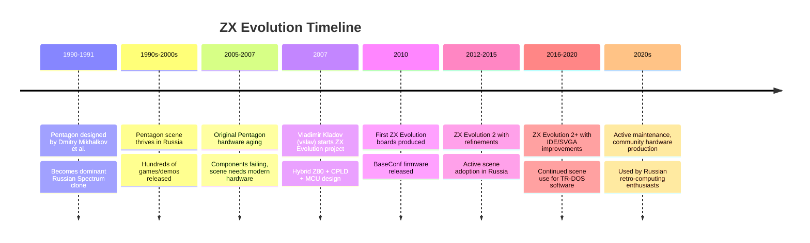

[← Home](../../README.md) · [Emulation](../README.md) · [FPGA Cores](README.md)

# ZX Evolution — The Russian Spectrum Reborn

The **ZX Evolution** (also known as **ZX Evo**, **Pentagon Evo**, or by its earlier name **BaseConf**) is a modern Russian FPGA-based Spectrum clone that became a flagship of the post-Soviet retro-computing scene in the late 2000s and 2010s. Designed by **Vladimir "vslav" Kladov** and other contributors, the ZX Evolution combines a real **Z80 CPU** with **CPLD glue logic** and an **ATmega microcontroller** for peripheral management — a hybrid approach that distinguishes it from pure-FPGA clones like the [MiSTer](mist_mister_core.md) and [ZX-Uno](zx_uno_core.md).

The ZX Evolution is the spiritual successor to the **Pentagon** — the most popular Russian Spectrum clone of the 1990s. It preserves the Pentagon's memory map, TR-DOS disk interface, and software ecosystem while adding modern features: PS/2 keyboard and mouse, IDE hard disk, SVGA output at multiple resolutions, 4 MB of paged RAM, and an SD-card interface. For Russian-scene enthusiasts, the ZX Evolution is the modern Pentagon — the same software base, but with hardware that does not suffer from 30-year-old Russian capacitor rot.

This article covers the ZX Evolution's history, hybrid hardware architecture, Pentagon compatibility, the BaseConf firmware, software ecosystem, and its place in the modern Spectrum world.

---

## History

### The Pentagon Legacy

The **Pentagon** was the dominant Russian Spectrum clone throughout the 1990s. Designed in 1990–1991 by **Dmitry "DimaM" Mikhalkov** and others, the Pentagon was built from discrete logic chips (no custom ULA — Russia lacked access to Ferranti's ULA technology), with a memory layout that loosely followed the Spectrum 128's banking scheme. The Pentagon ran at the same 3.5 MHz as the original Spectrum and used the Russian **TR-DOS** disk operating system with the **Beta 128** disk interface.

The Pentagon's significance to the Russian scene cannot be overstated — it was the platform on which hundreds of Russian games, demos, and system software were built. Even after the Soviet Union collapsed and Western hardware became available, the Pentagon remained the dominant platform in Russia through the late 1990s and early 2000s.

By the mid-2000s, however, the original Pentagon hardware was aging — the discrete logic chips were failing, edge connectors were oxidising, and the Russian-made DRAM chips were unreliable. The scene needed a modern Pentagon that preserved the software ecosystem but did not suffer from 1990s Russian-component reliability issues.

### The ZX Evolution Project (2007–2010)

Vladimir Kladov (known online as **vslav**) initiated the ZX Evolution project around 2007 with the goal of recreating the Pentagon in modern hardware. Key design decisions:

- **Real Z80 CPU** — rather than synthesising a Z80 in FPGA, the ZX Evolution uses an actual Z80 chip (or a modern CMOS clone like the **CMOS Z80S180** or Russian **KR1858VM1**)
- **CPLD glue logic** — a Complex Programmable Logic Device (Altera MAX II) handles address decoding, memory banking, and peripheral selection — the parts of a Spectrum clone that were historically implemented in dozens of discrete logic chips
- **ATmega microcontroller** — for PS/2 keyboard, PS/2 mouse, and SD card interfaces
- **IDE interface** — for hard disks and CompactFlash cards
- **SVGA output** — supporting multiple resolutions beyond the original Spectrum's 256×192

This hybrid approach (real Z80 + CPLD + MCU) is distinct from pure-FPGA clones. It preserves the exact electrical and timing characteristics of a real Z80 (which matters for some software that depends on cycle-level Z80 behaviour) while replacing the discrete logic with a single programmable device.

### Release and Adoption (2010–present)

The first ZX Evolution boards were produced around 2010, and the project has continued in active development through the 2010s and 2020s. Several revisions have been released, with the most common being:

- **ZX Evolution BaseConf** — the original revision
- **ZX Evolution 2** — refined PCB with better power regulation and additional features
- **ZX Evolution 2+** — further refinements, including faster IDE and improved SVGA output

The ZX Evolution is open-source — schematics, CPLD firmware, and MCU code are all publicly available on the project's SVN/GitHub repository. This has allowed community members to produce their own boards, and several Russian and Eastern European manufacturers sell fully assembled ZX Evolutions.

The ZX Evolution is most popular in Russia and other former Soviet countries, but has some adoption in Western Europe among enthusiasts who want to explore the Russian Spectrum scene (which is vast — thousands of games, demos, and tools were produced for the Pentagon and its cousins).
---

## Hardware Architecture

The ZX Evolution's hybrid architecture is its defining feature. Unlike a pure-FPGA clone (where the Z80, ULA, and peripherals are all synthesised in programmable logic), the ZX Evolution uses three different types of components:

### The Z80 CPU

At the heart of the ZX Evolution is a **real Z80 CPU** — either an original Zilog Z84C00 (NMOS or CMOS), a modern CMOS Z80 such as the Z84C0020 (20 MHz rated), or a Russian-made equivalent like the **KR1858VM1**. The Z80 runs at the standard Spectrum clock of **3.5 MHz**, but can be overclocked to **7 MHz** or **14 MHz** for turbo mode.

Using a real Z80 chip has advantages:

- **Exact instruction timing** — the Z80's behaviour at the cycle level is guaranteed by the chip's design, not approximated by an HDL model
- **Exact undocumented behaviour** — instructions like `SLL` and the flags behaviour of `LD A,I` / `LD A,R` are exactly as on real hardware, with no risk of HDL model error
- **Real electrical characteristics** — the Z80's bus signals (M1, MREQ, IORQ, RD, WR, RFSH, BUSACK) have real timing relationships, which matters for some peripheral interactions

The disadvantage is that a real Z80 chip requires a real PCB with real address/data bus routing — the ZX Evolution cannot be "loaded" with different cores the way MiSTer can. The ZX Evolution is a Spectrum clone; it cannot become an Amiga or C64.

### The CPLD (Altera MAX II)

Where a 1990s Pentagon used dozens of 74-series logic chips for address decoding, memory banking, and peripheral selection, the ZX Evolution uses a single **Altera MAX II EPM570** CPLD (Complex Programmable Logic Device). The CPLD implements:

- **Address decoding** — selecting RAM banks, ROM, I/O devices based on the Z80's address bus
- **Memory banking** — the Pentagon's paged memory scheme (similar to the Spectrum 128's banking, with extensions)
- **I/O port decoding** — selecting the AY-3-8912, the Beta 128 disk controller, the IDE interface, etc.
- **Video address generation** — the addresses that the video generator fetches from RAM
- **Memory arbitration** — handling the CPU/video fetch contention (the WAIT signal that holds the CPU when the video generator is reading)

The MAX II EPM570 has 570 logic elements (macrocells) — much smaller than a full FPGA, but enough for the combinatorial and sequential logic that a Spectrum clone's address-decoding requires. The CPLD's programming is held in non-volatile memory, so it loads instantly at power-on (no bitstream loading from flash).

### The ATmega Microcontroller

For peripherals that require more intelligence than simple I/O ports, the ZX Evolution uses an **Atmel ATmega** microcontroller (typically an ATmega8515 or ATmega162). The MCU handles:

- **PS/2 keyboard** — receives scan codes from a standard PC keyboard, translates them to the Spectrum's keyboard matrix
- **PS/2 mouse** — receives mouse movement data, presents it via a Kempston-compatible mouse protocol
- **SD card interface** — SPI-based SD card access for software loading and file storage
- **Real-time clock** — optional battery-backed clock for date/time functions
- **Firmware updates** — the MCU can reflash the CPLD in-system

The MCU runs at a few MHz and communicates with the Z80 via a small set of I/O ports. To the Z80, the MCU looks like a handful of registers — the complexity of PS/2 protocol handling, SD card SPI, and mouse protocol translation is hidden inside the MCU's firmware.

### Memory Layout

The ZX Evolution provides up to **4 MB of paged RAM** — far more than the original Pentagon's 128K or 512K. The memory is divided into 16 KB pages that can be mapped into the Spectrum's address space via banking registers in the CPLD. This allows:

- **Standard Pentagon 128K compatibility** — the original banking scheme works as on a real Pentagon
- **Extended memory for modern software** — demos, games, and tools that need more than 128K
- **RAM disk** — using unused pages as a fast in-memory disk
- **Multiple ROMs** — several ROM images (48K BASIC, 128K BASIC, TR-DOS, service ROM) can be paged in without reflashing

### Video

The ZX Evolution's video generator (implemented in the CPLD) produces SVGA output at multiple resolutions:

- **Standard Spectrum 256×192** — at 50 Hz, 60 Hz, or 100 Hz (with scan doubling for flicker-free display)
- **Extended 384×304 (Pentagon's 384×304 mode)** — a Russian-scene extension that uses the full video frame
- **Multicolour modes** — varying the attribute bytes per line (similar to the original Spectrum's "attribute bytes per 8 lines" but with finer granularity)
- **16-colour and 256-colour extended modes** — the ZX Evolution's video hardware supports richer colour than the standard Spectrum

Output is via a 15-pin SVGA connector, compatible with modern monitors. There is no RF or composite output — the ZX Evolution is designed for modern displays.

### Storage

The ZX Evolution provides several storage options:

- **IDE interface** — for hard disks, CompactFlash cards (via IDE-to-CF adapter), or SD-to-IDE adapters. The Pentagon/Scorpion TR-DOS disk format is supported via TSR drivers
- **SD card via ATmega SPI** — directly accessible via the MCU's SPI interface
- **Beta 128 disk interface** — for traditional TR-DOS .trd / .scl disk images, accessible via the original Russian disk format
- **DivMMC emulation** — for modern SD-card-based software loading
---

## BaseConf — The Firmware

The ZX Evolution's firmware (the configuration that runs on the CPLD and defines the machine's behaviour) is called **BaseConf**. Designed by Vladimir Kladov, BaseConf implements the full Pentagon specification plus modern extensions.

### Pentagon Compatibility

BaseConf's primary design goal is **exact Pentagon 128 compatibility**. Software that runs on a real Pentagon 128 (which is most Russian Spectrum software from the 1990s onward) should run identically on the ZX Evolution. This includes:

- **Memory banking** — the Pentagon's specific banking scheme, which is similar but not identical to the Spectrum 128's
- **Video timing** — the Pentagon's video frame timing (slightly different from the original Spectrum's, with a different number of lines per frame and different cycle counts)
- **I/O port layout** — the specific port addresses used by the Pentagon for banking, video, and sound
- **Beta 128 disk interface** — at the original port addresses, with the original VG93 (FD1793) floppy disk controller behaviour
- **AY-3-8912 sound** — at the Pentagon's port addresses and clock rate

For Russian-scene software, this compatibility is essential. Demos, games, and system software written for the Pentagon expect specific machine behaviour; BaseConf delivers it.

### Extensions Beyond Standard Pentagon

BaseConf adds several features that the original Pentagon lacked:

- **Turbo mode** — 7 MHz and 14 MHz CPU speeds, switchable at runtime
- **Extended RAM** — 4 MB of paged RAM (vs the Pentagon's 128K or 512K)
- **PS/2 keyboard and mouse** — via the ATmega MCU, with full PC-keyboard layout support
- **IDE interface** — for CompactFlash and hard disk storage, addressing the Pentagon's disk-space limitations
- **SVGA output** — at multiple resolutions and refresh rates
- **RTC (real-time clock)** — battery-backed, accessible to software
- **Gluk socket** — for connecting a real-time clock / NVRAM module
- **SD card via SPI** — direct SD card access through the MCU

These extensions are presented to software via additional I/O ports that don't conflict with the original Pentagon's port layout. Software that doesn't use the extensions simply ignores them.

### Configuration and ROM Selection

BaseConf supports multiple ROM images stored in flash memory, selectable at boot time:

- **TR-DOS ROM** — the Russian disk operating system, used for disk operations
- **128K BASIC ROM** — the standard 128K BASIC, used for general computing
- **48K BASIC ROM** — for 48K software compatibility
- **Service ROM** — diagnostic and configuration menus
- **Custom ROMs** — users can flash their own ROMs

A boot menu (accessible via a key combination at power-on) lets the user select which ROM to boot from, configure turbo mode, and set other options.

---

## Software Ecosystem

### TR-DOS Software

The ZX Evolution is primarily a TR-DOS machine — most software runs from disk via the TR-DOS / Beta 128 disk interface. The Russian TR-DOS software library is vast:

- **Games** — hundreds of Russian-developed games, plus conversions of Western titles
- **Demos** — Russian demoscene productions, including work by elite crews like **Progress**, **Extreme**, **SkillCom**, **Boomerang**, and others
- **System software** — disk utilities, file managers, music editors, graphics tools
- **Development tools** — assemblers (ALASM, XAS), debuggers (STS), and Russian-scene-specific tools

TR-DOS disks are typically distributed as `.trd` or `.scl` files, which can be loaded onto SD cards or actual floppy disks for use on the ZX Evolution.

### Modern Software

Beyond TR-DOS compatibility, the ZX Evolution supports modern software that uses its extended features:

- **Disk operating systems** that leverage the IDE interface — including **Fat/Fat16** file systems on CompactFlash cards
- **Graphics software** using the extended video modes
- **Music software** taking advantage of multiple AY chips (TurboSound)
- **Games** that use the extended RAM for richer content

### Demoscene

The ZX Evolution has been a workhorse of the Russian Spectrum demoscene since its release. Major Russian demo parties where ZX Evolution demos debut:

- **CC (Chaos Constructions)** — St. Petersburg, the largest Russian demoscene party
- **diHalt** — Nizhny Novgorod, long-running Russian party with a strong Spectrum component
- **CAFe** — Kazan, smaller but active
- **FunTop** — Moscow (historical)
- **AXAC** — Russian Spectrum-specific party
- **ZX-Dev** — Russian Spectrum-focused demoscene event

Demos at these parties often target the ZX Evolution specifically, leveraging its turbo modes, extended video, and TurboSound. Notable Russian demos that premiered or ran on ZX Evolution hardware include productions by Progress, Extreme, SkillCom, and others.
---

## ZX Evolution vs Other Spectrum Options

The ZX Evolution occupies a unique niche among modern Spectrum options:

| Aspect | ZX Evolution | ZX-Uno | MiSTer | Real Pentagon |
|---|---|---|---|---|
| **Architecture** | Real Z80 + CPLD + ATmega MCU | Pure FPGA | Pure FPGA + ARM HPS | Real Z80 + discrete logic |
| **Pentagon compatibility** | Excellent (primary design goal) | Good (via core) | Good (via core) | Native |
| **Software base** | Russian TR-DOS / Pentagon | Both Russian and Western | Multi-platform (cores) | Russian TR-DOS |
| **Real Z80 timing** | Yes (real chip) | No (HDL model) | No (HDL model) | Yes (real chip) |
| **Cost** | ~€150–€250 | €60–€80 | €200+ | £100–£300+ (rare) |
| **Best for** | Russian-scene enthusiasts | Affordable standalone | Multi-platform retro | Authentic Russian experience |

### Why Choose the ZX Evolution?

The ZX Evolution is the right choice when:

- You want **exact Pentagon 128 compatibility** — for running the vast Russian TR-DOS software library
- You want **real Z80 timing** — for software that depends on cycle-level Z80 behaviour
- You are a **Russian-scene enthusiast** who values the Pentagon software ecosystem
- You want **modern conveniences** (PS/2 keyboard, IDE, SVGA) without losing the Pentagon character

### ZX Evolution vs ZX-Uno

Both are "modern Spectrum" hardware, but with very different approaches:

- **ZX-Uno** is a pure FPGA clone — smaller, cheaper, focused on the global Spectrum scene
- **ZX Evolution** uses real Z80 + CPLD — larger, more expensive, focused on the Russian scene

For users who want Pentagon compatibility above all, the ZX Evolution is more authentic. For users who want a general Spectrum clone with ULAplus and turbo modes, the ZX-Uno is the better value.

---

## FAQ

**Q: Where can I buy a ZX Evolution?**
The ZX Evolution is produced in small batches by Russian and Eastern European retro-computing manufacturers. Sources include **NedoPC** (Russian), various Russian eBay sellers, and self-build from the open-source hardware files. Availability outside Russia is limited but not impossible.

**Q: Is the ZX Evolution open source?**
Yes. Schematics, PCB layout, CPLD firmware (BaseConf), and ATmega MCU code are all publicly available. The project is hosted on Russian development sites (originally on SVN, now mirrored on GitHub).

**Q: Can the ZX Evolution run original Sinclair Spectrum software?**
Yes. The ZX Evolution can be configured to emulate a standard 128K Spectrum (the Pentagon's banking is close enough that 128K software generally works). The 48K BASIC ROM is also available for 48K-only software. However, the ZX Evolution's video timing matches the Pentagon, not the original Sinclair — so timing-sensitive software written for the original 48K may behave slightly differently.

**Q: What's the difference between BaseConf and TS-Conf?**
**BaseConf** is the original ZX Evolution firmware, focused on Pentagon 128 compatibility. **TS-Conf** is a later, more advanced firmware that adds features inspired by the TS (Turbo Sound) and other extensions. TS-Conf is not strictly Pentagon-compatible but offers richer features. Users can switch between BaseConf and TS-Conf via reflashing.

**Q: Does the ZX Evolution support ZX Spectrum Next software?**
No. The ZX Evolution's hardware cannot run Next-specific software (layer 2, sprites, tilemap, copper, Z80N). The ZX Evolution is a Pentagon-class machine, not a Next.

**Q: Can I connect a real Spectrum keyboard?**
With an adapter, yes. The ZX Evolution's expansion bus follows the Pentagon / Russian edge connector standard, and various keyboard adapters exist. Most users simply use a PS/2 keyboard via the on-board port.

**Q: Is the ZX Evolution actively maintained?**
Yes. The project's GitHub repository has periodic commits, and the Russian scene continues to use the ZX Evolution as a primary platform. New firmware versions are released occasionally with bug fixes and minor feature additions.

**Q: Does the ZX Evolution work with modern TFT monitors?**
Yes, via SVGA. The ZX Evolution's video output is standard VGA/SVGA, compatible with most modern monitors. Some older TFTs may have issues with 50 Hz refresh, but most modern monitors handle it.

---

## Summary

The ZX Evolution is the **modern Pentagon** — a hybrid Z80 + CPLD + MCU Spectrum clone that preserves the Russian scene's software base while adding modern features. For enthusiasts of the Russian Spectrum scene (which is among the largest and most active in the world), the ZX Evolution is the natural choice: it runs the entire TR-DOS software library, supports PS/2 keyboard/mouse, IDE storage, SVGA output, and extended RAM, all while maintaining cycle-level Z80 authenticity through its real Z80 CPU.

While less known outside the Russian-speaking world than the [MiSTer](mist_mister_core.md) or [ZX-Uno](zx_uno_core.md), the ZX Evolution is a significant platform in its own right — one that has kept the Russian Spectrum scene alive through the 2010s and 2020s. Its open-source design and continued community support ensure it will remain a relevant platform for years to come.

---

## References

### Primary Sources
- **ZX Evolution project website / SVN**: the original project repository with schematics, CPLD firmware, and MCU code
- **NedoPC** (nedopc.org): Russian retro-computing retailer and community hub, primary source for ZX Evolution hardware and information
- **Vladimir Kladov's project pages**: design notes and documentation by the ZX Evolution's lead designer
- **BaseConf source code**: Verilog/VHDL for the CPLD firmware, available on GitHub

### Community Resources
- **ZX-Forum.ru / Russian Spectrum forums**: primary Russian-language discussion of the ZX Evolution
- **CC, diHalt, CAFe party archives**: demos that premiered on or target the ZX Evolution
- **Pentagon software archives**: `.trd` and `.scl` disk images compatible with the ZX Evolution

### Cross-References
- [MiST / MiSTer Core](mist_mister_core.md) — alternative FPGA platform with Pentagon core
- [ZX-Uno](zx_uno_core.md) — alternative FPGA Spectrum (Spanish scene)
- [Harlequin / Sizif](harlequin_sizif.md) — other modern Spectrum hardware
- [FPGA Implementation](fpga_implementation.md) — how FPGA cores are designed (the ZX Evolution uses CPLD, but similar principles)
- [FPGA Timing Accuracy](fpga_timing_accuracy.md) — cycle-exact timing considerations
- [ALASM + STS](../../09_toolchain/alasm_sts.md) — Russian-scene assembler/debugger used on the ZX Evolution
