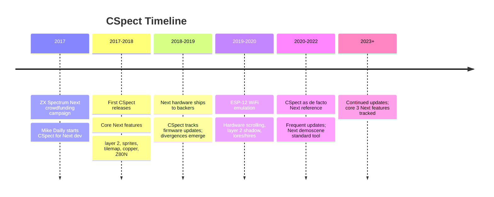

[← Home](../../README.md) · [Emulation](../README.md) · [Software Emulators](README.md)

# CSpect — The ZX Spectrum Next Reference Emulator

**CSpect** is a ZX Spectrum emulator by **Mike Dailly** (co-founder of DMA Design / Rockstar North, formerly of Codematches and the Lemmings team). It is best known as the **reference emulator for the ZX Spectrum Next**: a software platform whose feature set closely tracks the Next's hardware specifications, making CSpect the first-choice emulator for Next development, Next software testing, and Next demoscene production.

Unlike [Fuse](fuse.md) (the cycle-accurate workhorse for original Sinclair hardware) and [ZEsarUX](zesarux.md) (the broad-coverage reverse-engineering workstation), CSpect's identity is narrower but sharper: **its mission is to be the authoritative software representation of the ZX Spectrum Next**, with faithful implementation of the layer 2 framebuffer, hardware sprites, tilemap, copper, Z80N CPU instructions, hardware scrolling, lores modes, and the ESP-12 WiFi module. When Next developers need to know "does this behave the same on real hardware?", they test on CSpect.

CSpect is free for personal use but **closed-source** — a notable distinction from Fuse and ZEsarUX, both of which are GPL. Mike Dailly distributes the emulator as Windows binaries (with limited Wine compatibility on Linux/macOS). The source remains proprietary, though CSpect's author participates actively in the Next community and incorporates bug reports rapidly.

This article covers CSpect's history, the ZX Spectrum Next hardware it models, its debugger and developer tooling, its role in the Next software ecosystem, and how it compares to other emulators for Next-specific work.

---

## History

### Mike Dailly and the Spectrum Next Project

Mike Dailly is a veteran of the UK games industry. After working on **Lemmings**, **Grand Theft Auto**, **Body Harvest**, and other titles at DMA Design, he developed CSpect as a personal project tied to the ZX Spectrum Next crowdfunding campaign (2017). The Next team needed an emulator that could run Next software before the actual hardware shipped, so developers could write games, demos, and tools without waiting for physical machines.

CSpect's design priorities were set by this mission:

- **Hardware fidelity to the Next spec** — every documented Next feature should work in CSpect
- **Performance** — Next software (especially demoscene productions) needs full-speed emulation, including the Next's enhanced video modes
- **Developer tooling** — debugger, breakpoints, memory views, and inspection tools aimed at game/demo authors
- **Rapid iteration** — Mike Dailly releases CSpect updates frequently, often within days of bug reports

The first CSpect releases (2017) implemented the core Next feature set: layer 2 framebuffer, hardware sprites (64 sprites, 256 per frame), tilemap (40×32 or 80×32), copper (the Next's programmable scanline coprocessor), and the Z80N CPU with its extended instructions (`LDPIR`, `SWAPNIB`, `MIRROR`, `PIXELDAT`, `NEXTREG` access via `LD A,NX` / `LD NX,A` patterns). Subsequent releases added the ESP-12 WiFi module emulation, hardware scrolling (radistan-style scrolling via `NEXTREG` registers), layer 2 shadow, lores and hires modes, and the extended palette (256 colors from a 24-bit RGB palette).

### CSpect vs the Real Next

CSpect's mission is to be the Next's software twin, but it is not identical to real hardware. The Next's FPGA implementation has timing quirks, undocumented behaviors, and signal-level interactions that software emulation cannot perfectly reproduce. CSpect's author maintains a list of known divergences — typically around copper timing, DMA behavior, or edge cases in layer 2 / sprite priority resolution.

Next developers therefore use CSpect as a **first-pass test platform**, with final validation on real hardware. The Next community has developed a body of "CSpect-vs-real" notes documenting where the two diverge — these notes are part of every serious Next developer's reference library.
---

## ZX Spectrum Next Hardware Coverage

### The Z80N CPU

CSpect implements the **Z80N** — a Z80-compatible core with additional instructions designed for the Next. The Z80N's extended instruction set includes:

| Instruction | Mnemonic | Purpose |
|---|---|---|
| `LD (HL),A` then `INC HL` + `DEC B` + `JP NZ` | `LDPIR` | Fast block fill (pixel-drawing primitive) |
| Swap high/low nibbles of A | `SWAPNIB` | Pixel packing |
| Mirror bits in A | `MIRROR` | Sprite mirroring lookup |
| Pixel data accumulator | `PIXELDAT` | Sprite blit primitive |
| `LD A,(NN)`, `LD (NN),A` (16-bit addr) | extended `LD` | Larger memory access |
| Next register access | `LD A,NX` / `LD NX,A` | Access Next's `NEXTREG` configuration space |
| Test-and-set bit | `BRLC DE,B` | Barrels / rotates |
| Pop DE and push HL | `POP HD` / `PUSH HD` | 16-bit stack manipulation variants |

CSpect implements these instructions correctly per the official Z80N specification. Some undocumented Z80 instructions (the famous `SLL` / `SLI` from the original Z80) are also handled for backward compatibility with legacy Spectrum code.

### Layer 2 Framebuffer

The **layer 2** is the Next's 256×192×8bpp framebuffer — a fully byte-addressed 256-color display surface (palette from 24-bit RGB). Layer 2 can be displayed above the standard ULA display (priority), blended with it, or stand alone. CSpect implements:

- The 16 KB pages of layer 2 RAM (paged via `NEXTREG #12`)
- Layer 2 priority vs ULA (`NEXTREG #70` priority modes)
- Layer 2 shadow (double-buffering for flicker-free animation)
- Layer 2 clipping and offset registers
- Layer 2 blending modes (`NEXTREG #69` blend source/destination selection)

### Hardware Sprites

The Next provides **hardware sprites** — up to 64 sprites per frame (with 256 sprite images in the sprite pattern cache), 16×16 or 8×8 pixels, with 4-bit per-pixel transparency. CSpect's sprite emulation covers:

- Sprite pattern RAM (paged via `NEXTREG #34` / `#36`)
- Sprite attribute RAM (per-sprite: x, y, pattern, palette, mirror, rotation, anchor types)
- Sprite-mirrored, sprite-rotated, and sprite-priority-by-position attributes
- Anchor sprites (relative positioning from anchor point) — a Next extension
- Sprite clipping and "over border" rendering

### Tilemap

The Next's **tilemap** mode provides a hardware character-mapped display (no CPU cost to draw tile-based scenes). Two resolutions: **40×32** at 8×8 pixel tiles (256×256 effective) or **80×32** at 4×8 pixel tiles (320×256 effective). CSpect implements:

- Tilemap pattern and attribute RAM (`NEXTREG #6C` / `#6E` base addresses)
- Tilemap offset (for hardware scrolling) and clip window
- 256-color tile palette
- Tilemap vs ULA / layer 2 priority

### Copper

The Next's **copper** is a programmable scanline coprocessor (named by analogy to the Amiga's copper, but architecturally distinct). The copper executes a list of `WAIT` and `MOVE` instructions, allowing per-scanline changes to `NEXTREG` registers — enabling raster effects, mid-frame palette swaps, and hardware-synchronized transitions. CSpect's copper implementation includes:

- Copper instruction RAM (`NEXTREG #60` / `#62` base)
- `WAIT line, hpos` — wait for specific scanline/horizontal position
- `MOVE reg, value` — write to a `NEXTREG` register
- `STOP` — halt copper execution
- Copper timing vs CPU execution (one copper instruction per scanline)

Copper timing is one of the most frequent areas of CSpect-vs-real divergence; the real Next's copper has cycle-level interactions with video fetch that are hard to reproduce exactly.

### ESP-12 WiFi Module

The Next's on-board **ESP-12 WiFi module** (an Espressif ESP8266 derivative) provides WiFi connectivity via SPI, accessible from NextBASIC and Z80N code through the `WIFI` command set. CSpect's ESP-12 emulation is partial — it provides:

- The SPI interface to the ESP-12 (so code that drives the module does not error)
- A subset of WiFi AT commands for connecting to a network
- TCP/IP socket emulation limited to localhost loopback (for testing software without real WiFi)

Real WiFi connectivity (connecting to a router, accessing the Internet) is not emulated. For full WiFi testing, Next developers use real hardware or the [ZEsarUX](zesarux.md) emulator, which has more complete WiFi simulation.

### Other Next Hardware

CSpect also emulates:

- **DMA controller** (`NEXTREG #06` / Z80DMA-like) for fast memory-to-memory, memory-to-IO, IO-to-memory transfers
- **DivMMC** storage interface (SD card via SPI, mapped as a Next "drive")
- **4 MB RAM** (paged via `NEXTREG #50`)
- **128 KB ROM** (paged for boot and ROM-based NextBASIC)
- **Extended keyboard** (PS/2 scan codes via the Next's keyboard controller)
- **Hardware scrolling** (`NEXTREG #4F` / `#50` scroll registers, fine-grained)
- **Lores mode** (128×96, double-height pixels for chunky retro look)
- **Hires mode** (512×192 interpixel, monochrome)
- **Palette registers** (`NEXTREG #40`–`#43`) — 256-entry 8-bit-per-channel RGB palette
---

## The CSpect Debugger

CSpect includes a developer-grade **debugger** aimed at Next software authors. The debugger is invoked with a hotkey (typically F1 or `BREAK`) and presents a multi-pane window:

| Pane | Contents |
|---|---|
| **Registers** | Z80N CPU state: AF, BC, DE, HL, AF', BC', DE', HL', IX, IY, SP, PC, I, R |
| **Disassembly** | Current instruction + surrounding code (with symbol resolution if loaded) |
| **Memory** | Hex/ASCII dump of any RAM region, with editable cells |
| **Stack** | Top of stack (last 16 pushed values) |
| **NEXTREG** | All Next configuration registers (machine state) — invaluable for Next debugging |
| **Layer 2** | Live view of the layer 2 framebuffer (visible separately from the rendered display) |
| **Sprites** | Sprite attribute table with pattern previews |
| **Tilemap** | Tilemap pattern and attribute tables |
| **Palette** | Current 256-entry palette as color swatches |

### Breakpoints and Watchpoints

CSpect's debugger supports:

- **Execution breakpoints** — break at any PC address
- **Memory access breakpoints** — break when a memory address is read or written
- **I/O port breakpoints** — break on `IN`/`OUT` to a specific port
- **NEXTREG write breakpoints** — break when a specific Next register is written (useful for debugging layer 2 / copper / sprite interactions)
- **Conditional breakpoints** — break only when a condition holds (`A = #42` or similar)

### NEXTREG Inspection

The NEXTREG pane is CSpect's most distinctive Next-debugging feature. The Next exposes its hardware configuration through a 256-register configuration space (`NEXTREG #00`–`#FF`), and debugging layer 2 / copper / sprite behavior often requires inspecting the current state of these registers. CSpect's NEXTREG pane shows:

- The current value of every Next register
- Recent changes (highlighted when a register was written in the last instruction)
- Documentation tooltips for each register (from the official Next register map)

### Real-Time Layer 2 / Sprite / Tilemap Views

CSpect's separate "Layer 2", "Sprites", and "Tilemap" panes allow developers to inspect these Next graphics resources in isolation — useful when debugging sprite corruption or tilemap garbage that's masked by the composite display. The Layer 2 pane shows the framebuffer contents as the Next would render it (before compositing with the ULA display); the Sprites pane shows each sprite's pattern with attributes; the Tilemap pane shows the tile grid as raw data plus the rendered result.

---

## CSpect in the Next Development Workflow

### The Next Software Lifecycle

A typical ZX Spectrum Next software project follows this workflow with CSpect:

1. **Write code** in sjasmplus, Zeus, or z88dk (producing a `.nex` binary)
2. **Run in CSpect** — drag-drop the `.nex` file onto CSpect or use the command line `cspect.exe -nex=myprogram.nex`
3. **Test core behavior** — verify the program runs correctly
4. **Debug** — use CSpect's debugger to step through, inspect NEXTREG, view layer 2/sprite/tilemap state
5. **Iterate** — fix bugs, recompile, re-test
6. **Validate on real Next** — once CSpect testing passes, transfer to physical Next for final QA
7. **Identify divergences** — if behavior differs between CSpect and real hardware, document and adjust

### NEX File Format

CSpect loads Next software primarily via the **`.nex`** file format — the Next's standard executable format, containing:

- A header identifying the file as a Next executable
- Load address and entry point
- Memory pages to load (typically into banked RAM)
- Initial register values (entry state)
- Optional NEXTREG initialisation values (to set up video mode before jumping to entry)

CSpect's `.nex` loader implements the full specification. This means any `.nex` that works on a real Next should load identically in CSpect — the file format is the contract between CSpect and real hardware.

### Remote Debugging via TCP

CSpect supports a **TCP-based remote debugging protocol** — IDE plugins (such as VS Code extensions for sjasmplus development) can attach to a running CSpect instance, send breakpoints, inspect memory, and step through code from the comfort of an IDE. This is a significant productivity boost for serious Next development.

### Demoscene Use

For Next demoscene productions (which push the hardware to its limits — large layer 2 frame animations, copper-driven raster effects, sprite-based multiplexor tricks), CSpect is the standard development platform. Many Next demos are developed and debugged entirely in CSpect, with the final `.nex` tested on real hardware just before release.

Notable Next demos developed with CSpect as the primary test platform include **BabelSprite**, **Soulsaver**, **Jetpac ZX Next**, and various compo entries from the Sunrise, ZX-Dev, and Next demoscene parties.
---

## CSpect vs Other Emulators for Next Work

Several emulators provide some level of ZX Spectrum Next support. CSpect is the primary choice for serious Next development, but alternatives have their place:

| Emulator | Next Support | Use Case |
|---|---|---|
| **CSpect** | Comprehensive (layer 2, sprites, tilemap, copper, Z80N, ESP-12 partial) | **Primary Next dev/test platform** |
| **ZEsarUX** | Good (Next core 2/3 features, full debugging) | Reverse engineering Next software; alt for Linux/macOS |
| **UnrealSpeccy / UnrealSpeccy-ng** | Limited (basic layer 2, no copper) | Russian scene; legacy compatibility |
| **Fuse** | None (original hardware only) | Original Spectrum work only |
| **SpecEmu** | Limited (some layer 2) | Cycle-exact original hardware; not Next-focused |
| **zx48** | None | Single-purpose original hardware |

### CSpect vs ZEsarUX for Next

For Next-specific work, both CSpect and ZEsarUX are credible choices. The differences:

- **CSpect** is Windows-only (with Wine); ZEsarUX is cross-platform (Linux, macOS, Windows)
- **CSpect** tracks the Next spec more aggressively (faster update cycle for new Next features); ZEsarUX lags slightly
- **CSpect** has more developer-focused tooling (NEX loader, remote debugging protocol); ZEsarUX has stronger reverse engineering tooling (real-time assembly editing, reverse debugging)
- **CSpect** is closed-source; ZEsarUX is GPLv3
- **CSpect** tends to be the **first emulator** where a new Next feature lands; ZEsarUX typically adds it later but with more thorough cross-validation against real hardware

Most Next developers use **CSpect as primary**, ZEsarUX as cross-check / cross-platform fallback.

---

## FAQ

**Q: Is CSpect open source?**
No. CSpect is free for personal use but closed-source, distributed as Windows binaries by Mike Dailly. The source remains proprietary. This contrasts with Fuse and ZEsarUX, both GPL.

**Q: Does CSpect run on Linux or macOS?**
Officially no — CSpect is Windows-only. However, it runs well under **Wine** on Linux and macOS, with the caveat that audio and some input devices may need extra configuration. For native Linux/macOS Next development, ZEsarUX is the cross-platform alternative.

**Q: Can CSpect run original ZX Spectrum software?**
Yes. CSpect's emulator is fundamentally a Spectrum emulator with Next extensions — it runs 48K, 128K, +2A, and +3 software. However, CSpect is not cycle-exact for original hardware timing, so software relying on sub-cycle ULA timing quirks may behave differently. Use Fuse or SpecEmu for cycle-exact original-hardware work.

**Q: Does CSpect support the +3 floppy disk interface?**
Partial support — CSpect can read `.dsk` images for +3 software compatibility, but +3-specific behaviors (the +3's `+3DOS` calls, the UPD765 FDC timing) are not perfectly emulated.

**Q: Can CSpect connect to the Internet via emulated ESP-12?**
Limited. CSpect emulates the SPI interface and a subset of AT commands, but full WiFi connectivity is not emulated. For Next WiFi development, use real hardware or ZEsarUX.

**Q: Is CSpect's copper cycle-accurate?**
Mostly. CSpect's copper matches the documented behavior, but timing-sensitive effects (e.g., copper programs that depend on cycle-exact interactions between copper, CPU, and video fetch) may diverge. The CSpect-vs-real notes maintained by the Next community document known divergences.

**Q: What about the next-generation Next features (core 3)?**
CSpect tracks Next firmware updates as they are released. Core 3 features (additional copper instructions, extended sprite attributes, etc.) are added in CSpect releases following their documentation by the Next team.

**Q: How do I report a CSpect bug?**
Via the CSpect thread on the **Sinclair ZX World** forums (the primary CSpect support channel) or via direct email to Mike Dailly. Bug reports are typically acknowledged within days and fixes released within weeks.

---

## Summary

CSpect is the **de facto reference emulator for the ZX Spectrum Next** — a focused, developer-grade software platform whose mission is to be the authoritative representation of the Next's hardware in software. While not cycle-exact for original-hardware timing (use Fuse or SpecEmu for that) and not as broad in coverage as ZEsarUX, CSpect's laser focus on the Next makes it indispensable for anyone developing or testing Next software.

The combination of comprehensive Next hardware emulation, an excellent debugger with NEXTREG inspection and real-time layer 2/sprite/tilemap views, support for the `.nex` file format, and remote debugging makes CSpect the natural center of the Next development workflow. Despite being closed-source and Windows-only, CSpect has earned its place as the first emulator Next developers reach for.

---

## References

### Primary Sources
- **CSpect download page**: hosted at the Sinclair ZX World forums; the primary distribution point for current CSpect releases
- **Mike Dailly's developer blog / Twitter**: occasional announcements and notes on CSpect development
- **ZX Spectrum Next documentation**: the official Next register map, copper instruction set, sprite/tilemap specifications — these define what CSpect emulates

### Next Community Resources
- **ZX Spectrum Next forum** (`specnext.org`): community discussion of Next features and CSpect-vs-real divergences
- **Sinclair ZX World CSpect thread**: bug reports, feature requests, release announcements
- **Next demoscene releases**: many Next demos are developed with CSpect as the primary test platform

### Cross-References
- [Emulator Comparison](emulator_comparison.md) — CSpect vs other emulators at a glance
- [Test Suites](test_suites.md) — test programs used to validate Next emulator behavior
- [Fuse](fuse.md) — the cycle-accurate original-hardware workhorse
- [[ZEsarUX](https://github.com/chernandezba/zesarux)](zesarux.md) — the broad-coverage reverse engineering workstation (CSpect's main alternative for Next work)
- [Cross-Platform Toolchain](../../09_toolchain/cross_platform_toolchain.md) — [z88dk](https://github.com/z88dk/z88dk) / sjasmplus targeting the Next
