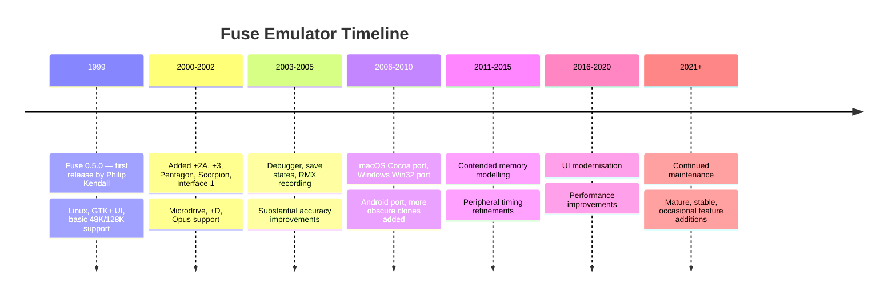

[← Home](../../README.md) · [Software Emulators](README.md)

# Fuse — The Free Unix Spectrum Emulator

**Fuse** (Free Unix Spectrum Emulator) is the workhorse cross-platform ZX Spectrum emulator. Originally developed for Linux by **Philip Kendall** in **1999**, Fuse has since been ported to macOS, Windows, Android, and several other platforms. It is **open-source** (GPLv2+), actively maintained by a community of contributors, and forms the basis of several derivative projects including the browser-based **JSSpeccy** and various embedded ports.

Fuse's longevity, accuracy, and permissive licensing have made it the **standard reference** for Spectrum emulation. Many other emulators use Fuse's `libspectrum` library for file format handling, and Fuse's hardware behavior is widely documented as a reference for emulator authors. For cross-platform users wanting a reliable, accurate, free Spectrum emulator, Fuse is almost always the right choice.

This article covers Fuse's history, architecture, hardware coverage, debugging and development tools, derivative projects, and place in the Spectrum ecosystem. For comparison with other emulators, see [emulator_comparison.md](emulator_comparison.md). For technical discussion of accuracy, see [cycle_exact_accuracy.md](cycle_exact_accuracy.md).

---

## History

### Origins (1999)

Fuse was created in **1999** by **Philip Kendall**, a British software developer who was dissatisfied with the existing Spectrum emulators on Linux. The Linux Spectrum emulation scene in the late 1990s was fragmented: several emulators existed (x128, Speccy, others), but most were incomplete, abandoned, or non-free. Kendall wanted to create an emulator that was:

- **Free software** (GPL) — to ensure long-term availability and community contributions
- **Cross-platform** — based on Unix, but portable to other operating systems
- **Accurate** — focused on faithful hardware reproduction, not just running games
- **Comprehensive** — covering the full range of Sinclair and clone hardware

The first public release of Fuse was version 0.5.0, in late 1999. From the start, Fuse was designed as a serious emulator — not just for casual gaming, but for software development, hardware research, and preservation.

### Development Through the 2000s and 2010s

Fuse development has been continuous since 1999, with releases roughly every 6–12 months. Key milestones:

- **2000–2002** — added support for 128K, +2, +2A, +3, Russian clones (Pentagon, Scorpion), Interface 1, microdrives, +D, Opus disk interfaces
- **2003–2005** — added the debugger, save states, RMX recording, substantially improved accuracy
- **2006–2010** — ported to macOS (native Cocoa UI), Windows (Win32 UI), and Android; added more obscure clones (Brazilian Spectrum clones, Inves Spectrum+)
- **2011–2015** — major accuracy improvements, contended memory modeling, peripheral timing refinements
- **2016–2020** — UI modernisation, bug fixes, performance improvements
- **2021+** — continued maintenance, occasional feature additions

Fuse's release cadence has slowed in recent years — the core emulation is mature, and major changes are rare. The project is still active, with bug fixes and small improvements regularly.

### The Fuse Ecosystem

Fuse has spawned or influenced several derivative projects:

- **JSSpeccy** — a JavaScript/WebAssembly port of Fuse, runs in any modern browser
- **SpeccySDL** — an SDL-based Fuse variant, used for embedded systems and Linux distributions
- **Fuse Android** — Android port maintained separately
- **libspectrum** — Fuse's library for handling Spectrum file formats (`.tap`, `.tzx`, `.z80`, `.sna`, `.szx`, etc.), used by many other emulators as well

The `libspectrum` library is particularly significant — it abstracts file format parsing away from the emulator core, allowing other projects (including commercial ones, under the LGPL) to use Fuse's mature file format handling.

---

## Architecture

### Modular Design

Fuse is structured as a **modular emulator** with clean separation between components:

- **Emulator core** — the Z80 CPU, ULA, memory banking, and timing logic
- **`libspectrum`** — file format parsing, save state serialization, low-level utility functions
- **UI layer** — the user interface (GTK+, Cocoa, Win32, SDL, etc.)
- **Audio output** — sound generation and host audio output
- **Input handling** — keyboard, joystick, mouse
- **Peripheral modules** — Interface 1, microdrives, +D, Opus, etc.

This modular design has been crucial to Fuse's longevity. The core emulator logic is independent of the UI layer, so porting Fuse to a new platform only requires writing a new UI binding — the emulator core, file format handling, and hardware logic all work unchanged. This is why Fuse has been successfully ported to so many platforms.

### The `libspectrum` Library

`libspectrum` is Fuse's library for handling Spectrum-related file formats. It is released under the LGPL (allowing commercial use with dynamic linking), and supports:

| Format | Purpose |
|---|---|
| `.tap`, `.tzx` | Tape images (TAP and TZX formats) |
| `.z80`, `.sna` | Snapshot files |
| `.szx` | Spectaculator snapshot format |
| `.sp`, `.zxs` | Various snapshot formats |
| `.dsk`, `.img` | Disk images (+3 DOS, TR-DOS) |
| `.mgt`, `.mdr` | Microdrive images |
| `.scr` | Screenshot files |
| `.p`, `.o` | BASIC/assembly patches |
| `.pzx` | PZX tape format |

Because `libspectrum` is a separate library, other emulator projects can use it without adopting all of Fuse. This has been widely adopted — `libspectrum` is used by ZEsarUX (partially), JSSpeccy, and various smaller projects.

### Memory Model and Banking

Fuse models the Spectrum's memory with cycle-accurate banking:

- **48K model** — straightforward 16K ROM + 48K RAM
- **128K, +2, +2A, +3** — paged RAM with the standard 128K banking scheme
- **Pentagon** — Russian 128K clone with different banking and timing
- **Scorpion** — Russian 256K clone
- **+3e** — extended +3 with extra RAM options

Each model has its own memory map, banking register layout, and timing characteristics. Fuse's `machine.c` module defines each machine's behavior.

### Audio and Timing

Fuse's audio generation is sample-accurate, producing a stereo waveform at 44.1 kHz (configurable). The audio is generated in sync with the emulator's cycle-accurate timing, so audio glitches indicate timing bugs in the emulator (or the original software using undocumented audio behavior).

For video, Fuse can run at 50 Hz (PAL standard) or synchronize to the host display (typically 60 Hz). The frame rate conversion and audio resampling required for host synchronization are covered in [cycle_exact_accuracy.md](cycle_exact_accuracy.md).

---

## Hardware Coverage

### Sinclair Models

Fuse supports the complete range of Sinclair Spectrum models:

| Model | RAM | Notes |
|---|---|---|
| **ZX Spectrum 16K** | 16K | The original 1982 launch model |
| **ZX Spectrum 48K** | 48K | The 1982/1983 mass-market model |
| **ZX Spectrum 128K** ("toastrack") | 128K | The 1986 Spanish/UK 128K model |
| **ZX Spectrum +2** (grey) | 128K | 1987 Amstrad-era, integrated tape |
| **ZX Spectrum +2A** (black) | 128K | 1987 revised +2 with +3 ROMs |
| **ZX Spectrum +3** | 128K | 1987, integrated 3" disk drive |
| **ZX Spectrum +3e** | 128K–576K | Extended +3 by Garry Lancaster |

Each model has correct timing, memory map, ROM contents, and peripheral behavior.

### Clones

Fuse supports a wide range of clones:

- **Pentagon 128/512/1024** — Russian clones with non-standard video timing
- **Scorpion 256/1024** — Russian clones with different banking
- **Inves Spectrum+ 48K** — Spanish clone with subtle differences from Sinclair original
- **TK90X, TK95** — Brazilian clones
- **Microdigital TK95** — Brazilian clone variant
- **BaseConf-like** — TSConf-style modern clones (limited support)

### Peripherals

Fuse's peripheral support is one of its strongest features:

| Peripheral | Status |
|---|---|
| **Interface 1** | ✅ Microdrives, RS-232, ZX Net |
| **Microdrive** | ✅ Up to 8 cartridges, with proper timing |
| **ZX Net** | ✅ Network between multiple Fuse instances |
| **Kempston joystick** | ✅ At I/O port `#1F` |
| **Sinclair joysticks 1 & 2** | ✅ |
| **Fuller joystick** | ✅ |
| **Currah µSpeech** | ✅ Speech synthesiser |
| **Melodik** | ✅ AY sound interface for 48K |
| **SpecDrum** | ✅ Drum machine |
| **+D disk interface** | ✅ |
| **Opus Discovery** | ✅ |
| **Multiface 1/128/+3** | ✅ |
| **Beta 128** | ✅ Russian disk interface |
| **DivIDE / DivMMC** | ✅ Modern SD-based storage |
| **ZX Spectrum Next** | ❌ Not supported |

The absence of ZX Spectrum Next support is one of Fuse's few limitations — Fuse focuses on original Sinclair and clone hardware, not modern Spectrum-compatible machines. For Next development, use **CSpect** or **ZEsarUX**.

---

## Debugger and Development Tools

### The Fuse Debugger

Fuse includes a built-in **Z80 debugger** that exposes the running emulator's state. The debugger provides:

- **Register view** — primary registers (A, B, C, D, E, H, L), alternate registers (A', B', etc.), index registers (IX, IY), special registers (PC, SP, I, R), and flags (S, Z, YF, HF, XF, PV, NF, CF)
- **Disassembly view** — current location plus surrounding code, with the option to follow PC
- **Memory view** — hex dump of any memory location, with byte/word editing
- **Breakpoints** — execution breakpoints (break at PC), memory access breakpoints (break on read/write to a specific address), and I/O breakpoints (break on I/O port access)
- **Watchpoints** — monitor specific memory locations for changes
- **Stepping** — single-step, step-over, step-out, run-to-cursor

The debugger is invoked from the menu (`Machine → Debugger`) or with a hotkey, and pauses the emulator. While paused, the user can inspect state, modify registers, change memory, set breakpoints, and resume execution.

### RMX Recording and Playback

Fuse supports **RMX (Recorder Markup XML)** files — a format for recording verified speedruns. An RMX file contains:

- The input events (keystrokes, joystick movements) the user made
- The exact frame timing of each input
- A checksum of the emulator state at recording start

When an RMX file is played back, Fuse loads the starting state and replays the recorded inputs in lockstep with the emulator. Because the emulator is deterministic (given the same inputs and starting state, it always produces the same output), playback is bit-for-bit identical to the original run.

RMX files are used by:

- **Speedrun archives** — competitive speedrun sites (e.g., Speed Demos Archive) use RMX or similar formats for verified runs
- **Bug reproduction** — when reporting an emulator bug, users can attach an RMX file that reliably triggers the bug
- **Demoscene productions** — some demos are distributed as RMX files that, when played back, reproduce the demo on the viewer's emulator

### Save States

Fuse supports save states in multiple formats:

- **`.szx`** — Spectaculator format, cross-compatible with Spectaculator
- **`.z80`** — the classic Z80 snapshot format (multiple variants)
- **`.sna`** — the SNA snapshot format
- **`.pzx`** — PZX-based save state (with embedded tape image)

Save states capture the complete emulator state at a point in time: CPU registers, memory contents, peripheral state, even the position within an executing tape load. This makes them useful for checkpointing progress in long games or for studying specific software states.

### Tape and Disk Loading

Fuse's tape loading supports:

- **TAP files** — standard Spectrum tape images, with proper loading sounds
- **TZX files** — enhanced tape format with precise timing information
- **PZX files** — another enhanced tape format
- **WAV files** — audio recordings of original tapes, with the emulator performing tape-style loading
- **CSW files** — compressed square wave format

For disk images, Fuse supports:

- **DSK** — standard +3 disk image
- **IMG** — alternative disk image format
- **TRD** — TR-DOS disk image (for Russian clones)
- **SCL** — Russian disk layout format

Loading from tape is faithful — the user sees the familiar colored loading stripes, hears the loading screech, and waits (or accelerates) just as on real hardware.

---

## Derivative Projects

### JSSpeccy

**JSSpeccy** is a port of Fuse to JavaScript and WebAssembly, allowing it to run in any modern web browser. JSSpeccy has been used by several websites to provide browser-based Spectrum emulation:

- **JSSpeccy project site** — hosts the emulator with a curated library of public-domain Spectrum software
- **Embedded in various Spectrum-related websites** — many archive sites use JSSpeccy to let visitors try software without installing an emulator
- **Educational use** — JSSpeccy is used in classrooms and coding workshops where installing software is impractical

JSSpeccy retains Fuse's accuracy and supports most of the same hardware. Its performance in modern browsers is excellent thanks to WebAssembly.

### Fuse on Android

The Android port of Fuse is maintained by a separate team and is the standard Spectrum emulator on Android. It supports:

- On-screen keyboard overlay
- Customisable touch controls for joystick
- Save states
- Loading from SD card or cloud storage
- Bluetooth keyboard support (for serious use)

The Android port is suitable for casual gaming but less suited for development work due to the limitations of a touch interface.

### Embedded / SDL Ports

The SDL variant of Fuse (SpeccySDL) is used as the basis for:

- **Linux distribution packages** — Fedora, Debian, Ubuntu, Arch all package Fuse
- **Embedded systems** — Raspberry Pi, retro handheld consoles (GP2X, Pandora, Anbernic devices)
- **Custom builds** — developers who want a headless Fuse (e.g., for automated testing)

---

## Performance

Fuse's performance is excellent on any modern computer — it can comfortably run at 50 Hz (or faster) on hardware from the last 15+ years. On low-end devices (Raspberry Pi Zero, single-board computers), Fuse runs at full speed with modest CPU usage. Fuse's optimization strategy focuses on:

- **Cycle-accurate interpretation** of the Z80 (no dynamic recompilation)
- **Efficient event scheduling** — only peripherals that need cycle-accurate updates are called per cycle
- **Lazy screen updates** — only redraw the parts of the screen that have changed
- **Audio generation in batches** — generate several milliseconds of audio per call, rather than per cycle

For most users, Fuse's performance is "free" — it uses negligible CPU on any modern machine. For embedded or low-power use, Fuse is one of the more efficient Spectrum emulators available.

---

## FAQ

**Q: How do I install Fuse?**

A: On Linux, Fuse is typically in your distribution's package manager (`sudo apt install fuse-emulator-gtk` or `sudo dnf install fuse`). On macOS, there's a native Cocoa build distributed as a `.dmg`. On Windows, there's an installer on the Fuse website. On Android, search for "Fuse Spectrum" in the Play Store.

**Q: Why does Fuse not support the ZX Spectrum Next?**

A: The Next is a modern Spectrum-compatible machine with substantially enhanced hardware (Z80N CPU, layer 2 graphics, hardware sprites, WiFi, etc.). Supporting the Next would require significant new development effort, and the Next already has dedicated emulators (**CSpect**, **ZEsarUX**) that focus on it. The Fuse team has chosen to focus on the original Sinclair and clone hardware rather than spread their effort across the Next's much larger feature set.

**Q: How accurate is Fuse?**

A: Fuse passes the standard test suites (ZEXALL, ZEXDOC, the FUSE test suite, Pentagon Diag ROM — see [test_suites.md](test_suites.md)) for the hardware it supports. Real-world accuracy is excellent — virtually all original Spectrum software runs correctly. The remaining edge cases are obscure timing quirks that even real hardware varies on (different Z80 manufacturers, different board revisions).

**Q: Can I use Fuse to develop new Spectrum software?**

A: Yes — Fuse is widely used for Spectrum software development. The debugger, save states, and broad peripheral support make it suitable for assembly development, BASIC development, and hardware research. Pair Fuse with a cross-assembler (like **z88dk**, **sjasmplus**, or **zasm**) for a complete development workflow.

**Q: Does Fuse support multiplayer games via ZX Net?**

A: Yes — multiple Fuse instances can be linked over a network (real Internet or localhost) to emulate ZX Net between them. This is a faithful emulation of the original ZX Net hardware, including the polling-based MAC protocol. See [zx_net.md](../../03_io/networking/zx_net.md) for the underlying protocol.

**Q: Is Fuse's source code available?**

A: Yes — Fuse is GPLv2+ open source. The source is on SourceForge at `https://sourceforge.net/projects/fuse-emulator/`. Contributions are welcome via patches submitted to the mailing list or bug tracker.

**Q: What's the difference between Fuse and Spectaculator?**

A: **Fuse** is free, open-source, and cross-platform (Linux/macOS/Windows/Android). **Spectaculator** is commercial, Windows-only, but has a more polished UI and slightly better Windows integration. For most users, the choice comes down to platform (Spectaculator on Windows, Fuse elsewhere) and whether you prefer free software or commercial polish.

**Q: Can I use Fuse's libspectrum in my own project?**

A: Yes — `libspectrum` is LGPL, which means you can dynamically link to it from commercial software. Static linking or modification requires you to release the modified `libspectrum` source under the LGPL. Many other emulator projects use `libspectrum` for file format handling.

---

## Summary

Fuse is the **workhorse cross-platform Spectrum emulator** — the standard choice for users who want a reliable, accurate, free emulator that runs on their platform of choice. With 25+ years of development behind it, Fuse has accumulated comprehensive hardware coverage, mature debugging tools, and excellent performance. Its modular architecture has made it the basis for a whole ecosystem of derivative projects, including the browser-based JSSpeccy, the Android port, and various embedded builds.

Fuse's main limitation — lack of ZX Spectrum Next support — reflects its focus on original Sinclair and clone hardware rather than modern Spectrum-compatible machines. For Next work, use CSpect or ZEsarUX. For everything else (48K, 128K, +2, +2A, +3, Pentagon, Scorpion, Inves, TK90X, etc.), Fuse is the right choice.

For further reading, see the other emulator deep-dives: [zesarux.md](zesarux.md) for the broadest clone coverage and most advanced debugging, [cspect.md](cspect.md) for ZX Spectrum Next development, and [emulator_comparison.md](emulator_comparison.md) for a side-by-side comparison of all the major options.

---

## References

### Primary Sources

- [Fuse website](https://fuse-emulator.sourceforge.net/) — `http://fuse-emulator.sourceforge.net/`
- [Fuse source code on SourceForge](https://fuse-emulator.sourceforge.net/) — `https://sourceforge.net/projects/fuse-emulator/`
- **`libspectrum` documentation** — file format support and library API
- **Fuse manual** — comprehensive user documentation

### Community

- [Fuse mailing list](https://fuse-emulator.sourceforge.net/) — `fuse-emulator-discuss@lists.sourceforge.net`
- [World of Spectrum forums](https://worldofspectrum.org/) — community discussion of Fuse and other emulators
- [comp.sys.sinclair](https://groups.google.com/g/comp.sys.sinclair) Usenet archives — historical discussions of Fuse development

### Test Results and Validation

- **Fuse's test results** — published on the Fuse project site, showing which tests pass in each release
- **The FUSE test suite** — used by Fuse for regression testing (see [test_suites.md](test_suites.md))

### Cross-References

- [Emulator Comparison](emulator_comparison.md) — [Fuse vs other emulator](https://fuse-emulator.sourceforge.net/)s
- [Cycle-Exact Accuracy](cycle_exact_accuracy.md) — technical challenges Fuse solves
- [Test Suites](test_suites.md) — validation programs Fuse passes
- [[ZEsarUX](https://github.com/chernandezba/zesarux)](zesarux.md) — alternative emulator with broader clone coverage
- [CSpect](cspect.md) — alternative emulator with ZX Spectrum Next support
