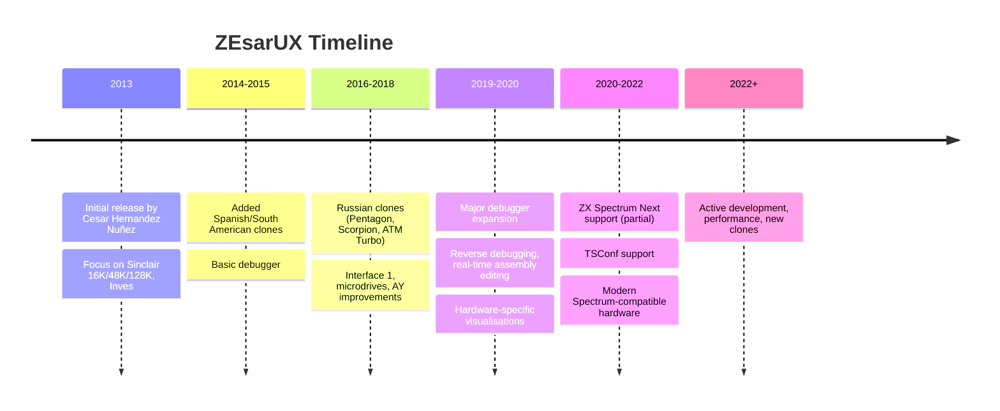

[← Home](../../README.md) · [Software Emulators](README.md)

# ZEsarUX — The Reverse Engineering and Clone Coverage Emulator

**ZEsarUX** (ZX Spectrum Emulator Revised And Universal eXtension) is a cross-platform ZX Spectrum emulator developed by **Cesar Hernandez Nuñez** (known online as **chernandezba**). Started in **2013**, ZEsarUX has become the emulator of choice for **reverse engineering**, **broad hardware coverage**, and **advanced debugging**. Where **Fuse** (see [fuse.md](fuse.md)) is the workhorse for general use, ZEsarUX is the specialist's tool — capable of emulating obscure clones that no other emulator handles, with debugging features that go far beyond what other emulators offer.

ZEsarUX is open-source (GPLv3) and runs on Linux, macOS, and Windows. It supports not only the standard Sinclair models (16K/48K/128K/+2/+2A/+3) but also a vast range of clones (Pentagon, Scorpion, Inves, TK90X, TK95, ATM Turbo, Chrome, BaseConf, TSConf) and the **ZX Spectrum Next**. Its debugger offers features found in no other Spectrum emulator — including **reverse debugging** (stepping backward through execution), **real-time assembly editing**, and **hardware-specific visualisations**.

This article covers ZEsarUX's history, architecture, the breadth of its hardware coverage, its distinctive debugging tools, and its place in the Spectrum ecosystem. For comparison with other emulators, see [emulator_comparison.md](emulator_comparison.md).

---

## History

### Origins (2013)

ZEsarUX was started in **2013** by Cesar Hernandez Nuñez, a Spanish developer with a particular interest in Spectrum clones and reverse engineering. The early versions of ZEsarUX focused on:

- **Faithful emulation of original Sinclair hardware** — getting the 48K and 128K models cycle-exact
- **Coverage of Spanish clones** — the Inves Spectrum+ (a Spanish 48K clone with subtle differences from the Sinclair original)
- **Comprehensive debugging** — Nuñez wanted an emulator that could be used as a serious reverse engineering tool, not just for gaming

The name ZEsarUX reflects this focus: **ZX Spectrum Emulator Revised And Universal eXtension** — "Revised" (re-thought from existing emulators), "Universal" (covering many hardware variants), and "eXtension" (extensible through plugins and configurations).

### Development Through the 2010s and 2020s

ZEsarUX development has been continuous and active. Key milestones:

- **2013–2015** — initial releases, focus on Sinclair 16K/48K/128K, Inves, basic debugger
- **2016–2018** — added Russian clones (Pentagon, Scorpion, ATM Turbo), Interface 1, microdrives, AY audio improvements
- **2019–2020** — major debugger expansion: reverse debugging, real-time assembly editing, hardware-specific visualisations
- **2020–2022** — ZX Spectrum Next support (partial), TSConf support, modern Spectrum-compatible hardware
- **2022+** — ongoing development, performance improvements, new clone support

ZEsarUX is one of the most actively-developed Spectrum emulators, with releases every few months. Nuñez is responsive to user feedback and frequently adds support for new hardware variants.

### Why ZEsarUX Exists

ZEsarUX was created to fill gaps that other emulators didn't cover:

- **Reverse engineering** — existing emulators had debuggers, but none had the depth of features that serious reverse engineering requires
- **Clone coverage** — the Russian scene had UnrealSpeccy, but Western emulators (Fuse, Spectaculator) didn't cover Russian clones comprehensively
- **Hardware research** — documenting the behavior of obscure clones requires an emulator that can model them accurately

ZEsarUX has been particularly important for the **demoscene preservation** effort — many classic Russian demos use hardware tricks that only ZEsarUX models correctly, and ZEsarUX has been used to verify that these demos behave as intended.

---

## Hardware Coverage — The Broadest in the Scene

ZEsarUX's distinguishing feature is the **breadth of hardware it emulates**. No other Spectrum emulator comes close in clone coverage. The full list (as of recent versions) includes:

### Sinclair Models

| Model | RAM | Notes |
|---|---|---|
| **ZX Spectrum 16K** | 16K | Original 1982 launch model |
| **ZX Spectrum 48K** | 48K | 1982/1983 mass-market model (multiple issue revisions) |
| **ZX Spectrum 128K** ("toastrack") | 128K | 1986 Spanish/UK 128K |
| **ZX Spectrum +2** (grey) | 128K | 1987 Amstrad-era |
| **ZX Spectrum +2A** (black) | 128K | 1987 revised +2 with +3 ROMs |
| **ZX Spectrum +3** | 128K | 1987, integrated 3" disk drive |

### Clones — Spanish and South American

| Clone | Country | Notes |
|---|---|---|
| **Investrónica Inves Spectrum+ 48K** | Spain | Spanish 48K clone with subtle ULA differences |
| **Microdigital TK90X** | Brazil | Brazilian 48K clone |
| **Microdigital TK95** | Brazil | Brazilian 48K clone, TK90X successor |
| **Microdigital TK95-2** | Brazil | Further TK95 variant |

### Clones — Russian

| Clone | RAM | Notes |
|---|---|---|
| **Pentagon 128** | 128K | The standard Russian clone; non-standard video timing |
| **Pentagon 512** | 512K | Extended Pentagon |
| **Pentagon 1024** | 1 MB | Maximum-spec Pentagon |
| **Scorpion 256** | 256K | Russian clone with different banking |
| **Scorpion 1024** | 1 MB | Extended Scorpion |
| **ATM Turbo 1/2** | 256K–1 MB | Russian clone with enhanced graphics modes |
| **Profi 5103** | 512K | Russian clone |

### Modern Spectrum-Compatible Hardware

| Machine | Notes |
|---|---|
| **TSConf** | Modern Russian Spectrum-compatible spec (TS-Configuration) — high-resolution graphics, expanded memory, advanced features |
| **BaseConf** | Another modern configuration, similar to TSConf |
| **Chrome** | Russian modern Spectrum-compatible machine |
| **ZX-Uno** | Modern FPGA-based Spectrum-compatible — emulated as a virtual machine inside ZEsarUX |
| **ZX Spectrum Next** | Modern commercial Spectrum-compatible (partial support; full support is CSpect's domain) |

This list is approximately **double** the hardware coverage of any other single emulator. For researchers studying obscure clones or demoscene productions that target specific hardware, ZEsarUX is often the only option.

### Peripheral Support

ZEsarUX also models a wide range of peripherals:

- **Interface 1** — microdrives, RS-232, ZX Net
- **Microdrive** — up to 8 cartridges
- **Beta 128** — Russian disk interface
- **+D, Opus** — Western disk interfaces
- **DivIDE / DivMMC** — modern SD-based storage
- **Multiface 1/128/+3**
- **AY-3-8912** — sound chip with detailed register-level emulation
- **Currah µSpeech** — speech synthesiser
- **ZX Spectrum Next extensions** — layer 2 graphics, hardware sprites (partial)
- **TSConf peripherals** — modern peripherals for TSConf hardware

---

## Architecture

### Single-Source Codebase

Unlike Fuse's modular design with separate UI bindings, ZEsarUX is a **single-source codebase** that handles all platforms internally. The result is a more consistent feature set across platforms, but at the cost of more platform-specific code within ZEsarUX itself.

ZEsarUX is written in C, with platform-specific UI code for Linux (GTK+ and SDL), macOS (Cocoa), and Windows (Win32). The choice of UI is configurable at startup.

### Configuration Filesystem

ZEsarUX uses a sophisticated **configuration filesystem** that stores all emulator settings in a structured set of files. This includes:

- Machine type (48K, 128K, Pentagon, etc.)
- Peripheral configuration (which interfaces are connected)
- Memory configuration (RAM size, banking scheme)
- Video output (resolution, scaling, aspect ratio)
- Audio output (sample rate, AY volume, beeper volume)
- Input devices (keyboard layout, joystick type)
- Debugger settings (breakpoints, watchpoints)

The configuration system makes it easy to switch between different hardware configurations and to share configurations with other users.

### Snapshot and Save State Format

ZEsarUX supports standard snapshot formats (.z80, .sna, .szx) plus its own native format (.zesarux), which captures ZEsarUX-specific state (debugger breakpoints, configuration, etc.) that other formats don't include.

---

## The ZEsarUX Debugger — A Reverse Engineering Workstation

ZEsarUX's debugger is its most distinctive feature. While other emulators offer basic debugging (register view, disassembly, breakpoints), ZEsarUX offers a full **reverse engineering workstation**:

### Standard Debugging Views

- **Register view** — all Z80 registers (A, B, C, D, E, H, L, alternates, IX, IY, PC, SP, I, R), with flag bits (S, Z, YF, HF, XF, PV, NF, CF) shown both as bits and as mnemonics
- **Disassembly view** — current location with surrounding code; can follow PC automatically
- **Memory view** — hex dump with byte/word editing; supports viewing memory in different banks
- **Stack view** — current SP and stack contents

### Breakpoints and Watchpoints

ZEsarUX supports:

- **Execution breakpoints** — break at PC = address
- **Memory read/write breakpoints** — break on read or write to a memory address
- **I/O port breakpoints** — break on IN or OUT to a specific port
- **Conditional breakpoints** — break only if a register or memory location matches a specific value
- **Watchpoints** — monitor memory locations for changes without breaking

The conditional breakpoint feature is particularly powerful — you can break when (say) `register A = #42 AND register HL = #4000`, which is invaluable for tracking down specific code paths.

### Reverse Debugging

ZEsarUX's **reverse debugging** is its most innovative feature. When enabled, the emulator records execution history as the program runs, allowing the user to **step backward** through execution — undoing instructions, restoring register values, etc.

How it works:

1. The emulator maintains a circular buffer of recent state snapshots
2. When the user requests a reverse step, the emulator restores the previous state
3. The user can step backward, inspect state at any point, then resume forward execution

Reverse debugging is invaluable for:

- **Understanding crash causes** — step back from a crash to find the root cause
- **Tracking data flow** — see how a value was set, by working backward
- **Understanding protection schemes** — examine how copy protection code arrived at a particular state

Most other emulators don't offer reverse debugging; ZEsarUX is the standard tool for this in the Spectrum world.

### Real-Time Assembly Editing

ZEsarUX allows the user to **edit assembly code while the emulator is running**. The user can:

- Click on an instruction in the disassembly view
- Replace it with a new instruction (typed as assembly text)
- The new instruction is assembled in place, modifying memory
- Execution continues with the new code

This is invaluable for **patching software** — fixing bugs, removing copy protection, modifying game behavior — without having to exit, modify the source, reassemble, and reload.

### Hardware Visualisations

ZEsarUX offers visualisations of internal hardware state:

- **Memory map view** — see which RAM banks are paged in where
- **Video timing view** — see the current position in the video frame (raster position)
- **AY register view** — see all 14 AY registers with current values
- **Copper/logic analyser view** — for advanced hardware debugging
- **Layer 2 / tilemap view** — for Next-specific graphics debugging

These visualisations are particularly useful for understanding how the Spectrum's hardware actually works — students of the hardware find ZEsarUX's visualisations more educational than any textbook.

### Scripting

ZEsarUX supports **scripting** — automated sequences of debugger commands that can be replayed. This is useful for:

- **Automated testing** — write a script that loads a piece of software, sets breakpoints, and reports results
- **Batch analysis** — analyze many software titles automatically
- **Reproducible debugging** — share a script that reproduces a specific debugging session

### Memory Search

ZEsarUX can **search memory** for specific patterns — bytes, words, strings — and report all matches. This is essential for reverse engineering, where you need to find specific data structures (e.g., the player's health counter, the level layout, the password check routine).

---

## ZX Spectrum Next Support

ZEsarUX was the first non-Windows emulator to support the ZX Spectrum Next. While **CSpect** (see [cspect.md](cspect.md)) remains the reference Next emulator, ZEsarUX's Next support is substantial:

- **Z80N CPU** — full support for the Next's enhanced instruction set (new LD, EX, MUL, SWAPN, etc.)
- **Layer 2 graphics** — high-resolution graphics mode
- **Hardware sprites** — sprite engine with collision detection
- **Tilemap** — hardware tile-based graphics mode
- **Extended memory** — up to 2 MB RAM
- **Copper** — programmable video timing effects
- **ESP-12 WiFi** — partial support for the Next's WiFi subsystem

The Next support makes ZEsarUX useful for cross-platform Next development, particularly for users who prefer Linux or macOS over Windows.

---

## Use Cases

### Reverse Engineering Commercial Software

ZEsarUX is the standard tool for **reverse engineering commercial Spectrum software**:

- Crackers and trainers use it to understand copy protection and modify games
- Software preservationists use it to verify that archiving accurately captures original behavior
- Researchers studying Spectrum game development use it to examine how classic software was written

The combination of reverse debugging, real-time assembly editing, conditional breakpoints, and memory search makes ZEsarUX uniquely suited to this work.

### Demoscene Production

Demoscene developers use ZEsarUX for **testing and debugging demos**:

- Cycle-exact timing verification (especially for Russian clone demos)
- Hardware trick validation (multicolor effects, raster interrupts)
- Debugging crashes and glitches in complex effects

For demos targeting obscure hardware (ATM Turbo, TSConf, BaseConf), ZEsarUX is often the only emulator that can run them at all.

### Hardware Research and Documentation

Researchers documenting the Spectrum's hardware use ZEsarUX to:

- Study how specific clones differ from the Sinclair original
- Verify timing diagrams against actual behavior
- Document undocumented peripheral behaviors

The hardware visualisations and broad clone coverage make ZEsarUX essential for this work.

### ZX Spectrum Next Development

For Next developers on non-Windows platforms, ZEsarUX provides a viable alternative to CSpect. While CSpect is more polished and tracks the Next spec more closely, ZEsarUX's Next support is sufficient for most development tasks.

---

## FAQ

**Q: Why would I use ZEsarUX instead of Fuse?**

A: Use ZEsarUX if you need **reverse engineering tools** (reverse debugging, real-time assembly editing, memory search), if you work with **obscure clones** (Inves, TSConf, ATM Turbo, etc.), or if you need **ZX Spectrum Next support** on Linux/macOS. Use Fuse for general-purpose cross-platform emulation where its broader feature set (RMX recording, more polished UI) matters more.

**Q: How do I get started with ZEsarUX's reverse debugging?**

A: Enable the **reverse execution history** option in settings (it can be RAM-intensive), run your software until the bug or event you want to study, then use the **step back** command in the debugger. The emulator will undo one instruction at a time. You can also use **run backward** to undo many instructions quickly.

**Q: Does ZEsarUX have a GUI on Windows?**

A: Yes — ZEsarUX has a Windows UI that's functional but less polished than native Windows emulators like Spectaculator. The GUI is best described as "engineering-grade": it works, it's complete, but it's not pretty. Linux users will feel more at home.

**Q: Can ZEsarUX run Spectrum software that no other emulator can?**

A: In some cases, yes — particularly software targeting obscure Russian clones or modern Spectrum-compatible hardware like TSConf. For mainstream Spectrum software, ZEsarUX runs essentially everything that other major emulators run.

**Q: How does ZEsarUX's accuracy compare to Fuse?**

A: Both are highly accurate for the hardware they cover. ZEsarUX tends to have more up-to-date modeling of newer clones, while Fuse is sometimes considered more battle-tested for original Sinclair hardware. In practice, both pass the standard test suites for the hardware they claim to support.

**Q: Can I contribute to ZEsarUX?**

A: Yes — ZEsarUX is GPLv3 open source. The source is on GitHub at `https://github.com/chernandezba/zesarux`. Contributions, bug reports, and feature requests are welcome via the GitHub issue tracker.

**Q: Is ZEsarUX faster or slower than other emulators?**

A: Performance is comparable to other cycle-exact emulators. ZEsarUX runs at full speed on any modern computer. The reverse debugging feature can be RAM-intensive (it stores execution history), so you may want to disable it for performance-critical use.

**Q: Does ZEsarUX support ZX Net (the 1983 Sinclair LAN)?**

A: Yes — ZEsarUX can link multiple instances over a real network to emulate ZX Net, similar to Fuse. See [zx_net.md](../../03_io/networking/zx_net.md) for the underlying protocol.

---

## Summary

ZEsarUX is the **specialist's Spectrum emulator** — the right choice when you need to go beyond casual gaming. Its reverse engineering tools (reverse debugging, real-time assembly editing, conditional breakpoints, memory search) are unmatched in the Spectrum world. Its hardware coverage is the broadest of any emulator, including many clones and modern Spectrum-compatible machines that no other emulator models.

For casual users, Fuse or Spectaculator may be simpler choices — ZEsarUX's UI is functional rather than polished, and its huge array of options can be overwhelming. But for serious work — reverse engineering, demoscene production, hardware research, Next development on non-Windows platforms — ZEsarUX is the right tool.

Combined with Fuse (general-purpose emulation), CSpect (Next reference), and Spectaculator (Windows polish), the modern Spectrum emulator ecosystem covers essentially every use case. ZEsarUX fills the niche of "I need the most powerful debugging tools" — and fills it superbly.

---

## References

### Primary Sources

- **ZEsarUX website** — `https://github.com/chernandezba/zesarux`
- **ZEsarUX documentation** — extensive wiki and help files
- **ZEsarUX releases** — prebuilt binaries for Linux, macOS, Windows
- **Cesar Hernandez Nuñez's blog and tutorial videos** — many reverse engineering walkthroughs

### Community Resources

- **ZEsarUX GitHub issues** — bug reports, feature requests, community discussion
- **World of Spectrum forums** — ZEsarUX discussions
- **ZX Spectrum Discord / Telegram groups** — community support

### Reverse Engineering Resources

- Various tutorials and write-ups that use ZEsarUX for specific analysis tasks
- Demoscene productions that document ZEsarUX-specific behaviors

### Cross-References

- [Emulator Comparison](emulator_comparison.md) — ZEsarUX vs other emulators
- [Cycle-Exact Accuracy](cycle_exact_accuracy.md) — accuracy challenges ZEsarUX addresses
- [Test Suites](test_suites.md) — tests ZEsarUX passes
- [Fuse](fuse.md) — the workhorse alternative
- [CSpect](cspect.md) — the Next reference emulator
