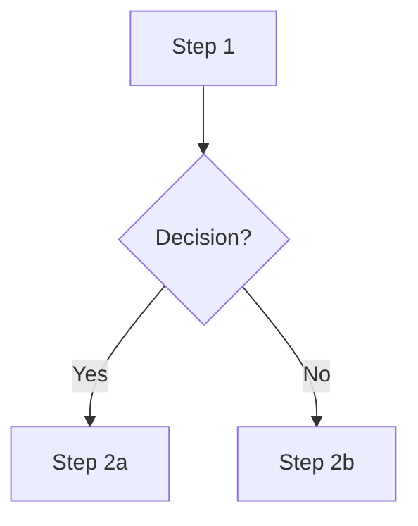

# SVG Diagram Guide — Technical Diagrams for the ZX Spectrum Knowledge Base

This guide describes the design system, layout principles, and workflow for producing technical SVG diagrams that accompany articles in this knowledge base.

---

## Why SVG (Not Mermaid)

Mermaid is excellent for flowcharts and sequence diagrams, but it cannot produce:

- **Proportional memory maps** — where block height reflects byte count
- **Precise spatial layouts** — pixel-accurate positioning of overlapping regions
- **Callout magnifications** — zoomed detail panels linked to small regions
- **Cross-region arrows** — curved paths between specific blocks in different columns

When the diagram needs spatial precision or proportional representation, use hand-crafted or generator-produced SVG instead of Mermaid.

Use Mermaid for: flow charts, decision trees, process sequences.
Use SVG for: memory maps, register bitfields, hardware block diagrams, timing diagrams.

---

## Design System — Catppuccin Mocha

All diagrams use the Catppuccin Mocha palette for consistency. The palette provides semantic meaning through color assignment:

### Background & Structure

| Role | Name | Hex | Used for |
|------|------|-----|----------|
| Background | `base` | `#1e1e2e` | Canvas background |
| Column/panel | `surface0` | `#313244` | Column panels, large containers |
| Block fill | `surface1` | `#45475a` | Content blocks, regular regions |
| Border | `surface2` | `#585b70` | Column borders |
| Dim border/text | `overlay0` | `#6c7086` | Inactive borders, address labels, ghost regions |

### Text

| Role | Name | Hex | Used for |
|------|------|-----|----------|
| Body text | `overlay2` | `#9399b2` | Descriptions, size annotations |
| Block title | `subtext0` | `#a6adc8` | Section names inside blocks |
| Bright text | `text` | `#cdd6f4` | Main title, legend labels |

### Semantic Colors (Highlights)

| Meaning | Name | Hex | When to use |
|---------|------|-----|-------------|
| Source / origin | `yellow` | `#f9e2af` | Where data/code originates |
| Destination / target | `green` | `#a6e3a1` | Where data/code is copied/stored |
| Critical / danger | `red` | `#f38ba8` | Arrows, critical variables, warnings |
| Section 0 (ROM/page 0) | `blue` | `#89b4fa` | Column headers for ROM, first page |
| Section 1 (page 1) | `green` | `#a6e3a1` | Column headers for RAM page 1 |
| Section 2 (page 2) | `sky` | `#89dceb` | Column headers for page 2 |
| Section 3 (page 3) | `mauve` | `#cba6f7` | Column headers for page 3 |
| Warning / caution | `peach` | `#fab387` | Warnings, temporary states |
| Data / registers | `teal` | `#94e2d5` | Register values, data fields |

### Typography

```
Font stack: 'Menlo', 'Consolas', 'Courier New', monospace
Title:      14px bold   fill: text
Subtitle:   9px         fill: overlay2
Col header: 11px bold   fill: (semantic color)
Block title: 10px bold  fill: subtext0 or highlight color
Body text:   8px        fill: overlay2
Small label: 7px        fill: overlay0
Address:     8px        fill: overlay0
```

### Geometry

- All rectangles: `rx=3` (slightly rounded corners), `rx=4` for large panels
- Column padding: 10px inner margin
- Section gap: 2px between blocks
- Arrow stroke width: 2.5px for main flow, 1.5px for secondary
- Minimum block height: 6px (for visibility), practical minimum 10px for labeled blocks

---

## Layout Principles

### 1. Vertical Memory Maps

When showing Z80 address space or memory page contents:

- **#0000 at top, max address at bottom** — this matches how engineers read hex dumps
- One column per memory page/slot (e.g., Page 0, Page 1, Page 2, Page 3)
- Block height **proportional to byte count** — 82 bytes in 16384 is shown as a tiny stripe, not a full block
- Use `min_height` to ensure tiny regions remain visible and labeled
- Add a **scale note** below each column ("Bridge = 0.5% of ROM") so the reader understands the exaggeration

### 2. Highlighted Regions

- Use `fill_opacity=0.25` + a colored 2px border for highlighted blocks
- The highlight color should match the semantic meaning (yellow=source, green=destination, red=critical)
- Non-highlighted blocks use `surface1` fill with `overlay0` borders

### 3. Arrows and Data Flow

- Curved arrows (`cubic bezier`) between columns look cleaner than straight lines
- Use dashed strokes (`stroke-dasharray="6,3"`) for copy/transfer operations
- Label the arrow with the operation name and size (e.g., "LDIR ~82 bytes")
- Arrow color should match the semantic meaning (red for critical, green for data flow)

### 4. Callout / Magnified Views

When a region is too small to label in the proportional column:

- Add a **magnified panel** below the main diagram
- Draw **connector lines** (dashed, thin) from the small region to the callout
- Show the detail at a readable scale with individual blocks labeled
- The callout uses the same color scheme as the main diagram

### 5. Legend

Always include a legend at the bottom that explains:
- Each highlight color and its meaning
- Any special visual conventions (dashed borders = inactive/switchable)

---

## Workflow

### Option A: Generator (Repetitive / Template Diagrams)

For memory map diagrams that follow the column-section-arrow pattern:

```bash
# 1. Create or copy a config JSON
cp tools/svg_gen/ram_bridge_config.json tools/svg_gen/my_config.json

# 2. Edit the config (columns, sections, arrows, colors)
# See tools/svg_gen/README.md for full config reference

# 3. Generate
python3 tools/svg_gen/gen_svg.py tools/svg_gen/my_config.json -o 05_development/assets/my_diagram.svg

# 4. Reference in markdown
# 
```

### Option B: Hand-Crafted SVG (One-Off / Complex Diagrams)

When the generator doesn't cover the case (register bitfields, timing diagrams, unusual layouts):

1. Start with the SVG boilerplate:
```xml
<svg xmlns="http://www.w3.org/2000/svg" viewBox="0 0 W H" font-family="'Menlo','Consolas','Courier New',monospace">
  <rect width="W" height="H" fill="#1e1e2e" rx="6"/>
  <text x="W/2" y="28" text-anchor="middle" fill="#cdd6f4" font-size="14" font-weight="bold">Title</text>
  <!-- Your diagram here -->
</svg>
```

2. Use the Catppuccin colors from the palette table above
3. Use monospace font throughout
4. Add section comments (`<!-- ===== SECTION NAME ===== -->`) for readability
5. Save to the article's `assets/` subdirectory

### Option C: Mermaid (Flow Charts, Sequences)

For process flows and decision trees where spatial precision doesn't matter:

```markdown

```

No style definitions, no `classDef`, no fill colors — just plain graph syntax.

---

## Markdown Integration Rules

1. **Always use `` tags** — not markdown `` syntax:
   ```html
   
   ```
2. **Never use data URIs** — GitHub sanitizes them
3. **Never use inline SVG** — bloats the markdown and breaks some renderers
4. **SVG files go in `assets/`** subdirectory of the article's section
5. **Set explicit width** — control the rendered size (typically 960px for wide diagrams)

---

## Common Patterns

### Pattern: Memory Map with Source → Destination

Two vertical columns, arrows between highlighted regions, magnified callout below.

Template: `tools/svg_gen/ram_bridge_config.json`

### Pattern: Register Bitfield

Horizontal strip divided into bit fields. Each field is a rectangle with bit range label and field name. Use `surface1` for reserved fields, highlight for important fields.

### Pattern: Hardware Block Diagram

Boxes connected by labeled buses/arrows. Each box is a hardware component (ULA, CPU, RAM, ROM). Use semantic colors per component type.

### Pattern: Timing Diagram

Horizontal time axis with signal lines. High/low states shown as stepped lines. Use `overlay0` for inactive, `text` for active. Duration annotations above.

---

## File Organization

```
tools/svg_gen/
├── README.md                  # Tool reference (config format, CLI)
├── gen_svg.py                 # Generator script
├── ram_bridge_config.json     # Template: memory map with arrows
└── (more templates...)

NN_section/
└── assets/
    └── diagram_name.svg       # Generated or hand-crafted output
```
